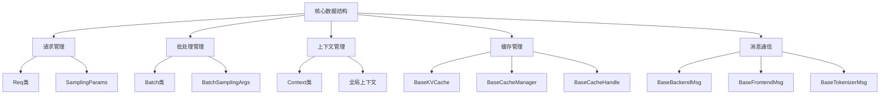
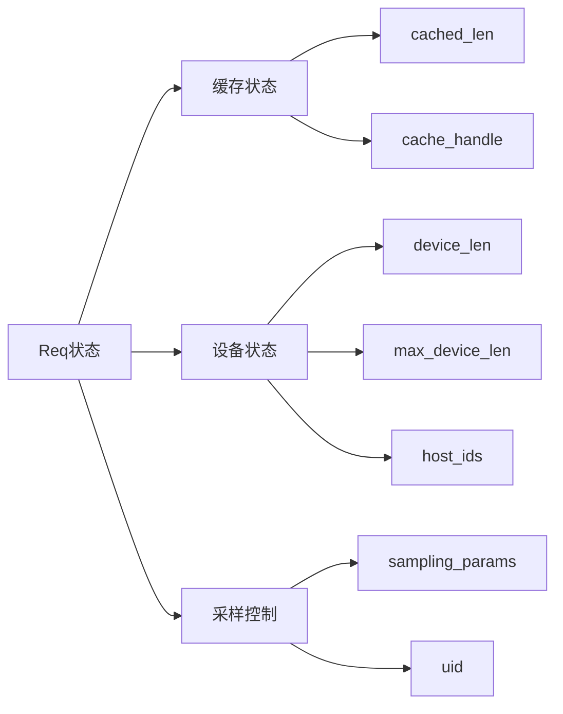
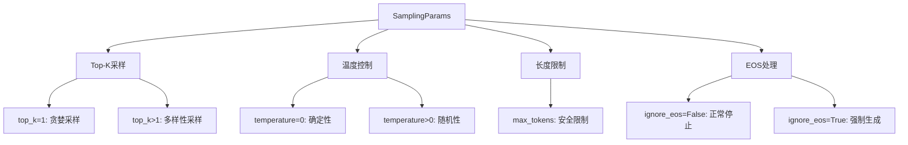
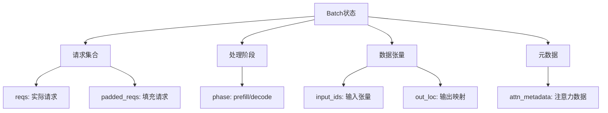
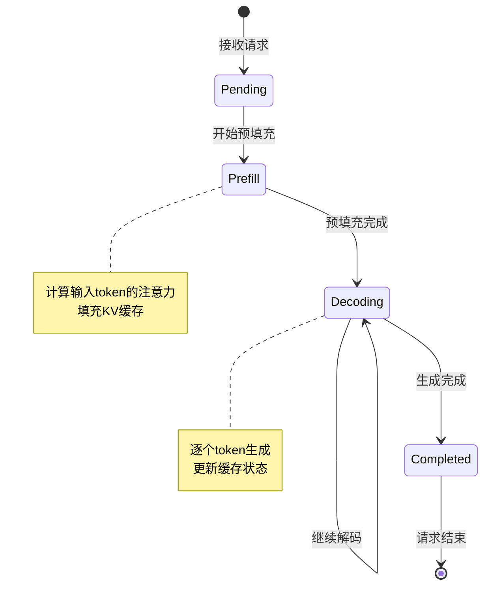
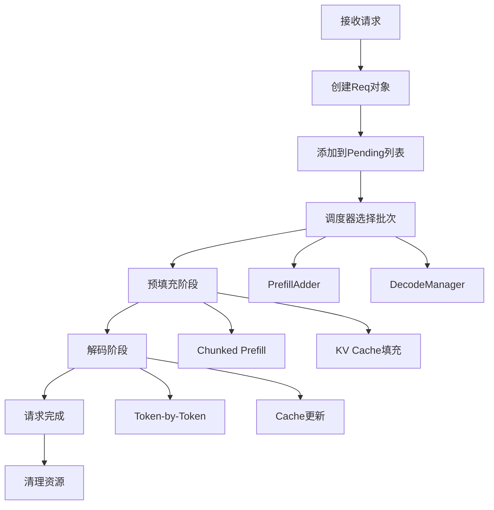
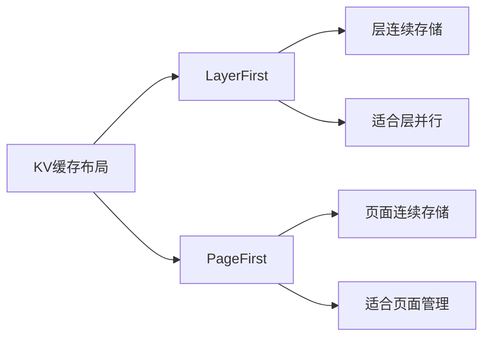
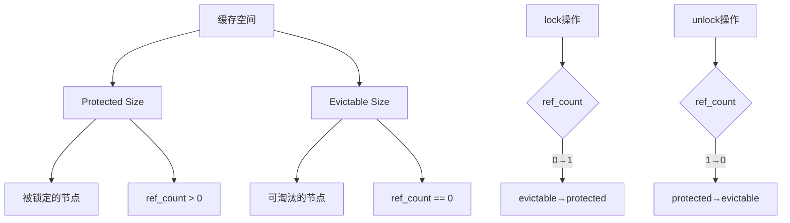
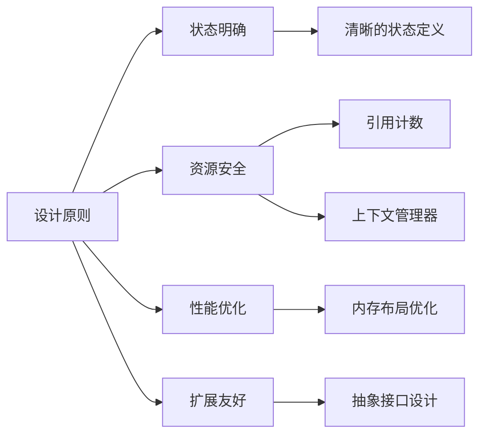

# 第二章：核心数据结构与上下文管理

## 本章学习目标

通过本章学习，你将了解：
- Mini-SGLang 的核心数据结构设计
- 请求生命周期管理和状态跟踪
- 全局上下文管理机制
- KV缓存的数据结构和接口设计
- 进程间通信的消息格式

## 核心概念速查表

| 术语 | 英文 | 解释 |
|------|------|------|
| **Req** | Request | 表示一个推理请求，包含输入 Token、生成状态、采样参数等信息。 |
| **Batch** | Batch | 一组同时处理的请求集合。在 Mini-SGLang 中，Batch 可以处于 Prefill 或 Decode 阶段。 |
| **Context** | Context | 全局上下文管理器，用于维护当前处理的 Batch、KV Cache 和 Attention Backend 等全局资源。 |
| **SamplingParams** | Sampling Parameters | 控制模型生成行为的参数集合，如温度（Temperature）、Top-K 等。 |
| **KV Cache** | Key-Value Cache | 存储 Transformer 模型中 Attention 层的 Key 和 Value 矩阵，用于加速自回归生成。 |
| **Radix Tree** | Radix Tree | 一种压缩前缀树，用于高效管理 KV Cache，支持前缀共享和快速查找。 |
| **引用计数** | Reference Counting | 一种内存管理技术，通过记录对象被引用的次数来决定是否回收内存。在 Radix Cache 中用于防止正在使用的缓存被驱逐。 |

## 背景知识

### LLM推理中的数据结构挑战

在LLM推理系统中，高效的数据结构设计至关重要：

1. **请求状态管理**：需要跟踪每个请求的输入、输出、缓存状态
2. **批处理优化**：动态批处理需要灵活的数据结构支持
3. **内存管理**：KV缓存需要高效的内存分配和回收机制
4. **分布式协调**：多进程间需要统一的数据格式和通信协议

### 关键设计原则

- **不可变性**：采样参数等配置信息应该不可变
- **引用计数**：缓存管理需要引用计数来避免竞争条件
- **类型安全**：使用类型注解确保数据一致性
- **序列化友好**：支持进程间通信的序列化需求

### 采样参数详解

采样参数决定了模型生成的随机性和多样性。理解这些参数对于控制模型输出至关重要：

- **Temperature (温度)**: 控制生成分布的平滑程度。
    - `temperature = 0`: 贪婪解码（Greedy Decoding），总是选择概率最高的 Token，结果确定。
    - `temperature > 0`: 增加随机性。值越高，低概率 Token 被选中的机会越大，输出越多样但可能越不连贯。
- **Top-K**: 仅从概率最高的 K 个 Token 中采样。
    - 减少了生成极低概率（通常是错误或无意义）Token 的风险。
- **Top-P (Nucleus Sampling)**: 仅从累积概率达到 P 的最小 Token 集合中采样。
    - 相比 Top-K，Top-P 可以动态调整候选集的大小。
- **Ignore EOS**: 是否忽略结束符（End of Sentence）。
    - 如果设为 True，模型将持续生成直到达到最大长度，常用于性能测试。

### Python 上下文管理器 (Context Manager)

Mini-SGLang 广泛使用 Python 的 `with` 语句和上下文管理器（`@contextmanager`）来管理资源。

```python
with context.forward_batch(batch):
    # 在此代码块内，全局上下文被设置为当前 batch
    model.forward()
# 退出代码块后，自动清理 batch 状态
```

这种模式确保了即使发生异常，资源（如全局 Batch 状态）也能被正确重置，避免污染后续请求。

## 核心数据结构概览



## 详细数据结构分析

### 1. 请求管理：Req类

#### 请求状态跟踪

```python
class Req:
    def __init__(
        self,
        *,
        input_ids: torch.Tensor,      # 输入token序列
        table_idx: int,              # 页面表索引
        cached_len: int,              # 已缓存长度
        output_len: int,              # 输出长度
        uid: int,                     # 唯一标识符
        sampling_params: SamplingParams, # 采样参数
        cache_handle: BaseCacheHandle, # 缓存句柄
    ):
        self.host_ids = input_ids     # CPU端token序列
        self.device_len = len(input_ids) # 设备端序列长度
        self.max_device_len = len(input_ids) + output_len # 最大长度
```

#### 关键属性说明



#### 状态转换方法

```python
@property
def remain_len(self) -> int:
    """剩余需要生成的token数量"""
    return self.max_device_len - self.device_len

@property
def extend_len(self) -> int:
    """需要扩展的token数量（预填充阶段）"""
    return self.device_len - self.cached_len

def complete_one(self) -> None:
    """完成一个token的生成，更新状态"""
    self.cached_len = self.device_len
    self.device_len += 1

def can_decode(self) -> bool:
    """检查是否可以继续解码"""
    return self.remain_len > 0
```

### 2. 采样参数：SamplingParams类

#### 采样策略配置

```python
@dataclass
class SamplingParams:
    top_k: int = 1                    # Top-K采样参数
    ignore_eos: bool = False           # 是否忽略EOS token
    temperature: float = 0.0          # 温度参数
    max_tokens: int = 1024            # 最大生成token数
```

#### 采样参数应用场景



### 3. 批处理管理：Batch类

#### 批处理数据结构

```python
class Batch:
    def __init__(self, *, reqs: List[Req], phase: Literal["prefill", "decode"]):
        self.reqs = reqs              # 请求列表
        self.phase = phase            # 处理阶段
        self.input_ids: torch.Tensor  # 输入token张量
        self.out_loc: torch.Tensor   # 输出位置映射
        self.padded_reqs: List[Req]  # 填充后的请求列表
        self.attn_metadata: BaseAttnMetadata # 注意力元数据
```

#### 批处理状态管理



### 4. 全局上下文：Context类

#### 上下文管理机制

```python
class Context:
    def __init__(
        self,
        *,
        page_size: int,               # 页面大小
        kv_cache: BaseKVCache,        # KV缓存
        attn_backend: BaseAttnBackend, # 注意力后端
        page_table: torch.Tensor,     # 页面表
    ):
        self._batch: Batch | None = None
        self.page_table = page_table
        self.kv_cache = kv_cache
        self.attn_backend = attn_backend
```

#### 上下文管理器设计

```python
@contextmanager
def forward_batch(self, batch: Batch):
    """上下文管理器，确保批处理的正确设置和清理"""
    self.set_batch(batch)
    try:
        yield
    finally:
        self.reset_batch()

def set_batch(self, batch: Batch):
    """设置当前批处理"""
    assert self._batch is None
    self._batch = batch

def reset_batch(self):
    """重置批处理状态"""
    assert self._batch is not None
    self._batch = None
```

#### 全局上下文管理

```python
_GLOBAL_CTX: Context | None = None

def set_global_ctx(ctx: Context):
    """设置全局上下文（单例模式）"""
    global _GLOBAL_CTX
    assert _GLOBAL_CTX is None, "Global context is already set"
    _GLOBAL_CTX = ctx

def get_global_ctx() -> Context:
    """获取全局上下文"""
    assert _GLOBAL_CTX is not None, "Global context is not set"
    return _GLOBAL_CTX
```

### 5. KV缓存接口设计

#### 缓存抽象接口

```python
class BaseKVCache(ABC):
    @abstractmethod
    def k_cache(self, index: int) -> torch.Tensor: ...
    
    @abstractmethod
    def v_cache(self, index: int) -> torch.Tensor: ...
    
    @abstractmethod
    def store_kv(self, k: torch.Tensor, v: torch.Tensor, 
                 out_loc: torch.Tensor, layer_id: int) -> None: ...
```

#### 缓存管理器接口

```python
class BaseCacheManager(ABC):
    @abstractmethod
    def match_prefix(self, input_ids: torch.Tensor) -> Tuple[BaseCacheHandle, torch.Tensor]: ...
    
    @abstractmethod
    def lock_handle(self, handle: BaseCacheHandle, unlock: bool = False) -> None: ...
    
    @abstractmethod
    def insert_prefix(self, input_ids: torch.Tensor, indices: torch.Tensor) -> int: ...
    
    @abstractmethod
    def evict(self, size: int) -> torch.Tensor: ...
```

#### 缓存布局策略

```python
class KVCacheLayout(enum.Enum):
    LayerFirst = enum.auto()  # 层优先布局
    PageFirst = enum.auto()    # 页面优先布局
```

### 6. 消息通信格式

#### 前端消息（API服务器→后端）

```python
@dataclass
class UserReply(BaseFrontendMsg):
    uid: int                    # 用户ID
    incremental_output: str      # 增量输出
    finished: bool              # 是否完成
```

#### 后端消息（调度器→引擎）

```python
@dataclass
class UserMsg(BaseBackendMsg):
    uid: int                    # 用户ID
    input_ids: torch.Tensor     # 输入token序列
    sampling_params: SamplingParams # 采样参数
```

## 数据流与状态转换

### 请求生命周期



### 批处理状态管理



## 性能优化设计

### 内存布局优化

#### 页面表设计

```python
# 页面表是2D张量，支持高效的内存管理
self.page_table = torch.empty(num_pages, page_size, dtype=torch.int32, device="cuda")
```

#### KV缓存布局选择



### 引用计数机制

#### 缓存锁定策略

```python
def lock_handle(self, handle: BaseCacheHandle, unlock: bool = False) -> None:
    """锁定/解锁缓存句柄，防止被淘汰"""
    assert isinstance(handle, RadixCacheHandle)
    node = handle.node
    if unlock:
        # 解锁：从当前节点向上遍历到根节点
        while not node.is_root():
            node = node.parent
            node.ref_count -= 1
            # 当引用计数变为0时，该节点变为可淘汰
            if node.ref_count == 0:
                self.evictable_size += node.length
                self.protected_size -= node.length
    else:
        # 加锁：从当前节点向上遍历到根节点
        while not node.is_root():
            node = node.parent
            # 当引用计数从0变为1时，该节点变为受保护
            if node.ref_count == 0:
                self.evictable_size -= node.length
                self.protected_size += node.length
            node.ref_count += 1
```

#### 缓存大小管理



## 配置管理

### 模型配置结构

```python
@dataclass(frozen=True)
class ModelConfig:
    num_layers: int              # 层数
    num_qo_heads: int            # Query/Output头数
    num_kv_heads: int            # Key/Value头数
    head_dim: int                # 头维度
    hidden_size: int             # 隐藏层大小
    vocab_size: int              # 词表大小
    intermediate_size: int       # 中间层大小
    rms_norm_eps: float         # RMS Norm参数
    rotary_config: RotaryConfig  # 旋转位置编码配置
    hidden_act: str             # 激活函数
    tie_word_embeddings: bool   # 是否绑定词嵌入
```

### 旋转位置编码配置

```python
@dataclass(frozen=True)
class RotaryConfig:
    head_dim: int                # 头维度
    rotary_dim: int              # 旋转维度
    max_position: int           # 最大位置
    base: float                  # 基础频率
    scaling: Dict[str, float] | None # 缩放配置
```

## 本章总结

本章详细分析了Mini-SGLang的核心数据结构设计：

| 数据结构 | 核心功能 | 关键设计 |
|----------|----------|----------|
| **Req** | 请求生命周期管理 | 状态跟踪、长度管理、缓存句柄 |
| **Batch** | 批处理调度 | 阶段标识、填充策略、注意力元数据 |
| **Context** | 全局上下文管理 | 单例模式、批处理切换、资源协调 |
| **BaseKVCache** | KV缓存接口 | 层索引、KV存储、设备管理 |
| **BaseCacheManager** | 缓存策略管理 | 前缀匹配、引用计数、淘汰机制 |
| **SamplingParams** | 采样参数配置 | Top-K、温度、最大长度 |

### 设计原则总结



---

**下一章预告**：第三章将深入讲解推理引擎的实现，包括Engine类、CUDA图管理和模型前向传播。