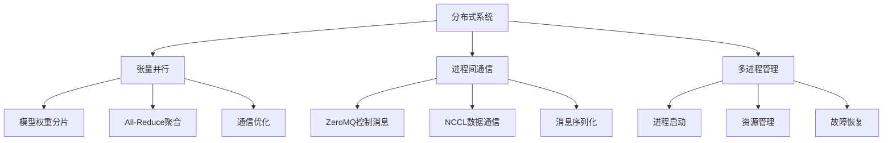
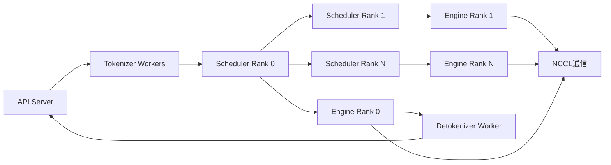
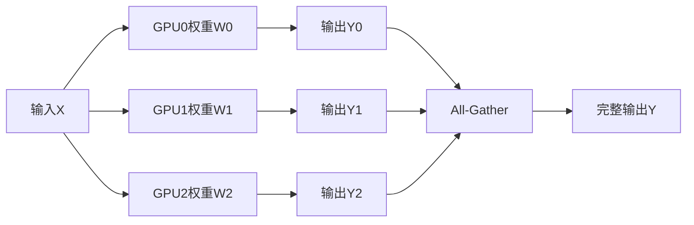
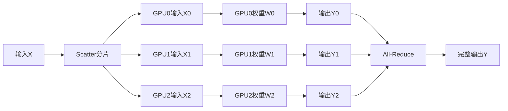
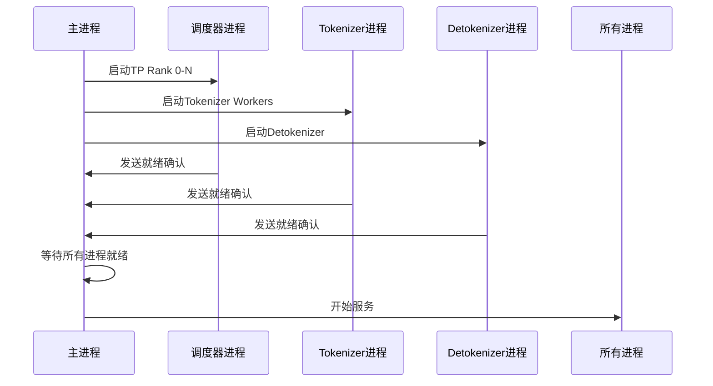
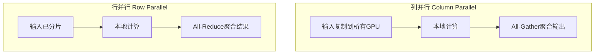

# 第三章：分布式系统与通信机制

## 本章学习目标

通过本章学习，你将了解：
- Mini-SGLang 的分布式架构设计
- 张量并行（Tensor Parallelism）的实现原理
- 进程间通信机制（ZeroMQ + NCCL）
- 多进程启动和管理机制
- 高性能分布式通信优化

## 核心概念速查表

| 术语 | 英文 | 解释 |
|------|------|------|
| **张量并行** | Tensor Parallelism (TP) | 一种模型并行策略，将模型权重的张量切分到多个 GPU 上并行计算。 |
| **All-Reduce** | All-Reduce | 集合通信操作，所有进程对数据进行规约（如求和），并将结果广播回所有进程。常用于行并行输出聚合。 |
| **All-Gather** | All-Gather | 集合通信操作，所有进程收集其他进程的数据，最终每个进程都拥有完整的数据。常用于列并行输出聚合。 |
| **ZeroMQ** | ZeroMQ | 一个高性能异步消息库，Mini-SGLang 用它来处理控制平面消息（如请求分发）。 |
| **NCCL** | NVIDIA Collective Communications Library | NVIDIA 提供的多 GPU 集合通信库，优化了 GPU 间的数据传输，Mini-SGLang 用它来处理数据平面消息（如张量聚合）。 |
| **Rank** | Rank | 分布式系统中进程的唯一标识 ID，通常从 0 开始。 |
| **World Size** | World Size | 分布式系统中的总进程数。 |

## 背景知识

### 分布式LLM推理的挑战

在大模型推理中，分布式系统需要解决以下关键问题：

1. **模型并行**：如何将大模型分布到多个GPU上
2. **通信效率**：GPU间数据传输的延迟和带宽优化
3. **负载均衡**：确保各GPU计算负载均衡
4. **容错性**：单个GPU故障不影响整体系统
5. **扩展性**：支持动态添加/移除GPU节点

### 关键技术概念

- **张量并行（Tensor Parallelism）**：将模型权重按维度切分到多个GPU
- **流水线并行（Pipeline Parallelism）**：按模型层切分到不同GPU（Mini-SGLang未采用）
- **数据并行（Data Parallelism）**：每个GPU处理不同数据批次
- **混合并行**：结合多种并行策略

### 集合通信原语详解

理解 All-Reduce 和 All-Gather 是掌握分布式推理的关键：

1.  **All-Gather (全收集)**
    *   **操作**：每个进程有一部分数据，操作结束后，所有进程都拥有所有数据的拼接结果。
    *   **场景**：列并行（Column Parallelism）的输出聚合。例如，每个 GPU 计算了输出向量的一部分，需要拼接成完整的向量。
    *   **数据量**：输出数据量是输入数据量的 $N$ 倍（$N$ 为 GPU 数量）。

2.  **All-Reduce (全规约)**
    *   **操作**：每个进程有一部分数据，操作结束后，所有进程都拥有这些数据的规约结果（通常是 Sum）。
    *   **场景**：行并行（Row Parallelism）的输出聚合。例如，每个 GPU 计算了部分结果，需要将它们相加得到最终结果。
    *   **数据量**：输出数据量与输入数据量相同。

### 为什么使用 PyNCCL？

虽然 PyTorch 自带 `torch.distributed` 模块，但 Mini-SGLang 选择了自定义的 PyNCCL 实现，主要原因包括：

1.  **CUDA Graph 兼容性**：PyTorch 原生分布式操作在某些版本中对 CUDA Graph 的支持不够完美，自定义实现可以更精细地控制流（Stream）和内存，确保 CUDA Graph 录制和重放的稳定性。
2.  **更低的开销**：绕过 PyTorch 的部分抽象层，直接调用 NCCL C++ API，减少 Python层面的开销。
3.  **细粒度控制**：允许更灵活地管理通信缓冲区和同步行为。

## 分布式架构概览



### 系统进程架构



## 张量并行实现

### 1. 分布式信息管理

#### 进程信息结构

```python
@dataclass(frozen=True)
class DistributedInfo:
    rank: int      # 当前进程Rank (0到size-1)
    size: int      # 总进程数
    
    def is_primary(self) -> bool:
        return self.rank == 0  # Rank 0为主进程
```

#### 全局信息管理

```python
_TP_INFO: DistributedInfo | None = None

def set_tp_info(rank: int, size: int) -> None:
    """设置张量并行信息（单例模式）"""
    global _TP_INFO
    if _TP_INFO is not None:
        raise RuntimeError("TP info has been set")
    _TP_INFO = DistributedInfo(rank, size)

def get_tp_info() -> DistributedInfo:
    """获取张量并行信息"""
    if _TP_INFO is None:
        raise RuntimeError("TP info has not been set")
    return _TP_INFO
```

### 2. 分布式通信接口

#### 通信抽象接口

```python
class DistributedImpl(ABC):
    @abstractmethod
    def all_reduce(self, x: torch.Tensor) -> torch.Tensor: ...
    
    @abstractmethod
    def all_gather(self, x: torch.Tensor) -> torch.Tensor: ...
```

#### PyTorch分布式实现

```python
class TorchDistributedImpl(DistributedImpl):
    def all_reduce(self, x: torch.Tensor) -> torch.Tensor:
        tp_size = dist.get_world_size()
        if tp_size == 1:
            return x
        dist.all_reduce(x, op=dist.ReduceOp.SUM)
        return x
    
    def all_gather(self, x: torch.Tensor) -> torch.Tensor:
        tp_size = dist.get_world_size()
        if tp_size == 1:
            return x
        shape = list(x.shape)
        shape[0] = shape[0] * tp_size
        out = torch.empty(shape, dtype=x.dtype, device=x.device)
        dist.all_gather_into_tensor(out, x)
        return out
```

#### PyNCCL高性能实现

```python
class PyNCCLDistributedImpl(DistributedImpl):
    def __init__(self, comm: PyNCCLCommunicator):
        self.comm = comm
    
    def all_reduce(self, x: torch.Tensor) -> torch.Tensor:
        self.comm.all_reduce(x, "sum")
        return x
    
    def all_gather(self, x: torch.Tensor) -> torch.Tensor:
        world_size = get_tp_info().size
        output_shape = list(x.shape)
        output_shape[0] *= world_size
        result = x.new_empty(output_shape)
        self.comm.all_gather(result, x)
        return result
```

### 3. 通信器管理器

```python
class DistributedCommunicator:
    plugins: List[DistributedImpl] = [TorchDistributedImpl()]
    
    def all_reduce(self, x: torch.Tensor) -> torch.Tensor:
        return self.plugins[-1].all_reduce(x)
    
    def all_gather(self, x: torch.Tensor) -> torch.Tensor:
        return self.plugins[-1].all_gather(x)
```

## 分布式层实现

### 1. 基础线性层抽象

```python
class _LinearTPImpl(BaseOP):
    """张量并行线性层的通用实现"""
    
    def __init__(
        self,
        full_isize: int,    # 全局输入维度
        full_osize: int,    # 全局输出维度
        local_isize: int,   # 本地输入维度
        local_osize: int,   # 本地输出维度
        has_bias: bool,
    ):
        self.full_input_size = full_isize
        self.full_output_size = full_osize
        self.local_input_size = local_isize
        self.local_output_size = local_osize
        self.weight = torch.empty(local_osize, local_isize)
        self.bias = torch.empty(local_osize) if has_bias else None
```

### 2. 列并行线性层



```python
class LinearColParallelMerged(_LinearTPImpl):
    """列并行：输出维度分片，需要All-Gather聚合"""
    
    def __init__(self, input_size: int, output_sizes: List[int], has_bias: bool):
        tp_info = get_tp_info()
        # 输出维度按TP大小分片
        tp_output_sizes = [divide_even(size, tp_info.size) for size in output_sizes]
        output_size = sum(output_sizes)
        tp_output_size = sum(tp_output_sizes)
        super().__init__(input_size, output_size, input_size, tp_output_size, has_bias)
```

### 3. 行并行线性层



```python
class LinearRowParallel(_LinearTPImpl):
    """行并行：输入维度分片，需要All-Reduce聚合"""
    
    def __init__(self, input_size: int, output_size: int, has_bias: bool):
        tp_info = get_tp_info()
        # 输入维度按TP大小分片
        local_input_size = divide_even(input_size, tp_info.size)
        local_output_size = output_size
        self._comm = DistributedCommunicator()
        self._tp_size = tp_info.size
        super().__init__(input_size, output_size, local_input_size, local_output_size, has_bias)
    
    def forward(self, x: torch.Tensor) -> torch.Tensor:
        y = F.linear(x, self.weight, self.bias)
        if self._tp_size > 1:
            y = self._comm.all_reduce(y)  # All-Reduce聚合结果
        return y
```

### 4. QKV合并线性层

```python
class LinearQKVMerged(_LinearTPImpl):
    """QKV合并投影层，支持分组查询注意力（GQA）"""
    
    def __init__(self, hidden_size: int, head_dim: int, num_qo_heads: int, 
                 num_kv_heads: int, has_bias: bool):
        tp_info = get_tp_info()
        
        # 计算GQA比例
        GQA_ratio = divide_even(num_qo_heads, num_kv_heads)
        local_num_kv = divide_even(num_kv_heads, tp_info.size)
        
        full_isize = hidden_size
        full_osize = (GQA_ratio + 2) * num_kv_heads * head_dim  # Q + K + V
        local_isize = hidden_size
        local_osize = (GQA_ratio + 2) * local_num_kv * head_dim
        
        super().__init__(full_isize, full_osize, local_isize, local_osize, has_bias)
```

## 📡 进程间通信机制

### 1. ZeroMQ通信队列

#### 通用队列接口

```python
class ZmqPushQueue(Generic[T]):
    """ZeroMQ推送队列，用于发送消息"""
    
    def __init__(self, addr: str, create: bool, encoder: Callable[[T], Dict]):
        self.context = zmq.Context()
        self.socket = self.context.socket(zmq.PUSH)
        self.socket.bind(addr) if create else self.socket.connect(addr)
        self.encoder = encoder
    
    def put(self, obj: T):
        """序列化并发送消息"""
        event = msgpack.packb(self.encoder(obj), use_bin_type=True)
        self.socket.send(event, copy=False)
```

#### 拉取队列实现

```python
class ZmqPullQueue(Generic[T]):
    """ZeroMQ拉取队列，用于接收消息"""
    
    def __init__(self, addr: str, create: bool, decoder: Callable[[Dict], T]):
        self.context = zmq.Context()
        self.socket = self.context.socket(zmq.PULL)
        self.socket.bind(addr) if create else self.socket.connect(addr)
        self.decoder = decoder
    
    def get(self) -> T:
        """接收并反序列化消息"""
        event = self.socket.recv()
        return self.decoder(msgpack.unpackb(event, raw=False))
    
    def empty(self) -> bool:
        """检查队列是否为空"""
        return self.socket.poll(timeout=0) == 0
```

### 2. 异步通信支持

```python
class ZmqAsyncPushQueue(Generic[T]):
    """异步推送队列，支持非阻塞操作"""
    
    def __init__(self, addr: str, create: bool, encoder: Callable[[T], Dict]):
        self.context = zmq.asyncio.Context()
        self.socket = self.context.socket(zmq.PUSH)
        self.socket.bind(addr) if create else self.socket.connect(addr)
        self.encoder = encoder
    
    async def put(self, obj: T):
        """异步发送消息"""
        event = msgpack.packb(self.encoder(obj), use_bin_type=True)
        await self.socket.send(event, copy=False)
```

### 3. 发布-订阅模式

```python
class ZmqPubQueue(Generic[T]):
    """发布队列，支持一对多消息分发"""
    
    def __init__(self, addr: str, create: bool, encoder: Callable[[T], Dict]):
        self.context = zmq.Context()
        self.socket = self.context.socket(zmq.PUB)
        self.socket.bind(addr) if create else self.socket.connect(addr)
        self.encoder = encoder
    
    def put(self, obj: T):
        """发布消息到所有订阅者"""
        event = msgpack.packb(self.encoder(obj), use_bin_type=True)
        self.socket.send(event, copy=False)
```

## 多进程启动机制

### 1. 服务器启动流程



### 2. 进程启动实现

```python
def launch_server(run_shell: bool = False) -> None:
    """启动分布式推理服务器"""
    
    def start_subprocess() -> None:
        import multiprocessing as mp
        mp.set_start_method("spawn", force=True)
        
        world_size = server_args.tp_info.size
        ack_queue: mp.Queue[str] = mp.Queue()
        
        # 启动所有TP Rank的调度器
        for i in range(world_size):
            new_args = replace(server_args, tp_info=DistributedInfo(i, world_size))
            mp.Process(
                target=_run_scheduler,
                args=(new_args, ack_queue),
                daemon=False,
                name=f"minisgl-TP{i}-scheduler",
            ).start()
        
        # 启动Tokenizer和Detokenizer
        num_tokenizers = server_args.num_tokenizer
        
        # Detokenizer（仅1个）
        mp.Process(
            target=tokenize_worker,
            kwargs={"tokenizer_id": num_tokenizers, "ack_queue": ack_queue},
            name="minisgl-detokenizer-0",
        ).start()
        
        # Tokenizer Workers
        for i in range(num_tokenizers):
            mp.Process(
                target=tokenize_worker,
                kwargs={"tokenizer_id": i, "ack_queue": ack_queue},
                name=f"minisgl-tokenizer-{i}",
            ).start()
        
        # 等待所有进程就绪
        for _ in range(num_tokenizers + 2):
            logger.info(ack_queue.get())
```

### 3. 调度器进程实现

```python
def _run_scheduler(args: ServerArgs, ack_queue: mp.Queue[str]) -> None:
    """调度器进程入口函数"""
    
    with torch.inference_mode():
        scheduler = Scheduler(args)
        scheduler.sync_all_ranks()  # 同步所有Rank
        
        if args.tp_info.is_primary():
            ack_queue.put("Scheduler is ready")  # 发送就绪信号
        
        try:
            scheduler.run_forever()  # 进入主循环
        except KeyboardInterrupt:
            scheduler.shutdown()  # 优雅关闭
```

## PyNCCL高性能通信

### 1. NCCL初始化

```python
def init_pynccl(
    *,
    tp_rank: int,
    tp_size: int,
    tp_cpu_group: torch.distributed.ProcessGroup,
    max_size_bytes: int = 0,
) -> PyNCCLCommunicator:
    """初始化PyNCCL通信器"""
    
    # 加载NCCL模块
    module = _load_nccl_module()
    cls = _get_pynccl_wrapper_cls()
    
    # Rank 0创建NCCL ID并广播
    if tp_rank == 0:
        id_list = [module.create_nccl_uid()]
        torch.distributed.broadcast_object_list(id_list, src=0, group=tp_cpu_group)
    else:
        id_list = [None]
        torch.distributed.broadcast_object_list(id_list, src=0, group=tp_cpu_group)
    
    nccl_id = id_list[0]
    return cls(tp_rank, tp_size, max_size_bytes, nccl_id)
```

### 2. NCCL模块加载

```python
@lru_cache(maxsize=None)
def _load_nccl_module() -> Module:
    """加载NCCL CUDA模块"""
    return load_aot("pynccl", cuda_files=["pynccl.cu"], extra_ldflags=["-lnccl"])
```

## 性能优化特性

### 1. 通信后端选择

```python
def enable_pynccl_distributed(
    tp_info: DistributedInfo, 
    tp_cpu_group: torch.distributed.ProcessGroup, 
    max_bytes: int
) -> None:
    """启用PyNCCL高性能通信后端"""
    
    if tp_info.size == 1:
        return  # 单GPU无需NCCL
    
    from minisgl.kernel import init_pynccl
    comm = init_pynccl(
        tp_rank=tp_info.rank,
        tp_size=tp_info.size,
        tp_cpu_group=tp_cpu_group,
        max_size_bytes=max_bytes,
    )
    
    # 添加PyNCCL实现到通信器插件列表
    DistributedCommunicator.plugins.append(PyNCCLDistributedImpl(comm))
```

### 2. 内存缓冲区优化

```python
# 配置最大通信缓冲区大小
max_size_bytes = min(max_size_bytes, ENV.PYNCCL_MAX_BUFFER_SIZE.value)
```

## 本章总结

本章详细分析了Mini-SGLang的分布式系统架构：

### 核心技术总结

| 技术领域 | 实现方式 | 核心优势 |
|----------|----------|----------|
| **张量并行** | 列并行+行并行 | 层内切分，支持GQA |
| **控制通信** | ZeroMQ | 轻量级、异步消息 |
| **数据通信** | PyNCCL | 高带宽、低延迟 |
| **进程管理** | multiprocessing spawn | 隔离性好、易调试 |

### 通信模式对比



### 设计亮点

1. **模块化通信后端**：插件式架构，支持多种实现（TorchDistributed、PyNCCL）
2. **高性能优先**：默认使用PyNCCL，比PyTorch原生通信性能更高
3. **进程隔离**：组件间松耦合，单个进程故障不影响整体系统
4. **灵活扩展**：支持2-8个GPU的张量并行配置

---

**下一章预告**：第四章将深入讲解推理引擎的核心实现、调度器算法和CUDA图优化技术。