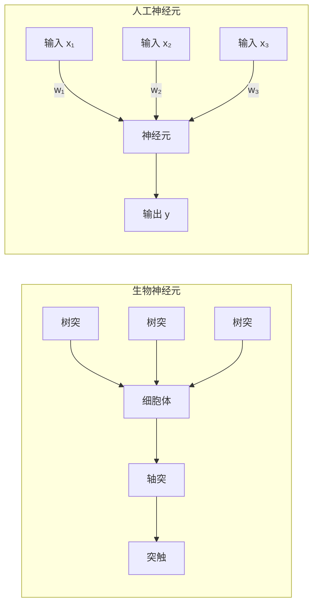
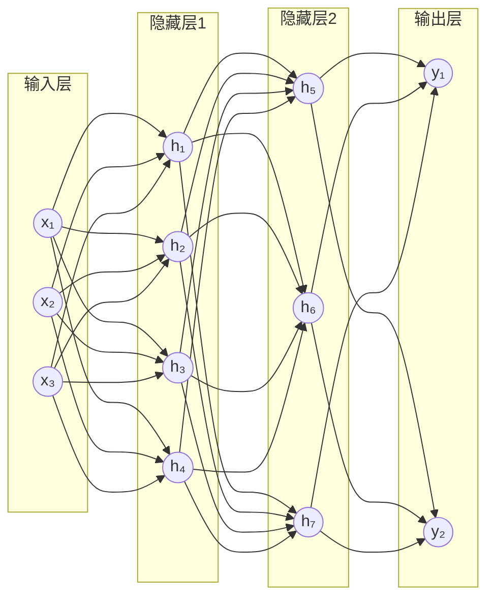
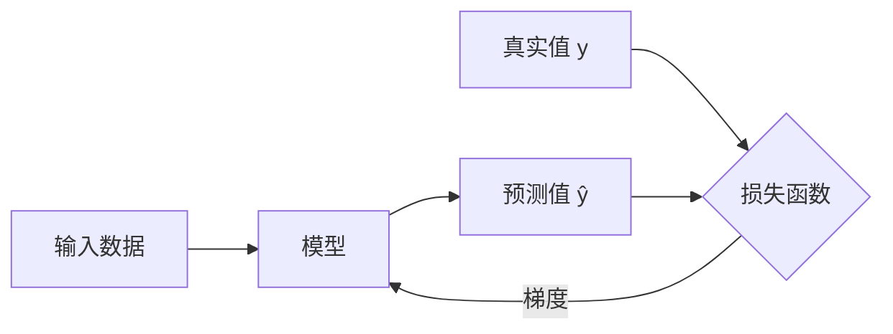
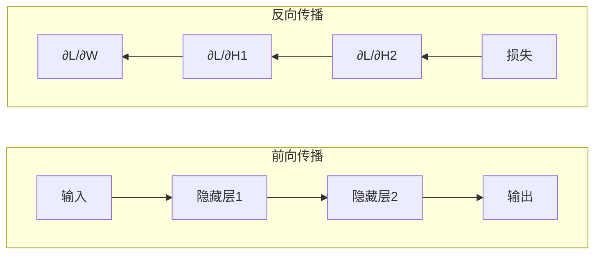
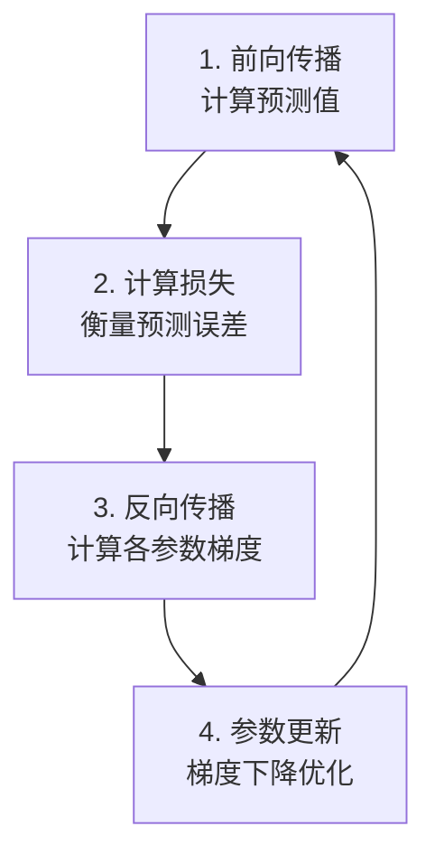
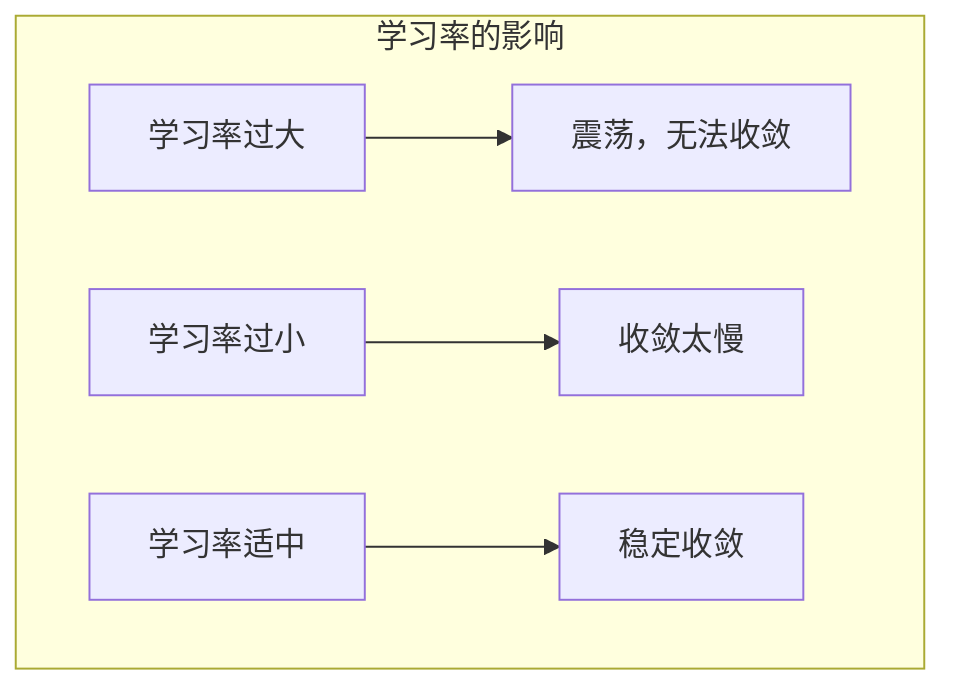
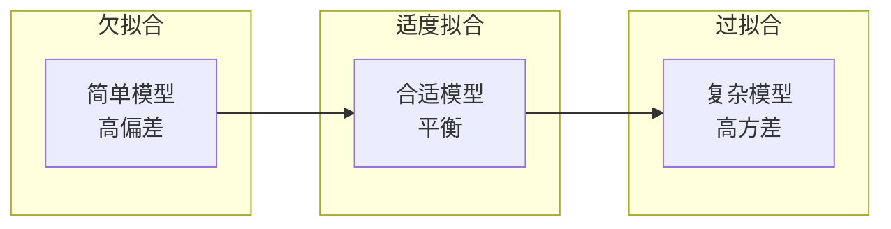
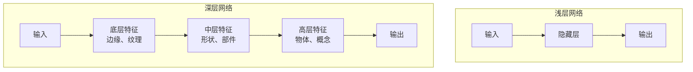
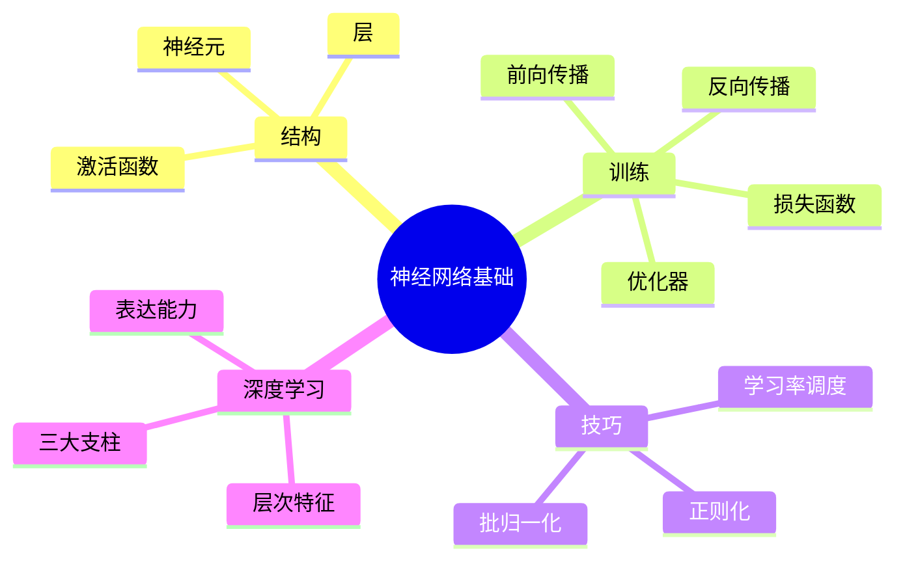

# 神经网络入门：从感知机到深度学习

在深入学习大语言模型之前，我们需要先理解神经网络的基本原理。本文将带你从最简单的感知机开始，逐步建立对深度学习的直觉。

## 1. 从生物神经元到人工神经元

人工神经网络的灵感来源于人脑中的生物神经元。每个神经元接收来自其他神经元的信号，经过处理后决定是否"激活"并向下游传递信号。



### 1.1 感知机 (Perceptron)

感知机是最简单的神经网络单元，由 Frank Rosenblatt 于 1957 年提出。它模拟了生物神经元的基本功能：

```
输入: x₁, x₂, ..., xₙ
权重: w₁, w₂, ..., wₙ
偏置: b

输出: y = activation(w₁x₁ + w₂x₂ + ... + wₙxₙ + b)
```

**直观理解**：
- **权重 (Weights)**：表示每个输入的重要程度
- **偏置 (Bias)**：调整神经元的激活阈值
- **激活函数**：决定神经元是否"激活"

### 1.2 激活函数 (Activation Function)

激活函数为神经网络引入**非线性**，使其能够学习复杂的模式。如果没有激活函数，多层神经网络等价于单层线性变换。


**常用激活函数对比**：

| 函数 | 公式 | 输出范围 | 特点 | 应用场景 |
|------|------|----------|------|----------|
| **Sigmoid** | σ(x) = 1/(1+e⁻ˣ) | (0, 1) | 平滑，但有梯度消失问题 | 二分类输出层 |
| **Tanh** | tanh(x) = (eˣ-e⁻ˣ)/(eˣ+e⁻ˣ) | (-1, 1) | 零中心化，但仍有梯度消失 | RNN隐藏层 |
| **ReLU** | max(0, x) | [0, +∞) | 简单高效，缓解梯度消失 | CNN、MLP隐藏层 |
| **GELU** | x·Φ(x) | (-∞, +∞) | 平滑版ReLU | Transformer |
| **SiLU/Swish** | x·σ(x) | (-∞, +∞) | 平滑，自门控 | 现代LLM |

## 2. 多层神经网络

将多个神经元组织成层，再将多层连接起来，就构成了**多层感知机 (MLP)**：



每一层的输出作为下一层的输入，这种结构被称为**前馈神经网络 (Feedforward Neural Network)**。

**层的类型**：
- **输入层**：接收原始数据
- **隐藏层**：进行特征变换和提取
- **输出层**：产生最终预测

## 3. 损失函数 (Loss Function)

损失函数衡量模型预测值与真实值之间的差距，是训练的"指南针"：



**常用损失函数**：

| 损失函数 | 公式 | 应用场景 |
|----------|------|----------|
| **均方误差 MSE** | L = (1/n) Σ(ŷ - y)² | 回归任务 |
| **交叉熵 CE** | L = -Σ y·log(ŷ) | 分类任务 |
| **二元交叉熵 BCE** | L = -[y·log(ŷ) + (1-y)·log(1-ŷ)] | 二分类 |

**语言模型中的损失函数**：LLM 通常使用交叉熵损失，预测下一个 token 的概率分布。

## 4. 反向传播 (Backpropagation)

反向传播是训练神经网络的核心算法，基于**链式法则**计算损失函数对每个参数的梯度。



**训练流程**：



**代码示例**：

```python
# PyTorch 训练循环
for epoch in range(num_epochs):
    for batch in dataloader:
        # 1. 前向传播
        y_pred = model(batch.x)
        
        # 2. 计算损失
        loss = loss_function(y_pred, batch.y)
        
        # 3. 反向传播（自动计算梯度）
        optimizer.zero_grad()  # 清除旧梯度
        loss.backward()        # 计算新梯度
        
        # 4. 参数更新
        optimizer.step()
```

## 5. 梯度下降与优化器

### 5.1 梯度下降 (Gradient Descent)

梯度指向损失函数上升最快的方向，因此我们朝**反方向**更新参数：

```
θ_new = θ_old - η · ∇L(θ)
```

其中 **η (eta)** 是**学习率 (Learning Rate)**，决定每次更新的步长。



### 5.2 常用优化器

| 优化器 | 核心思想 | 特点 | 适用场景 |
|--------|----------|------|----------|
| **SGD** | 随机采样小批量 | 最基础，需要调参 | 小模型、理论研究 |
| **SGD+Momentum** | 累积历史梯度 | 加速收敛，减少震荡 | CV任务 |
| **Adam** | 自适应学习率 + 动量 | 开箱即用，最常用 | 大多数深度学习任务 |
| **AdamW** | Adam + 解耦权重衰减 | 更好的泛化性能 | **LLM 训练首选** |

## 6. 过拟合与正则化

### 6.1 过拟合 (Overfitting)

当模型在训练数据上表现很好，但在新数据上表现差时，说明模型"记住"了训练数据而非学到真正的规律。



### 6.2 正则化技术

| 技术 | 原理 | 效果 |
|------|------|------|
| **Dropout** | 训练时随机丢弃神经元 | 防止神经元过度依赖 |
| **L2 正则化** | 惩罚过大的权重 | 使权重更平滑 |
| **L1 正则化** | 惩罚权重的绝对值 | 产生稀疏权重 |
| **早停 (Early Stopping)** | 验证集不再提升时停止 | 防止过度训练 |
| **数据增强** | 扩充训练数据 | 提高泛化能力 |

## 7. 深度学习的崛起

为什么"深度"很重要？



**深度的优势**：

1. **层次化特征提取**：底层学习简单特征（边缘、颜色），高层学习抽象概念（物体、语义）
2. **表达能力强**：更深的网络可以表示更复杂的函数映射
3. **参数效率高**：相同参数量下，深层网络比宽层网络更强大
4. **组合爆炸**：通过层层组合，可以表示指数级的特征组合

**深度学习的三大支柱**：
- **大数据**：互联网时代的海量数据
- **强算力**：GPU/TPU 的并行计算能力
- **好算法**：反向传播、Batch Normalization、残差连接等

## 8. 本章小结



**核心要点**：
- ✅ 神经网络由神经元、层、激活函数组成
- ✅ 通过反向传播和梯度下降进行训练
- ✅ 损失函数指导模型学习的方向
- ✅ 正则化技术防止过拟合
- ✅ 深度带来层次化的特征学习能力

## 延伸阅读

- [3Blue1Brown: 神经网络系列视频](https://www.youtube.com/playlist?list=PLZHQObOWTQDNU6R1_67000Dx_ZCJB-3pi) - 直观的可视化解释
- 《深度学习》(花书) 第 6 章：深度前馈网络
- [Stanford CS231n](http://cs231n.stanford.edu/) - 卷积神经网络课程
- [PyTorch 官方教程](https://pytorch.org/tutorials/)

---

*下一篇：[语言模型简史](./02-language-model-history.md) - 了解语言模型如何从统计方法演进到神经网络*
