# 语言模型简史：从 N-gram 到 2025年的大模型革命

语言模型 (Language Model, LM) 是自然语言处理的核心技术。本文将带你回顾语言模型的发展历程，从统计方法到神经网络革命，再到2025年的大模型爆发式发展。

## 1. 什么是语言模型？

语言模型的本质是**预测下一个词的概率分布**。具体来说，给定前面已经出现的词序列，模型需要计算下一个词是每个候选词的概率。比如给定"我爱吃"这三个词，模型会给出各种可能的下一个词及其概率。这个看似简单的任务，实际上需要模型理解语法、语义，甚至世界知识。

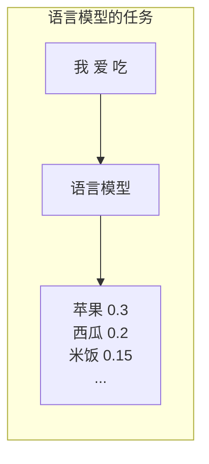

**2025年的新理解**：现代语言模型不仅是预测工具，更是知识载体、推理引擎和创作助手。它们能够进行复杂的数学推理、代码编写、创意生成，甚至跨模态理解（图像、音频、视频）。

## 2. 语言模型发展时间线

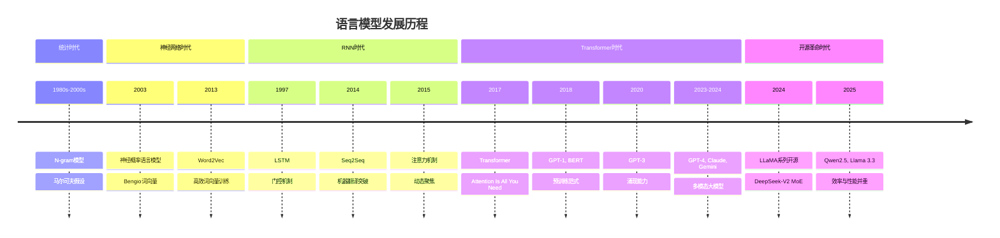

## 3. 第一阶段：统计语言模型 (1980s-2000s)

### 3.1 N-gram 模型

N-gram 是最早的语言模型方法，基于**马尔可夫假设**：当前词只依赖于前 N-1 个词。

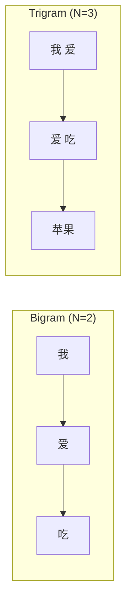

**计算示例**：预测 "我爱吃___"

假设我们统计语料库中 "我爱吃" 后面出现的词频："苹果" 出现 100 次，"西瓜" 出现 50 次，"米饭" 出现 30 次。那么预测"苹果"的概率约等于 100 除以总次数 180，即约 56%。这就是统计语言模型的基本原理。

**N-gram 的局限性**：

| 问题 | 说明 |
|------|------|
| **无法捕捉长距离依赖** | 只看前几个词，忽略更远的上下文 |
| **数据稀疏** | 很多 N-gram 组合从未在语料中出现 |
| **存储爆炸** | 词表大小为 V，N-gram 组合数为 V^N |
| **缺乏泛化** | 无法理解语义相似性 |

## 4. 第二阶段：神经网络语言模型 (2003-2013)

### 4.1 词向量的诞生 (2003)

Bengio 等人提出**神经概率语言模型**，开创性地引入词向量概念：

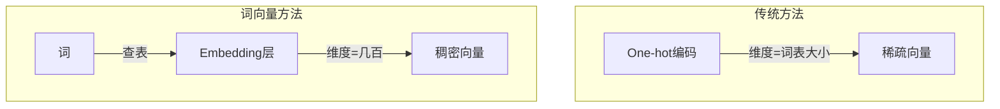

**核心思想**：
- 将离散的词映射到**连续的向量空间**
- 语义相似的词，向量距离也相近
- 解决了数据稀疏问题

### 4.2 Word2Vec (2013)

Mikolov 提出 Word2Vec，让词向量训练变得高效实用：

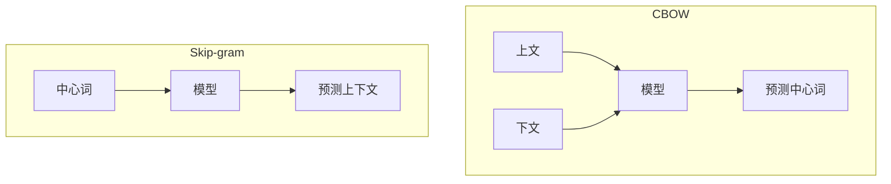

**著名的词向量算术**：

研究者发现了一个神奇的现象：用 "King" 的向量减去 "Man" 的向量，再加上 "Woman" 的向量，得到的结果最接近 "Queen" 的向量。类似地，"Paris" 减去 "France" 加上 "Italy" 约等于 "Rome"。这说明词向量成功捕捉到了语义关系！

## 5. 第三阶段：循环神经网络 (1986-2016)

### 5.1 RNN 基础

循环神经网络通过**隐藏状态**传递历史信息：

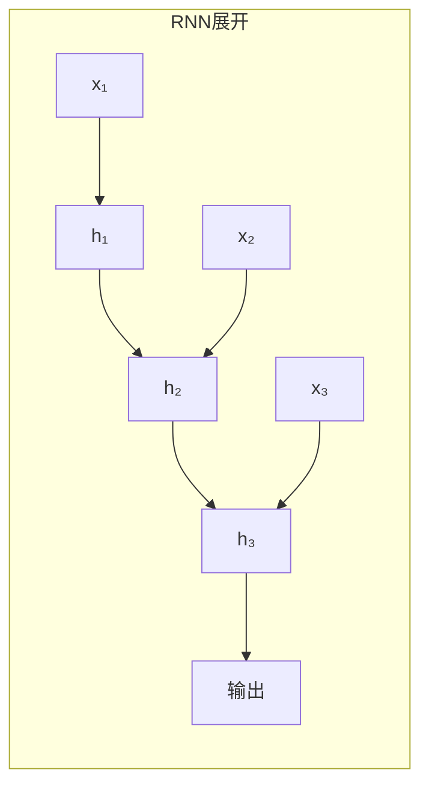

每个时间步，RNN 会将当前输入与上一步的隐藏状态结合，经过变换后得到新的隐藏状态。这样信息就能在序列中传递下去。

**问题**：由于信息需要一步步传递，梯度在反向传播时会指数级衰减（消失）或爆炸，导致模型难以学习长距离依赖关系。比如在一个很长的句子中，句首的信息往往难以传递到句尾。

### 5.2 LSTM (1997)

长短期记忆网络引入**门控机制**，像"阀门"一样控制信息流：

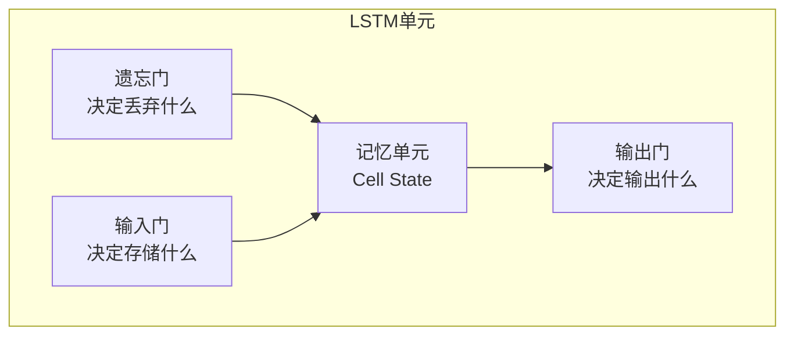

**三个门的作用**：
- **遗忘门 (Forget Gate)**：决定从记忆中丢弃哪些信息
- **输入门 (Input Gate)**：决定保存哪些新信息到记忆中
- **输出门 (Output Gate)**：决定输出记忆中的哪些信息

LSTM 成功缓解了梯度消失问题，成为 2010s 的主流架构。

### 5.3 GRU (2014)

门控循环单元是 LSTM 的简化版本：
- 将遗忘门和输入门合并为**更新门**
- 参数更少，训练更快
- 效果与 LSTM 相当

## 6. 第四阶段：Seq2Seq 与注意力机制 (2014-2017)

### 6.1 Seq2Seq 模型

序列到序列模型为机器翻译带来突破：

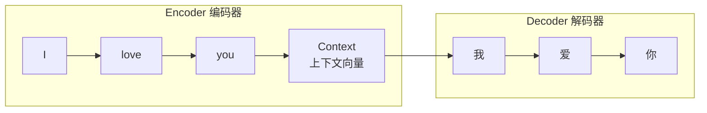

**问题**：整个输入序列压缩到一个固定长度向量，信息瓶颈严重！

### 6.2 注意力机制 (2015)

Bahdanau 等人提出注意力机制，允许 Decoder 在每一步"关注"输入序列的不同位置：

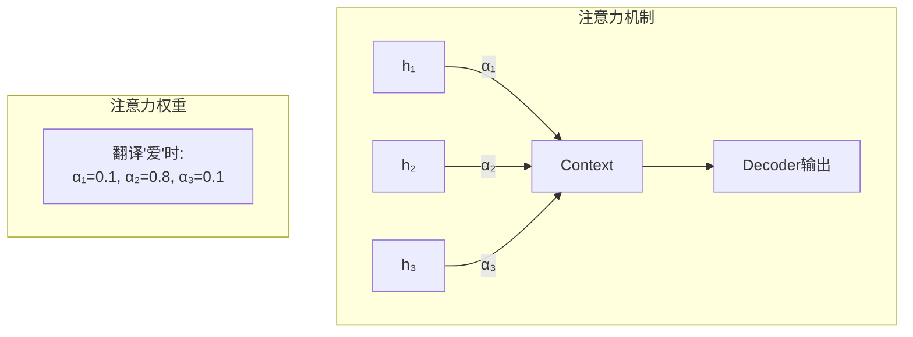

**核心思想**：不再压缩成固定向量，而是**动态选择**相关信息。

## 7. 第五阶段：Transformer 革命 (2017)

### 7.1 "Attention is All You Need"

Google 提出 Transformer 架构，**完全抛弃循环结构**：

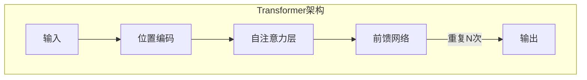

**核心创新**：

| 创新点 | 说明 |
|--------|------|
| **自注意力 (Self-Attention)** | 序列内部的元素相互关注 |
| **多头注意力 (Multi-Head)** | 从多个角度学习关系 |
| **位置编码** | 注入位置信息（因为没有顺序处理） |
| **并行计算** | 摆脱 RNN 的顺序依赖 |

### 7.2 为什么 Transformer 成功？

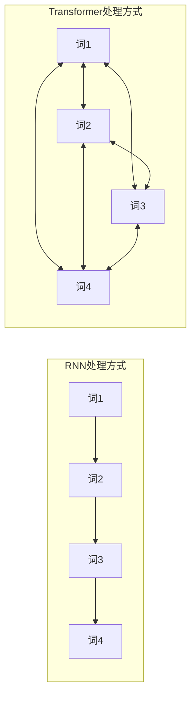

| 对比维度 | RNN/LSTM | Transformer |
|----------|----------|-------------|
| **并行能力** | 差（必须顺序处理） | 强（完全并行） |
| **长距离依赖** | 信息逐步衰减 | 直接连接（路径长度=1） |
| **训练速度** | 慢 | 快 |
| **可扩展性** | 有限 | 极强（可堆叠很多层） |

## 8. 第六阶段：预训练大模型时代 (2018-至今)

### 8.1 GPT 系列 (OpenAI)

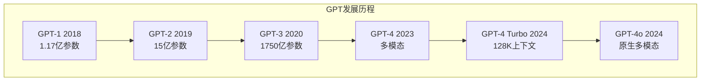

| 模型 | 发布时间 | 参数量 | 重要突破 |
|------|----------|--------|----------|
| **GPT-1** | 2018.6 | 117M | 证明预训练+微调范式有效 |
| **GPT-2** | 2019.2 | 1.5B | 展示零样本学习能力 |
| **GPT-3** | 2020.6 | 175B | 涌现出上下文学习能力 |
| **GPT-4** | 2023.3 | 未公开 | 多模态，推理能力大幅提升 |
| **GPT-4 Turbo** | 2024 | 未公开 | 128K 上下文，更便宜更快 |
| **GPT-4o** | 2024.5 | 未公开 | 原生多模态，实时语音交互 |

### 8.2 BERT (Google, 2018)

双向编码器，擅长**理解任务**：

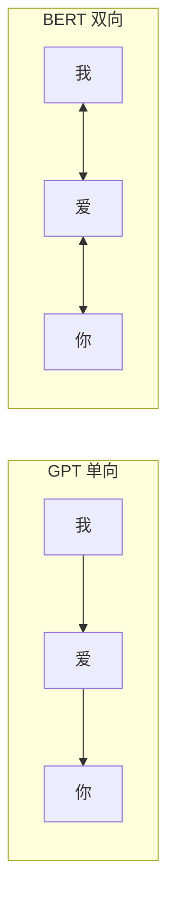

- **掩码语言模型 (MLM)**：随机遮住词，让模型预测
- **下一句预测 (NSP)**：判断两个句子是否连续

### 8.3 技术路线分化

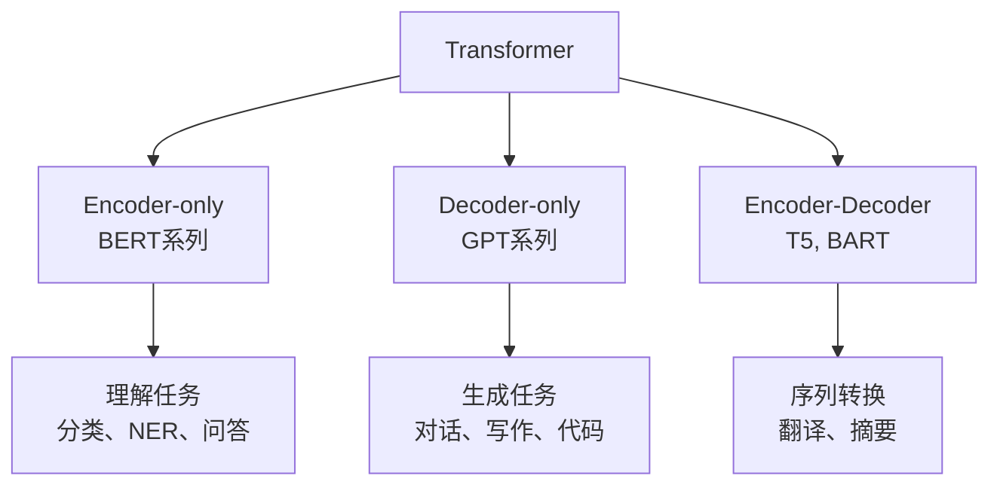

| 路线 | 代表模型 | 特点 | 适用场景 |
|------|----------|------|----------|
| **Decoder-only** | GPT, LLaMA, Claude | 自回归生成 | 文本生成、对话、代码 |
| **Encoder-only** | BERT, RoBERTa | 双向理解 | 分类、实体识别、阅读理解 |
| **Encoder-Decoder** | T5, BART, Flan | 编码+生成 | 翻译、摘要、改写 |

### 8.4 2023-2024 商业大模型格局

| 模型 | 公司 | 特点 |
|------|------|------|
| **GPT-4/4o** | OpenAI | 多模态，强推理，支持图像音频 |
| **Claude 3/3.5** | Anthropic | 安全对齐，200K 上下文，Sonnet/Opus/Haiku 三档 |
| **Gemini 1.5** | Google | 原生多模态，100万 token 上下文窗口 |

## 9. 第七阶段：开源革命时代 (2024-2025)

### 9.1 开源模型的崛起

2024年开始，开源大模型开始挑战闭源模型，形成了新的竞争格局：

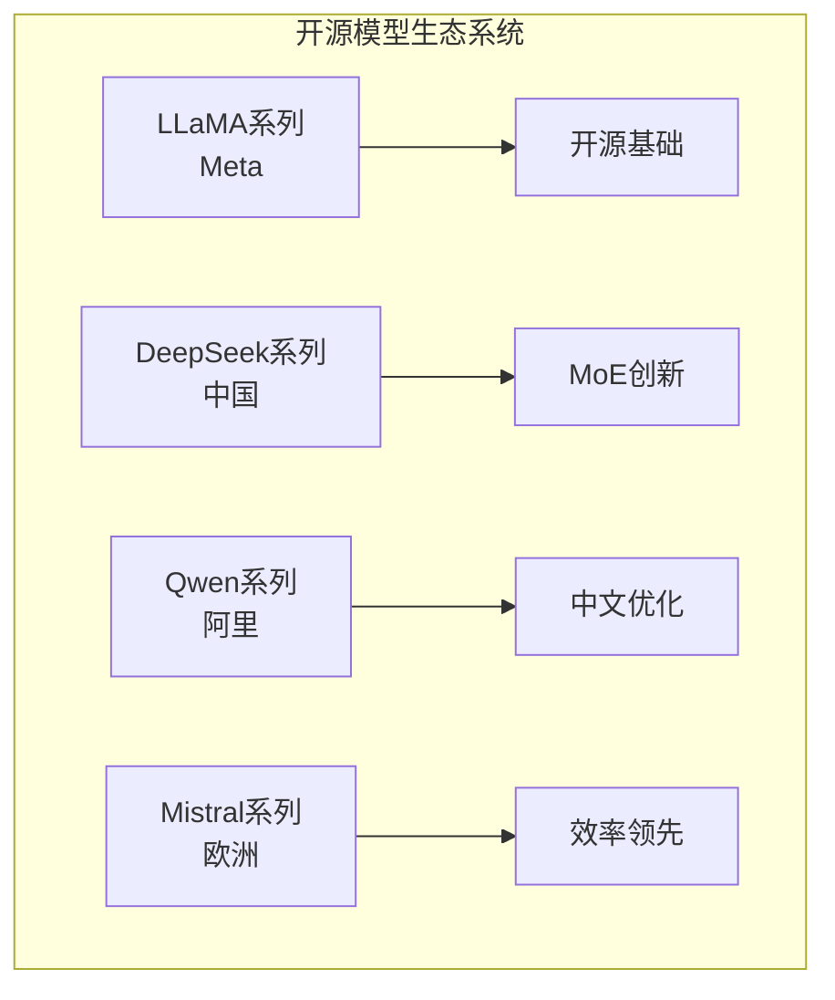

### 9.2 DeepSeek-V2 (2024-2025)

**革命性的MoE架构**：

| 特性 | 参数值 | 意义 |
|------|--------|------|
| **总参数** | 236B | 超大规模模型 |
| **激活参数** | 21B | 稀疏激活，大幅降低计算成本 |
| **架构创新** | MLA + DeepSeekMoE | KV缓存减少93.3% |
| **训练数据** | 8.1T tokens | 高质量预训练数据 |
| **价格** | 1元/百万输入token | 极具竞争力 |

**技术突破**：
- **MLA (Multi-head Latent Attention)**：显著减少推理时的内存占用
- **DeepSeekMoE**：高效的稀疏专家混合架构
- **性能对标**：在中文任务上匹敌GPT-4，英文任务上匹敌LLaMA3-70B

### 9.3 Qwen2.5 (2024-2025)

**阿里巴巴的旗舰开源模型**：

| 版本 | 参数规模 | 特点 |
|------|----------|------|
| **Qwen2.5-0.5B/1.5B/3B** | 轻量级 | 端侧部署，移动设备友好 |
| **Qwen2.5-7B/14B/32B** | 中等规模 | 平衡性能与效率 |
| **Qwen2.5-72B** | 大规模 | 强大的通用能力 |
| **Qwen2.5-Coder** | 专用 | 代码生成专家 |
| **Qwen2.5-Math** | 专用 | 数学推理专家 |

**核心技术亮点**：
- **18T预训练token**：超越前代的大规模数据训练
- **128K上下文支持**：处理长文档和复杂任务
- **动态NTK-aware RoPE**：高效的长上下文位置编码
- **混合注意力 (MQA + GQA)**：内存使用减少30%
- **专业领域模型**：针对编码和数学任务的特殊优化

### 9.4 Llama 3.3 (2024-2025)

**Meta的开源标杆**：

| 特性 | 规格 |
|------|------|
| **参数规模** | 70B |
| **上下文长度** | 128K |
| **训练数据** | 15T tokens |
| **架构优化** | GQA (Grouped Query Attention) |
| **多语言支持** | 英语、德语、法语、西班牙语等 |

**性能表现**：
- 在多个基准测试中超越了许多闭源模型
- 通过RLHF微调确保安全性和对齐性
- 特别优化的多轮对话能力

### 9.5 2025年开源模型对比

| 模型 | 参数类型 | 上下文 | 核心优势 | 适用场景 |
|------|----------|--------|----------|----------|
| **DeepSeek-V2** | 236B (MoE) | 128K | 成本效率、MoE架构 | 高并发商业应用 |
| **Qwen2.5-72B** | 72B (稠密) | 128K | 中文优化、专业模型 | 中文应用、垂直领域 |
| **Llama 3.3-70B** | 70B (稠密) | 128K | 多语言、对话能力 | 国际化应用 |
| **Qwen2.5-Coder** | 7B-32B | 32K | 代码生成专用 | 编程助手 |
| **Qwen2.5-Math** | 7B-72B | 4K | 数学推理专用 | 教育、科研 |

## 10. 2025年技术趋势

### 10.1 效率革命

**从"更大"到"更聪明"的转变**：

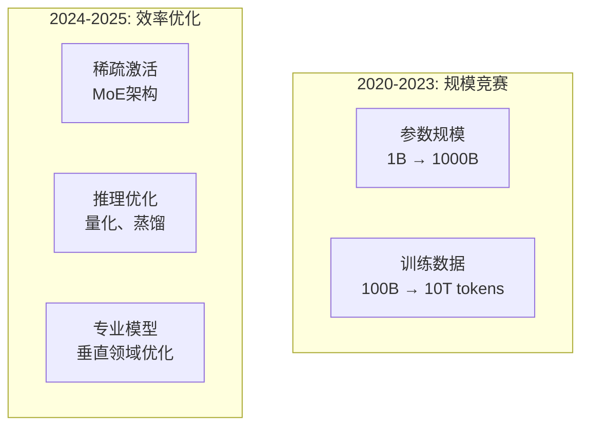

**关键技术趋势**：
1. **混合专家 (MoE)**：只在需要时激活部分参数
2. **量化压缩**：INT4/INT8精度，大幅减少内存和计算
3. **模型蒸馏**：大模型向小模型转移知识
4. **动态推理**：根据任务复杂度选择不同计算策略

### 10.2 长上下文技术

**上下文长度的爆炸式增长**：

| 年份 | 典型上下文长度 | 应用场景 |
|------|----------------|----------|
| **2020** | 2K tokens | 短文本处理 |
| **2022** | 4K-8K tokens | 文档分析 |
| **2023** | 32K-100K tokens | 长文档理解 |
| **2024** | 128K-200K tokens | 图书级别处理 |
| **2025** | 1M+ tokens (实验) | 整本书分析 |

### 10.3 多模态融合

**从纯文本到多模态理解**：

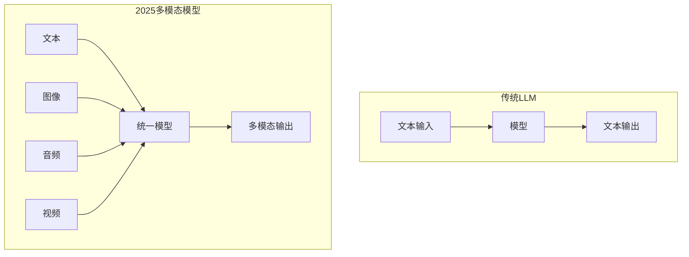

### 10.4 专业化和定制化

**从通用到专精的分化**：

1. **垂直领域模型**：医疗、法律、金融等专用模型
2. **任务专用模型**：代码、数学、翻译等专项优化
3. **企业定制模型**：基于企业数据的私有化部署
4. **边缘设备模型**：针对手机、IoT设备的轻量化版本

## 11. 语言模型的涌现能力

当模型规模足够大时，会"涌现"出意想不到的能力：

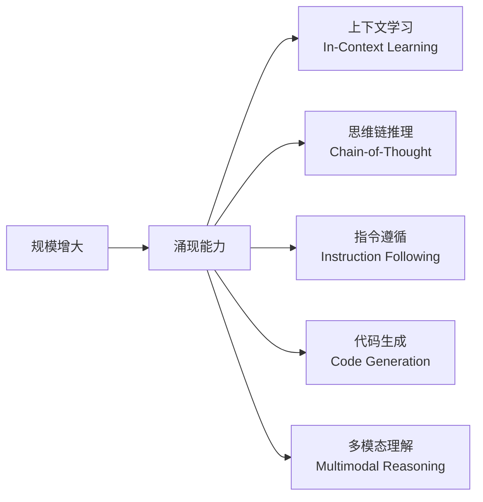

**涌现能力示例**：
- **上下文学习**：无需微调，给几个示例就能学会新任务
- **思维链 (CoT)**：逐步推理复杂问题
- **指令遵循**：理解并执行复杂指令
- **工具使用**：调用外部工具增强能力
- **自我反思**：检查和改进自己的输出

## 12. 本章小结

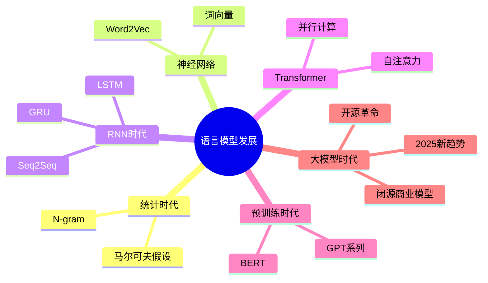

**关键里程碑总结**：

| 阶段 | 时间 | 代表技术 | 核心突破 |
|------|------|----------|----------|
| 统计方法 | 1980s-2000s | N-gram | 概率语言建模 |
| 神经网络 | 2003-2013 | Word2Vec | 词向量表示 |
| 循环网络 | 2014-2016 | LSTM, GRU | 序列建模 |
| 注意力 | 2015-2017 | Attention | 动态聚焦 |
| Transformer | 2017-2018 | Transformer | 并行计算 |
| 预训练 | 2018-2020 | GPT, BERT | 预训练范式 |
| 大模型 | 2020-2023 | GPT-3/4, Claude | 涌现能力 |
| 开源革命 | 2024-2025 | DeepSeek, Qwen, Llama | 效率与开放 |

**2025年的启示**：
- 开源模型正在快速缩小与闭源模型的差距
- 效率优化比单纯扩大规模更重要
- 专业化和定制化成为重要发展方向
- 多模态和长上下文能力成为标配

## 延伸阅读

- [Attention Is All You Need (2017)](https://arxiv.org/abs/1706.03762) - Transformer 原始论文
- [Language Models are Few-Shot Learners (GPT-3, 2020)](https://arxiv.org/abs/2005.14165)
- [DeepSeek-V2: A Strong, Economical, and Efficient Mixture-of-Experts Language Model (2024)](https://arxiv.org/abs/2405.04434)
- [Qwen2.5 Technical Report (2024)](https://arxiv.org/abs/2407.10671)
- [Andrej Karpathy: Let's build GPT](https://www.youtube.com/watch?v=kCc8FmEb1nY)

---

*下一篇：[Transformer 架构演进](./05-transformer-architecture.md) - 深入理解 Transformer 的内部结构*
