# 分词器：文本到数字的桥梁

神经网络无法直接处理文本，需要先将文本转换为数字。分词器 (Tokenizer) 正是完成这一关键转换的组件。本文将深入探讨现代 LLM 中使用的分词技术。

## 1. 为什么需要分词？

**分词器的核心任务**：
1. **切分文本**：将连续文本切分为离散单元 (tokens)
2. **建立映射**：每个 token 对应一个唯一 ID
3. **构建词表**：所有可能 token 的集合 (vocabulary)

以 "Hello, world!" 为例，分词器会将其切分为 "Hello"、","、" world"、"!" 四个 token，然后分别映射为 15496、11、995、0 这样的数字 ID。

## 2. 分词粒度的选择

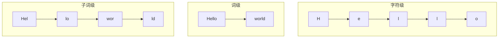

### 2.1 字符级 (Character-level)

将文本按单个字符切分，如 "Hello" 变成 H、e、l、l、o 五个 token。

| 优点 | 缺点 |
|------|------|
| 词表小（几百个字符） | 序列过长 |
| 无 OOV（未登录词）问题 | 难以捕捉语义 |
| 对错别字鲁棒 | 计算成本高 |

### 2.2 词级 (Word-level)

按完整单词切分，如 "Hello world" 变成 Hello、world 两个 token。

| 优点 | 缺点 |
|------|------|
| 语义清晰 | 词表巨大（几十万词） |
| 序列短 | 无法处理新词 (OOV) |
| | 无法学习词根词缀 |

### 2.3 子词级 (Subword-level) - 现代主流

将词切分为有意义的子单元，如 "unhappiness" 变成 un、happiness 两个 token，"playing" 变成 play、ing。

| 优点 | 缺点 |
|------|------|
| 平衡词表大小和序列长度 | 切分方式需要学习 |
| 能处理未见过的词 | |
| 捕捉词根、词缀等规律 | |

## 3. 主流分词算法

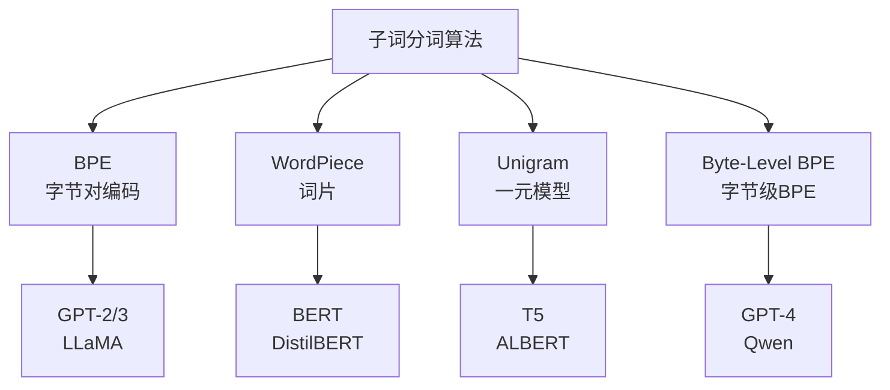

### 3.1 BPE (Byte Pair Encoding)

**核心思想**：从字符开始，不断合并最频繁出现的相邻 pair。

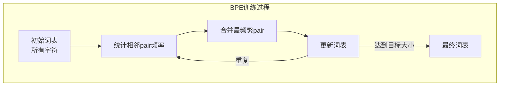

**训练示例**：

假设语料是 "low lower lowest"：

1. **初始化**：词表只包含所有单字符 l、o、w、e、r、s、t 和空格
2. **统计频率**：找出最常见的相邻字符对，发现 l-o 出现 3 次最多
3. **第一次合并**：将 l 和 o 合并为新 token "lo"
4. **继续统计**：发现 lo-w 最频繁，合并为 "low"
5. **重复**：直到词表达到目标大小

**分词时**：按照学习到的合并规则进行切分。比如 "lowest" 会被切分为 low 和 est，"slower" 会被切分为 s、low 和 er。

**使用 BPE 的模型**：GPT-2、GPT-3、LLaMA、Mistral

### 3.2 Byte-Level BPE (BBPE)

**核心思想**：直接在 UTF-8 字节序列上应用 BPE，而不是字符。

**优势**：
- 完全消除未登录词问题（任何文本都能编码）
- 更好的多语言支持
- 词表更紧凑

**使用 BBPE 的模型**：GPT-4、GPT-4o、Qwen 2、Claude

### 3.3 WordPiece

**核心思想**：选择使**语言模型似然最大化**的合并，而不是简单选频率最高的。

**特点**：使用 ## 标记非词首 token。比如 "unhappiness" 会被切分为 un、##hap、##pi、##ness，其中 ## 前缀表示这个 token 是某个词的一部分，不是词的开头。

**使用 WordPiece 的模型**：BERT、DistilBERT、ELECTRA

### 3.4 Unigram (SentencePiece)

**核心思想**：从大词表开始，逐步**删除**对似然影响最小的 token。

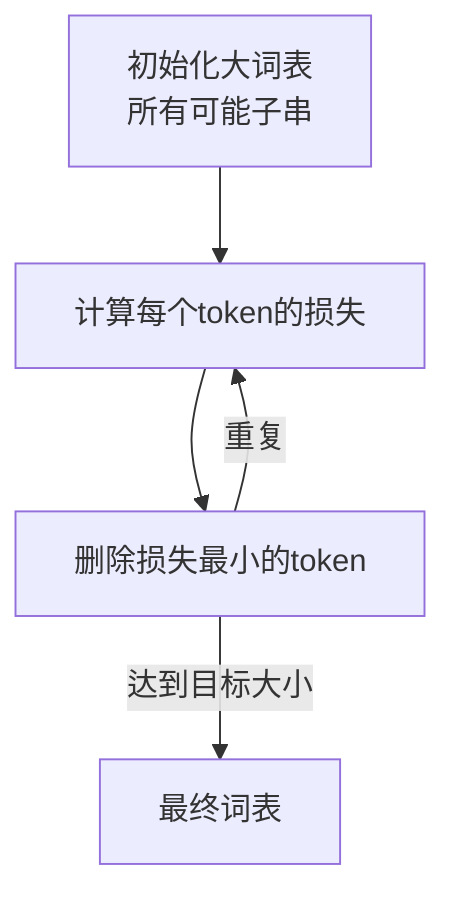

**过程**：
1. 初始化一个很大的候选词表（包含所有可能的子串）
2. 用期望最大化 (EM) 算法计算每个 token 的概率
3. 删除移除后对总损失影响最小的 token
4. 重复直到达到目标大小

**使用 Unigram 的模型**：T5、ALBERT、XLNet、mBART

## 4. 特殊 Token

现代分词器都包含一些特殊 token：

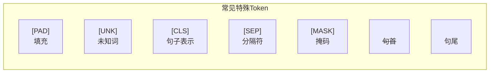

| Token | 作用 | 使用场景 |
|-------|------|----------|
| [PAD] | 填充 | 对齐批次中不同长度的序列 |
| [UNK] | 未知词 | 词表外的 token（现代分词器很少用到） |
| [CLS] | 分类 | BERT 用于获取句子表示 |
| [SEP] | 分隔 | 分隔多个句子 |
| [MASK] | 掩码 | BERT MLM 预训练 |
| \<s\> / \</s\> | 句子边界 | 标记句子开始/结束 |
| \<\|endoftext\|\> | 文档结束 | GPT 系列 |
| \<\|im_start\|\> / \<\|im_end\|\> | 消息边界 | ChatML 格式 |

## 5. 分词器的使用流程

### 5.1 编码过程

分词器的编码过程分为以下步骤：

1. **预处理**：对输入文本进行规范化处理，如大小写转换、Unicode 标准化等
2. **切分**：根据算法（BPE/WordPiece/Unigram）将文本切分为 token 序列
3. **映射**：将每个 token 转换为对应的数字 ID
4. **添加特殊 token**：根据需要添加句首、句尾等特殊标记

例如，对于文本 "Hello, how are you?"，GPT-2 分词器会：
- 切分为 Hello、逗号、空格how、空格are、空格you、问号 六个 token
- 其中空格会被编码到后面的 token 中，用特殊符号 G（代表空格）表示
- 最终得到类似 15496、11、703、389、345、30 这样的 ID 序列

### 5.2 解码过程

解码是编码的逆过程，将数字 ID 序列还原为原始文本。好的分词器应该保证编码后再解码能完全还原原文。

### 5.3 批量处理

处理多个文本时，由于长度不同，需要进行填充（padding）使所有序列长度一致。同时会生成注意力掩码，告诉模型哪些位置是真实内容、哪些是填充。

## 6. 分词器的影响

### 6.1 对模型性能的影响

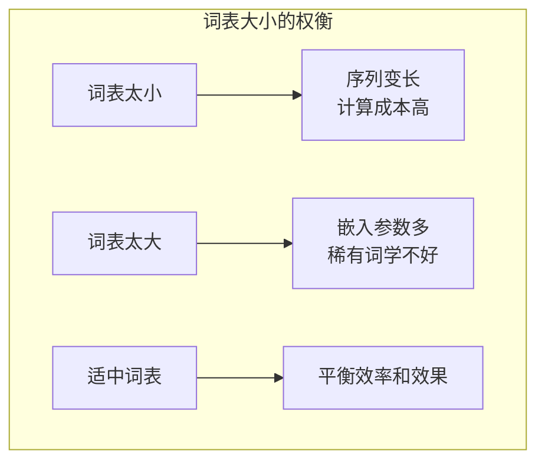

**典型词表大小**：
| 模型 | 词表大小 |
|------|----------|
| GPT-2 | 50,257 |
| GPT-4 | 100,256 |
| LLaMA | 32,000 |
| LLaMA-3 | 128,000 |
| Qwen 2 | 151,851 |

### 6.2 压缩率

**压缩率** = 原始字符数 / Token 数

好的分词器能用更少的 token 表示相同文本，这意味着：
- 更低的 API 成本
- 更长的"有效上下文"

### 6.3 多语言挑战

英文分词器在中文上表现差。比如 GPT-2 分词器处理中文"你好世界"时，每个汉字会被拆成多个字节级别的 token，导致效率极低——4 个汉字可能变成 12 个 token。

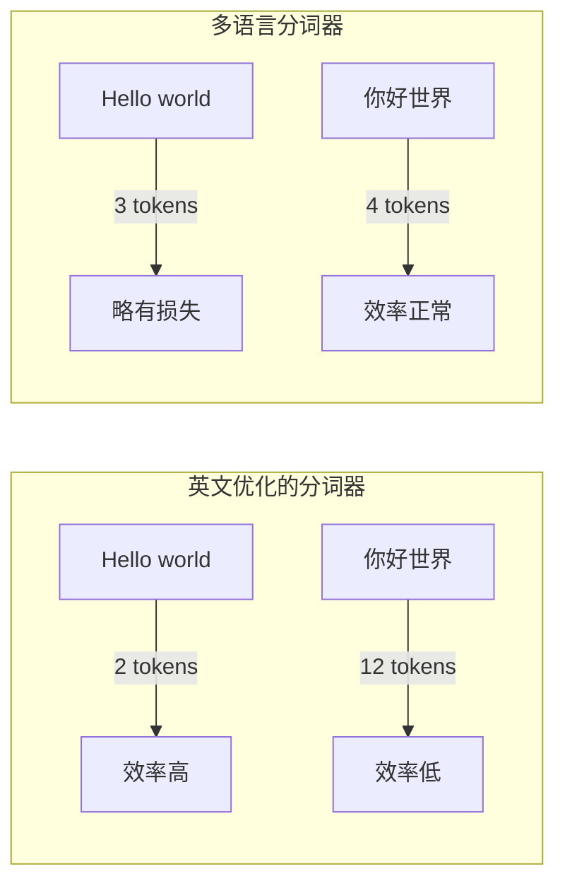

**解决方案**：
- 训练多语言分词器（如 Qwen、Gemma）
- 扩展词表添加中文 token（如 Chinese-LLaMA）
- 使用 Byte-level BPE（如 GPT-4）

## 7. 2025年分词器革命性进展

### 7.1 UTF-16 Byte-Level BPE (BBPE16) - CJK语言优化突破

**核心创新**：传统的UTF-8字节级BPE在处理中日韩(CJK)语言时效率低下。2025年推出的BBPE16直接在UTF-16字节级别进行处理，显著改善了多语言支持。

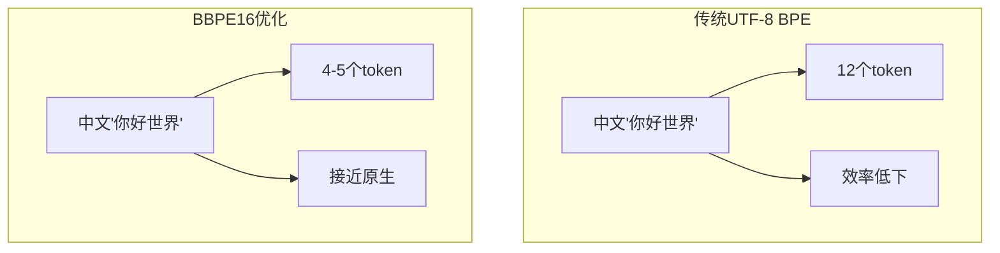

**技术优势**：
- **中文减少26.3%**的token数量
- **韩语减少9.2%**的token数量
- 保持与标准字节级字母的兼容性
- 提高大规模应用的计算效率和延迟

### 7.2 Parity-Aware BPE - 跨语言公平性

**核心思想**：传统分词器对高资源语言（如英语）优化过度，导致低资源语言token数量激增。Parity-Aware BPE在训练时优先考虑代表性不足语言的压缩效率。

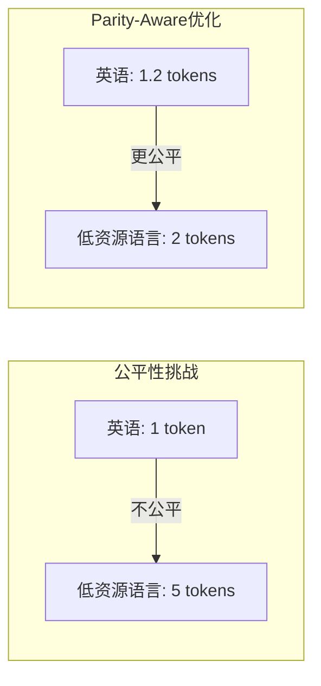

**实现机制**：
- 训练时为低资源语言分配更高权重
- 在不牺牲全局压缩率的前提下减少语言间token数量差异
- 保持下游任务性能的同时提升跨语言公平性

### 7.3 H-Net (Carnegie Mellon) - 无分词器革命

**突破性理念**：完全抛弃传统分词器，直接处理原始字节序列。这是卡内基梅隆大学2025年的重大突破。

**技术特点**：
- **动态分块**：根据内容语义自适应地将字节序列分组成"补丁"
- **对抗鲁棒性**：对拼写错误、特殊字符等对抗输入具有强鲁棒性
- **语言无偏**：消除对高资源语言的系统性偏见
- **端到端优化**：分词过程与模型训练联合优化

**实际效果**：
- 在低资源语言上性能提升显著
- 对噪声数据和特殊字符处理能力增强
- 减少了分词器引入的信息损失

### 7.4 领域自适应分词2.0

2024年的ChipNeMo技术演进，支持更细粒度的领域定制：

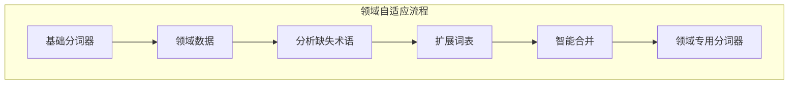

**改进特性**：
- **智能术语识别**：自动识别领域核心术语和专有名词
- **渐进式扩展**：避免破坏原有词表结构的情况下添加新token
- **性能保证**：确保在领域任务上1.6%-3.3%的性能提升

### 7.5 RAG系统专用分词

针对检索增强生成(RAG)系统的特殊需求，2025年出现了专用分词优化：

**minbpe定制化方案**：
- 在医疗等专业领域，将"心肌梗死"、"区块链"等术语保持为单一token
- 通过这种方式，RAG检索精度提升**40%**
- 更好地保持术语的语义完整性

### 7.6 实时分词与批处理优化

**实时处理能力**：
- 2025年的分词算法支持大规模数据集的实时tokenization
- 延迟降低至毫秒级别，满足在线服务需求
- 支持多云计算环境的分布式tokenization

**批处理优化**：
- 针对不同长度序列的自适应批处理策略
- 内存使用效率提升，支持更大批量处理
- GPU加速的并行tokenization算法

## 8. Token成本优化新策略

### 8.1 智能token选择

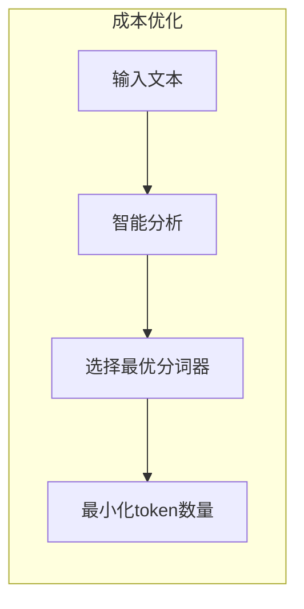

**策略特点**：
- 根据文本内容特征自动选择最优分词器
- 多语言混合文本的智能切换机制
- 实时token数量预估和成本控制

### 8.2 动态词表管理

**词表压缩技术**：
- PickyBPE 2.0：更精准的"垃圾"token识别和清理
- 词表大小自适应调整，平衡效率和效果
- 支持在线词表更新和优化

## 9. Token 与成本计算 (2025年更新)

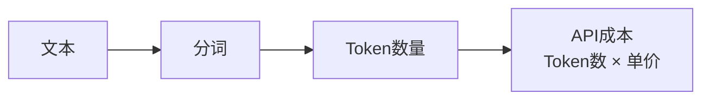

**主流模型 Token 价格 (2025)**：

| 模型 | 输入价格 | 输出价格 | 优化特点 |
|------|----------|----------|----------|
| GPT-4o | $2.5/1M tokens | $10/1M tokens | 多模态，128K上下文 |
| GPT-4o mini | $0.15/1M tokens | $0.6/1M tokens | 高性价比小模型 |
| Claude 3.5 Sonnet | $3/1M tokens | $15/1M tokens | 200K上下文 |
| Claude 3.5 Haiku | $0.8/1M tokens | $4/1M tokens | 2025年新发布 |
| DeepSeek-V2 | ¥1/1M tokens | ¥2/1M tokens | 超高性价比 |
| Qwen2.5-72B | $0.5/1M tokens | $2/1M tokens | 开源优化 |

**成本优化策略**：
- **多语言优化**：使用BBPE16等技术降低中文token数量26.3%
- **专用分词器**：在垂直领域可减少30-40%的token使用
- **智能选择**：根据内容自动选择最优分词策略

**成本估算工具**：
- OpenAI tiktoken库（支持GPT系列）
- HuggingFace tokenizers（支持开源模型）
- 自研token计数器（针对定制分词器）

## 10. 未来发展趋势

### 10.1 无分词器化

H-Net等技术的出现预示着"无分词器"时代的到来：
- **端到端优化**：分词与模型训练联合优化
- **语言无偏**：消除对不同语言的系统性偏差
- **鲁棒性增强**：更好地处理噪声和异常输入

### 10.2 自适应分词

未来的分词器将更加智能和自适应：
- **上下文感知**：根据上下文动态调整分词策略
- **任务导向**：针对不同任务优化不同的分词方案
- **实时学习**：从使用反馈中持续改进分词质量

### 10.3 多模态统一分词

随着多模态模型的发展，统一的分词策略变得重要：
- **跨模态token**：统一处理文本、图像、音频的token表示
- **联合优化**：多模态数据的联合分词和嵌入
- **模态平衡**：平衡不同模态的token数量和重要性

### 10.4 隐私保护分词

在注重隐私的时代，分词技术也在演进：
- **本地化分词**：在设备端完成分词，保护用户隐私
- **差分隐私**：在分词过程中添加隐私保护机制
- **联邦分词**：支持联邦学习场景的分布式分词

## 11. 本章小结

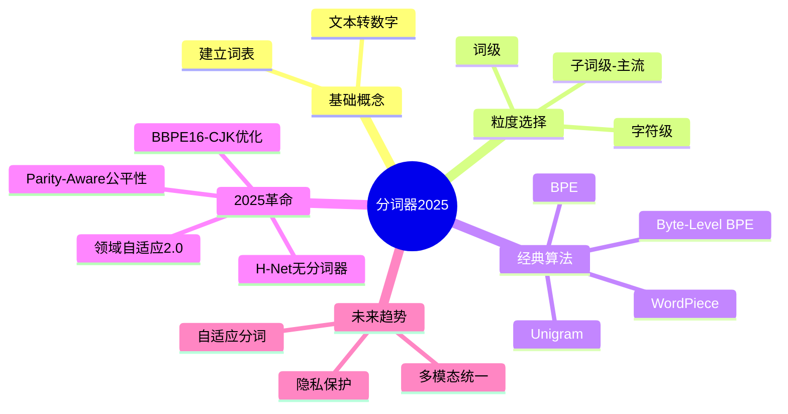

**核心要点**：
- 分词器是 LLM 的"翻译官"，将文本转为数字
- 子词分词（BPE、WordPiece、Unigram）是现代主流
- 2025年重大突破：BBPE16改善多语言效率，H-Net实现无分词器处理
- 分词质量直接影响模型性能、推理成本和多语言公平性
- 未来趋势：自适应、多模态统一、隐私保护分词
- 成本优化策略：专用分词器可在垂直领域减少30-40%的token使用

## 延伸阅读

- [HuggingFace Tokenizers 文档](https://huggingface.co/docs/tokenizers)
- Neural Machine Translation of Rare Words with Subword Units (BPE 论文)
- SentencePiece: A simple and language independent subword tokenizer
- [Tiktoken GitHub](https://github.com/openai/tiktoken)
- [Andrej Karpathy: Let's build the GPT Tokenizer](https://www.youtube.com/watch?v=zduSFxRajkE)

---

*下一篇：[位置编码：让模型理解顺序](./04-positional-encoding.md)*
