# 分词器：文本到数字的桥梁

神经网络无法直接处理文本，需要先将文本转换为数字。分词器 (Tokenizer) 正是完成这一关键转换的组件。本文将深入探讨现代 LLM 中使用的分词技术。

## 1. 为什么需要分词？

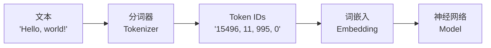

**分词器的核心任务**：
1. **切分文本**：将连续文本切分为离散单元 (tokens)
2. **建立映射**：每个 token 对应一个唯一 ID
3. **构建词表**：所有可能 token 的集合 (vocabulary)

```python
# 示例
text = "Hello, world!"
tokens = ["Hello", ",", " world", "!"]  # 切分
token_ids = [15496, 11, 995, 0]          # 映射为ID
```

## 2. 分词粒度的选择

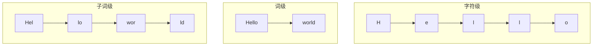

### 2.1 字符级 (Character-level)

```
"Hello" → ['H', 'e', 'l', 'l', 'o']
```

| 优点 | 缺点 |
|------|------|
| ✅ 词表小（几百个字符） | ❌ 序列过长 |
| ✅ 无 OOV 问题 | ❌ 难以捕捉语义 |
| ✅ 对错别字鲁棒 | ❌ 计算成本高 |

### 2.2 词级 (Word-level)

```
"Hello world" → ['Hello', 'world']
```

| 优点 | 缺点 |
|------|------|
| ✅ 语义清晰 | ❌ 词表巨大（几十万词） |
| ✅ 序列短 | ❌ 无法处理新词 (OOV) |
| | ❌ 无法学习词根词缀 |

### 2.3 子词级 (Subword-level) ⭐️ 现代主流

```
"unhappiness" → ['un', 'happiness']
"playing" → ['play', 'ing']
```

| 优点 | 缺点 |
|------|------|
| ✅ 平衡词表大小和序列长度 | ❌ 切分方式需要学习 |
| ✅ 能处理未见过的词 | |
| ✅ 捕捉词根、词缀等规律 | |

## 3. 主流分词算法

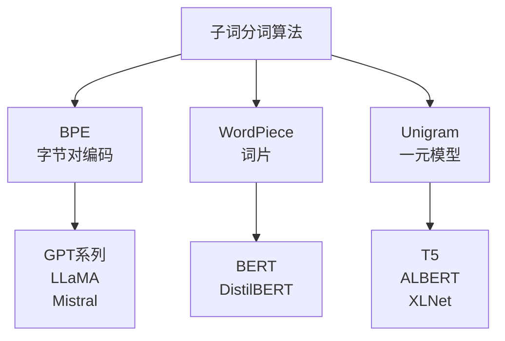

### 3.1 BPE (Byte Pair Encoding)

**核心思想**：从字符开始，不断合并最频繁出现的相邻 pair。

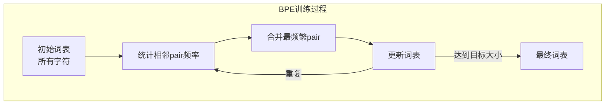

**训练示例**：

```
语料: "low lower lowest"

初始: ['l', 'o', 'w', 'e', 'r', 's', 't', ' ']

统计 pair 频率:
('l', 'o'): 3次, ('o', 'w'): 3次, ('w', 'e'): 2次, ...

Step 1: 合并 ('l', 'o') → 'lo'
词表: ['lo', 'w', 'e', 'r', 's', 't', ' ']

Step 2: 合并 ('lo', 'w') → 'low'
词表: ['low', 'e', 'r', 's', 't', ' ']

Step 3: 合并 ('e', 'r') → 'er'
词表: ['low', 'er', 's', 't', ' ']

... 继续直到达到目标词表大小
```

**分词过程**：按学习到的合并规则切分

```
"lowest" → ['low', 'est']
"slower" → ['s', 'low', 'er']
```

**使用 BPE 的模型**：GPT 系列、LLaMA、Mistral、Qwen

### 3.2 WordPiece

**核心思想**：选择使**语言模型似然最大化**的合并。

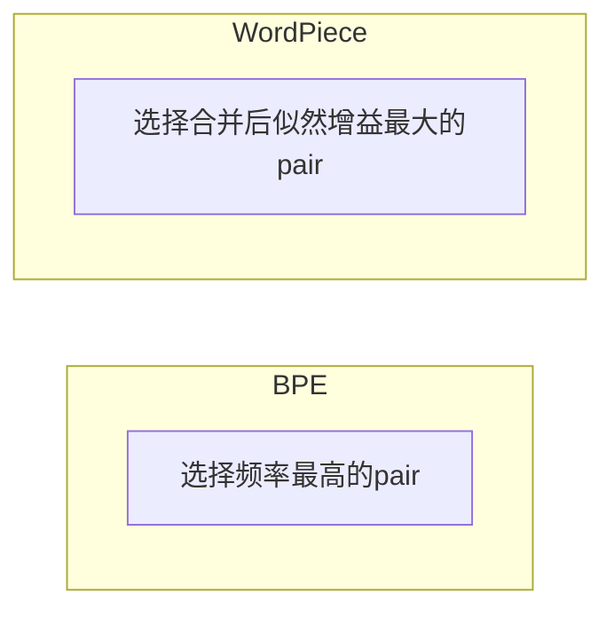

**特点**：使用 `##` 标记非词首 token

```
"unhappiness" → ['un', '##hap', '##pi', '##ness']
```

`##` 前缀表示这个 token 是某个词的一部分，不是词的开头。

**使用 WordPiece 的模型**：BERT、DistilBERT、ELECTRA

### 3.3 Unigram (SentencePiece)

**核心思想**：从大词表开始，逐步**删除**对似然影响最小的 token。

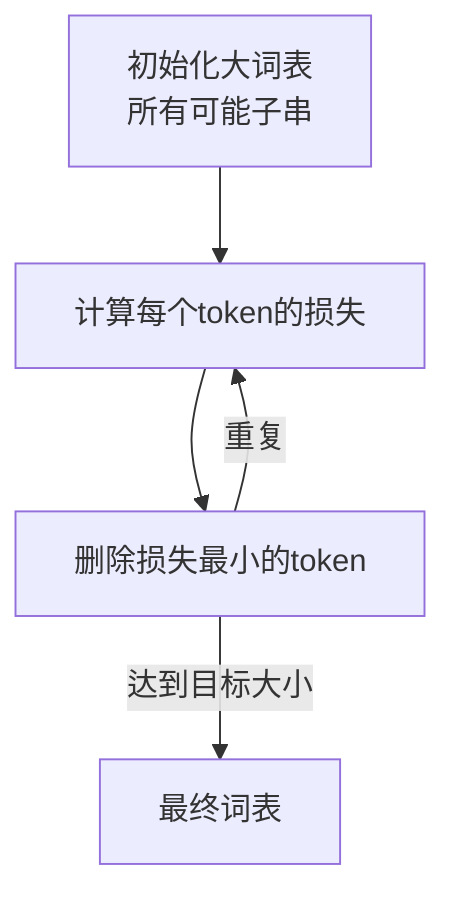

**过程**：
1. 初始化一个很大的候选词表（包含所有可能的子串）
2. 用期望最大化 (EM) 算法计算每个 token 的概率
3. 删除移除后对总损失影响最小的 token
4. 重复直到达到目标大小

**使用 Unigram 的模型**：T5、ALBERT、XLNet、mBART

## 4. 特殊 Token

现代分词器都包含一些特殊 token：

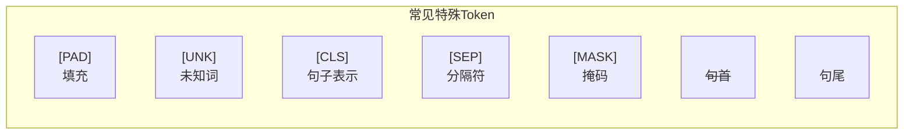

| Token | 作用 | 使用场景 |
|-------|------|----------|
| `[PAD]` | 填充 | 对齐批次中不同长度的序列 |
| `[UNK]` | 未知词 | 词表外的 token（现代分词器很少用到） |
| `[CLS]` | 分类 | BERT 用于获取句子表示 |
| `[SEP]` | 分隔 | 分隔多个句子 |
| `[MASK]` | 掩码 | BERT MLM 预训练 |
| `<s>` / `</s>` | 句子边界 | 标记句子开始/结束 |
| `<\|endoftext\|>` | 文档结束 | GPT 系列 |
| `<\|im_start\|>` / `<\|im_end\|>` | 消息边界 | ChatML 格式 |

## 5. 实战：使用分词器

### 5.1 HuggingFace Tokenizers

```python
from transformers import AutoTokenizer

# 加载预训练分词器
tokenizer = AutoTokenizer.from_pretrained("gpt2")

# 编码
text = "Hello, how are you?"
tokens = tokenizer.tokenize(text)
print(f"Tokens: {tokens}")
# ['Hello', ',', 'Ġhow', 'Ġare', 'Ġyou', '?']
# Ġ 表示该 token 前有空格

ids = tokenizer.encode(text)
print(f"IDs: {ids}")
# [15496, 11, 703, 389, 345, 30]

# 解码
decoded = tokenizer.decode(ids)
print(f"Decoded: {decoded}")
# "Hello, how are you?"

# 批量编码
batch = tokenizer(
    ["Hello!", "How are you?"],
    padding=True,
    return_tensors="pt"
)
print(batch.input_ids)
```

### 5.2 OpenAI Tiktoken

```python
import tiktoken

# 加载编码器
enc = tiktoken.encoding_for_model("gpt-4")

# 编码
text = "Hello, world!"
tokens = enc.encode(text)
print(f"Tokens: {tokens}")  # [9906, 11, 1917, 0]
print(f"Token count: {len(tokens)}")  # 4

# 解码
decoded = enc.decode(tokens)
print(f"Decoded: {decoded}")  # "Hello, world!"

# 查看每个token对应的文本
for token_id in tokens:
    print(f"{token_id} -> '{enc.decode([token_id])}'")
```

**Tiktoken 特点**：
- OpenAI 官方实现，Rust 编写，速度极快
- 支持 GPT-3.5、GPT-4、GPT-4o 等模型
- 可用于计算 API 调用成本

## 6. 分词器的影响

### 6.1 对模型性能的影响

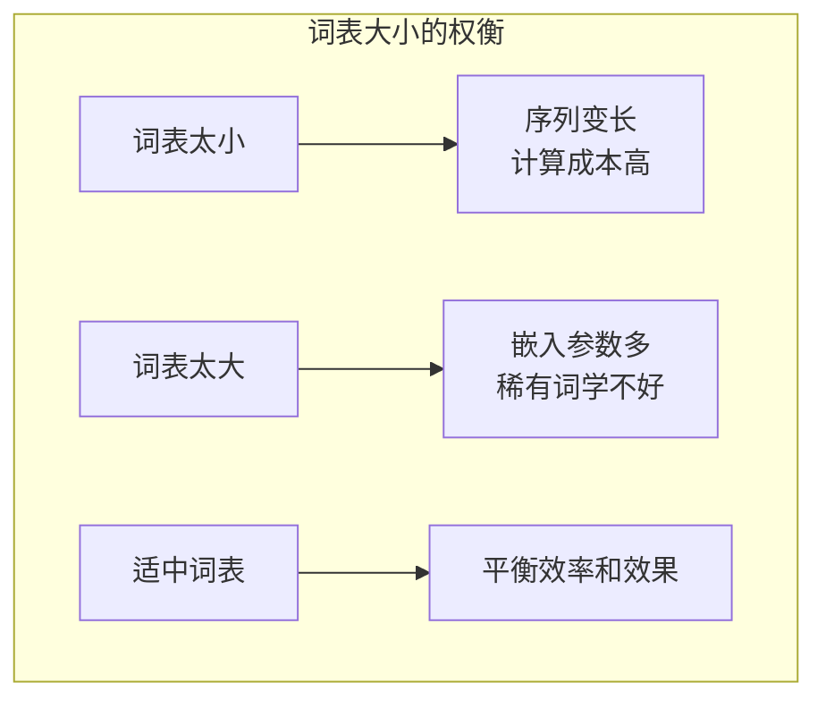

**典型词表大小**：
| 模型 | 词表大小 |
|------|----------|
| GPT-2 | 50,257 |
| GPT-4 | 100,256 |
| LLaMA | 32,000 |
| LLaMA-2 | 32,000 |
| Qwen | 151,851 |

### 6.2 压缩率

**压缩率** = 原始字符数 / Token 数

好的分词器能用更少的 token 表示相同文本，这意味着：
- 更低的 API 成本
- 更长的"有效上下文"

### 6.3 多语言挑战

英文分词器在中文上表现差：

```python
# GPT-2 分词器处理中文
tokenizer = AutoTokenizer.from_pretrained("gpt2")
tokens = tokenizer.tokenize("你好世界")
print(tokens)
# ['ä', '½', 'ł', 'å', '¥', '½', 'ä', '¸', 'ĸ', 'ç', 'ķ', 'Į']
# 每个汉字被拆成多个 byte！效率极低
```

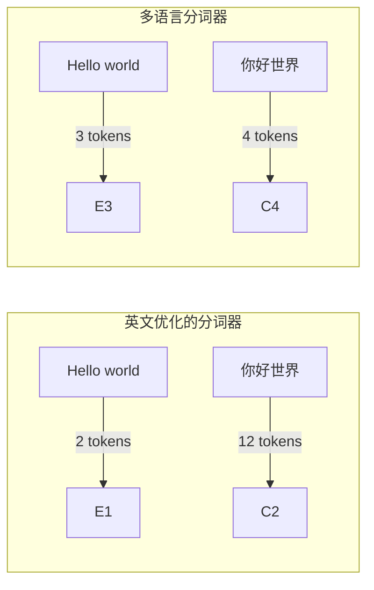

**解决方案**：
- 训练多语言分词器（如 Qwen）
- 扩展词表添加中文 token（如 Chinese-LLaMA）
- 使用 Byte-level BPE（如 GPT-4）

## 7. 训练自己的分词器

```python
from tokenizers import Tokenizer
from tokenizers.models import BPE
from tokenizers.trainers import BpeTrainer
from tokenizers.pre_tokenizers import Whitespace

# 初始化 BPE 分词器
tokenizer = Tokenizer(BPE(unk_token="[UNK]"))
tokenizer.pre_tokenizer = Whitespace()

# 定义训练器
trainer = BpeTrainer(
    vocab_size=30000,
    min_frequency=2,
    special_tokens=["[UNK]", "[PAD]", "[CLS]", "[SEP]", "[MASK]"]
)

# 训练
files = ["data/corpus.txt"]
tokenizer.train(files, trainer)

# 保存
tokenizer.save("my_tokenizer.json")

# 测试
output = tokenizer.encode("Hello, world!")
print(output.tokens)
```

## 8. Token 与成本计算

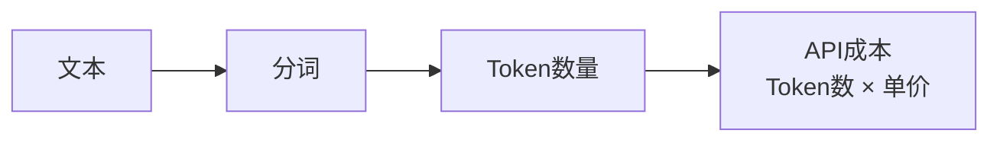

**主流模型 Token 价格 (2024)**：

| 模型 | 输入价格 | 输出价格 |
|------|----------|----------|
| GPT-4 Turbo | $10/1M tokens | $30/1M tokens |
| GPT-4o | $5/1M tokens | $15/1M tokens |
| Claude 3 Sonnet | $3/1M tokens | $15/1M tokens |
| Claude 3 Haiku | $0.25/1M tokens | $1.25/1M tokens |

**估算示例**：
```python
import tiktoken

enc = tiktoken.encoding_for_model("gpt-4o")
text = "你的长文本..."
num_tokens = len(enc.encode(text))
cost = num_tokens * 0.000005  # $5/1M tokens
print(f"预计成本: ${cost:.4f}")
```

## 9. 本章小结

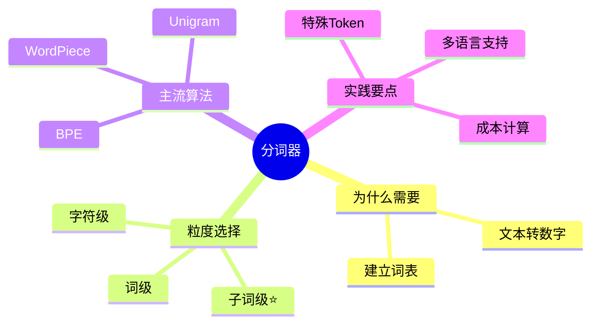

**核心要点**：
- ✅ 分词器是 LLM 的"翻译官"，将文本转为数字
- ✅ 子词分词（BPE、WordPiece、Unigram）是现代主流
- ✅ 分词质量直接影响模型性能和推理成本
- ✅ 多语言场景需要特别关注分词器的选择

## 延伸阅读

- [HuggingFace Tokenizers 文档](https://huggingface.co/docs/tokenizers)
- Neural Machine Translation of Rare Words with Subword Units (BPE 论文)
- SentencePiece: A simple and language independent subword tokenizer
- [Tiktoken GitHub](https://github.com/openai/tiktoken)
- [Andrej Karpathy: Let's build the GPT Tokenizer](https://www.youtube.com/watch?v=zduSFxRajkE)

---

*下一篇：[位置编码：让模型理解顺序](./04-positional-encoding.md)*
