# 位置编码：让模型理解顺序

Transformer 架构使用自注意力机制并行处理所有位置，但这也带来一个问题：模型无法区分 "猫追狗" 和 "狗追猫"。位置编码 (Positional Encoding) 正是为了解决这个问题。

## 1. 为什么需要位置编码？

### 1.1 RNN 的隐式位置信息

RNN 按顺序处理输入，位置信息自然地蕴含在计算顺序中：

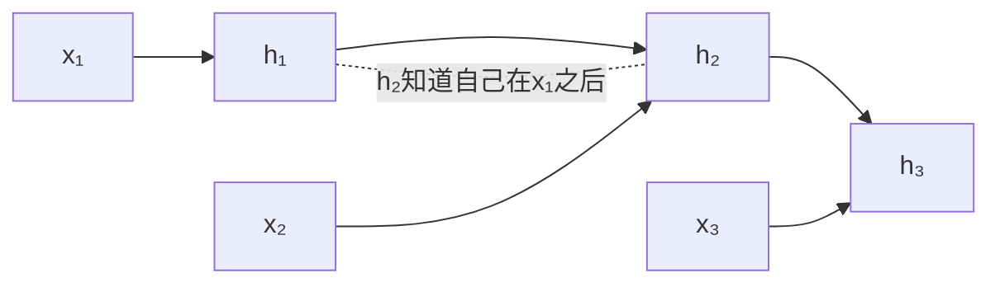

### 1.2 Transformer 的并行困境

Transformer 同时处理所有位置：

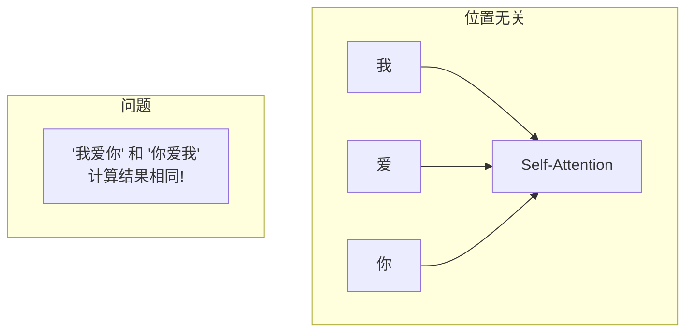

对于 Transformer 来说，**"我爱你" 和 "你爱我" 的 Self-Attention 计算结果完全相同**！这显然不合理。

**解决方案**：显式地将位置信息注入模型。

## 2. 位置编码的发展历程

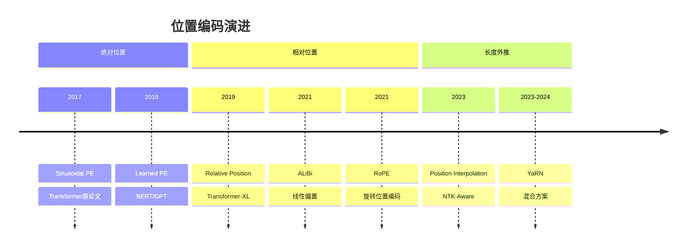

## 3. 绝对位置编码

### 3.1 正弦余弦编码 (Sinusoidal PE)

原始 Transformer 论文提出的方案，使用不同频率的正弦和余弦函数：

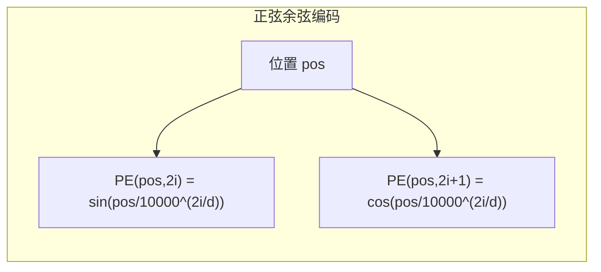

**公式**：
```
PE(pos, 2i)   = sin(pos / 10000^(2i/d))
PE(pos, 2i+1) = cos(pos / 10000^(2i/d))
```

其中：
- `pos`：位置索引 (0, 1, 2, ...)
- `i`：维度索引
- `d`：模型维度

```python
import torch
import math

def sinusoidal_pe(max_len, d_model):
    """生成正弦余弦位置编码"""
    pe = torch.zeros(max_len, d_model)
    position = torch.arange(0, max_len).unsqueeze(1).float()
    
    # 计算频率项
    div_term = torch.exp(
        torch.arange(0, d_model, 2).float() * 
        (-math.log(10000.0) / d_model)
    )
    
    # 偶数维度用 sin，奇数维度用 cos
    pe[:, 0::2] = torch.sin(position * div_term)
    pe[:, 1::2] = torch.cos(position * div_term)
    
    return pe

# 使用
pe = sinusoidal_pe(512, 768)  # (512, 768)
x = x + pe[:seq_len]  # 加到输入上
```

**特点**：
- 每个位置有唯一的编码
- 相对位置可以通过线性变换表示
- 理论上可以外推到更长序列
- 实际外推能力有限

### 3.2 可学习位置编码 (Learned PE)

让模型自己学习位置表示：

```python
class LearnedPositionalEncoding(nn.Module):
    def __init__(self, max_len, d_model):
        super().__init__()
        # 位置嵌入表：max_len 个位置，每个 d_model 维
        self.pe = nn.Embedding(max_len, d_model)
    
    def forward(self, x):
        # x: (batch, seq_len, d_model)
        seq_len = x.size(1)
        positions = torch.arange(seq_len, device=x.device)
        return x + self.pe(positions)  # 加到输入上
```

**使用模型**：BERT、GPT-1/2

**局限性**：
- 无法处理超过 `max_len` 的序列
- 需要额外参数

## 4. 相对位置编码

绝对位置编码的问题：

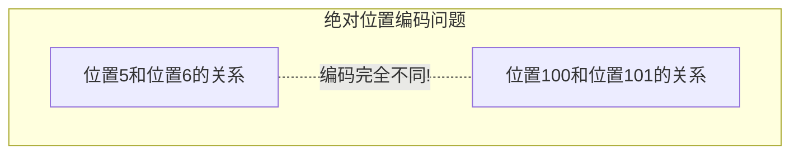

相对位置编码关注的是 token 之间的**相对距离**。

### 4.1 Relative Position Bias

在注意力分数中加入相对位置偏置：

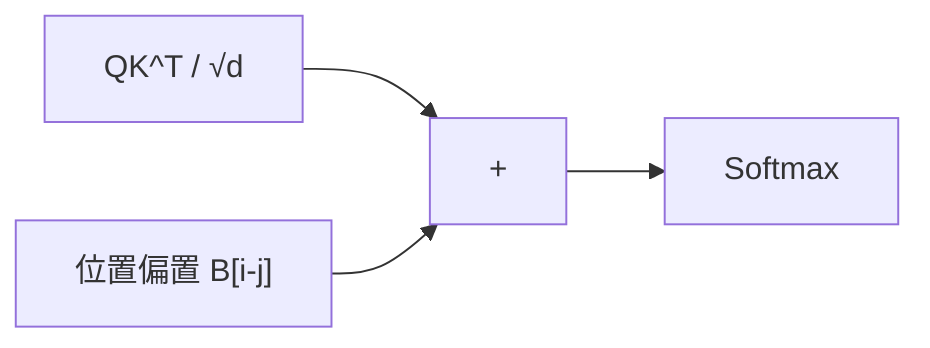

```
Attention(Q, K) = softmax(QK^T / √d + B)
```

其中 `B[i,j]` 取决于相对距离 `i-j`。

**使用模型**：T5、DeBERTa

### 4.2 ALiBi (Attention with Linear Biases)

更简单的方案：直接在注意力分数上减去与距离成正比的惩罚：

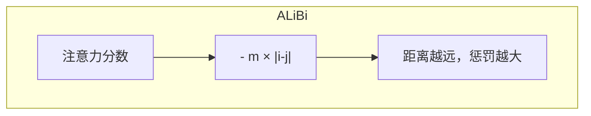

```
Attention(Q, K) = softmax(QK^T / √d - m · |i-j|)
```

其中 `m` 是每个注意力头不同的斜率（超参数）。

```python
def alibi_bias(seq_len, num_heads):
    """生成 ALiBi 位置偏置"""
    # 每个头使用不同的斜率
    slopes = torch.tensor([2 ** (-8 * i / num_heads) for i in range(num_heads)])
    
    # 相对位置矩阵
    positions = torch.arange(seq_len)
    relative_pos = positions.unsqueeze(0) - positions.unsqueeze(1)  # (seq, seq)
    
    # 偏置 = -斜率 × |相对距离|
    bias = -slopes.view(-1, 1, 1) * relative_pos.abs()  # (heads, seq, seq)
    
    return bias
```

**优点**：
- ✅ 无需额外参数
- ✅ 外推能力强（训练 1K，推理 100K+）
- ✅ 实现简单

**使用模型**：BLOOM、MPT、Falcon

## 5. 旋转位置编码 (RoPE)

### 5.1 核心思想

RoPE (Rotary Position Embedding) 是目前**最流行**的位置编码方案，被 LLaMA、Qwen、Mistral、DeepSeek 等主流模型采用。

**关键洞察**：将位置信息编码为向量的**旋转**。

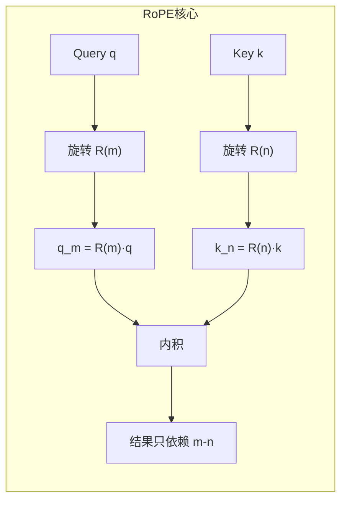

**数学表达**：
```
q_m = R(m) · q  # 位置 m 的 query，旋转 m 次
k_n = R(n) · k  # 位置 n 的 key，旋转 n 次

q_m · k_n = q · R(m-n) · k  # 内积只依赖相对位置 m-n！
```

### 5.2 旋转矩阵

将向量的相邻两个维度视为一个 2D 平面，应用旋转：

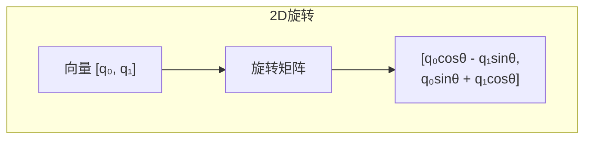

对于 d 维向量，进行 d/2 次旋转，每次使用不同的角度 θ：

```python
def precompute_rope(dim, max_seq_len, base=10000):
    """预计算 RoPE 的 cos 和 sin 值"""
    # 计算频率
    inv_freq = 1.0 / (base ** (torch.arange(0, dim, 2).float() / dim))
    
    # 位置序列
    positions = torch.arange(max_seq_len)
    
    # 外积得到角度矩阵
    angles = positions.unsqueeze(1) * inv_freq.unsqueeze(0)  # (seq, dim/2)
    
    # 计算 cos 和 sin
    cos = torch.cos(angles)  # (seq, dim/2)
    sin = torch.sin(angles)  # (seq, dim/2)
    
    return cos, sin

def apply_rope(x, cos, sin):
    """应用旋转位置编码"""
    # x: (batch, seq_len, heads, head_dim)
    x1 = x[..., ::2]   # 偶数维度
    x2 = x[..., 1::2]  # 奇数维度
    
    # 旋转操作
    x_rotated = torch.cat([
        x1 * cos - x2 * sin,  # 旋转后的偶数维度
        x1 * sin + x2 * cos   # 旋转后的奇数维度
    ], dim=-1)
    
    return x_rotated
```

### 5.3 RoPE 的优势

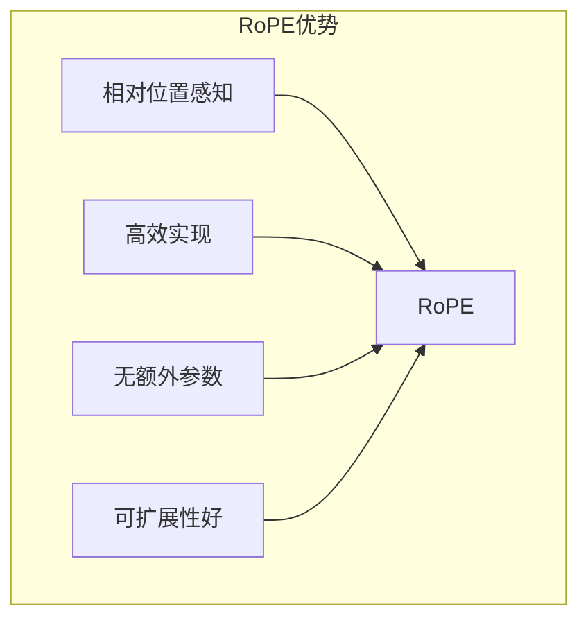

| 特性 | RoPE | 说明 |
|------|------|------|
| **相对位置** | 是 | 内积自然编码相对位置 |
| **外推能力** | 是 | 较好（可通过技巧增强） |
| **实现效率** | 是 | 只需逐元素操作 |
| **额外参数** | 是 | 无 |
| **长度外推** | 是 | 可结合 PI/NTK/YaRN |

## 6. 长度外推技术

训练长度有限（如 4K），如何在推理时处理更长序列（如 32K）？

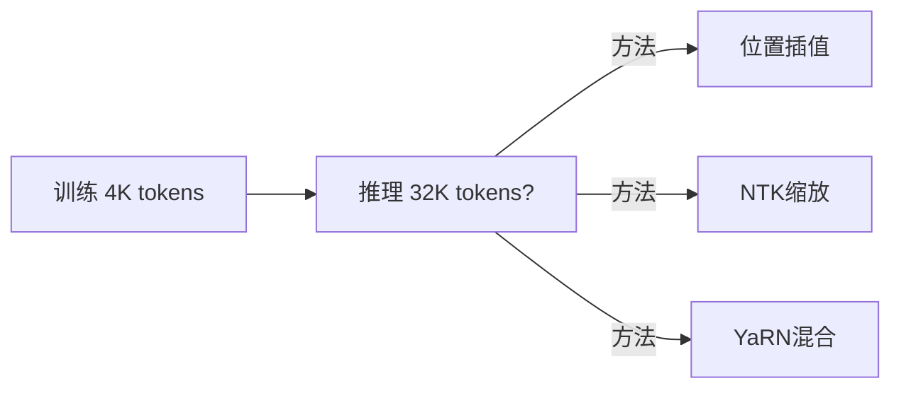

### 6.1 位置插值 (Position Interpolation)

将位置索引线性缩放到训练范围内：

```python
# 原始位置（超出训练范围）
pos = [0, 1, 2, ..., 8191]  # 想要 8K，但只训练了 4K

# 位置插值：缩放到训练范围
scale = 4096 / 8192  # = 0.5
pos_scaled = pos * scale  # [0, 0.5, 1, ..., 4095.5]
```

**Meta 论文**：*Extending Context Window of Large Language Models via Positional Interpolation*

### 6.2 NTK-Aware Scaling

调整 RoPE 的**基频**而非位置：

```python
# 原始 RoPE 基频
base = 10000

# NTK 缩放（假设扩展 2 倍长度）
alpha = 2
new_base = base * alpha  # = 20000

# 使用新基频计算
inv_freq = 1.0 / (new_base ** (torch.arange(0, dim, 2) / dim))
```

**直觉**：相当于"拉伸"旋转的频率，让模型能处理更长序列。

### 6.3 YaRN (Yet another RoPE extensioN)

结合多种技术的混合方案：

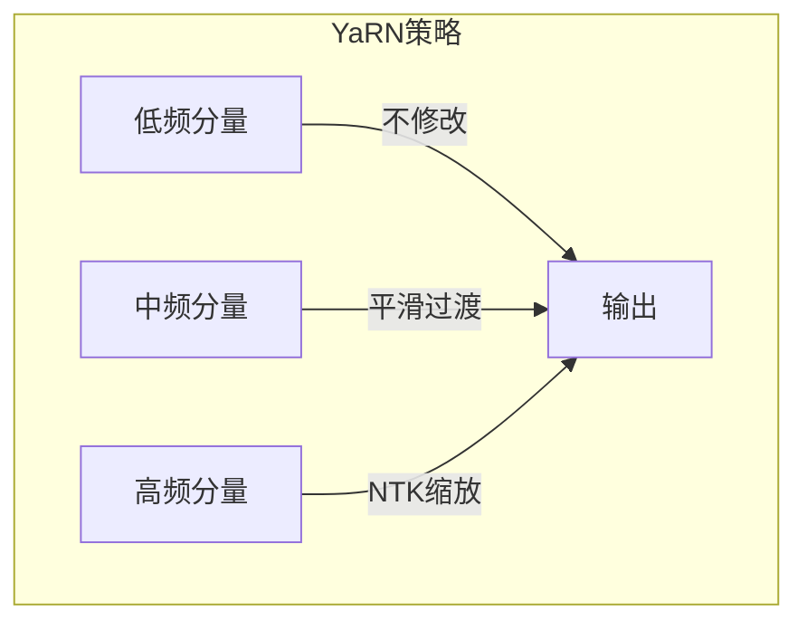

- **低频分量**：负责长距离依赖，不修改
- **高频分量**：负责局部信息，应用 NTK 缩放
- **中频分量**：平滑过渡

**效果**：训练 4K，推理可达 128K+

## 7. 位置编码对比总结

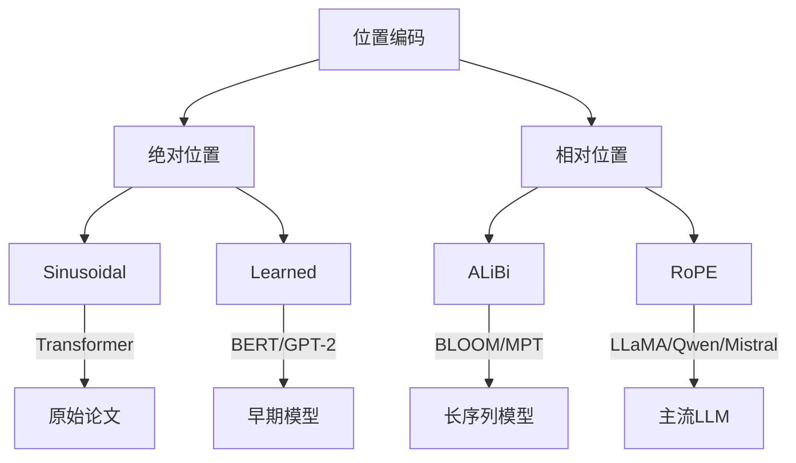

| 方法 | 代表模型 | 外推能力 | 额外参数 | 实现复杂度 |
|------|----------|----------|----------|------------|
| **Sinusoidal** | Transformer | 中 | 无 | 低 |
| **Learned** | BERT, GPT-2 | 差 | 有 | 低 |
| **ALiBi** | BLOOM, MPT, Falcon | 强 | 无 | 低 |
| **RoPE** | LLaMA, Qwen, Mistral | 中 | 无 | 中 |
| **RoPE + YaRN** | 微调模型 | 强 | 无 | 中 |

**2024 年主流选择**：
- **短序列 (< 8K)**：RoPE 即可
- **长序列 (8K-128K)**：RoPE + NTK/YaRN
- **超长序列 (128K+)**：ALiBi 或优化的 RoPE

## 8. 本章小结

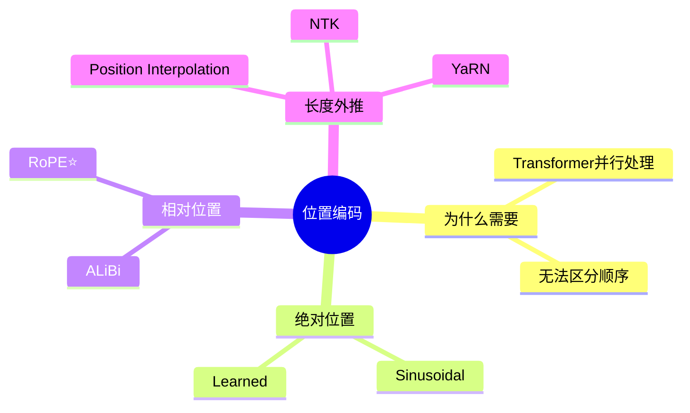

**核心要点**：
- ✅ 位置编码让 Transformer 理解序列顺序
- ✅ 从绝对位置到相对位置是重要演进
- ✅ RoPE 是当前最流行的方案（LLaMA、Qwen、Mistral）
- ✅ 长度外推技术（YaRN 等）突破训练长度限制

## 延伸阅读

- [RoFormer: Enhanced Transformer with Rotary Position Embedding](https://arxiv.org/abs/2104.09864)
- [ALiBi: Train Short, Test Long](https://arxiv.org/abs/2108.12409)
- [YaRN: Efficient Context Window Extension](https://arxiv.org/abs/2309.00071)
- [Extending Context Window via Position Interpolation](https://arxiv.org/abs/2306.15595)

---

*下一篇：[Transformer 架构演进](./05-transformer-architecture.md)*
