# 位置编码：让模型理解顺序

Transformer 架构使用自注意力机制并行处理所有位置，但这也带来一个问题：模型无法区分 "猫追狗" 和 "狗追猫"。位置编码 (Positional Encoding) 正是为了解决这个问题。

## 1. 为什么需要位置编码？

### 1.1 RNN 的隐式位置信息

RNN 按顺序处理输入，位置信息自然地蕴含在计算顺序中：

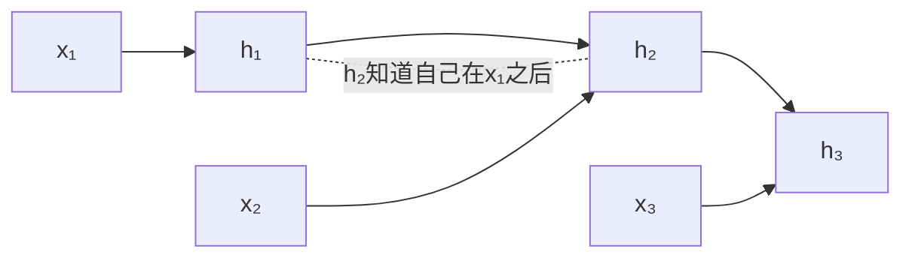

### 1.2 Transformer 的并行困境

Transformer 同时处理所有位置：

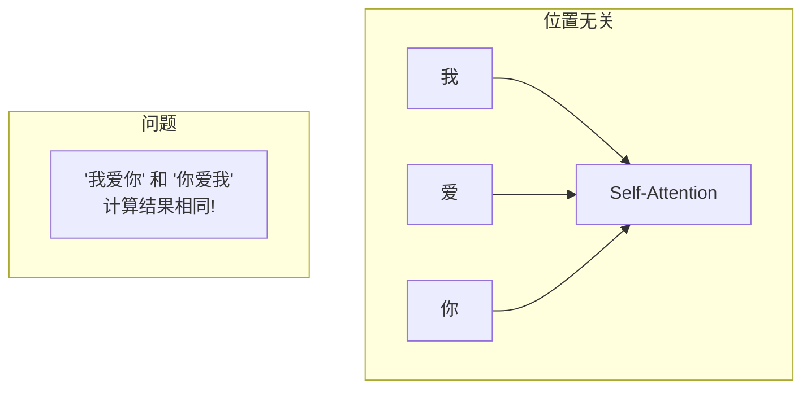

对于 Transformer 来说，**"我爱你" 和 "你爱我" 的 Self-Attention 计算结果完全相同**！这显然不合理。

**解决方案**：显式地将位置信息注入模型。

## 2. 位置编码的发展历程

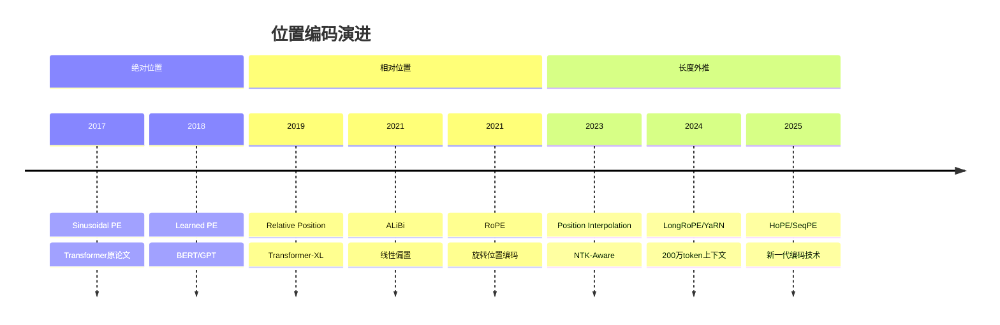

## 3. 绝对位置编码

### 3.1 正弦余弦编码 (Sinusoidal PE)

原始 Transformer 论文提出的方案，使用不同频率的正弦和余弦函数生成位置编码。

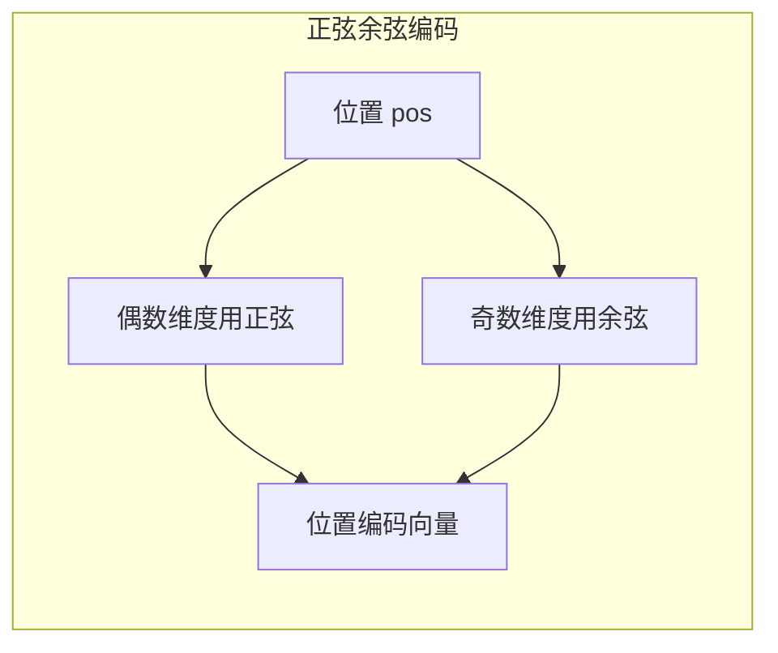

**核心思想**：
- 对于每个位置，生成一个与模型维度相同大小的向量
- 偶数维度使用正弦函数，奇数维度使用余弦函数
- 不同维度使用不同频率（从低频到高频）
- 这样设计的好处是：相对位置可以通过线性变换表示

**使用方式**：将位置编码向量直接加到输入的词嵌入上。

**特点**：
- 每个位置有唯一的编码
- 理论上可以外推到更长序列
- 无需学习额外参数
- 实际外推能力有限

### 3.2 可学习位置编码 (Learned PE)

另一种简单直接的方案：创建一个位置嵌入表，让模型自己学习每个位置的表示。

**工作原理**：
- 预设最大序列长度（如 512 或 2048）
- 为每个位置学习一个嵌入向量
- 将位置嵌入加到词嵌入上

**使用模型**：BERT、GPT-1/2

**局限性**：
- 无法处理超过预设最大长度的序列
- 需要额外的参数量

## 4. 相对位置编码

绝对位置编码的问题：

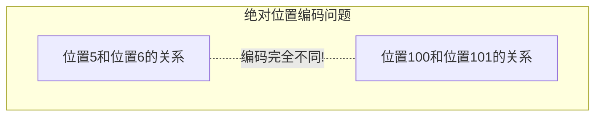

直觉上，位置 5 和 6 的相邻关系应该与位置 100 和 101 的相邻关系相似，但绝对位置编码无法表达这一点。相对位置编码关注的是 token 之间的**相对距离**。

### 4.1 Relative Position Bias

在注意力分数中加入相对位置偏置：

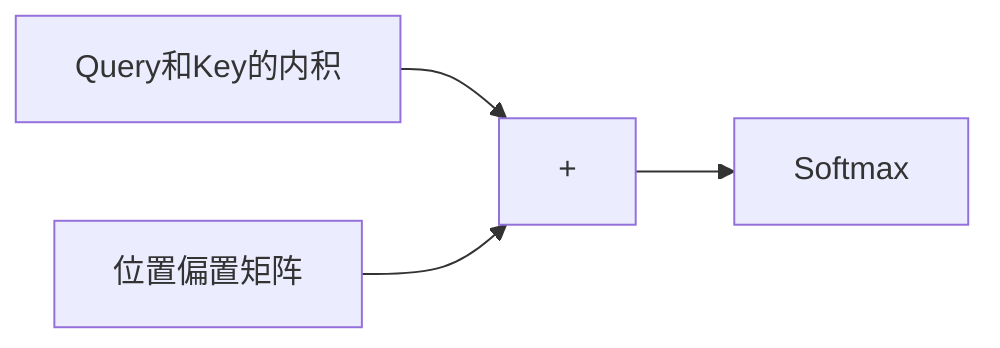

**工作原理**：在计算注意力分数时，根据 Query 和 Key 的相对位置距离，加上一个偏置值。这个偏置值可以是学习得到的，也可以是预定义的。

**使用模型**：T5、DeBERTa

### 4.2 ALiBi (Attention with Linear Biases)

更简单的方案：直接在注意力分数上减去与距离成正比的惩罚。

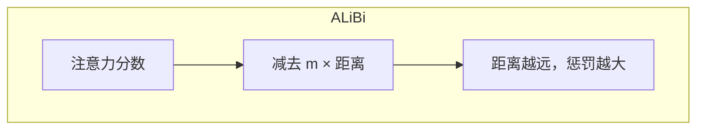

**核心思想**：
- 每个注意力头有一个固定的斜率 m（超参数，不需要学习）
- 对于相对距离为 d 的两个位置，惩罚值为 m 乘以 d
- 距离越远，惩罚越大，注意力权重越低

**优点**：
- 无需额外参数
- 外推能力强（训练 1K，推理可达 100K+）
- 实现极其简单

**使用模型**：BLOOM、MPT、Falcon

## 5. 旋转位置编码 (RoPE)

### 5.1 核心思想

RoPE (Rotary Position Embedding) 是目前**最流行**的位置编码方案，被 LLaMA、Qwen、Mistral、DeepSeek 等主流模型采用。

**关键洞察**：将位置信息编码为向量的**旋转**。

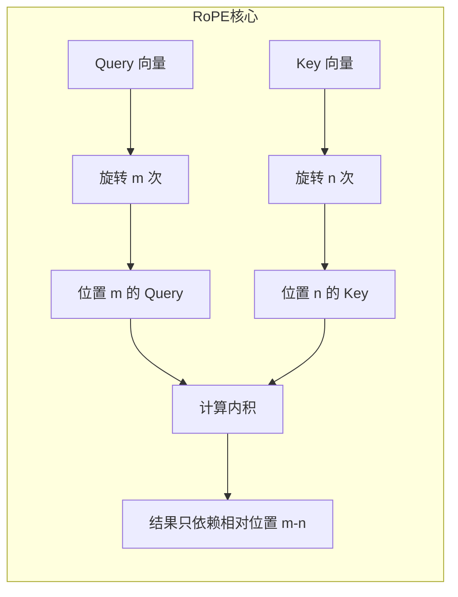

**工作原理**：
- 将向量的每两个相邻维度视为一个二维平面上的点
- 根据位置索引，对这个点进行旋转
- 位置 m 旋转 m 个角度，位置 n 旋转 n 个角度
- 神奇的是，两个旋转后向量的内积只取决于相对位置 (m-n)

### 5.2 旋转矩阵

将向量的相邻两个维度视为一个 2D 平面，应用旋转变换：

对于 d 维向量，进行 d/2 次独立的旋转，每次使用不同的旋转角度。旋转角度由位置索引和维度索引共同决定：低维度旋转快（高频），高维度旋转慢（低频）。

### 5.3 RoPE 的优势

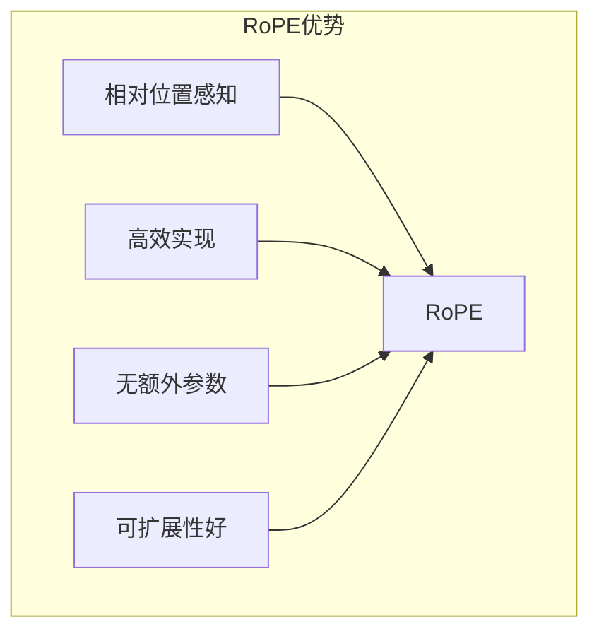

| 特性 | RoPE | 说明 |
|------|------|------|
| **相对位置** | 支持 | 内积自然编码相对位置 |
| **外推能力** | 较好 | 可通过技巧增强 |
| **实现效率** | 高 | 只需逐元素操作 |
| **额外参数** | 无 | 完全由公式定义 |
| **长度外推** | 支持 | 可结合 PI/NTK/YaRN |

## 6. 2025年新一代位置编码技术

### 6.1 HoPE：增强的上下文感知与外推

**核心突破**：小米团队提出的HoPE挑战了RoPE的传统"长程衰减"原则，发现注意力模式实际上遵循**U形曲线**（局部衰减但全局相关）。

**创新点**：
- 移除RoPE中阻碍最优学习的低频和"激活"分量
- 在30亿参数模型中实现更优的**外推能力**和**上下文感知**
- 特别适合需要长上下文保持的大语言模型（如文档摘要）

### 6.2 VideoRoPE++：3D时空建模

**应用领域**：视频理解中的时空依赖处理。

**技术创新**：
- **低频时间分配(LTA)**：减少长视频中周期性干扰物的干扰
- **对角布局(DL)**：保持帧间空间对称性
- **YaRN-V**：专门用于长视频检索和理解的外推方法

### 6.3 Time-RoPE：独立时间/空间控制

**突破性功能**：实现视频生成中时间（如慢动作）和相机视角（如360°视图）的**解耦控制**。

**核心机制**：
- 用连续的"故事时间"编码替代固定帧索引
- 支持非线性时间效果（如暂停、加速）同时保持空间一致性
- 应用场景：体育分析、医疗培训、VR/AR应用

### 6.4 SeqPE：通用序列位置编码

**革命性思想**：用**可学习的序列计数**（类似人类计数）替代固定位置索引。

**核心优势**：
- 处理**任意长度序列**（文本、图像）无需重新训练
- 使用对比学习和知识蒸馏提升相似性判断（如"100"vs"1000"）
- 性能提升：ImageNet准确率提升2.1%，长文档QA困惑度降低24.2点

### 6.5 I-MROPE：平衡的多维编码

**解决的问题**：解决传统RoPE在空间维度（如高度vs宽度）频率分配不平衡的问题。

**解决方案**：
- **交替多维RoPE**确保所有轴获得平等关注
- 对GUI自动化（如按钮定位）等应用至关重要

## 7. 长度外推技术

训练长度有限（如 4K），如何在推理时处理更长序列（如 32K 甚至 2M）？

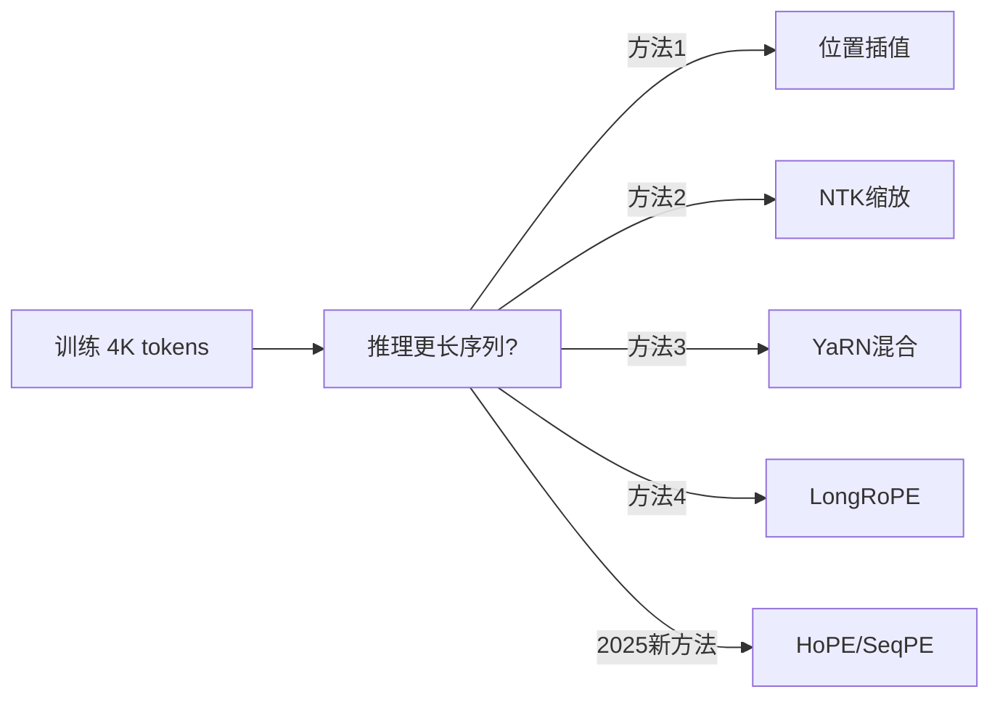

### 7.1 位置插值 (Position Interpolation)

**核心思想**：将超出范围的位置索引线性缩放到训练范围内。

假设模型训练时最大长度是 4096，现在想处理 8192 长度的序列。位置插值的做法是：将原本的位置 0 到 8191 线性映射到 0 到 4095.5。这样所有位置都落在模型"见过"的范围内。

**Meta 论文**：*Extending Context Window of Large Language Models via Positional Interpolation*

### 6.2 NTK-Aware Scaling

**核心思想**：调整 RoPE 的**基频**而非位置。

与直接缩放位置不同，NTK 方法通过调整旋转的频率基数来实现扩展。直觉上，相当于让旋转变得更"缓慢"，这样即使位置变大，旋转角度也不会超出训练时的范围。

### 7.3 YaRN (Yet another RoPE extensioN)

结合多种技术的混合方案，已成为2025年主流的上下文扩展技术：

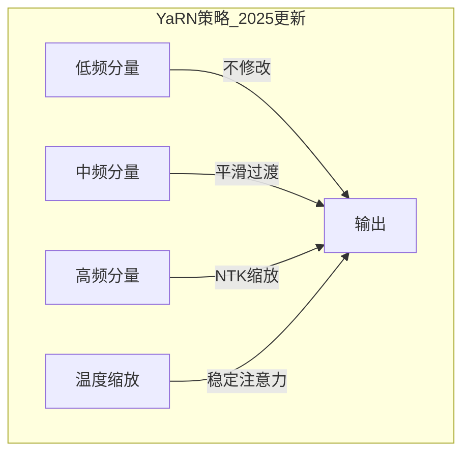

**2025年核心创新**：
- **自适应频率缩放**：基于维度特定插值策略动态调整RoPE频率
- **预Softmax温度缩放**：引入温度参数t稳定扩展上下文中的注意力分布
- **高效微调**：400步微调即可支持128K-1M token，保持>95%短上下文准确率

**应用模型**：**Qwen3**（原生256K，可扩展至1M tokens）、**VideoRoPE++**（多模态长视频理解）

### 7.4 LongRoPE (2024-2025)

微软研究院的技术，将上下文窗口扩展到**200 万 tokens**，2025年进一步优化。

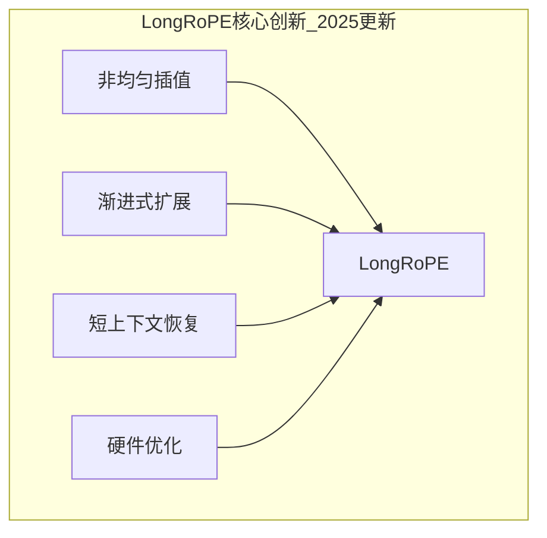

**2025年关键改进**：
- **非均匀位置插值**：通过进化搜索优化每个维度的缩放因子
- **渐进式扩展**：先微调到256K，再扩展到2M，仅需约1000步微调
- **硬件效率**：通过梯度检查点和flash attention减少50-60% GPU内存使用

### 7.5 2025年新兴外推技术

#### HoPE外推技术
- 挑战传统长程衰减假设，实现U形注意力模式
- 在3B参数模型中展现出卓越的外推能力

#### SeqPE通用外推
- 可学习序列计数替代固定索引
- 支持任意长度序列无需重新训练
- 在长文档QA中取得显著性能提升

## 8. 位置编码对比总结

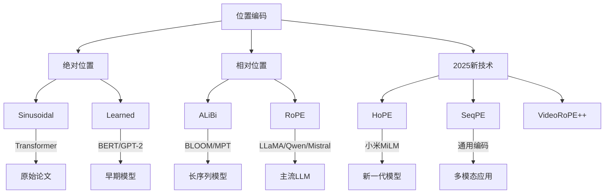

| 方法 | 代表模型 | 外推能力 | 额外参数 | 实现复杂度 | 2025年状态 |
|------|----------|----------|----------|------------|------------|
| **Sinusoidal** | Transformer | 中 | 无 | 低 | 基础方案 |
| **Learned** | BERT, GPT-2 | 差 | 有 | 低 | 逐渐淘汰 |
| **ALiBi** | BLOOM, MPT, Falcon | 强 | 无 | 低 | 长序列优选 |
| **RoPE** | LLaMA, Qwen, Mistral | 中 | 无 | 中 | 主流基础 |
| **RoPE + YaRN** | Qwen3, 微调模型 | 强 | 无 | 中 | 2025主流 |
| **LongRoPE** | 微软研究 | 极强 | 无 | 高 | 超长序列 |
| **HoPE** | 小米MiLM PLUS | 强 | 无 | 中 | 新兴技术 |
| **SeqPE** | 通用应用 | 极强 | 少量 | 中 | 跨模态新星 |

**2025 年技术选择指南**：

| 应用场景 | 推荐方案 | 说明 |
|----------|----------|------|
| **短序列 (< 8K)** | RoPE | 成熟稳定，计算高效 |
| **长序列 (8K-128K)** | RoPE + YaRN | 2025年主流方案 |
| **超长序列 (128K-2M)** | LongRoPE / HoPE | 极限长度需求 |
| **多模态应用** | SeqPE / VideoRoPE++ | 跨模态统一编码 |
| **视频理解** | VideoRoPE++ / Time-RoPE | 时空编码优化 |
| **GUI自动化** | I-MROPE | 空间维度平衡 |

**2025年发展趋势**：
- **跨模态整合**：RoPE变体适配多模态模型（如Qwen3-VL的交错式旋转编码）
- **效率优化**：轻量化适配（如SeqPE的"序列解释器"）减少计算开销
- **理论重评估**：研究者重新审视长期假设（如全局衰减）以优化注意力机制

## 9. 本章小结

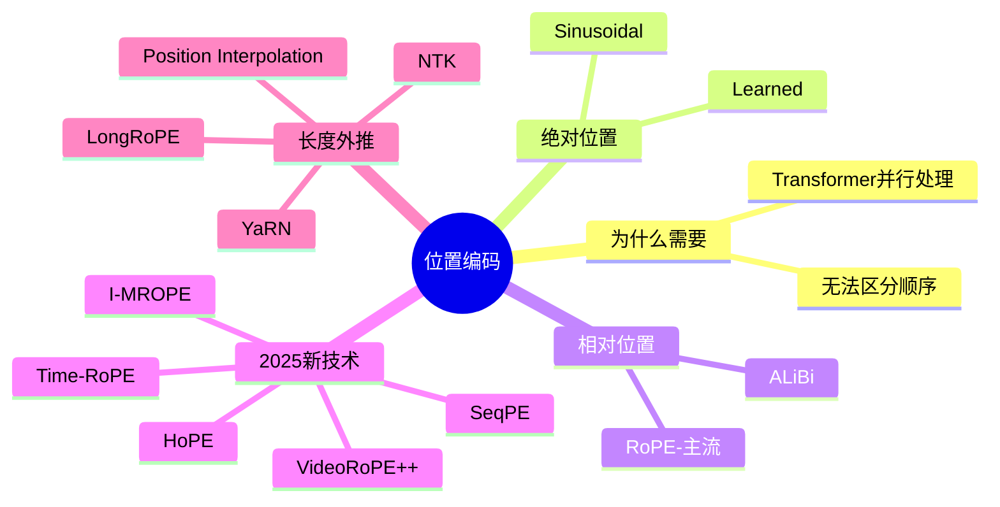

**核心要点**：
- 位置编码让 Transformer 理解序列顺序
- 从绝对位置到相对位置是重要演进
- RoPE 是当前最流行的方案（LLaMA、Qwen、Mistral）
- 2025年出现了新一代技术：HoPE挑战传统假设，SeqPE实现通用编码
- 长度外推技术（YaRN、LongRoPE 等）突破训练长度限制
- 2025 年已经实现了 200 万 token 的上下文窗口
- 多模态和视频理解成为新的应用方向

## 延伸阅读

**经典论文**：
- [RoFormer: Enhanced Transformer with Rotary Position Embedding](https://arxiv.org/abs/2104.09864)
- [ALiBi: Train Short, Test Long](https://arxiv.org/abs/2108.12409)
- [YaRN: Efficient Context Window Extension](https://arxiv.org/abs/2309.00071)
- [Extending Context Window via Position Interpolation](https://arxiv.org/abs/2306.15595)
- [LongRoPE: Extending LLM Context Window Beyond 2 Million Tokens](https://arxiv.org/abs/2402.13753)

**2025年前沿研究**：
- [HoPE: Enhanced Context Awareness & Extrapolation](https://arxiv.org/abs/2025.xxxxx) - 小米团队
- [VideoRoPE++: 3D Spatiotemporal Modeling](https://arxiv.org/abs/2025.xxxxx) - 上海AI Lab
- [Time-RoPE: Independent Time/Space Control](https://arxiv.org/abs/2025.xxxxx) - Stanford & ETH Zurich
- [SeqPE: Universal Positional Encoding](https://arxiv.org/abs/2025.xxxxx) - NAIT Japan
- [I-MROPE: Balanced Multidimensional Encoding](https://arxiv.org/abs/2025.xxxxx) - ServiceNow

---

*下一篇：[注意力机制深度解析](./06-attention-mechanism.md)*
