# Transformer 架构演进：从 Encoder-Decoder 到 Decoder-only

2017 年，Google 发表了划时代的论文 "Attention Is All You Need"，提出了 Transformer 架构。此后，这一架构衍生出三大变体，而 Decoder-only 架构最终成为大语言模型的主流选择。本文将深入分析这一演进过程。

## 1. Transformer 原始架构

原始 Transformer 采用 Encoder-Decoder 结构，设计用于机器翻译任务。

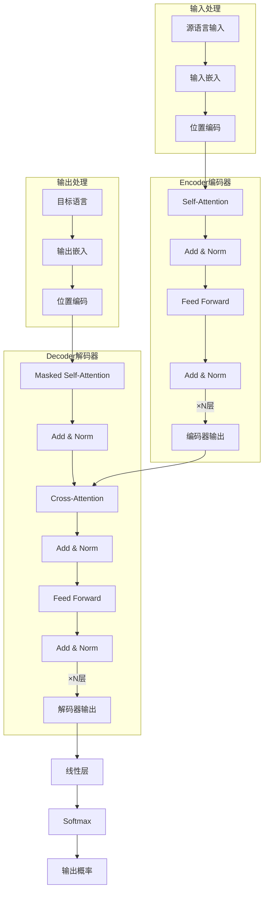

### 1.1 核心组件详解

**编码器 (Encoder)**
- 处理输入序列，生成上下文表示
- 使用**双向自注意力**，每个位置可以看到所有其他位置
- 堆叠 N 层（原论文 N=6）

**解码器 (Decoder)**
- 自回归生成输出序列
- 使用**因果自注意力**（Masked Self-Attention），只能看到前面的位置
- **交叉注意力**（Cross-Attention）连接编码器输出
- 同样堆叠 N 层

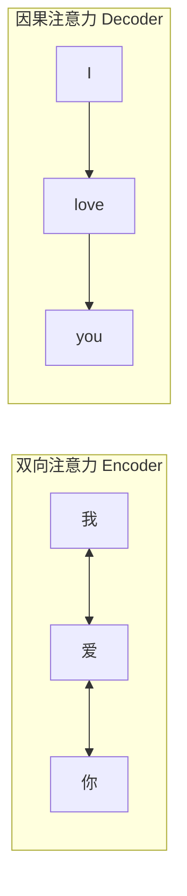

## 2. 三大架构变体

根据组件的取舍，Transformer 演化出三种主要架构：

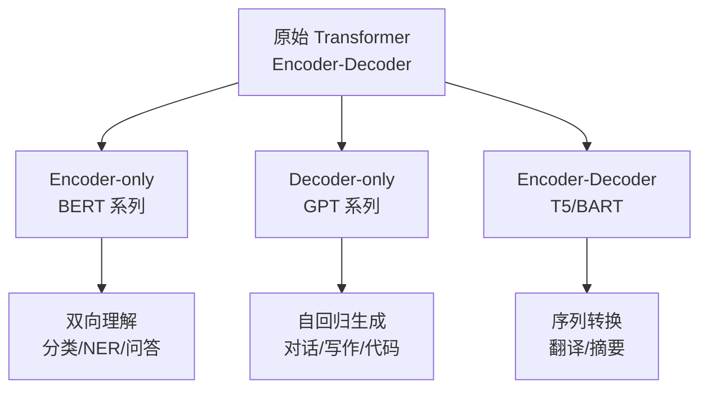

### 2.1 Encoder-only：BERT 家族

**代表模型**：BERT, RoBERTa, ALBERT, DistilBERT

**核心特点**：
- 只保留 Encoder 部分
- 双向注意力，每个 token 可以看到所有其他 token
- 擅长**理解任务**

**预训练目标**：
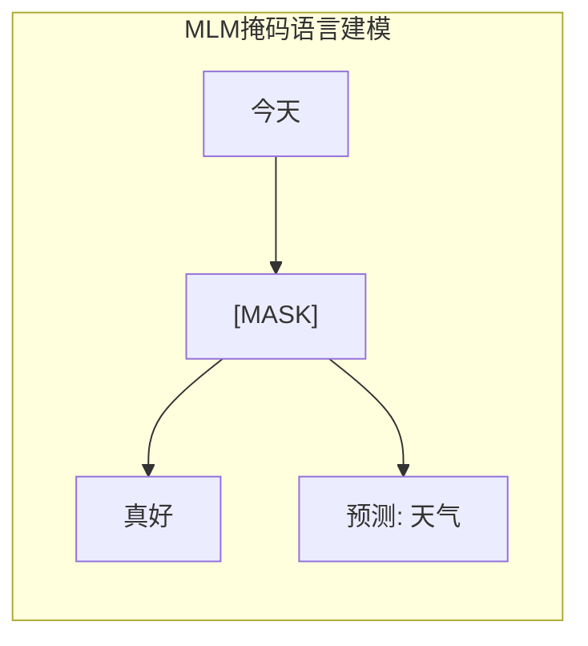

- **MLM（Masked Language Modeling）**：完形填空，随机遮住 15% 的词让模型预测
- **NSP（Next Sentence Prediction）**：句子关系预测

**适用场景**：文本分类、命名实体识别、句子相似度、抽取式问答

### 2.2 Decoder-only：GPT 家族

**代表模型**：GPT-1/2/3/4, LLaMA, Qwen, Mistral, Claude, DeepSeek

**核心特点**：
- 只保留 Decoder 部分（去掉 Cross-Attention）
- 因果注意力，每个 token 只能看到它之前的 token
- 擅长**生成任务**

**预训练目标**：
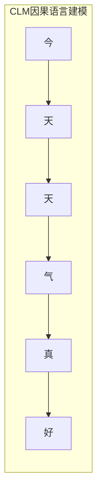

- **CLM（Causal Language Modeling）**：预测下一个 token，每个位置都产生 loss

**适用场景**：文本生成、对话系统、代码生成，以及翻译、摘要等所有任务！

### 2.3 Encoder-Decoder：T5/BART 家族

**代表模型**：T5, BART, mT5, FLAN-T5

**核心特点**：
- 保留完整的 Encoder-Decoder 结构
- 编码器处理输入，解码器生成输出
- 输入输出可以有不同长度

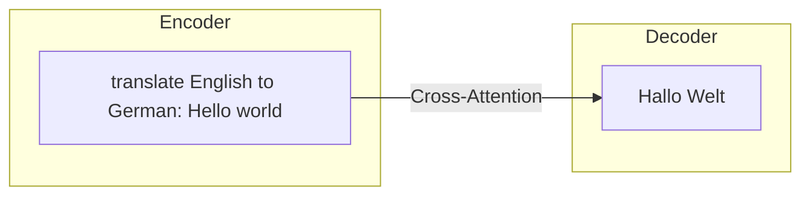

**适用场景**：机器翻译、文本摘要、生成式问答

## 3. 架构对比分析

| 特性 | Encoder-only | Decoder-only | Encoder-Decoder |
|------|--------------|--------------|-----------------|
| **代表模型** | BERT | GPT, LLaMA | T5, BART |
| **注意力模式** | 双向 | 因果（单向） | 双向 + 因果 |
| **预训练目标** | MLM (15%) | CLM (100%) | Span/Denoising |
| **擅长任务** | 理解 | 生成 | Seq2Seq |
| **训练效率** | 较低 | **高** | 中 |
| **扩展性** | 中 | **极强** | 中 |
| **涌现能力** | 弱 | **强** | 中 |

## 4. 为什么 Decoder-only 成为主流？

现代 LLM（GPT-4、Claude、LLaMA、Qwen、DeepSeek 等）几乎都采用 Decoder-only 架构。这并非偶然：

### 4.1 训练效率更高

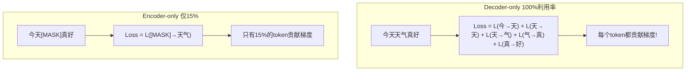

### 4.2 统一的生成范式

Decoder-only 可以统一处理各种任务，只需要改变提示词的格式：

- **分类任务**：输入 "这部电影太棒了！情感是："，模型输出 "正面"
- **翻译任务**：输入 "翻译成英文：今天天气真好"，模型输出 "The weather is nice today"
- **代码生成**：输入 "写一个Python函数计算斐波那契数列："，模型输出相应代码
- **问答任务**：输入 "问题：地球到月球的距离是多少？答案："，模型输出 "约38万公里"

**一个模型，所有任务**——这就是 In-Context Learning 的魔力。

### 4.3 涌现能力 (Emergent Abilities)

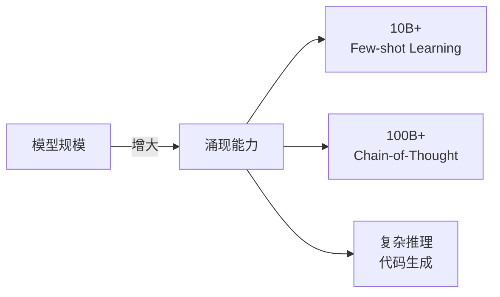

当模型规模足够大时，展现出惊人的涌现能力，这些能力在 Encoder-only 模型中很难观察到。

### 4.4 扩展性更好 (Scaling Law)

Decoder-only 架构的性能随规模增长更加平滑可预测：

| 规模 | 参数量 | 层数 | 注意力 | 位置编码 | FFN |
|------|--------|------|--------|----------|-----|
| **LLaMA-2-7B** | 7B | 32 | GQA | RoPE | SwiGLU |
| **LLaMA-2-70B** | 70B | 80 | GQA | RoPE | SwiGLU |
| **Mistral-7B** | 7B | 32 | GQA | RoPE | SwiGLU |
| **Qwen-7B** | 7B | 32 | MHA | RoPE | SwiGLU |
| **DeepSeek-V2** | 236B(21B) | - | MLA | RoPE | MoE |

## 5. 因果掩码 (Causal Mask)

Decoder-only 架构的核心是**因果掩码**，确保自回归特性：

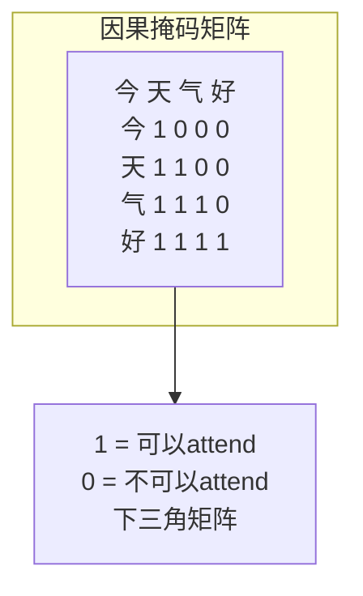

**工作原理**：

因果掩码是一个下三角矩阵，用于控制每个位置能"看到"哪些位置。生成掩码时，矩阵中位置 (i, j) 为 1 表示位置 i 可以关注位置 j，为 0 则不可以。由于我们希望每个位置只能看到它之前的位置（包括自己），所以掩码是下三角形式。

在计算注意力分数后，将掩码为 0 的位置设为负无穷大，这样经过 Softmax 后这些位置的权重就会变成 0，从而实现了因果性约束。

## 6. Self-Attention 核心计算

### 6.1 单头注意力

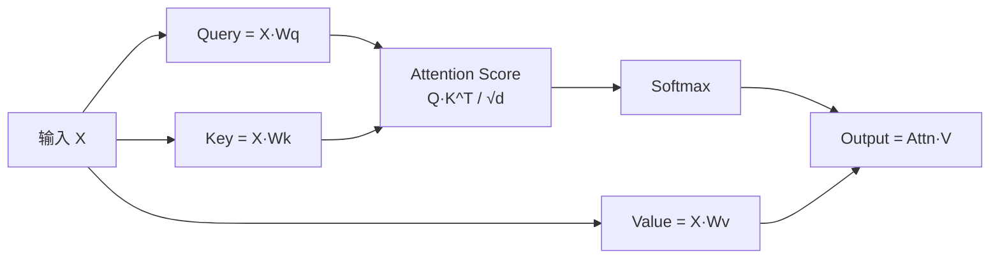

**计算步骤**：

1. **线性投影**：将输入 X 分别通过三个不同的线性变换，得到 Query、Key、Value
2. **计算注意力分数**：Query 和 Key 的转置做矩阵乘法，再除以 Key 维度的平方根（缩放因子）
3. **应用掩码**：如果是因果注意力，将掩码为 0 的位置设为负无穷
4. **Softmax 归一化**：将分数转换为概率分布
5. **加权求和**：用注意力权重对 Value 进行加权求和，得到最终输出

### 6.2 多头注意力 (Multi-Head Attention)

多头注意力让模型从**不同的表示子空间**学习关系：

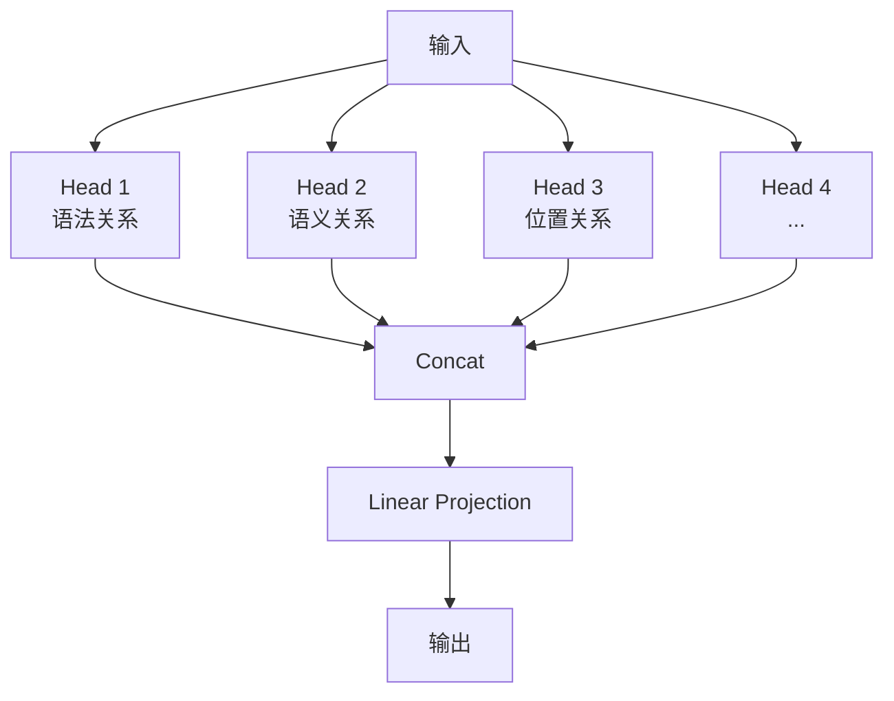

**工作原理**：

多头注意力的核心思想是将模型维度分成多个"头"，每个头独立地进行注意力计算。具体步骤如下：

1. **线性投影**：对输入进行线性变换得到 Q、K、V
2. **分头**：将 Q、K、V 沿隐藏维度拆分成多个头，每个头有独立的子空间
3. **并行注意力**：每个头独立计算注意力，可以学习不同类型的关系
4. **合并**：将所有头的输出拼接起来
5. **输出投影**：通过一个线性层将拼接结果映射回原始维度

这样设计的好处是：不同的注意力头可以关注不同的信息，比如有的头关注语法关系，有的头关注语义关系，有的头关注局部信息。

## 7. 完整的 Decoder Block

现代 LLM 的基本构建单元：

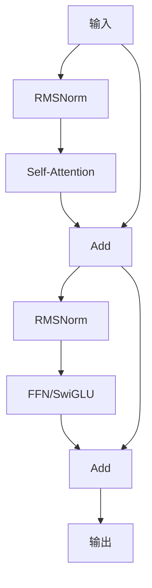

**结构说明**：

现代 LLM 的 Decoder Block 采用 Pre-Norm 结构，即在每个子层之前进行归一化。完整流程如下：

1. **第一个子层（Self-Attention）**：
   - 首先对输入进行 RMSNorm
   - 然后通过 Self-Attention
   - 将输出与原始输入相加（残差连接）

2. **第二个子层（Feed-Forward）**：
   - 对残差结果进行 RMSNorm
   - 通过前馈神经网络（现代 LLM 使用 SwiGLU）
   - 再次进行残差连接

### Pre-Norm vs Post-Norm

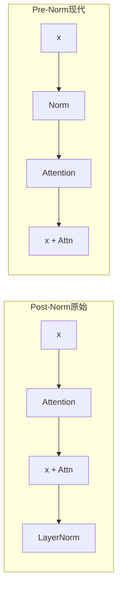

**Pre-Norm 优势**：训练更稳定，尤其对于深层网络（100+ 层）。原始 Transformer 使用 Post-Norm，但实践证明 Pre-Norm 对深层网络更友好。

## 8. 现代 LLM 架构改进

相比原始 Transformer，2024 年的 LLM 有众多改进：

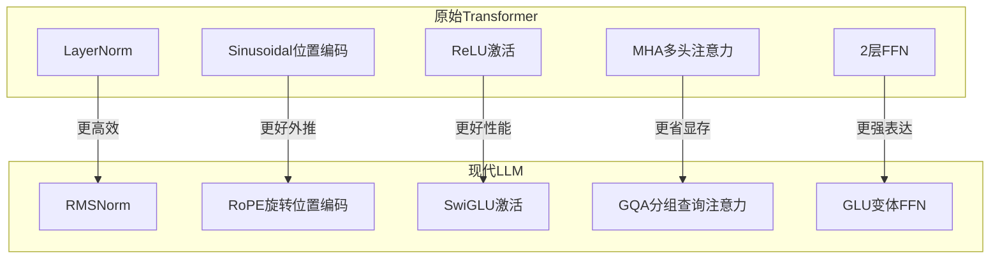

### 8.1 RMSNorm (Root Mean Square Normalization)

比 LayerNorm 更高效，去掉了均值中心化。

**工作原理**：RMSNorm 只计算输入的均方根进行归一化，而 LayerNorm 需要先减去均值再除以标准差。数学上，RMSNorm 计算输入各元素平方的均值再开方，用这个值对输入进行缩放，最后乘以可学习的缩放参数。

**优势**：减少约 10% 计算量，效果与 LayerNorm 相当。

### 8.2 RoPE (Rotary Position Embedding)

旋转位置编码，相比绝对位置编码有更好的外推性：

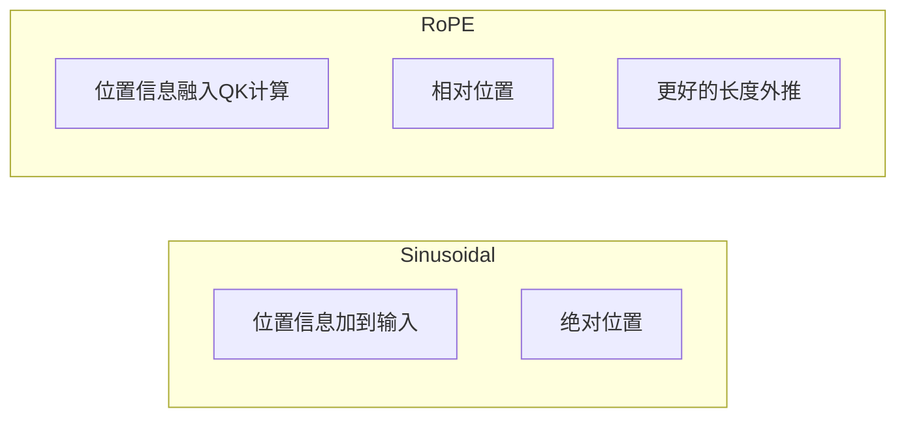

**核心思想**：通过旋转 Q、K 向量来编码位置信息。将向量的相邻两个维度视为二维平面上的点，根据位置索引进行旋转。旋转后的 Q 和 K 做内积，结果自然地包含了相对位置信息。

### 8.3 GQA (Grouped Query Attention)

分组查询注意力，在 MHA 和 MQA 之间取得平衡：

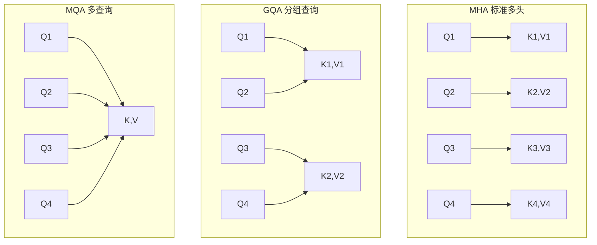

| 注意力类型 | KV头数 | 显存占用 | 推理速度 | 效果 |
|-----------|--------|----------|----------|------|
| **MHA** | =Q头数 | 高 | 慢 | 最好 |
| **GQA** | Q头数/g | 中 | 较快 | 接近MHA |
| **MQA** | 1 | 低 | 最快 | 有损失 |

**GQA 是现代 LLM 的首选**（LLaMA-2/3、Mistral 等）。它让多个 Query 头共享同一组 Key 和 Value，减少了 KV Cache 的显存占用，同时保持接近 MHA 的效果。

### 8.4 SwiGLU 激活

结合 Swish 和 GLU 的优势。

**工作原理**：SwiGLU 是一种门控线性单元，它将输入通过两个线性变换，一个分支经过 Swish 激活函数（也称 SiLU），另一个分支保持线性，两者逐元素相乘后再通过一个线性层输出。

**优势**：比 ReLU/GELU 有更好的性能，是 LLaMA、PaLM、Qwen 等模型的选择。

### 8.5 FlashAttention

优化注意力计算的内存访问模式：

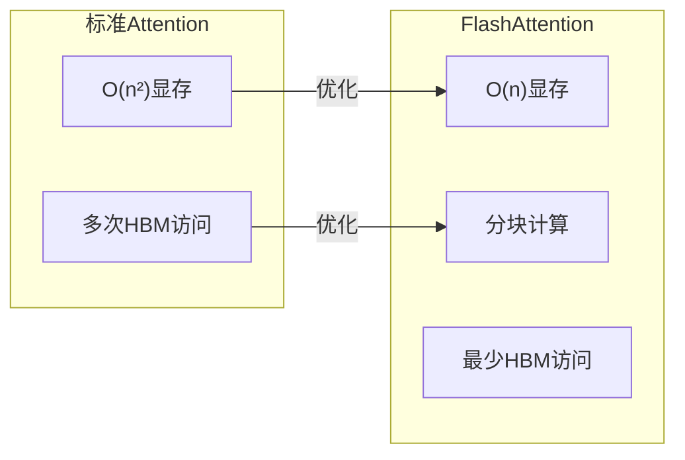

**核心思想**：利用 GPU 内存层次结构，通过分块（tiling）减少对高带宽内存（HBM）的访问。标准注意力需要将完整的注意力矩阵存储在 HBM 中，而 FlashAttention 将计算分成小块，在更快的 SRAM 中完成中间计算，只将最终结果写回 HBM。

## 9. 计算复杂度分析

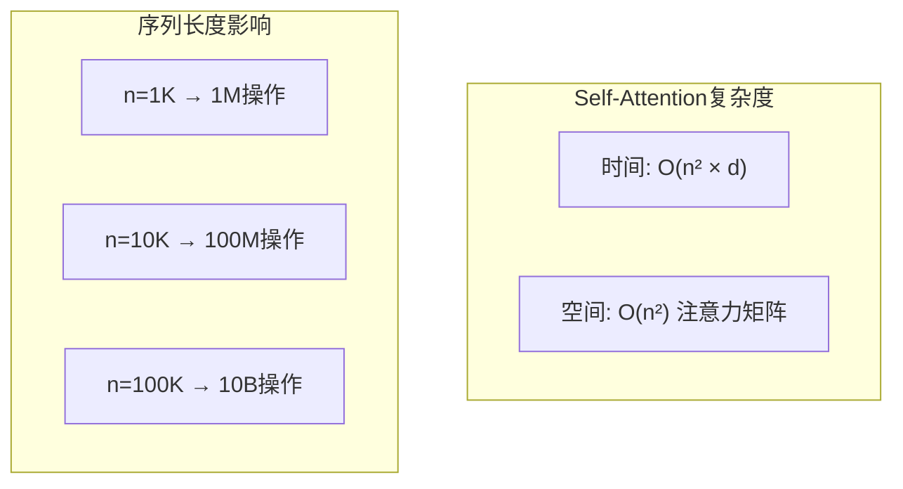

这就是为什么长序列处理如此具有挑战性——注意力矩阵随序列长度**平方增长**。

## 10. 主流模型架构对比

| 模型 | 参数量 | 层数 | 注意力 | 位置编码 | FFN |
|------|--------|------|--------|----------|-----|
| **LLaMA-2-7B** | 7B | 32 | GQA | RoPE | SwiGLU |
| **LLaMA-2-70B** | 70B | 80 | GQA | RoPE | SwiGLU |
| **Mistral-7B** | 7B | 32 | GQA | RoPE | SwiGLU |
| **Qwen-7B** | 7B | 32 | MHA | RoPE | SwiGLU |
| **DeepSeek-V2** | 236B(21B) | - | MLA | RoPE | MoE |

## 11. 本章小结

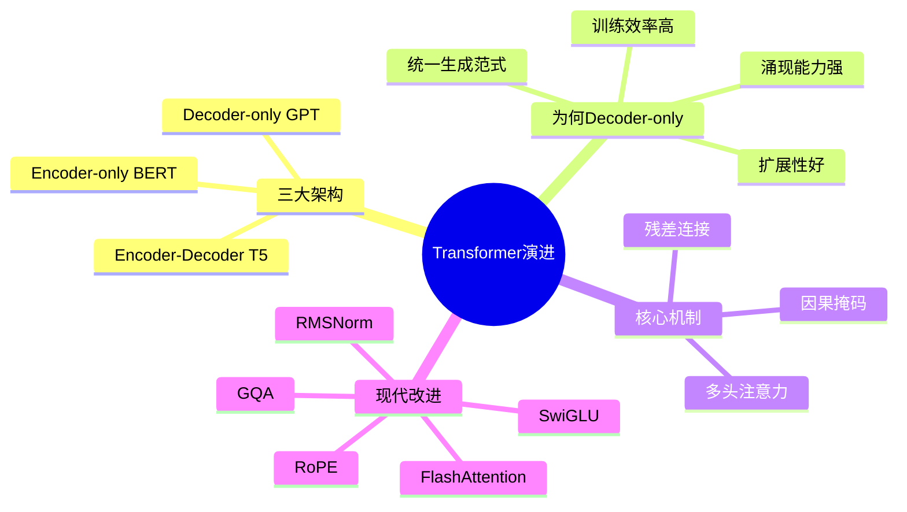

**核心要点**：
- Transformer 衍生出三大架构，Decoder-only 成为 LLM 主流
- 因果掩码是 Decoder-only 架构的核心
- 现代 LLM 采用 RMSNorm、RoPE、GQA、SwiGLU 等改进
- FlashAttention 通过优化内存访问大幅提升效率

## 思考题

1. 如果让你设计一个推理引擎，Attention 层计算中最耗时的部分是什么？
2. 为什么 BERT 风格的模型难以用于文本生成？
3. GQA 是如何在效率和效果之间取得平衡的？

## 延伸阅读

- [Attention Is All You Need (2017)](https://arxiv.org/abs/1706.03762) - Transformer 原始论文
- [LLaMA: Open and Efficient Foundation Language Models (2023)](https://arxiv.org/abs/2302.13971)
- [FlashAttention: Fast and Memory-Efficient Exact Attention (2022)](https://arxiv.org/abs/2205.14135)
- [RoFormer: Enhanced Transformer with Rotary Position Embedding (2021)](https://arxiv.org/abs/2104.09864)

---

*下一篇：[注意力机制深度解析](./06-attention-mechanism.md) - 深入理解 Self-Attention 的数学原理*
