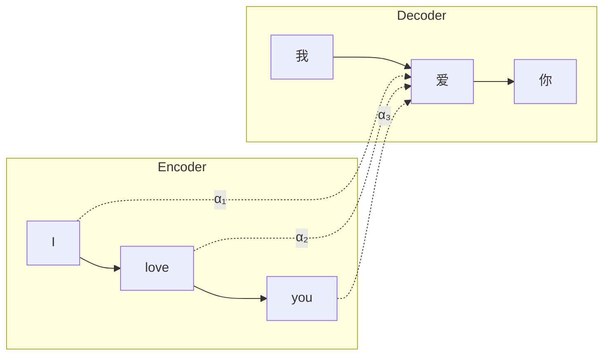
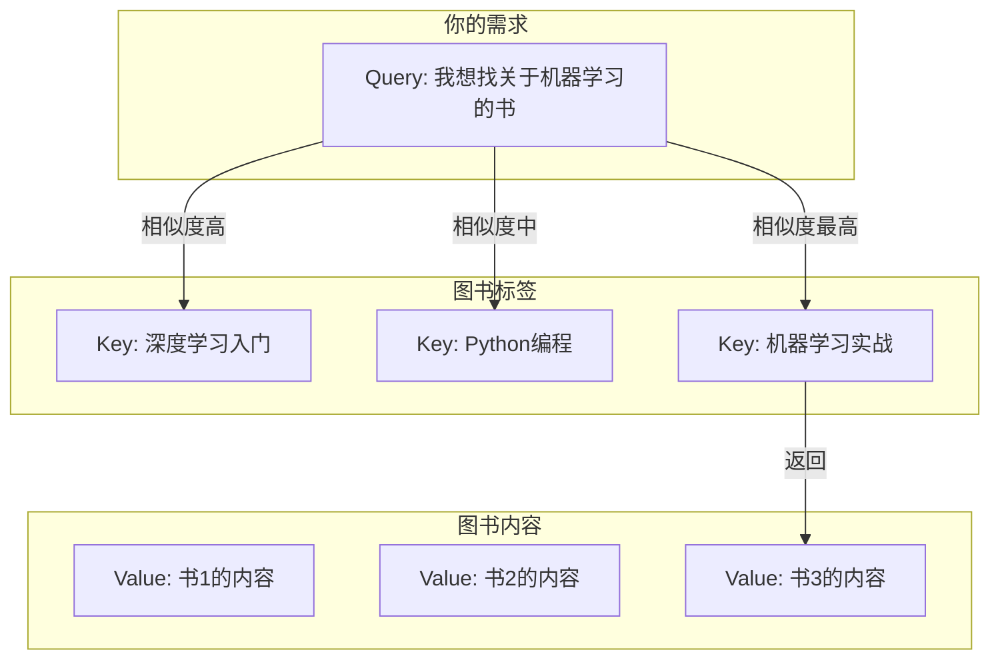
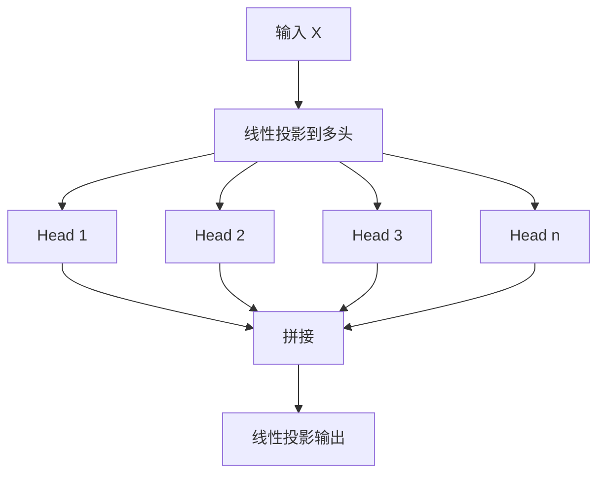
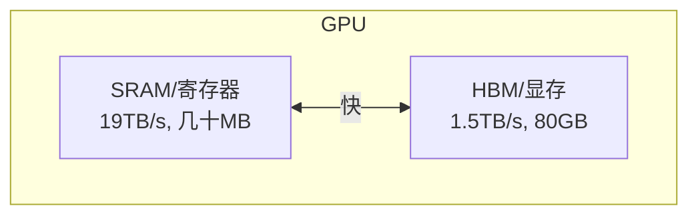

# 注意力机制深度解析

注意力机制是 Transformer 架构的核心，理解它是掌握大语言模型的关键。本文将深入剖析注意力机制的原理、计算过程和各种优化变体。

## 注意力的直觉

在阅读句子 "小明给小红送了一朵花，因为她过生日" 时，我们理解"她"指的是"小红"而非"小明"。这个过程中，大脑自动将"她"与前文建立关联——这就是注意力的本质。

**注意力机制让模型学会"关注什么"**：当处理"她"这个词时，模型会学习去关注句子中的"小红"而非其他词。

## 从 Seq2Seq 到 Self-Attention

### 早期的注意力机制

注意力最初用于改进 Seq2Seq 模型的机器翻译：



在翻译"爱"时，模型学会关注源句中的"love"。

### Self-Attention 的革命

**Self-Attention**（自注意力）让序列内部的元素相互关注。例如在句子 "The animal didn't cross the street because it was too tired" 中，Self-Attention 能够让模型发现 "it" 与 "animal" 高度相关，从而理解 "it" 指代的是 "animal"。

## Q、K、V 的物理含义

Self-Attention 使用三个向量：Query（查询）、Key（键）、Value（值）。

### 图书馆检索类比

想象你在图书馆找书：



- **Query (Q)**：你的需求，"我在找什么"
- **Key (K)**：每本书的标签，"这本书是什么"
- **Value (V)**：每本书的内容，"这本书包含什么"

**注意力 = 用 Query 查找最相关的 Key，然后返回对应的 Value**

### 数学表达

对于输入序列 X，通过线性变换得到 Q、K、V：将输入分别乘以三个不同的权重矩阵 W_Q、W_K、W_V，得到 Query、Key、Value 三个矩阵。这三个权重矩阵是模型需要学习的参数。

## Scaled Dot-Product Attention

这是注意力机制的核心计算，可以用一句话概括：**将 Query 和 Key 的相似度作为权重，对 Value 进行加权求和**。

### 分步详解

**Step 1: 计算注意力分数**

将 Query 矩阵与 Key 矩阵的转置相乘，得到一个方阵。这个方阵的每个元素表示对应位置之间的原始关注度。例如，对于长度为 n 的序列，结果是 n x n 的矩阵。

**Step 2: 缩放 (Scaling)**

将注意力分数除以 Key 维度的平方根。这一步很重要，原因如下：
- 当 Key 维度较大时，点积结果的方差也会变大
- 过大的值经过 softmax 后会趋近于 one-hot 分布
- 这会导致梯度消失，训练不稳定

例如，当维度为 512 时，点积结果的方差约为 512，除以 sqrt(512) 约等于 22.6 后，方差就变成约 1，数值更加稳定。

**Step 3: Softmax 归一化**

将缩放后的分数通过 softmax 函数转换为概率分布，使得每一行的权重和为 1。每行表示当前位置对所有位置的注意力权重分配。

**Step 4: 加权求和**

用注意力权重对 Value 进行加权求和，得到最终输出。权重高的位置贡献更大，权重低的位置贡献更小。

### 注意力可视化

以句子"我 爱 北京 天安门"为例，注意力权重矩阵可能是这样的：

- 对角线权重较高：每个词首先关注自己
- "北京"和"天安门"相互关注度高：因为它们语义相关

## 多头注意力 (Multi-Head Attention)

单头注意力只能学习一种关注模式。**多头注意力**让模型从多个"角度"学习：



### 为什么需要多头？

不同的头可以学习不同的关注模式：

- **Head 1**：可能学会关注语法结构，如主谓关系
- **Head 2**：可能学会关注语义相似性
- **Head 3**：可能学会关注位置关系，如相邻词
- **Head 4**：可能学会关注指代消解

### 工作原理

1. **分头投影**：将输入通过不同的线性变换，得到多组 Q、K、V
2. **并行计算**：每组独立进行注意力计算
3. **拼接合并**：将所有头的输出拼接起来
4. **输出投影**：通过一个线性层映射回原始维度

### 参数量分析

以 LLaMA-7B 的配置为例（d_model=4096, num_heads=32），每层注意力的参数包括 Q、K、V、O 四个投影矩阵，每个 4096 x 4096，总计约 6700 万参数。

## 注意力优化：MHA、MQA、GQA

随着模型规模增大，注意力的显存和计算成本成为瓶颈。以下是三种主要的注意力架构：

### Multi-Head Attention (MHA)

原始的多头注意力，每个头有独立的 Q、K、V。如果有 8 个头，就有 8 组独立的 K 和 V，KV Cache 需要存储 8 份。

### Multi-Query Attention (MQA)

所有 Query 头共享同一组 K、V。8 个 Query 头共用 1 组 K 和 V，KV Cache 只需存储 1 份，减少 8 倍。

**优点**：KV Cache 显著减少，推理速度大幅提升
**缺点**：模型表达能力下降，质量略有损失
**使用模型**：PaLM、Falcon

### Grouped-Query Attention (GQA)

MHA 和 MQA 的折中：将 Query 头分组，每组共享 K、V。例如 8 个 Query 头分成 2 组，每组 4 个 Query 共享 1 组 K、V，KV Cache 只需存储 2 份。

**优点**：平衡质量和效率，灵活调整分组数量
**使用模型**：LLaMA 2/3、Mistral、Gemini

### 三种方案对比

| 特性 | MHA | GQA | MQA |
|------|-----|-----|-----|
| KV 头数 | = Q 头数 | < Q 头数 | = 1 |
| KV Cache | 最大 | 中等 | 最小 |
| 模型质量 | 最好 | 接近 MHA | 略差 |
| 推理速度 | 最慢 | 快 | 最快 |
| 代表模型 | GPT-3 | LLaMA 2 | PaLM |

## FlashAttention：IO 感知的高效注意力

标准注意力的问题在于**显存访问**，而非计算本身。

### 显存层级



GPU 有两级存储：SRAM 非常快但容量小（几十 MB），HBM 容量大但相对较慢。

### 标准注意力的 IO 问题

标准注意力需要多次访问 HBM：
1. 从 HBM 读取 Q、K、V
2. 计算 Q 乘以 K 的转置，将结果（n x n 矩阵）写入 HBM
3. 从 HBM 读取注意力分数，计算 softmax，结果写入 HBM
4. 从 HBM 读取 softmax 结果和 V，计算输出，写入 HBM

这导致 IO 复杂度为 O(n^2)，对于长序列非常昂贵。

### FlashAttention 的解决方案

**核心思想**：分块计算（Tiling），在 SRAM 中完成尽可能多的计算。

FlashAttention 将 Q、K、V 分成小块，每次只处理一小块，在快速的 SRAM 中完成计算，只将最终结果写回 HBM。虽然计算量相同，但 IO 复杂度降低到 O(n)。

### 关键技术：Online Softmax

分块计算 softmax 需要特殊处理，因为标准 softmax 需要知道全局最大值。FlashAttention 使用增量更新技术：每处理一块，就更新全局统计量（最大值和求和），最后得到正确的 softmax 结果。

### FlashAttention 2 改进

- **更好的并行性**：将不同的 Query 块分配到不同的线程块
- **减少非矩阵乘法操作**：优化 softmax 的计算
- **更高的 GPU 利用率**：达到理论峰值的 50-73%

### 性能对比

| 方法 | 序列长度 1024 | 序列长度 4096 | 序列长度 16384 |
|------|--------------|--------------|----------------|
| 标准注意力 | 1x | 1x | 显存不足 |
| FlashAttention | 2-4x | 5-10x | 可运行 |
| FlashAttention-2 | 3-5x | 7-15x | 可运行 |

PyTorch 2.0+ 已经原生支持 FlashAttention，使用 scaled_dot_product_attention 函数时会自动启用。

## 注意力的计算复杂度

### 时间和空间复杂度

**标准注意力**：
- 时间复杂度: O(n^2 x d)，其中 n 是序列长度，d 是维度
- 空间复杂度: O(n^2)，需要存储完整的注意力矩阵

**FlashAttention**：
- 时间复杂度: O(n^2 x d)，计算量相同
- 空间复杂度: O(n)，不需要存储完整注意力矩阵

### 为什么 O(n^2) 是问题？

以 d_model=4096 为例：
- 序列长度 4096：注意力矩阵有 1600 万个元素
- 序列长度 32768：注意力矩阵有 10 亿个元素

这就是长上下文如此具有挑战性的原因！

## 注意力变体一览

| 变体 | 特点 | 复杂度 | 使用场景 |
|------|------|--------|----------|
| 标准注意力 | 全局注意力 | O(n^2) | 短序列 |
| 稀疏注意力 | 局部+全局 | O(n x sqrt(n)) | 长文本 |
| 线性注意力 | 核近似 | O(n) | 超长序列 |
| FlashAttention | IO 优化 | O(n^2) | 通用加速 |
| Sliding Window | 局部窗口 | O(n x w) | 长文本推理 |

## 本章小结

```mermaid
mindmap
  root((注意力机制))
    核心概念
      Q K V三元组
      相似度计算
      加权求和
    多头注意力
      多角度学习
      并行计算
      信息整合
    优化技术
      MQA/GQA
      FlashAttention
      稀疏注意力
    挑战
      O(n^2)复杂度
      长上下文处理
```

**核心要点**：
- 注意力机制让模型学会"关注什么"
- Q、K、V 是注意力的核心组件
- 多头注意力从多角度学习关注模式
- GQA 在质量和效率间取得平衡
- FlashAttention 通过 IO 优化大幅提速
- O(n^2) 复杂度是长上下文的主要挑战

## 延伸阅读

- [Attention Is All You Need (2017)](https://arxiv.org/abs/1706.03762)
- [Fast Transformer Decoding: One Write-Head is All You Need (MQA, 2019)](https://arxiv.org/abs/1911.02150)
- [GQA: Training Generalized Multi-Query Transformer (2023)](https://arxiv.org/abs/2305.13245)
- [FlashAttention: Fast and Memory-Efficient Exact Attention (2022)](https://arxiv.org/abs/2205.14135)
- [FlashAttention-2: Faster Attention with Better Parallelism (2023)](https://arxiv.org/abs/2307.08691)

---

*下一篇：[预训练：从海量数据到语言理解](./10-pretraining.md)*
