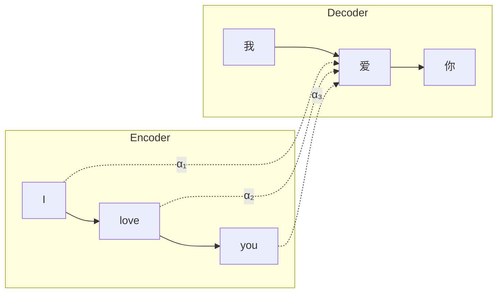
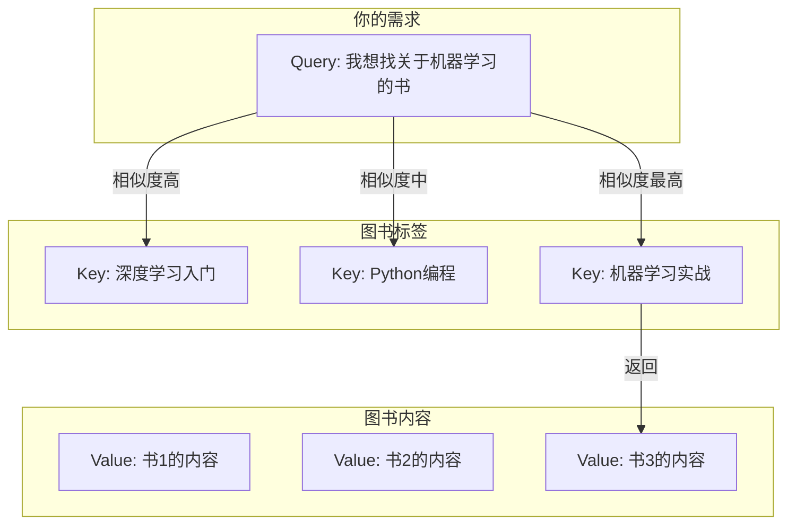
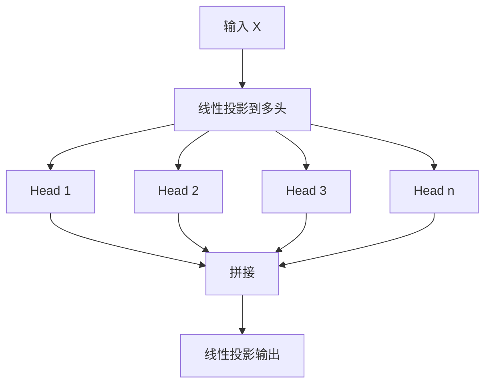
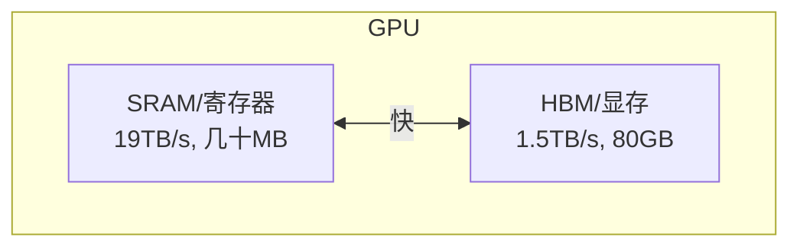

# 注意力机制深度解析

注意力机制是 Transformer 架构的核心，理解它是掌握大语言模型的关键。本文将深入剖析注意力机制的原理、计算过程和各种优化变体。

## 注意力的直觉

在阅读句子 "小明给小红送了一朵花，因为她过生日" 时，我们理解"她"指的是"小红"而非"小明"。这个过程中，大脑自动将"她"与前文建立关联——这就是注意力的本质。

**注意力机制让模型学会"关注什么"**：

```
输入: "小明 给 小红 送了 一朵 花 ，因为 她 过 生日"
                    ↑
当处理 "她" 时，模型学会关注 "小红" 而非其他词
```

## 从 Seq2Seq 到 Self-Attention

### 早期的注意力机制

注意力最初用于改进 Seq2Seq 模型的机器翻译：



在翻译"爱"时，模型学会关注源句中的"love"。

### Self-Attention 的革命

**Self-Attention**（自注意力）让序列内部的元素相互关注：

```
"The animal didn't cross the street because it was too tired"

问: "it" 指什么？
Self-Attention: "it" 高度关注 "animal"，所以 "it" = "animal"
```

## Q、K、V 的物理含义

Self-Attention 使用三个向量：Query（查询）、Key（键）、Value（值）。

### 图书馆检索类比

想象你在图书馆找书：



- **Query (Q)**：你的需求，"我在找什么"
- **Key (K)**：每本书的标签，"这本书是什么"
- **Value (V)**：每本书的内容，"这本书包含什么"

**注意力 = 用 Query 查找最相关的 Key，然后返回对应的 Value**

### 数学表达

对于输入序列 X，通过线性变换得到 Q、K、V：

```
Q = X · W_Q    (查询矩阵)
K = X · W_K    (键矩阵)
V = X · W_V    (值矩阵)
```

其中 W_Q、W_K、W_V 是可学习的参数矩阵。

## Scaled Dot-Product Attention

这是注意力机制的核心计算：

```math
\text{Attention}(Q, K, V) = \text{softmax}\left(\frac{QK^T}{\sqrt{d_k}}\right) V
```

### 分步详解

**Step 1: 计算注意力分数**

```
Scores = Q · K^T

形状: (seq_len, d_k) × (d_k, seq_len) = (seq_len, seq_len)
```

结果是一个方阵，表示每个位置对所有其他位置的"原始关注度"。

**Step 2: 缩放 (Scaling)**

```
Scaled_Scores = Scores / √d_k
```

为什么要除以 √d_k？

- 当 d_k 较大时，点积结果的方差也会变大
- 大的值经过 softmax 后会趋近于 one-hot
- 导致梯度消失，训练不稳定

```python
# 示例：d_k=512 时
q = torch.randn(512)
k = torch.randn(512)
dot_product = q @ k  # 方差约为 512，值可能很大

# 缩放后方差约为 1
scaled = dot_product / math.sqrt(512)
```

**Step 3: Softmax 归一化**

```
Attention_Weights = softmax(Scaled_Scores)
```

- 将分数转换为概率分布（和为 1）
- 每行表示当前位置对所有位置的注意力权重

**Step 4: 加权求和**

```
Output = Attention_Weights · V
```

用注意力权重对 Value 进行加权求和，得到最终输出。

### 完整代码实现

```python
import torch
import torch.nn.functional as F
import math

def scaled_dot_product_attention(Q, K, V, mask=None):
    """
    Args:
        Q: (batch, seq_len, d_k) 或 (batch, heads, seq_len, d_k)
        K: (batch, seq_len, d_k) 或 (batch, heads, seq_len, d_k)
        V: (batch, seq_len, d_v) 或 (batch, heads, seq_len, d_v)
        mask: 可选的注意力掩码
    
    Returns:
        output: 注意力输出
        attention_weights: 注意力权重（用于可视化）
    """
    d_k = Q.shape[-1]
    
    # Step 1 & 2: 计算缩放点积
    scores = torch.matmul(Q, K.transpose(-2, -1)) / math.sqrt(d_k)
    
    # 应用掩码（如因果掩码）
    if mask is not None:
        scores = scores.masked_fill(mask == 0, float('-inf'))
    
    # Step 3: Softmax
    attention_weights = F.softmax(scores, dim=-1)
    
    # Step 4: 加权求和
    output = torch.matmul(attention_weights, V)
    
    return output, attention_weights
```

### 注意力可视化

```
输入: "我 爱 北京 天安门"

注意力权重矩阵:
         我    爱    北京   天安门
我      0.8   0.1   0.05   0.05
爱      0.3   0.4   0.2    0.1
北京    0.1   0.1   0.6    0.2
天安门  0.1   0.1   0.3    0.5

↑ 对角线权重较高：每个词首先关注自己
↑ "北京" 和 "天安门" 相互关注度高：语义相关
```

## 多头注意力 (Multi-Head Attention)

单头注意力只能学习一种关注模式。**多头注意力**让模型从多个"角度"学习：



### 数学公式

```math
\text{MultiHead}(Q, K, V) = \text{Concat}(\text{head}_1, ..., \text{head}_h) W^O
```

其中每个 head：

```math
\text{head}_i = \text{Attention}(QW_i^Q, KW_i^K, VW_i^V)
```

### 为什么需要多头？

不同的头可以学习不同的关注模式：

```
Head 1: 关注语法结构
        "The cat sat on the mat" → "cat" 关注 "sat"（主谓关系）

Head 2: 关注语义相似
        "cat" 关注 "mat"（都与家居相关）

Head 3: 关注位置关系
        每个词关注相邻的词

Head 4: 关注指代消解
        "it" 关注 "cat"
```

### 完整实现

```python
class MultiHeadAttention(nn.Module):
    def __init__(self, d_model, num_heads, dropout=0.1):
        super().__init__()
        assert d_model % num_heads == 0, "d_model 必须能被 num_heads 整除"
        
        self.d_model = d_model
        self.num_heads = num_heads
        self.d_k = d_model // num_heads
        
        # QKV 投影矩阵
        self.W_q = nn.Linear(d_model, d_model)
        self.W_k = nn.Linear(d_model, d_model)
        self.W_v = nn.Linear(d_model, d_model)
        
        # 输出投影
        self.W_o = nn.Linear(d_model, d_model)
        
        self.dropout = nn.Dropout(dropout)
    
    def forward(self, query, key, value, mask=None):
        batch_size = query.shape[0]
        
        # 线性投影
        Q = self.W_q(query)  # (batch, seq_len, d_model)
        K = self.W_k(key)
        V = self.W_v(value)
        
        # 分头: (batch, seq_len, d_model) -> (batch, num_heads, seq_len, d_k)
        Q = Q.view(batch_size, -1, self.num_heads, self.d_k).transpose(1, 2)
        K = K.view(batch_size, -1, self.num_heads, self.d_k).transpose(1, 2)
        V = V.view(batch_size, -1, self.num_heads, self.d_k).transpose(1, 2)
        
        # 注意力计算
        scores = torch.matmul(Q, K.transpose(-2, -1)) / math.sqrt(self.d_k)
        
        if mask is not None:
            scores = scores.masked_fill(mask == 0, float('-inf'))
        
        attention_weights = F.softmax(scores, dim=-1)
        attention_weights = self.dropout(attention_weights)
        
        # 加权求和
        output = torch.matmul(attention_weights, V)
        
        # 合并多头: (batch, num_heads, seq_len, d_k) -> (batch, seq_len, d_model)
        output = output.transpose(1, 2).contiguous().view(batch_size, -1, self.d_model)
        
        # 输出投影
        output = self.W_o(output)
        
        return output
```

### 参数量分析

```
d_model = 4096, num_heads = 32 (LLaMA-7B 配置)

W_q: 4096 × 4096 = 16.7M
W_k: 4096 × 4096 = 16.7M
W_v: 4096 × 4096 = 16.7M
W_o: 4096 × 4096 = 16.7M

每层注意力参数: 约 67M
```

## 注意力优化：MHA、MQA、GQA

随着模型规模增大，注意力的显存和计算成本成为瓶颈。以下是三种主要的注意力架构：

### Multi-Head Attention (MHA)

原始的多头注意力，每个头有独立的 Q、K、V。

```
MHA 结构:
Query heads:  [Q1] [Q2] [Q3] [Q4] [Q5] [Q6] [Q7] [Q8]
Key heads:    [K1] [K2] [K3] [K4] [K5] [K6] [K7] [K8]
Value heads:  [V1] [V2] [V3] [V4] [V5] [V6] [V7] [V8]

KV Cache 大小: 8 份
```

### Multi-Query Attention (MQA)

所有 Query 头共享同一组 K、V。

```
MQA 结构:
Query heads:  [Q1] [Q2] [Q3] [Q4] [Q5] [Q6] [Q7] [Q8]
Key heads:    [K1] ←共享─────────────────────────────
Value heads:  [V1] ←共享─────────────────────────────

KV Cache 大小: 1 份 (减少 8x)
```

**优点**：
- KV Cache 显著减少
- 推理速度大幅提升

**缺点**：
- 模型表达能力下降
- 质量略有损失

**使用模型**：PaLM、Falcon

### Grouped-Query Attention (GQA)

MHA 和 MQA 的折中：将 Query 头分组，每组共享 K、V。

```
GQA 结构 (8 Query heads, 2 KV groups):
Query heads:  [Q1] [Q2] [Q3] [Q4] | [Q5] [Q6] [Q7] [Q8]
Key heads:    [K1]───共享────────  [K2]───共享────────
Value heads:  [V1]───共享────────  [V2]───共享────────

KV Cache 大小: 2 份 (减少 4x)
```

**优点**：
- 平衡质量和效率
- 灵活调整分组数量

**使用模型**：LLaMA 2/3、Mistral、Gemini

### 三种方案对比

| 特性 | MHA | GQA | MQA |
|------|-----|-----|-----|
| KV 头数 | = Q 头数 | < Q 头数 | = 1 |
| KV Cache | 最大 | 中等 | 最小 |
| 模型质量 | 最好 | 接近 MHA | 略差 |
| 推理速度 | 最慢 | 快 | 最快 |
| 代表模型 | GPT-3 | LLaMA 2 | PaLM |

### GQA 实现

```python
class GroupedQueryAttention(nn.Module):
    def __init__(self, d_model, num_q_heads, num_kv_heads):
        super().__init__()
        self.num_q_heads = num_q_heads
        self.num_kv_heads = num_kv_heads
        self.num_groups = num_q_heads // num_kv_heads
        self.head_dim = d_model // num_q_heads
        
        # Q 有 num_q_heads 个头
        self.W_q = nn.Linear(d_model, num_q_heads * self.head_dim)
        # K, V 只有 num_kv_heads 个头
        self.W_k = nn.Linear(d_model, num_kv_heads * self.head_dim)
        self.W_v = nn.Linear(d_model, num_kv_heads * self.head_dim)
        self.W_o = nn.Linear(d_model, d_model)
    
    def forward(self, x, mask=None):
        batch_size, seq_len, _ = x.shape
        
        Q = self.W_q(x).view(batch_size, seq_len, self.num_q_heads, self.head_dim)
        K = self.W_k(x).view(batch_size, seq_len, self.num_kv_heads, self.head_dim)
        V = self.W_v(x).view(batch_size, seq_len, self.num_kv_heads, self.head_dim)
        
        # 扩展 K, V 以匹配 Q 的头数
        # (batch, seq, num_kv_heads, head_dim) -> (batch, seq, num_q_heads, head_dim)
        K = K.repeat_interleave(self.num_groups, dim=2)
        V = V.repeat_interleave(self.num_groups, dim=2)
        
        # 转置为 (batch, heads, seq, head_dim)
        Q = Q.transpose(1, 2)
        K = K.transpose(1, 2)
        V = V.transpose(1, 2)
        
        # 标准注意力计算
        scores = torch.matmul(Q, K.transpose(-2, -1)) / math.sqrt(self.head_dim)
        if mask is not None:
            scores = scores.masked_fill(mask == 0, float('-inf'))
        attention = F.softmax(scores, dim=-1)
        output = torch.matmul(attention, V)
        
        # 合并头
        output = output.transpose(1, 2).contiguous().view(batch_size, seq_len, -1)
        return self.W_o(output)
```

## FlashAttention：IO 感知的高效注意力

标准注意力的问题在于**显存访问**，而非计算本身。

### 显存层级



### 标准注意力的 IO 问题

```python
# 标准实现：多次访问 HBM
Q, K, V = ...                    # 从 HBM 读取
S = Q @ K.T                      # 计算，结果写入 HBM
P = softmax(S)                   # 从 HBM 读取 S，结果写入 HBM
O = P @ V                        # 从 HBM 读取 P, V，结果写入 HBM

# IO 复杂度: O(n² + nd)
```

### FlashAttention 的解决方案

**核心思想**：分块计算（Tiling），在 SRAM 中完成尽可能多的计算。

```python
# FlashAttention：分块计算，减少 HBM 访问
for block_q in Q.split(BLOCK_SIZE):    # Q 分块
    for block_k, block_v in zip(K.split(), V.split()):  # KV 分块
        # 在 SRAM 中计算这一块的注意力
        block_s = block_q @ block_k.T
        block_p = softmax(block_s)
        block_o = block_p @ block_v
        # 增量更新输出（需要特殊处理 softmax 的数值稳定性）

# IO 复杂度: O(nd) - 显著降低！
```

### 关键技术：Online Softmax

分块计算 softmax 需要处理数值稳定性问题：

```python
# 标准 softmax 需要知道全局 max
softmax(x) = exp(x - max(x)) / sum(exp(x - max(x)))

# FlashAttention 使用增量更新
# 每处理一块，更新全局统计量
m_new = max(m_old, local_max)
l_new = l_old * exp(m_old - m_new) + local_sum * exp(local_max - m_new)
```

### FlashAttention 2 改进

- **更好的并行性**：将不同的 Query 块分配到不同的线程块
- **减少非矩阵乘法操作**：优化 softmax 的计算
- **更高的 GPU 利用率**：达到理论峰值的 50-73%

### 使用 FlashAttention

```python
# PyTorch 2.0+ 原生支持
import torch.nn.functional as F

# 自动使用 FlashAttention（如果硬件支持）
output = F.scaled_dot_product_attention(
    query, key, value,
    attn_mask=mask,
    is_causal=True  # 因果注意力
)

# 或者使用 flash-attn 库
from flash_attn import flash_attn_func

output = flash_attn_func(q, k, v, causal=True)
```

### 性能对比

| 方法 | 序列长度 1024 | 序列长度 4096 | 序列长度 16384 |
|------|--------------|--------------|----------------|
| 标准注意力 | 1x | 1x | OOM |
| FlashAttention | 2-4x | 5-10x | 可运行 |
| FlashAttention-2 | 3-5x | 7-15x | 可运行 |

## 注意力的计算复杂度

### 时间和空间复杂度

```
标准注意力:
- 时间复杂度: O(n² × d)
- 空间复杂度: O(n²)  (注意力矩阵)

FlashAttention:
- 时间复杂度: O(n² × d)  (计算量相同)
- 空间复杂度: O(n)  (不存储完整注意力矩阵)
```

### 为什么 O(n²) 是问题？

```
d_model = 4096
seq_len = 4096  → 注意力矩阵: 4096² = 16M 元素
seq_len = 32768 → 注意力矩阵: 32768² = 1B 元素

这就是长上下文如此具有挑战性的原因！
```

## 注意力变体一览

| 变体 | 特点 | 复杂度 | 使用场景 |
|------|------|--------|----------|
| 标准注意力 | 全局注意力 | O(n²) | 短序列 |
| 稀疏注意力 | 局部+全局 | O(n√n) | 长文本 |
| 线性注意力 | 核近似 | O(n) | 超长序列 |
| FlashAttention | IO 优化 | O(n²) | 通用加速 |
| Sliding Window | 局部窗口 | O(n×w) | 长文本推理 |

## 本章小结

- 注意力机制让模型学会"关注什么"
- Q、K、V 是注意力的核心组件
- 多头注意力从多角度学习关注模式
- GQA 在质量和效率间取得平衡
- FlashAttention 通过 IO 优化大幅提速
- O(n²) 复杂度是长上下文的主要挑战

## 延伸阅读

- Attention Is All You Need (2017)
- Fast Transformer Decoding: One Write-Head is All You Need (MQA, 2019)
- GQA: Training Generalized Multi-Query Transformer (2023)
- FlashAttention: Fast and Memory-Efficient Exact Attention (2022)
- FlashAttention-2: Faster Attention with Better Parallelism (2023)

---

*下一篇：[预训练：从海量数据到语言理解](./10-pretraining.md)*
