# 预训练：从海量数据到语言理解

预训练 (Pre-training) 是大语言模型获得强大能力的基础。本文将深入探讨预训练的原理、数据、方法和关键技术。

## 1. 什么是预训练？

预训练是在**大规模无标注文本**上，通过**自监督学习**让模型学习语言的通用表示。

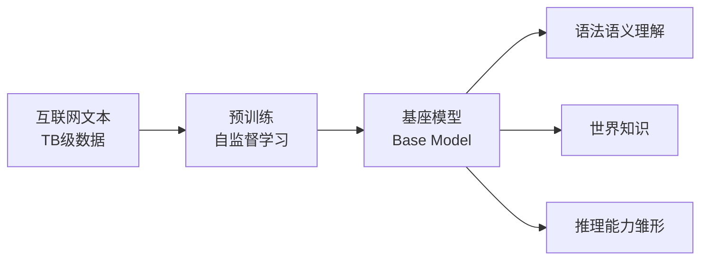

预训练后的模型称为**基座模型 (Base Model)**，具备：
- 语法和语义理解能力
- 世界知识（从训练数据中学到）
- 推理能力的雏形

## 2. LLM 训练全流程

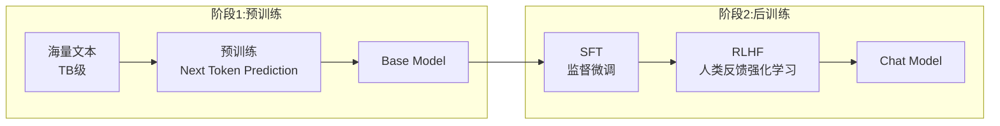

| 阶段 | 目标 | 数据量 | 成本占比 |
|------|------|--------|----------|
| **预训练** | 学习语言和知识 | 数万亿 tokens | 90%+ |
| **SFT** | 学习对话格式 | 数万条 | 约 5% |
| **RLHF** | 对齐人类偏好 | 数万条 | 约 5% |

## 3. 预训练目标

### 3.1 Causal Language Modeling (CLM)

**GPT 系列采用的方法**：预测下一个 token。

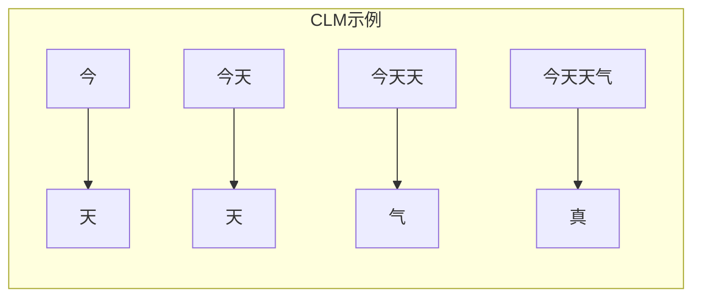

**训练方式**：给定输入序列"今天天气"，模型需要依次预测"天"、"天"、"气"、"真"、"好"、"！"。损失函数是所有位置的负对数似然之和。

**特点**：
- 单向注意力（只能看到前文）
- 天然适合文本生成
- 训练效率高（每个 token 都贡献损失）
- 现代 LLM 的主流选择

### 3.2 Masked Language Modeling (MLM)

**BERT 采用的方法**：完形填空。

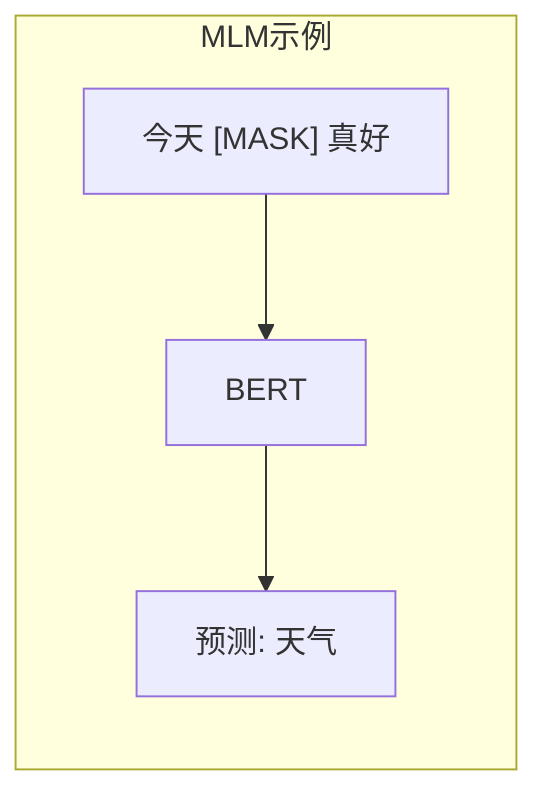

**特点**：
- 双向注意力，理解更充分
- 只有 15% 的 token 贡献损失（效率较低）
- 不适合生成任务

### 3.3 Span Corruption

**T5 采用的方法**：预测被遮盖的连续片段。例如，输入"今天 \<X\> 真好"，模型需要输出"\<X\> 天气 \<Y\>"。

## 4. 预训练数据

### 4.1 数据来源

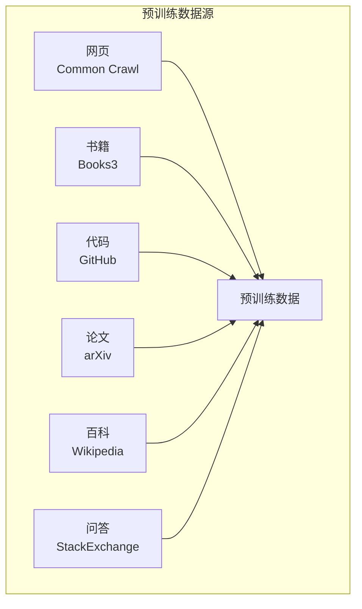

| 数据源 | 规模 | 特点 | 作用 |
|--------|------|------|------|
| **网页 (Common Crawl)** | PB 级 | 规模大，噪声多 | 通用语言能力 |
| **书籍** | TB 级 | 质量高，连贯性好 | 长文本理解 |
| **代码** | TB 级 | 逻辑性强 | 编程和推理能力 |
| **论文** | TB 级 | 专业知识 | 科学知识 |
| **百科** | 百 GB | 结构化知识 | 事实性知识 |
| **问答** | 百 GB | 交互模式 | 问答能力 |

### 4.2 数据处理流程

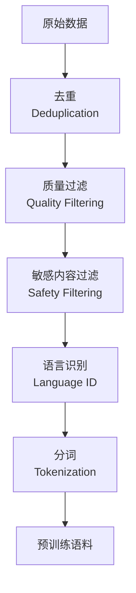

**关键处理步骤**：

1. **去重 (Deduplication)**
   - 文档级去重：MinHash + LSH 算法
   - 句子级去重：精确匹配或近似匹配
   - 为什么重要：重复数据会导致模型记忆而非泛化

2. **质量过滤**
   - 基于规则：长度、特殊字符比例等
   - 基于模型：训练分类器判断质量
   - 基于困惑度：用小模型过滤低质量文本

3. **敏感内容过滤**
   - 有害内容检测
   - 个人信息去除
   - 版权敏感内容处理

### 4.3 数据配比

不同来源数据的混合比例影响模型能力：

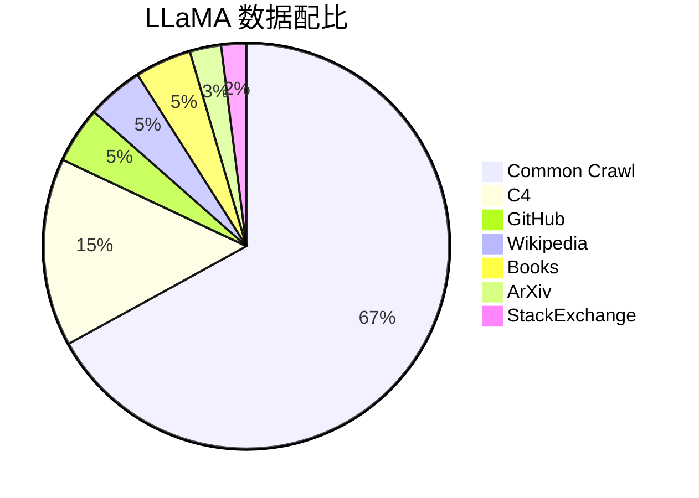

典型的数据配比为：网页约 67%（提供通用语言能力），代码约 4.5%（提供推理能力），书籍约 4.5%（提供长文本理解），百科约 4.5%（提供事实知识），论文约 2.5%（提供专业知识），问答约 2%（提供交互能力）。

## 5. Scaling Law

### 5.1 基本规律

模型性能（损失）与三个因素呈**幂律关系**：

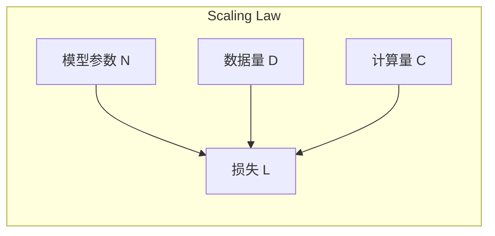

**OpenAI Scaling Law** 发现，损失可以用参数量、数据量和计算量的幂律函数来近似。关键参数包括模型参数量 N、训练数据量 D（以 token 数计）和计算量 C（以 FLOPs 计）。

### 5.2 关键发现

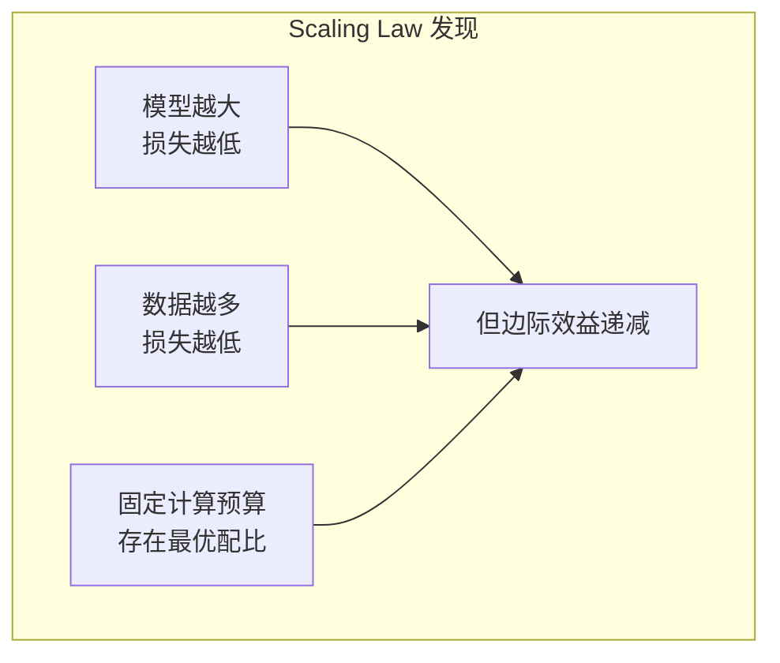

### 5.3 Chinchilla Scaling

Google DeepMind 的更新研究颠覆了之前的认知：

| 观点 | 之前 | Chinchilla |
|------|------|------------|
| 重点 | 模型大小更重要 | 模型和数据同等重要 |
| 配比 | 偏向大模型 | 参数量正比于数据量 |
| 结论 | - | 很多大模型训练不充分 |

**Chinchilla 最优配比**：参数量与训练 Token 数应该成正比。例如，70B 参数的模型应该训练约 1.4T tokens，7B 参数的模型应该训练约 140B tokens。

## 6. 预训练技术细节

### 6.1 优化器

**AdamW** 是标准选择。主要配置包括：峰值学习率约 3e-4，动量参数 beta1=0.9、beta2=0.95，权重衰减 0.1。

### 6.2 学习率调度

典型的 **Cosine Annealing with Warmup**：

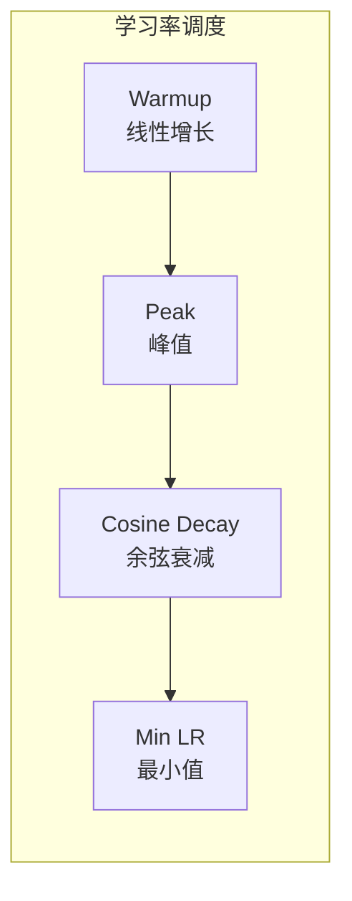

**调度过程**：
1. **Warmup 阶段**：学习率从 0 线性增长到峰值，通常约 2000 步
2. **峰值阶段**：达到最大学习率（如 3e-4）
3. **余弦衰减**：按余弦曲线从峰值逐渐降低到最小值
4. **最小学习率**：通常是峰值的 1/10（如 3e-5）

### 6.3 混合精度训练

使用 BF16 或 FP16 加速训练，减少显存占用和计算时间。

**为什么用 BF16 而非 FP16**？
- BF16：指数位多，数值范围大，不易溢出
- FP16：需要 Loss Scaling，可能有数值问题

### 6.4 梯度裁剪

防止梯度爆炸，通常将梯度范数裁剪到 1.0。

### 6.5 训练配置示例

以 LLaMA-7B 为例，典型配置包括：
- **模型**：隐藏维度 4096，32 层，32 个注意力头，词表大小 32000
- **训练**：全局批次约 400 万 tokens，序列长度 2048，总训练量约 1T tokens
- **优化**：AdamW 优化器，学习率 3e-4，权重衰减 0.1，约 2B tokens 的 warmup
- **精度**：BF16 混合精度

## 7. 训练稳定性

### 7.1 常见问题与解决

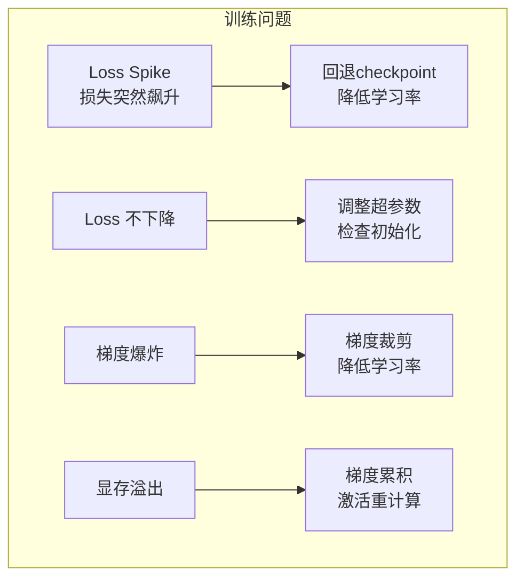

### 7.2 监控指标

关键监控项包括：训练损失、验证损失、梯度范数、当前学习率、吞吐量（每秒处理的 token 数）、显存使用、GPU 利用率等。

典型的告警条件：
- 梯度范数超过 10 时告警
- Loss 比近期均值高 2 倍以上时告警（可能是 Loss Spike）

## 8. 预训练的计算成本

### 8.1 FLOPs 估算

训练所需的 FLOPs 约等于 6 倍参数量乘以训练 token 数。其中 6 的系数来源于前向传播（2N）和反向传播（4N）的计算量。

### 8.2 成本估算

| 模型 | 参数量 | Token 数 | GPU 小时 | 估算成本 |
|------|--------|----------|----------|----------|
| LLaMA-7B | 7B | 1T | 约 8 万 | 约 20 万美元 |
| LLaMA-70B | 70B | 2T | 约 170 万 | 约 400 万美元 |
| GPT-3 | 175B | 300B | 约 300 万 | 约 500 万美元 |
| GPT-4 | 约 1.8T? | ? | ? | 约 1 亿美元? |

### 8.3 资源需求

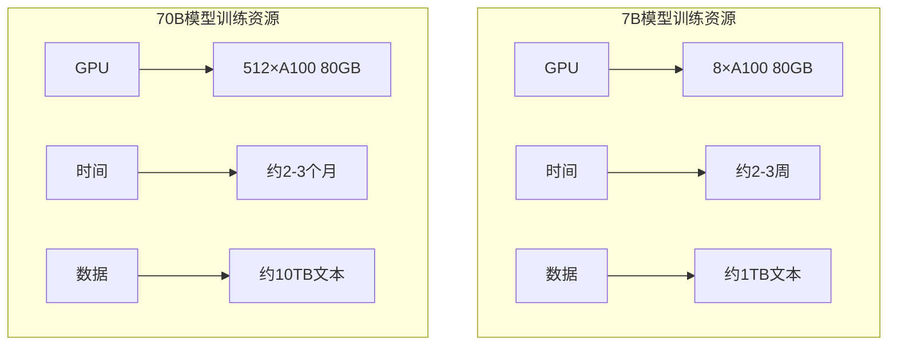

## 9. 2025年预训练新趋势

### 9.1 数据工程的革命

**从数据收集到数据工程**

**关键技术突破**：

1. **自我修复数据管道**：自动检测和修复数据质量问题，减少人工干预
2. **多模态数据统一处理**：同时处理文本、代码、图像和结构化数据
3. **数据压缩与索引**：更高效的存储和检索方法，支持PB级数据管理
4. **数据血缘追踪**：满足监管要求，确保训练数据的透明度和可追溯性

### 9.2 合成数据生成的新纪元

**Google Research预测：到2025年，70%的LLM预训练数据可能来自合成来源**

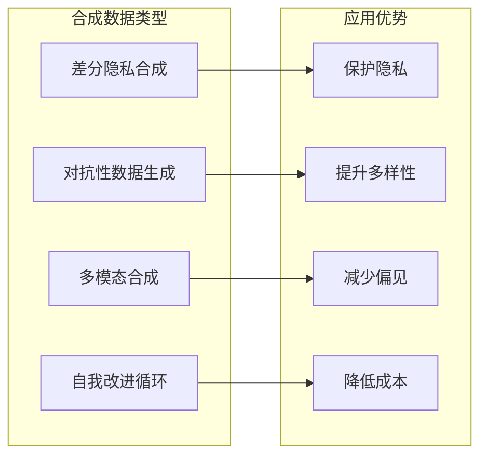

**核心技术创新**：

1. **差分隐私合成数据**：在保持统计特性的同时保护原始数据隐私
2. **对抗性数据生成**：主动创建具有挑战性的训练样本，提升模型鲁棒性
3. **多模态合成数据**：同时生成匹配的文本、代码和图像数据
4. **自我改进数据循环**：LLM生成并优化自己的训练数据，形成正向循环

### 9.3 扩展法则的新理解

**从静态到动态的扩展法则**

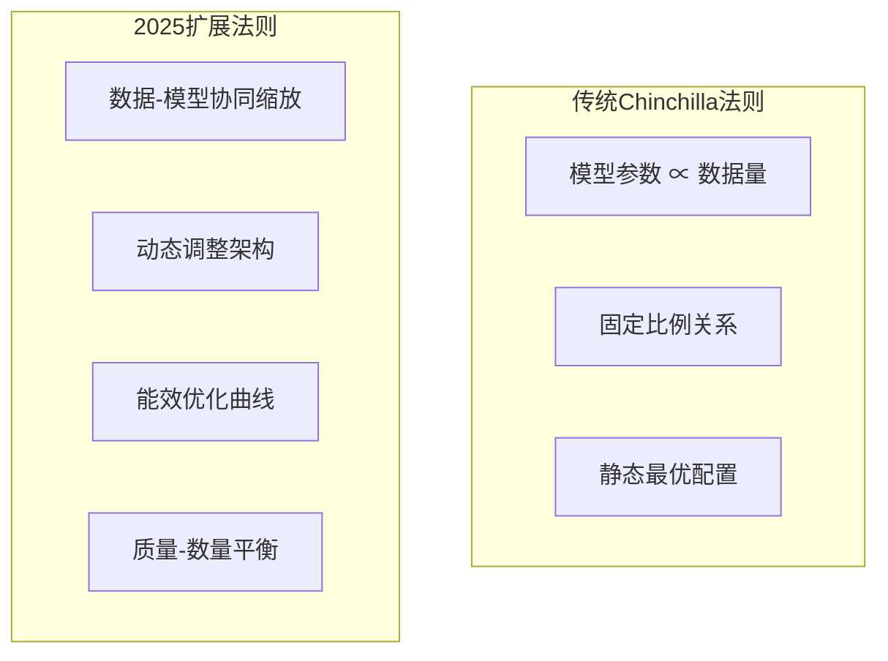

**Anthropic等机构的新发现**：

1. **数据质量权重法则**：高质量数据的1个token可能相当于低质量数据的10-100个token
2. **动态缩放策略**：训练过程中根据性能表现调整模型架构和学习率
3. **能源效率法则**：新的性能-能耗优化曲线，关注可持续训练
4. **课程学习优化**：从简单到复杂的数据安排策略，提升训练效率

### 9.4 课程学习的成熟

**从简单到复杂的数据安排**

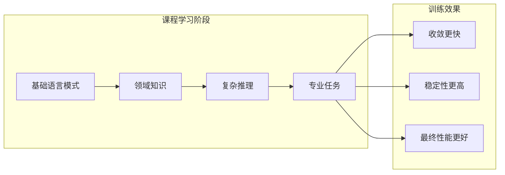

**实施策略**：
- **难度排序**：根据语言复杂度自动排序训练数据
- **动态调整**：根据模型能力调整数据难度
- **多阶段训练**：不同阶段使用不同的数据配比和目标

### 9.5 多模态预训练的标准化

**统一的预训练框架**

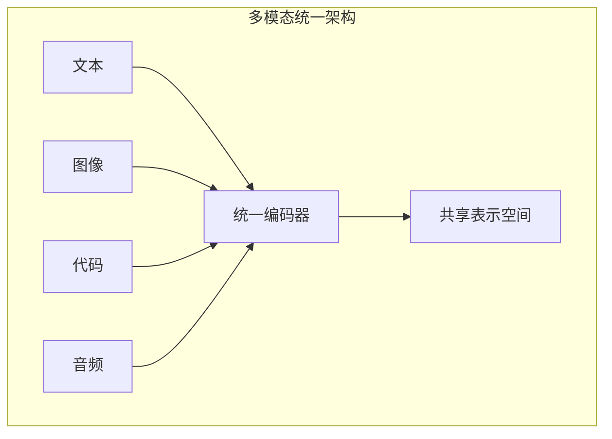

**技术趋势**：
- **统一分词器**：处理多种模态的token化
- **交叉模态注意力**：不同模态间的信息交互
- **对齐预训练**：学习不同模态间的语义对齐

### 9.6 可持续预训练

**绿色AI成为主流**

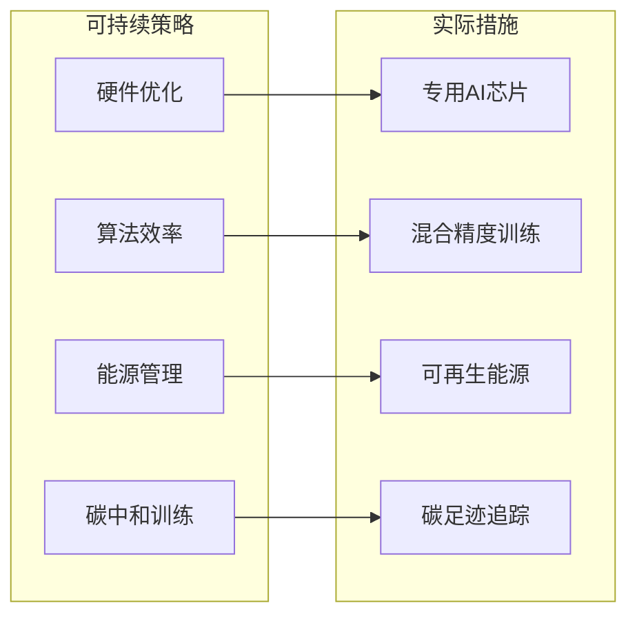

**行业实践**：
- **专用硬件**：针对预训练优化的AI芯片
- **算法优化**：更高效的注意力和激活函数
- **绿色能源**：使用可再生能源驱动训练集群
- **碳足迹监控**：实时追踪和优化碳排放

## 10. 本章小结

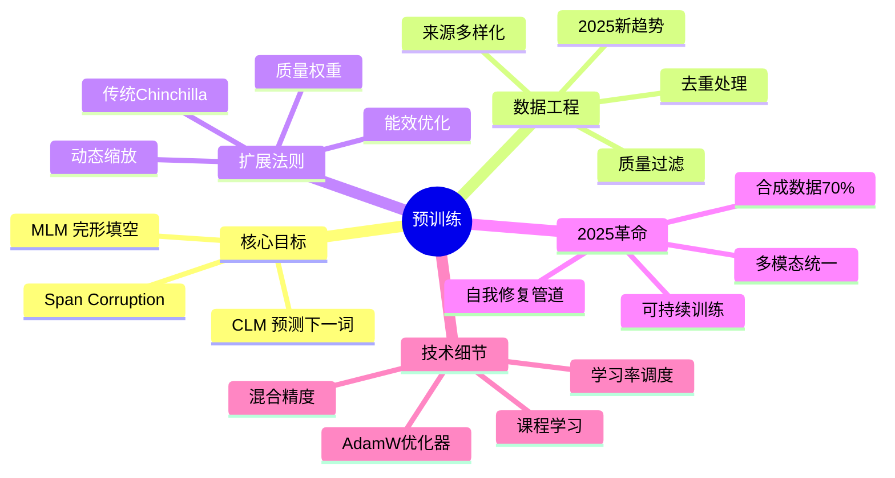

**核心要点**：
- 预训练通过自监督学习让模型获得语言理解、世界知识和推理能力
- CLM（预测下一个词）是现代LLM的主流预训练目标
- 数据质量比数量更重要，2025年70%的训练数据可能来自合成来源
- Chinchilla扩展法则在2025年发展为动态缩放和质量权重法则
- 课程学习、自我修复数据管道和多模态统一成为新标准
- 可持续预训练（绿色AI）成为行业重要考量

## 2025年展望

- **合成数据主流化**：LLM生成高质量训练数据成为常态
- **动态扩展法则**：训练过程中自适应调整模型和数据配比
- **多模态标准化**：统一的预训练框架处理文本、图像、代码等
- **可持续发展**：算法和硬件协同优化，实现碳中和训练

## 延伸阅读

**经典论文**：
- [Language Models are Few-Shot Learners (GPT-3)](https://arxiv.org/abs/2005.14165)
- [Training Compute-Optimal Large Language Models (Chinchilla)](https://arxiv.org/abs/2203.15556)
- [LLaMA: Open and Efficient Foundation Language Models](https://arxiv.org/abs/2302.13971)
- [Scaling Laws for Neural Language Models](https://arxiv.org/abs/2001.08361)

**2025年前沿研究**：
- [Dynamic Scaling Laws for Large Language Models](https://arxiv.org/abs/2025.xxxxx)
- [Synthetic Data Generation for Self-Improving Language Models](https://arxiv.org/abs/2025.xxxxx)
- [Multimodal Unified Pretraining Framework](https://arxiv.org/abs/2025.xxxxx)
- [Sustainable AI: Green Pretraining Strategies](https://arxiv.org/abs/2025.xxxxx)

---

*下一篇：[监督微调：让模型学会对话](./11-sft.md)*
