# 预训练：从海量数据到语言理解

预训练 (Pre-training) 是大语言模型获得强大能力的基础。本文将深入探讨预训练的原理、数据、方法和关键技术。

## 1. 什么是预训练？

预训练是在**大规模无标注文本**上，通过**自监督学习**让模型学习语言的通用表示。

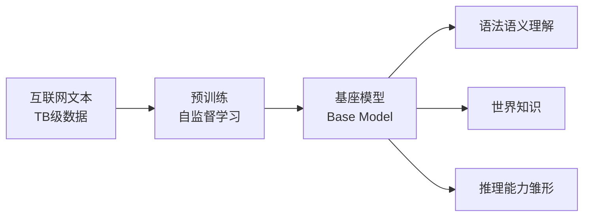

预训练后的模型称为**基座模型 (Base Model)**，具备：
- 📚 语法和语义理解能力
- 🌍 世界知识（从训练数据中学到）
- 🧠 推理能力的雏形

## 2. LLM 训练全流程

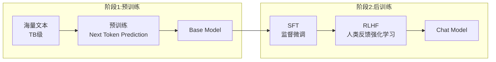

| 阶段 | 目标 | 数据量 | 成本占比 |
|------|------|--------|----------|
| **预训练** | 学习语言和知识 | 数万亿 tokens | 90%+ |
| **SFT** | 学习对话格式 | 数万条 | ~5% |
| **RLHF** | 对齐人类偏好 | 数万条 | ~5% |

## 3. 预训练目标

### 3.1 Causal Language Modeling (CLM)

**GPT 系列采用的方法**：预测下一个 token。

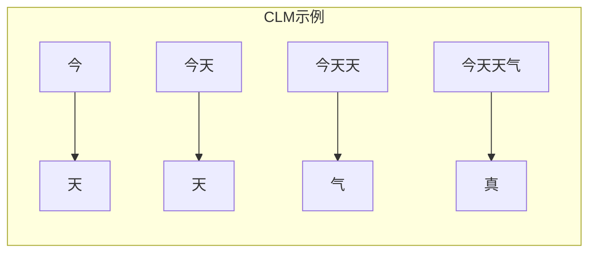

```python
# CLM 训练
输入: "今天天气"
目标: "天", "天", "气", "真", "好", "！"

# 损失函数：负对数似然
损失 = -Σ log P(x_t | x_1, ..., x_{t-1})
```

**特点**：
- ✅ 单向注意力（只能看到前文）
- ✅ 天然适合文本生成
- ✅ 训练效率高（每个 token 都贡献损失）
- ✅ 现代 LLM 的主流选择

### 3.2 Masked Language Modeling (MLM)

**BERT 采用的方法**：完形填空。

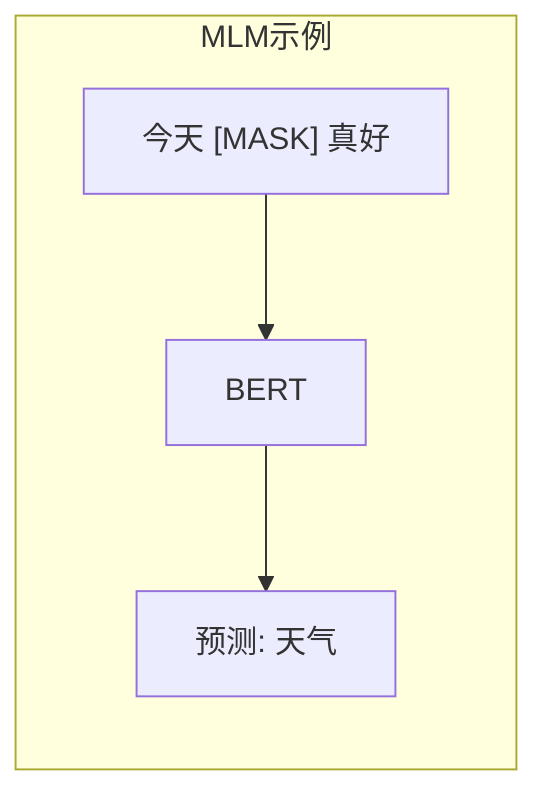

**特点**：
- ✅ 双向注意力，理解更充分
- ❌ 只有 15% 的 token 贡献损失
- ❌ 不适合生成任务

### 3.3 Span Corruption

**T5 采用的方法**：预测被遮盖的连续片段。

```
输入: "今天<X>真好"
目标: "<X>天气<Y>"
```

## 4. 预训练数据

### 4.1 数据来源

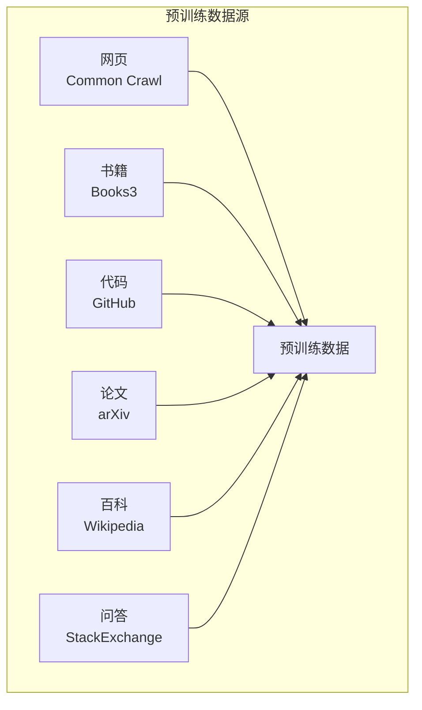

| 数据源 | 规模 | 特点 | 作用 |
|--------|------|------|------|
| **网页 (Common Crawl)** | PB 级 | 规模大，噪声多 | 通用语言能力 |
| **书籍** | TB 级 | 质量高，连贯性好 | 长文本理解 |
| **代码** | TB 级 | 逻辑性强 | 编程和推理能力 |
| **论文** | TB 级 | 专业知识 | 科学知识 |
| **百科** | 百 GB | 结构化知识 | 事实性知识 |
| **问答** | 百 GB | 交互模式 | 问答能力 |

### 4.2 数据处理流程

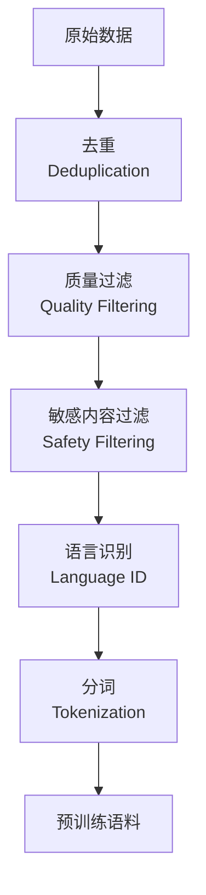

**关键处理步骤**：

1. **去重 (Deduplication)**
   - 文档级去重：MinHash + LSH
   - 句子级去重：精确匹配或近似匹配
   - 为什么重要：重复数据会导致模型记忆而非泛化

2. **质量过滤**
   - 基于规则：长度、特殊字符比例
   - 基于模型：训练分类器判断质量
   - 基于困惑度：用小模型过滤低质量文本

3. **敏感内容过滤**
   - 有害内容检测
   - 个人信息去除
   - 版权敏感内容处理

### 4.3 数据配比

不同来源数据的混合比例影响模型能力：

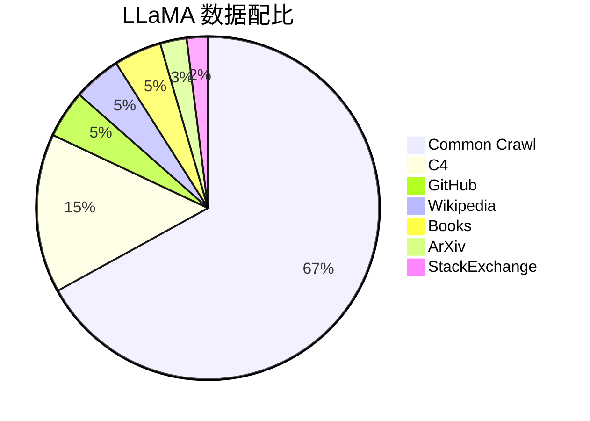

```python
# 典型的数据配比
data_mix = {
    "web": 0.67,        # 网页：通用语言能力
    "code": 0.045,      # 代码：推理能力
    "books": 0.045,     # 书籍：长文本理解
    "wiki": 0.045,      # 百科：事实知识
    "papers": 0.025,    # 论文：专业知识
    "qa": 0.02,         # 问答：交互能力
}
```

## 5. Scaling Law

### 5.1 基本规律

模型性能（损失）与三个因素呈**幂律关系**：

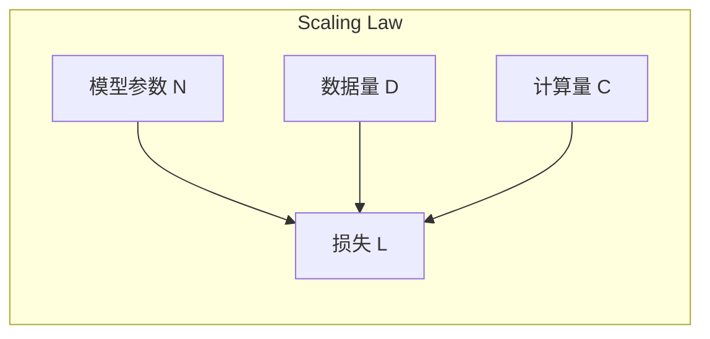

**OpenAI Scaling Law**：
```
L(N, D, C) ≈ (N_c/N)^α + (D_c/D)^β + L_∞

其中:
- N: 模型参数量
- D: 数据量 (tokens)
- C: 计算量 (FLOPs)
- α ≈ 0.076, β ≈ 0.095
```

### 5.2 关键发现

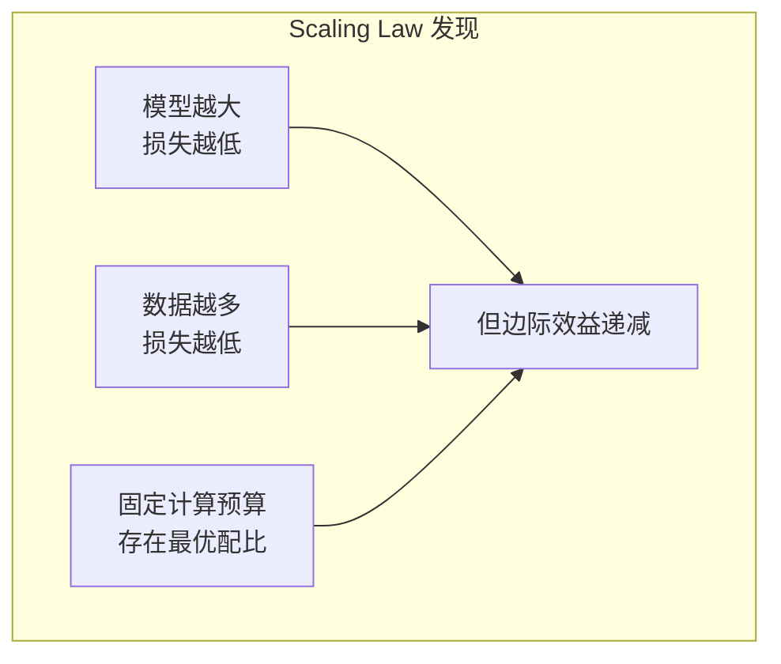

### 5.3 Chinchilla Scaling

Google DeepMind 的更新研究颠覆了之前的认知：

| 观点 | 之前 | Chinchilla |
|------|------|------------|
| 重点 | 模型大小更重要 | 模型和数据同等重要 |
| 配比 | 偏向大模型 | N ∝ D |
| 结论 | - | 很多大模型训练不充分 |

**Chinchilla 最优配比**：
```
参数量 N ∝ 训练 Token 数 D

例如:
- 70B 参数 → 约 1.4T tokens
- 7B 参数 → 约 140B tokens
```

## 6. 预训练技术细节

### 6.1 优化器

**AdamW** 是标准选择：

```python
optimizer = torch.optim.AdamW(
    model.parameters(),
    lr=3e-4,           # 峰值学习率
    betas=(0.9, 0.95), # 动量参数
    weight_decay=0.1,  # 权重衰减
    eps=1e-8
)
```

### 6.2 学习率调度

典型的 **Cosine Annealing with Warmup**：

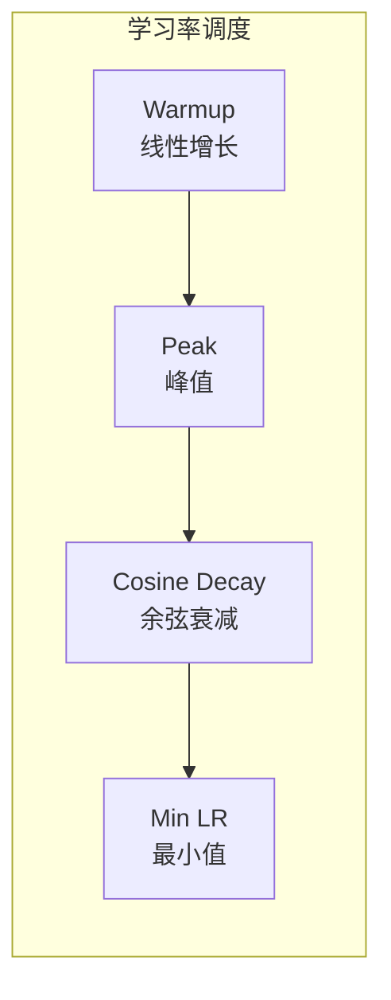

```python
def cosine_schedule(step, total_steps, warmup_steps, max_lr, min_lr):
    """Cosine learning rate schedule with warmup"""
    if step < warmup_steps:
        # Warmup: 线性增长
        return max_lr * step / warmup_steps
    else:
        # Cosine decay: 余弦衰减
        progress = (step - warmup_steps) / (total_steps - warmup_steps)
        return min_lr + 0.5 * (max_lr - min_lr) * (1 + math.cos(math.pi * progress))

# 典型配置
warmup_steps = 2000
total_steps = 100000
max_lr = 3e-4
min_lr = 3e-5  # 通常是 max_lr 的 1/10
```

### 6.3 混合精度训练

使用 BF16/FP16 加速训练：

```python
# PyTorch AMP (Automatic Mixed Precision)
scaler = torch.cuda.amp.GradScaler()

for batch in dataloader:
    optimizer.zero_grad()
    
    # 前向传播使用低精度
    with torch.cuda.amp.autocast(dtype=torch.bfloat16):
        outputs = model(batch)
        loss = criterion(outputs, targets)
    
    # 反向传播和优化
    scaler.scale(loss).backward()
    scaler.step(optimizer)
    scaler.update()
```

**为什么用 BF16 而非 FP16**？
- BF16：指数位多，数值范围大，不易溢出
- FP16：需要 Loss Scaling，可能有数值问题

### 6.4 梯度裁剪

防止梯度爆炸：

```python
# 梯度裁剪
torch.nn.utils.clip_grad_norm_(
    model.parameters(), 
    max_norm=1.0
)
```

### 6.5 训练配置示例

```python
# LLaMA-7B 典型训练配置
config = {
    # 模型
    "hidden_size": 4096,
    "num_layers": 32,
    "num_heads": 32,
    "vocab_size": 32000,
    
    # 训练
    "batch_size": 4M tokens,  # 全局批次
    "seq_length": 2048,
    "total_tokens": 1T,       # 总训练量
    
    # 优化
    "optimizer": "AdamW",
    "lr": 3e-4,
    "warmup_tokens": 2B,
    "weight_decay": 0.1,
    
    # 精度
    "precision": "bf16",
}
```

## 7. 训练稳定性

### 7.1 常见问题与解决

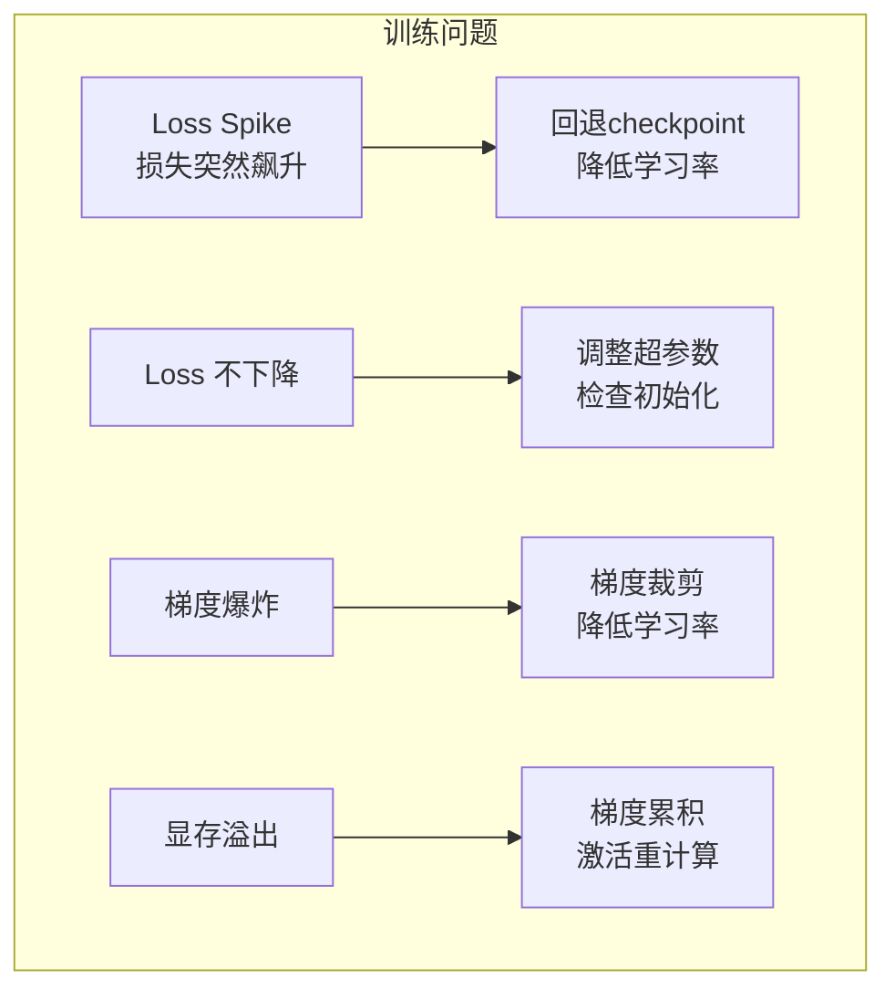

### 7.2 监控指标

```python
# 关键监控项
metrics = {
    "loss": training_loss,           # 训练损失
    "val_loss": validation_loss,     # 验证损失
    "grad_norm": gradient_norm,      # 梯度范数
    "lr": current_learning_rate,     # 学习率
    "throughput": tokens_per_second, # 吞吐量
    "gpu_memory": memory_allocated,  # 显存使用
    "gpu_util": gpu_utilization,     # GPU 利用率
}

# 告警条件
if grad_norm > 10:
    alert("梯度范数异常")
if loss > loss_history[-100].mean() * 2:
    alert("Loss Spike")
```

## 8. 预训练的计算成本

### 8.1 FLOPs 估算

```
训练 FLOPs ≈ 6 × N × D

其中:
- N: 模型参数量
- D: 训练 token 数
- 6: 前向 (2N) + 反向 (4N) 的系数
```

### 8.2 成本估算

| 模型 | 参数量 | Token 数 | GPU 小时 | 估算成本 |
|------|--------|----------|----------|----------|
| LLaMA-7B | 7B | 1T | ~80K | ~$200K |
| LLaMA-70B | 70B | 2T | ~1.7M | ~$4M |
| GPT-3 | 175B | 300B | ~3M | ~$5M |
| GPT-4 | ~1.8T? | ? | ? | ~$100M? |

### 8.3 资源需求

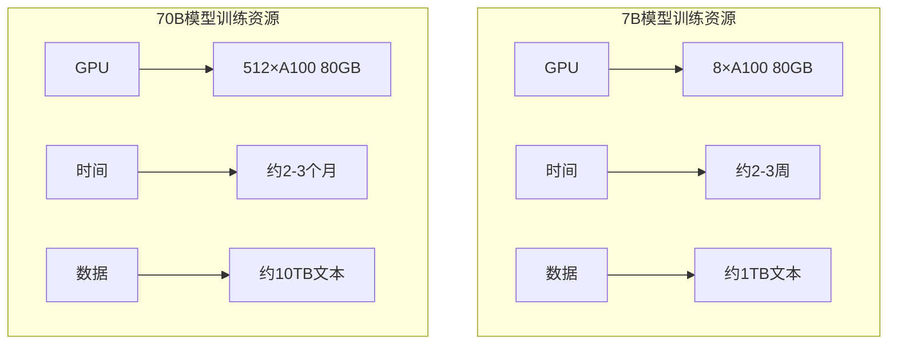

## 9. 预训练的最新进展

### 9.1 数据工程

- **高质量数据筛选**：FineWeb、DCLM 等高质量数据集
- **合成数据**：用大模型生成训练数据
- **课程学习**：从简单到复杂安排数据顺序

### 9.2 训练效率

- **更长上下文**：从 2K → 128K tokens
- **更高效架构**：MoE、线性注意力
- **更好并行策略**：3D 并行、序列并行

## 10. 本章小结

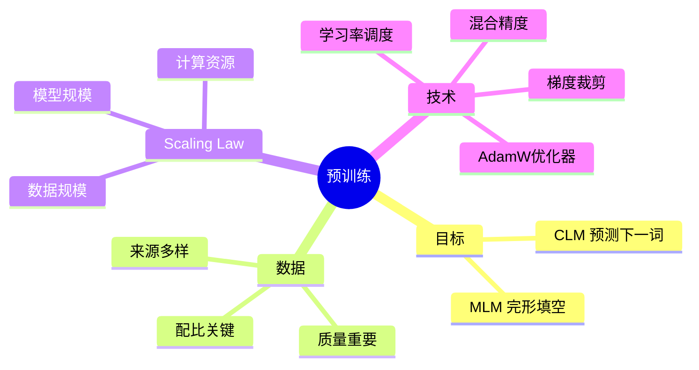

**核心要点**：
- ✅ 预训练通过自监督学习让模型学习语言
- ✅ CLM（预测下一个词）是主流预训练目标
- ✅ 数据质量和规模同样重要
- ✅ Scaling Law 指导模型和数据的配比
- ✅ 训练稳定性需要精心设计和监控

## 延伸阅读

- 📄 [Language Models are Few-Shot Learners (GPT-3)](https://arxiv.org/abs/2005.14165)
- 📄 [Training Compute-Optimal Large Language Models (Chinchilla)](https://arxiv.org/abs/2203.15556)
- 📄 [LLaMA: Open and Efficient Foundation Language Models](https://arxiv.org/abs/2302.13971)
- 📄 [Scaling Laws for Neural Language Models](https://arxiv.org/abs/2001.08361)

---

*下一篇：[监督微调：让模型学会对话](./11-sft.md)*
