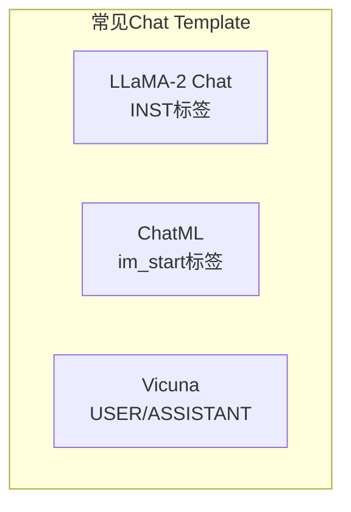
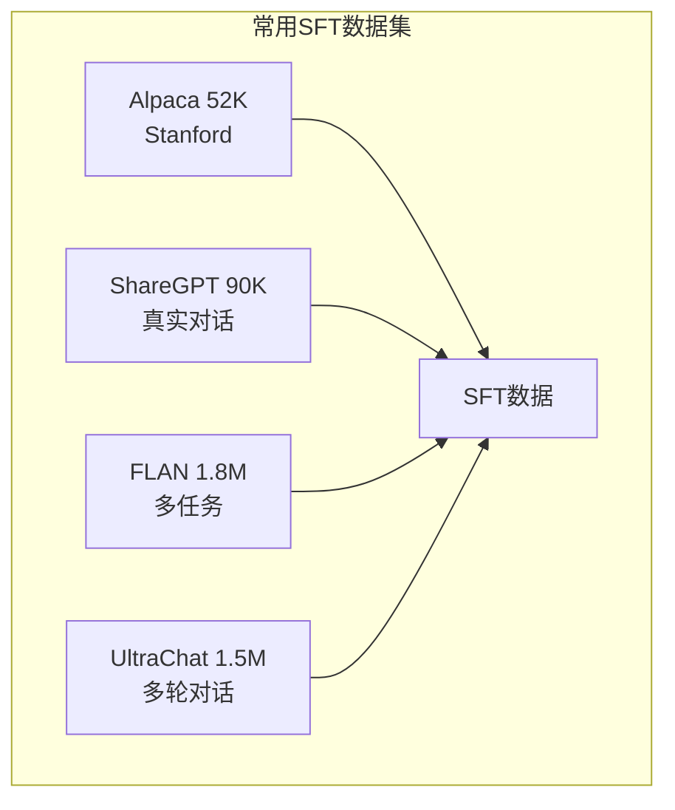
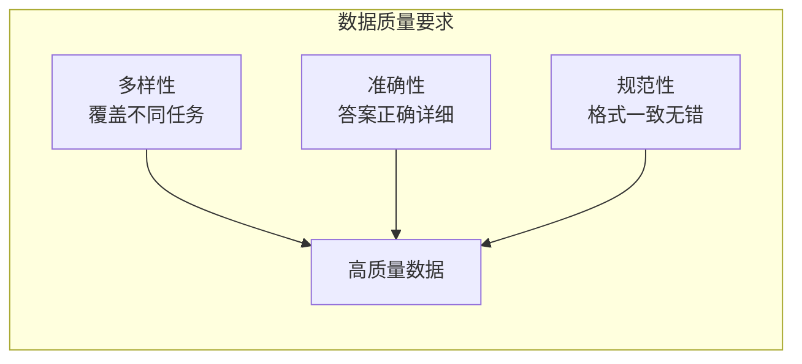
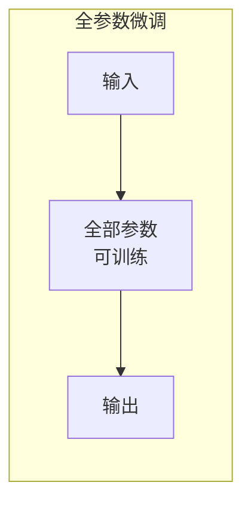
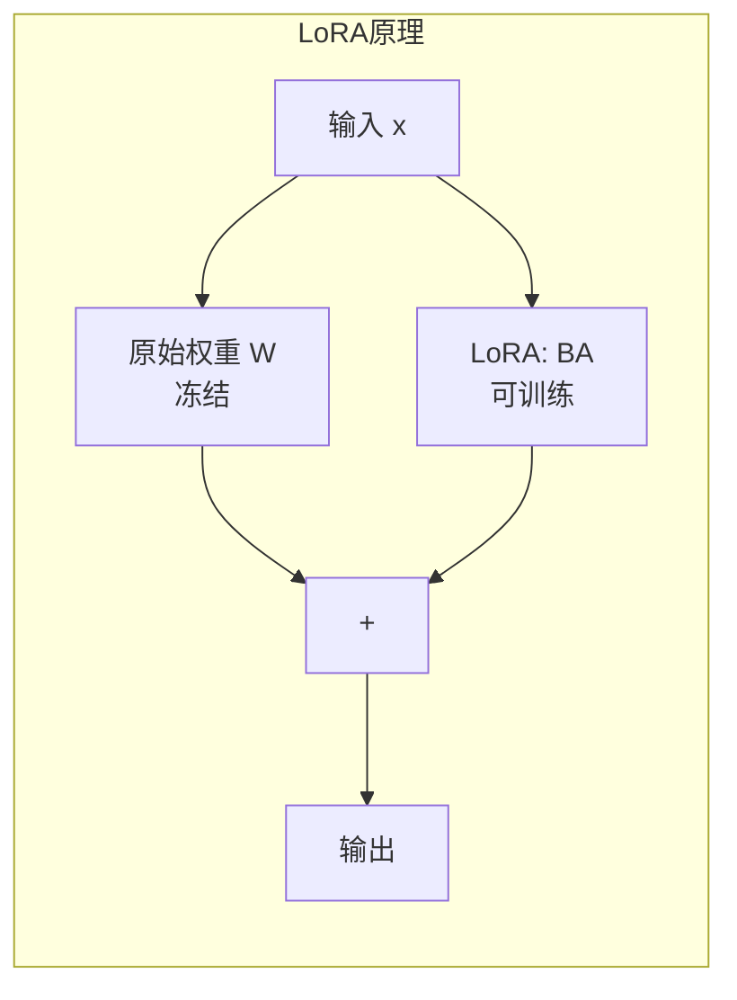
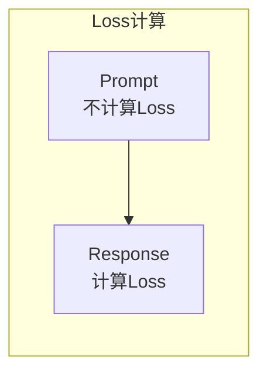
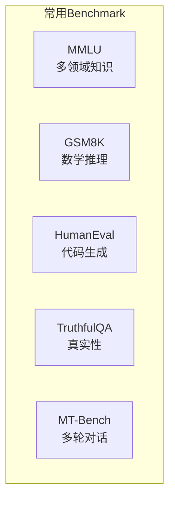
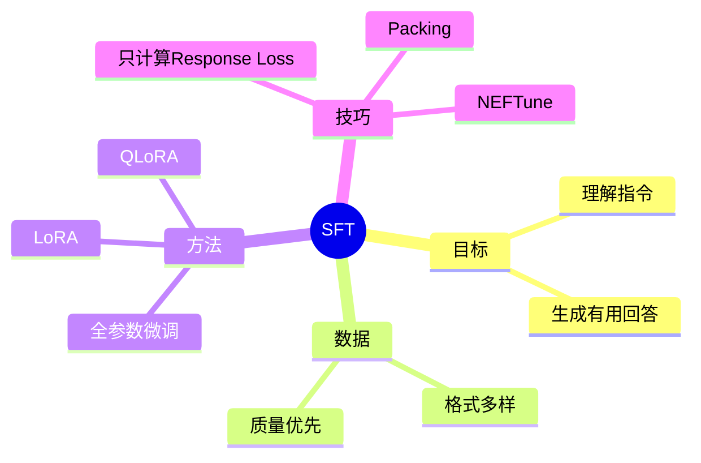

# 监督微调：让模型学会对话

经过预训练的模型虽然具备强大的语言能力，但它只会"续写"文本，无法理解指令或进行对话。监督微调 (Supervised Fine-Tuning, SFT) 是让模型学会遵循指令的关键步骤。

## 1. 从基座模型到对话模型

### 1.1 基座模型的行为

基座模型只学会了"续写"，不理解指令。例如，当用户要求"请用 Python 写一个快速排序"时，基座模型可能只会续写："函数。快速排序是一种高效的排序算法，由 Tony Hoare 于 1959 年提出..."——它只是在续写文本，而不是在回答问题。

### 1.2 SFT 后的行为

SFT 后的模型理解指令，会给出真正有用的回答。同样的问题，SFT 模型会直接输出快速排序的代码实现。

## 2. 指令数据格式

### 2.1 单轮对话格式 (Alpaca)

Alpaca 格式包含三个字段：instruction（指令）、input（可选的输入）、output（期望的输出）。例如，一条翻译任务的数据可能是：指令为"将以下句子翻译成英文"，输入为"今天天气真好"，输出为"The weather is really nice today."

### 2.2 多轮对话格式 (ShareGPT)

ShareGPT 格式使用 conversations 数组，每个元素包含发言者（human 或 gpt）和内容。这种格式适合多轮对话场景。

### 2.3 Chat Template

不同模型使用不同的对话模板，这是模型理解对话结构的关键：

**LLaMA-2 Chat** 使用 [INST] 和 [/INST] 标签包裹用户消息，使用 \<\<SYS\>\> 标签包裹系统提示。

**ChatML (Qwen, OpenAI)** 使用 \<\|im_start\|\> 和 \<\|im_end\|\> 标签，每个角色（system、user、assistant）都有独立的标签块。

**Vicuna** 使用简单的 "USER:" 和 "ASSISTANT:" 前缀来区分角色。

## 3. 高质量数据集

### 3.1 公开数据集

| 数据集 | 规模 | 特点 | 来源 |
|--------|------|------|------|
| **Alpaca** | 52K | Self-Instruct 生成 | Stanford |
| **ShareGPT** | 约 90K | 真实用户对话 | 社区收集 |
| **OpenAssistant** | 160K | 众包标注 | LAION |
| **FLAN** | 1.8M | 多任务指令 | Google |
| **WizardLM** | 250K | 复杂指令进化 | Microsoft |
| **UltraChat** | 1.5M | 多轮对话 | 清华 |

### 3.2 数据质量 > 数据数量

**LIMA 论文的发现**：仅用 **1000 条**高质量数据就能训练出不错的对话模型！

**高质量数据的特征**：
- **多样性**：覆盖问答、写作、代码、推理等不同任务
- **准确性**：回答正确、详细、有帮助
- **规范性**：格式统一、无语法错误

## 4. 训练方法

### 4.1 全参数微调 (Full Fine-tuning)

更新模型所有参数：

**工作流程**：对于每个批次的数据，进行前向传播计算损失，然后反向传播更新所有参数。

| 优点 | 缺点 |
|------|------|
| 效果最好 | 显存需求大 |
| 充分适应新任务 | 容易过拟合 |
| | 每个任务存一份模型 |

### 4.2 LoRA (Low-Rank Adaptation)

**核心思想**：冻结原始参数，只训练低秩分解矩阵。

**数学原理**：原始权重 W 是一个 d x d 的矩阵。LoRA 不直接修改 W，而是添加一个低秩修改量 ΔW = B × A，其中 B 是 d x r 矩阵，A 是 r x d 矩阵，r 远小于 d（例如 r=16，d=4096）。这样可训练参数从 d x d 降低到 2 x d x r，减少了约 99.9%。

**LoRA 优点**：
- 显存占用小（约 0.1% 参数）
- 训练速度快
- 可合并回原模型
- 可为不同任务训练不同 adapter

### 4.3 QLoRA

LoRA + 4-bit 量化，进一步降低显存。模型以 4-bit 量化形式加载（使用 NF4 格式），而 LoRA 参数保持 BF16 精度。

**惊人效果**：
- 单张 **24GB GPU** 可微调 **65B** 模型
- 显存降低 **4-8 倍**
- 效果接近全参数微调

### 4.4 方法对比

| 方法 | 可训练参数 | 7B 模型显存 | 效果 |
|------|-----------|-------------|------|
| **全参数** | 100% | 约 60GB | 最好 |
| **LoRA** | 约 0.1% | 约 16GB | 很好 |
| **QLoRA** | 约 0.1% | 约 6GB | 接近 LoRA |

## 5. 训练技巧

### 5.1 只计算 Response 的 Loss

只对模型生成的回复部分计算损失，不对用户的输入部分计算。这可以通过将 prompt 部分的 label 设为 -100 来实现。

### 5.2 学习率设置

SFT 使用比预训练更小的学习率。预训练通常使用 1e-4 到 3e-4，而 SFT 通常使用 1e-5 到 2e-5（小约 10 倍）。

### 5.3 Packing

将多个短样本打包成一个长序列，提高 GPU 利用率。例如，三个分别长度为 3、2、4 的样本原本需要各自 padding 到最大长度，浪费计算资源。打包后变成一个长度为 9 的序列，无浪费的 padding。

### 5.4 NEFTune

在 embedding 层添加噪声，提升泛化能力。这个简单的技巧在 AlpacaEval 上能提升 10%+ 的胜率。

## 6. 评估指标

### 6.1 自动评估

| 指标 | 说明 | 适用场景 |
|------|------|----------|
| **Perplexity** | 困惑度，越低越好 | 语言建模质量 |
| **BLEU/ROUGE** | 与参考答案的重合度 | 翻译、摘要 |
| **Pass@k** | 代码测试通过率 | 代码生成 |
| **Exact Match** | 精确匹配准确率 | 问答 |

### 6.2 Benchmark 评测

| 评测集 | 评估能力 | 样本数 |
|--------|----------|--------|
| **MMLU** | 57 领域知识 | 14K |
| **GSM8K** | 数学推理 | 8.5K |
| **HumanEval** | 代码生成 | 164 |
| **TruthfulQA** | 真实性 | 817 |
| **MT-Bench** | 多轮对话质量 | 80 |

### 6.3 人工评估

- **Helpfulness**：回答是否有帮助
- **Harmlessness**：回答是否安全无害
- **Honesty**：回答是否诚实

## 7. 本章小结

**核心要点**：
- SFT 让预训练模型学会理解和遵循指令
- 数据质量比数量更重要（LIMA: 1000 条即可）
- LoRA/QLoRA 让个人也能微调大模型
- 合适的训练技巧能显著提升效果

## 延伸阅读

- [LIMA: Less Is More for Alignment](https://arxiv.org/abs/2305.11206)
- [LoRA: Low-Rank Adaptation of Large Language Models](https://arxiv.org/abs/2106.09685)
- [QLoRA: Efficient Finetuning of Quantized LLMs](https://arxiv.org/abs/2305.14314)
- [NEFTune: Noisy Embeddings Improve Instruction Finetuning](https://arxiv.org/abs/2310.05914)

---

*下一篇：[RL 策略：PPO、GRPO、DPO](./11.5-rl-strategies.md)*
