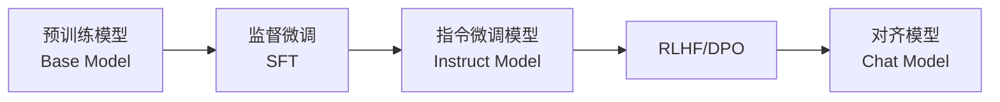
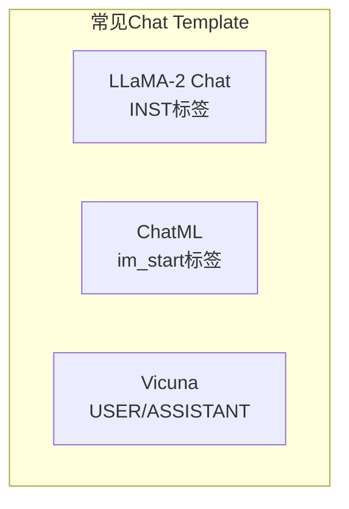
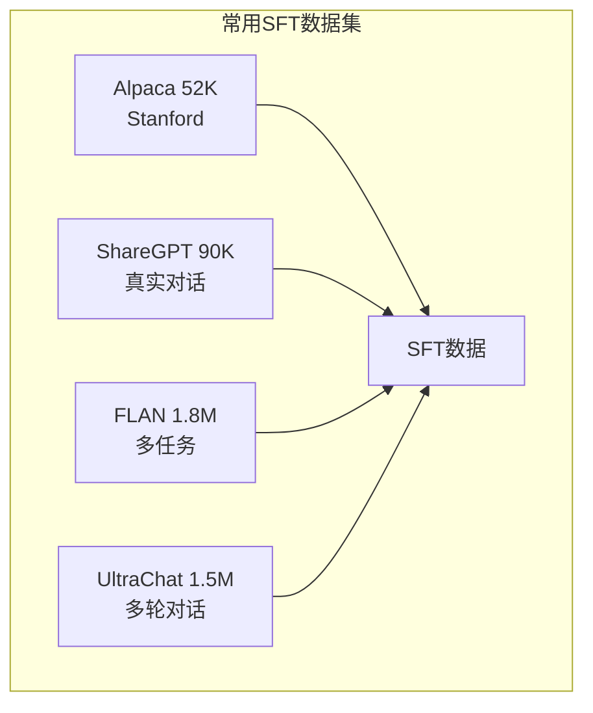
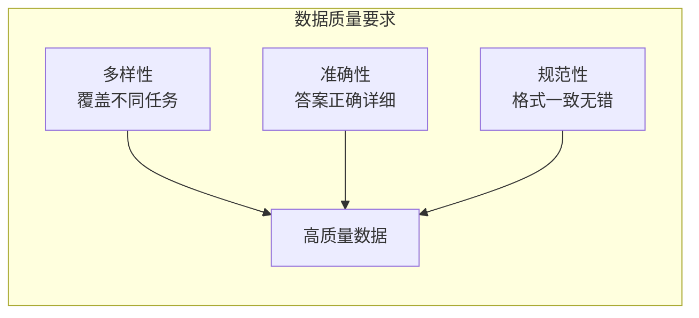
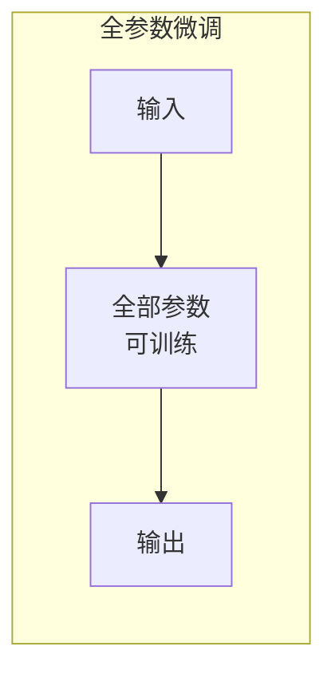
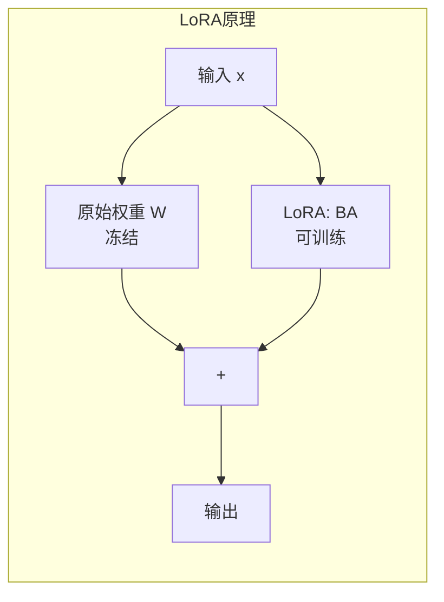
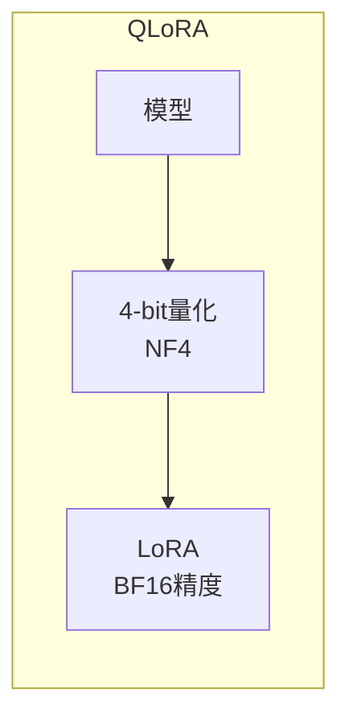
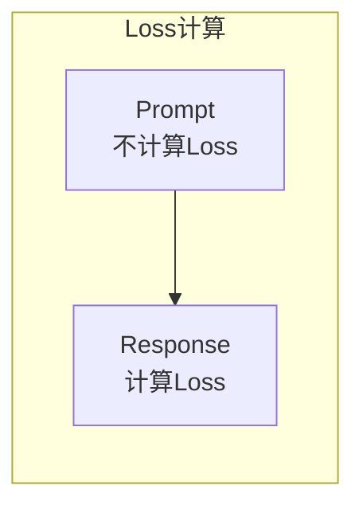
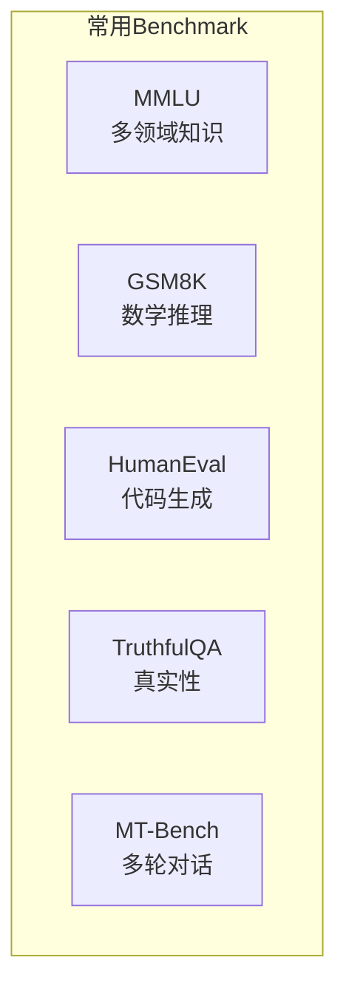
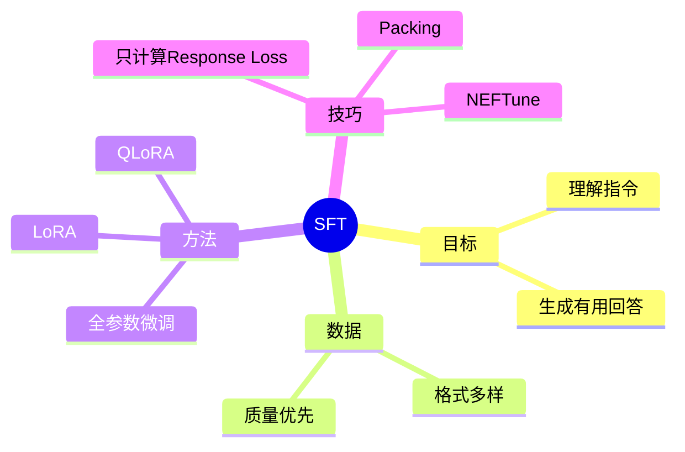

# 监督微调：让模型学会对话

经过预训练的模型虽然具备强大的语言能力，但它只会"续写"文本，无法理解指令或进行对话。监督微调 (Supervised Fine-Tuning, SFT) 是让模型学会遵循指令的关键步骤。

## 1. 从基座模型到对话模型



### 1.1 基座模型的行为

基座模型只学会了"续写"，不理解指令：

```
用户: 请用Python写一个快速排序
基座模型: 函数。快速排序是一种高效的排序算法，由Tony Hoare于1959年提出...
        （只是在续写，不是在回答问题！）
```

### 1.2 SFT 后的行为

SFT 后的模型理解指令，给出有用的回答：

```
用户: 请用Python写一个快速排序
SFT模型: 
```python
def quicksort(arr):
    if len(arr) <= 1:
        return arr
    pivot = arr[len(arr) // 2]
    left = [x for x in arr if x < pivot]
    middle = [x for x in arr if x == pivot]
    right = [x for x in arr if x > pivot]
    return quicksort(left) + middle + quicksort(right)
```
```

## 2. 指令数据格式

### 2.1 单轮对话格式 (Alpaca)

```json
{
  "instruction": "将以下句子翻译成英文",
  "input": "今天天气真好",
  "output": "The weather is really nice today."
}
```

### 2.2 多轮对话格式 (ShareGPT)

```json
{
  "conversations": [
    {"from": "human", "value": "你好，请介绍一下自己"},
    {"from": "gpt", "value": "你好！我是一个AI助手，可以帮助你回答问题、写作、编程等。"},
    {"from": "human", "value": "你能帮我写代码吗？"},
    {"from": "gpt", "value": "当然可以！请告诉我你需要什么功能，我会尽力帮助你。"}
  ]
}
```

### 2.3 Chat Template

不同模型使用不同的对话模板，这是模型理解对话结构的关键：



**LLaMA-2 Chat**:
```
<s>[INST] <<SYS>>
You are a helpful assistant.
<</SYS>>

{user_message_1} [/INST] {assistant_response_1} </s><s>[INST] {user_message_2} [/INST]
```

**ChatML (Qwen, OpenAI)**:
```
<|im_start|>system
You are a helpful assistant.<|im_end|>
<|im_start|>user
{user_message}<|im_end|>
<|im_start|>assistant
{assistant_response}<|im_end|>
```

**Vicuna**:
```
A chat between a curious user and an AI assistant.

USER: {user_message}
ASSISTANT: {assistant_response}
```

## 3. 高质量数据集

### 3.1 公开数据集



| 数据集 | 规模 | 特点 | 来源 |
|--------|------|------|------|
| **Alpaca** | 52K | Self-Instruct 生成 | Stanford |
| **ShareGPT** | ~90K | 真实用户对话 | 社区收集 |
| **OpenAssistant** | 160K | 众包标注 | LAION |
| **FLAN** | 1.8M | 多任务指令 | Google |
| **WizardLM** | 250K | 复杂指令进化 | Microsoft |
| **UltraChat** | 1.5M | 多轮对话 | 清华 |

### 3.2 数据质量 > 数据数量

**LIMA 论文的发现**：仅用 **1000 条**高质量数据就能训练出不错的对话模型！



**高质量数据的特征**：
- 📊 **多样性**：覆盖问答、写作、代码、推理等不同任务
- ✅ **准确性**：回答正确、详细、有帮助
- 📝 **规范性**：格式统一、无语法错误

## 4. 训练方法

### 4.1 全参数微调 (Full Fine-tuning)

更新模型所有参数：



```python
# 全参数微调
for batch in dataloader:
    outputs = model(batch["input_ids"], labels=batch["labels"])
    loss = outputs.loss
    loss.backward()
    optimizer.step()
```

| 优点 | 缺点 |
|------|------|
| ✅ 效果最好 | ❌ 显存需求大 |
| ✅ 充分适应新任务 | ❌ 容易过拟合 |
| | ❌ 每个任务存一份模型 |

### 4.2 LoRA (Low-Rank Adaptation)

**核心思想**：冻结原始参数，只训练低秩分解矩阵。



```
原始权重: W (d × d)
LoRA: W + ΔW = W + B·A

其中:
- B: (d × r) 矩阵
- A: (r × d) 矩阵  
- r << d (如 r=16, d=4096)

可训练参数: 2 × d × r << d × d
```

```python
from peft import LoraConfig, get_peft_model

config = LoraConfig(
    r=16,                    # 秩 (rank)
    lora_alpha=32,           # 缩放因子
    target_modules=["q_proj", "k_proj", "v_proj", "o_proj"],  # 应用 LoRA 的模块
    lora_dropout=0.05,
)

model = get_peft_model(model, config)
model.print_trainable_parameters()
# trainable params: 4,194,304 || all params: 6,738,415,616 || trainable%: 0.0622%
```

**LoRA 优点**：
- ✅ 显存占用小（0.1% 参数）
- ✅ 训练速度快
- ✅ 可合并回原模型
- ✅ 可为不同任务训练不同 adapter

### 4.3 QLoRA

LoRA + 4-bit 量化，进一步降低显存：



```python
from transformers import BitsAndBytesConfig

bnb_config = BitsAndBytesConfig(
    load_in_4bit=True,
    bnb_4bit_quant_type="nf4",           # NormalFloat4
    bnb_4bit_compute_dtype=torch.bfloat16,
    bnb_4bit_use_double_quant=True,      # 双重量化
)

model = AutoModelForCausalLM.from_pretrained(
    model_name,
    quantization_config=bnb_config,
)
```

**惊人效果**：
- 🎯 单张 **24GB GPU** 可微调 **65B** 模型！
- 📉 显存降低 **4-8 倍**
- 🔥 效果接近全参数微调

### 4.4 方法对比

| 方法 | 可训练参数 | 7B 模型显存 | 效果 |
|------|-----------|-------------|------|
| **全参数** | 100% | ~60GB | 最好 |
| **LoRA** | ~0.1% | ~16GB | 很好 |
| **QLoRA** | ~0.1% | ~6GB | 接近LoRA |

## 5. 训练技巧

### 5.1 只计算 Response 的 Loss



```python
# 不计算 prompt 部分的 loss
labels = input_ids.clone()
labels[:, :prompt_length] = -100  # -100 表示忽略
loss = model(input_ids, labels=labels).loss
```

### 5.2 学习率设置

SFT 使用比预训练更小的学习率：

```python
# 预训练: lr = 1e-4 ~ 3e-4
# SFT:    lr = 1e-5 ~ 2e-5  (小10倍)
```

### 5.3 Packing

将多个短样本打包成一个长序列，提高 GPU 利用率：

```
样本1: [A1, A2, A3, PAD, PAD]
样本2: [B1, B2, PAD, PAD, PAD]
样本3: [C1, C2, C3, C4, PAD]

打包后: [A1, A2, A3, B1, B2, C1, C2, C3, C4]
        ↑ 无浪费的 padding！
```

### 5.4 NEFTune

在 embedding 层添加噪声，提升泛化能力：

```python
def noisy_embedding_forward(self, input_ids):
    embed = self.original_forward(input_ids)
    # 添加噪声
    noise = torch.randn_like(embed) * self.noise_alpha / math.sqrt(embed.shape[-1])
    return embed + noise
```

**效果**：在 AlpacaEval 上提升 10%+ 的胜率！

## 6. 实战：使用 transformers + LoRA 训练

```python
from transformers import (
    AutoModelForCausalLM,
    AutoTokenizer,
    TrainingArguments,
    Trainer,
)
from peft import LoraConfig, get_peft_model
from datasets import load_dataset

# 1. 加载模型和分词器
model = AutoModelForCausalLM.from_pretrained(
    "meta-llama/Llama-2-7b-hf",
    torch_dtype=torch.bfloat16,
)
tokenizer = AutoTokenizer.from_pretrained("meta-llama/Llama-2-7b-hf")
tokenizer.pad_token = tokenizer.eos_token

# 2. 应用 LoRA
lora_config = LoraConfig(
    r=16,
    lora_alpha=32,
    target_modules=["q_proj", "v_proj"],
    lora_dropout=0.05,
)
model = get_peft_model(model, lora_config)

# 3. 加载和处理数据
dataset = load_dataset("tatsu-lab/alpaca")

def preprocess(examples):
    prompts = []
    for inst, inp, out in zip(examples["instruction"], examples["input"], examples["output"]):
        if inp:
            prompt = f"### Instruction:\n{inst}\n\n### Input:\n{inp}\n\n### Response:\n{out}"
        else:
            prompt = f"### Instruction:\n{inst}\n\n### Response:\n{out}"
        prompts.append(prompt)
    return tokenizer(prompts, truncation=True, max_length=512, padding="max_length")

dataset = dataset.map(preprocess, batched=True, remove_columns=dataset["train"].column_names)

# 4. 训练配置
training_args = TrainingArguments(
    output_dir="./sft_lora_model",
    num_train_epochs=3,
    per_device_train_batch_size=4,
    gradient_accumulation_steps=4,
    learning_rate=2e-5,
    warmup_ratio=0.03,
    logging_steps=10,
    save_steps=500,
    bf16=True,
    report_to="wandb",
)

# 5. 开始训练
trainer = Trainer(
    model=model,
    args=training_args,
    train_dataset=dataset["train"],
    data_collator=lambda data: {
        "input_ids": torch.stack([torch.tensor(d["input_ids"]) for d in data]),
        "attention_mask": torch.stack([torch.tensor(d["attention_mask"]) for d in data]),
        "labels": torch.stack([torch.tensor(d["input_ids"]) for d in data]),
    },
)
trainer.train()

# 6. 保存 LoRA 权重
model.save_pretrained("./sft_lora_model")
```

## 7. 评估指标

### 7.1 自动评估

| 指标 | 说明 | 适用场景 |
|------|------|----------|
| **Perplexity** | 困惑度，越低越好 | 语言建模质量 |
| **BLEU/ROUGE** | 与参考答案的重合度 | 翻译、摘要 |
| **Pass@k** | 代码测试通过率 | 代码生成 |
| **Exact Match** | 精确匹配准确率 | 问答 |

### 7.2 Benchmark 评测



| 评测集 | 评估能力 | 样本数 |
|--------|----------|--------|
| **MMLU** | 57 领域知识 | 14K |
| **GSM8K** | 数学推理 | 8.5K |
| **HumanEval** | 代码生成 | 164 |
| **TruthfulQA** | 真实性 | 817 |
| **MT-Bench** | 多轮对话质量 | 80 |

### 7.3 人工评估

- **Helpfulness**：回答是否有帮助
- **Harmlessness**：回答是否安全无害
- **Honesty**：回答是否诚实

## 8. 本章小结



**核心要点**：
- ✅ SFT 让预训练模型学会理解和遵循指令
- ✅ 数据质量比数量更重要（LIMA: 1000 条即可）
- ✅ LoRA/QLoRA 让个人也能微调大模型
- ✅ 合适的训练技巧能显著提升效果

## 延伸阅读

- 📄 [LIMA: Less Is More for Alignment](https://arxiv.org/abs/2305.11206)
- 📄 [LoRA: Low-Rank Adaptation of Large Language Models](https://arxiv.org/abs/2106.09685)
- 📄 [QLoRA: Efficient Finetuning of Quantized LLMs](https://arxiv.org/abs/2305.14314)
- 📄 [NEFTune: Noisy Embeddings Improve Instruction Finetuning](https://arxiv.org/abs/2310.05914)

---

*下一篇：[RL 策略：PPO、GRPO、DPO](./11.5-rl-strategies.md)*
