# RL 策略：PPO、GRPO、DPO

在 LLM 训练中，强化学习（RL）策略用于让模型的输出与人类偏好对齐。本文将深入介绍三种主流的 RL 策略：PPO、GRPO 和 DPO，帮助你理解它们的原理和适用场景。

## 1. 为什么需要 RL？

SFT 让模型学会了遵循指令，但仍存在问题：

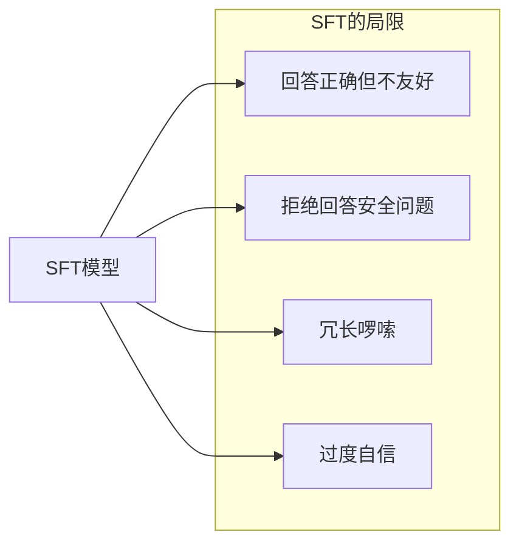

**RL 的目标**：让模型输出更符合人类偏好

- 🎯 更有帮助 (Helpful)
- 🛡️ 更安全 (Harmless)
- 📝 更诚实 (Honest)

## 2. RL 策略发展历程

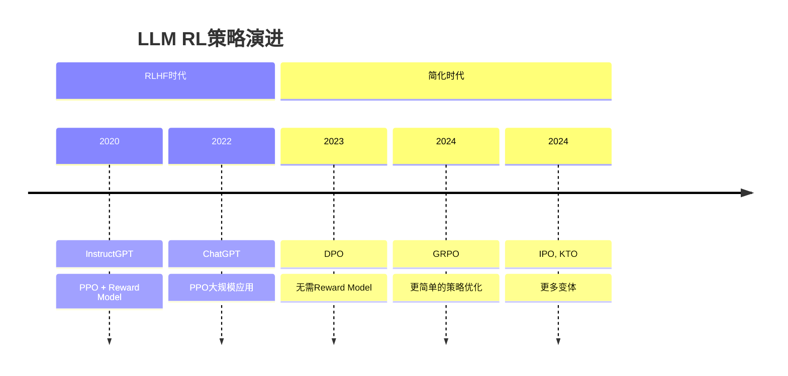

## 3. PPO (Proximal Policy Optimization)

PPO 是最经典的 RLHF 算法，被 OpenAI 用于训练 ChatGPT。

### 3.1 PPO 训练流程

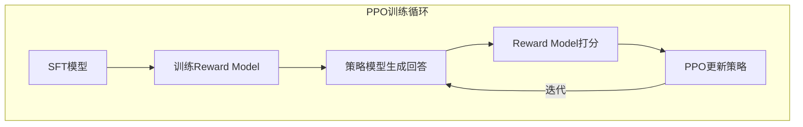

**四个模型**：
1. **Policy Model (Actor)**：当前要训练的模型
2. **Reference Model**：冻结的 SFT 模型，防止偏离太远
3. **Reward Model**：评估回答质量
4. **Value Model (Critic)**：估计状态价值

### 3.2 PPO 目标函数

PPO 的核心是**限制策略更新幅度**，防止训练不稳定：

```python
# PPO 目标函数
L_PPO = E[min(r(θ) * A, clip(r(θ), 1-ε, 1+ε) * A)]

其中:
- r(θ) = π_θ(a|s) / π_θ_old(a|s)  # 新旧策略概率比
- A = Advantage  # 优势函数
- ε = 0.2  # 裁剪范围
```

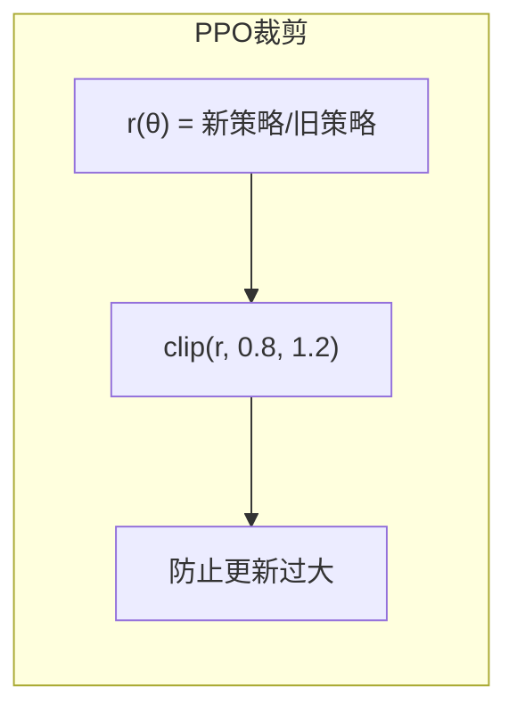

### 3.3 PPO 代码示例

```python
import torch
from trl import PPOTrainer, PPOConfig

# PPO 配置
config = PPOConfig(
    learning_rate=1e-5,
    batch_size=128,
    mini_batch_size=32,
    ppo_epochs=4,
    kl_penalty="kl",
    target_kl=0.1,
)

# 初始化 PPO Trainer
ppo_trainer = PPOTrainer(
    config=config,
    model=policy_model,
    ref_model=ref_model,
    tokenizer=tokenizer,
    reward_model=reward_model,
)

# 训练循环
for batch in dataloader:
    # 1. 生成回答
    queries = batch["query"]
    responses = ppo_trainer.generate(queries)
    
    # 2. 计算奖励
    rewards = reward_model(queries, responses)
    
    # 3. PPO 更新
    stats = ppo_trainer.step(queries, responses, rewards)
```

### 3.4 PPO 的优缺点

| 优点 | 缺点 |
|------|------|
| ✅ 经过大规模验证 | ❌ 训练复杂（4个模型） |
| ✅ 效果稳定 | ❌ 显存需求大 |
| ✅ 细粒度控制 | ❌ 超参数敏感 |
| | ❌ 需要训练 Reward Model |

## 4. DPO (Direct Preference Optimization)

DPO 是 2023 年提出的革命性方法，**直接从偏好数据学习，无需 Reward Model**。

### 4.1 DPO 的核心思想

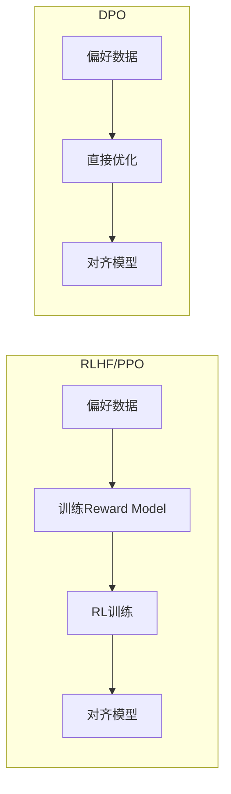

**关键洞察**：Reward Model 可以被解析地求解，直接用偏好数据训练！

### 4.2 DPO 数学推导

从 RLHF 的目标函数出发：

```
max_π E[r(x,y)] - β * KL(π || π_ref)
```

DPO 证明了最优策略可以表示为：

```
π*(y|x) = π_ref(y|x) * exp(r(x,y) / β) / Z(x)
```

由此推导出 DPO 损失函数：

```python
# DPO 损失函数
L_DPO = -E[log σ(β * (log π_θ(y_w|x) - log π_ref(y_w|x)) 
                  - β * (log π_θ(y_l|x) - log π_ref(y_l|x)))]

其中:
- y_w: 人类偏好的（winning）回答
- y_l: 人类不偏好的（losing）回答
- β: 温度参数
- σ: sigmoid 函数
```

### 4.3 DPO 数据格式

```json
{
  "prompt": "如何学习编程？",
  "chosen": "学习编程可以从以下几个方面入手：1. 选择一门语言...",
  "rejected": "编程很难学，你可能学不会。"
}
```

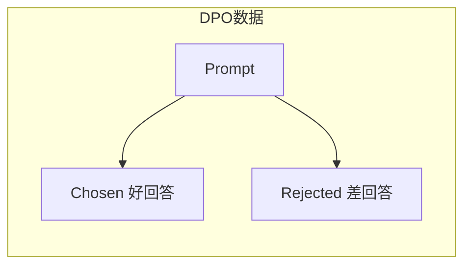

### 4.4 DPO 代码示例

```python
from transformers import AutoModelForCausalLM
from trl import DPOTrainer, DPOConfig

# 加载模型
model = AutoModelForCausalLM.from_pretrained("meta-llama/Llama-2-7b-hf")
ref_model = AutoModelForCausalLM.from_pretrained("meta-llama/Llama-2-7b-hf")

# DPO 配置
config = DPOConfig(
    beta=0.1,              # KL 惩罚系数
    learning_rate=5e-7,
    batch_size=4,
    gradient_accumulation_steps=4,
    max_length=512,
    max_prompt_length=256,
)

# 训练
dpo_trainer = DPOTrainer(
    model=model,
    ref_model=ref_model,
    config=config,
    train_dataset=preference_dataset,
    tokenizer=tokenizer,
)

dpo_trainer.train()
```

### 4.5 DPO 的优缺点

| 优点 | 缺点 |
|------|------|
| ✅ 无需 Reward Model | ❌ 需要偏好数据对 |
| ✅ 训练简单（2个模型） | ❌ 无法在线优化 |
| ✅ 显存需求小 | ❌ 对数据质量敏感 |
| ✅ 稳定易调 | ❌ 可能欠拟合复杂偏好 |

## 5. GRPO (Group Relative Policy Optimization)

GRPO 是 DeepSeek 在 2024 年提出的方法，进一步简化了 RL 训练。

### 5.1 GRPO 核心思想

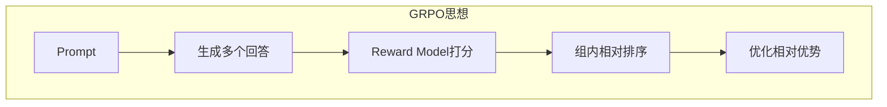

**关键创新**：
- **不需要 Critic/Value Model**
- 使用**组内相对奖励**替代绝对奖励
- 更简单的优化目标

### 5.2 GRPO vs PPO

| 特性 | PPO | GRPO |
|------|-----|------|
| **模型数量** | 4个 | 2个 |
| **Value Model** | 需要 | 不需要 |
| **奖励计算** | 绝对奖励 | 组内相对奖励 |
| **训练复杂度** | 高 | 低 |
| **显存需求** | 大 | 小 |

### 5.3 GRPO 算法流程

```python
# GRPO 伪代码
for prompt in prompts:
    # 1. 生成一组回答
    responses = [model.generate(prompt) for _ in range(G)]
    
    # 2. 计算奖励
    rewards = [reward_model(prompt, r) for r in responses]
    
    # 3. 计算组内相对优势
    mean_reward = mean(rewards)
    advantages = [r - mean_reward for r in rewards]
    
    # 4. 更新策略（类似 PPO，但无需 Value Model）
    loss = -sum(log_prob(r) * adv for r, adv in zip(responses, advantages))
    loss.backward()
```

### 5.4 GRPO 的优势

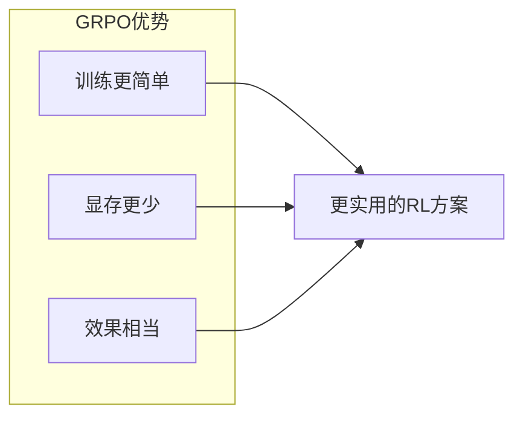

## 6. 其他 RL 变体

### 6.1 IPO (Identity Preference Optimization)

针对 DPO 可能过拟合的问题，IPO 添加了正则项：

```python
# IPO 损失（简化）
L_IPO = (log(π(y_w)/π(y_l)) - 1/(2β))^2
```

### 6.2 KTO (Kahneman-Tversky Optimization)

不需要配对数据，只需要单独的好/坏标注：

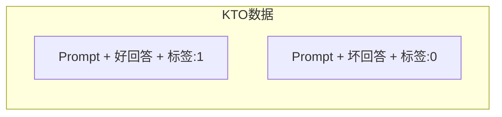

### 6.3 ORPO (Odds Ratio Preference Optimization)

将 SFT 和偏好优化合并为一步：

```
L_ORPO = L_SFT + λ * L_OR
```

## 7. 方法对比

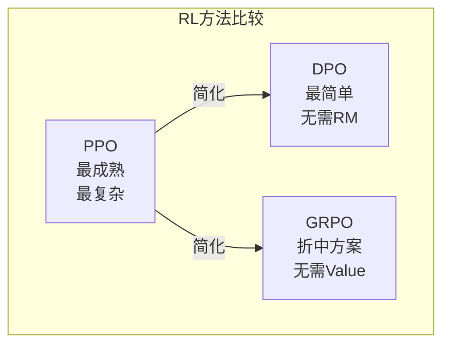

| 方法 | Reward Model | Value Model | 偏好数据 | 训练复杂度 | 效果 |
|------|-------------|-------------|----------|-----------|------|
| **PPO** | 需要 | 需要 | 不直接需要 | 高 | 最好 |
| **DPO** | 不需要 | 不需要 | 需要配对 | 低 | 很好 |
| **GRPO** | 需要 | 不需要 | 不直接需要 | 中 | 很好 |
| **KTO** | 不需要 | 不需要 | 单独标注 | 低 | 好 |
| **ORPO** | 不需要 | 不需要 | 需要配对 | 低 | 好 |

## 8. 如何选择？

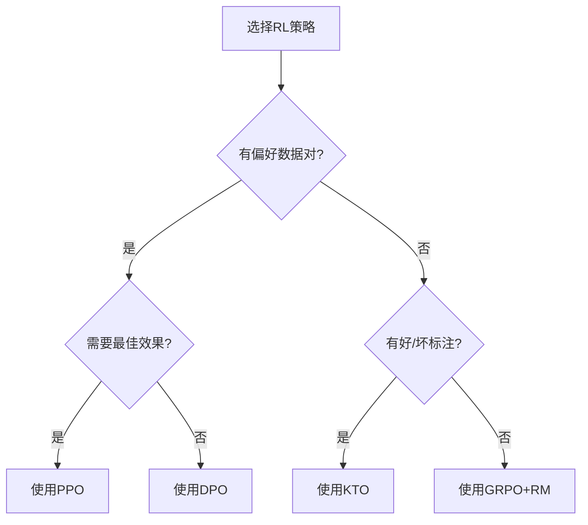

**推荐选择**：

| 场景 | 推荐方法 | 原因 |
|------|----------|------|
| **资源充足，追求最佳** | PPO | 效果最好，经过验证 |
| **有偏好数据，快速迭代** | DPO | 简单高效 |
| **资源有限，需要 RM** | GRPO | 比 PPO 简单 |
| **只有好/坏标注** | KTO | 数据要求最低 |

## 9. 实战建议

### 9.1 数据准备

```python
# 偏好数据格式
preference_data = {
    "prompt": "解释什么是机器学习",
    "chosen": "机器学习是人工智能的一个分支，它使计算机能够从数据中学习...",
    "rejected": "机器学习就是让机器学习。"
}

# 好的偏好数据特征
# 1. chosen 和 rejected 差异明显
# 2. 覆盖多种场景
# 3. 标注一致性高
```

### 9.2 超参数调优

```python
# DPO 常用超参数
dpo_params = {
    "beta": 0.1,          # 0.05-0.5，越大越保守
    "learning_rate": 5e-7, # 比 SFT 小 10-100 倍
    "epochs": 1-3,         # 不宜过多，防止过拟合
}

# PPO 常用超参数
ppo_params = {
    "kl_coeff": 0.1,      # KL 惩罚系数
    "clip_range": 0.2,    # PPO 裁剪范围
    "learning_rate": 1e-5,
}
```

## 10. 本章小结

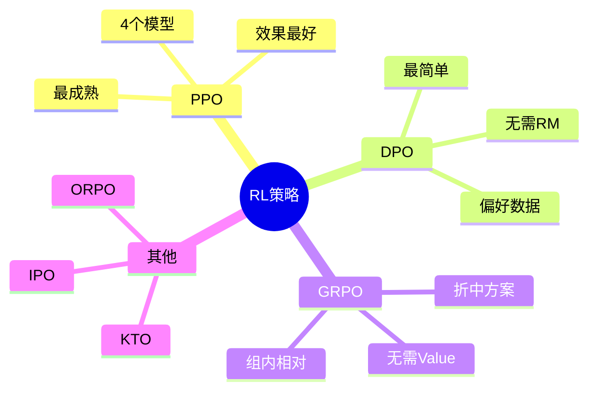

**核心要点**：
- ✅ PPO 是最成熟的方案，但复杂度高
- ✅ DPO 无需 Reward Model，大幅简化训练
- ✅ GRPO 在 PPO 和 DPO 之间取得平衡
- ✅ 选择方法时考虑数据、资源和效果需求

## 延伸阅读

- 📄 [Proximal Policy Optimization Algorithms (PPO)](https://arxiv.org/abs/1707.06347)
- 📄 [Direct Preference Optimization (DPO)](https://arxiv.org/abs/2305.18290)
- 📄 [DeepSeekMath: GRPO](https://arxiv.org/abs/2402.03300)
- 📄 [KTO: Model Alignment as Prospect Theoretic Optimization](https://arxiv.org/abs/2402.01306)

---

*下一篇：[RLHF：对齐人类偏好](./12-rlhf.md)*
