# RL 策略：PPO、GRPO、DPO

在 LLM 训练中，强化学习（RL）策略用于让模型的输出与人类偏好对齐。本文将深入介绍三种主流的 RL 策略：PPO、GRPO 和 DPO，帮助你理解它们的原理和适用场景。

## 1. 为什么需要 RL？

SFT 让模型学会了遵循指令，但仍存在问题：

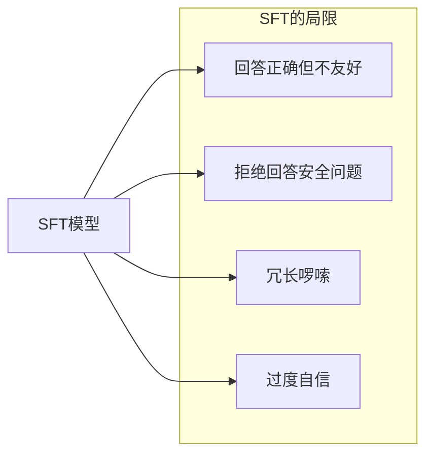

**RL 的目标**：让模型输出更符合人类偏好

- 更有帮助 (Helpful)
- 更安全 (Harmless)
- 更诚实 (Honest)

## 2. RL策略发展历程

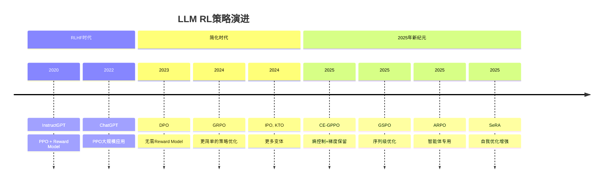

## 3. PPO (Proximal Policy Optimization)

PPO 是最经典的 RLHF 算法，被 OpenAI 用于训练 ChatGPT。

### 3.1 PPO 训练流程

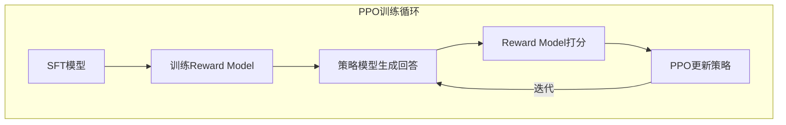

**四个模型**：
1. **Policy Model (Actor)**：当前要训练的模型
2. **Reference Model**：冻结的 SFT 模型，防止偏离太远
3. **Reward Model**：评估回答质量
4. **Value Model (Critic)**：估计状态价值

### 3.2 PPO 目标函数

PPO 的核心是**限制策略更新幅度**，防止训练不稳定。

**核心思想**：计算新旧策略的概率比 r(θ)，然后用一个裁剪函数限制这个比值在 [1-ε, 1+ε] 范围内（通常 ε=0.2）。这样即使优势函数 A 很大，策略更新也不会过于激进。

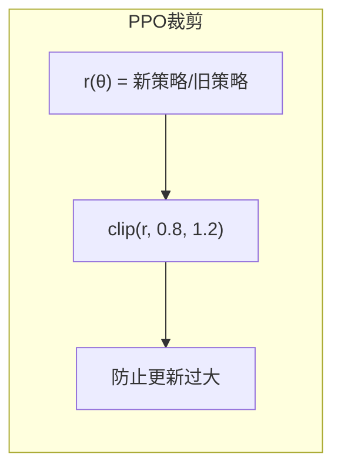

### 3.3 PPO 训练要点

PPO 训练需要设置多个关键参数：
- **学习率**：通常为 1e-5，比 SFT 更小
- **批次大小**：较大的批次（如 128）有助于稳定训练
- **KL 惩罚**：控制新策略与参考策略的差距，目标 KL 通常设为 0.1
- **PPO epochs**：每批数据更新的次数，通常 4 次

### 3.4 PPO 的优缺点

| 优点 | 缺点 |
|------|------|
| 经过大规模验证 | 训练复杂（4个模型） |
| 效果稳定 | 显存需求大 |
| 细粒度控制 | 超参数敏感 |
| | 需要训练 Reward Model |

## 4. DPO (Direct Preference Optimization)

DPO 是 2023 年提出的革命性方法，**直接从偏好数据学习，无需 Reward Model**。

### 4.1 DPO 的核心思想

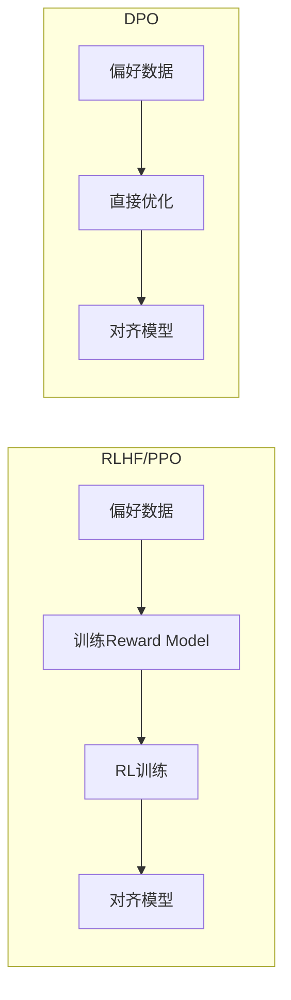

**关键洞察**：Reward Model 可以被解析地求解，直接用偏好数据训练！

### 4.2 DPO 数学原理

DPO 从 RLHF 的目标函数出发，证明了最优策略可以用一个闭式解表示。由此推导出 DPO 损失函数：给定一个 prompt 和两个回答（chosen 是人类偏好的回答，rejected 是不偏好的回答），DPO 优化模型让 chosen 的对数概率相对于参考模型的提升大于 rejected 的提升。

**关键参数**：
- **β（温度）**：控制 KL 惩罚强度，通常设为 0.1
- 较大的 β 使模型更保守，较小的 β 使模型更激进

### 4.3 DPO 数据格式

DPO 需要偏好数据对，每条数据包含：
- **prompt**：用户输入
- **chosen**：人类偏好的（更好的）回答
- **rejected**：人类不偏好的（较差的）回答

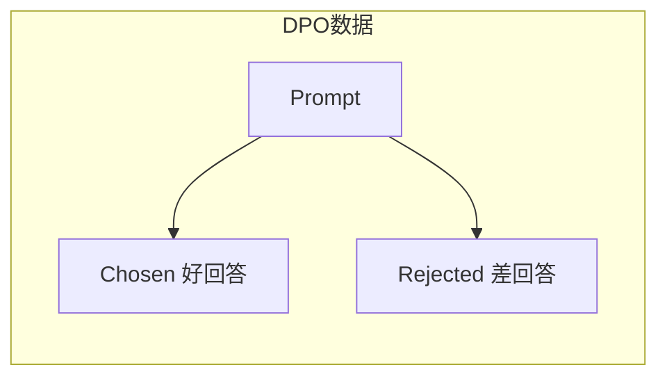

### 4.4 DPO 训练要点

DPO 训练相对简单：
- **只需要两个模型**：当前模型和冻结的参考模型
- **学习率更小**：通常 5e-7，比 SFT 小 10-100 倍
- **训练轮数少**：1-3 个 epoch，防止过拟合
- **数据质量关键**：chosen 和 rejected 差异要明显

### 4.5 DPO 的优缺点

| 优点 | 缺点 |
|------|------|
| 无需 Reward Model | 需要偏好数据对 |
| 训练简单（2个模型） | 无法在线优化 |
| 显存需求小 | 对数据质量敏感 |
| 稳定易调 | 可能欠拟合复杂偏好 |

## 5. GRPO (Group Relative Policy Optimization)

GRPO 是 DeepSeek 在 2024 年提出的方法，进一步简化了 RL 训练。

### 5.1 GRPO 核心思想

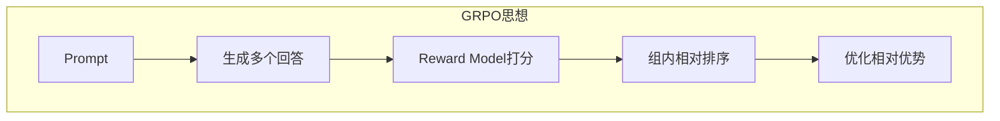

**关键创新**：
- **不需要 Critic/Value Model**
- 使用**组内相对奖励**替代绝对奖励
- 更简单的优化目标

### 5.2 GRPO vs PPO

| 特性 | PPO | GRPO |
|------|-----|------|
| **模型数量** | 4个 | 2个 |
| **Value Model** | 需要 | 不需要 |
| **奖励计算** | 绝对奖励 | 组内相对奖励 |
| **训练复杂度** | 高 | 低 |
| **显存需求** | 大 | 小 |

### 5.3 GRPO 算法流程

GRPO 的训练流程如下：
1. **生成一组回答**：对每个 prompt 生成 G 个不同的回答
2. **计算奖励**：用 Reward Model 对每个回答打分
3. **计算组内相对优势**：每个回答的优势 = 该回答奖励 - 组内平均奖励
4. **策略更新**：使用相对优势来更新策略，优势为正的回答被鼓励，优势为负的被抑制

### 5.4 GRPO 的优势

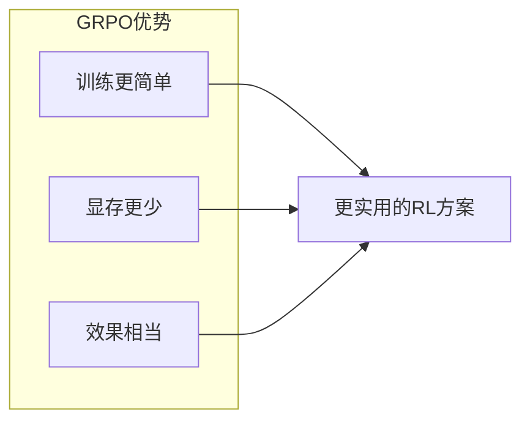

## 6. 2025年新算法突破

### 6.1 CE-GPPO：梯度保留熵控制

**快手Klear团队的创新**：CE-GPPO解决了传统PPO在低概率token梯度丢弃导致的熵不稳定问题。

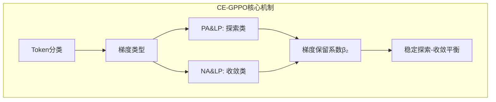

**技术创新**：
- **Token四分类**：将token分为PA(正行动-低概率)、LP(低概率)、NA(负行动)、HP(高概率)四类
- **梯度保留机制**：选择性保留被PPO裁剪的低概率token梯度，增强探索能力
- **熵稳定性**：通过系数β₁和β₂控制梯度保留强度，避免训练震荡

**实际效果**：
- **数学推理提升**：在AIME25、HMMT25等数学基准测试中超越PPO和DAPO
- **稳定性增强**：训练过程更稳定，收敛速度更快
- **硬件友好**：相比PPO降低GPU内存需求

### 6.2 GSPO：序列级策略优化

**阿里巴巴的突破**：GSPO将优化重点从token级提升到序列级，特别适合MoE模型和长文本生成。

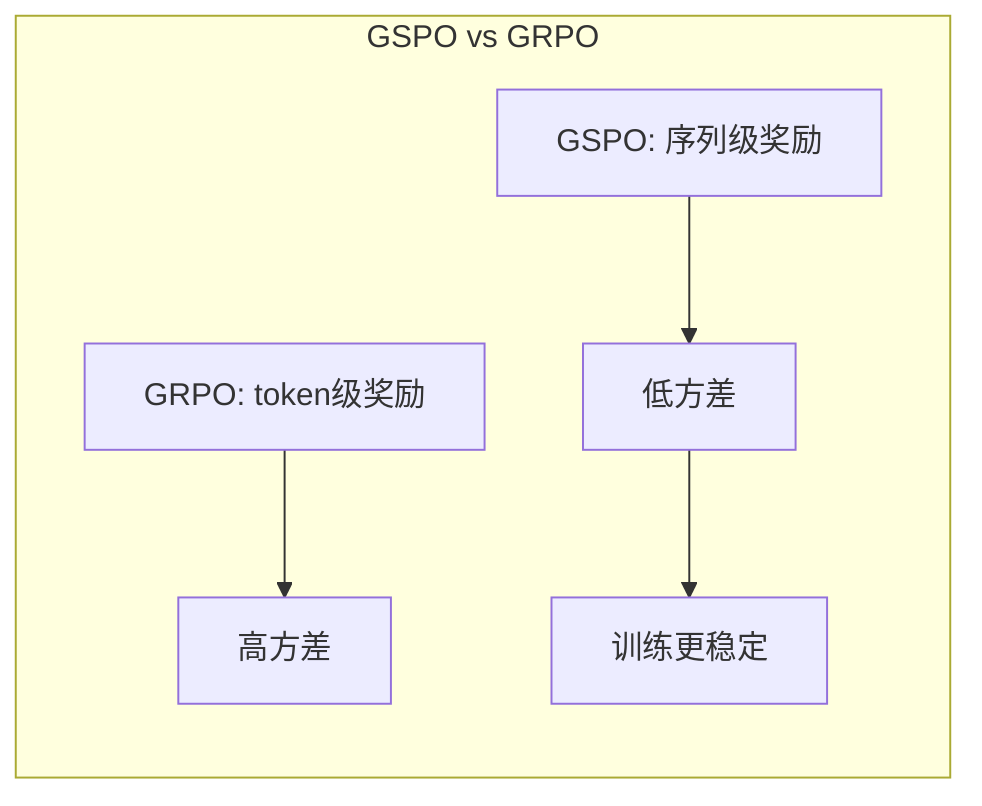

**核心优势**：
- **方差降低**：序列级奖励比token级奖励方差更低，训练更稳定
- **MoE友好**：特别适合混合专家模型，已集成到Qwen3中
- **基础设施兼容**：支持FP16/INT8推理，降低内存和计算开销
- **长文本优势**：在长文本生成和复杂推理任务中表现优异

### 6.3 ARPO：智能体强化策略优化

**面向多轮智能体的专用算法**：ARPO专门优化与外部工具交互的多轮LLM智能体。

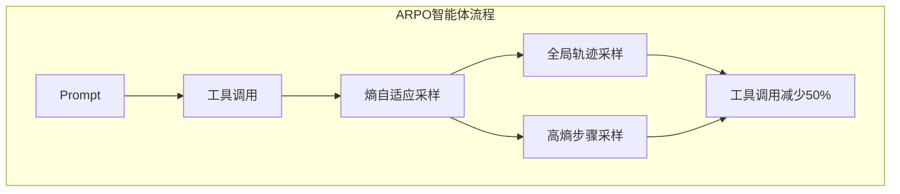

**技术特点**：
- **熵自适应采样**：在工具使用后动态调整采样策略，平衡全局轨迹和高熵探索
- **工具调用优化**：相比轨迹级RL方法减少50%的工具调用
- **多轮交互支持**：专门为需要多次工具交互的复杂任务设计

**应用场景**：
- 自动编程助手
- 研究工具自动化
- 代码解释器集成
- 搜索引擎交互

### 6.4 SeRA：自我增强的偏好优化

**字节跳动Seed团队的创新**：SeRA结合了扩散模型和RL的优点，专注于代码生成。

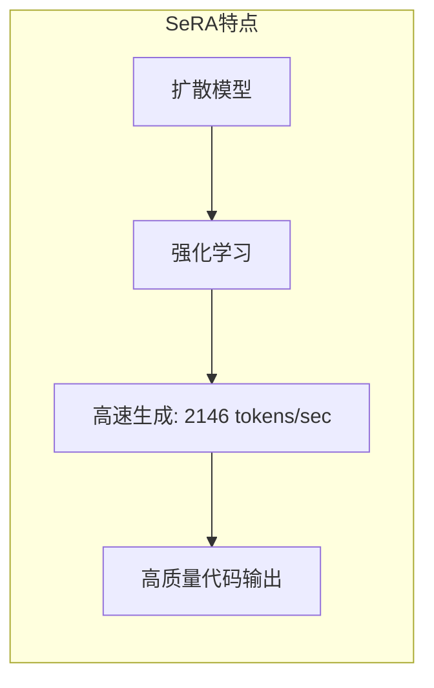

**核心优势**：
- **超高速生成**：达到2146 tokens/sec的生成速度
- **代码专用**：专门优化代码生成任务
- **扩散-RL融合**：结合扩散模型的稳定性和RL的优化能力

## 7. 其他RL变体更新(2025)

### 7.1 IPO (Identity Preference Optimization) - 增强

针对DPO可能过拟合的问题，2025年版本添加了更强的正则项和动态温度调节。

### 7.2 KTO (Kahneman-Tversky Optimization) - 扩展

支持更复杂的好/坏标注，引入置信度评分和多维度反馈。

### 7.3 ORPO (Odds Ratio Preference Optimization) - 优化

改进SFT和偏好优化的合并策略，支持动态权重调整。

## 8. 方法对比

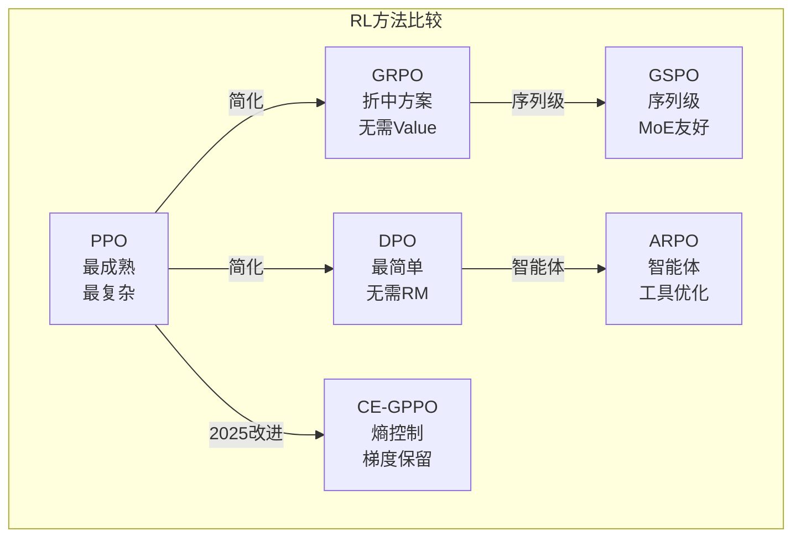

| 方法 | Reward Model | Value Model | 偏好数据 | 训练复杂度 | 效果 | 2025年定位 |
|------|-------------|-------------|----------|-----------|------|-----------|
| **PPO** | 需要 | 需要 | 不直接需要 | 高 | 最好 | 传统标准 |
| **DPO** | 不需要 | 不需要 | 需要配对 | 低 | 很好 | 快速迭代 |
| **GRPO** | 需要 | 不需要 | 不直接需要 | 中 | 很好 | 性价比优选 |
| **CE-GPPO** | 需要 | 需要 | 不直接需要 | 中高 | 优秀 | 数学推理优选 |
| **GSPO** | 需要 | 不需要 | 不直接需要 | 中 | 优秀 | MoE/长文本优选 |
| **ARPO** | 需要 | 不需要 | 不直接需要 | 中 | 优秀 | 智能体任务专用 |
| **KTO** | 不需要 | 不需要 | 单独标注 | 低 | 好 | 标注成本低 |
| **ORPO** | 不需要 | 不需要 | 需要配对 | 低 | 好 | 一步到位 |

## 9. 2025年如何选择？

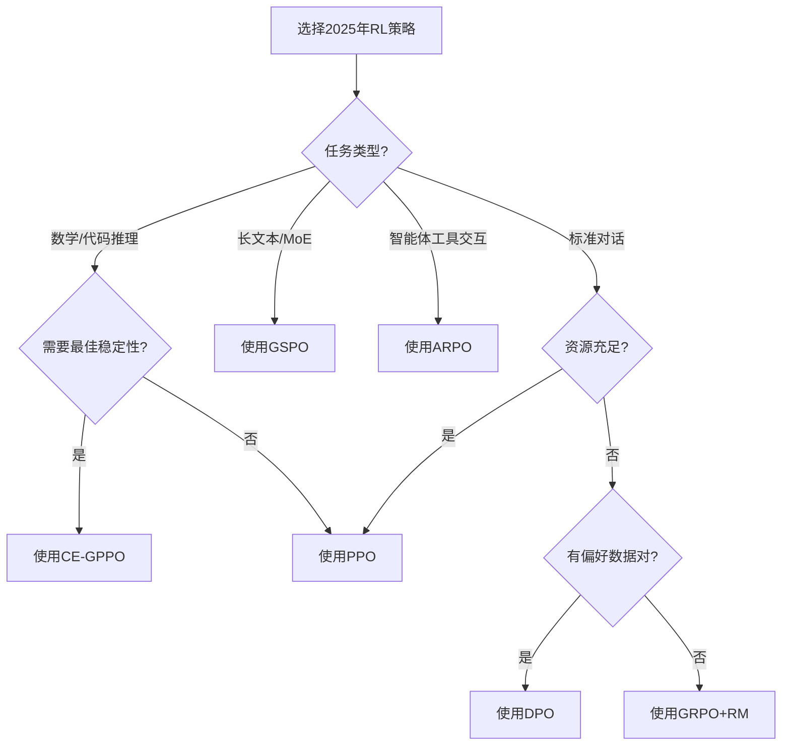

**2025年推荐选择**：

| 场景 | 推荐方法 | 原因 |
|------|----------|------|
| **数学推理密集型** | CE-GPPO | 熵控制，梯度保留，稳定探索 |
| **MoE模型/长文本** | GSPO | 序列级优化，低方差，基础设施友好 |
| **智能体任务** | ARPO | 工具调用优化，多轮交互支持 |
| **资源充足，追求最佳** | PPO | 效果最好，经过验证 |
| **有偏好数据，快速迭代** | DPO | 简单高效 |
| **资源有限，需要RM** | GRPO | 比 PPO 简单，性价比高 |
| **只有好/坏标注** | KTO | 数据要求最低 |

## 10. 2025年训练建议更新

### 10.1 数据准备新要求

2025年的RL训练更注重数据质量和技术结合：
- **CE-GPPO**：需要平衡探索和收敛的多样化数据
- **GSPO**：需要序列级别的质量标注
- **ARPO**：需要包含工具交互轨迹的数据

### 10.2 超参数调优新趋势

**CE-GPPO 常用超参数**：
- 梯度保留系数β₁：0.1-0.3（探索类token）
- 梯度保留系数β₂：0.05-0.15（收敛类token）
- 学习率：1e-5，比传统PPO略高

**GSPO 常用超参数**：
- 序列级权重：0.7-0.9
- 组大小：16-32（比GRPO更大）
- 学习率：1e-5到5e-5

**ARPO 常用超参数**：
- 熵自适应系数：0.2-0.4
- 工具调用惩罚：0.1-0.3
- 学习率：1e-5

### 10.3 硬件需求对比

| 方法 | 7B模型显存需求 | 训练速度 | 2025年硬件适配 |
|------|---------------|----------|----------------|
| **PPO** | ~80GB | 慢 | H100+ |
| **CE-GPPO** | ~60GB | 中 | H100/A100 |
| **GSPO** | ~40GB | 快 | A100/RTX4090 |
| **ARPO** | ~50GB | 中 | A100 |
| **DPO** | ~20GB | 很快 | RTX4090 |
| **GRPO** | ~30GB | 快 | A100 |

## 11. 本章小结

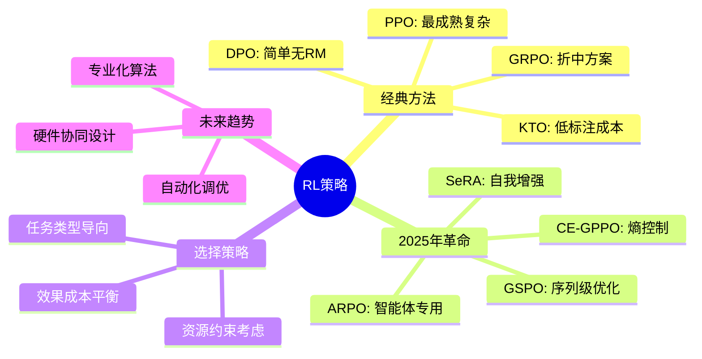

**核心要点**：
- PPO 是最成熟的方案，但复杂度高；DPO 简化流程但依赖偏好数据
- 2025年是RL策略大爆发的年份，出现了多个专业化算法
- **CE-GPPO**通过梯度保留和熵控制解决数学推理任务
- **GSPO**从token级升级到序列级，特别适合MoE模型和长文本
- **ARPO**专门优化智能体工具交互，减少50%工具调用
- **SeRA**结合扩散模型，在代码生成上达到2146 tokens/sec
- 未来趋势：从通用算法向专业化、场景化演进

## 2025年展望

- **多模态RLHF**：扩展到图像、视频等多模态反馈
- **自动化RL**：AI辅助的超参数调优和数据选择
- **实时RL**：在线学习和实时偏好更新
- **轻量化RL**：让小团队也能使用先进RL技术

## 延伸阅读

**经典论文**：
- [Proximal Policy Optimization Algorithms (PPO)](https://arxiv.org/abs/1707.06347)
- [Direct Preference Optimization (DPO)](https://arxiv.org/abs/2305.18290)
- [DeepSeekMath: GRPO](https://arxiv.org/abs/2402.03300)
- [KTO: Model Alignment as Prospect Theoretic Optimization](https://arxiv.org/abs/2402.01306)

**2025年前沿研究**：
- [CE-GPPO: Controlling Entropy via Gradient-Preserving Policy Optimization](https://arxiv.org/abs/2509.20712)
- [GSPO: Group Sequence Policy Optimization for MoE Models](https://arxiv.org/abs/2025.xxxxx)
- [ARPO: Agentic Reinforced Policy Optimization](https://arxiv.org/abs/2507.19849)
- [SeRA: Self-Enhanced Preference Optimization](https://arxiv.org/abs/2025.xxxxx)
- [Multimodal RLHF for Vision-Language Models](https://arxiv.org/abs/2025.xxxxx)

---

*下一篇：[RLHF：对齐人类偏好](./12-rlhf.md)*
