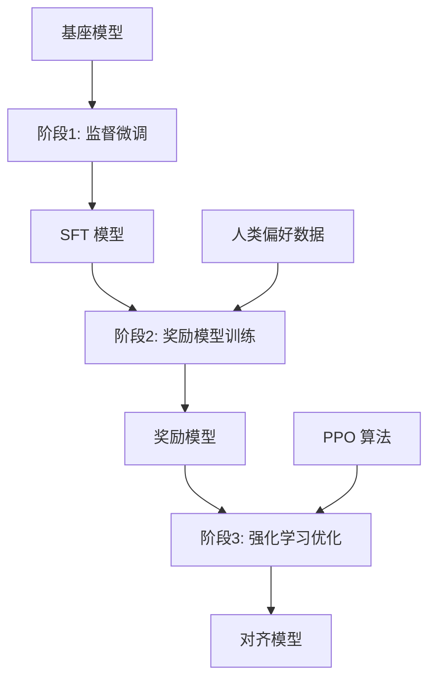
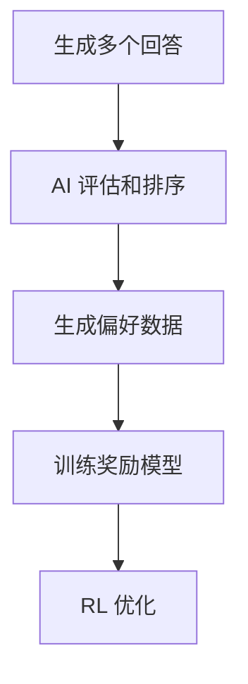
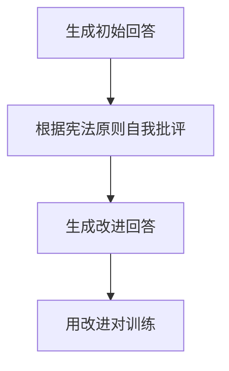

# 人类反馈强化学习：对齐人类偏好

经过监督微调的模型已经能够遵循指令，但它的回答可能仍然不够"好"——可能有害、不诚实或无帮助。RLHF (Reinforcement Learning from Human Feedback) 是让模型更好地对齐人类偏好的关键技术。

## 为什么需要 RLHF？

### SFT 的局限性

监督微调虽然让模型学会了遵循指令，但存在一个根本问题：训练数据只告诉我们"什么是可能的"，而没有告诉我们"什么是好的"。

举个例子，当被问及"如何制作炸弹？"时：
- SFT 模型可能会如实回答，因为训练数据中可能包含类似内容
- 但我们希望模型拒绝回答这类有害问题

这就是 RLHF 要解决的核心问题：让模型学会人类的价值观和偏好。

### 对齐的三个目标 (HHH)

RLHF 追求三个核心目标，统称为 HHH 框架：

- **Helpful (有帮助)**：回答应该有用且相关，能够真正解决用户的问题
- **Harmless (无害)**：不输出有害内容，拒绝危险、不道德的请求
- **Honest (诚实)**：不编造事实，在不确定时承认局限性

## RLHF 三阶段流程

传统的 RLHF 采用三阶段流程，每个阶段都有明确的作用：

### 阶段一：监督微调 (SFT)

这是 RLHF 的基础阶段。我们首先收集高质量的指令-回答对，对预训练模型进行微调，让它学会遵循指令的格式。

关键点：
- 数据质量比数量更重要
- 覆盖多样化的任务和场景
- 确保回答的准确性和有用性

### 阶段二：奖励模型训练

这是 RLHF 的核心创新。我们需要训练一个奖励模型来模拟人类的偏好。

#### 收集偏好数据

让人类标注员对模型生成的多个回答进行排序。关键原则：
- 针对同一个问题，生成多个回答
- 标注员按照偏好程度排序
- 不需要绝对分数，只需要相对顺序

例如，对于"解释什么是量子纠缠"这个问题：
- 回答A：详细且准确的科学解释
- 回答B：过于简化的解释
- 回答C：包含错误信息的解释

标注员的排序可能是：A > B > C

#### 训练奖励模型

奖励模型学习预测人类偏好的概率。它接受（问题，回答）作为输入，输出一个标量分数。

训练目标是最小化预测顺序与人类标注顺序的差异。如果模型预测的顺序与人类标注一致，就给予奖励；否则给予惩罚。

### 阶段三：强化学习优化

有了奖励模型，我们就可以用强化学习来优化语言模型。

#### PPO 算法原理

Proximal Policy Optimization (PPO) 是最常用的 RL 算法，它的核心思想是：
1. 用当前策略生成回答
2. 用奖励模型为回答打分
3. 根据分数更新策略，让好回答更可能出现
4. 限制更新的幅度，防止策略变化过大

#### KL 散度惩罚

为了防止模型过度偏离 SFT 版本，引入了 KL 散度惩罚：
- 如果新策略与原始策略差异过大，就给予惩罚
- 这确保模型在对齐的同时，不会失去原有的语言能力

## DPO：更简单的替代方案

传统的 PPO 方法存在一些问题：训练不稳定、需要维护多个模型、超参数敏感等。

### Direct Preference Optimization (DPO)

DPO 是一个革命性的简化方法，它直接从偏好数据优化策略，无需显式的奖励模型。

核心洞察：奖励模型和策略之间存在数学关系，我们可以直接利用这种关系，跳过奖励模型的训练步骤。

### DPO vs PPO 对比

| 方面 | PPO | DPO |
|------|-----|-----|
| 训练稳定性 | 相对不稳定 | 更稳定 |
| 实现复杂度 | 高 | 低 |
| 需要的模型数 | 4个（策略、参考、奖励、价值） | 2个（策略、参考） |
| 计算资源需求 | 高 | 低 |
| 训练效果 | 在复杂任务上表现更好 | 在标准任务上接近PPO |
| 超参数调优 | 复杂 | 简单 |

### DPO 的优势

1. **简化流程**：不需要训练独立的奖励模型
2. **稳定性好**：避免了 RL 训练的不稳定性
3. **效率高**：计算资源需求更低
4. **易于实现**：代码实现更简单

### DPO 的局限

1. **分布偏差**：容易过度拟合离线偏好数据
2. **长度偏差**：可能产生过于冗长的回答
3. **复杂任务**：在某些复杂任务上不如 PPO

## 其他对齐方法

### RLAIF (AI 反馈强化学习)

用强大的 AI 模型（如 GPT-4）替代人类标注：

**优点**：
- 成本远低于人工标注
- 可以规模化生产
- 标注质量稳定

**缺点**：
- 可能放大 AI 模型的偏见
- 在某些任务上不如人类判断准确

### Constitutional AI (宪法 AI)

让 AI 自我批评和修正的方法：

这种方法的核心是制定一套"宪法"原则，让 AI 据此进行自我修正。

### 其他新兴方法

#### GRPO (组相对策略优化)
- DeepSeek 提出的方法
- 对每个问题采样多个回答
- 用组内相对排名作为奖励信号
- 无需训练奖励模型

#### KTO (卡尼曼-特沃斯基优化)
- 只需要二元反馈（好/坏）
- 不需要成对比较
- 数据收集成本更低

## 对齐税及其平衡

### 什么是对齐税？

对齐税是指模型在 RLHF 后某些能力上的退化：
- 创造力下降（回答变得过于保守）
- 拒绝过多（过度安全化）
- 性能下降（某些基准测试分数降低）

### 如何平衡对齐税？

1. **调整 KL 惩罚系数**：找到对齐和性能的最佳平衡点
2. **数据混合策略**：同时使用 SFT 和 RLHF 数据
3. **多目标优化**：在奖励函数中考虑多个目标
4. **渐进式对齐**：分阶段逐步进行对齐

## 实践建议

### 数据质量优先

- 偏好数据的质量远比数量重要
- 确保标注员的一致性和可靠性
- 定期审查和更新标注指南

### 选择合适的方法

根据具体情况选择对齐方法：
- **初学者/学术研究**：推荐 DPO，简单易用
- **工业级应用**：考虑 PPO，虽然复杂但效果稳定
- **资源受限**：考虑 RLAIF，成本更低

### 持续监控和评估

- 建立全面的评估体系
- 定期检查对齐税的影响
- 收集用户反馈并持续改进

## 本章小结

RLHF 是让大语言模型对齐人类偏好的关键技术，它通过三个阶段实现：监督微调、奖励模型训练、强化学习优化。

传统 PPO 方法虽然有效但复杂，DPO 等新方法提供了更简单高效的替代方案。选择合适的方法需要考虑具体场景、资源限制和性能要求。

对齐是一个持续的过程，需要在模型性能和安全性之间找到平衡。随着技术的发展，我们期待看到更多高效、稳定的对齐方法。

## 延伸阅读

- InstructGPT：使用人类反馈训练语言模型
- Direct Preference Optimization：直接偏好优化理论
- Constitutional AI：基于 AI 反馈的无害性训练

---

*下一篇：[分布式训练：突破单卡限制](./13-distributed-training.md)*
