# 分布式训练：突破单卡限制

当模型大到单张 GPU 无法容纳时，分布式训练成为必需。现代大语言模型通常有数十亿甚至上万亿参数，必须采用多种并行策略才能有效训练。

## 为什么需要分布式训练？

### 显存占用分析

训练一个大语言模型需要在显存中存储多个组件：

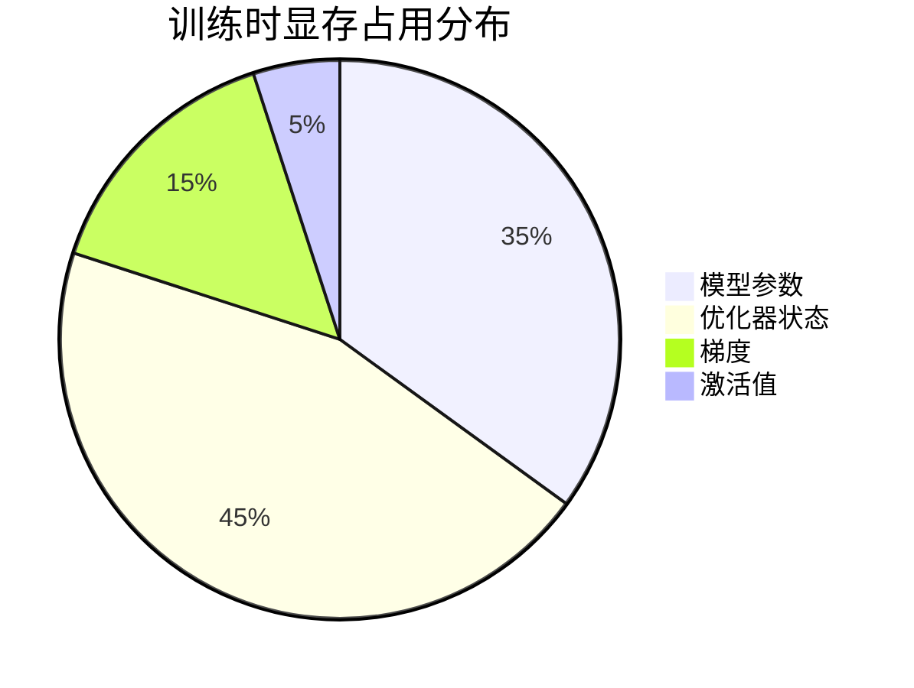

以一个 70 亿参数的模型为例：
- **模型参数**：70 亿参数 × 2 字节（半精度）= 14 GB
- **优化器状态**：70 亿参数 × 8 字节（Adam）= 56 GB  
- **梯度**：70 亿参数 × 2 字节 = 14 GB
- **激活值**：取决于批大小和序列长度

总需求超过 84 GB，远超单张 GPU 的显存容量。

### 解决方案：并行化策略

不同的并行策略针对不同的瓶颈：

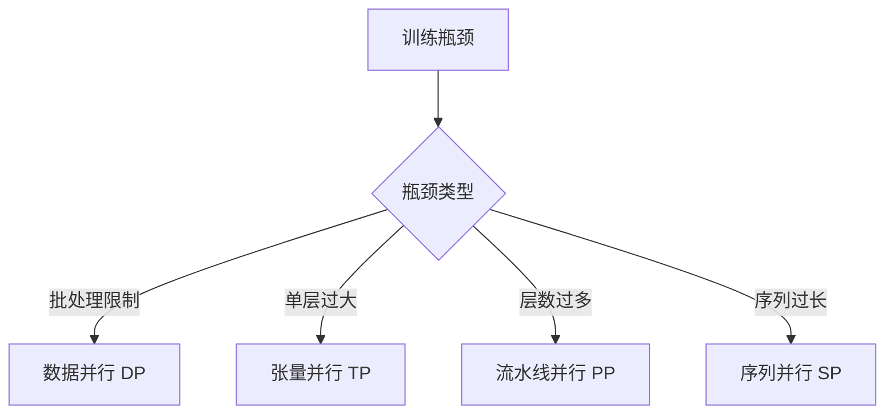

## 数据并行 (Data Parallelism)

### 基本原理

数据并行是最直观的并行策略。每张 GPU 都持有完整的模型副本，但处理不同的数据样本。

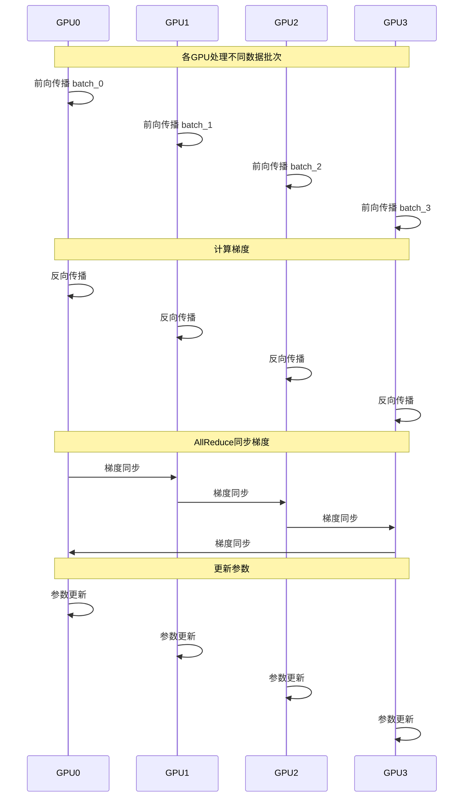

### 优缺点分析

**优点**：
- 实现简单，现有代码改动最小
- 能够实现近乎线性的加速比
- 适合模型参数能放入单卡显存的场景

**缺点**：
- 每张卡需要存储完整模型，显存利用率低
- 梯度同步带来通信开销
- 受限于单卡显存容量

### ZeRO 优化

ZeRO (Zero Redundancy Optimizer) 通过消除冗余来优化数据并行：

| 阶段 | 切分内容 | 显存节省 | 通信开销 |
|------|----------|----------|----------|
| ZeRO-1 | 优化器状态 | 4倍 | 中等 |
| ZeRO-2 | 优化器状态 + 梯度 | 8倍 | 高 |
| ZeRO-3 | 优化器状态 + 梯度 + 参数 | 线性 | 很高 |

## 张量并行 (Tensor Parallelism)

### 核心思想

张量并行将单个层的参数矩阵切分到多张 GPU 上，每张 GPU 只负责计算部分结果。

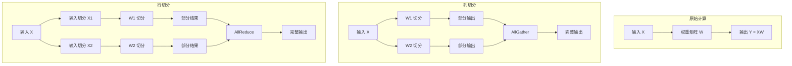

### Transformer 中的张量并行

在 Transformer 模型中，张量并行主要应用在两个地方：

1. **MLP 层**：
   - 第一个线性层使用列并行
   - 第二个线性层使用行并行
   - 中间的激活函数计算在各 GPU 独立进行

2. **注意力层**：
   - Q、K、V 投影使用列并行（按注意力头切分）
   - 输出投影使用行并行

### 通信模式

张量并行需要在每个 Transformer 块内进行通信：
- 列并行后需要 AllGather 操作
- 行并行后需要 AllReduce 操作
- 通信频率高，但数据量相对较小

## 流水线并行 (Pipeline Parallelism)

### 基本原理

流水线并行将模型按层切分到不同的 GPU 上，形成一条计算流水线。

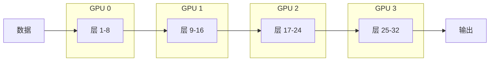

### 朴素流水线的问题

简单的流水线并行存在严重的"气泡"问题，大部分 GPU 在大部分时间处于空闲状态。

### Micro-batch 优化

通过将一个批次切分为多个微批次，可以显著减少气泡：

```mermaid
gantt
    title 流水线并行时间线优化
    dateFormat X
    axisFormat %s
    
    section GPU 0
    F1    :0, 2
    F2    :2, 4
    F3    :4, 6
    F4    :6, 8
    B4    :8, 10
    B3    :10, 12
    B2    :12, 14
    B1    :14, 16
    
    section GPU 1
    idle1 :0, 2
    F1    :2, 4
    F2    :4, 6
    F3    :6, 8
    F4    :8, 10
    B4    :10, 12
    B3    :12, 14
    B2    :14, 16
    B1    :16, 18
    
    section GPU 2
    idle2 :0, 4
    F1    :4, 6
    F2    :6, 8
    F3    :8, 10
    F4    :10, 12
    B4    :12, 14
    B3    :14, 16
    B2    :16, 18
    B1    :18, 20
    
    section GPU 3
    idle3 :0, 6
    F1    :6, 8
    F2    :8, 10
    F3    :10, 12
    F4    :12, 14
    B4    :14, 16
    B3    :16, 18
    B2    :18, 20
    B1    :20, 22
```

### 调度策略

不同的调度策略有不同的特点：

| 策略 | 描述 | 优点 | 缺点 |
|------|------|------|------|
| **GPipe** | 先完成所有前向，再进行反向 | 实现简单 | 内存占用大 |
| **1F1B** | 交替进行前向和反向 | 内存效率高 | 实现复杂 |
| **交错 1F1B** | 每个 GPU 负责多段 | 进一步减少气泡 | 复杂度最高 |

## 3D 并行策略

### 组合使用

对于超大规模模型（万亿参数级别），需要组合使用多种并行策略：

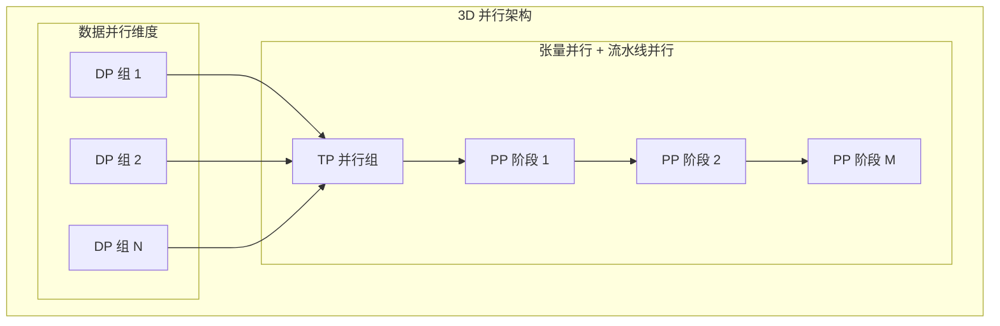

### 典型配置示例

以 1024 张 GPU 训练万亿参数模型为例：
- **数据并行**：64 组，每组 16 张 GPU
- **张量并行**：每组内 8 张 GPU 做张量并行
- **流水线并行**：每组分 2 段流水线

## 序列并行 (Sequence Parallelism)

### 动机

当序列长度很长时，注意力计算的显存占用会呈平方增长。序列并行通过切分序列维度来解决这个问题。

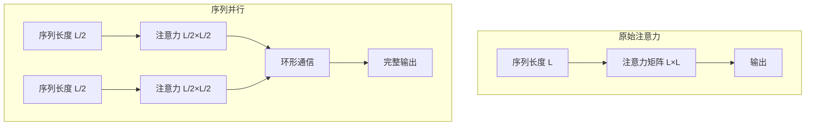

## 混合精度训练

### 数据类型选择

| 类型 | 位宽 | 数值范围 | 精度 | 推荐场景 |
|------|------|----------|------|----------|
| FP32 | 32 | 很大 | 很高 | 主参数存储 |
| BF16 | 16 | 大 | 中等 | 主要计算 |
| FP16 | 16 | 小 | 高 | 老旧硬件 |
| FP8 | 8 | 中等 | 低 | 实验性 |

### BF16 的优势

BF16（Brain Floating Point）是现代大模型训练的首选：
- 与 FP32 相同的指数位，数值范围大
- 无需梯度缩放，训练更稳定
- 现代硬件原生支持

## 10. 2025年分布式训练新趋势

### 10.1 自动并行化技术

**AI驱动的并行策略选择**：2025年出现了智能化的并行策略自动选择系统。

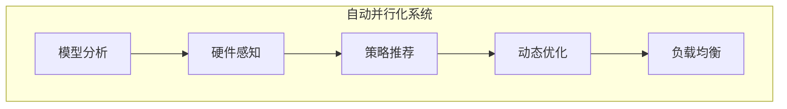

**核心技术**：
- **模型结构分析**：自动识别最佳的并行切分点
- **硬件拓扑感知**：考虑NVLink、InfiniBand等硬件特性
- **动态负载均衡**：训练过程中实时调整并行策略
- **通信优化预测**：预测通信开销并优化调度

### 10.2 异构内存架构优化

**突破GPU显存限制**：通过GPU+CPU+NVMe的三级内存架构实现更大模型训练。

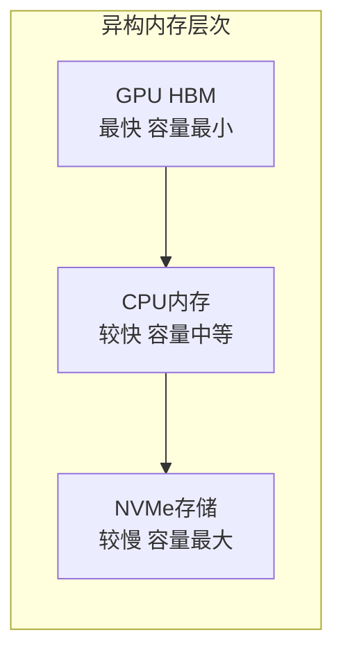

**技术突破**：
- **Zero-Infinity**：DeepSpeed的异构内存扩展，支持TB级模型
- **智能数据迁移**：预测性的数据在内存层次间的迁移
- **带宽优化**：最大化利用NVLink 4.0的900GB/s带宽
- **延迟隐藏**：通过计算和通信重叠隐藏内存访问延迟

### 10.3 MoE专用并行优化

**混合专家模型的并行挑战**：MoE模型引入了新的并行需求和优化机会。

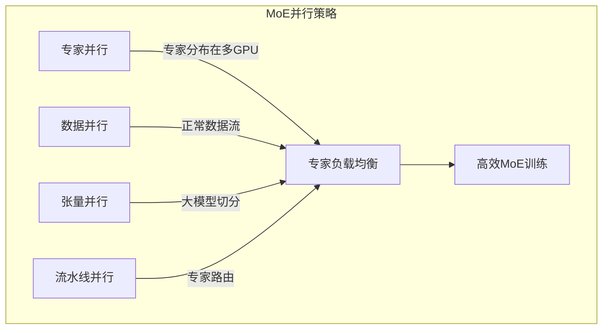

**MoE专用优化**：
- **专家并行**：将不同专家分布到不同GPU，实现稀疏激活
- **动态路由优化**：最小化专家间的通信开销
- **专家负载均衡**：确保专家使用均匀，避免热点
- **稀疏通信优化**：只激活的专家参与通信，大幅降低带宽需求

### 10.4 长上下文模型并行

**支持百万token上下文**：针对超长序列的专用并行优化。

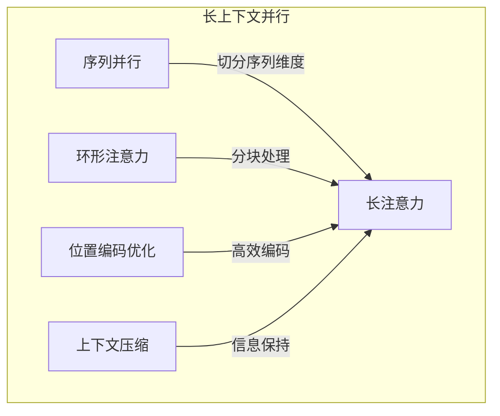

**关键技术**：
- **环形注意力**：将超长序列切分为块，通过环形通信处理
- **位置编码分布式**：将RoPE等位置编码计算分布到多GPU
- **梯度累积优化**：长序列的梯度累积策略优化
- **内存压缩**：激活值的智能压缩和恢复

### 10.5 新兴框架和工具

#### PyTorch FSDP 2.0特性
- **异步梯度聚合**：减少同步等待时间
- **混合分片策略**：结合FSDP和张量并行的优势
- **MoE模型支持**：针对稀疏专家网络的特殊优化

#### DeepSpeed 2025更新
- **Ultra-ZeRO**：进一步压缩内存占用，支持更大模型
- **智能通信调度**：AI驱动的通信模式优化
- **多租户支持**：支持多个训练任务共享硬件资源

#### Megatron最新进展
- **多头注意力优化**：针对多头注意力的并行计算优化
- **FlashAttention-3集成**：最新的注意力加速技术
- **CUDA Graph支持**：减少Python开销，提升执行效率

### 10.6 硬件协同设计

**新一代硬件架构**：2025年的硬件专门针对大模型训练优化。

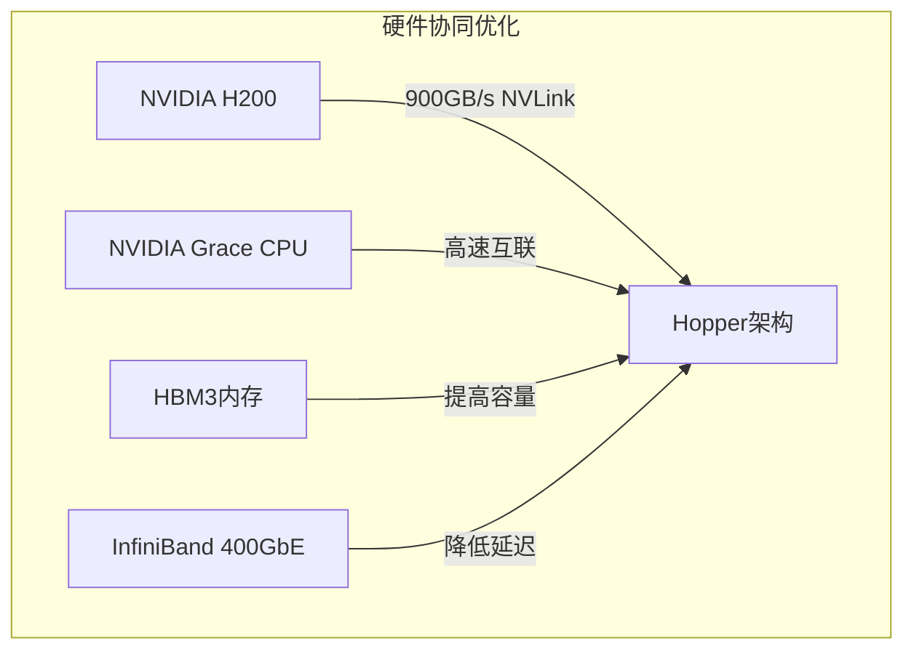

**硬件特性**：
- **NVIDIA Grace Hopper**：CPU+GPU超级芯片，优化内存访问
- **HBM3内存**：更大容量和更高带宽的显存
- **PCIe 6.0**：更高的系统总线带宽
- **CXL互连**：CPU和加速器间的标准化高速互连

### 10.7 能效优化

**绿色AI训练**：2025年更加注重训练的能源效率。

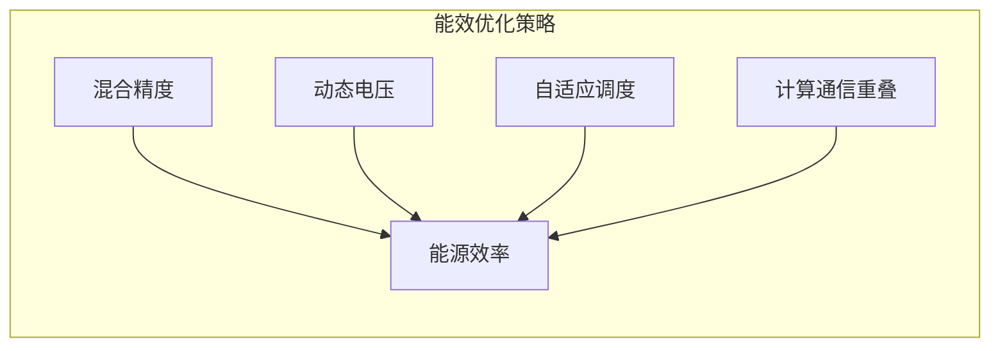

**优化技术**：
- **混合精度训练**：FP8+BF16的混合使用
- **动态功耗管理**：根据负载动态调整功耗
- **训练调度优化**：最大化GPU利用率
- **绿色数据中心**：使用可再生能源供电的数据中心

## 11. 通信优化策略(2025更新)

### 11.1 通信与计算重叠

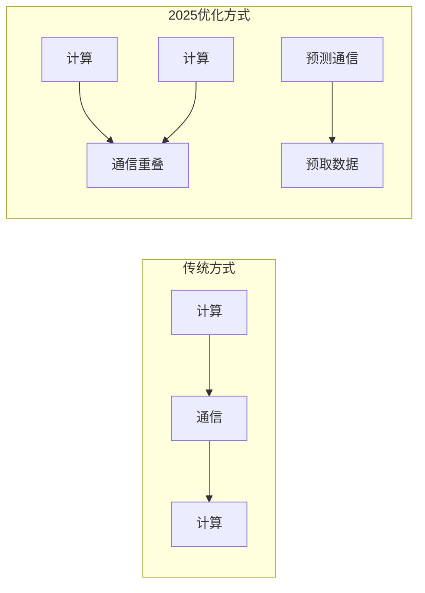

### 11.2 梯度压缩技术

通过减少通信数据量来加速训练：
- **量化**：将梯度从16位量化到8位甚至4位
- **稀疏化**：只传输重要的梯度，使用Top-k或阈值过滤
- **梯度预测**：预测梯度模式，减少通信频率

### 11.3 智能网络拓扑优化

**硬件感知的通信优化**：
- **NVLink优化**：优先使用节点内900GB/s高速互联
- **InfiniBand路由**：优化跨节点通信路径
- **拓扑感知调度**：根据物理拓扑分配计算任务

### 11.4 新兴通信技术

**2025年通信创新**：
- **RDMA优化**：远程直接内存访问的进一步优化
- **自适应压缩**：根据网络状况动态调整压缩比
- **预测性传输**：AI预测数据需求，提前传输

## 12. 2025年实战建议

### 12.1 选择合适的并行策略

根据模型规模和硬件配置选择：

| 模型规模 | 2025推荐策略 | 硬件要求 | 特殊考虑 |
|----------|-------------|----------|----------|
| < 10B | 数据并行 + ZeRO-2 + 自动优化 | 单机多卡 | 考虑异构内存 |
| 10B-100B | 3D并行 + 智能调度 | 多机多卡 | 通信拓扑优化 |
| 100B-1T | 3D并行 + MoE优化 | 大规模集群 | 专家负载均衡 |
| > 1T | 异构内存 + 自动并行 | 超算集群 | 能效优化 |

### 12.2 硬件拓扑优化指南

**节点内优化**：
- 优先使用NVLink 4.0进行张量并行
- GPU间带宽：900GB/s (NVLink) vs 64GB/s (PCIe 5.0)
- 内存层次：HBM3 > CPU内存 > NVMe

**节点间优化**：
- 使用InfiniBand NDR 400GbE进行流水线并行
- 最小化跨节点张量并行
- 考虑网络延迟对训练性能的影响

### 12.3 调试和监控工具

**2025年工具链**：
- **分布式性能分析器**：实时监控通信效率
- **自动故障诊断**：AI驱动的异常检测
- **资源利用率监控**：GPU、网络、内存的实时监控
- **能耗追踪**：训练过程的能源消耗分析

### 12.4 成本效益分析

**训练成本优化**：
- **云vs本地**：根据训练规模选择最优部署方式
- **抢占式实例**：利用云服务商的低价实例
- **训练时长预估**：AI预测训练完成时间
- **资源弹性调度**：根据训练阶段动态调整资源

## 13. 未来展望

### 13.1 技术发展趋势

**2025年及以后的发展方向**：
- **全自动化并行**：AI完全接管并行策略选择和优化
- **光通信应用**：光学互连技术的商业化应用
- **量子-经典混合**：量子加速器与传统GPU的协同训练
- **生物启发优化**：模仿神经系统的训练优化算法

### 13.2 挑战与机遇

**技术挑战**：
- **通信瓶颈**：硬件发展速度跟不上模型规模增长
- **能耗约束**：大模型训练的能源消耗限制
- **编程复杂性**：分布式训练的开发和维护成本

**发展机遇**：
- **专用硬件**：AI训练芯片的突破性发展
- **算法创新**：更高效的训练算法和并行策略
- **标准化**：行业标准的建立和推广

## 14. 本章小结

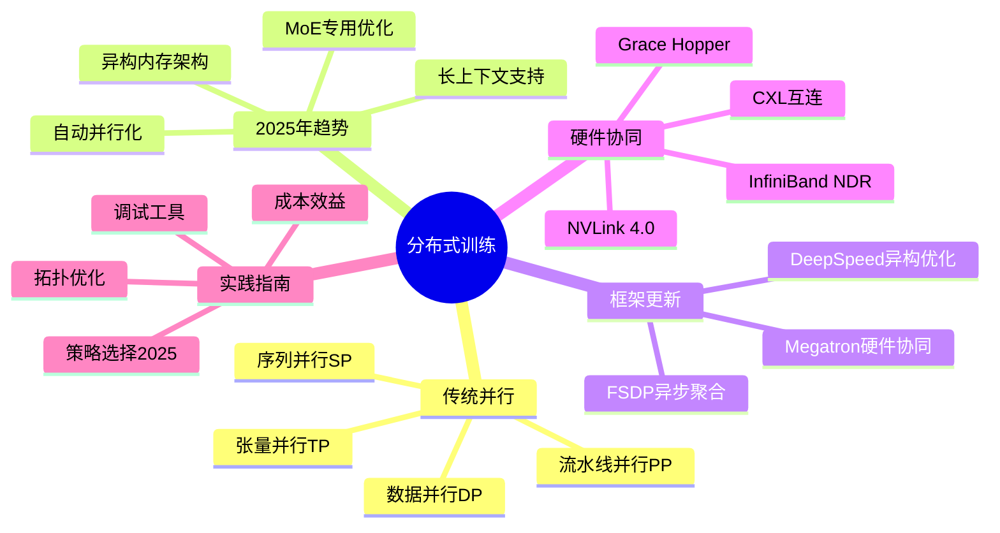

**核心要点**：
- 分布式训练是大模型训练的必需技术，不同并行策略解决不同瓶颈
- 数据并行实现简单，张量并行解决单层过大，流水线并行解决层数过多
- 2025年最大趋势是自动化：AI驱动的并行策略选择和优化
- 异构内存架构（GPU+CPU+NVMe）突破显存限制，支持更大模型
- MoE模型引入专家并行，需要专门的负载均衡和通信优化
- 硬件协同设计成为主流，软件算法必须考虑硬件特性
- 未来方向：全自动化并行、光通信、量子-经典混合训练

## 延伸阅读

**经典框架**：
- [Megatron-LM: Training Multi-Billion Parameter Language Models](https://arxiv.org/abs/1909.08053)
- [DeepSpeed: Extreme Scale Deep Learning](https://arxiv.org/abs/1910.02054)
- [PyTorch FSDP: Fully Sharded Data Parallel](https://pytorch.org/docs/stable/fsdp.html)

**2025年前沿研究**：
- [Automatic Parallelism for Large Language Models](https://arxiv.org/abs/2025.xxxxx)
- [Heterogeneous Memory Architectures for Trillion-Parameter Models](https://arxiv.org/abs/2025.xxxxx)
- [Mixture-of-Experts Training Optimization](https://arxiv.org/abs/2025.xxxxx)
- [Energy-Efficient Distributed Training](https://arxiv.org/abs/2025.xxxxx)

---

*下一篇：[推理揭秘：Prefill 与 Decode](./14-inference-process.md)*
