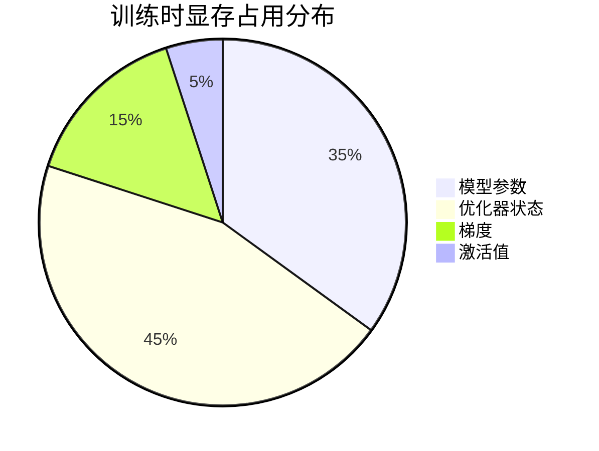
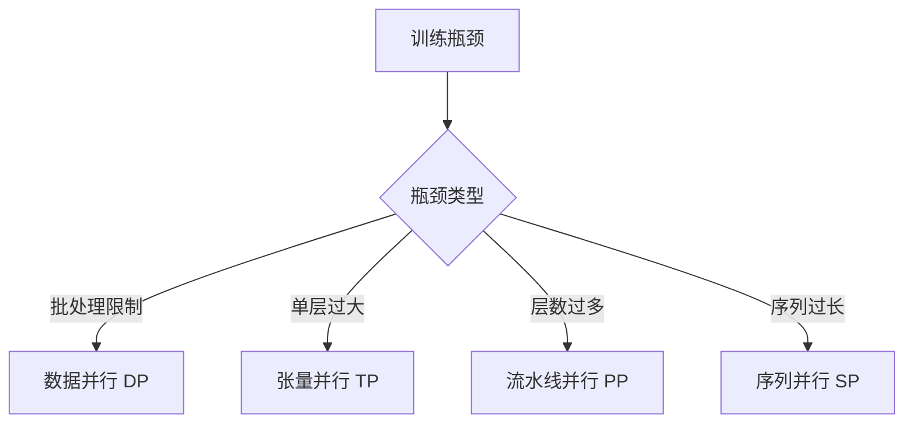
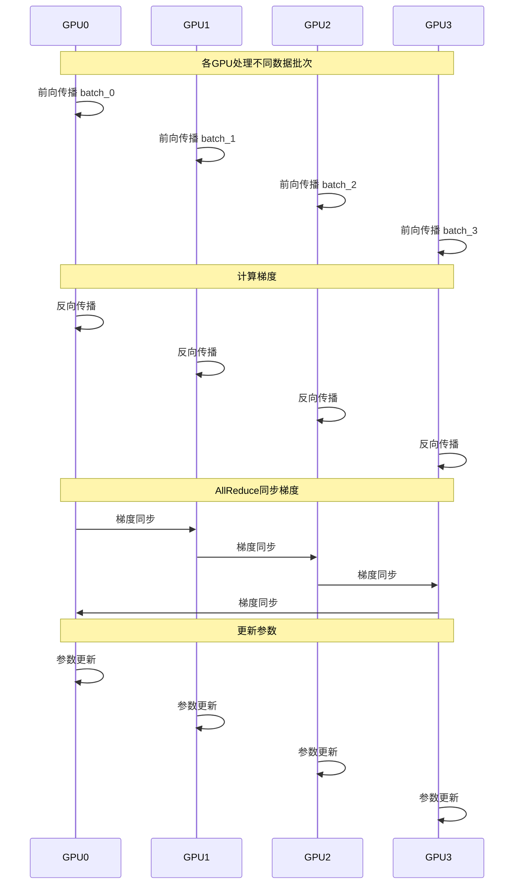
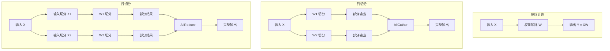
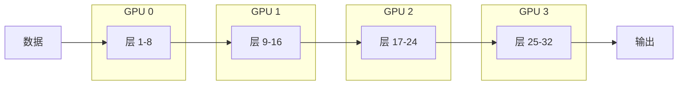
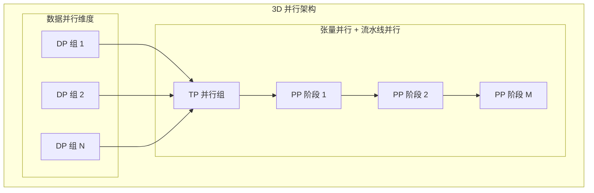
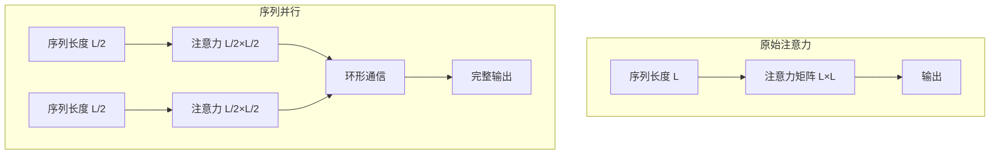
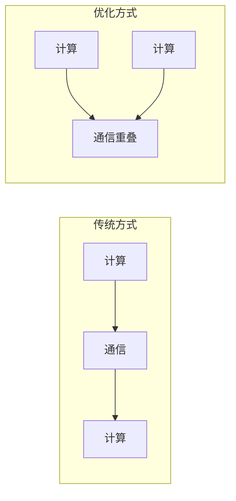

# 分布式训练：突破单卡限制

当模型大到单张 GPU 无法容纳时，分布式训练成为必需。现代大语言模型通常有数十亿甚至上万亿参数，必须采用多种并行策略才能有效训练。

## 为什么需要分布式训练？

### 显存占用分析

训练一个大语言模型需要在显存中存储多个组件：

以一个 70 亿参数的模型为例：
- **模型参数**：70 亿参数 × 2 字节（半精度）= 14 GB
- **优化器状态**：70 亿参数 × 8 字节（Adam）= 56 GB  
- **梯度**：70 亿参数 × 2 字节 = 14 GB
- **激活值**：取决于批大小和序列长度

总需求超过 84 GB，远超单张 GPU 的显存容量。

### 解决方案：并行化策略

不同的并行策略针对不同的瓶颈：

## 数据并行 (Data Parallelism)

### 基本原理

数据并行是最直观的并行策略。每张 GPU 都持有完整的模型副本，但处理不同的数据样本。

### 优缺点分析

**优点**：
- 实现简单，现有代码改动最小
- 能够实现近乎线性的加速比
- 适合模型参数能放入单卡显存的场景

**缺点**：
- 每张卡需要存储完整模型，显存利用率低
- 梯度同步带来通信开销
- 受限于单卡显存容量

### ZeRO 优化

ZeRO (Zero Redundancy Optimizer) 通过消除冗余来优化数据并行：

| 阶段 | 切分内容 | 显存节省 | 通信开销 |
|------|----------|----------|----------|
| ZeRO-1 | 优化器状态 | 4倍 | 中等 |
| ZeRO-2 | 优化器状态 + 梯度 | 8倍 | 高 |
| ZeRO-3 | 优化器状态 + 梯度 + 参数 | 线性 | 很高 |

## 张量并行 (Tensor Parallelism)

### 核心思想

张量并行将单个层的参数矩阵切分到多张 GPU 上，每张 GPU 只负责计算部分结果。

### Transformer 中的张量并行

在 Transformer 模型中，张量并行主要应用在两个地方：

1. **MLP 层**：
   - 第一个线性层使用列并行
   - 第二个线性层使用行并行
   - 中间的激活函数计算在各 GPU 独立进行

2. **注意力层**：
   - Q、K、V 投影使用列并行（按注意力头切分）
   - 输出投影使用行并行

### 通信模式

张量并行需要在每个 Transformer 块内进行通信：
- 列并行后需要 AllGather 操作
- 行并行后需要 AllReduce 操作
- 通信频率高，但数据量相对较小

## 流水线并行 (Pipeline Parallelism)

### 基本原理

流水线并行将模型按层切分到不同的 GPU 上，形成一条计算流水线。

### 朴素流水线的问题

简单的流水线并行存在严重的"气泡"问题，大部分 GPU 在大部分时间处于空闲状态。

### Micro-batch 优化

通过将一个批次切分为多个微批次，可以显著减少气泡：

```mermaid
gantt
    title 流水线并行时间线优化
    dateFormat X
    axisFormat %s
    
    section GPU 0
    F1    :0, 2
    F2    :2, 4
    F3    :4, 6
    F4    :6, 8
    B4    :8, 10
    B3    :10, 12
    B2    :12, 14
    B1    :14, 16
    
    section GPU 1
    idle1 :0, 2
    F1    :2, 4
    F2    :4, 6
    F3    :6, 8
    F4    :8, 10
    B4    :10, 12
    B3    :12, 14
    B2    :14, 16
    B1    :16, 18
    
    section GPU 2
    idle2 :0, 4
    F1    :4, 6
    F2    :6, 8
    F3    :8, 10
    F4    :10, 12
    B4    :12, 14
    B3    :14, 16
    B2    :16, 18
    B1    :18, 20
    
    section GPU 3
    idle3 :0, 6
    F1    :6, 8
    F2    :8, 10
    F3    :10, 12
    F4    :12, 14
    B4    :14, 16
    B3    :16, 18
    B2    :18, 20
    B1    :20, 22
```

### 调度策略

不同的调度策略有不同的特点：

| 策略 | 描述 | 优点 | 缺点 |
|------|------|------|------|
| **GPipe** | 先完成所有前向，再进行反向 | 实现简单 | 内存占用大 |
| **1F1B** | 交替进行前向和反向 | 内存效率高 | 实现复杂 |
| **交错 1F1B** | 每个 GPU 负责多段 | 进一步减少气泡 | 复杂度最高 |

## 3D 并行策略

### 组合使用

对于超大规模模型（万亿参数级别），需要组合使用多种并行策略：

### 典型配置示例

以 1024 张 GPU 训练万亿参数模型为例：
- **数据并行**：64 组，每组 16 张 GPU
- **张量并行**：每组内 8 张 GPU 做张量并行
- **流水线并行**：每组分 2 段流水线

## 序列并行 (Sequence Parallelism)

### 动机

当序列长度很长时，注意力计算的显存占用会呈平方增长。序列并行通过切分序列维度来解决这个问题。

## 混合精度训练

### 数据类型选择

| 类型 | 位宽 | 数值范围 | 精度 | 推荐场景 |
|------|------|----------|------|----------|
| FP32 | 32 | 很大 | 很高 | 主参数存储 |
| BF16 | 16 | 大 | 中等 | 主要计算 |
| FP16 | 16 | 小 | 高 | 老旧硬件 |
| FP8 | 8 | 中等 | 低 | 实验性 |

### BF16 的优势

BF16（Brain Floating Point）是现代大模型训练的首选：
- 与 FP32 相同的指数位，数值范围大
- 无需梯度缩放，训练更稳定
- 现代硬件原生支持

## 通信优化策略

### 通信与计算重叠

### 梯度压缩

通过减少通信数据量来加速训练：
- **量化**：将梯度从 16 位量化到 8 位
- **稀疏化**：只传输重要的梯度
- **top-k 采样**：只传输绝对值最大的 k 个梯度

## 实战建议

### 选择合适的并行策略

根据模型规模和硬件配置选择：

| 模型规模 | 推荐策略 | 硬件要求 |
|----------|----------|----------|
| < 10B | 数据并行 + ZeRO | 单机多卡 |
| 10B-100B | 数据并行 + ZeRO-3 | 多机多卡 |
| 100B-1T | 3D 并行 | 大规模集群 |
| > 1T | 3D 并行 + MoE | 超算集群 |

### 硬件拓扑优化

- **节点内通信**：使用 NVLink，带宽高达 900 GB/s
- **节点间通信**：使用 InfiniBand，延迟最低
- **网络拓扑**：尽量避免跨节点张量并行

## 本章小结

分布式训练是大模型训练的必需技术，不同的并行策略解决不同的瓶颈：

- **数据并行**：解决吞吐量问题，实现简单
- **张量并行**：解决单层过大问题，通信频繁
- **流水线并行**：解决层数过多问题，存在气泡
- **序列并行**：解决序列过长问题，专门优化

现代大模型训练通常采用 3D 并行策略，根据具体场景合理组合各种方法，并在通信、计算、存储之间找到最佳平衡点。

## 延伸阅读

- Megatron-LM：大规模语言模型训练框架
- DeepSpeed：微软的分布式训练优化库
- PyTorch FSDP：Meta 的完全分片数据并行

---

*下一篇：[推理揭秘：Prefill 与 Decode](./14-inference-process.md)*
