# 推理揭秘：Prefill 与 Decode 的二重奏

LLM 的推理过程与训练截然不同。理解推理的两个阶段——Prefill 和 Decode——是优化推理性能的基础。这两个阶段有着完全不同的计算特性和优化目标。2025年的最新研究进一步突破了传统限制，实现了两个阶段的深度融合与优化。

## 什么是自回归生成？

大语言模型采用**自回归（Autoregressive）**方式生成文本：每次预测一个 token，然后将其作为输入继续预测下一个。

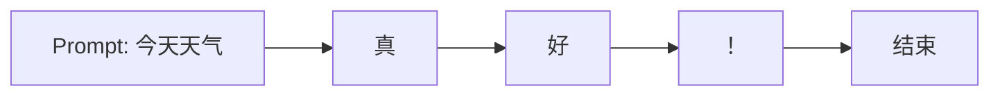

这种逐个生成的方式确保了每个新 token 都基于之前生成的所有内容，保证了文本的连贯性和合理性。

## 推理的两个阶段

### 工作流程对比

LLM 推理分为两个截然不同的阶段，各有其特点和优化目标：

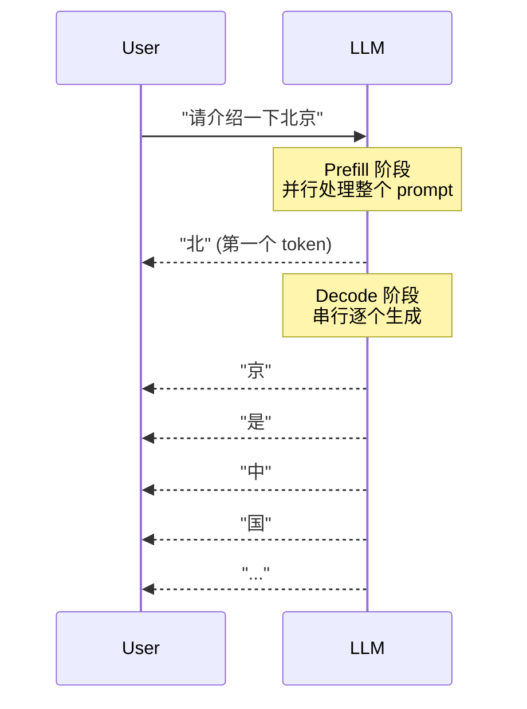

### 阶段特征对比

| 阶段 | 任务类型 | 计算模式 | 瓶颈类型 | 关键指标 |
|------|----------|----------|----------|----------|
| **Prefill** | 处理输入 prompt | 并行计算 | 计算密集型 | TTFT |
| **Decode** | 逐个生成新 token | 串行计算 | 访存密集型 | 吞吐量 |

### Prefill 阶段详解

**特点**：
- **并行处理**：所有 prompt token 同时参与计算
- **计算密集型**：主要操作为大规模矩阵乘法
- **一次性完成**：只需处理一次

**优化目标**：**TTFT（Time To First Token）**，即从请求发起到收到第一个 token 的时间。用户感知的响应速度主要取决于这个指标。

### Decode 阶段详解

**特点**：
- **串行处理**：每次只生成一个 token
- **访存密集型**：计算量小，但需要大量数据移动
- **重复执行**：直到生成结束标志或达到最大长度

**优化目标**：**吞吐量（Throughput）**，即每秒能生成多少个 token，以及 **Token Latency**，生成每个 token 的时间。

## 计算特性分析

### 算术强度差异

**算术强度**反映了计算与数据移动的比例，是理解两个阶段差异的关键：

```
Prefill 阶段:
- 计算复杂度: O(n² × d)，其中 n 是序列长度，d 是隐藏维度
- 数据移动: O(n × d)
- 算术强度: 高（计算密集型）

Decode 阶段:
- 计算复杂度: O(n × d)，但只计算一个新位置
- 数据移动: O(模型大小 + KV Cache)，需要加载整个模型和缓存
- 算术强度: 低（访存密集型）
```

### Roofline 性能模型

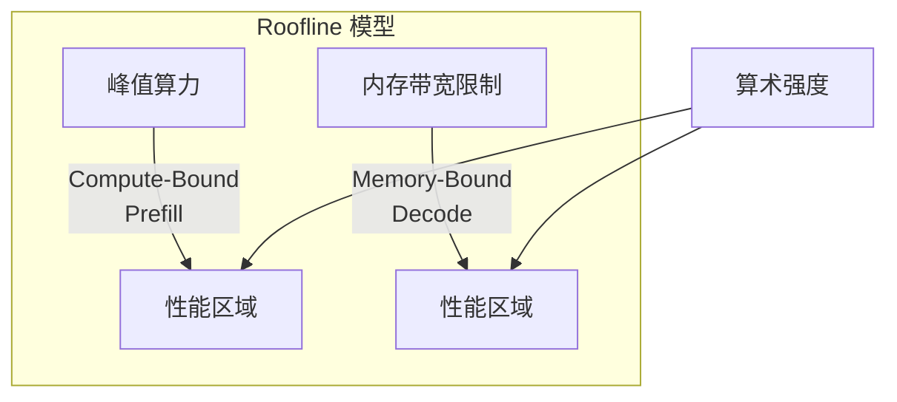

在这个模型中：
- **Prefill** 位于计算受限区域，受 GPU 算力限制
- **Decode** 位于内存受限区域，受内存带宽限制

### 典型性能数据

以 A100 GPU 为例：
- 峰值算力：312 TFLOPS (FP16)
- 显存带宽：2 TB/s
- 平衡点：约 156 FLOPs/Byte

这意味着：
- Prefill 的算术强度远高于平衡点，是计算受限
- Decode 的算术强度远低于平衡点，是内存受限

## 批处理的重要性

### 单请求的低效

在 Decode 阶段，单请求处理时 GPU 利用率极低：

```
单请求处理流程:
1. 加载整个模型到显存 (例如 7B 模型需要 14GB)
2. 计算 KV Cache
3. 只生成一个 token
4. 大部分 GPU 计算资源闲置

GPU 利用率: < 5%
```

### 批处理的威力

批处理通过同时处理多个请求来分摊固定开销：

```
批处理效果 (batch_size = 64):
1. 一次加载模型 (14GB)
2. 同时计算 64 个 token
3. 模型加载开销被 64 个请求分摊

GPU 利用率: > 50%
吞吐量提升: 10-20 倍
```

### 吞吐量 vs 延迟权衡

批处理虽然提升吞吐量，但会增加单请求延迟：

| Batch Size | 单 Token 延迟 | 吞吐量 | 适用场景 |
|------------|--------------|--------|----------|
| 1 | 30ms | 33 tokens/s | 实时交互 |
| 8 | 35ms | 229 tokens/s | 小批量 |
| 32 | 45ms | 711 tokens/s | 中批量 |
| 64 | 60ms | 1067 tokens/s | 大批量 |

## 2025年突破性技术

### POD-Attention: 完全重叠Prefill与Decode

传统观点认为Prefill和Decode必须分离处理，但2025年的POD-Attention技术彻底改变了这一认知。

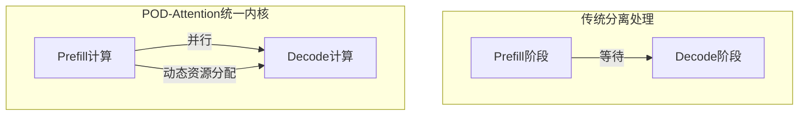

**核心技术突破**：
- **统一GPU内核**：单个GPU内核同时处理Prefill和Decode
- **动态资源分配**：Prefill使用计算资源，Decode使用内存带宽
- **混合批处理**：同一批次内同时包含两个阶段的任务
- **性能提升**：注意力计算速度提升75%，吞吐量提升22%

### Nexus: 单GPU内解耦架构

Nexus技术实现了在单个GPU内的Prefill和Decode解耦，避免了多GPU通信开销。

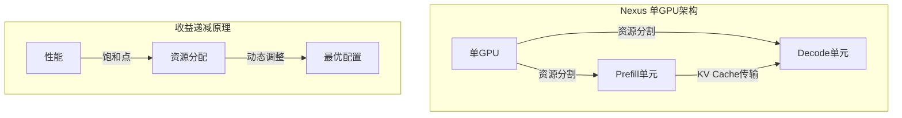

**关键创新**：
- **主动资源分割**：根据负载动态分割GPU资源
- **避免资源竞争**：消除Prefill和Decode的资源冲突
- **性能收益**：相比vLLM提升2.2倍吞吐量，TTFT降低20倍，TBT降低2.5倍
- **硬件效率**：仅需传统解耦系统一半的GPU数量

### ARES: 自适应解码重调度

ARES（Adaptive Decode Rescheduling）通过预测输出来长度，实现智能的工作负载均衡。

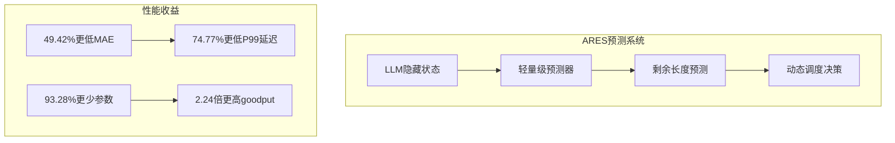

**技术特点**：
- **轻量级预测**：使用LLM隐藏状态预测剩余生成长度
- **高精度预测**：平均绝对误差降低49.42%
- **动态均衡**：根据预测结果重新分配解码任务
- **显著收益**：尾延迟降低74.77%，有效吞吐量提升2.24倍

### HACK框架: KV缓存压缩

针对长prompt的KV数据传输瓶颈，HACK框架通过同态压缩技术显著减少数据移动。

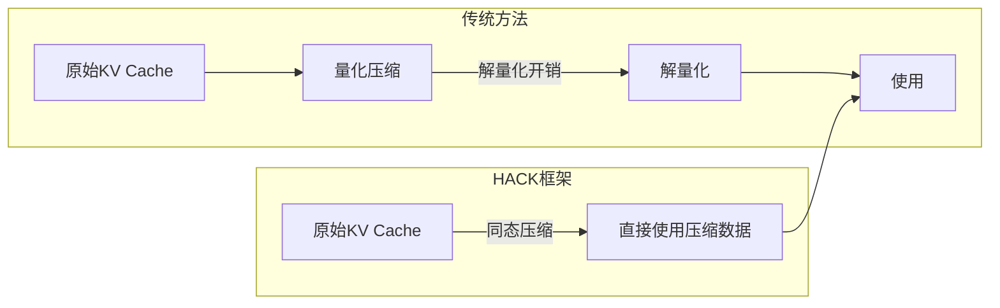

**核心优势**：
- **消除解量化**：压缩数据可直接用于计算
- **大幅减少传输**：KV数据传输量降低70%+
- **性能提升**：作业完成时间降低70.9%
- **适用性广**：特别适合低带宽GPU集群环境

## 传统架构演进

### 传统混合处理的问题

传统方式将 Prefill 和 Decode 混合处理：

```
时间轴:
Request 1: [Prefill 较长][Decode 持续]
Request 2:             [Prefill 等待][Decode 持续]

问题:
- Prefill 阻塞其他请求的 Decode
- 不同阶段的资源需求冲突
- 调度复杂度高
```

### 分离架构设计

现代推理引擎采用分离架构：

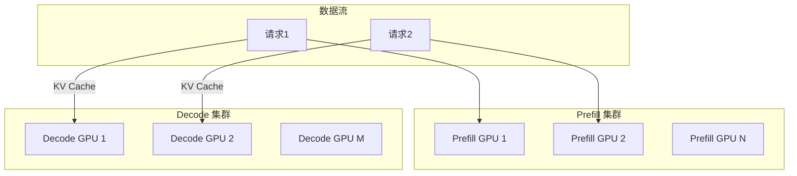

**优势**：
- Prefill GPU 专注计算密集型任务，配置高算力
- Decode GPU 专注访存密集型任务，配置大显存
- 减少不同阶段间的资源竞争
- 降低 TTFT

### 2025年混合架构创新

基于POD-Attention等新技术，混合架构迎来复兴：

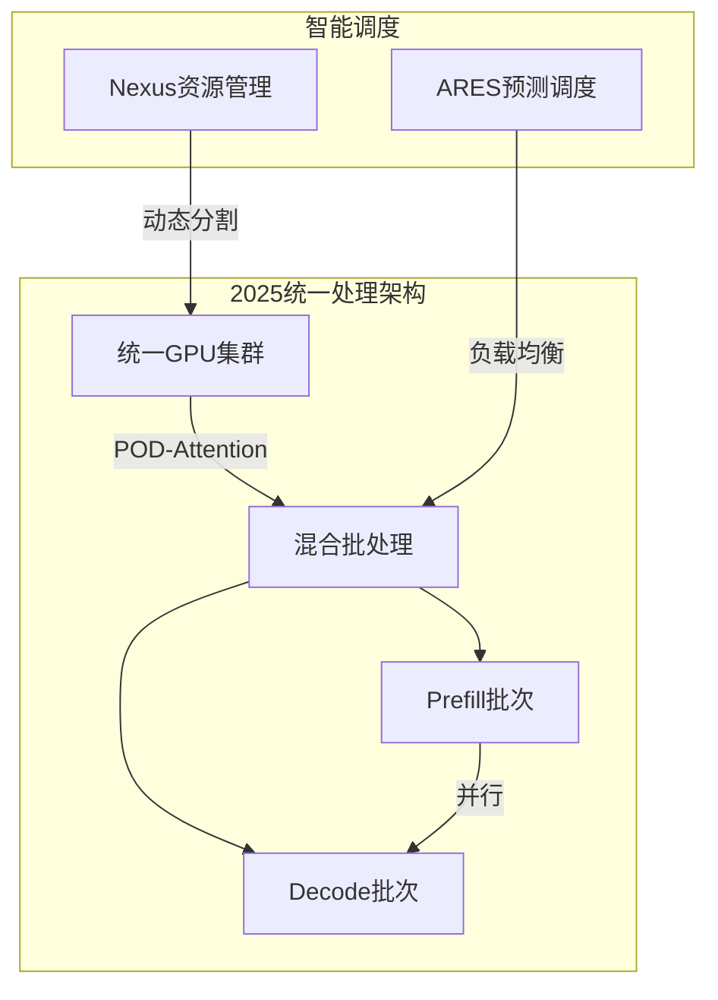

## 推测解码技术

### 核心思想

推测解码用小模型快速"猜测"多个 token，再用大模型一次性验证：

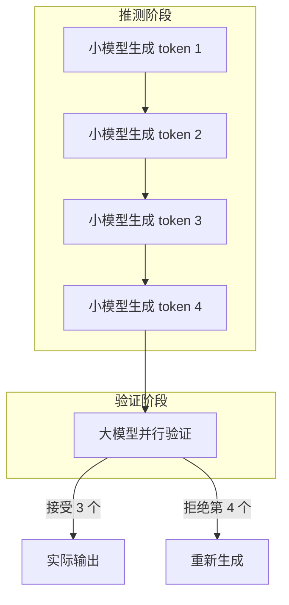

### 工作原理

1. **快速推测**：用小模型（如 7B）快速生成多个候选 token
2. **并行验证**：大模型（如 70B）一次性验证所有候选
3. **选择性接受**：按概率决定接受哪些 token
4. **回退机制**：拒绝的 token 需要重新生成

### 2025年增强版推测解码

结合POD-Attention的推测解码实现更高效率：

- **统一内核验证**：推测和验证在同一GPU内核中完成
- **动态调整策略**：根据文本复杂度调整推测长度
- **多模型协作**：不同大小模型形成推测链条
- **性能收益**：传统1.5-3倍提升至2-5倍

## 性能优化策略

### Prefill 优化

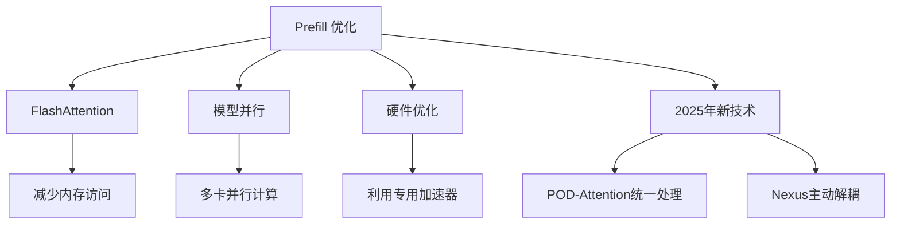

**主要技术**：
- **FlashAttention**：通过分块和重计算减少内存访问
- **模型并行**：将模型分布到多个 GPU 上并行处理
- **硬件优化**：利用最新的 GPU 架构特性
- **2025年创新**：POD-Attention统一处理、Nexus主动解耦

### Decode 优化

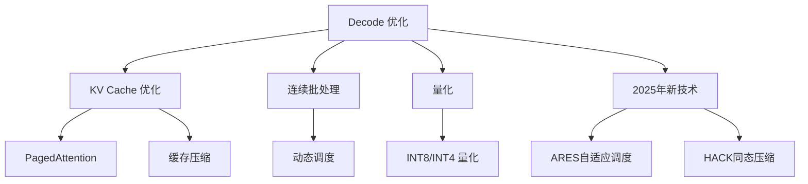

**主要技术**：
- **KV Cache 优化**：PagedAttention、缓存压缩等
- **连续批处理**：动态调度请求，提升资源利用率
- **量化**：降低模型精度，提升计算速度
- **2025年创新**：ARES自适应调度、HACK同态压缩

## 关键性能指标

### 核心指标体系

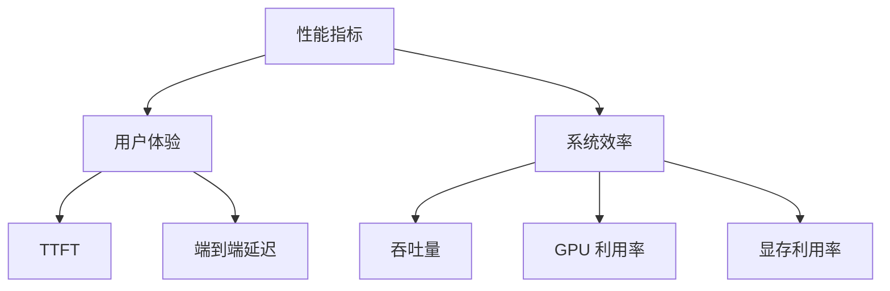

### 具体指标定义

| 指标 | 含义 | 传统目标值 | 2025年目标值 | 优化方法 |
|------|------|------------|--------------|----------|
| **TTFT** | 首 token 延迟 | < 1s | < 100ms | POD-Attention, Nexus |
| **TPS** | 吞吐量 | 越高越好 | 10×传统水平 | 混合批处理, ARE |
| **Token Latency** | 单 token 延迟 | < 50ms | < 20ms | 统一内核, HACK |
| **GPU 利用率** | 计算资源利用率 | > 80% | > 95% | 动态资源分配 |
| **显存利用率** | 内存资源利用率 | > 90% | > 98% | 同态压缩 |

### 2025年新指标

随着技术发展，新的性能指标变得更加重要：

- **Goodput**：有效吞吐量，排除被拒绝的推测token
- **P99 TPOT**：99分位尾延迟，反映服务质量
- **资源效率**：单位硬件资源的服务能力
- **能效比**：每瓦特性能，绿色AI的重要指标

## 实践建议

### 不同场景的优化重点

**实时对话场景**：
- 优先优化 TTFT，使用POD-Attention和Nexus
- 使用较小的 batch size，配合ARES动态调度
- 采用增强版推测解码

**批量处理场景**：
- 优先优化吞吐量，使用混合批处理
- 使用大 batch size，配合POD-Attention
- 采用HACK框架减少KV传输

**长文本生成**：
- 重点优化 KV Cache，使用HACK同态压缩
- 采用ARES预测调度优化资源分配
- 考虑分层缓存和滑动窗口

### 2025年技术选型指南

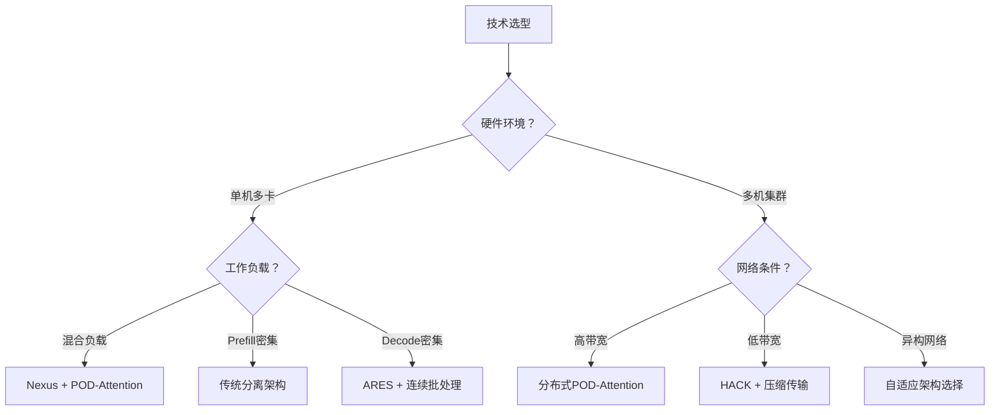

### 监控和调优

1. **建立基准**：测量各阶段的时间分布和资源使用
2. **识别瓶颈**：确定是计算受限还是内存受限
3. **智能选择**：根据负载特征动态选择最优架构
4. **持续监控**：跟踪关键指标变化，及时调整策略

## 未来展望

### 技术发展趋势

2025年的技术突破预示着未来的发展方向：

- **完全统一架构**：Prefill和Decode的无缝融合成为主流
- **智能自适应系统**：AI驱动的动态架构选择和资源分配
- **硬件协同设计**：为统一内核设计的专用GPU架构
- **绿色推理**：能效优化成为核心设计目标

### 挑战与机遇

**技术挑战**：
- **复杂度管理**：统一架构的实现复杂度显著增加
- **调度算法**：动态资源分配需要更智能的调度策略
- **硬件适配**：现有硬件可能无法完全发挥新技术的潜力

**发展机遇**：
- **专用硬件**：为统一处理设计的AI芯片
- **标准化**：行业统一的性能测试和优化标准
- **全栈优化**：从算法到硬件的端到端优化

## 本章小结

LLM推理技术在2025年迎来了革命性突破：
- **传统认知**：Prefill和Decode必须分离处理
- **2025年现实**：POD-Attention等技术实现了完全重叠
- **性能飞跃**：TTFT降低20倍，吞吐量提升2-10倍
- **架构革新**：从分离架构回归统一架构，但性能远超传统

这些突破不仅提升了性能，更改变了我们对LLM推理的基本认知。理解这些新技术是构建下一代AI服务的基础。

## 延伸阅读

**经典技术**：
- Orca: 分布式 Transformer 生成模型服务系统
- vLLM: 高效的 LLM 推理服务引擎
- FlashAttention: 快速且内存高效的注意力机制

**2025年前沿研究**：
- [POD-Attention: Unlocking Full Prefill-Decode Overlap](https://www.microsoft.com/en-us/research/publication/pod-attention-unlocking-full-prefill-decode-overlap-for-faster-llm-inference/)
- [Nexus: Proactive Intra-GPU Disaggregation](https://arxiv.org/html/2507.06608v5)
- [ARES: Adaptive Decode Rescheduling](http://arxivlens.com/PaperView/Details/adaptive-rescheduling-in-prefill-decode-disaggregated-llm-inference-2969-0a56a91e)
- [HACK: Homomorphic Acceleration via Compression](http://arxiv.org/html/2502.03589v1)

---

*下一篇：[KV Cache：推理加速的基石](./15-kv-cache.md)*
