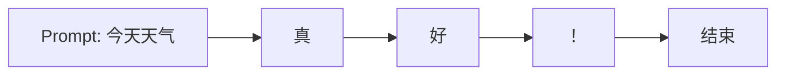
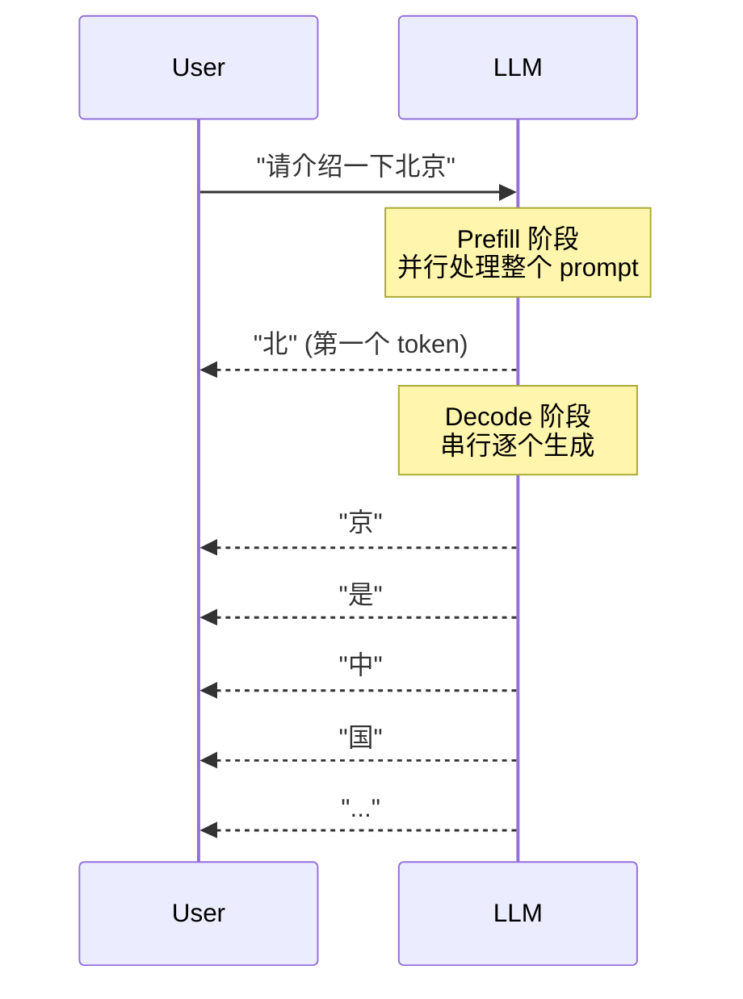
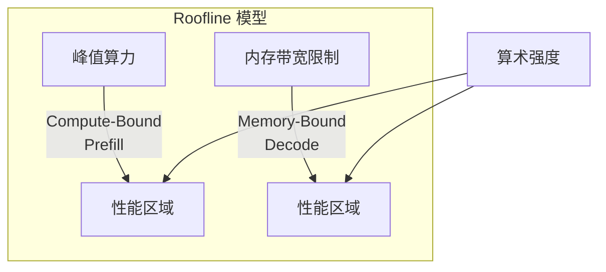
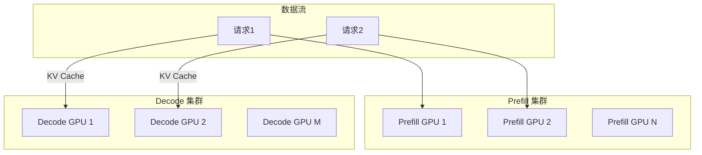
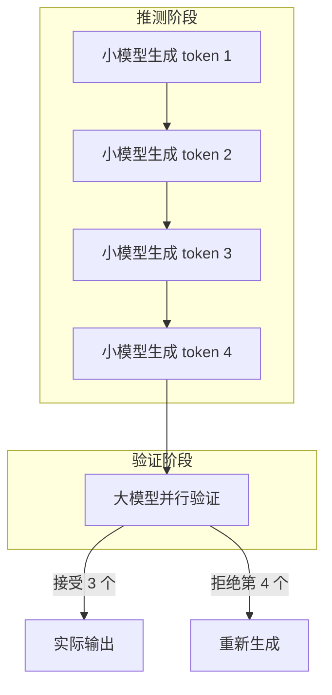
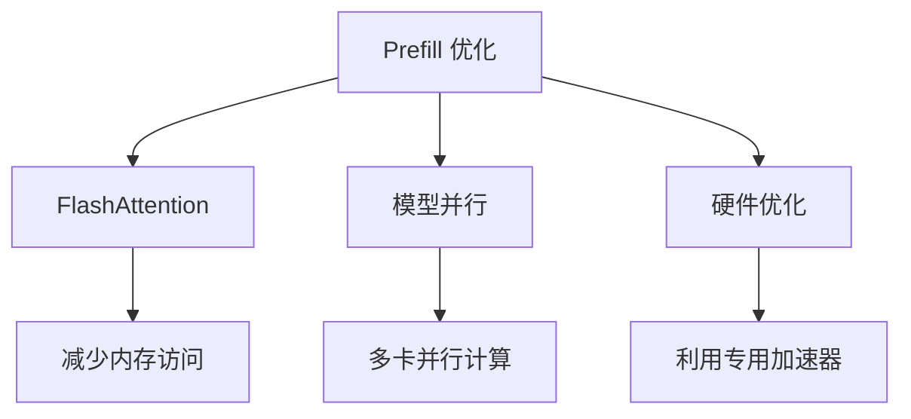
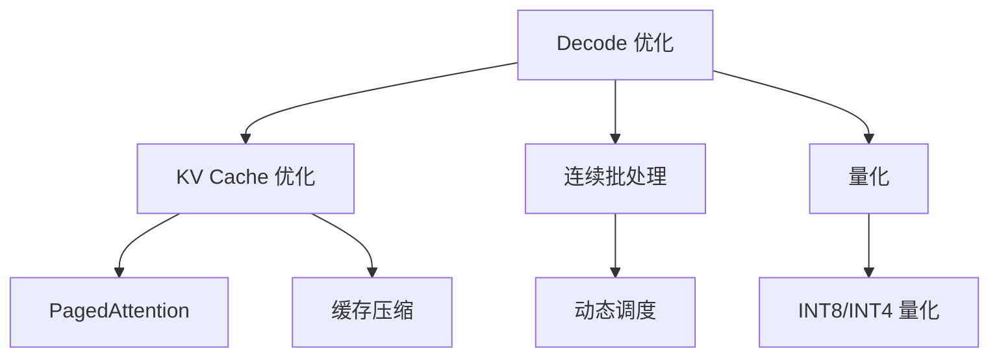
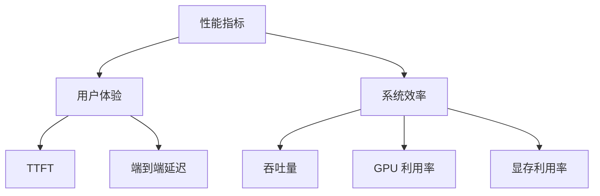

# 推理揭秘：Prefill 与 Decode 的二重奏

LLM 的推理过程与训练截然不同。理解推理的两个阶段——Prefill 和 Decode——是优化推理性能的基础。这两个阶段有着完全不同的计算特性和优化目标。

## 什么是自回归生成？

大语言模型采用**自回归（Autoregressive）**方式生成文本：每次预测一个 token，然后将其作为输入继续预测下一个。



这种逐个生成的方式确保了每个新 token 都基于之前生成的所有内容，保证了文本的连贯性和合理性。

## 推理的两个阶段

### 工作流程对比

LLM 推理分为两个截然不同的阶段，各有其特点和优化目标：



### 阶段特征对比

| 阶段 | 任务类型 | 计算模式 | 瓶颈类型 | 关键指标 |
|------|----------|----------|----------|----------|
| **Prefill** | 处理输入 prompt | 并行计算 | 计算密集型 | TTFT |
| **Decode** | 逐个生成新 token | 串行计算 | 访存密集型 | 吞吐量 |

### Prefill 阶段详解

**特点**：
- **并行处理**：所有 prompt token 同时参与计算
- **计算密集型**：主要操作为大规模矩阵乘法
- **一次性完成**：只需处理一次

**优化目标**：**TTFT（Time To First Token）**，即从请求发起到收到第一个 token 的时间。用户感知的响应速度主要取决于这个指标。

### Decode 阶段详解

**特点**：
- **串行处理**：每次只生成一个 token
- **访存密集型**：计算量小，但需要大量数据移动
- **重复执行**：直到生成结束标志或达到最大长度

**优化目标**：**吞吐量（Throughput）**，即每秒能生成多少个 token，以及 **Token Latency**，生成每个 token 的时间。

## 计算特性分析

### 算术强度差异

**算术强度**反映了计算与数据移动的比例，是理解两个阶段差异的关键：

```
Prefill 阶段:
- 计算复杂度: O(n² × d)，其中 n 是序列长度，d 是隐藏维度
- 数据移动: O(n × d)
- 算术强度: 高（计算密集型）

Decode 阶段:
- 计算复杂度: O(n × d)，但只计算一个新位置
- 数据移动: O(模型大小 + KV Cache)，需要加载整个模型和缓存
- 算术强度: 低（访存密集型）
```

### Roofline 性能模型



在这个模型中：
- **Prefill** 位于计算受限区域，受 GPU 算力限制
- **Decode** 位于内存受限区域，受内存带宽限制

### 典型性能数据

以 A100 GPU 为例：
- 峰值算力：312 TFLOPS (FP16)
- 显存带宽：2 TB/s
- 平衡点：约 156 FLOPs/Byte

这意味着：
- Prefill 的算术强度远高于平衡点，是计算受限
- Decode 的算术强度远低于平衡点，是内存受限

## 批处理的重要性

### 单请求的低效

在 Decode 阶段，单请求处理时 GPU 利用率极低：

```
单请求处理流程:
1. 加载整个模型到显存 (例如 7B 模型需要 14GB)
2. 计算 KV Cache
3. 只生成一个 token
4. 大部分 GPU 计算资源闲置

GPU 利用率: < 5%
```

### 批处理的威力

批处理通过同时处理多个请求来分摊固定开销：

```
批处理效果 (batch_size = 64):
1. 一次加载模型 (14GB)
2. 同时计算 64 个 token
3. 模型加载开销被 64 个请求分摊

GPU 利用率: > 50%
吞吐量提升: 10-20 倍
```

### 吞吐量 vs 延迟权衡

批处理虽然提升吞吐量，但会增加单请求延迟：

| Batch Size | 单 Token 延迟 | 吞吐量 | 适用场景 |
|------------|--------------|--------|----------|
| 1 | 30ms | 33 tokens/s | 实时交互 |
| 8 | 35ms | 229 tokens/s | 小批量 |
| 32 | 45ms | 711 tokens/s | 中批量 |
| 64 | 60ms | 1067 tokens/s | 大批量 |

## 阶段分离架构

### 传统混合处理的问题

传统方式将 Prefill 和 Decode 混合处理：

```
时间轴:
Request 1: [Prefill 较长][Decode 持续]
Request 2:             [Prefill 等待][Decode 持续]

问题:
- Prefill 阻塞其他请求的 Decode
- 不同阶段的资源需求冲突
- 调度复杂度高
```

### 分离架构设计

现代推理引擎采用分离架构：



**优势**：
- Prefill GPU 专注计算密集型任务，配置高算力
- Decode GPU 专注访存密集型任务，配置大显存
- 减少不同阶段间的资源竞争
- 降低 TTFT

## 推测解码技术

### 核心思想

推测解码用小模型快速"猜测"多个 token，再用大模型一次性验证：



### 工作原理

1. **快速推测**：用小模型（如 7B）快速生成多个候选 token
2. **并行验证**：大模型（如 70B）一次性验证所有候选
3. **选择性接受**：按概率决定接受哪些 token
4. **回退机制**：拒绝的 token 需要重新生成

### 性能收益

- 小模型比大模型快 10-20 倍
- 大部分推测 token 被接受（尤其是常见模式）
- 典型加速比：1.5-3 倍
- 对简单文本效果更好，复杂推理收益较小

## 性能优化策略

### Prefill 优化



**主要技术**：
- **FlashAttention**：通过分块和重计算减少内存访问
- **模型并行**：将模型分布到多个 GPU 上并行处理
- **硬件优化**：利用最新的 GPU 架构特性

### Decode 优化



**主要技术**：
- **KV Cache 优化**：PagedAttention、缓存压缩等
- **连续批处理**：动态调度请求，提升资源利用率
- **量化**：降低模型精度，提升计算速度

## 关键性能指标

### 核心指标体系



### 具体指标定义

| 指标 | 含义 | 目标值 | 优化方法 |
|------|------|--------|----------|
| **TTFT** | 首 token 延迟 | < 1s | Prefill 优化 |
| **TPS** | 吞吐量 | 越高越好 | 批处理、量化 |
| **Token Latency** | 单 token 延迟 | < 50ms | KV Cache 优化 |
| **GPU 利用率** | 计算资源利用率 | > 80% | 批处理、调度 |
| **显存利用率** | 内存资源利用率 | > 90% | PagedAttention |

## 实践建议

### 不同场景的优化重点

**实时对话场景**：
- 优先优化 TTFT
- 使用较小的 batch size
- 采用推测解码

**批量处理场景**：
- 优先优化吞吐量
- 使用大 batch size
- 采用激进量化

**长文本生成**：
- 重点优化 KV Cache
- 使用滑动窗口
- 考虑分层缓存

### 监控和调优

1. **建立基准**：测量各阶段的时间分布
2. **识别瓶颈**：确定是计算受限还是内存受限
3. **针对性优化**：根据瓶颈选择合适的优化策略
4. **持续监控**：跟踪关键指标的变化

## 本章小结

LLM 推理的两个阶段有着根本不同的特性：
- **Prefill**：计算密集型，并行处理，目标是减少 TTFT
- **Decode**：访存密集型，串行处理，目标是提升吞吐量

现代推理引擎通过阶段分离、连续批处理、推测解码等技术，实现了显著的性能提升。理解这些基本原理是优化 LLM 推理服务的基础。

## 延伸阅读

- Orca: 分布式 Transformer 生成模型服务系统
- vLLM: 高效的 LLM 推理服务引擎
- FlashAttention: 快速且内存高效的注意力机制

---

*下一篇：[KV Cache：推理加速的基石](./15-kv-cache.md)*
