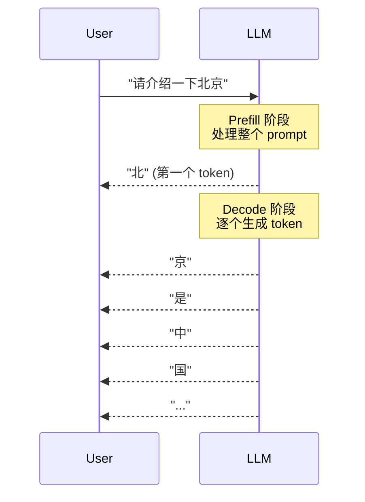
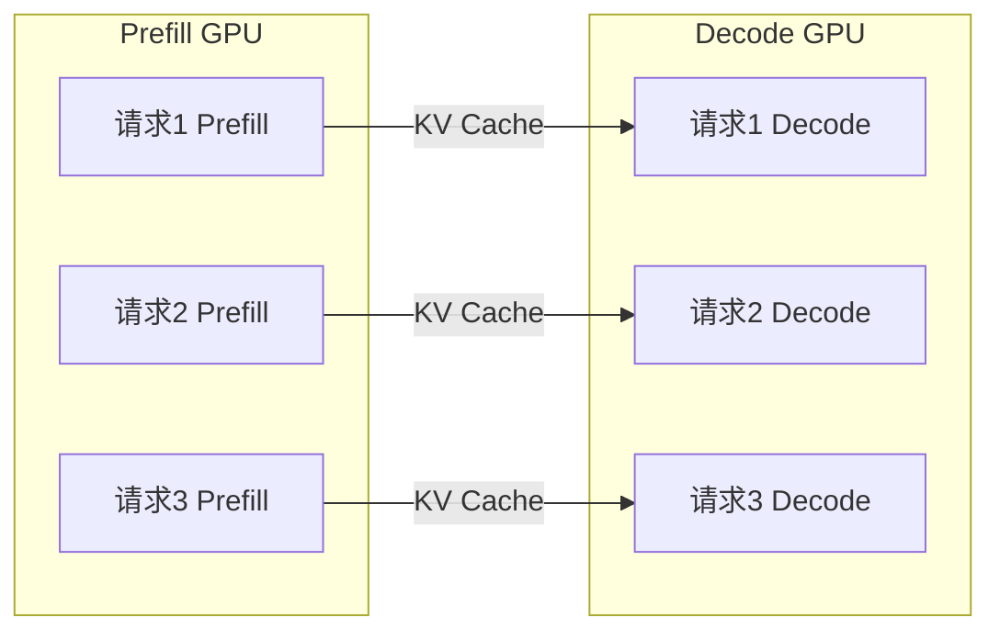
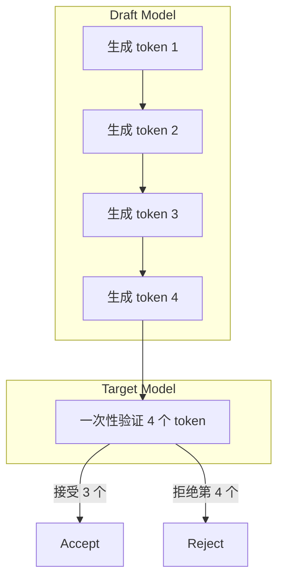
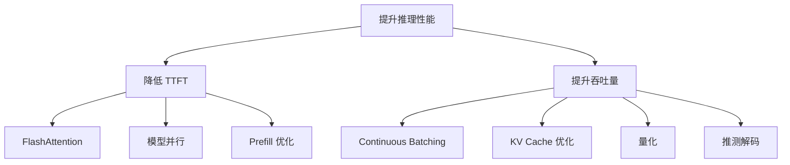

# 推理揭秘：Prefill 与 Decode 的二重奏

LLM 的推理过程与训练截然不同。理解推理的两个阶段——Prefill 和 Decode——是优化推理性能的基础。本文将深入剖析这两个阶段的特点和性能瓶颈。

## 什么是自回归生成？

大语言模型采用**自回归（Autoregressive）**方式生成文本：每次预测一个 token，然后将其作为输入继续预测下一个。


```python
def autoregressive_generate(model, prompt_tokens, max_new_tokens):
    """自回归生成的基本流程"""
    generated = prompt_tokens.copy()
    
    for _ in range(max_new_tokens):
        # 用所有已有 token 预测下一个
        logits = model(generated)
        next_token = sample(logits[-1])  # 只取最后一个位置的预测
        
        generated.append(next_token)
        
        if next_token == EOS_TOKEN:
            break
    
    return generated
```

## 推理的两个阶段

### 工作内容



| 阶段 | 任务 | 特点 | 关键指标 |
|------|------|------|----------|
| **Prefill** | 处理输入 prompt | 并行计算 | TTFT |
| **Decode** | 逐个生成 token | 串行计算 | Throughput |

### 计算特点

**Prefill**：
- **并行处理**：所有 prompt token 同时参与计算
- **计算密集型（Compute-Bound）**：主要操作为矩阵乘法 (GEMM)

**Decode**：
- **串行处理**：每次只生成一个 token
- **访存密集型（Memory-Bound）**：计算量小，但数据移动多

### 关键指标

**Prefill**：
- **TTFT (Time To First Token)**：从请求发起到收到第一个 token 的时间。

**Decode**：
- **Throughput**：每秒生成的 token 数（tokens/s）
- **Token Latency**：生成每个 token 的时间

## Compute-Bound vs Memory-Bound

### 算术强度分析

**算术强度（Arithmetic Intensity）**= 计算量 / 数据移动量

```
Prefill (batch=1, seq=1024, d=4096):
- 计算: O(n² × d) ≈ 4B FLOPs
- 数据: O(n × d) ≈ 16MB
- 算术强度: 4B / 16MB ≈ 250 FLOPs/Byte

Decode (batch=1, seq=1, 缓存长度=1024):
- 计算: O(n × d) ≈ 16M FLOPs
- 数据: O(模型大小 + KV Cache) ≈ 14GB + 缓存
- 算术强度: 16M / 14GB ≈ 0.001 FLOPs/Byte
```

### Roofline 模型

```
                   峰值算力
                    /
性能              /
  ↑             /
  |           /
  |         /← Compute-Bound (Prefill)
  |       /
  |     /
  |   /
  | /← Memory-Bound (Decode)
  +------------------------→
         算术强度
```

**A100 GPU**:
- 峰值算力: 312 TFLOPS (FP16)
- 显存带宽: 2 TB/s
- 平衡点: 312T / 2T = 156 FLOPs/Byte

### 优化方向

| 阶段 | 瓶颈 | 优化方向 |
|------|------|----------|
| Prefill | 计算 | FlashAttention、并行化 |
| Decode | 访存 | 批处理、量化、KV Cache 压缩 |

## 批处理的重要性

### 为什么 Decode 需要批处理？

单请求 Decode 时，GPU 利用率极低：

```
单请求:
加载 7B 参数 (14GB) → 计算 1 个 token → 浪费！
GPU 利用率: < 5%

批处理 (batch=64):
加载 7B 参数 (14GB) → 计算 64 个 token → 高效！
GPU 利用率: > 50%
```

### 批处理的收益

```python
# 假设模型加载时间为 T_load
# 单 token 计算时间为 T_compute

# 单请求:
time_per_token = T_load + T_compute  # T_load >> T_compute

# 批处理 (batch_size = B):
time_per_token = (T_load + B * T_compute) / B
              ≈ T_load / B + T_compute  # 当 B 足够大
```

**结论**：批处理可以分摊模型加载的开销。

### 吞吐量对比

| Batch Size | 单 Token 延迟 | 吞吐量 (tokens/s) |
|------------|--------------|-------------------|
| 1 | 30ms | 33 |
| 8 | 35ms | 229 |
| 32 | 45ms | 711 |
| 64 | 60ms | 1067 |

*数据为示意，实际取决于硬件和模型*

## Prefill 与 Decode 的分离

### 混合处理的问题

传统方式将 Prefill 和 Decode 混在一起：

```
时间轴:
Request 1: [Prefill 1][ Decode 1 .... ]
Request 2:            [Prefill 2][ Decode 2 .... ]

问题:
- Prefill 时其他请求等待
- 资源利用不均匀
```

### 分离架构 (Splitwise/Disaggregation)

将 Prefill 和 Decode 分到不同的 GPU：



**优势**：
- Prefill GPU 专注计算密集任务
- Decode GPU 专注高批处理
- 降低 TTFT

## 推测解码 (Speculative Decoding)

### 基本思想

用小模型快速"猜测"多个 token，再用大模型一次性验证：



### 工作流程

```python
def speculative_decode(target_model, draft_model, prompt, k=4):
    """推测解码"""
    while not done:
        # 1. Draft 模型快速生成 k 个 token
        draft_tokens = []
        for _ in range(k):
            token = draft_model.generate_one()
            draft_tokens.append(token)
        
        # 2. Target 模型一次性验证
        # 并行处理所有 draft tokens
        logits = target_model(prompt + draft_tokens)
        
        # 3. 按概率接受/拒绝
        accepted = verify_and_accept(draft_tokens, logits)
        
        # 4. 更新序列
        prompt.extend(accepted)
```

### 为什么有效？

- Draft 模型（如 7B）比 Target 模型（如 70B）快 10 倍
- 大部分 token 猜测正确（尤其是常见词）
- 验证失败的成本可控

**加速比**：通常 1.5-3 倍

## 性能指标总结

### 关键指标

| 指标 | 含义 | 目标 |
|------|------|------|
| **TTFT** | 首 Token 延迟 | < 1s |
| **TPS** | 吞吐量 | 越高越好 |
| **Token Latency** | 单 Token 延迟 | < 50ms |
| **E2E Latency** | 端到端延迟 | 取决于场景 |

### 优化策略



## 实战：测量推理性能

```python
import time
import torch

def benchmark_inference(model, tokenizer, prompt, max_new_tokens=100):
    """测量推理性能"""
    inputs = tokenizer(prompt, return_tensors="pt").to(model.device)
    
    # 预热
    model.generate(**inputs, max_new_tokens=10)
    torch.cuda.synchronize()
    
    # 测量 TTFT
    start = time.perf_counter()
    with torch.no_grad():
        outputs = model.generate(
            **inputs, 
            max_new_tokens=max_new_tokens,
            return_dict_in_generate=True,
            output_scores=True
        )
    torch.cuda.synchronize()
    total_time = time.perf_counter() - start
    
    num_generated = outputs.sequences.shape[1] - inputs.input_ids.shape[1]
    
    print(f"生成 {num_generated} tokens")
    print(f"总时间: {total_time:.2f}s")
    print(f"吞吐量: {num_generated / total_time:.1f} tokens/s")
    print(f"平均延迟: {total_time / num_generated * 1000:.1f} ms/token")
```

## 本章小结

- LLM 推理分为 Prefill（处理 prompt）和 Decode（生成 token）两阶段
- Prefill 是计算密集型，Decode 是访存密集型
- 批处理是提升 Decode 效率的关键
- TTFT 和吞吐量是核心性能指标
- 推测解码、分离架构等技术可进一步优化

## 延伸阅读

- Orca: A Distributed Serving System for Transformer-Based Generative Models
- Splitwise: Efficient Generative LLM Inference with Phase Splitting
- Fast Inference from Transformers via Speculative Decoding

---

*下一篇：[KV Cache：推理加速的基石](./15-kv-cache.md)*
