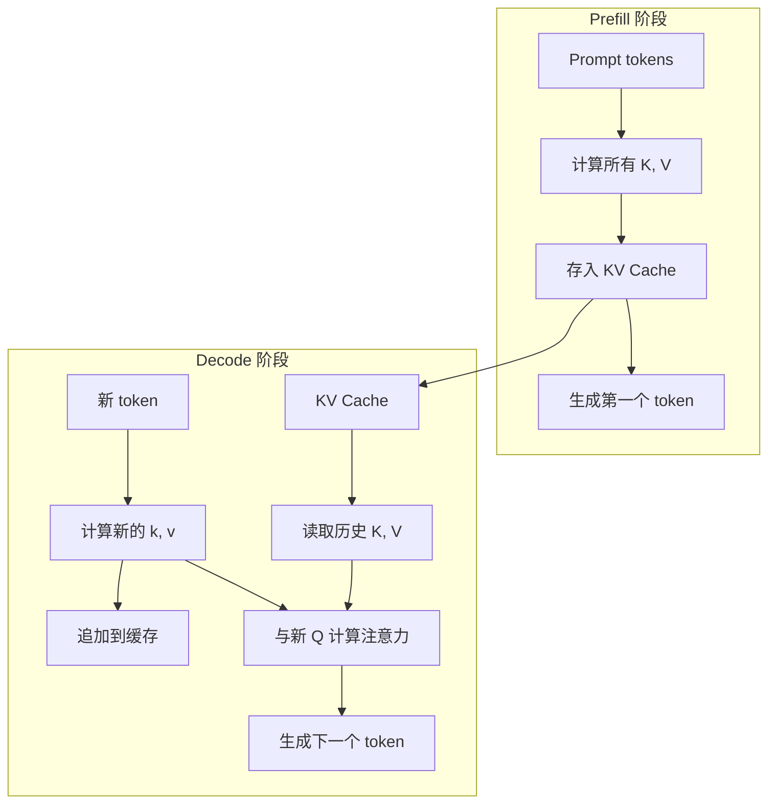
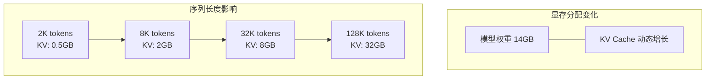
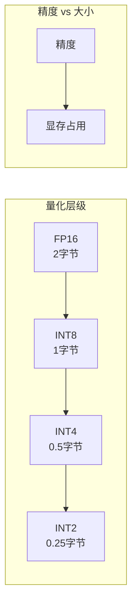
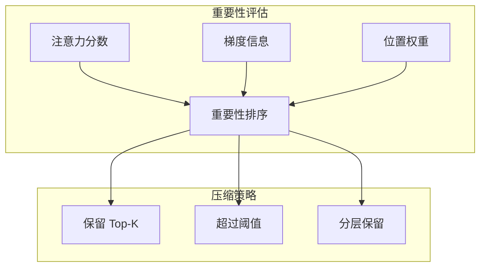
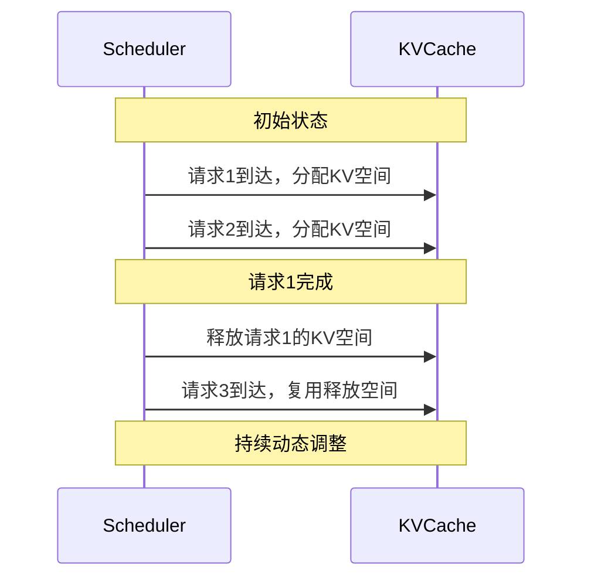
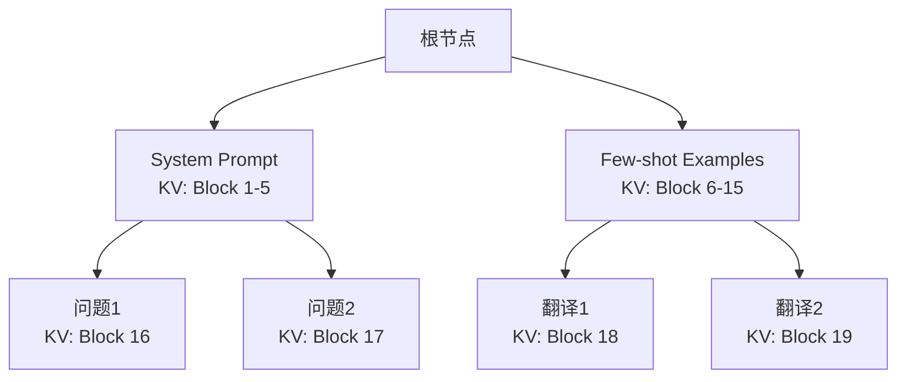
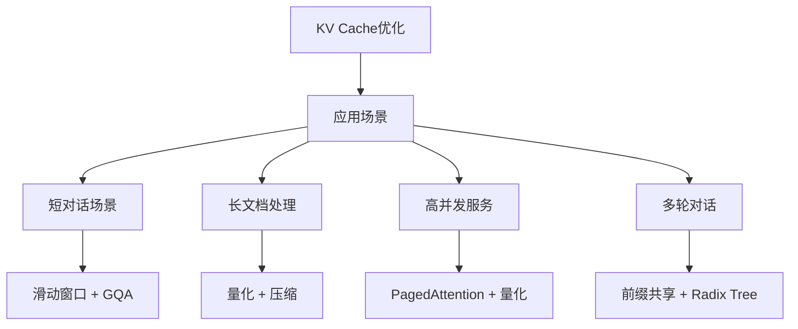
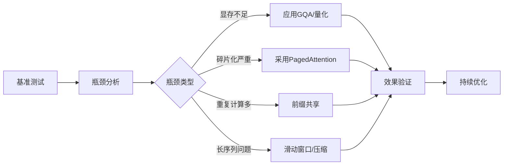

# KV Cache：推理加速的基石

在自回归生成中，如果每次都从头计算所有 token 的注意力，计算量会随生成长度平方增长。KV Cache 是解决这一问题的核心技术，也是理解现代推理引擎的关键。

## 为什么需要 KV Cache？

### 重复计算的浪费

回顾自注意力计算的公式：Attention(Q, K, V) = softmax(QK^T / √d) × V

在自回归生成中，每生成一个新 token，都需要计算它与所有历史 token 的注意力：

```
Step 1: 生成 token 1
  计算 Q1, K1, V1 → Attention → 生成 token 1

Step 2: 生成 token 2  
  重新计算 Q1, K1, V1 → 浪费！
  计算 Q2, K2, V2 → Attention → 生成 token 2

Step 3: 生成 token 3
  重新计算 Q1, K1, V1 → 浪费！
  重新计算 Q2, K2, V2 → 浪费！
  计算 Q3, K3, V3 → Attention → 生成 token 3

问题：历史 token 的 K、V 每次都重复计算
```

**计算复杂度分析**：
- 不使用缓存：O(n²) 每个新生成的 token 都需要重新计算所有历史 attention
- 使用 KV Cache：O(n) 只需要计算新 token 与历史 token 的 attention

### KV Cache 的解决方案

**核心思想**：缓存已计算的 K 和 V，只计算新 token 的 Q、K、V，然后与缓存的 K、V 组合。

```
使用 KV Cache 的工作流程：

Step 1: 生成 token 1
  计算 K1, V1 → 存入缓存
  Q1 与 [K1] 计算 attention

Step 2: 生成 token 2
  计算 K2, V2 → 追加到缓存
  Q2 与 [K1, K2] 计算 attention (K1 从缓存读取)

Step 3: 生成 token 3
  计算 K3, V3 → 追加到缓存  
  Q3 与 [K1, K2, K3] 计算 attention (K1, K2 从缓存读取)

优势：每个历史 token 的 K、V 只计算一次
```

## KV Cache 工作原理

### 数据流转过程



### 存储结构

KV Cache 按层存储，每一层都有独立的 K、V 缓存：

```
KV Cache 结构：
├── Layer 0
│   ├── K Cache: [batch_size, num_heads, seq_len, head_dim]
│   └── V Cache: [batch_size, num_heads, seq_len, head_dim]
├── Layer 1
│   ├── K Cache: [batch_size, num_heads, seq_len, head_dim]
│   └── V Cache: [batch_size, num_heads, seq_len, head_dim]
├── ...
└── Layer N-1
    ├── K Cache: [batch_size, num_heads, seq_len, head_dim]
    └── V Cache: [batch_size, num_heads, seq_len, head_dim]
```

### 计算流程详解

1. **Prefill 阶段**：
   - 处理整个 prompt 序列
   - 并行计算所有 token 的 K、V
   - 按层存储到 KV Cache

2. **Decode 阶段**：
   - 对每个新 token，只计算其 K、V
   - 从缓存读取历史的 K、V
   - 组合成完整的 K、V 矩阵进行 attention 计算

## KV Cache 显存占用分析

### 计算公式

```
KV Cache 总大小 = 2 × batch_size × num_layers × num_heads × head_dim × seq_len × dtype_size

其中：
- 2: K 和 V 各一份
- batch_size: 并行处理的请求数
- num_layers: 模型层数
- num_heads: 注意力头数  
- head_dim: 每个头的维度
- seq_len: 序列长度
- dtype_size: FP16=2字节, FP32=4字节, INT8=1字节
```

### 不同规模模型的显存占用

以 LLaMA-2 7B 模型为例：
- 模型配置：32层，32头，每头128维
- 数据类型：FP16（2字节）

```
单个请求，不同序列长度的 KV Cache 大小：
├── 序列长度 2K：约 0.5 GB
├── 序列长度 8K：约 2 GB  
├── 序列长度 32K：约 8 GB
└── 序列长度 128K：约 32 GB（超过模型权重！）

对比：模型权重本身占用 14 GB（FP16）
```

### 主流模型对比

| 模型 | 参数量 | 模型权重(FP16) | KV Cache(4K) | KV Cache(128K) |
|------|--------|----------------|--------------|---------------|
| LLaMA-2 7B | 7B | 14 GB | 0.5 GB | 16 GB |
| LLaMA-2 70B | 70B | 140 GB | 2.5 GB | 80 GB |
| GPT-4(推测) | ~1.8T | ~3.6 TB | ~30 GB | ~1 TB |

**关键观察**：长序列下，KV Cache 可能超过模型权重本身！

## KV Cache 带来的挑战

### 1. 显存爆炸式增长

长上下文场景下，KV Cache 增长迅速：



当序列长度达到 128K 时，KV Cache 可能占用 32GB，远超模型权重本身。

### 2. 显存碎片化严重

KV Cache 动态增长特性导致严重的内存碎片：

```
传统分配方式的时间线：
初始: [空闲 100GB]

请求1到达: 预分配 4K 空间
          [Req1: 2GB][空闲 98GB]

请求2到达: 预分配 4K 空间  
          [Req1: 2GB][Req2: 2GB][空闲 96GB]

请求1完成: 释放空间
          [空洞: 2GB][Req2: 2GB][空闲 96GB]
                    ↑
                  碎片空间

新请求需要3GB: 无法分配！
（虽然总空闲空间 = 98GB，但没有连续3GB）
```

### 3. 预分配浪费严重

传统方法必须按最大可能长度预分配：

```
请求分析：
- 实际生成长度：500 tokens  
- 预分配长度：4096 tokens
- 浪费率：(4096 - 500) / 4096 = 87.8%

平均而言，60-80% 的预分配空间被浪费！
```

## KV Cache 优化技术

### 1. 多查询注意力 (MQA/GQA)

减少 KV 头的数量，降低缓存大小：

```
标准多头注意力 (MHA)：
Query 头: 32个
Key 头: 32个  
Value 头: 32个
KV Cache: 32份

分组查询注意力 (GQA)：
Query 头: 32个
Key 头: 8个
Value 头: 8个  
KV Cache: 8份 (减少4倍)
```

**效果**：GQA 可以将 KV Cache 大小减少 2-8 倍，而精度损失很小。

### 2. KV Cache 量化

将 KV Cache 从 FP16 量化到更低位宽：



**2024年最新进展**：
- **INT4 量化**：显存减少75%，精度损失&lt;2%
- **混合精度**：关键层用INT8，其他层用INT4
- **动态量化**：根据重要性动态调整精度

### 3. 滑动窗口注意力

只缓存最近的 N 个 token：

```
滑动窗口策略：
当前序列: [token_0, token_1, ..., token_10000]
窗口大小: 4096
实际缓存: [token_5904, ..., token_10000]

优点: KV Cache 大小固定为窗口大小
缺点: 无法关注超出窗口的历史信息
```

**适用场景**：
- 对话系统（主要关注最近对话）
- 实时翻译（上下文依赖较短）
- 代码补全（局部依赖强）

### 4. 选择性缓存压缩

智能选择性地保留重要的 token：



**技术原理**：
- 分析每个 token 被关注的程度
- 保留重要 token，丢弃不重要 token
- 通过重计算恢复丢弃的 token（如果需要）

### 5. PagedAttention 技术

借鉴操作系统虚拟内存思想，将 KV Cache 分页管理：

```
传统方式：
[请求1: 连续4GB][请求2: 连续4GB][空洞2GB][请求3: 连续4GB]

PagedAttention：
[页1][页2][页3][页4][页5][页6][空闲页][页7][页8]...

优势：
- 消除内部碎片（只有最后一页可能有少量浪费）
- 消除外部碎片（任意空闲页都可使用）
- 显存利用率>95%
```

## KV Cache 与批处理

### 多请求的缓存管理

在批处理场景，KV Cache 管理变得复杂：

```
场景：3个并发请求
请求1: prompt=100 tokens, 已生成50 tokens  
请求2: prompt=500 tokens, 已生成30 tokens
请求3: prompt=200 tokens, 已生成100 tokens

传统方法：
每个请求预分配 max_seq_len 空间
总需求 = 3 × 4096 × token_size

PagedAttention：
按需分配实际使用空间
总需求 = (150+530+300) × token_size
节省约50%显存
```

### 连续批处理中的 KV Cache

连续批处理允许请求动态加入和离开：



## 前缀共享优化

### 共享机会识别

许多请求共享相同的前缀：

```
场景1: System Prompt 共享
请求1: "[System]你是编程助手..." + "如何写快排？"  
请求2: "[System]你是编程助手..." + "如何写二分查找？"
共享前缀: "[System]你是编程助手..." (约100 tokens)

场景2: Few-shot Learning 共享
请求1: "示例1...示例2...示例3..." + "翻译: Hello"  
请求2: "示例1...示例2...示例3..." + "翻译: World"  
共享前缀: 所有few-shot示例 (约1000 tokens)
```

### Radix Tree 管理

使用 Radix Tree 组织共享前缀：



**效果**：
- 前缀命中时直接复用 KV Cache
- 显著降低 TTFT (Time To First Token)
- 减少重复计算，提升整体吞吐量

## 性能优化策略总结

### 不同场景的最佳策略



### 优化技术对比

| 技术方案 | 显存节省 | 精度影响 | 实现复杂度 | 适用场景 |
|----------|----------|----------|------------|----------|
| GQA | 2-8倍 | 微小 | 低（模型结构） | 通用场景 |
| INT8量化 | 2倍 | 小 | 中 | 显存受限 |
| INT4量化 | 4倍 | 中等 | 中 | 极限优化 |
| 滑动窗口 | 固定上限 | 可能较大 | 低 | 局部依赖 |
| 选择性压缩 | 可配置 | 中等 | 高 | 长上下文 |
| PagedAttention | 利用率提升 | 无 | 高 | 高并发 |

## 实战建议

### 监控指标

1. **显存利用率**：目标 >90%
2. **KV Cache 命中率**：前缀共享场景的关键指标
3. **碎片化程度**：传统分配方式的问题指标
4. **TTFT 和 TPOT**：最终用户体验指标

### 调优流程



## 本章小结

KV Cache 是 LLM 推理加速的基石，通过缓存历史 K、V 避免重复计算，将复杂度从 O(n²) 降到 O(n)。

但 KV Cache 也带来了新挑战：
- 显存占用随序列长度线性增长
- 动态分配导致严重碎片化
- 预分配造成大量浪费

现代优化技术包括 GQA、量化、PagedAttention、前缀共享等，需要根据具体场景选择合适的组合策略。

## 延伸阅读

- PagedAttention: 高效的 LLM 推理内存管理
- GQA: 训练通用多查询 Transformer
- SGLang: 高效执行结构化语言模型程序

---

*下一篇：[PagedAttention：显存管理的艺术](./16-memory-management.md)*
