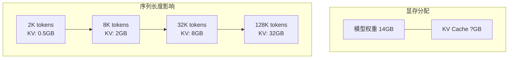
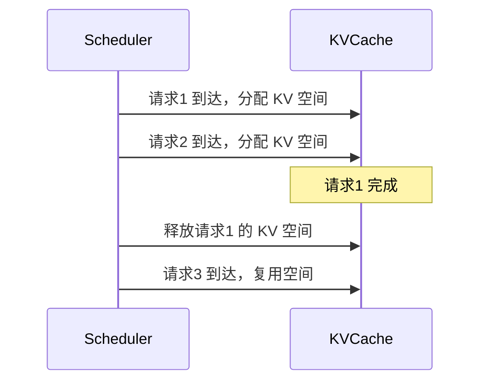

# KV Cache：推理加速的基石

在自回归生成中，如果每次都从头计算所有 token 的注意力，计算量会随生成长度平方增长。KV Cache 是解决这一问题的核心技术，也是理解现代推理引擎的关键。

## 为什么需要 KV Cache？

### 重复计算问题

回顾自注意力计算：

```
Attention(Q, K, V) = softmax(QK^T / √d) × V
```

在自回归生成中，每生成一个新 token，都需要计算它与所有历史 token 的注意力：

```
Step 1: 生成 token 1
  Q1, K1, V1 → Attention

Step 2: 生成 token 2
  Q1, K1, V1 → 重新计算 ❌
  Q2, K2, V2 → Attention

Step 3: 生成 token 3
  Q1, K1, V1 → 重新计算 ❌
  Q2, K2, V2 → 重新计算 ❌
  Q3, K3, V3 → Attention
```

**问题**：历史 token 的 K、V 每次都重新计算，大量冗余！

### KV Cache 的解决方案

**核心思想**：缓存已计算的 K 和 V，只计算新 token 的 Q、K、V。

```
Step 1: 生成 token 1
  计算 K1, V1 → 存入缓存
  Q1 与 [K1] 计算注意力

Step 2: 生成 token 2
  计算 K2, V2 → 追加到缓存
  Q2 与 [K1, K2] 计算注意力 (K1 从缓存读取 ✓)

Step 3: 生成 token 3
  计算 K3, V3 → 追加到缓存
  Q3 与 [K1, K2, K3] 计算注意力 (K1, K2 从缓存读取 ✓)
```

## KV Cache 工作原理

### 数据流图


### 代码实现

```python
class KVCache:
    def __init__(self, batch_size, max_seq_len, num_heads, head_dim, num_layers, dtype):
        self.cache_k = torch.zeros(
            num_layers, batch_size, num_heads, max_seq_len, head_dim,
            dtype=dtype, device='cuda'
        )
        self.cache_v = torch.zeros(
            num_layers, batch_size, num_heads, max_seq_len, head_dim,
            dtype=dtype, device='cuda'
        )
        self.seq_len = 0
    
    def update(self, layer_idx, new_k, new_v):
        """更新指定层的 KV Cache"""
        # new_k, new_v: (batch, num_heads, new_seq_len, head_dim)
        new_seq_len = new_k.shape[2]
        
        # 追加新的 K, V
        self.cache_k[layer_idx, :, :, self.seq_len:self.seq_len + new_seq_len] = new_k
        self.cache_v[layer_idx, :, :, self.seq_len:self.seq_len + new_seq_len] = new_v
        
        self.seq_len += new_seq_len
        
        # 返回完整的 K, V
        return (
            self.cache_k[layer_idx, :, :, :self.seq_len],
            self.cache_v[layer_idx, :, :, :self.seq_len]
        )
```

### Attention with KV Cache

```python
def attention_with_kv_cache(q, k, v, kv_cache, layer_idx):
    """
    q: (batch, num_heads, 1, head_dim) - 只有新 token 的 query
    k, v: (batch, num_heads, 1, head_dim) - 只有新 token 的 key, value
    """
    # 更新缓存，获取完整的 K, V
    full_k, full_v = kv_cache.update(layer_idx, k, v)
    
    # full_k, full_v: (batch, num_heads, seq_len, head_dim)
    
    # 计算注意力
    # q @ full_k.T: (batch, heads, 1, seq_len)
    scores = torch.matmul(q, full_k.transpose(-2, -1)) / math.sqrt(q.shape[-1])
    attention = F.softmax(scores, dim=-1)
    
    # attention @ full_v: (batch, heads, 1, head_dim)
    output = torch.matmul(attention, full_v)
    
    return output
```

## KV Cache 显存占用

### 计算公式

```
KV Cache 大小 = 2 × batch_size × num_layers × num_heads × head_dim × seq_len × dtype_size

其中:
- 2: K 和 V 各一份
- dtype_size: FP16 = 2 bytes, FP32 = 4 bytes
```

### 典型配置的显存占用

以 LLaMA-2 7B 为例：

```
配置:
- num_layers = 32
- num_heads = 32
- head_dim = 128
- dtype = FP16 (2 bytes)

单个请求, seq_len = 2048:
KV Cache = 2 × 1 × 32 × 32 × 128 × 2048 × 2 bytes
         = 1,073,741,824 bytes
         = 1 GB

单个请求, seq_len = 128K:
KV Cache = 2 × 1 × 32 × 32 × 128 × 131072 × 2 bytes
         = 64 GB (比模型权重还大！)
```

### 不同模型的 KV Cache

| 模型 | 参数量 | 模型权重 (FP16) | KV Cache (4K) | KV Cache (128K) |
|------|--------|----------------|---------------|-----------------|
| LLaMA-2 7B | 7B | 14 GB | 0.5 GB | 16 GB |
| LLaMA-2 70B | 70B | 140 GB | 2.5 GB | 80 GB |
| GPT-4 (推测) | ~1.8T | ~3.6 TB | ~30 GB | ~1 TB |

## KV Cache 带来的挑战

### 1. 显存爆炸

长上下文场景下，KV Cache 可能超过模型权重：



### 2. 显存碎片化

KV Cache 动态增长，导致显存碎片：

```
初始状态:
[空闲空间 100GB]

请求1 (预分配 4K):
[Req1 KV: 2GB][空闲 98GB]

请求2 (预分配 4K):
[Req1 KV: 2GB][Req2 KV: 2GB][空闲 96GB]

请求1 完成:
[空闲 2GB][Req2 KV: 2GB][空闲 96GB]
          ↑
        碎片！新请求可能无法使用
```

### 3. 预分配浪费

传统方法必须按最大长度预分配：

```
请求实际长度: 500 tokens
预分配长度: 4096 tokens

浪费: (4096 - 500) / 4096 = 88%!
```

## KV Cache 优化技术

### 1. MQA / GQA

减少 KV 的头数，降低缓存大小：

```
原始 MHA (32 heads):
KV Cache = 2 × 32 × head_dim × seq_len × 2 bytes

GQA (8 KV heads):
KV Cache = 2 × 8 × head_dim × seq_len × 2 bytes
减少 4 倍！
```

### 2. KV Cache 量化

将 KV Cache 从 FP16 量化到 INT8/INT4：

```python
def quantize_kv_cache(k, v, bits=8):
    """量化 KV Cache"""
    # 计算缩放因子
    k_scale = k.abs().max() / (2**(bits-1) - 1)
    v_scale = v.abs().max() / (2**(bits-1) - 1)
    
    # 量化
    k_quant = (k / k_scale).round().clamp(-2**(bits-1), 2**(bits-1)-1).to(torch.int8)
    v_quant = (v / v_scale).round().clamp(-2**(bits-1), 2**(bits-1)-1).to(torch.int8)
    
    return k_quant, v_quant, k_scale, v_scale

# 显存节省
# FP16 -> INT8: 减少 50%
# FP16 -> INT4: 减少 75%
```

### 3. Sliding Window Attention

只缓存最近 N 个 token 的 KV：

```
Window size = 4096

实际序列: [token_0, token_1, ..., token_10000]
KV Cache: 只存储 [token_5905, ..., token_10000]

优点: KV Cache 大小固定
缺点: 无法关注远距离 token
```

**使用模型**：Mistral（sliding window = 4096）

### 4. KV Cache 压缩

选择性保留重要的 KV：

```python
def h2o_compression(k, v, attention_scores, keep_ratio=0.5):
    """H2O: Heavy-Hitter Oracle 压缩"""
    # 根据注意力分数找出"重要"的 token
    importance = attention_scores.sum(dim=-2)  # 累计被关注的程度
    
    # 保留最重要的 top-k
    num_keep = int(k.shape[2] * keep_ratio)
    _, indices = importance.topk(num_keep, dim=-1)
    
    # 压缩 KV Cache
    k_compressed = k.gather(2, indices.unsqueeze(-1).expand_as(k))
    v_compressed = v.gather(2, indices.unsqueeze(-1).expand_as(v))
    
    return k_compressed, v_compressed
```

### 5. PagedAttention

将 KV Cache 分块管理，解决碎片化问题（下一章详解）。

## KV Cache 与批处理

### 多请求的 KV Cache 管理

```
请求 1: prompt = 100 tokens, 生成 50 tokens
请求 2: prompt = 500 tokens, 生成 30 tokens
请求 3: prompt = 200 tokens, 生成 100 tokens

传统方法:
为每个请求预分配 max_seq_len 的空间
总显存 = 3 × max_seq_len × per_token_size

PagedAttention:
按需分配，实际使用多少分配多少
大幅降低显存浪费
```

### Continuous Batching 中的 KV Cache



## 实战：查看 KV Cache 大小

```python
def estimate_kv_cache_size(
    model_config,
    batch_size,
    seq_len,
    dtype_bytes=2  # FP16
):
    """估算 KV Cache 大小"""
    # GQA 情况下，KV 头数可能小于 Q 头数
    num_kv_heads = getattr(model_config, 'num_key_value_heads', 
                           model_config.num_attention_heads)
    
    size_bytes = (
        2 *  # K and V
        batch_size *
        model_config.num_hidden_layers *
        num_kv_heads *
        (model_config.hidden_size // model_config.num_attention_heads) *
        seq_len *
        dtype_bytes
    )
    
    return size_bytes / (1024 ** 3)  # Convert to GB

# 示例
from transformers import AutoConfig

config = AutoConfig.from_pretrained("meta-llama/Llama-2-7b-hf")
size_gb = estimate_kv_cache_size(config, batch_size=1, seq_len=4096)
print(f"KV Cache 大小: {size_gb:.2f} GB")
```

## KV Cache 的权衡

| 优化方法 | 显存节省 | 精度影响 | 实现复杂度 |
|----------|----------|----------|------------|
| GQA | 2-8x | 微小 | 低（模型结构） |
| INT8 量化 | 2x | 小 | 中 |
| INT4 量化 | 4x | 中 | 中 |
| Sliding Window | 取决于窗口 | 可能显著 | 低 |
| H2O 压缩 | 可配置 | 中 | 高 |
| PagedAttention | ~0（但利用率高） | 无 | 高 |

## 本章小结

- KV Cache 通过缓存历史 K、V 避免重复计算
- KV Cache 大小与序列长度线性相关，长上下文时可能超过模型权重
- 主要挑战：显存占用、碎片化、预分配浪费
- 优化方向：GQA、量化、滑动窗口、压缩、PagedAttention

## 延伸阅读

- Efficient Memory Management for Large Language Model Serving with PagedAttention
- GQA: Training Generalized Multi-Query Transformer
- H2O: Heavy-Hitter Oracle for Efficient Generative Inference of Large Language Models

---

*下一篇：[PagedAttention：显存管理的艺术](./16-memory-management.md)*
