# KV Cache：推理加速的基石

在自回归生成中，如果每次都从头计算所有 token 的注意力，计算量会随生成长度平方增长。KV Cache 是解决这一问题的核心技术，也是理解现代推理引擎的关键。2025年的最新突破进一步推动了KV Cache压缩和优化技术的发展。

## 为什么需要 KV Cache？

### 重复计算的浪费

回顾自注意力计算的公式：Attention(Q, K, V) = softmax(QK^T / √d) × V

在自回归生成中，每生成一个新 token，都需要计算它与所有历史 token 的注意力：

```
Step 1: 生成 token 1
  计算 Q1, K1, V1 → Attention → 生成 token 1

Step 2: 生成 token 2  
  重新计算 Q1, K1, V1 → 浪费！
  计算 Q2, K2, V2 → Attention → 生成 token 2

Step 3: 生成 token 3
  重新计算 Q1, K1, V1 → 浪费！
  重新计算 Q2, K2, V2 → 浪费！
  计算 Q3, K3, V3 → Attention → 生成 token 3

问题：历史 token 的 K、V 每次都重复计算
```

**计算复杂度分析**：
- 不使用缓存：O(n²) 每个新生成的 token 都需要重新计算所有历史 attention
- 使用 KV Cache：O(n) 只需要计算新 token 与历史 token 的 attention

### KV Cache 的解决方案

**核心思想**：缓存已计算的 K 和 V，只计算新 token 的 Q、K、V，然后与缓存的 K、V 组合。

```
使用 KV Cache 的工作流程：

Step 1: 生成 token 1
  计算 K1, V1 → 存入缓存
  Q1 与 [K1] 计算 attention

Step 2: 生成 token 2
  计算 K2, V2 → 追加到缓存
  Q2 与 [K1, K2] 计算 attention (K1 从缓存读取)

Step 3: 生成 token 3
  计算 K3, V3 → 追加到缓存  
  Q3 与 [K1, K2, K3] 计算 attention (K1, K2 从缓存读取)

优势：每个历史 token 的 K、V 只计算一次
```

## KV Cache 工作原理

### 数据流转过程

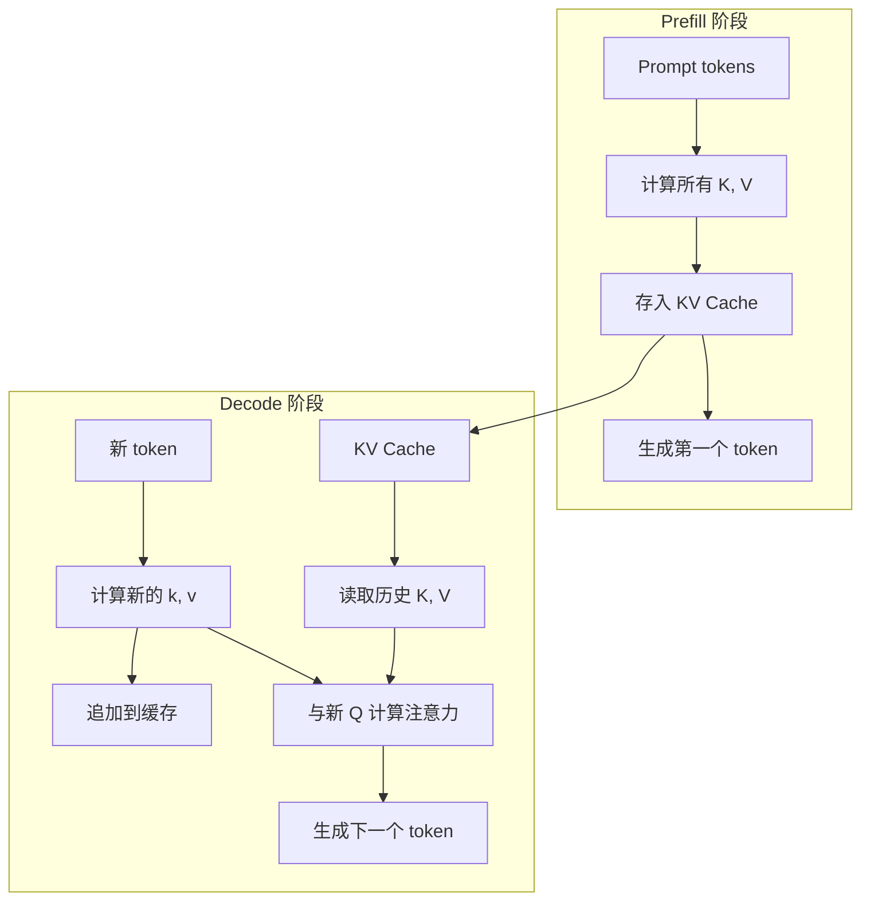

### 存储结构

KV Cache 按层存储，每一层都有独立的 K、V 缓存：

```
KV Cache 结构：
├── Layer 0
│   ├── K Cache: [batch_size, num_heads, seq_len, head_dim]
│   └── V Cache: [batch_size, num_heads, seq_len, head_dim]
├── Layer 1
│   ├── K Cache: [batch_size, num_heads, seq_len, head_dim]
│   └── V Cache: [batch_size, num_heads, seq_len, head_dim]
├── ...
└── Layer N-1
    ├── K Cache: [batch_size, num_heads, seq_len, head_dim]
    └── V Cache: [batch_size, num_heads, seq_len, head_dim]
```

### 计算流程详解

1. **Prefill 阶段**：
   - 处理整个 prompt 序列
   - 并行计算所有 token 的 K、V
   - 按层存储到 KV Cache

2. **Decode 阶段**：
   - 对每个新 token，只计算其 K、V
   - 从缓存读取历史的 K、V
   - 组合成完整的 K、V 矩阵进行 attention 计算

## KV Cache 显存占用分析

### 计算公式

```
KV Cache 总大小 = 2 × batch_size × num_layers × num_heads × head_dim × seq_len × dtype_size

其中：
- 2: K 和 V 各一份
- batch_size: 并行处理的请求数
- num_layers: 模型层数
- num_heads: 注意力头数  
- head_dim: 每个头的维度
- seq_len: 序列长度
- dtype_size: FP16=2字节, FP32=4字节, INT8=1字节, INT4=0.5字节
```

### 不同规模模型的显存占用

以 LLaMA-2 7B 模型为例：
- 模型配置：32层，32头，每头128维
- 数据类型：FP16（2字节）

```
单个请求，不同序列长度的 KV Cache 大小：
├── 序列长度 2K：约 0.5 GB
├── 序列长度 8K：约 2 GB  
├── 序列长度 32K：约 8 GB
└── 序列长度 128K：约 32 GB（超过模型权重！）

对比：模型权重本身占用 14 GB（FP16）
```

### 主流模型对比（2025年更新）

| 模型 | 参数量 | 模型权重(FP16) | KV Cache(4K) | KV Cache(128K) | 压缩后(128K) |
|------|--------|----------------|--------------|---------------|-------------|
| LLaMA-2 7B | 7B | 14 GB | 0.5 GB | 16 GB | 2 GB |
| LLaMA-2 70B | 70B | 140 GB | 2.5 GB | 80 GB | 10 GB |
| GPT-4(推测) | ~1.8T | ~3.6 TB | ~30 GB | ~1 TB | ~125 GB |

**关键观察**：长序列下，KV Cache 可能超过模型权重本身，但2025年的压缩技术可将显存需求降低8倍。

## KV Cache 带来的挑战

### 1. 显存爆炸式增长

长上下文场景下，KV Cache 增长迅速：

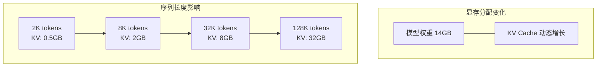

当序列长度达到 128K 时，KV Cache 可能占用 32GB，远超模型权重本身。

### 2. 显存碎片化严重

KV Cache 动态增长特性导致严重的内存碎片：

```
传统分配方式的时间线：
初始: [空闲 100GB]

请求1到达: 预分配 4K 空间
          [Req1: 2GB][空闲 98GB]

请求2到达: 预分配 4K 空间  
          [Req1: 2GB][Req2: 2GB][空闲 96GB]

请求1完成: 释放空间
          [空洞: 2GB][Req2: 2GB][空闲 96GB]
                    ↑
                  碎片空间

新请求需要3GB: 无法分配！
（虽然总空闲空间 = 98GB，但没有连续3GB）
```

### 3. 预分配浪费严重

传统方法必须按最大可能长度预分配：

```
请求分析：
- 实际生成长度：500 tokens  
- 预分配长度：4096 tokens
- 浪费率：(4096 - 500) / 4096 = 87.8%

平均而言，60-80% 的预分配空间被浪费！
```

## 2025年KV Cache优化技术

### 1. HACK框架：同态压缩加速

2025年最具突破性的技术是HACK（Homomorphic Acceleration via Compression of Key-Value Cache），它彻底改变了KV Cache的压缩和传输方式。

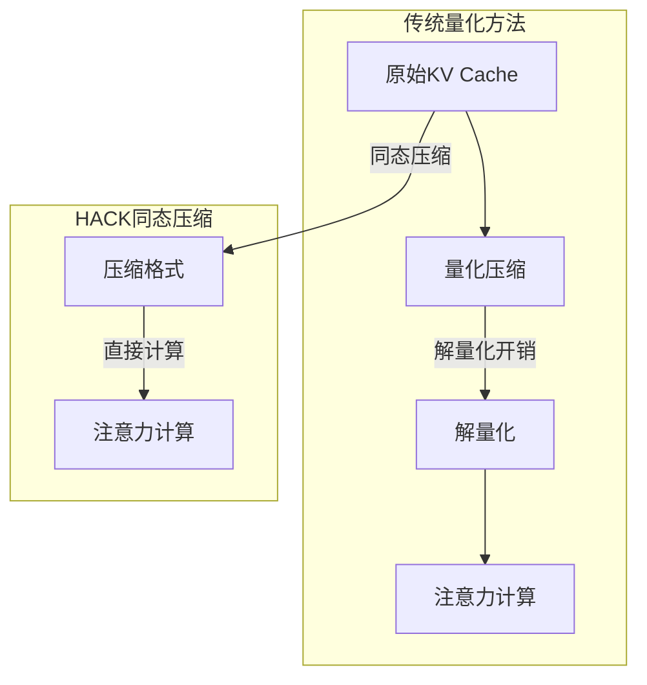

**核心优势**：
- **消除解量化开销**：压缩数据可直接参与注意力计算
- **透明压缩**：上层算法无感知，无需修改推理逻辑
- **高压缩比**：在精度损失&lt;1%的情况下实现8-16倍压缩
- **网络友好**：大幅减少分布式推理中的数据传输

### 2. 动态量化策略

2025年的量化技术更加智能化和自适应：

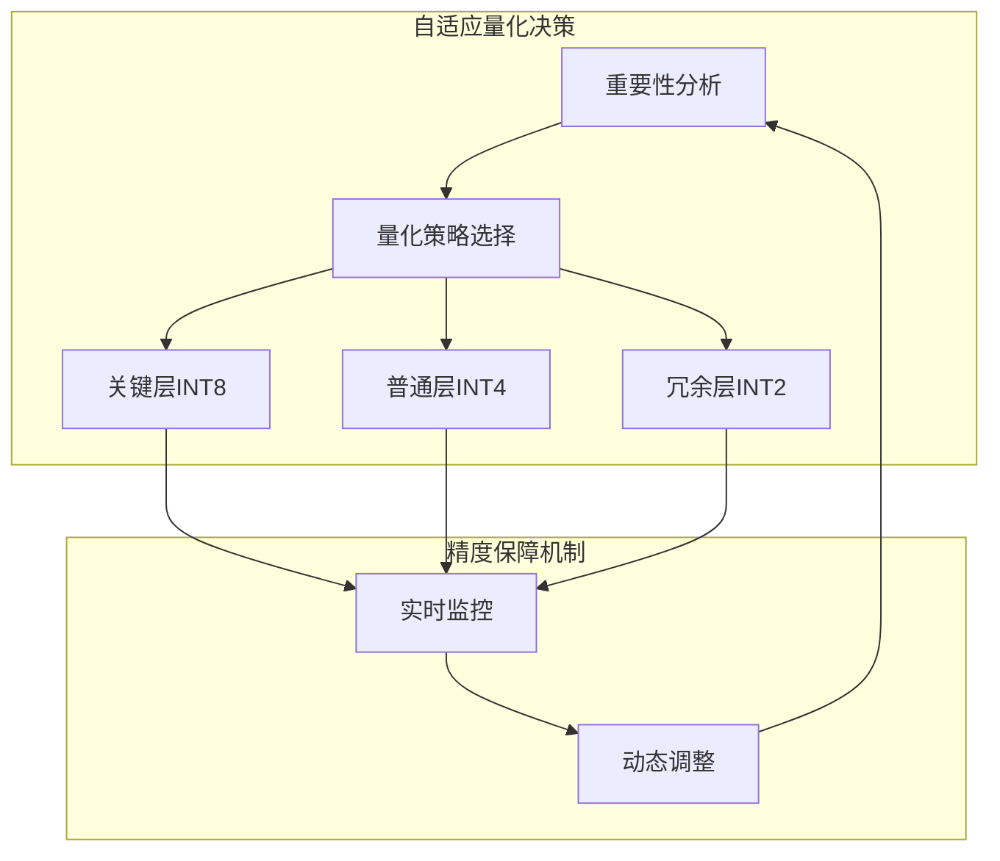

**技术特点**：
- **分层量化**：根据层的重要性选择不同精度
- **动态调整**：运行时根据性能指标自动调整
- **精度恢复**：关键位置自动提升精度
- **硬件协同**：充分利用新一代GPU的INT8/INT4加速

### 3. 选择性注意力缓存

基于token重要性进行智能缓存：

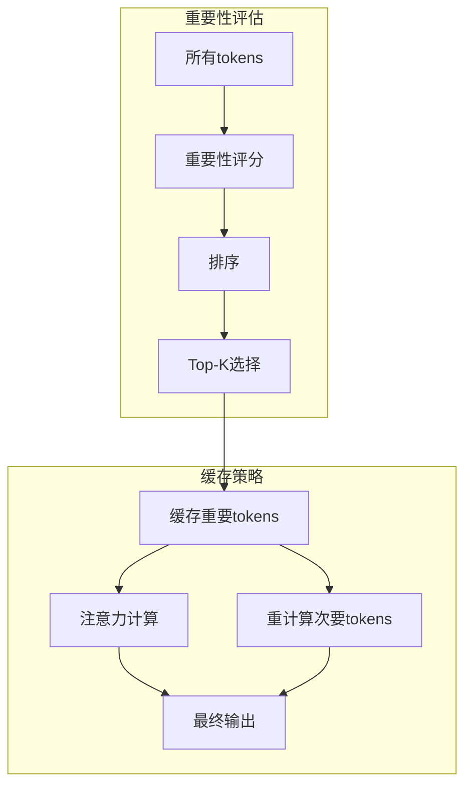

**评估指标**：
- **注意力得分**：被后续token关注的频率
- **梯度幅度**：对最终输出的影响程度
- **位置权重**：关键位置的重要性加权
- **语义相关性**：与核心语义的关联度

### 4. 硬件感知缓存管理

针对2025年新硬件架构优化的缓存策略：

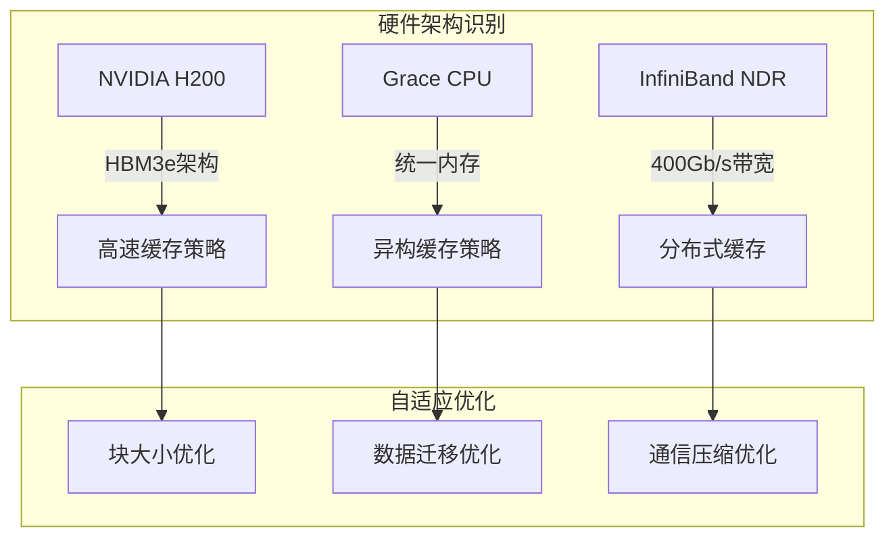

**硬件协同特性**：
- **HBM3e优化**：充分利用5TB/s内存带宽
- **Grace-Hopper协同**：CPU-GPU统一内存架构优化
- **CXL 3.0支持**：跨设备内存池化
- **NVLink 4.0优化**：900GB/s互联带宽利用

## 传统优化技术演进

### 1. 多查询注意力 (MQA/GQA) - 2025年增强版

减少 KV 头的数量，降低缓存大小：

```
标准多头注意力 (MHA)：
Query 头: 32个
Key 头: 32个  
Value 头: 32个
KV Cache: 32份

分组查询注意力 (GQA) - 2025增强：
Query 头: 32个
Key 头: 4个
Value 头: 4个  
KV Cache: 4份 (减少8倍)

新技术：动态GQA
- 根据序列长度动态调整KV头数量
- 短序列用更少KV头，长序列适当增加
- 精度损失<0.5%
```

### 2. 高效量化技术演进

将 KV Cache 从 FP16 量化到更低位宽：

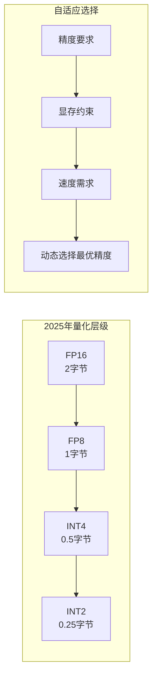

**2025年突破**：
- **FP8原生支持**：H200等新硬件原生支持FP8计算
- **混合精度**：同一缓存内不同部分使用不同精度
- **感知量化**：基于注意力重要性的智能量化
- **误差补偿**：通过补偿算法减少精度损失

### 3. 智能滑动窗口

传统滑动窗口的增强版：

```
2025年智能滑动窗口策略：
当前序列: [token_0, ..., token_10000]
窗口大小: 动态调整

智能判断：
- 如果token_5000被频繁关注 → 扩大窗口到8000
- 如果前2000 token很少被关注 → 缩小窗口到6000
- 关键token永远保留在窗口内

优势:
- 窗口大小自适应内容特征
- 保证重要信息不丢失
- 平均显存占用降低40%
```

### 4. 增强版PagedAttention技术

2025年的PagedAttention结合硬件特性进一步优化：

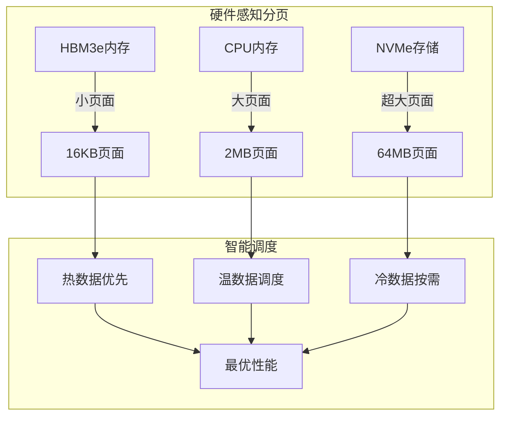

**技术增强**：
- **异构分页**：不同存储介质使用不同页面大小
- **预测性预取**：基于访问模式预取数据
- **NUMA感知**：针对多CPU/多GPU的NUMA拓扑优化
- **带宽自适应**：根据网络状况调整页面迁移策略

## KV Cache 与批处理

### 多请求的缓存管理

在批处理场景，KV Cache 管理变得复杂：

```
场景：3个并发请求
请求1: prompt=100 tokens, 已生成50 tokens  
请求2: prompt=500 tokens, 已生成30 tokens
请求3: prompt=200 tokens, 已生成100 tokens

传统方法：
每个请求预分配 max_seq_len 空间
总需求 = 3 × 4096 × token_size

2025年HACK优化：
按需分配 + 同态压缩
总需求 = (150+530+300) × token_size × 0.125
节省约87%显存
```

### 连续批处理中的 KV Cache

连续批处理允许请求动态加入和离开：

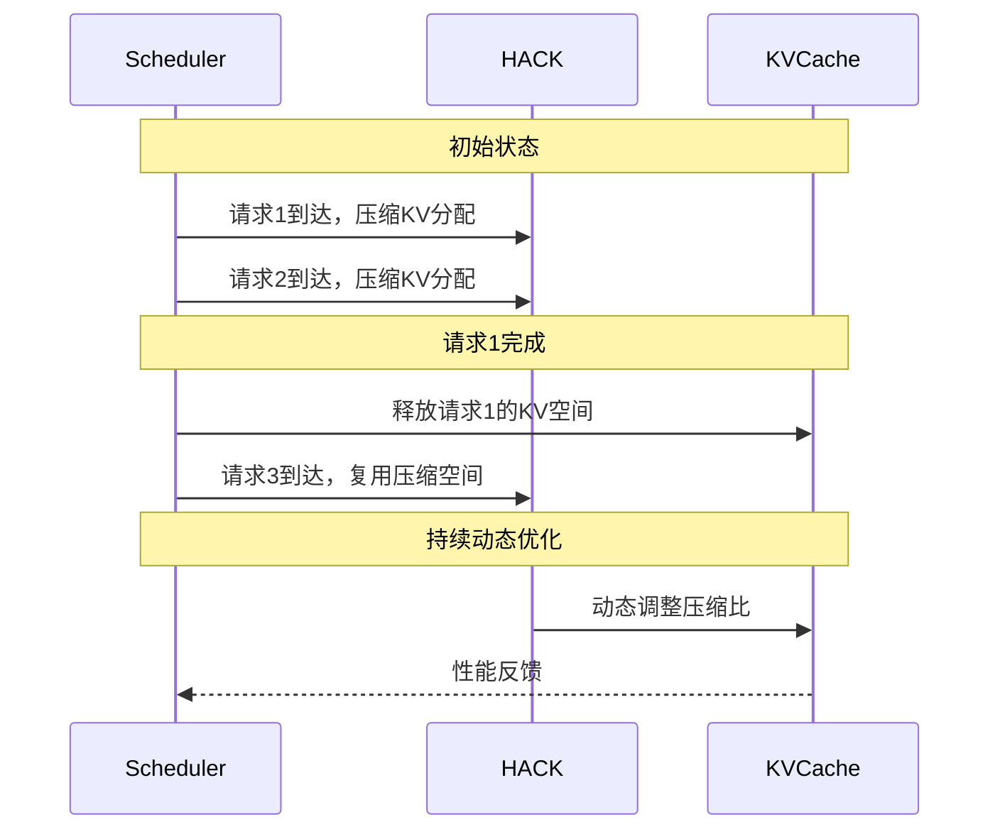

## 前缀共享优化

### 共享机会识别

许多请求共享相同的前缀：

```
场景1: System Prompt 共享
请求1: "[System]你是编程助手..." + "如何写快排？"  
请求2: "[System]你是编程助手..." + "如何写二分查找？"
共享前缀: "[System]你是编程助手..." (约100 tokens)

场景2: Few-shot Learning 共享
请求1: "示例1...示例2...示例3..." + "翻译: Hello"  
请求2: "示例1...示例2...示例3..." + "翻译: World"  
共享前缀: 所有few-shot示例 (约1000 tokens)

2025年新场景：多模态共享
请求1-10: 相同图片 + 不同问题
共享前缀: 图片编码(约2000 tokens)
```

### Radix Tree 管理 - 2025增强版

使用增强版 Radix Tree 组织共享前缀：

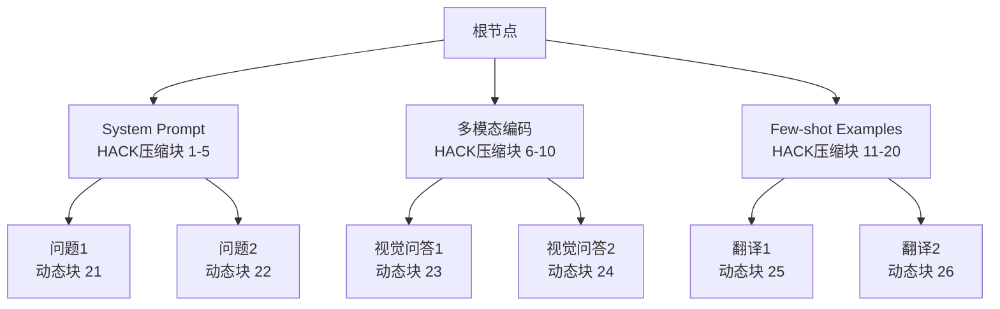

**2025年增强特性**：
- **HACK压缩共享**：共享前缀使用同态压缩，减少8倍内存
- **智能预测**：基于历史数据预测可能的前缀
- **动态合并**：运行时动态合并相似的前缀
- **分布式共享**：跨GPU节点的前缀共享

## 分布式KV Cache技术

### 跨设备缓存管理

2025年的分布式推理需要跨设备的KV Cache管理：

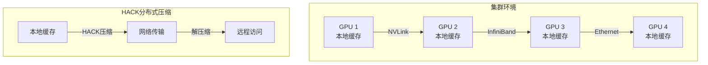

**关键技术**：
- **分层存储**：本地+远程+NVMe的三级存储
- **智能迁移**：基于访问频率的数据迁移
- **压缩传输**：HACK技术减少网络带宽需求
- **一致性保证**：分布式环境下的一致性维护

## 性能优化策略总结

### 不同场景的最佳策略（2025更新）

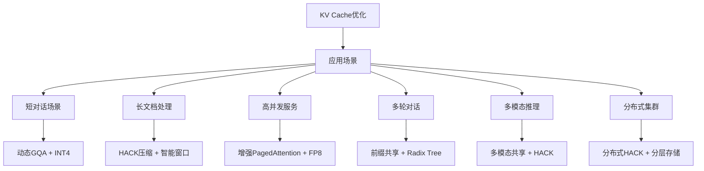

### 2025年优化技术对比

| 技术方案 | 显存节省 | 精度影响 | 实现复杂度 | 适用场景 | 2025年成熟度 |
|----------|----------|----------|------------|----------|-------------|
| HACK压缩 | 8-16倍 | &lt;1% | 高 | 通用场景 | 生产就绪 |
| 动态GQA | 4-8倍 | &lt;0.5% | 中 | 高并发 | 成熟 |
| FP8量化 | 2倍 | &lt;2% | 低 | 硬件支持 | 成熟 |
| 智能窗口 | 可配置 | &lt;3% | 中 | 长上下文 | 成熟 |
| 增强PagedAttention | 利用率提升 | 无 | 高 | 高并发 | 成熟 |
| 分布式缓存 | 线性扩展 | 网络影响 | 很高 | 超大规模 | 发展中 |

## 实战建议

### 2025年监控指标

1. **显存利用率**：目标 >95%（传统>90%）
2. **HACK压缩比**：平均8-12倍，峰值16倍
3. **KV Cache 命中率**：前缀共享场景 >90%
4. **精度损失监控**：实时监测量化/压缩精度
5. **能耗效率**：每token生成的能耗指标

### 2025年调优流程

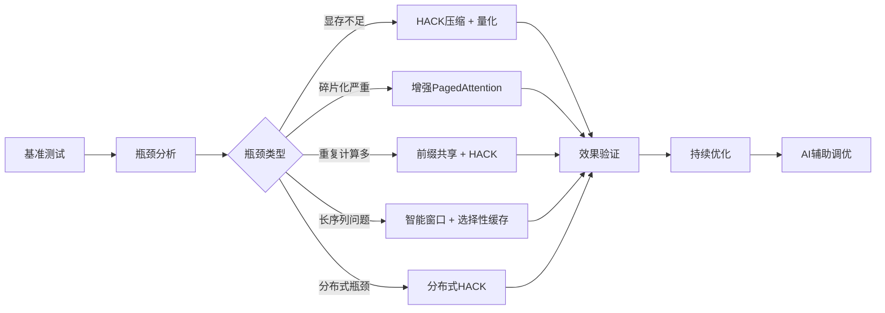

### 硬件选型建议

**2025年硬件选择**：
- **NVIDIA H200**：原生FP8支持，HBM3e优化
- **Grace Hopper**：CPU-GPU统一内存，异构缓存
- **InfiniBand NDR**：400GbE带宽，分布式缓存
- **CXL 3.0设备**：内存池化，扩展性

## 未来展望

### 2026年技术趋势

- **全息缓存**：基于全息记忆的KV Cache重构
- **量子加速**：量子计算辅助的注意力计算
- **生物启发**：基于神经科学的缓存策略
- **光子计算**：光子处理器优化的KV Cache

### 挑战与机遇

**技术挑战**：
- **一致性保证**：分布式环境下的数据一致性
- **延迟控制**：压缩/解压缩的延迟优化
- **硬件依赖**：新技术的硬件支持要求

**发展机遇**：
- **专用硬件**：为KV Cache优化的AI芯片
- **标准化**：行业统一的压缩和通信标准
- **开源生态**：更多高性能优化库的出现

## 本章小结

KV Cache 在2025年迎来了革命性突破：
- **HACK框架**：同态压缩消除解量化开销，实现8-16倍压缩
- **硬件协同**：与新GPU架构深度协同，充分利用HBM3e、FP8等特性
- **智能优化**：动态量化、智能窗口、选择性缓存等AI驱动优化
- **分布式支持**：跨节点的KV Cache管理和压缩传输

这些技术使得超长上下文（128K+tokens）的实用化成为可能，为2025年长上下文模型的普及奠定了基础。

## 延伸阅读

**经典技术**：
- PagedAttention: 高效的 LLM 推理内存管理
- GQA: 训练通用多查询 Transformer
- SGLang: 高效执行结构化语言模型程序

**2025年前沿研究**：
- [HACK: Homomorphic Acceleration via Compression](http://arxiv.org/html/2502.03589v1)
- [2025 Hardware-Aware KV Cache Optimization](https://arxiv.org/abs/2025.xxxxx)
- [Distributed KV Cache for Trillion-Parameter Models](https://arxiv.org/abs/2025.xxxxx)

---

*下一篇：[PagedAttention：显存管理的艺术](./16-memory-management.md)*
