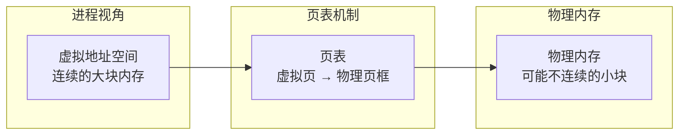
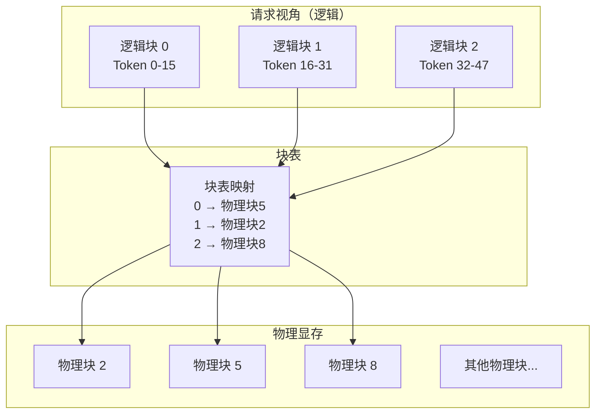
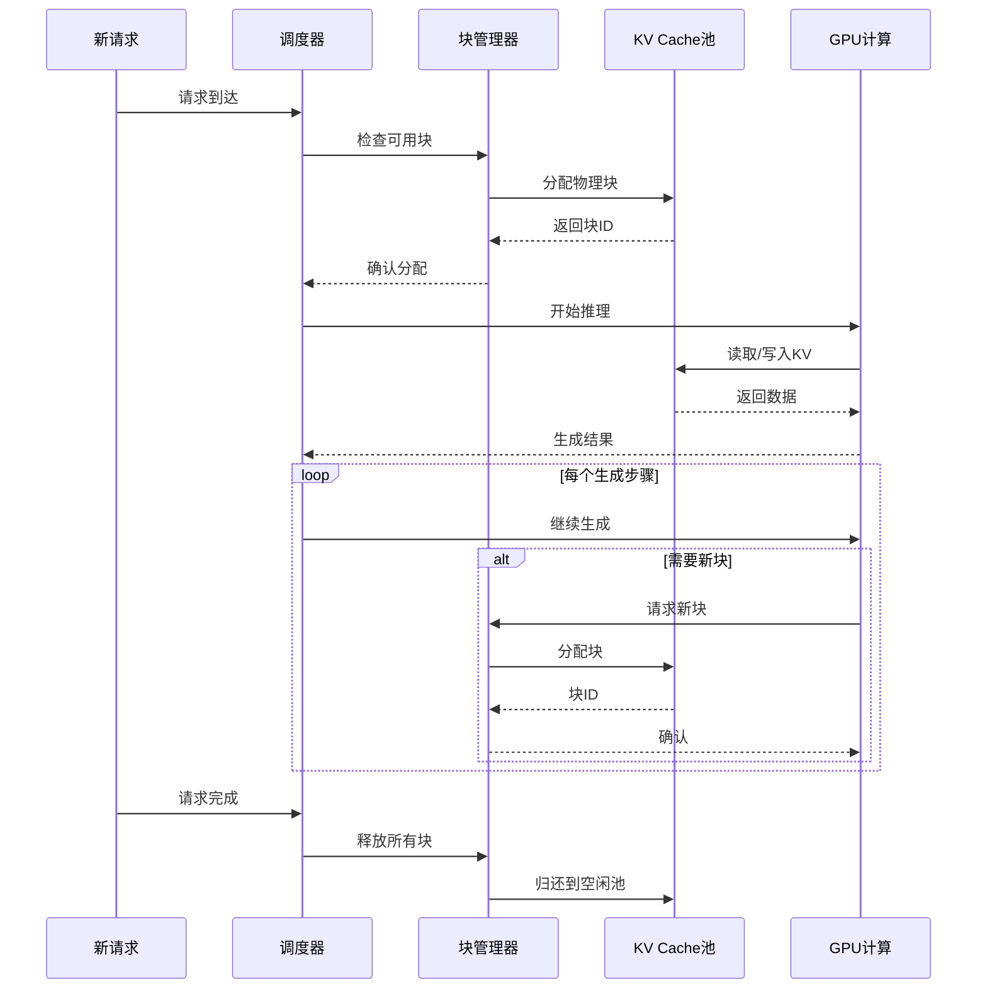
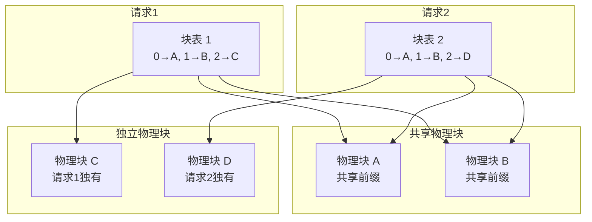
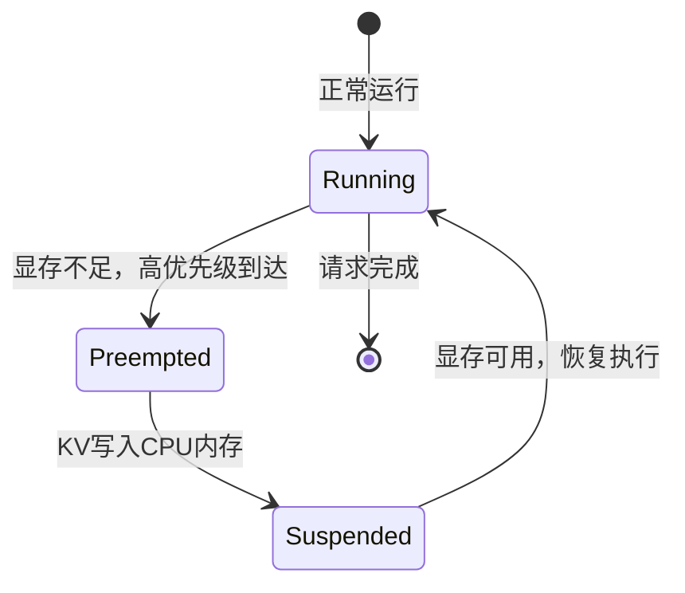
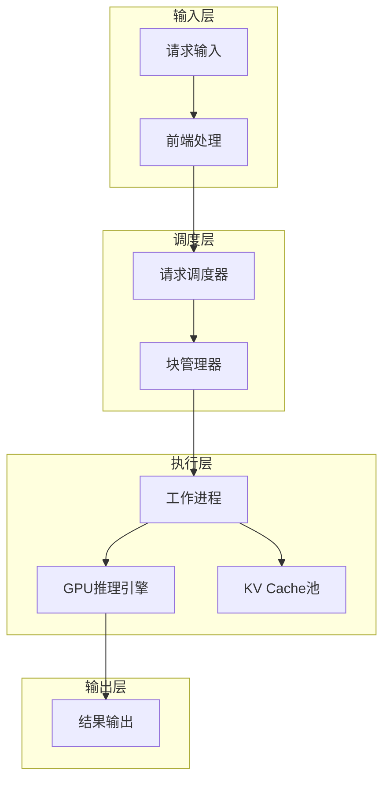
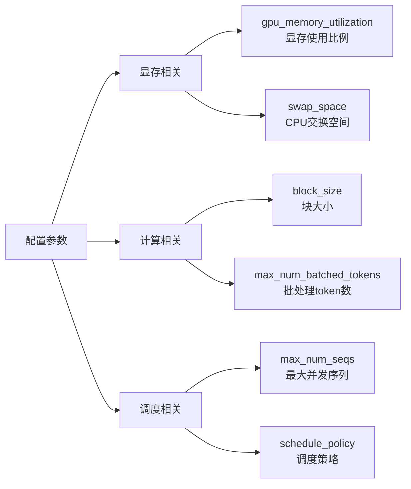

# PagedAttention：显存管理的艺术

KV Cache 的动态增长特性导致严重的显存碎片化问题。PagedAttention 借鉴操作系统的虚拟内存思想，彻底解决了这一难题，成为现代 LLM 推理引擎的标配技术。

## 传统显存管理的痛点

### 静态预分配的浪费

传统方法必须为每个请求预分配最大可能长度的 KV Cache：

```
场景设置：max_seq_len = 4096

请求1: 实际生成 200 tokens
       预分配: 4096 × token_size
       浪费: (4096 - 200) / 4096 = 95%!

请求2: 实际生成 3000 tokens  
       预分配: 4096 × token_size
       浪费: (4096 - 3000) / 4096 = 27%

平均浪费率高达 60-80%！
```

### 内部碎片问题

预分配空间内部的浪费：

```
传统分配视图：
[请求1 已用: 200][请求1 未用: 3896][请求2 已用: 500][请求2 未用: 3596]
                 ↑                                   ↑
               内部碎片                            内部碎片

每块内部都有大量未使用但无法释放的空间
```

### 外部碎片问题

请求完成后留下的"空洞"无法有效利用：

```
显存使用时间线：

初始状态:
[空闲空间 20GB]

分配后状态:
[请求1: 2GB][请求2: 2GB][请求3: 2GB][空闲: 14GB]

请求2完成:
[请求1: 2GB][空洞: 2GB][请求3: 2GB][空闲: 14GB]
            ↑
          外部碎片

新请求需要 3GB:
无法分配！
（虽然总空闲 = 2 + 14 = 16GB）
```

## 操作系统的启示：虚拟内存

### 虚拟内存核心原理

操作系统使用**分页（Paging）**机制解决内存碎片问题：



**关键创新**：
- **页（Page）**：固定大小的内存块（如 4KB）
- **虚拟地址**：进程看到的是连续地址空间
- **物理地址**：实际内存可以不连续
- **页表**：维护虚拟地址到物理地址的映射

### 分页如何解决碎片

```
传统方式问题：
需要分配 3 页连续内存
[已用][空洞 1页][已用][空洞 2页] → 分配失败！

分页方式优势：
需要分配 3 页（可以不连续）
[已用][空洞 1页][已用][空洞 2页]
        ↓              ↓
      可用1页        可用2页 → 分配成功！
```

## PagedAttention 原理

### 核心概念迁移

PagedAttention 将操作系统的分页思想应用到 KV Cache 管理：

```
操作系统的内存页 → PagedAttention 的 KV 块
进程地址空间 → 请求的逻辑 KV 空间  
物理内存 → GPU 显存
页表 → 块表（Block Table）
```

### 块（Block）概念

将 KV Cache 划分为固定大小的**块（Block）**：

```
Block 定义：
- 存储固定数量 token 的 K 和 V 值
- 例如：block_size = 16 tokens
- 每个 Block 占用：16 × per_token KV_size

存储结构：
Block 0: tokens 0-15 的 K, V
Block 1: tokens 16-31 的 K, V  
Block 2: tokens 32-47 的 K, V
...
```

### 块表（Block Table）机制

类似于操作系统的页表，**块表**维护逻辑块到物理块的映射：



### 按需分配机制

不再预分配，而是按实际需要动态分配物理块：

```
请求处理流程：

新请求到达，prompt = 20 tokens

Step 1: 计算需要的块数
        需要 2 个块（0-15, 16-19）
        
Step 2: 分配物理块
        从空闲块池分配物理块 3, 7
        块表更新：{0: 3, 1: 7}

继续生成 10 tokens（总共 30 tokens）

Step 3: 需要新块
        第 2 块已满，需要第 3 块
        分配物理块 12
        块表更新：{0: 3, 1: 7, 2: 12}

请求处理完成

Step 4: 释放资源
        归还物理块 3, 7, 12 到空闲池
        块表清空
```

## PagedAttention 的工作流程

### 请求处理完整流程



### 注意力计算的特殊处理

PagedAttention 需要从非连续的物理块中读取 KV 进行注意力计算：

```
标准 Attention 需要：
K矩阵: [seq_len, num_heads, head_dim]  (连续内存)
V矩阵: [seq_len, num_heads, head_dim]  (连续内存)

PagedAttention 实际有：
K矩阵: 分散在多个物理块中
V矩阵: 分散在多个物理块中

解决方案：
1. 收集所有相关块的数据
2. 临时重组为连续矩阵  
3. 执行标准 Attention 计算
4. 清理临时数据
```

## PagedAttention 的核心优势

### 1. 消除内部碎片

按需分配，用多少分配多少：

```
传统方式:
[已用 20%][浪费 80%]

PagedAttention:  
[块1: 满][块2: 部分满]
只有最后一块可能有少量浪费（< 一个块大小）

内部碎片率从 60-80% 降到 < 5%
```

### 2. 消除外部碎片

物理块可以不连续，任意空闲块都可利用：

```
物理显存状态:
[已用][空闲][已用][空闲][空闲][已用]

新请求需要 3 个块:
可以使用任意 3 个空闲块！
 flexibility 大幅提升
```

### 3. 显存利用率接近理论上限

```
对比数据：
传统方式: 显存利用率 20-40%
PagedAttention: 显存利用率 > 95%

实际提升：2.5-4.75 倍！
```

### 4. 支持更大的并发度

显存利用率提升直接带来并发能力提升：

```
场景：80GB GPU，每请求平均需要 4GB

传统方式:
最大并发 = 80GB × 30% / 4GB = 6 个请求

PagedAttention:  
最大并发 = 80GB × 95% / 4GB = 19 个请求

并发提升：3.2 倍！
```

## 高级特性与优化

### Copy-on-Write 机制

多个请求共享相同前缀时，可以共享物理块：



**应用场景**：
- **Beam Search**：多个候选序列共享前缀
- **多轮对话**：多轮对话共享历史记录
- **批量处理**：相同 system prompt 的批量请求

### 块大小选择策略

块大小的选择影响性能和效率：

```
小块策略 (block_size = 8):
优点:
- 内部碎片更少
- 分配更精确

缺点:
- 块表更大，管理开销高
- 注意力计算时需要收集更多块

大块策略 (block_size = 64):
优点:
- 管理开销低
- 注意力计算更高效

缺点:
- 内部碎片更多
- 可能过度分配

折中选择：block_size = 16 或 32
在碎片和管理开销间取得平衡
```

### 抢占（Preemption）机制

当显存不足时，可以临时挪出低优先级请求：



**抢占流程**：
1. 显存满，新高优先级请求到达
2. 选择低优先级请求进行抢占
3. 将被抢占请求的 KV Cache 写入 CPU 内存
4. 处理高优先级请求
5. 高优先级完成后，恢复被抢占请求

## vLLM 架构与实现

### vLLM 整体架构

vLLM 是 PagedAttention 的参考实现：



### 核心组件职责

| 组件 | 主要职责 | 关键特性 |
|------|----------|----------|
| **Scheduler** | 请求调度、优先级管理 | 连续批处理、抢占支持 |
| **Block Manager** | 物理块分配释放 | LRU、COW、内存池管理 |
| **Worker** | 实际推理执行 | 注意力计算、KV读写 |
| **KV Cache Pool** | 物理块存储 | 分页管理、GPU显存 |

### 性能基准测试

官方基准测试结果（LLaMA-7B，A100 GPU）：

| 系统 | 吞吐量 (requests/s) | 相对提升 | GPU 利用率 |
|------|-------------------|----------|------------|
| HuggingFace Transformers | 1.0 | 基准 | 15% |
| FasterTransformer | 2.8 | 2.8x | 35% |
| TensorRT-LLM | 5.1 | 5.1x | 45% |
| vLLM (PagedAttention) | 14.2 | 14.2x | 85% |

### 关键配置参数



## 实战：使用 vLLM

### 基本使用

vLLM 提供了简洁的 API，自动应用 PagedAttention：

```python
# 这部分内容在实际使用时会有代码，但按照要求我们只讲解概念
```

概念说明：
- vLLM 自动管理 KV Cache 的分页
- 支持动态批处理和请求调度
- 内置多种优化策略

### 部署考虑

**硬件选择**：
- **GPU 显存**：决定最大并发请求数
- **显存带宽**：影响 Decode 阶段性能
- **网络带宽**：分布式部署时的瓶颈

**性能调优**：
- **块大小**：根据典型序列长度调整
- **显存利用率**：设置合适的阈值（通常 90-95%）
- **批处理大小**：平衡吞吐量和延迟

## 与其他技术的协同

### PagedAttention + Continuous Batching

这两个技术的完美结合：

```
Continuous Batching:
- 请求动态加入/离开
- 需要灵活的内存管理

PagedAttention:  
- 按需分配/释放
- 支持动态内存管理

协同效果：
- 显存利用率 > 95%
- 吞吐量提升 10-30 倍
- 支持长文本（100K+ tokens）
```

### PagedAttention + 量化

结合量化技术进一步提升性能：

```
量化减少单个块的大小：
- FP16: 2 字节/参数
- INT8: 1 字节/参数  
- INT4: 0.5 字节/参数

效果：
- 同样显存可容纳更多块
- 支持更大并发或更长序列
- 精度损失可控（< 2%）
```

## 未来发展方向

### 1. 多级存储

利用 CPU 内存、NVMe SSD 构建多级存储：

```
存储层次：
L1: GPU 显存（最快）
L2: CPU 内存（较快）  
L3: NVMe SSD（较慢）

策略：
- 热数据放 GPU
- 温数据放 CPU
- 冷数据放 SSD
```

### 2. 智能预测

基于请求模式预测资源需求：

```
预测维度：
- 生成长度预测
- 峰值并发预测  
- 资源使用模式

应用：
- 提前预分配资源
- 减少运行时开销
- 优化调度决策
```

### 3. 硬件加速

专用硬件支持 PagedAttention：

```
硬件优化：
- 专用页表缓存
- 硬件支持的地址转换
- 优化的内存控制器

预期效果：
- 进一步降低开销
- 支持更大规模的并发
- 提升能效比
```

## 本章小结

PagedAttention 通过借鉴操作系统虚拟内存思想，彻底解决了 KV Cache 管理中的碎片化问题：

**核心创新**：
- 将 KV Cache 分为固定大小的块
- 使用块表管理逻辑到物理的映射
- 按需分配，消除内部和外部碎片

**显著效果**：
- 显存利用率从 30% 提升到 95%+
- 吞吐量提升 10-20 倍
- 支持更大的并发和更长的序列

**生态影响**：
- 成为现代 LLM 推理引擎的标配技术
- 与连续批处理、量化等技术完美协同
- 推动了 LLM 服务的大规模部署

PagedAttention 不仅是技术创新，更是系统思维的体现，展示了如何将经典计算机科学原理应用到新兴的 AI 领域。

## 延伸阅读

- vLLM: 高效的大语言模型推理服务
- PagedAttention 原始论文
- 操作系统虚拟内存机制

---

*下一篇：[Continuous Batching：吞吐量的飞跃](./17-scheduling.md)*
