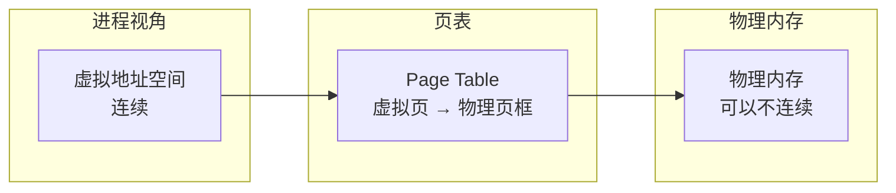
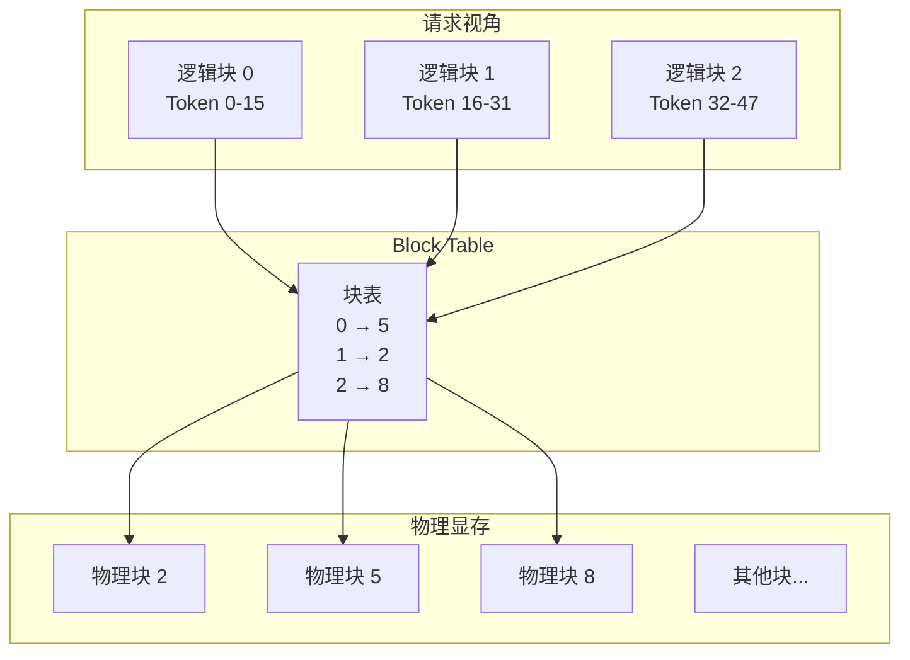
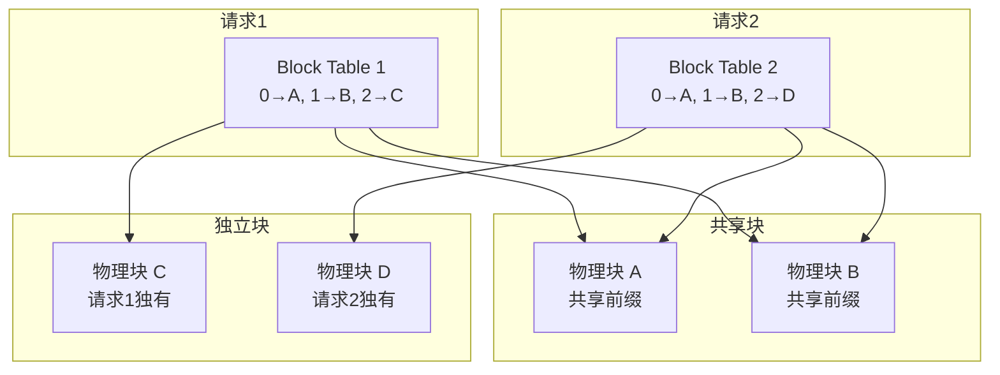
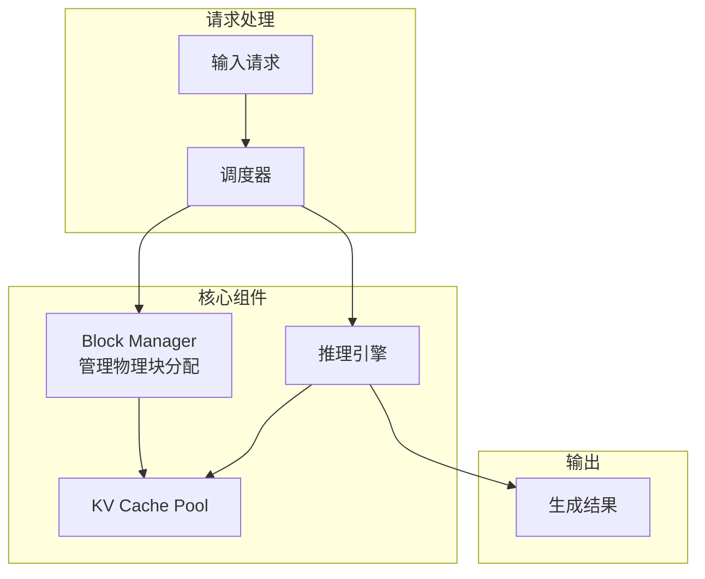

# PagedAttention：显存管理的艺术

KV Cache 的动态增长特性导致严重的显存碎片化问题。PagedAttention 借鉴操作系统的虚拟内存思想，彻底解决了这一难题，成为现代 LLM 推理引擎的标配技术。

## 传统显存管理的痛点

### 静态预分配

传统方法必须为每个请求预分配最大可能长度的 KV Cache：

```
场景: max_seq_len = 4096

请求1: 实际生成 200 tokens
       预分配: 4096 × token_size
       浪费: (4096 - 200) / 4096 = 95%!

请求2: 实际生成 3000 tokens
       预分配: 4096 × token_size
       浪费: (4096 - 3000) / 4096 = 27%
```

**平均浪费率高达 60-80%！**

### 内部碎片 (Internal Fragmentation)

预分配空间内部的浪费：

```
[请求1 已用: 200][请求1 未用: 3896][请求2 已用: 500][请求2 未用: 3596]
                 ↑                                   ↑
               内部碎片                            内部碎片
```

### 外部碎片 (External Fragmentation)

请求完成后留下的"空洞"：

```
初始:
[空闲 20GB]

分配后:
[请求1: 2GB][请求2: 2GB][请求3: 2GB][空闲: 14GB]

请求2完成:
[请求1: 2GB][空洞: 2GB][请求3: 2GB][空闲: 14GB]
            ↑
          外部碎片（可能无法利用）

新请求需要 3GB:
无法分配！（虽然总空闲 = 2 + 14 = 16GB）
```

## 操作系统的启示：虚拟内存

### 虚拟内存原理

操作系统使用**分页（Paging）**机制管理内存：



**关键思想**：
- 将内存划分为固定大小的**页（Page）**
- 进程看到的是**连续的虚拟地址**
- 实际物理内存可以**不连续**
- **页表**维护虚拟到物理的映射

### 为什么这能解决碎片？

```
传统方式:
需要分配 3 页连续内存
[已用][空洞 1页][已用][空洞 2页] → 失败！

分页方式:
需要分配 3 页（可以不连续）
[已用][空洞 1页][已用][空洞 2页]
        ↓              ↓
      可用1页        可用2页 → 成功！
```

## PagedAttention 原理

### 核心概念

PagedAttention 将 KV Cache 划分为固定大小的**块（Block）**：

```
Block: 存储固定数量 token 的 KV 值

例如: block_size = 16
一个 Block 存储 16 个 token 的 K 和 V
```

### Block Table

类似于操作系统的页表，**Block Table** 维护逻辑块到物理块的映射：



### 按需分配

不再预分配，而是按需分配物理块：

```
请求到达，prompt = 20 tokens

Step 1: 需要 2 个块（0-15, 16-19）
        分配物理块 3, 7
        Block Table: {0: 3, 1: 7}

生成 10 tokens (总共 30 tokens)

Step 2: 第 2 块满了，需要第 3 块
        分配物理块 12
        Block Table: {0: 3, 1: 7, 2: 12}

生成完成，释放

Step 3: 归还物理块 3, 7, 12
        Block Table: 删除
```

### 代码示意

```python
class PagedKVCache:
    def __init__(self, num_blocks, block_size, num_layers, num_heads, head_dim):
        self.block_size = block_size
        # 物理块池
        self.k_cache = torch.zeros(
            num_blocks, num_layers, block_size, num_heads, head_dim
        )
        self.v_cache = torch.zeros(
            num_blocks, num_layers, block_size, num_heads, head_dim
        )
        # 空闲块列表
        self.free_blocks = list(range(num_blocks))
        # 每个请求的 Block Table
        self.block_tables = {}  # request_id -> [block_ids]
    
    def allocate_block(self):
        """分配一个物理块"""
        if not self.free_blocks:
            raise MemoryError("No free blocks available")
        return self.free_blocks.pop()
    
    def free_block(self, block_id):
        """释放一个物理块"""
        self.free_blocks.append(block_id)
    
    def append_token(self, request_id, layer_idx, k, v):
        """追加一个 token 的 KV"""
        if request_id not in self.block_tables:
            self.block_tables[request_id] = []
        
        block_table = self.block_tables[request_id]
        num_tokens = sum(self.block_size for _ in block_table)  # 简化
        
        # 检查是否需要新块
        if num_tokens % self.block_size == 0:
            new_block = self.allocate_block()
            block_table.append(new_block)
        
        # 写入 KV
        block_id = block_table[-1]
        slot = num_tokens % self.block_size
        self.k_cache[block_id, layer_idx, slot] = k
        self.v_cache[block_id, layer_idx, slot] = v
```

### Attention 计算

PagedAttention 需要从非连续的物理块中读取 KV：

```python
def paged_attention(q, kv_cache, block_table, seq_len):
    """
    q: (num_heads, head_dim) - 当前 token 的 query
    kv_cache: PagedKVCache 实例
    block_table: [block_ids] - 当前请求的块表
    seq_len: 当前序列长度
    """
    num_blocks = (seq_len + kv_cache.block_size - 1) // kv_cache.block_size
    
    # 收集所有相关的 K, V
    all_k = []
    all_v = []
    for i in range(num_blocks):
        block_id = block_table[i]
        if i < num_blocks - 1:
            # 完整块
            all_k.append(kv_cache.k_cache[block_id])
            all_v.append(kv_cache.v_cache[block_id])
        else:
            # 最后一块可能不完整
            tokens_in_last = seq_len % kv_cache.block_size or kv_cache.block_size
            all_k.append(kv_cache.k_cache[block_id, :tokens_in_last])
            all_v.append(kv_cache.v_cache[block_id, :tokens_in_last])
    
    k = torch.cat(all_k, dim=0)  # (seq_len, num_heads, head_dim)
    v = torch.cat(all_v, dim=0)
    
    # 标准注意力计算
    scores = torch.matmul(q, k.transpose(-2, -1)) / math.sqrt(q.shape[-1])
    attention = F.softmax(scores, dim=-1)
    output = torch.matmul(attention, v)
    
    return output
```

## PagedAttention 的优势

### 1. 消除内部碎片

按需分配，用多少分配多少：

```
传统: [已用 20%][浪费 80%]
Paged: [Block 1: 满][Block 2: 部分满]
       只有最后一块有少量浪费（< block_size）
```

### 2. 消除外部碎片

物理块可以不连续，任意空闲块都可利用：

```
物理显存: [已用][空闲][已用][空闲][空闲][已用]

新请求需要 3 块:
可以使用任意 3 个空闲块！
```

### 3. 显存利用率接近 100%

```
传统方式: 显存利用率 20-40%
PagedAttention: 显存利用率 > 95%
```

### 4. 支持更大的 Batch Size

显存利用率提升 → 可以同时处理更多请求：

```
传统: 80GB 显存，每请求预分配 4GB → 最多 20 请求
Paged: 80GB 显存，按需分配 → 可达 100+ 请求
```

## 高级特性

### Copy-on-Write (COW)

多个请求共享相同前缀时，可以共享物理块：



**应用场景**：
- Beam Search（多个候选共享前缀）
- 多轮对话（共享历史）
- 批量处理相同 system prompt

### 块大小选择

```
小 block_size (如 8):
- 优点: 内部碎片少
- 缺点: 块表大，管理开销高

大 block_size (如 64):
- 优点: 管理开销低
- 缺点: 内部碎片多

典型选择: block_size = 16 或 32
```

### Preemption（抢占）

当显存不足时，可以临时挪出低优先级请求：

```
Step 1: 显存满，新高优先级请求到达
Step 2: 暂停低优先级请求，将其 KV 写入 CPU 内存
Step 3: 处理高优先级请求
Step 4: 高优先级完成，恢复低优先级请求
```

## vLLM 架构

vLLM 是 PagedAttention 的参考实现：



### 关键组件

| 组件 | 职责 |
|------|------|
| **Scheduler** | 决定处理哪些请求 |
| **Block Manager** | 管理物理块的分配和释放 |
| **Block Allocator** | 低层块分配器 |
| **KV Cache Pool** | 物理块存储 |

## 性能对比

### 吞吐量提升

| 系统 | 请求/秒 | 相对提升 |
|------|---------|----------|
| HuggingFace | 1x | 基准 |
| FasterTransformer | 2-3x | - |
| vLLM (PagedAttention) | 10-24x | - |

### 显存效率

```
模型: LLaMA-13B
最大序列长度: 2048
GPU: A100 80GB

传统方式:
- 显存利用率: 30%
- 最大并发: 16 请求

PagedAttention:
- 显存利用率: 95%+
- 最大并发: 50+ 请求
```

## 实战：使用 vLLM

```python
from vllm import LLM, SamplingParams

# 创建 LLM 实例（自动使用 PagedAttention）
llm = LLM(
    model="meta-llama/Llama-2-7b-chat-hf",
    tensor_parallel_size=1,  # GPU 数量
    gpu_memory_utilization=0.9,  # 显存利用率
    max_num_seqs=256,  # 最大并发请求数
)

# 定义采样参数
sampling_params = SamplingParams(
    temperature=0.8,
    top_p=0.95,
    max_tokens=100,
)

# 批量推理
prompts = [
    "What is the capital of France?",
    "Explain quantum computing in simple terms.",
    "Write a haiku about programming.",
]

outputs = llm.generate(prompts, sampling_params)

for output in outputs:
    prompt = output.prompt
    generated_text = output.outputs[0].text
    print(f"Prompt: {prompt[:50]}...")
    print(f"Output: {generated_text}\n")
```

### 配置参数

```python
# 关键参数
llm = LLM(
    model="...",
    block_size=16,  # 块大小（token 数）
    gpu_memory_utilization=0.9,  # GPU 显存使用比例
    swap_space=4,  # CPU 交换空间（GB），用于 preemption
    max_num_batched_tokens=8192,  # 单批最大 token 数
    max_num_seqs=256,  # 最大并发序列数
)
```

## 本章小结

- PagedAttention 借鉴操作系统虚拟内存思想
- 将 KV Cache 划分为固定大小的块，按需分配
- Block Table 维护逻辑块到物理块的映射
- 彻底解决内部碎片和外部碎片问题
- 显存利用率从 30% 提升到 95%+
- vLLM 是 PagedAttention 的参考实现

## 延伸阅读

- Efficient Memory Management for Large Language Model Serving with PagedAttention (vLLM 论文)
- vLLM GitHub: https://github.com/vllm-project/vllm
- Operating System Concepts (虚拟内存部分)

---

*下一篇：[Continuous Batching：吞吐量的飞跃](./17-scheduling.md)*
