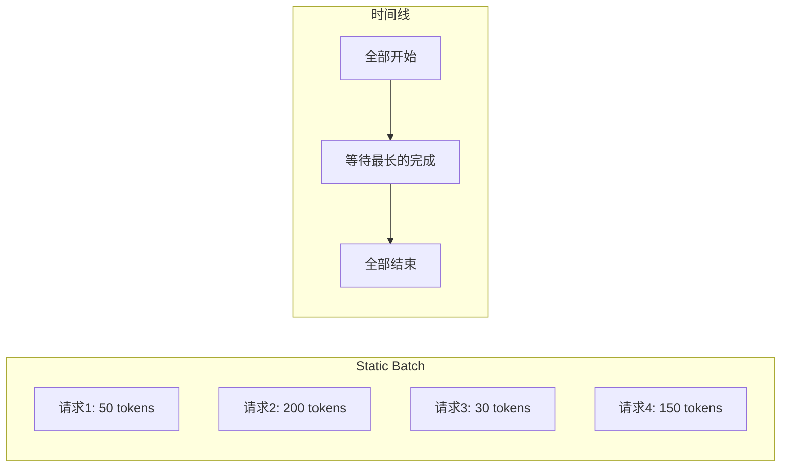
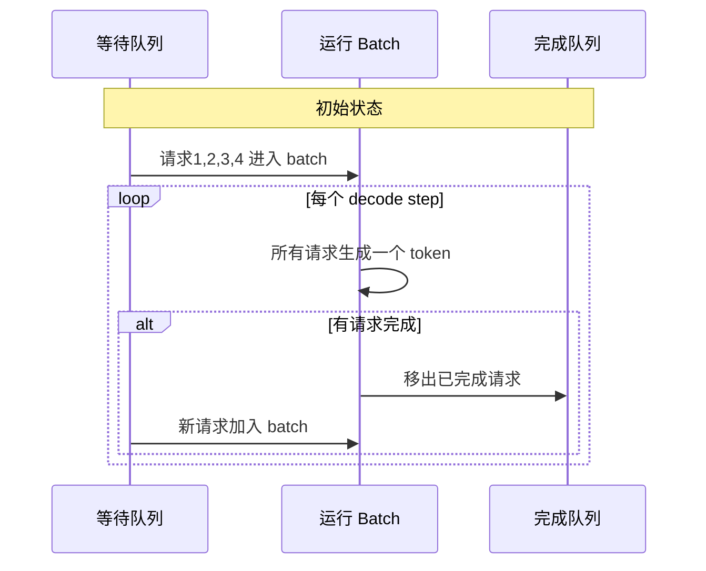
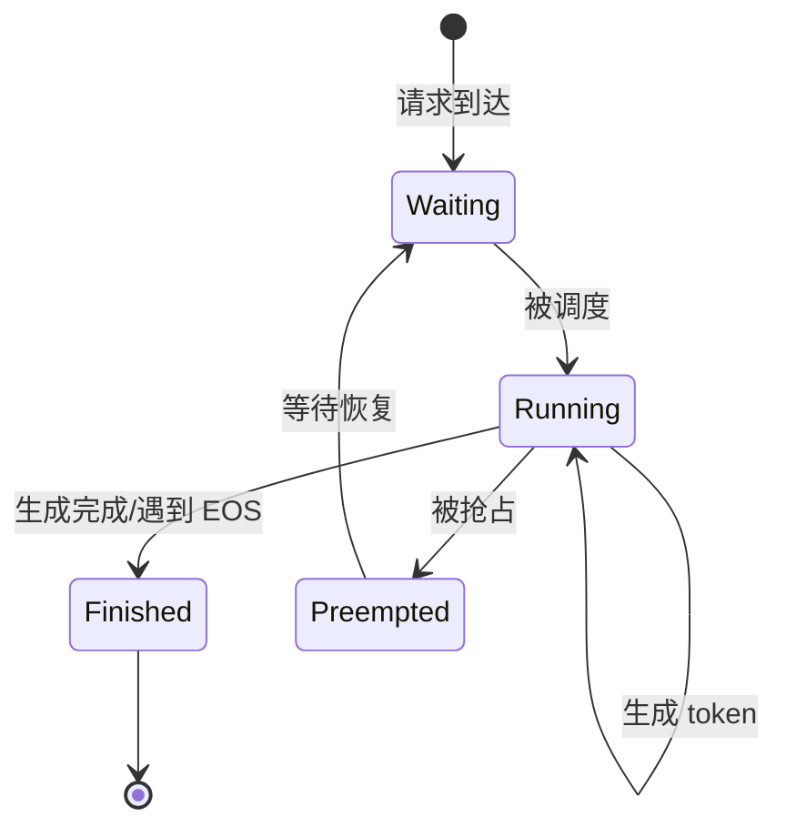
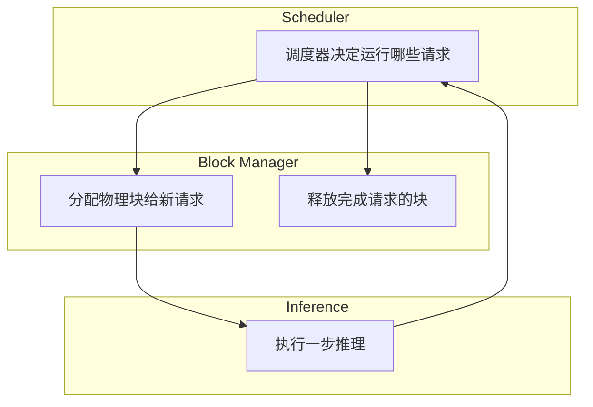

# Continuous Batching：吞吐量的飞跃

传统的静态批处理在 LLM 推理中效率低下，因为不同请求的生成长度差异巨大。Continuous Batching（连续批处理）通过迭代级调度，彻底打破了这一限制。

## 静态批处理的困境

### 什么是静态批处理？

传统批处理将多个请求组成一个 batch，一起处理直到全部完成：



### 短板效应

一个 batch 的处理时间由**最长的请求**决定：

```
Batch 内请求:
- 请求1: 生成 50 tokens  (完成时间: 50ms)
- 请求2: 生成 200 tokens (完成时间: 200ms)
- 请求3: 生成 30 tokens  (完成时间: 30ms)
- 请求4: 生成 150 tokens (完成时间: 150ms)

静态批处理:
所有请求必须等待请求2完成（200ms）

请求1 等待时间: 200 - 50 = 150ms (浪费!)
请求3 等待时间: 200 - 30 = 170ms (浪费!)
```

### Padding 浪费

短请求必须 padding 到最长请求的长度：

```
时间轴 (每格 = 10 tokens):
请求1: [████████-------------------] 生成 50, padding 150
请求2: [████████████████████████████] 生成 200
请求3: [███------------------------] 生成 30, padding 170
请求4: [███████████████------------] 生成 150, padding 50

'-' = 无效计算 (浪费 GPU 算力)
```

**计算浪费率**：(150 + 170 + 50) / (4 × 200) = 46%

## Continuous Batching 原理

### 核心思想：迭代级调度

**Iteration-level scheduling**：不再等待整个 batch 完成，而是每生成一个 token 后重新调度。

```
传统: Batch 级调度
      [整个 Batch 开始] → [整个 Batch 结束]

Continuous: 迭代级调度
      [Step 1] → [检查完成] → [Step 2] → [检查完成] → ...
```

### 工作流程



### 动态演示

```
时间步 0:
等待队列: [请求5, 请求6, ...]
运行中: [请求1(0/50), 请求2(0/200), 请求3(0/30), 请求4(0/150)]

时间步 30 (请求3 完成):
等待队列: [请求6, ...]
运行中: [请求1(30/50), 请求2(30/200), 请求5(0/80), 请求4(30/150)]
完成: [请求3]
       ↑
       请求3 完成，请求5 立即加入！

时间步 50 (请求1 完成):
等待队列: [...]
运行中: [请求6(0/100), 请求2(50/200), 请求5(20/80), 请求4(50/150)]
完成: [请求3, 请求1]

... 持续进行 ...
```

## 请求状态管理

### 状态机



### 状态定义

```python
from enum import Enum

class RequestState(Enum):
    WAITING = "waiting"      # 等待被调度
    RUNNING = "running"      # 正在生成
    PREEMPTED = "preempted"  # 被抢占（显存不足）
    FINISHED = "finished"    # 完成生成

class Request:
    def __init__(self, request_id, prompt_tokens, max_tokens):
        self.request_id = request_id
        self.prompt_tokens = prompt_tokens
        self.max_tokens = max_tokens
        self.generated_tokens = []
        self.state = RequestState.WAITING
        self.arrival_time = time.time()
```

## 调度策略

### FCFS (First Come First Serve)

最简单的策略：先到先服务。

```python
class FCFSScheduler:
    def __init__(self, max_batch_size):
        self.waiting_queue = []
        self.running_batch = []
        self.max_batch_size = max_batch_size
    
    def add_request(self, request):
        self.waiting_queue.append(request)
    
    def schedule(self):
        """每个 step 调用，返回当前应该运行的请求"""
        # 移出已完成的请求
        self.running_batch = [
            r for r in self.running_batch 
            if r.state == RequestState.RUNNING
        ]
        
        # 填充空位
        while len(self.running_batch) < self.max_batch_size and self.waiting_queue:
            request = self.waiting_queue.pop(0)  # FCFS: 取队首
            request.state = RequestState.RUNNING
            self.running_batch.append(request)
        
        return self.running_batch
```

### 优先级调度

考虑请求优先级或其他因素：

```python
class PriorityScheduler:
    def __init__(self, max_batch_size):
        self.waiting_queue = []
        self.running_batch = []
        self.max_batch_size = max_batch_size
    
    def schedule(self):
        # 按优先级排序等待队列
        self.waiting_queue.sort(key=lambda r: (-r.priority, r.arrival_time))
        
        # 移出已完成的请求
        self.running_batch = [
            r for r in self.running_batch 
            if r.state == RequestState.RUNNING
        ]
        
        # 填充空位
        while len(self.running_batch) < self.max_batch_size and self.waiting_queue:
            request = self.waiting_queue.pop(0)
            request.state = RequestState.RUNNING
            self.running_batch.append(request)
        
        return self.running_batch
```

### Shortest Job First (SJF)

优先处理预期生成长度短的请求：

```python
def sjf_key(request):
    """估计请求的完成时间"""
    # 可以基于 prompt 长度、历史统计等估计
    estimated_length = estimate_output_length(request)
    return estimated_length

self.waiting_queue.sort(key=sjf_key)
```

## Prefill 与 Decode 的调度

### 混合调度的挑战

Prefill 和 Decode 有不同的计算特性：

```
Prefill: 计算密集，处理整个 prompt
Decode:  访存密集，每次只处理一个 token

混在一起会互相影响效率
```

### Chunked Prefill

将长 prompt 的 prefill 分块，与 decode 交替进行：

```
传统: 
[Prefill 10000 tokens] → [Decode ......]
             ↑
      其他请求等待

Chunked Prefill:
[Prefill chunk 1] → [Decode batch] → [Prefill chunk 2] → [Decode batch] → ...
                           ↑
               其他请求可以继续生成
```

```python
class ChunkedPrefillScheduler:
    def __init__(self, max_batch_tokens, prefill_chunk_size=512):
        self.prefill_chunk_size = prefill_chunk_size
        self.max_batch_tokens = max_batch_tokens
    
    def schedule(self):
        batch = []
        total_tokens = 0
        
        # 添加正在 decode 的请求
        for r in self.running_decode:
            batch.append(r)
            total_tokens += 1  # Decode 每请求 1 token
        
        # 添加 prefill（分块）
        for r in self.waiting_prefill:
            remaining = len(r.prompt_tokens) - r.prefill_progress
            chunk = min(remaining, self.prefill_chunk_size)
            
            if total_tokens + chunk <= self.max_batch_tokens:
                batch.append((r, chunk))
                total_tokens += chunk
        
        return batch
```

## 与 PagedAttention 的协同

### 完美搭配

Continuous Batching + PagedAttention = 现代推理引擎的标配

```
Continuous Batching:
- 请求可以随时加入/离开 batch
- 需要灵活的内存管理

PagedAttention:
- 按需分配 KV Cache
- 支持动态内存管理

完美契合！
```

### 协同工作流



## 性能对比

### 吞吐量提升

```
测试配置:
- 模型: LLaMA-2 7B
- GPU: A100 80GB
- 请求: 1000 个，长度 50-500 tokens

静态批处理 (batch_size=32):
- 平均延迟: 2.5s
- 吞吐量: 400 tokens/s
- GPU 利用率: 35%

Continuous Batching:
- 平均延迟: 0.8s
- 吞吐量: 1200 tokens/s
- GPU 利用率: 85%

提升: 3倍吞吐量！
```

### 延迟分布

```
静态批处理:
- 短请求等待长请求
- 延迟分布不均匀
- P99 延迟很高

Continuous Batching:
- 短请求快速完成
- 延迟与生成长度成正比
- P99 延迟显著降低
```

## 实现细节

### 完整调度器示例

```python
class ContinuousBatchingScheduler:
    def __init__(self, max_batch_size, max_batch_tokens):
        self.waiting_queue = []
        self.running_batch = []
        self.max_batch_size = max_batch_size
        self.max_batch_tokens = max_batch_tokens
        self.block_manager = BlockManager()
    
    def add_request(self, request):
        """添加新请求到等待队列"""
        self.waiting_queue.append(request)
    
    def _can_allocate(self, request):
        """检查是否有足够的块分配给请求"""
        required_blocks = self._estimate_blocks(request)
        return self.block_manager.get_free_blocks() >= required_blocks
    
    def _schedule_running(self):
        """处理正在运行的请求"""
        running = []
        for request in self.running_batch:
            if request.is_finished():
                # 释放资源
                self.block_manager.free(request)
                request.state = RequestState.FINISHED
            elif request.state == RequestState.RUNNING:
                running.append(request)
        return running
    
    def _schedule_waiting(self, running):
        """调度等待中的请求"""
        # 计算当前 batch 的 token 数
        current_tokens = sum(r.get_num_tokens() for r in running)
        
        new_running = []
        remaining_waiting = []
        
        for request in self.waiting_queue:
            if len(running) + len(new_running) >= self.max_batch_size:
                remaining_waiting.append(request)
                continue
            
            tokens_needed = request.get_prefill_tokens()
            if current_tokens + tokens_needed > self.max_batch_tokens:
                remaining_waiting.append(request)
                continue
            
            if not self._can_allocate(request):
                remaining_waiting.append(request)
                continue
            
            # 分配资源并加入运行队列
            self.block_manager.allocate(request)
            request.state = RequestState.RUNNING
            new_running.append(request)
            current_tokens += tokens_needed
        
        self.waiting_queue = remaining_waiting
        return running + new_running
    
    def schedule(self):
        """主调度函数"""
        running = self._schedule_running()
        self.running_batch = self._schedule_waiting(running)
        return self.running_batch
```

### 主循环

```python
def serve_forever(model, scheduler, tokenizer):
    """推理服务主循环"""
    while True:
        # 1. 调度
        batch = scheduler.schedule()
        
        if not batch:
            time.sleep(0.001)  # 没有请求，短暂休眠
            continue
        
        # 2. 准备输入
        input_ids = prepare_batch_inputs(batch)
        
        # 3. 执行一步推理
        with torch.no_grad():
            outputs = model.forward(input_ids)
        
        # 4. 采样下一个 token
        for i, request in enumerate(batch):
            next_token = sample(outputs.logits[i])
            request.generated_tokens.append(next_token)
            
            # 检查是否完成
            if next_token == tokenizer.eos_token_id:
                request.mark_finished()
            elif len(request.generated_tokens) >= request.max_tokens:
                request.mark_finished()
        
        # 5. 处理完成的请求（发送响应等）
        for request in batch:
            if request.is_finished():
                send_response(request)
```

## 高级特性

### Prefix Caching

共享相同前缀的请求可以复用 KV Cache：

```
请求1: "你是一个 AI 助手。请回答：什么是机器学习？"
请求2: "你是一个 AI 助手。请回答：什么是深度学习？"

共享前缀: "你是一个 AI 助手。请回答："

只需计算一次前缀的 KV Cache！
```

### Speculative Decoding 集成

结合投机解码进一步提升吞吐：

```
正常 Continuous Batching:
每步生成 1 token/请求

+ Speculative Decoding:
每步可能生成 2-5 tokens/请求
```

## 本章小结

- 静态批处理存在短板效应和 padding 浪费
- Continuous Batching 通过迭代级调度解决这些问题
- 请求可以随时加入和离开 batch
- 与 PagedAttention 完美配合
- 吞吐量提升 2-5 倍

## 延伸阅读

- Orca: A Distributed Serving System for Transformer-Based Generative Models
- vLLM: Easy, Fast, and Cheap LLM Serving
- Efficient Memory Management for Large Language Model Serving with PagedAttention

---

*下一篇：[Radix Attention：前缀复用的极致](./18-radix-attention.md)*
