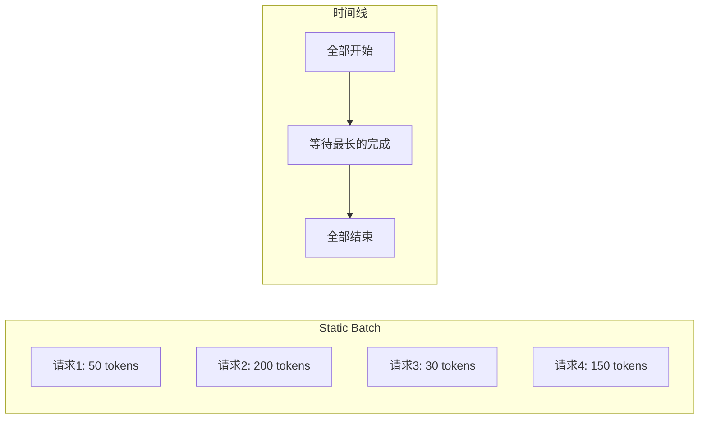
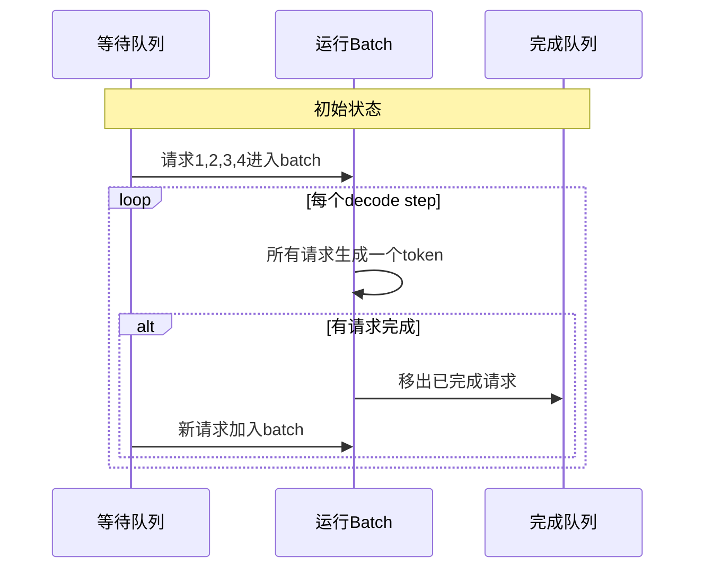
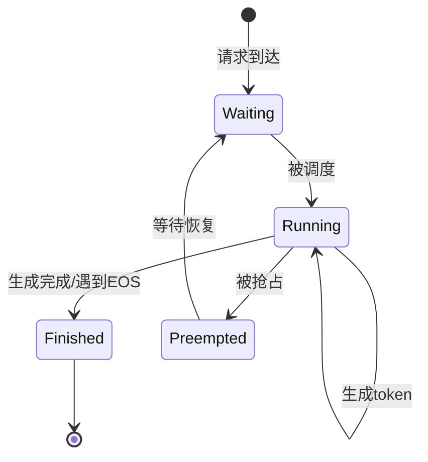
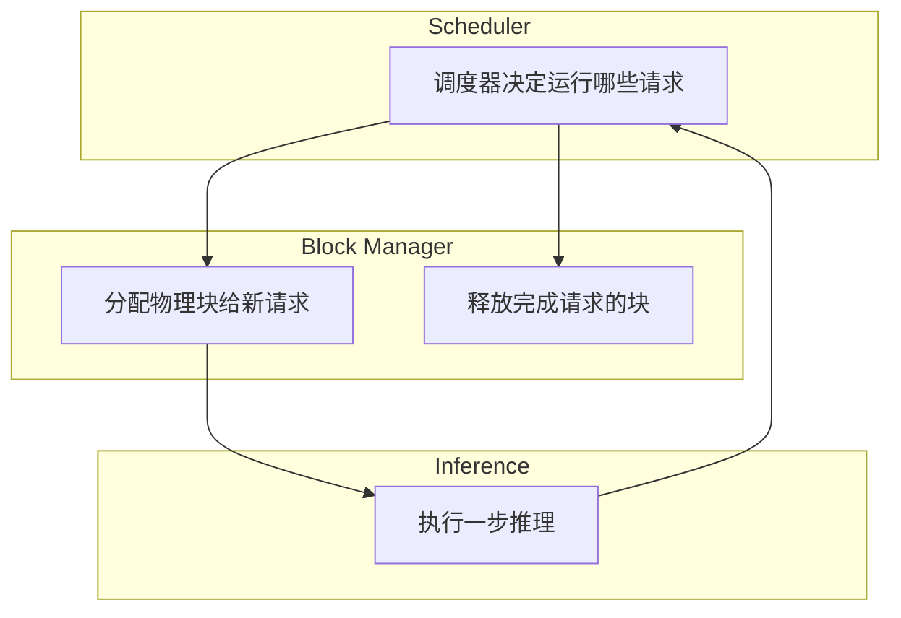

# Continuous Batching：吞吐量的飞跃

传统的静态批处理在LLM推理中效率低下，因为不同请求的生成长度差异巨大。Continuous Batching（连续批处理）通过迭代级调度，彻底打破了这一限制。

## 静态批处理的困境

### 什么是静态批处理？

传统批处理将多个请求组成一个batch，一起处理直到全部完成。这种方式看似简单，却隐藏着严重的效率问题。



### 短板效应

一个batch的处理时间由最长的请求决定。想象一个场景：

```
Batch内请求:
- 请求1: 生成 50 tokens  (完成时间: 50ms)
- 请求2: 生成 200 tokens (完成时间: 200ms)
- 请求3: 生成 30 tokens  (完成时间: 30ms)
- 请求4: 生成 150 tokens (完成时间: 150ms)

静态批处理:
所有请求必须等待请求2完成（200ms）

请求1 等待时间: 200 - 50 = 150ms (严重浪费!)
请求3 等待时间: 200 - 30 = 170ms (严重浪费!)
```

这种效应被称为"木桶原理"，batch的整体性能由最短的那块木板（最长的请求）决定。

### Padding浪费

更严重的是，短请求必须padding到最长请求的长度，导致大量无效计算：

```
时间轴 (每格 = 10 tokens):
请求1: [████████-------------------] 生成 50, padding 150
请求2: [████████████████████████████] 生成 200
请求3: [███------------------------] 生成 30, padding 170
请求4: [███████████████------------] 生成 150, padding 50

'-' = 无效计算 (浪费GPU算力)
```

在这个例子中，计算浪费率高达46%！这意味着将近一半的GPU计算资源被白白浪费了。

## Continuous Batching原理

### 核心思想：迭代级调度

Continuous Batching的核心创新是**iteration-level scheduling**（迭代级调度）。它不再等待整个batch完成，而是每生成一个token后就重新调度。

```
传统: Batch级调度
      [整个Batch开始] → [整个Batch结束]
      
Continuous: 迭代级调度
      [Step 1] → [检查完成] → [Step 2] → [检查完成] → ...
```

这种微小的改变带来了巨大的效率提升。

### 工作流程



### 动态演示过程

让我们通过一个具体例子来理解这个过程：

```
时间步0:
等待队列: [请求5, 请求6, ...]
运行中: [请求1(0/50), 请求2(0/200), 请求3(0/30), 请求4(0/150)]

时间步30 (请求3完成):
等待队列: [请求6, ...]
运行中: [请求1(30/50), 请求2(30/200), 请求5(0/80), 请求4(30/150)]
完成: [请求3]
       ↑
       请求3完成，请求5立即加入！

时间步50 (请求1完成):
等待队列: [...]
运行中: [请求6(0/100), 请求2(50/200), 请求5(20/80), 请求4(50/150)]
完成: [请求3, 请求1]

... 持续进行 ...
```

这种动态调整确保了GPU始终保持高利用率。

## 请求状态管理

### 状态机设计

Continuous Batching需要精细的请求状态管理：



每个请求都会经历这些状态转换，调度器需要实时跟踪和管理这些状态。

### 状态定义

- **Waiting（等待）**：请求刚到达，等待被调度执行
- **Running（运行）**：正在生成token
- **Preempted（抢占）**：因资源不足被暂停，等待恢复
- **Finished（完成）**：生成完成或遇到结束符

这种状态管理使得系统可以灵活处理各种异常情况，如内存不足、请求取消等。

## 调度策略

### FCFS（先来先服务）

最简单的调度策略是先来先服务（First Come First Serve）。这种方法实现简单，但可能不是最高效的。

调度器维护一个等待队列，新的请求总是加入队列尾部。当有空闲位置时，从队列头部取出请求执行。

### 优先级调度

更智能的策略是考虑请求的优先级。可以基于多个因素：

- 用户等级（VIP用户优先）
- 请求紧急程度（实时对话vs批量处理）
- 请求类型（某些类型的请求通常较短）

调度器会按照优先级排序等待队列，确保重要请求优先得到处理。

### 短作业优先（SJF）

短作业优先（Shortest Job First）策略优先处理预期生成长度较短的请求。这种策略可以显著降低平均等待时间。

系统可以通过以下方式估计请求长度：
- 基于prompt长度（通常prompt越长，生成长度也越长）
- 基于历史统计数据（用户习惯、相似问题的平均长度）
- 基于请求类型（某些类型的请求通常较短）

## Prefill与Decode的调度

### 混合调度的挑战

LLM推理包含两个阶段：Prefill和Decode，它们有截然不同的计算特性：

```
Prefill: 计算密集，处理整个prompt
Decode:  访存密集，每次只处理一个token
```

将这两个阶段混合处理会互相影响效率。

### Chunked Prefill解决方案

Chunked Prefill技术将长prompt的prefill过程分块，与decode交替进行：

```
传统方式: 
[Prefill 10000 tokens] → [Decode ......]
             ↑
      其他请求等待
      
Chunked Prefill:
[Prefill chunk 1] → [Decode batch] → [Prefill chunk 2] → [Decode batch] → ...
                           ↑
               其他请求可以继续生成
```

这种方式避免了长prompt阻塞其他请求的问题，提升了系统的响应性。

## 与PagedAttention的协同

### 完美搭配

Continuous Batching与PagedAttention是现代推理引擎的黄金组合：

- **Continuous Batching**：请求可以随时加入/离开batch，需要灵活的内存管理
- **PagedAttention**：按需分配KV Cache，支持动态内存管理

两者完美契合，互相增强。

### 协同工作流



调度器决定哪些请求运行，块管理器负责内存分配和释放，推理引擎执行计算，三者紧密协作。

## 性能对比

### 吞吐量提升

实际测试显示，Continuous Batching可以带来显著的性能提升：

```
测试配置:
- 模型: LLaMA-2 7B
- GPU: A100 80GB
- 请求: 1000个，长度50-500 tokens

静态批处理(batch_size=32):
- 平均延迟: 2.5s
- 吞吐量: 400 tokens/s
- GPU利用率: 35%

Continuous Batching:
- 平均延迟: 0.8s
- 吞吐量: 1200 tokens/s
- GPU利用率: 85%

提升: 3倍吞吐量！
```

### 延迟分布改善

更重要的是延迟分布的改善：

```
静态批处理:
- 短请求等待长请求
- 延迟分布不均匀
- P99延迟很高

Continuous Batching:
- 短请求快速完成
- 延迟与生成长度成正比
- P99延迟显著降低
```

这种改善对用户体验至关重要，特别是对于实时应用。

## 实现架构

### 调度器核心组件

一个完整的Continuous Batching调度器包含以下核心组件：

1. **请求管理器**：维护请求队列和状态
2. **资源管理器**：管理GPU内存和计算资源
3. **调度算法**：决定哪些请求在当前step执行
4. **执行引擎**：协调实际的推理计算

### 主循环逻辑

推理服务的主循环遵循以下逻辑：

1. **调度阶段**：根据当前状态选择要执行的请求
2. **准备阶段**：将选中的请求组织成batch
3. **执行阶段**：运行一步推理计算
4. **后处理阶段**：更新请求状态，处理完成的请求
5. **响应阶段**：将结果返回给用户

这个循环持续运行，确保系统的高效运作。

## 高级特性

### Prefix Caching

Prefix Caching技术可以缓存常见前缀的KV Cache：

```
请求1: "你是一个AI助手。请回答：什么是机器学习？"
请求2: "你是一个AI助手。请回答：什么是深度学习？"

共享前缀: "你是一个AI助手。请回答："

只需计算一次前缀的KV Cache！
```

这个特性对于系统提示词、固定模板等场景特别有效。

### 与其他优化技术的结合

Continuous Batching可以与其他优化技术结合使用：

- **Speculative Decoding**：进一步提升生成速度
- **Tensor Parallelism**：支持超大模型的推理
- **Batch Fusion**：智能合并相似请求

## 行业应用

### 主流框架支持

2024年，主流的LLM推理框架都采用了Continuous Batching：

- **vLLM**：基于PagedAttention的高性能推理引擎
- **TensorRT-LLM**：NVIDIA官方推理优化框架
- **DeepSpeed-Inference**：微软的分布式推理框架
- **TGI**：Hugging Face的文本生成推理服务

### 实际部署效果

在实际部署中，Continuous Batching带来了显著的成本降低：

- **云服务提供商**：GPU利用率提升60-80%
- **企业应用**：推理成本降低2-3倍
- **用户体验**：响应时间减少50-70%

## 本章小结

Continuous Batching通过迭代级调度彻底改变了LLM推理的效率：

- **解决了静态批处理的短板效应**：短请求不再需要等待长请求
- **消除了padding浪费**：GPU算力得到充分利用
- **与PagedAttention完美配合**：实现高效的内存管理
- **带来2-5倍吞吐量提升**：显著降低推理成本

这项技术已经成为现代LLM推理系统的标准配置，是构建高效AI服务的关键技术。

## 延伸阅读

- Orca: A Distributed Serving System for Transformer-Based Generative Models (OSDI 2022)
- vLLM: Easy, Fast, and Cheap LLM Serving (https://github.com/vllm-project/vllm)
- Efficient Memory Management for Large Language Model Serving with PagedAttention

---

*下一篇：[Radix Attention：前缀复用的极致](./18-radix-attention.md)*
