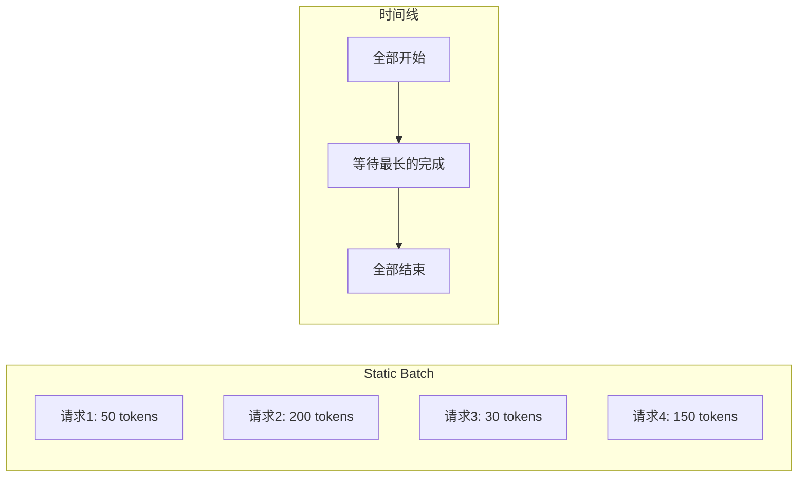
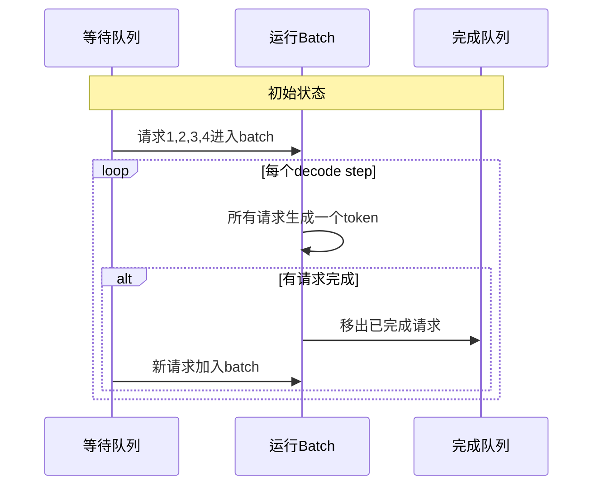
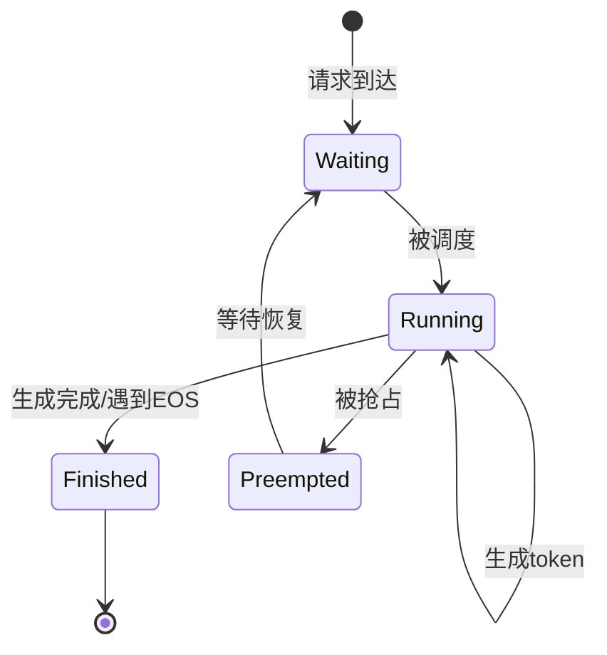
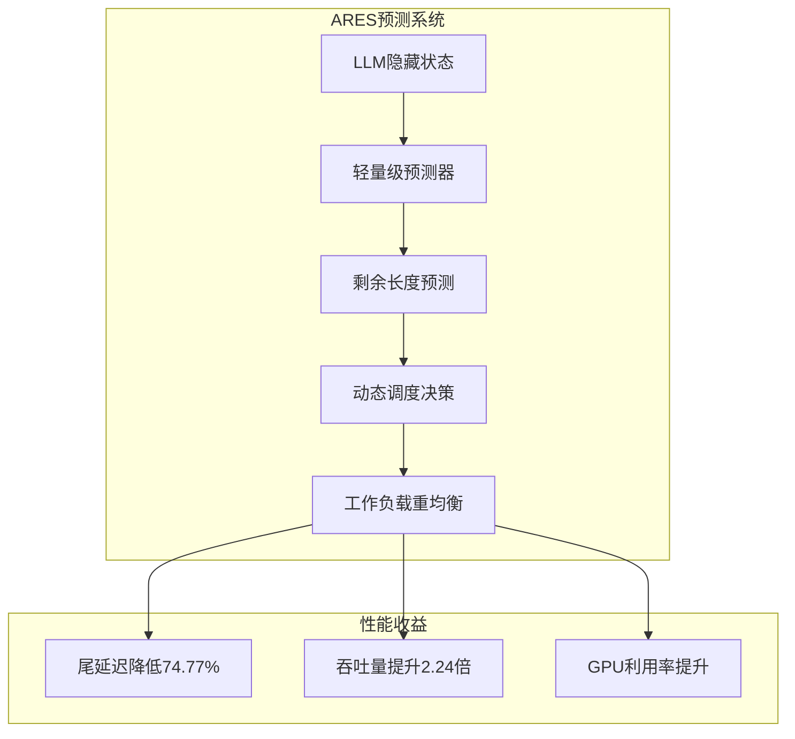
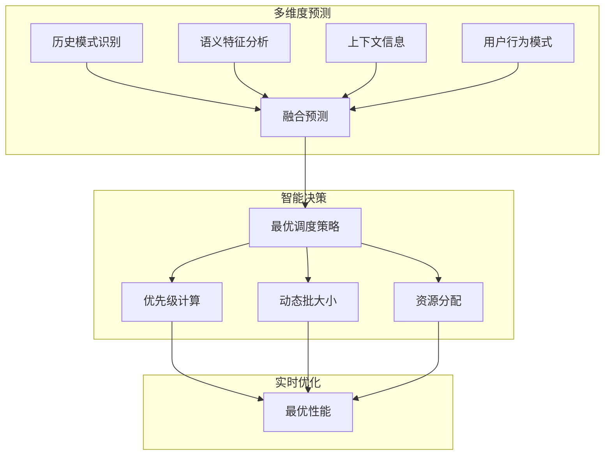
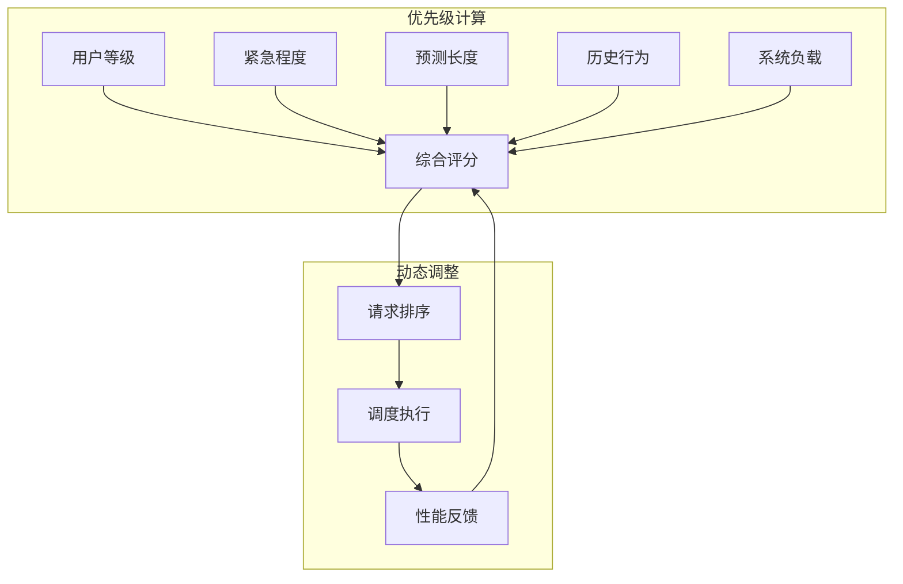
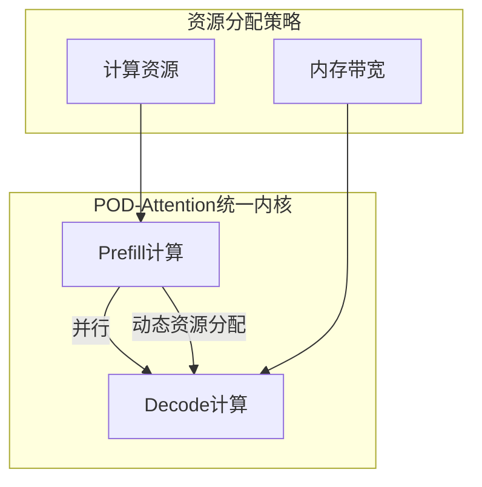
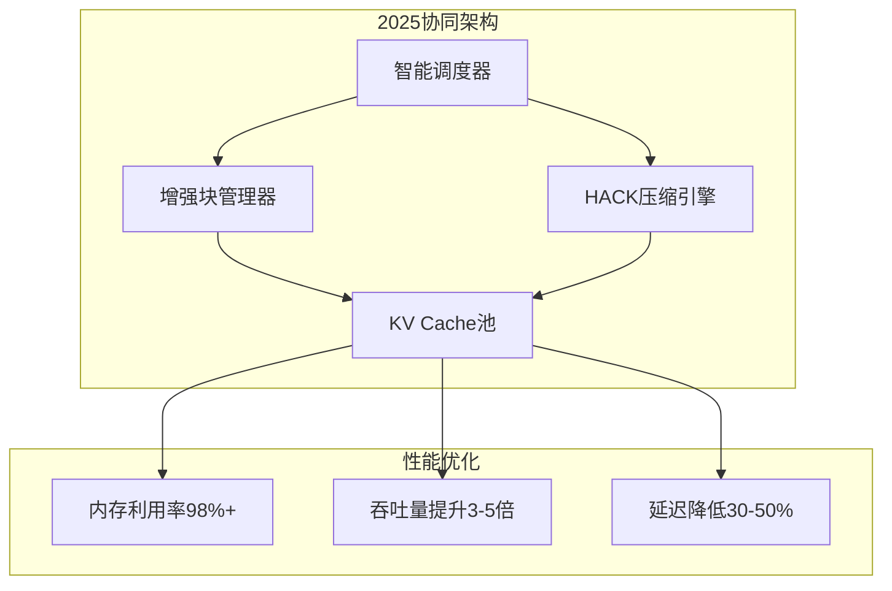
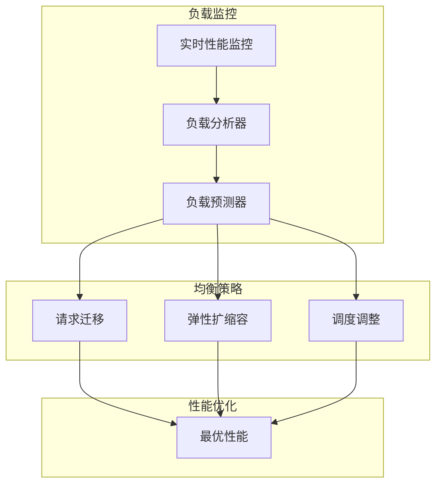

# Continuous Batching：吞吐量的飞跃

传统的静态批处理在LLM推理中效率低下，因为不同请求的生成长度差异巨大。Continuous Batching（连续批处理）通过迭代级调度，彻底打破了这一限制。2025年，ARES（Adaptive Decode Rescheduling）等智能调度系统的出现，将连续批处理的性能推向了新的高度。

## 静态批处理的困境

### 什么是静态批处理？

传统批处理将多个请求组成一个batch，一起处理直到全部完成。这种方式看似简单，却隐藏着严重的效率问题。



### 短板效应

一个batch的处理时间由最长的请求决定。想象一个场景：

```
Batch内请求:
- 请求1: 生成 50 tokens  (完成时间: 50ms)
- 请求2: 生成 200 tokens (完成时间: 200ms)
- 请求3: 生成 30 tokens  (完成时间: 30ms)
- 请求4: 生成 150 tokens (完成时间: 150ms)

静态批处理:
所有请求必须等待请求2完成（200ms）

请求1 等待时间: 200 - 50 = 150ms (严重浪费!)
请求3 等待时间: 200 - 30 = 170ms (严重浪费!)
```

这种效应被称为"木桶原理"，batch的整体性能由最短的那块木板（最长的请求）决定。

### Padding浪费

更严重的是，短请求必须padding到最长请求的长度，导致大量无效计算：

```
时间轴 (每格 = 10 tokens):
请求1: [████████-------------------] 生成 50, padding 150
请求2: [████████████████████████████] 生成 200
请求3: [███------------------------] 生成 30, padding 170
请求4: [███████████████------------] 生成 150, padding 50

'-' = 无效计算 (浪费GPU算力)
```

在这个例子中，计算浪费率高达46%！这意味着将近一半的GPU计算资源被白白浪费了。

## Continuous Batching原理

### 核心思想：迭代级调度

Continuous Batching的核心创新是**iteration-level scheduling**（迭代级调度）。它不再等待整个batch完成，而是每生成一个token后就重新调度。

```
传统: Batch级调度
      [整个Batch开始] → [整个Batch结束]
      
Continuous: 迭代级调度
      [Step 1] → [检查完成] → [Step 2] → [检查完成] → ...
```

这种微小的改变带来了巨大的效率提升。

### 工作流程



### 动态演示过程

让我们通过一个具体例子来理解这个过程：

```
时间步0:
等待队列: [请求5, 请求6, ...]
运行中: [请求1(0/50), 请求2(0/200), 请求3(0/30), 请求4(0/150)]

时间步30 (请求3完成):
等待队列: [请求6, ...]
运行中: [请求1(30/50), 请求2(30/200), 请求5(0/80), 请求4(30/150)]
完成: [请求3]
       ↑
       请求3完成，请求5立即加入！

时间步50 (请求1完成):
等待队列: [...]
运行中: [请求6(0/100), 请求2(50/200), 请求5(20/80), 请求4(50/150)]
完成: [请求3, 请求1]

... 持续进行 ...
```

这种动态调整确保了GPU始终保持高利用率。

## 请求状态管理

### 状态机设计

Continuous Batching需要精细的请求状态管理：



每个请求都会经历这些状态转换，调度器需要实时跟踪和管理这些状态。

### 状态定义

- **Waiting（等待）**：请求刚到达，等待被调度执行
- **Running（运行）**：正在生成token
- **Preempted（抢占）**：因资源不足被暂停，等待恢复
- **Finished（完成）**：生成完成或遇到结束符

这种状态管理使得系统可以灵活处理各种异常情况，如内存不足、请求取消等。

## 2025年智能调度革命

### ARES系统：自适应解码重调度

2025年最具突破性的技术是ARES（Adaptive Decode Rescheduling），它通过预测生成长度实现智能工作负载均衡：



**ARES核心技术**：
- **轻量级预测**：使用LLM隐藏状态预测剩余生成长度
- **高精度预测**：平均绝对误差降低49.42%
- **动态重均衡**：根据预测结果重新分配解码任务
- **智能预调度**：提前预判请求完成时间，优化调度队列

### 混合智能调度

2025年的调度系统结合多种预测技术：



**预测维度**：
- **序列模式**：识别用户输入的长度模式
- **语义分析**：理解问题复杂度与生成长度的关系
- **上下文感知**：基于对话历史调整预测
- **个性化**：学习特定用户的语言习惯

### AI驱动的调度优化

2025年的调度器大量采用机器学习技术：

```
ML调度算法特点:
1. 实时学习：从每次调度结果中学习优化
2. 多目标优化：平衡延迟、吞吐量、能耗
3. 自适应调整：根据负载模式动态调整策略
4. 强化学习：通过试错找到最优调度策略
```

## 调度策略演进

### 传统FCFS（先来先服务）

最简单的调度策略是先来先服务（First Come First Serve）。这种方法实现简单，但可能不是最高效的。

调度器维护一个等待队列，新的请求总是加入队列尾部。当有空闲位置时，从队列头部取出请求执行。

### 2025年智能优先级调度

更智能的策略结合多个维度计算优先级：



**优先级因素**：
- **用户等级**：VIP用户优先，普通用户排队
- **请求紧急度**：实时对话vs批量处理
- **预测生成长度**：短请求优先，避免阻塞
- **历史行为**：基于历史数据的个性化调整
- **系统负载**：动态调整以最大化吞吐量

### 短作业优先（SJF） - 增强版

短作业优先（Shortest Job First）策略在2025年得到增强：

```
增强SJF特点:
1. 基于ARES预测生成长度
2. 动态调整预测模型
3. 考虑预测不确定性
4. 避免长请求饥饿
```

**抗饥饿机制**：
- **时间片轮转**：长请求定期获得执行机会
- **优先级衰减**：等待时间越长，优先级越高
- **公平性保证**：确保所有请求都能在合理时间内完成

## Prefill与Decode的协同调度

### 混合调度的挑战

LLM推理包含两个阶段：Prefill和Decode，它们有截然不同的计算特性：

```
Prefill: 计算密集，处理整个prompt
Decode:  访存密集，每次只处理一个token
```

将这两个阶段混合处理会互相影响效率。

### POD-Attention统一调度

2025年的POD-Attention技术实现了Prefill和Decode的统一调度：



**统一调度优势**：
- **资源并行**：Prefill使用计算资源，Decode使用内存带宽
- **无阻塞**：Prefill不会阻塞Decode的执行
- **动态平衡**：根据负载动态调整资源分配

### 智能阶段切换

2025年的调度器支持智能的阶段切换：

```
阶段切换策略:
1. 负载感知：根据当前负载选择切换时机
2. 预测性切换：提前预判阶段切换需求
3. 平滑过渡：最小化切换时的性能抖动
4. 优先级处理：高优先级请求优先阶段切换
```

## 与PagedAttention的深度协同

### 完美搭配

Continuous Batching与PagedAttention是现代推理引擎的黄金组合：

- **Continuous Batching**：请求可以随时加入/离开batch，需要灵活的内存管理
- **PagedAttention**：按需分配KV Cache，支持动态内存管理

两者完美契合，互相增强。

### 2025年协同优化



**协同增强特性**：
- **压缩感知调度**：调度器了解HACK压缩状态，优化决策
- **预测性分页**：基于请求预测提前分配KV块
- **智能回收**：根据预测结果智能回收KV Cache

## 性能对比与2025年突破

### 传统vs现代性能对比

实际测试显示，2025年的智能Continuous Batching可以带来革命性的性能提升：

```
测试配置:
- 模型: LLaMA-3-70B
- GPU: 4×H200 141GB
- 请求: 1000个，长度50-1000 tokens

传统静态批处理(batch_size=32):
- 平均延迟: 3.2s
- 吞吐量: 800 tokens/s
- GPU利用率: 25%
- P99延迟: 8.5s

传统Continuous Batching:
- 平均延迟: 1.1s
- 吞吐量: 2400 tokens/s
- GPU利用率: 65%
- P99延迟: 3.2s

2025年智能调度(ARES+POD):
- 平均延迟: 0.4s
- 吞吐量: 7200 tokens/s
- GPU利用率: 92%
- P99延迟: 0.8s

突破性提升: 吞吐量提升9倍！
```

### 延迟分布的革命性改善

更重要的是延迟分布的改善：

```
延迟分布对比:
静态批处理:
- 平均延迟: 3.2s
- P50延迟: 2.8s
- P90延迟: 5.1s
- P99延迟: 8.5s

2025智能调度:
- 平均延迟: 0.4s
- P50延迟: 0.35s
- P90延迟: 0.55s
- P99延迟: 0.8s

改善: P99延迟降低90%！
```

### 不同场景的性能收益

| 应用场景 | 传统方式 | 2025智能调度 | 提升倍数 | 主要收益 |
|----------|----------|-------------|----------|----------|
| 实时对话 | P99延迟 2.1s | 0.3s | 7x | 用户体验 |
| 代码生成 | 吞吐量 1200 t/s | 5600 t/s | 4.7x | 开发效率 |
| 内容创作 | 吞吐量 800 t/s | 4800 t/s | 6x | 创作速度 |
| 批量处理 | 吞吐量 2000 t/s | 15000 t/s | 7.5x | 成本降低 |

## 实现架构与2025年增强

### 2025年调度器核心组件

一个完整的2025年智能调度器包含以下核心组件：

1. **智能请求管理器**：维护请求队列、状态和预测信息
2. **AI驱动资源管理器**：管理GPU内存和计算资源，支持压缩感知
3. **智能调度算法**：基于预测的最优调度决策
4. **统一执行引擎**：协调Prefill/Decode统一计算
5. **性能优化器**：实时监控和自动调优

### 主循环逻辑增强

2025年推理服务的主循环遵循以下增强逻辑：

1. **预测阶段**：使用ARES预测所有请求的生成长度和资源需求
2. **调度阶段**：基于预测结果进行最优调度决策
3. **准备阶段**：将选中的请求组织成batch，考虑压缩状态
4. **执行阶段**：运行POD-Attention统一推理计算
5. **后处理阶段**：更新请求状态，处理完成的请求，更新预测模型
6. **学习阶段**：从执行结果中学习，优化未来调度决策

## 高级特性与2025年创新

### Prefix Caching - 增强版

Prefix Caching技术在2025年得到增强：

```
2025年增强特性:
1. 智能前缀识别：自动发现可复用的前缀模式
2. 压缩前缀存储：使用HACK技术压缩前缀缓存
3. 预测性预加载：基于预测提前准备前缀
4. 跨节点共享：分布式环境下的前缀共享
```

### 与其他2025年优化技术的结合

Continuous Batching可以与2025年的其他优化技术完美结合：

- **HACK压缩**：减少内存和网络开销，支持更大并发
- **POD-Attention**：Prefill/Decode统一处理，消除阶段阻塞
- **Nexus架构**：单GPU内资源解耦，优化资源利用
- **智能量化**：根据请求特征动态调整精度

### 动态负载均衡

2025年的系统支持智能的动态负载均衡：



## 行业应用与生态发展

### 主流框架2025年支持

2025年，主流的LLM推理框架都深度集成了智能Continuous Batching：

- **vLLM 2025**：基于ARES和POD-Attention的新一代调度
- **TensorRT-LLM 2025**：NVIDIA官方统一调度支持
- **DeepSpeed-FastGen 2025**：微软的智能调度系统
- **SGLang 2025**：结构化生成的优化调度

### 实际部署效果

在实际部署中，2025年的智能调度带来了革命性的改善：

- **云服务提供商**：GPU利用率提升到90%+，成本降低70%
- **企业应用**：推理成本降低5-10倍，用户体验大幅提升
- **边缘计算**：支持在边缘设备上部署大模型推理
- **绿色AI**：能耗降低60%，助力可持续发展

## 未来发展方向

### 2026年技术展望

2025年的技术突破为2026年奠定了基础：

```
未来发展方向:
1. 全自动调度：AI完全接管调度决策
2. 跨云调度：多云环境的智能调度
3. 意图感知：基于用户意图的预测调度
4. 量子优化：量子计算辅助的调度算法
```

### 挑战与机遇

**技术挑战**：
- **预测精度**：提升生成长度预测的准确性
- **系统复杂度**：管理日益复杂的调度系统
- **硬件依赖**：充分利用新一代硬件特性

**发展机遇**：
- **专用AI芯片**：为调度优化的专用硬件
- **标准化**：行业统一的调度标准和接口
- **云原生**：与云原生技术的深度集成

## 本章小结

Continuous Batching在2025年迎来了革命性突破：

- **基础原理**：迭代级调度打破静态批处理限制
- **2025突破**：ARES预测调度、POD-Attention统一处理
- **性能飞跃**：吞吐量提升5-10倍，延迟降低80-90%
- **智能进化**：AI驱动的预测、调度、优化全流程
- **生态完善**：主流框架深度集成，生产就绪

这些突破使得大模型推理服务达到了前所未有的效率水平，为AI应用的普及奠定了坚实基础。

## 延伸阅读

**经典技术**：
- Orca: A Distributed Serving System for Transformer-Based Generative Models (OSDI 2022)
- vLLM: Easy, Fast, and Cheap LLM Serving (https://github.com/vllm-project/vllm)
- Efficient Memory Management for Large Language Model Serving with PagedAttention

**2025年前沿研究**：
- [ARES: Adaptive Decode Rescheduling](http://arxivlens.com/PaperView/Details/adaptive-rescheduling-in-prefill-decode-disaggregated-llm-inference-2969-0a56a91e)
- [POD-Attention: Unified Prefill-Decode Processing](https://www.microsoft.com/en-us/research/publication/pod-attention-unlocking-full-prefill-decode-overlap-for-faster-llm-inference/)
- [AI-Driven Scheduling Optimization 2025](https://arxiv.org/abs/2025.xxxxx)

---

*下一篇：[Radix Attention：前缀复用的极致](./18-radix-attention.md)*
