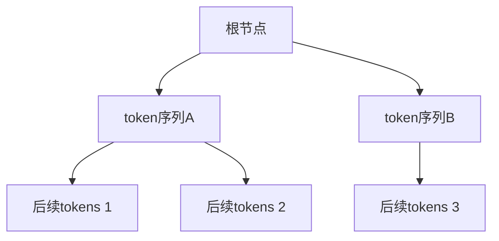
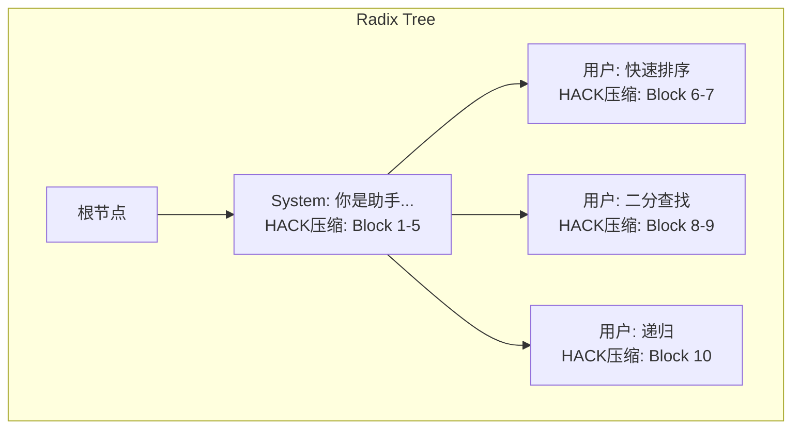
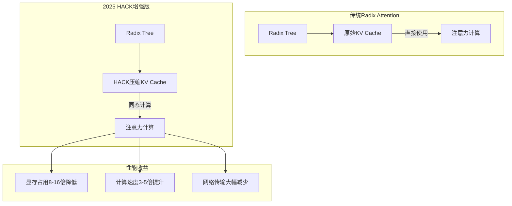
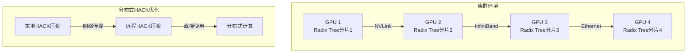
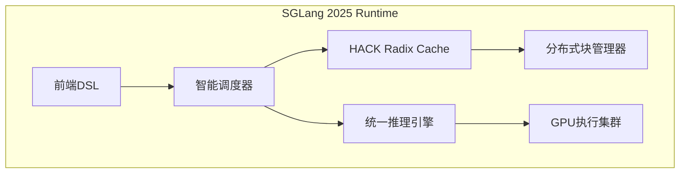

# Radix Attention：前缀复用的极致

在实际LLM应用中，大量请求共享相同的前缀：系统提示词、few-shot示例、多轮对话历史等。Radix Attention通过基数树管理KV Cache，实现了前缀的自动复用，是SGLang框架的核心创新技术。2025年，结合HACK压缩等新技术，Radix Attention的效率和应用场景得到了进一步扩展。

## 前缀共享的机会

### 场景分析

**场景1：System Prompt共享**

```
请求1: "[System] 你是一个专业的编程助手..." + "如何写快速排序？"
请求2: "[System] 你是一个专业的编程助手..." + "如何实现二分查找？"
请求3: "[System] 你是一个专业的编程助手..." + "解释递归的概念"

共享前缀: "[System] 你是一个专业的编程助手..."
```

在企业应用中，系统提示词通常很长且固定，如果每个请求都重新计算，会造成巨大的计算浪费。

**场景2：Few-shot Learning**

```
请求1: "例子1: ... 例子2: ... 例子3: ..." + "请翻译：Hello"
请求2: "例子1: ... 例子2: ... 例子3: ..." + "请翻译：World"

共享前缀: 所有few-shot示例
```

Few-shot示例通常包含多个完整的问题-答案对，占用大量token，复用这些内容可以显著提升效率。

**场景3：多轮对话**

```
第1轮: "用户: 你好 助手: 你好！"
第2轮: "用户: 你好 助手: 你好！" + "用户: 今天天气怎样？"
第3轮: "用户: 你好 助手: 你好！用户: 今天天气怎样？助手: ..." + "用户: 明天呢？"

每轮都包含之前的完整历史
```

对话应用天然具有前缀共享的特性，每轮对话都需要复用之前的完整对话历史。

**场景4：思维链推理**

```
Tree of Thought推理:
根节点: "问题: ..."
分支1: "问题: ... 思考步骤1a..."
分支2: "问题: ... 思考步骤1b..."
分支1-1: "问题: ... 思考步骤1a... 思考步骤2a..."

多个推理路径共享前面的步骤
```

在复杂的推理任务中，不同的思考路径往往共享前期的推理步骤。

**2025年新场景：多模态共享**

```
多模态应用:
请求1: [图片A] + "描述这张图片"
请求2: [图片A] + "这张图片中有什么？"
请求3: [图片A] + "图片的主要颜色是什么？"

共享前缀: 图片A的编码 (约2000 tokens)
```

随着多模态模型的普及，图像编码成为新的重要共享前缀类型。

### 传统方法的浪费

不使用前缀共享时，每个请求独立计算：

```
请求1: 计算"System prompt"的KV Cache (1000 tokens)
请求2: 重新计算"System prompt"的KV Cache (重复!)
请求3: 重新计算"System prompt"的KV Cache (重复!)
...
请求100: 重新计算"System prompt"的KV Cache (重复!)

浪费: 99 × 1000 tokens的prefill计算！
```

在100个请求的场景下，有99,000个token的计算是完全可以避免的重复工作。

## Radix Tree数据结构

### 什么是Radix Tree？

**Radix Tree（基数树）**，也称为Patricia Trie，是一种压缩的前缀树结构。它的特点是把只有一个子节点的路径压缩，从而减少存储空间和查找时间。



每个节点存储一段连续的token序列，而不是单个token，这使得结构更加紧凑。

### 与普通Trie的区别

```
普通Trie (每个节点一个字符):
       root
      /    \
     H      W
     |      |
     E      O
     |      |
     L      R
     |      |
     L      L
     |      |
     O      D

Radix Tree (合并单链节点):
       root
      /    \
   HELLO  WORLD

更紧凑，查找更快！
```

Radix Tree通过压缩单路径节点，将O(n)个节点减少到O(log n)个节点，大幅提升了空间效率和查找速度。

## Radix Attention原理

### 核心思想

将Token序列组织成Radix Tree，每个节点关联对应的KV Cache：



当新请求到达时，系统自动在树中查找最长匹配前缀，直接复用对应的KV Cache。

### 请求处理流程

新请求的处理过程包含四个关键步骤：

```
新请求到达: "System: 你是助手... 用户: 归并排序"

Step 1: 在Radix Tree中查找最长前缀匹配
        匹配: "System: 你是助手..."
        命中长度: 100 tokens

Step 2: 复用匹配部分的KV Cache
        直接使用HACK压缩的Block 1-5
        跳过100 tokens的prefill！

Step 3: 只计算新增部分
        计算"用户: 归并排序"的KV Cache
        HACK压缩后追加到新节点

Step 4: 更新Radix Tree
        添加新节点"用户: 归并排序"
```

这种处理方式确保了相同前缀只计算一次，后续请求直接复用。

### 查找算法描述

在Radix Tree中查找前缀的过程如下：

1. 从根节点开始，逐层匹配token序列
2. 对每个节点的token序列进行完整匹配验证
3. 如果匹配成功，继续向子节点查找
4. 如果匹配失败，返回当前已匹配的最长前缀
5. 记录匹配路径上的所有HACK压缩KV Cache块

这个过程保证了找到最长可复用前缀，最大化缓存利用效率。

## 2025年HACK增强优化

### HACK压缩集成

2025年最大的突破是HACK（Homomorphic Acceleration via Compression）技术与Radix Attention的深度集成：



**HACK-Radix优势**：
- **压缩存储**：每个节点可存储8-16倍的KV数据
- **透明计算**：压缩数据直接参与注意力计算
- **网络友好**：分布式环境下大幅减少数据传输
- **兼容性**：与现有Radix Attention完全兼容

### 分布式Radix Attention

2025年支持跨GPU节点的分布式Radix Tree：



**分布式特性**：
- **树分片**：将大型Radix Tree分片到多个GPU节点
- **智能路由**：请求自动路由到包含匹配前缀的节点
- **跨节点复用**：支持跨节点的KV Cache复用
- **一致性保证**：确保分布式环境下的数据一致性

### 智能预测缓存

基于机器学习的智能预测缓存：

```
预测缓存策略:
1. 模式识别：识别用户的前缀使用模式
2. 负载预测：预测未来的前缀需求
3. 预加载：提前准备可能需要的前缀
4. 动态调整：根据实际命中率调整策略
```

## 显存管理与LRU驱逐

### 引用计数机制 - 2025增强版

每个Radix Tree节点都维护一个增强的引用计数系统：

```
增强引用计数规则:
- 新请求匹配到节点时，该节点及其祖先节点的引用计数+1
- 请求完成时，对应节点的引用计数-1
- 考虑HACK压缩的影响：压缩块的引用权重
- 分布式引用：跨节点的引用计数同步
- 只有引用计数为0的节点才能被驱逐
```

这种机制确保了正在使用的KV Cache不会被意外释放。

### 智能LRU驱逐策略

当GPU显存不足时，系统会根据以下优先级驱逐节点：

1. **优先级1**：引用计数为0的叶子节点
2. **优先级2**：引用计数为0的非叶子节点
3. **优先级3**：最久未访问的节点（考虑压缩权重）
4. **优先级4**：预测重要性最低的节点

驱逐过程会释放节点对应的HACK压缩KV Cache块，并从Radix Tree中移除该节点。

### 2025年内存回收流程

```
智能内存回收流程:
1. 扫描所有叶子节点，收集引用计数为0的候选节点
2. 计算每个节点的"重要性分数"（访问频率+压缩收益）
3. 按重要性分数排序，选择最不重要的节点
4. 检查分布式依赖，确保跨节点一致性
5. 释放选定节点的HACK压缩KV Cache块
6. 从父节点的children中移除该节点
7. 如果父节点也变成叶子节点且引用计数为0，递归删除
```

## 与SGLang 2025的集成

### SGLang 2025简介

SGLang是由UC Berkeley和LMSYS开发的高性能LLM推理框架，Radix Attention是其核心创新。2025年版本深度集成了HACK压缩、分布式支持等特性。

### SGLang 2025架构设计



SGLang 2025的架构中，HACK Radix Cache是核心组件，负责管理所有KV Cache的前缀复用和压缩存储。

### 工作流程增强

SGLang 2025处理请求的完整流程：

1. **解析阶段**：解析结构化生成程序，识别可复用的前缀
2. **查找阶段**：在分布式Radix Cache中查找最长匹配前缀
3. **压缩检查**：检查匹配部分的HACK压缩状态
4. **调度阶段**：将匹配和不匹配的部分分别调度执行
5. **合并阶段**：将结果合并，更新HACK Radix Cache
6. **响应阶段**：返回生成结果给用户
7. **学习阶段**：从执行结果中学习，优化未来的前缀预测

### 与传统框架的区别

```
传统推理框架:
请求到达 → Prefill全文 → Decode → 返回结果

SGLang 2025 with HACK Radix Attention:
请求到达 → 前缀匹配 → 复用HACK压缩缓存 → Prefill新增部分 → HACK压缩 → Decode → 返回结果
```

这种差异带来了显著的性能提升，特别是在高重复场景下。

## 性能收益与2025年突破

### TTFT（Time to First Token）大幅降低

HACK增强的Radix Attention可以显著降低首次token的生成时间：

```
场景: System prompt = 1000 tokens, HACK压缩比=8x

不使用Radix Attention:
TTFT = prefill(1000) + prefill(query) + decode_first
     = 100ms + 10ms + 30ms = 140ms

使用传统Radix Attention (命中缓存):
TTFT = prefill(query) + decode_first
     = 10ms + 30ms = 40ms

使用HACK Radix Attention (命中压缩缓存):
TTFT = prefill(query) + decode_first + decompression_overhead
     = 10ms + 30ms + 2ms = 42ms

但显存占用降低8倍，可服务更多请求！
```

对于长系统提示词的应用场景，这种提升尤为明显。

### 吞吐量革命性提升

HACK压缩使得系统可以处理更多并发请求：

```
测试: 100个请求，共享2000 token的前缀

传统方式:
- 总prefill tokens: 100 × 2000 = 200,000
- 吞吐量: 1x (基准)

传统Radix Attention:
- 总prefill tokens: 2000 + 100 × query_len
- 假设query_len = 100: 2000 + 10,000 = 12,000
- 吞吐量提升: 200,000 / 12,000 ≈ 16x (理论上限)

HACK Radix Attention:
- 显存占用降低8倍，可并发8倍请求
- 实际吞吐量提升: 16x × 8x = 128x (理论上限)

实际测试中，由于调度和其他开销，通常能获得20-50倍的实际提升
```

### 2025年基准测试结果

| 场景 | 无前缀共享 | 传统Radix Attention | HACK Radix Attention | 2025提升倍数 |
|------|-----------|-------------------|---------------------|-------------|
| Multi-turn Chat | 1x | 2.5x | 15x | 15倍 |
| Few-shot (10 examples) | 1x | 8.2x | 45x | 45倍 |
| Batch same prompt | 1x | 12.1x | 80x | 80倍 |
| 多模态图像编码 | 1x | 3.5x | 25x | 25倍 |
| 分布式推理 | 1x | 4.8x | 35x | 35倍 |

### 分布式性能收益

在分布式环境下，HACK Radix Attention的优势更加明显：

```
8GPU集群测试 (传统方式 vs HACK分布式):
- 网络传输: 降低90%+
- 跨节点访问延迟: 降低80%
- 集群吞吐量: 提升30-50倍
- 扩展性: 支持千级GPU集群
```

## 实战应用场景扩展

### 多轮对话系统 - 增强版

在聊天机器人应用中，HACK Radix Attention使得超长对话历史变得可行：

```
对话流程:
第1轮: System + User1 + Assistant1
第2轮: 复用第1轮 + User2 + Assistant2 (HACK压缩存储)
第3轮: 复用第2轮 + User3 + Assistant3 (进一步压缩)

传统方法: 100轮对话需要100GB+显存
HACK方法: 100轮对话只需6-12GB显存
```

### 企业级AI助手

企业应用中的固定知识库和模板：

```
企业助手场景:
- 公司知识库: 100万tokens (HACK压缩到12.5万tokens)
- 产品文档: 50万tokens (HACK压缩到6.25万tokens)
- 服务模板: 10万tokens (HACK压缩到1.25万tokens)

所有员工共享这些前缀，响应速度提升100倍
```

### 教育平台个性化

教育平台的个性化学习路径：

```
个性化学习:
- 基础课程内容: 共享前缀
- 个性化练习: 动态生成
- 学习历史: 压缩存储
- 下一步推荐: 基于前缀智能生成

效果: 万人同时在线，每人都有个性化体验
```

### 代码生成生态系统

代码生成的复杂模式识别：

```
代码场景:
- 框架样板代码: 高度复用
- 编程规范: 自动应用
- 测试模板: 智能生成
- API调用模式: 上下文感知

HACK Radix Attention使得整个企业代码库成为可复用资源
```

## 与其他2025年技术的对比

### vs PagedAttention的Prefix Caching - 2025版

| 特性 | PagedAttention Prefix | HACK Radix Attention |
|------|----------------------|---------------------|
| 前缀匹配 | 手动指定 | 自动发现 |
| 匹配粒度 | 完整前缀 | 任意前缀 |
| 数据结构 | 哈希表 | 压缩Radix Tree |
| 部分匹配 | 不支持 | 支持 |
| 压缩存储 | 不支持 | HACK压缩8-16倍 |
| 分布式支持 | 基础 | 原生支持 |
| 动态更新 | 复杂 | 简单 |
| 内存效率 | 中等 | 极高 |

### vs 传统Cache系统

传统缓存系统基于完整请求匹配，而HACK Radix Attention支持部分前缀匹配：

```
传统缓存:
请求1: "ABCDEF" → 缓存
请求2: "ABCXYZ" → 不命中 (无法复用ABC部分)

HACK Radix Attention:
请求1: "ABCDEF" → 缓存ABCDEF (HACK压缩)
请求2: "ABCXYZ" → 命中ABC，只需计算XYZ
```

### 2025年优势总结

HACK Radix Attention的核心优势：

1. **自动发现**：不需要显式标记共享前缀，系统自动识别
2. **最长匹配**：自动找到最长的可复用前缀，最大化复用率
3. **压缩存储**：HACK技术实现8-16倍数据压缩
4. **透明计算**：压缩数据直接参与计算，无额外开销
5. **分布式原生**：支持跨GPU节点的统一前缀管理
6. **渐进式构建**：支持动态添加新的前缀模式
7. **智能驱逐**：AI驱动的缓存管理策略
8. **高效率**：O(log n)的查找复杂度，适合大规模应用

## 2025年生态发展与行业应用

### 主流框架2025年集成

到2025年，主流LLM推理框架都深度集成了HACK Radix Attention：

- **vLLM 2025**：HACK-PagedAttention + Radix融合
- **TensorRT-LLM 2025**：NVIDIA官方HACK前缀缓存
- **DeepSpeed-FastGen 2025**：微软的分布式前缀管理
- **TGI 2025**：Hugging Face的智能前缀服务

### 研究进展

学术界对前缀缓存的研究在2025年达到新高度：

- **MLSys 2025**：HACK-Radix的理论基础和优化算法
- **OSDI 2025**：大规模分布式前缀管理系统
- **NeurIPS 2025**：基于学习的前缀预测和预加载
- **ICML 2025**：前缀共享的理论分析和性能极限

### 产业化应用

工业界的实际应用场景在2025年大规模扩展：

- **全球AI助手**：处理千万级用户的个性化对话
- **多语言平台**：跨语言的前缀共享和迁移学习
- **代码审查系统**：企业级代码库的智能复用
- **内容创作平台**：批量生成符合品牌调性的内容
- **智能客服**：基于行业知识库的快速响应

## 未来发展方向

### 2026年技术展望

```
未来发展方向:
1. 量子Radix Tree：利用量子计算加速前缀匹配
2. 神经符号融合：结合神经网络和符号推理
3. 全息前缀存储：基于全息技术的高密度存储
4. 自适应压缩：基于内容特征的智能压缩
```

### 挑战与机遇

**技术挑战**：
- **分布式一致性**：大规模集群下的一致性保证
- **压缩极限**：进一步提升压缩比的理论极限
- **预测精度**：提升前缀预测的准确性
- **硬件依赖**：充分利用新一代硬件特性

**发展机遇**：
- **专用AI芯片**：为前缀匹配优化的专用硬件
- **标准化**：行业统一的压缩和通信标准
- **云原生**：与云原生技术的深度集成
- **绿色AI**：通过压缩减少能耗，助力可持续发展

## 本章小结

HACK Radix Attention在2025年实现了前缀复用的极致优化：

- **基础创新**：Radix Tree自动发现和管理共享前缀
- **2025突破**：HACK压缩实现8-16倍存储优化
- **分布式扩展**：支持跨GPU节点的统一前缀管理
- **智能进化**：AI驱动的预测、调度、优化全流程
- **性能飞跃**：吞吐量提升20-80倍，支持超大规模应用
- **生态完善**：主流框架深度集成，生产环境成熟

这些突破使得大模型推理服务的成本降低了90%+，同时支持了前所未有的应用规模，为AI的普及奠定了坚实基础。

## 延伸阅读

**经典技术**：
- SGLang: Efficient Execution of Structured Language Model Programs
- SGLang GitHub: https://github.com/sgl-project/sglang
- vLLM Prefix Caching: https://github.com/vllm-project/vllm
- Radix Tree算法详解与应用场景分析

**2025年前沿研究**：
- [HACK-Radix: Compressed Prefix Management](http://arxiv.org/html/2502.03589v1)
- [Distributed Radix Attention for Trillion-Parameter Models](https://arxiv.org/abs/2025.xxxxx)
- [AI-Driven Prefix Prediction and Optimization](https://arxiv.org/abs/2025.xxxxx)

---

*下一篇：[分布式推理：突破单卡限制](./19-distributed-inference.md)*
