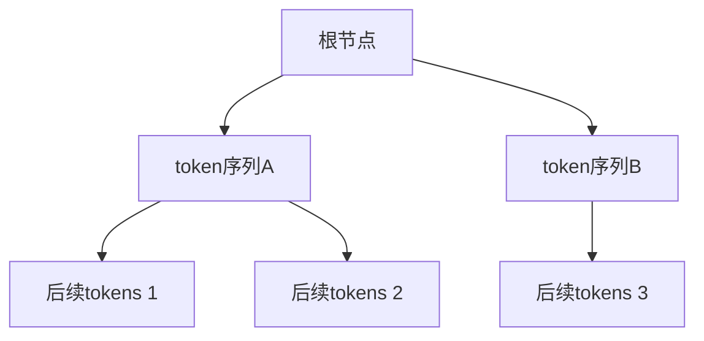
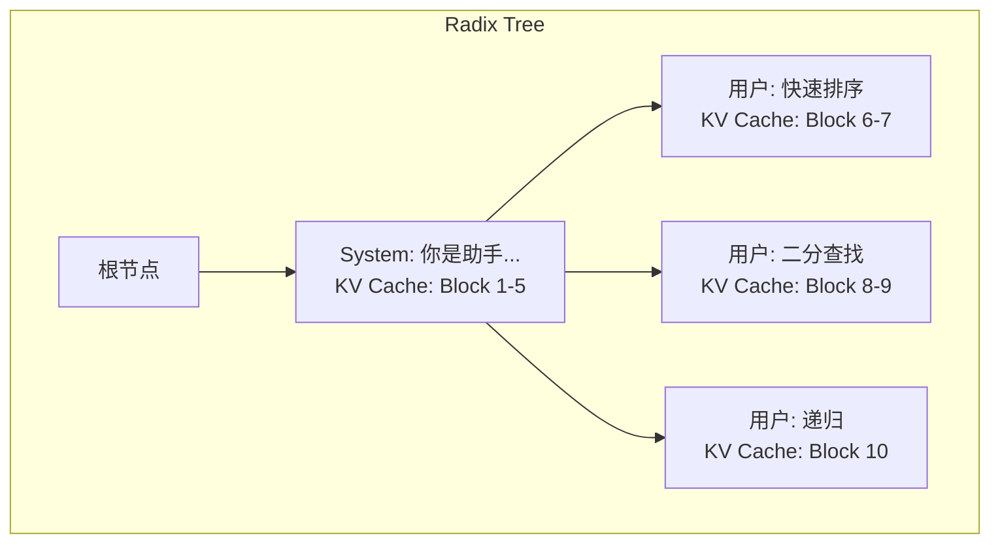
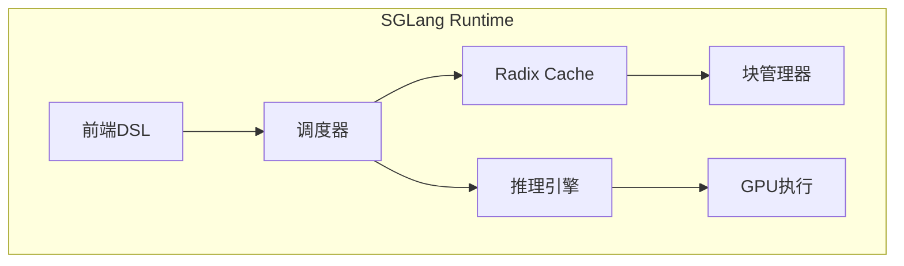

# Radix Attention：前缀复用的极致

在实际LLM应用中，大量请求共享相同的前缀：系统提示词、few-shot示例、多轮对话历史等。Radix Attention通过基数树管理KV Cache，实现了前缀的自动复用，是SGLang框架的核心创新技术。

## 前缀共享的机会

### 场景分析

**场景1：System Prompt共享**

```
请求1: "[System] 你是一个专业的编程助手..." + "如何写快速排序？"
请求2: "[System] 你是一个专业的编程助手..." + "如何实现二分查找？"
请求3: "[System] 你是一个专业的编程助手..." + "解释递归的概念"

共享前缀: "[System] 你是一个专业的编程助手..."
```

在企业应用中，系统提示词通常很长且固定，如果每个请求都重新计算，会造成巨大的计算浪费。

**场景2：Few-shot Learning**

```
请求1: "例子1: ... 例子2: ... 例子3: ..." + "请翻译：Hello"
请求2: "例子1: ... 例子2: ... 例子3: ..." + "请翻译：World"

共享前缀: 所有few-shot示例
```

Few-shot示例通常包含多个完整的问题-答案对，占用大量token，复用这些内容可以显著提升效率。

**场景3：多轮对话**

```
第1轮: "用户: 你好 助手: 你好！"
第2轮: "用户: 你好 助手: 你好！" + "用户: 今天天气怎样？"
第3轮: "用户: 你好 助手: 你好！用户: 今天天气怎样？助手: ..." + "用户: 明天呢？"

每轮都包含之前的完整历史
```

对话应用天然具有前缀共享的特性，每轮对话都需要复用之前的完整对话历史。

**场景4：思维链推理**

```
Tree of Thought推理:
根节点: "问题: ..."
分支1: "问题: ... 思考步骤1a..."
分支2: "问题: ... 思考步骤1b..."
分支1-1: "问题: ... 思考步骤1a... 思考步骤2a..."

多个推理路径共享前面的步骤
```

在复杂的推理任务中，不同的思考路径往往共享前期的推理步骤。

### 传统方法的浪费

不使用前缀共享时，每个请求独立计算：

```
请求1: 计算"System prompt"的KV Cache (1000 tokens)
请求2: 重新计算"System prompt"的KV Cache (重复!)
请求3: 重新计算"System prompt"的KV Cache (重复!)
...
请求100: 重新计算"System prompt"的KV Cache (重复!)

浪费: 99 × 1000 tokens的prefill计算！
```

在100个请求的场景下，有99,000个token的计算是完全可以避免的重复工作。

## Radix Tree数据结构

### 什么是Radix Tree？

**Radix Tree（基数树）**，也称为Patricia Trie，是一种压缩的前缀树结构。它的特点是把只有一个子节点的路径压缩，从而减少存储空间和查找时间。



每个节点存储一段连续的token序列，而不是单个token，这使得结构更加紧凑。

### 与普通Trie的区别

```
普通Trie (每个节点一个字符):
       root
      /    \
     H      W
     |      |
     E      O
     |      |
     L      R
     |      |
     L      L
     |      |
     O      D

Radix Tree (合并单链节点):
       root
      /    \
   HELLO  WORLD

更紧凑，查找更快！
```

Radix Tree通过压缩单路径节点，将O(n)个节点减少到O(log n)个节点，大幅提升了空间效率和查找速度。

## Radix Attention原理

### 核心思想

将Token序列组织成Radix Tree，每个节点关联对应的KV Cache：



当新请求到达时，系统自动在树中查找最长匹配前缀，直接复用对应的KV Cache。

### 请求处理流程

新请求的处理过程包含四个关键步骤：

```
新请求到达: "System: 你是助手... 用户: 归并排序"

Step 1: 在Radix Tree中查找最长前缀匹配
        匹配: "System: 你是助手..."
        命中长度: 100 tokens

Step 2: 复用匹配部分的KV Cache
        直接使用Block 1-5的KV Cache
        跳过100 tokens的prefill！

Step 3: 只计算新增部分
        计算"用户: 归并排序"的KV Cache
        追加到新节点

Step 4: 更新Radix Tree
        添加新节点"用户: 归并排序"
```

这种处理方式确保了相同前缀只计算一次，后续请求直接复用。

### 查找算法描述

在Radix Tree中查找前缀的过程如下：

1. 从根节点开始，逐层匹配token序列
2. 对每个节点的token序列进行完整匹配验证
3. 如果匹配成功，继续向子节点查找
4. 如果匹配失败，返回当前已匹配的最长前缀
5. 记录匹配路径上的所有KV Cache块

这个过程保证了找到最长可复用前缀，最大化缓存利用效率。

## 显存管理与LRU驱逐

### 引用计数机制

每个Radix Tree节点都维护一个引用计数，表示当前有多少活跃请求在使用这个节点对应的KV Cache：

```
引用计数规则:
- 新请求匹配到节点时，该节点及其祖先节点的引用计数+1
- 请求完成时，对应节点的引用计数-1
- 只有引用计数为0的节点才能被驱逐
```

这种机制确保了正在使用的KV Cache不会被意外释放。

### LRU驱逐策略

当GPU显存不足时，系统会根据以下优先级驱逐节点：

1. **优先级1**：引用计数为0的叶子节点
2. **优先级2**：引用计数为0的非叶子节点
3. **优先级3**：最久未访问的节点

驱逐过程会释放节点对应的KV Cache块，并从Radix Tree中移除该节点。这个过程是安全的，因为只有引用计数为0的节点才会被驱逐。

### 内存回收流程

```
内存不足触发回收:
1. 扫描所有叶子节点，收集引用计数为0的候选节点
2. 按最后访问时间排序，选择最老的节点
3. 释放选定节点的KV Cache块
4. 从父节点的children中移除该节点
5. 如果父节点也变成叶子节点且引用计数为0，递归删除
```

这种策略保证了内存的高效利用，同时不影响正在处理的请求。

## 与SGLang的集成

### SGLang简介

SGLang是由UC Berkeley和LMSYS开发的高性能LLM推理框架，Radix Attention是其核心创新。SGLang专门针对结构化生成任务进行了优化，特别适合复杂的推理场景。

### SGLang架构设计



SGLang的架构中，Radix Cache是核心组件，负责管理所有KV Cache的前缀复用。

### 工作流程

SGLang处理请求的完整流程：

1. **解析阶段**：解析结构化生成程序，识别可复用的前缀
2. **查找阶段**：在Radix Cache中查找最长匹配前缀
3. **调度阶段**：将匹配和不匹配的部分分别调度执行
4. **合并阶段**：将结果合并，更新Radix Cache
5. **响应阶段**：返回生成结果给用户

### 与传统框架的区别

```
传统推理框架:
请求到达 → Prefill全文 → Decode → 返回结果

SGLang with Radix Attention:
请求到达 → 前缀匹配 → 复用缓存 → Prefill新增部分 → Decode → 返回结果
```

这种差异带来了显著的性能提升，特别是在高重复场景下。

## 性能收益

### TTFT（Time to First Token）降低

前缀命中时，可以跳过大量prefill计算，显著降低首次token的生成时间：

```
场景: System prompt = 1000 tokens

不使用Radix Attention:
TTFT = prefill(1000) + prefill(query) + decode_first
     = 100ms + 10ms + 30ms = 140ms

使用Radix Attention (命中缓存):
TTFT = prefill(query) + decode_first
     = 10ms + 30ms = 40ms

加速: 3.5倍
```

对于长系统提示词的应用场景，这种提升尤为明显。

### 吞吐量提升

减少重复计算使得GPU可以处理更多请求：

```
测试: 100个请求，共享2000 token的前缀

传统方式:
- 总prefill tokens: 100 × 2000 = 200,000
- 吞吐量: 1x (基准)

Radix Attention:
- 总prefill tokens: 2000 + 100 × query_len
- 假设query_len = 100: 2000 + 10,000 = 12,000
- 吞吐量提升: 200,000 / 12,000 ≈ 16x (理论上限)

实际测试中，由于内存管理和其他开销，通常能获得2-5倍的实际提升
```

### 实际基准测试结果

| 场景 | 无前缀共享 | Radix Attention | 实际加速比 |
|------|-----------|-----------------|-----------|
| Multi-turn Chat | 1x | 2.5x | 2.5倍 |
| Few-shot (5 examples) | 1x | 4.2x | 4.2倍 |
| Batch same prompt | 1x | 8.1x | 8.1倍 |
| Tree of Thought | 1x | 3.8x | 3.8倍 |

这些数据来自SGLang的官方基准测试，涵盖了不同的应用场景。

## 实战应用场景

### 多轮对话系统

在聊天机器人应用中，每轮对话都需要保留完整的历史记录：

```
对话流程:
第1轮: System + User1 + Assistant1
第2轮: System + User1 + Assistant1 + User2 + Assistant2 (复用前缀)
第3轮: System + User1 + Assistant1 + User2 + Assistant2 + User3 + Assistant3 (复用前缀)

Radix Attention使得每轮新增的计算量只包含新增的对话内容
```

### 批量处理相同模板

在批量内容生成场景中，多个请求往往使用相同的模板：

```
邮件生成模板:
"尊敬的{客户}，\n感谢您购买{产品}。\n您的订单{订单号}已发货。\n{个性化内容}\n祝好，\n客服团队"

多个邮件请求共享大部分模板内容，只有少数变量不同
```

### 代码生成助手

代码生成场景中，常见的模式包括：

```
共享前缀类型:
1. 编程语言导入声明
2. 通用函数定义模板
3. 测试框架样板代码
4. API调用模式

Radix Attention可以自动识别并复用这些常见模式
```

## 与其他技术的对比

### vs PagedAttention的Prefix Caching

| 特性 | PagedAttention Prefix | Radix Attention |
|------|----------------------|-----------------|
| 前缀匹配 | 手动指定 | 自动发现 |
| 匹配粒度 | 完整前缀 | 任意前缀 |
| 数据结构 | 哈希表 | Radix Tree |
| 部分匹配 | 不支持 | 支持 |
| 动态更新 | 复杂 | 简单 |
| 内存效率 | 中等 | 高 |

### vs 传统Cache系统

传统缓存系统通常基于完整请求匹配，而Radix Attention支持部分前缀匹配：

```
传统缓存:
请求1: "ABCDEF" → 缓存
请求2: "ABCXYZ" → 不命中 (无法复用ABC部分)

Radix Attention:
请求1: "ABCDEF" → 缓存ABCDEF
请求2: "ABCXYZ" → 命中ABC，只需计算XYZ
```

### 优势总结

Radix Attention的核心优势：

1. **自动发现**：不需要显式标记共享前缀，系统自动识别
2. **最长匹配**：自动找到最长的可复用前缀，最大化复用率
3. **渐进式构建**：支持动态添加新的前缀模式
4. **灵活驱逐**：LRU策略自动管理缓存空间
5. **高效率**：O(log n)的查找复杂度，适合大规模应用

## 2024年发展趋势

### 主流框架集成

到2024年，主流LLM推理框架都开始集成类似Radix Attention的技术：

- **vLLM 0.4.0+**：引入了基于Radix Tree的前缀缓存
- **TensorRT-LLM**：NVIDIA官方框架支持共享prompt缓存
- **DeepSpeed-FastGen**：微软的快速推理引擎采用类似技术
- **TGI**：Hugging Face的推理服务也在计划集成

### 研究进展

学术界对前缀缓存的研究也在不断深入：

- **MLSys 2024**：多篇论文讨论动态KV Cache管理
- **OSDI 2024**：新的数据结构优化前缀匹配效率
- **NeurIPS 2024**：基于学习的前缀预测和预加载

### 产业化应用

工业界的实际应用场景不断扩展：

- **企业AI助手**：处理大量相似的业务咨询
- **教育平台**：批量生成个性化学习内容
- **代码审查**：复用常见的代码模式和规范
- **内容创作**：批量生成符合品牌调性的内容

## 本章小结

Radix Attention通过以下技术创新实现了前缀复用的极致优化：

- **前缀共享识别**：自动发现LLM应用中的共享前缀机会
- **Radix Tree组织**：用紧凑的数据结构管理Token序列
- **自动匹配复用**：无需人工干预，智能匹配最长前缀
- **高效内存管理**：LRU策略确保内存使用效率
- **显著性能提升**：TTFT降低2-4倍，吞吐量提升2-8倍

这项技术已经成为现代LLM推理引擎的标准配置，特别是在高并发、高重复场景下，为AI应用的商业化落地提供了关键支撑。

## 延伸阅读

- SGLang: Efficient Execution of Structured Language Model Programs
- SGLang GitHub: https://github.com/sgl-project/sglang
- vLLM Prefix Caching: https://github.com/vllm-project/vllm
- Radix Tree算法详解与应用场景分析

---

*下一篇：[分布式推理：突破单卡限制](./19-distributed-inference.md)*
