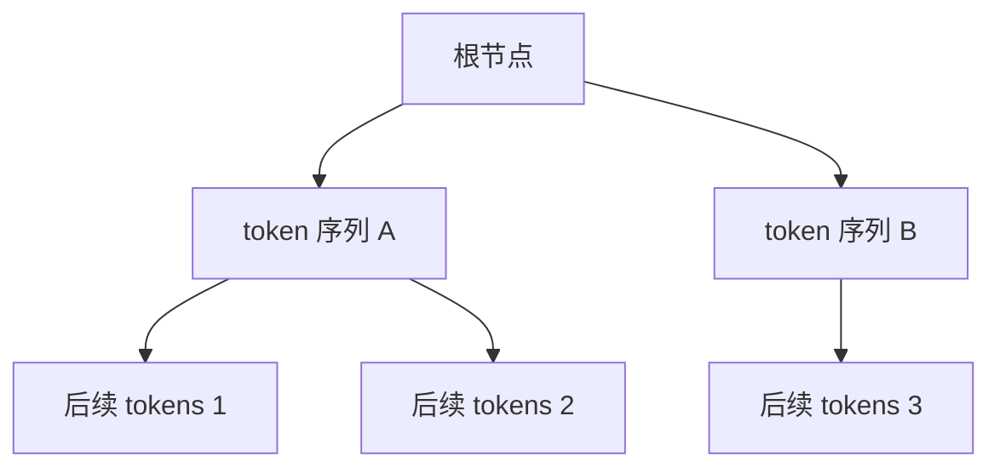
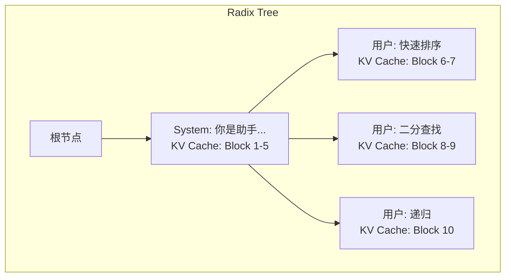
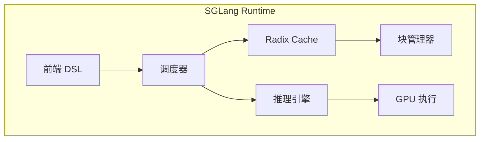

# Radix Attention：前缀复用的极致

在实际应用中，大量请求共享相同的前缀：system prompt、few-shot 示例、多轮对话历史等。Radix Attention 通过基数树管理 KV Cache，实现了前缀的自动复用，是 SGLang 的核心创新。

## 前缀共享的机会

### 场景分析

**场景 1：System Prompt**

```
请求1: "[System] 你是一个专业的编程助手..." + "如何写快速排序？"
请求2: "[System] 你是一个专业的编程助手..." + "如何实现二分查找？"
请求3: "[System] 你是一个专业的编程助手..." + "解释递归的概念"

共享前缀: "[System] 你是一个专业的编程助手..."
```

**场景 2：Few-shot Learning**

```
请求1: "例子1: ... 例子2: ... 例子3: ..." + "请翻译：Hello"
请求2: "例子1: ... 例子2: ... 例子3: ..." + "请翻译：World"

共享前缀: 所有 few-shot 示例
```

**场景 3：多轮对话**

```
第1轮: "用户: 你好 助手: 你好！"
第2轮: "用户: 你好 助手: 你好！" + "用户: 今天天气怎样？"
第3轮: "用户: 你好 助手: 你好！用户: 今天天气怎样？助手: ..." + "用户: 明天呢？"

每轮都包含之前的完整历史
```

**场景 4：思维链 (Chain-of-Thought)**

```
Tree of Thought 推理:
根节点: "问题: ..."
分支1: "问题: ... 思考步骤1a..."
分支2: "问题: ... 思考步骤1b..."
分支1-1: "问题: ... 思考步骤1a... 思考步骤2a..."

多个推理路径共享前面的步骤
```

### 传统方法的浪费

不使用前缀共享时，每个请求独立计算：

```
请求1: 计算 "System prompt" 的 KV (1000 tokens)
请求2: 重新计算 "System prompt" 的 KV (重复!)
请求3: 重新计算 "System prompt" 的 KV (重复!)
...
请求100: 重新计算 "System prompt" 的 KV (重复!)

浪费: 99 × 1000 tokens 的 prefill 计算！
```

## Radix Tree 数据结构

### 什么是 Radix Tree？

**Radix Tree（基数树）**，也称为 Patricia Trie，是一种压缩的前缀树：



### 与普通 Trie 的区别

```
普通 Trie (每个节点一个字符):
       root
      /    \
     H      W
     |      |
     E      O
     |      |
     L      R
     |      |
     L      L
     |      |
     O      D

Radix Tree (合并单链节点):
       root
      /    \
   HELLO  WORLD

更紧凑，查找更快！
```

## Radix Attention 原理

### 核心思想

将 Token 序列组织成 Radix Tree，每个节点关联对应的 KV Cache：



### 请求处理流程

```
新请求到达: "System: 你是助手... 用户: 归并排序"

Step 1: 在 Radix Tree 中查找最长前缀匹配
        匹配: "System: 你是助手..."
        命中长度: 100 tokens

Step 2: 复用匹配部分的 KV Cache
        直接使用 Block 1-5 的 KV Cache
        跳过 100 tokens 的 prefill！

Step 3: 只计算新增部分
        计算 "用户: 归并排序" 的 KV Cache
        追加到新节点

Step 4: 更新 Radix Tree
        添加新节点 "用户: 归并排序"
```

### 代码示意

```python
class RadixNode:
    def __init__(self):
        self.children = {}  # token_hash -> RadixNode
        self.kv_cache_blocks = []  # 对应的 KV Cache 块
        self.token_ids = []  # 本节点存储的 token IDs
        self.ref_count = 0  # 引用计数（用于 LRU）
        self.last_access_time = 0

class RadixAttentionCache:
    def __init__(self, block_manager):
        self.root = RadixNode()
        self.block_manager = block_manager
    
    def match_prefix(self, token_ids):
        """在树中查找最长前缀匹配"""
        node = self.root
        matched_length = 0
        matched_blocks = []
        
        i = 0
        while i < len(token_ids):
            # 计算当前位置开始的 token 的哈希
            token_hash = hash(tuple(token_ids[i:i+16]))  # 简化：取 16 个 token
            
            if token_hash in node.children:
                child = node.children[token_hash]
                # 验证完整匹配
                if self._verify_match(child.token_ids, token_ids[i:]):
                    matched_length += len(child.token_ids)
                    matched_blocks.extend(child.kv_cache_blocks)
                    i += len(child.token_ids)
                    node = child
                else:
                    break
            else:
                break
        
        return matched_length, matched_blocks, node
    
    def insert(self, token_ids, kv_cache_blocks, parent_node):
        """插入新的 token 序列到树中"""
        token_hash = hash(tuple(token_ids[:16]))
        
        new_node = RadixNode()
        new_node.token_ids = token_ids
        new_node.kv_cache_blocks = kv_cache_blocks
        new_node.ref_count = 1
        new_node.last_access_time = time.time()
        
        parent_node.children[token_hash] = new_node
        return new_node
```

## 显存管理与 LRU 驱逐

### 引用计数

每个节点维护引用计数，表示有多少活跃请求使用它：

```python
def acquire(self, node):
    """增加节点引用"""
    while node:
        node.ref_count += 1
        node = node.parent

def release(self, node):
    """减少节点引用"""
    while node:
        node.ref_count -= 1
        node = node.parent
```

### LRU 驱逐策略

当显存不足时，优先驱逐：

1. 引用计数为 0 的节点（没有活跃请求使用）
2. 最久未访问的叶子节点

```python
def evict_if_needed(self, required_blocks):
    """按需驱逐节点释放显存"""
    while self.block_manager.free_blocks < required_blocks:
        # 找到可驱逐的节点（ref_count=0，最久未访问）
        victim = self._find_eviction_candidate()
        
        if victim is None:
            raise MemoryError("Cannot evict: all nodes are in use")
        
        # 释放 KV Cache 块
        for block in victim.kv_cache_blocks:
            self.block_manager.free(block)
        
        # 从树中删除
        self._remove_node(victim)

def _find_eviction_candidate(self):
    """找到最适合驱逐的节点"""
    candidates = []
    
    def collect_leaves(node):
        if not node.children:  # 叶子节点
            if node.ref_count == 0:
                candidates.append(node)
        else:
            for child in node.children.values():
                collect_leaves(child)
    
    collect_leaves(self.root)
    
    if not candidates:
        return None
    
    # 返回最久未访问的
    return min(candidates, key=lambda n: n.last_access_time)
```

## 与 SGLang 的集成

### SGLang 简介

SGLang 是 Radix Attention 的参考实现，提供了高效的 LLM 推理引擎：

```python
import sglang as sgl

@sgl.function
def multi_turn_chat(s, question):
    s += sgl.system("你是一个有帮助的 AI 助手。")
    s += sgl.user(question)
    s += sgl.assistant(sgl.gen("answer", max_tokens=100))

# 多个请求共享 system prompt 的 KV Cache
questions = ["什么是机器学习？", "什么是深度学习？", "什么是强化学习？"]

for q in questions:
    state = multi_turn_chat.run(question=q)
    print(state["answer"])
```

### SGLang 的 Radix Cache 架构



## 性能收益

### TTFT 降低

前缀命中时，跳过大量 prefill 计算：

```
场景: System prompt = 1000 tokens

不使用 Radix Attention:
TTFT = prefill(1000) + prefill(query) + decode_first
     = 100ms + 10ms + 30ms = 140ms

使用 Radix Attention (命中缓存):
TTFT = prefill(query) + decode_first
     = 10ms + 30ms = 40ms

加速: 3.5x
```

### 吞吐量提升

减少重复计算，GPU 可以处理更多请求：

```
测试: 100 个请求，共享 2000 token 的前缀

传统方式:
- 总 prefill tokens: 100 × 2000 = 200,000
- 吞吐量: 1x

Radix Attention:
- 总 prefill tokens: 2000 + 100 × query_len
- 假设 query_len = 100: 2000 + 10000 = 12,000
- 吞吐量提升: 200,000 / 12,000 ≈ 16x (理论上限)
```

### 实际基准测试

| 场景 | 无前缀共享 | Radix Attention | 加速比 |
|------|-----------|-----------------|--------|
| Multi-turn Chat | 1x | 2.5x | 2.5x |
| Few-shot (5 examples) | 1x | 4.2x | 4.2x |
| Batch same prompt | 1x | 8.1x | 8.1x |
| Tree of Thought | 1x | 3.8x | 3.8x |

## 实战：使用 SGLang

### 安装

```bash
pip install sglang[all]
```

### 启动服务

```bash
python -m sglang.launch_server \
    --model-path meta-llama/Llama-2-7b-chat-hf \
    --port 30000
```

### 客户端使用

```python
import sglang as sgl

# 设置后端
sgl.set_default_backend(sgl.RuntimeEndpoint("http://localhost:30000"))

@sgl.function
def qa_with_examples(s, question):
    # 这部分会被缓存和复用
    s += "以下是一些问答示例：\n"
    s += "问：什么是 Python？\n答：Python 是一种编程语言。\n"
    s += "问：什么是 Java？\n答：Java 是一种面向对象的编程语言。\n"
    s += "问：什么是 JavaScript？\n答：JavaScript 是一种 Web 编程语言。\n"
    
    # 实际问题
    s += f"问：{question}\n答："
    s += sgl.gen("answer", max_tokens=100, stop="\n")

# 多个请求共享 few-shot 示例
questions = ["什么是 C++？", "什么是 Rust？", "什么是 Go？"]

for q in questions:
    state = qa_with_examples.run(question=q)
    print(f"Q: {q}")
    print(f"A: {state['answer']}\n")
```

### 多轮对话

```python
@sgl.function
def multi_turn(s):
    s += sgl.system("你是一个有帮助的助手。")
    
    # 第一轮
    s += sgl.user("你好！")
    s += sgl.assistant(sgl.gen("r1", max_tokens=50))
    
    # 第二轮 (复用第一轮的 KV Cache)
    s += sgl.user("今天天气怎么样？")
    s += sgl.assistant(sgl.gen("r2", max_tokens=50))
    
    # 第三轮 (复用前两轮的 KV Cache)
    s += sgl.user("有什么建议吗？")
    s += sgl.assistant(sgl.gen("r3", max_tokens=50))

state = multi_turn.run()
print(f"R1: {state['r1']}")
print(f"R2: {state['r2']}")
print(f"R3: {state['r3']}")
```

## 与其他技术的对比

### vs PagedAttention 的 Prefix Caching

| 特性 | PagedAttention Prefix | Radix Attention |
|------|----------------------|-----------------|
| 前缀匹配 | 手动指定 | 自动发现 |
| 匹配粒度 | 完整前缀 | 任意前缀 |
| 数据结构 | 哈希表 | Radix Tree |
| 部分匹配 | 不支持 | 支持 |
| 动态更新 | 复杂 | 简单 |

### 优势总结

```
Radix Attention 优势:

1. 自动发现: 不需要显式标记共享前缀
2. 最长匹配: 自动找到最长的可复用前缀
3. 渐进式: 支持逐步构建和复用
4. 灵活驱逐: LRU 策略自动管理缓存
```

## 本章小结

- 前缀共享是 LLM 应用中的普遍场景
- Radix Tree 是组织 Token 序列的理想数据结构
- Radix Attention 自动发现和复用共享前缀的 KV Cache
- 显著降低 TTFT，提升吞吐量
- SGLang 是 Radix Attention 的参考实现

## 延伸阅读

- SGLang: Efficient Execution of Structured Language Model Programs
- SGLang GitHub: https://github.com/sgl-project/sglang
- Efficiently Programming Large Language Models using SGLang

---

*下一篇：[分布式推理：突破单卡限制](./19-distributed-inference.md)*
