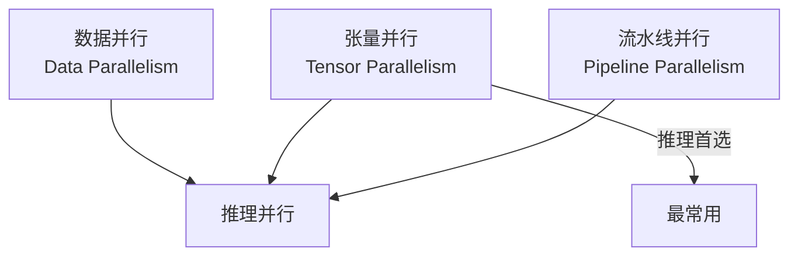
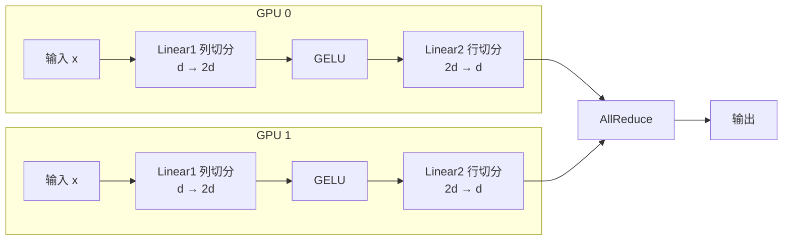
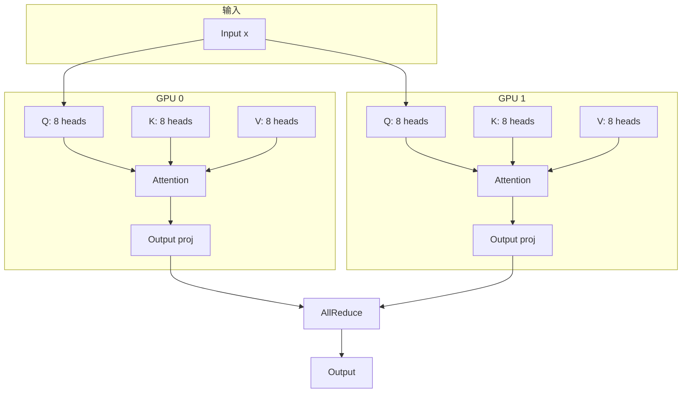
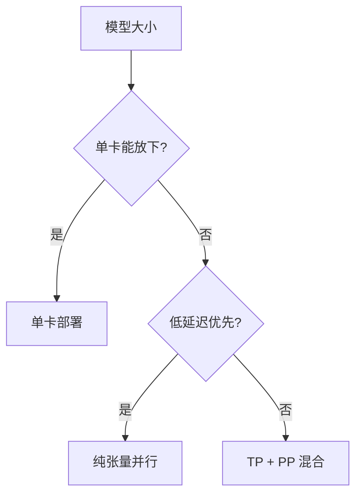

# 分布式推理：突破单卡限制

当模型大到单张 GPU 无法容纳时，分布式推理成为必需。本文将介绍 LLM 推理中常用的并行策略，帮助你理解如何在多卡环境下高效部署大模型。

## 为什么需要分布式推理？

### 显存限制

```
模型显存需求 (FP16):
- LLaMA-7B:   14 GB
- LLaMA-13B:  26 GB
- LLaMA-70B:  140 GB
- GPT-4 (推测): ~3.6 TB

单卡显存:
- A100:  80 GB
- H100:  80 GB
- 4090:  24 GB

结论: 70B+ 模型必须使用多卡
```

### 延迟要求

即使模型能放进单卡，分布式也能降低延迟：

```
单卡推理 LLaMA-70B:
- Token 延迟: ~200ms

4 卡张量并行:
- Token 延迟: ~60ms (加速 3.3x)
```

## 并行策略概览



| 策略 | 切分对象 | 通信模式 | 推理适用性 |
|------|----------|----------|------------|
| 数据并行 | 请求 | 低 | 吞吐量场景 |
| 张量并行 | 层内参数 | 高 | 降低延迟 |
| 流水线并行 | 层间 | 低 | 超大模型 |

## 张量并行 (Tensor Parallelism)

张量并行是推理中最常用的策略，将单层参数切分到多张卡上。

### MLP 层的张量并行

MLP 由两个线性层组成：

```
MLP: x → Linear1 → GELU → Linear2 → output
     (d, 4d)            (4d, d)
```

**切分策略**：



**Column Parallel (列并行)**：

```python
# 原始权重: W (d_in, d_out)
# 切分为 N 份: W_0, W_1, ..., W_{N-1}
# 每份: (d_in, d_out/N)

class ColumnParallelLinear(nn.Module):
    def __init__(self, in_features, out_features, world_size, rank):
        super().__init__()
        self.out_per_partition = out_features // world_size
        self.weight = nn.Parameter(
            torch.empty(self.out_per_partition, in_features)
        )
    
    def forward(self, x):
        # 输出: (batch, seq, out_per_partition)
        return F.linear(x, self.weight)
```

**Row Parallel (行并行)**：

```python
class RowParallelLinear(nn.Module):
    def __init__(self, in_features, out_features, world_size, rank):
        super().__init__()
        self.in_per_partition = in_features // world_size
        self.weight = nn.Parameter(
            torch.empty(out_features, self.in_per_partition)
        )
    
    def forward(self, x):
        # x 已经按最后一维切分
        output = F.linear(x, self.weight)
        # AllReduce 汇总所有卡的结果
        dist.all_reduce(output, op=dist.ReduceOp.SUM)
        return output
```

### Attention 层的张量并行

多头注意力天然适合按 head 切分：

```
原始: 32 heads
TP=4: 每卡 8 heads

GPU 0: heads 0-7
GPU 1: heads 8-15
GPU 2: heads 16-23
GPU 3: heads 24-31
```

**切分示意**：



### 通信原语

张量并行主要使用两种通信原语：

**AllReduce**：汇总所有卡的结果

```python
# 每卡有部分结果 x_i
# AllReduce 后每卡都有 sum(x_0, x_1, ..., x_{N-1})

torch.distributed.all_reduce(tensor, op=ReduceOp.SUM)
```

**AllGather**：收集所有卡的数据

```python
# 每卡有部分数据 x_i
# AllGather 后每卡都有 [x_0, x_1, ..., x_{N-1}]

output_list = [torch.empty_like(tensor) for _ in range(world_size)]
torch.distributed.all_gather(output_list, tensor)
```

### 通信开销分析

```
每个 Transformer 层的通信:
- MLP: 1 次 AllReduce
- Attention: 1 次 AllReduce

总通信量 = 2 × batch_size × seq_len × d_model × dtype_size

以 LLaMA-70B (d_model=8192) 为例:
batch=1, seq=1, FP16:
通信量 = 2 × 1 × 1 × 8192 × 2 = 32KB / 层

NVLink 带宽 ~600 GB/s:
理论延迟 = 32KB / 600GB × 80层 ≈ 4μs (可忽略)
```

## 流水线并行 (Pipeline Parallelism)

将模型按层切分到不同 GPU：

```
LLaMA-70B: 80 层

4 卡流水线:
GPU 0: 层 0-19
GPU 1: 层 20-39
GPU 2: 层 40-59
GPU 3: 层 60-79
```

### 推理中的流水线


### 问题：气泡

推理时，流水线会产生空闲时间（气泡）：

```
时间 →
GPU 0: [计算][等待][等待][等待]
GPU 1: [等待][计算][等待][等待]
GPU 2: [等待][等待][计算][等待]
GPU 3: [等待][等待][等待][计算]

气泡占比: 75%!
```

### 解决方案：Micro-batching

将 batch 切分为多个 micro-batch：

```
时间 →
GPU 0: [M1][M2][M3][M4]
GPU 1: [  ][M1][M2][M3][M4]
GPU 2: [  ][  ][M1][M2][M3][M4]
GPU 3: [  ][  ][  ][M1][M2][M3][M4]

气泡大大减少！
```

### 推理中何时用流水线？

| 场景 | 推荐策略 |
|------|----------|
| 单请求低延迟 | 纯张量并行 |
| 高吞吐量 | 张量并行 + 流水线 |
| 超大模型 (>1T) | 必须用流水线 |

## 混合并行

### 2D 并行：TP + PP

组合张量并行和流水线并行：

```
8 GPUs 部署 70B 模型:
- TP = 4 (每层分到 4 卡)
- PP = 2 (分为 2 段)

    ┌─────────────────────┬─────────────────────┐
    │    Pipeline Stage 0  │   Pipeline Stage 1  │
    │      (层 0-39)       │      (层 40-79)     │
    ├─────────────────────┼─────────────────────┤
    │ GPU 0  GPU 1        │ GPU 4  GPU 5        │
    │ GPU 2  GPU 3        │ GPU 6  GPU 7        │
    │   (TP group 0)      │   (TP group 1)      │
    └─────────────────────┴─────────────────────┘
```

### 配置示例

```python
# vLLM 配置
from vllm import LLM

llm = LLM(
    model="meta-llama/Llama-2-70b-chat-hf",
    tensor_parallel_size=4,      # TP
    pipeline_parallel_size=2,    # PP
    # 总共需要 4 × 2 = 8 张 GPU
)
```

## 分布式 KV Cache

### 挑战

张量并行时，KV Cache 也需要分布式管理：

```
原始 KV Cache (每层):
K: (batch, num_heads, seq_len, head_dim)
V: (batch, num_heads, seq_len, head_dim)

TP=4 时:
每卡存储 num_heads/4 个 head 的 KV
```

### AllGather KV

某些操作需要完整的 KV，使用 AllGather 收集：

```python
def gather_kv_across_tp(k, v, tp_group):
    """收集所有 TP rank 的 KV"""
    world_size = dist.get_world_size(tp_group)
    
    k_gathered = [torch.empty_like(k) for _ in range(world_size)]
    v_gathered = [torch.empty_like(v) for _ in range(world_size)]
    
    dist.all_gather(k_gathered, k, group=tp_group)
    dist.all_gather(v_gathered, v, group=tp_group)
    
    # 沿 head 维度拼接
    k_full = torch.cat(k_gathered, dim=1)  # (batch, full_heads, seq, head_dim)
    v_full = torch.cat(v_gathered, dim=1)
    
    return k_full, v_full
```

## 实战：多卡推理部署

### vLLM 多卡部署

```bash
# 4 卡张量并行
python -m vllm.entrypoints.openai.api_server \
    --model meta-llama/Llama-2-70b-chat-hf \
    --tensor-parallel-size 4 \
    --port 8000
```

### HuggingFace 多卡

```python
from transformers import AutoModelForCausalLM, AutoTokenizer

model = AutoModelForCausalLM.from_pretrained(
    "meta-llama/Llama-2-70b-chat-hf",
    device_map="auto",  # 自动分配到多卡
    torch_dtype=torch.float16,
)
```

### SGLang 多卡

```bash
python -m sglang.launch_server \
    --model-path meta-llama/Llama-2-70b-chat-hf \
    --tp 4 \
    --port 30000
```

## 通信优化

### NVLink vs PCIe

```
NVLink (同节点):
- 带宽: 600 GB/s (H100)
- 延迟: ~1μs

PCIe 4.0:
- 带宽: 32 GB/s
- 延迟: ~10μs

InfiniBand (跨节点):
- 带宽: 400 Gb/s = 50 GB/s
- 延迟: ~1-2μs
```

**建议**：
- TP 组内使用 NVLink
- PP 跨节点使用 InfiniBand

### 通信与计算重叠

```python
# 朴素方式: 计算完再通信
output = layer(input)
dist.all_reduce(output)  # 等待

# 重叠方式: 边计算边通信
output_part1 = layer_part1(input)
handle = dist.all_reduce(output_part1, async_op=True)  # 异步
output_part2 = layer_part2(input)  # 同时计算其他部分
handle.wait()  # 等待通信完成
```

## 性能基准

### 延迟对比

| 模型 | 单卡 | TP=2 | TP=4 | TP=8 |
|------|------|------|------|------|
| LLaMA-7B | 30ms | 18ms | 12ms | 10ms |
| LLaMA-70B | OOM | 120ms | 65ms | 40ms |

### 吞吐量对比

| 配置 | 吞吐量 (tokens/s) |
|------|-------------------|
| 1×A100 (7B) | 800 |
| 4×A100 (70B, TP=4) | 1200 |
| 8×A100 (70B, TP=8) | 2000 |

## 部署建议

### 选择并行策略



### 最佳实践

1. **优先张量并行**：通信可与计算重叠
2. **TP 大小选择**：通常 TP=4 或 TP=8
3. **同节点通信**：利用 NVLink
4. **显存分配**：预留 10-20% 给 KV Cache

## 本章小结

- 分布式推理是部署大模型的必需技术
- 张量并行是推理的首选策略
- 流水线并行适合超大模型
- 通信优化对性能至关重要
- 选择策略需权衡延迟和吞吐量

## 延伸阅读

- Megatron-LM: Training Multi-Billion Parameter Language Models
- Efficient Large-Scale Language Model Training on GPU Clusters
- vLLM: Easy, Fast, and Cheap LLM Serving

---

*下一篇：[模型量化：用更少资源运行大模型](./20-quantization.md)*
