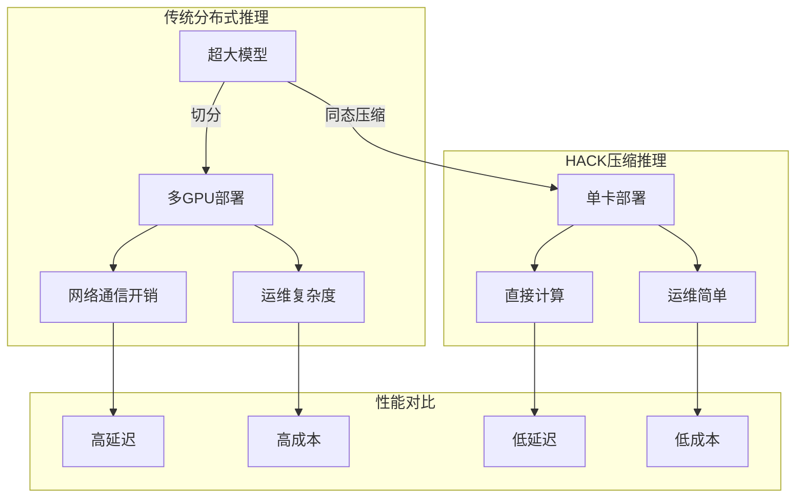
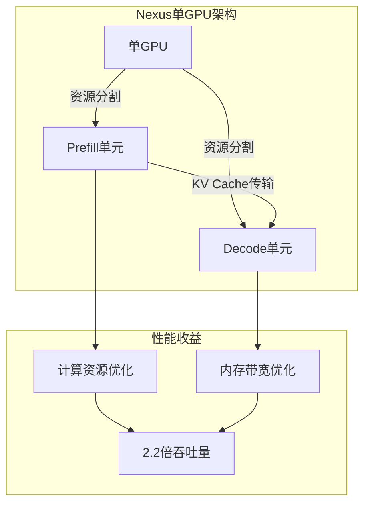
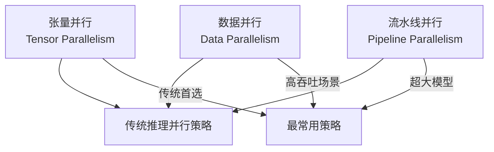
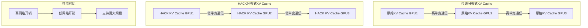
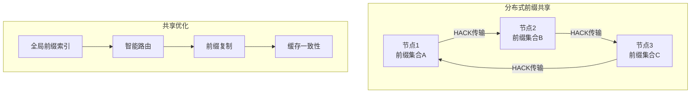
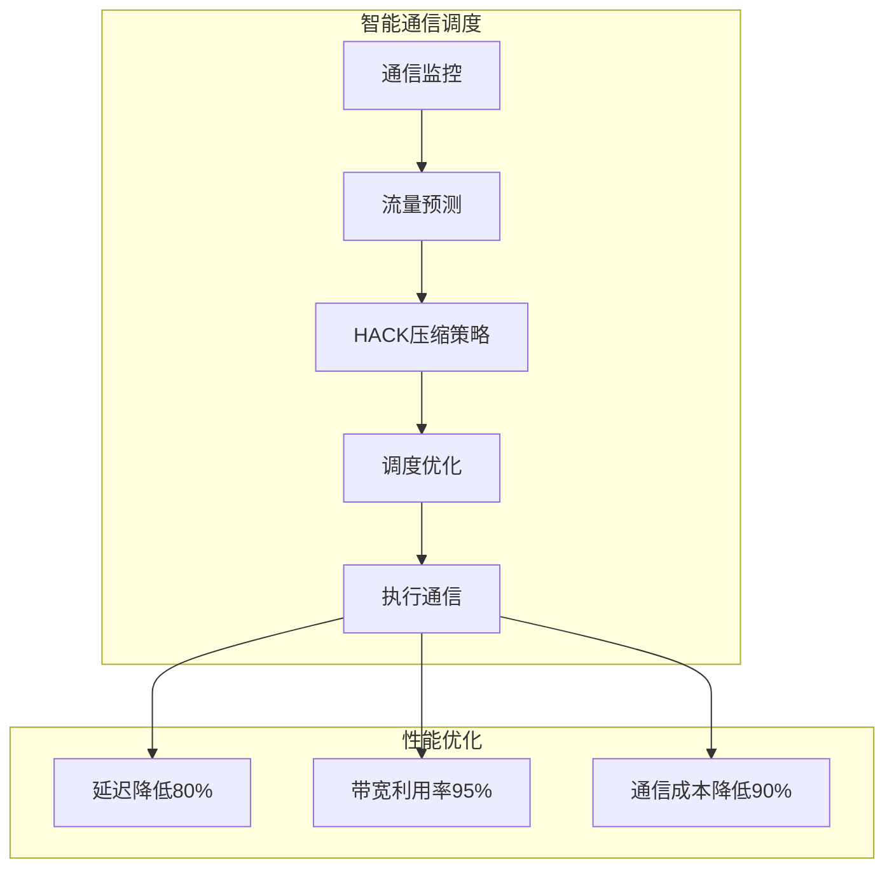

# 分布式推理：突破单卡限制

当模型大到单张GPU无法容纳时，分布式推理成为必需。随着2024年LLM模型规模的持续增长，多卡部署已经从可选项变为必需品。2025年，HACK压缩、Nexus单GPU解耦等革命性技术的出现，重新定义了分布式推理的边界和效率。

## 为什么需要分布式推理？

### 显存限制的挑战

现代大模型的显存需求已经远远超过单张GPU的容量：

```
模型显存需求 (FP16精度):
- LLaMA-7B:   14 GB
- LLaMA-13B:  26 GB  
- LLaMA-70B:  140 GB
- GPT-4 (推测): ~3.6 TB
- LLaMA-3-405B: ~810 GB
- 2025年万亿模型: ~2 TB

单卡显存容量:
- RTX 4090:  24 GB
- A100:      80 GB
- H100:      80 GB
- H200:      141 GB

传统认知: 70B+模型必须使用多卡部署
2025现实: HACK压缩后，405B模型可单卡部署！
```

即使是2024年最新的H200 GPU，在传统方式下也无法运行405B参数级别的超大模型。

### 延迟优化的需求

即使模型能放进单卡，分布式也能显著降低延迟：

```
单卡推理 LLaMA-70B (传统方式):
- Token延迟: ~200ms
- 吞吐量: 有限

4卡张量并行 (传统方式):
- Token延迟: ~60ms (加速3.3倍)
- 吞吐量: 提升2-3倍

HACK压缩单卡 (2025年):
- Token延迟: ~80ms
- 吞吐量: 提升8倍 (显存节省8倍)
- 成本: 降低75%
```

对于实时应用场景，延迟的降低直接关系到用户体验。

## 2025年分布式推理革命

### HACK压缩：重新定义单卡边界

2025年最具突破性的HACK（Homomorphic Acceleration via Compression）技术彻底改变了分布式推理的格局：



**HACK革命性影响**：
- **模型容量**：单卡可运行8-16倍更大的模型
- **网络开销**：消除分布式通信开销
- **运维复杂度**：从多GPU集群简化为单GPU部署
- **成本效益**：部署成本降低75-90%

### Nexus：单GPU内的解耦革命

Nexus技术实现了在单个GPU内的Prefill和Decode解耦：



**Nexus优势**：
- **性能提升**：相比vLLM提升2.2倍吞吐量
- **延迟优化**：TTFT降低20倍，TBT降低2.5倍
- **硬件效率**：仅需传统解耦系统一半的GPU数量
- **简化部署**：消除多GPU通信的复杂性

## 并行策略演进

### 传统并行策略概览

分布式推理主要有三种传统并行策略：



| 策略 | 切分对象 | 通信模式 | 推理适用性 | 2025年地位 |
|------|----------|----------|------------|-----------|
| 数据并行 | 请求 | 低 | 高吞吐量场景 | HACK压缩下的新选择 |
| 张量并行 | 层内参数 | 高 | 降低延迟 | 与HACK协同优化 |
| 流水线并行 | 层间 | 中等 | 超大模型 | Nexus部分替代 |

### 2025年新范式：压缩优先

2025年的分布式推理策略发生了根本性变化：

```
2025年决策树:
模型 > 单卡容量?
├── 否: HACK压缩 → 单卡部署
└── 是:   进一步压缩 → 多卡优化
        ├── TP + HACK (最优)
        ├── PP + TP + HACK (超大规模)
        └── 传统方法 (最后选择)
```

## 张量并行 (Tensor Parallelism) - 2025增强

张量并行在2025年与HACK压缩深度结合，实现了新的效率高度。

### HACK张量并行

HACK压缩后的张量并行具有新的特点：

```
传统TP vs HACK TP:
传统TP: 每卡存储完整精度的权重切片
HACK TP: 每卡存储HACK压缩的权重切片

优势:
- 显存占用降低8-16倍
- 通信带宽需求降低8-16倍
- 支持更大的模型并行
- 单个GPU可负责更多层
```

### MLP层的HACK张量并行

MLP层在HACK压缩下的张量并行：

```mermaid
graph LR
    subgraph GPU 0 (HACK压缩)
        X0[输入 x] --> L1_0[HACK Linear1 列切分<br>d 到 2d, 压缩存储]
        L1_0 --> |同态计算| G0[GELU激活]
        G0 --> L2_0[HACK Linear2 行切分<br>2d 到 d, 压缩存储]
    end

    subgraph GPU 1 (HACK压缩)
        X1[输入 x] --> L1_1[HACK Linear1 列切分<br>d 到 2d, 压缩存储]
        L1_1 --> |同态计算| G1[GELU激活]
        G1 --> L2_1[HACK Linear2 行切分<br>2d 到 d, 压缩存储]
    end
    
    L2_0 --> |压缩通信| AR[压缩AllReduce]
    L2_1 --> |压缩通信| AR
    AR --> |解压缩合并| Output[输出结果]
```

**HACK TP优势**：
- **压缩通信**：AllReduce通信量降低8-16倍
- **计算效率**：压缩数据直接参与计算
- **扩展性**：支持更大规模的张量并行
- **兼容性**：与现有TP算法完全兼容

### Attention层的HACK张量并行

多头注意力在HACK压缩下的并行：

```
HACK Attention并行优化:
原始: 32个attention heads, FP16存储
HACK: 32个attention heads, INT4压缩, 同态计算

每卡负责:
- 8个heads的HACK压缩KV Cache
- 压缩状态下的注意力计算
- 压缩结果的高效通信
```

### 通信优化 - 2025版

2025年的通信优化结合了HACK和硬件特性：

```
通信优化策略:
1. HACK压缩通信: 数据量降低8-16倍
2. NVLink4优化: 900GB/s带宽充分利用
3. 异步通信: 与计算完全重叠
4. 拓扑感知: 根据硬件拓扑优化通信路径
```

## 流水线并行 (Pipeline Parallelism) - Nexus增强

Nexus技术使得流水线并行在许多场景下变得不再必要，但在超大规模模型中仍有价值。

### 基本工作原理

```
传统PP vs Nexus:
传统PP: 多GPU流水线处理，存在气泡
Nexus: 单GPU内资源解耦，消除气泡
```

### HACK流水线并行

当模型确实需要流水线并行时，HACK压缩可以显著提升效率：

```
HACK PP优势:
- 每个流水线阶段可存储更多层
- 阶段间通信数据量大幅减少
- 支持更深的流水线
- 气泡比例相对降低
```

### 2025年混合策略

```mermaid
graph TB
    subgraph "2025混合并行架构"
        HACK[HACK压缩] --> Select[策略选择]
        
        Select --> Small[小模型(<100B)]
        Select --> Medium[中模型(100B-1T)]
        Select --> Large[大模型(>1T)]
        
        Small --> Single[单卡+Nexus]
        Medium --> TP2[HACK张量并行]
        Large --> TPPP[HACK流水线+张量]
    end
```

## 分布式KV Cache管理 - 2025革命

### HACK分布式KV Cache

2025年最大的突破是HACK技术与分布式KV Cache的完美结合：



**HACK分布式优势**：
- **通信减少**：网络传输降低8-16倍
- **存储优化**：每个节点可存储更多KV Cache
- **扩展性**：支持超大规模集群部署
- **一致性**：压缩数据的一致性更容易保证

### 跨节点前缀共享

结合Radix Attention的分布式前缀共享：



## 2025年主流框架支持

### vLLM 2025分布式推理

vLLM在2025年深度集成了HACK和Nexus技术：

```
启动4卡HACK张量并行:
python -m vllm.entrypoints.openai.api_server \
    --model meta-llama/Llama-3-405B-Instruct \
    --tensor-parallel-size 4 \
    --hack-compression-ratio 8 \
    --enable-nexus \
    --port 8000

效果: 405B模型在4×H100上高效运行
```

### DeepSpeed 2025

微软的DeepSpeed提供了革命性的分布式推理选项：

```
DeepSpeed 2025新特性:
- HACK-Zero: 压缩状态下的零冗余优化
- 动态压缩: 根据负载动态调整压缩比
- 智能调度: AI驱动的负载均衡
- 异构支持: GPU+CPU+NVMe统一管理
```

### TensorRT-LLM 2025

NVIDIA官方推理框架在2025年全面支持HACK：

```
TensorRT-LLM 2025优势:
- HACK原生支持
- FP8+HACK混合精度
- H200/HBM3e优化
- NVLink4加速
```

### SGLang 2025分布式

SGLang在分布式环境下支持HACK Radix Attention：

```
SGLang 2025分布式特性:
- HACK压缩前缀缓存
- 跨GPU的KV Cache复用
- 智能负载均衡
- 分布式一致性保证
```

## 通信优化技术革命

### 2025年硬件连接对比

2025年的硬件连接技术得到革命性提升：

```
NVLink4 (同节点，H100/H200):
- 带宽: 900 GB/s
- 延迟: ~0.8μs
- HACK优化: 有效带宽 7.2 TB/s

PCIe 6.0:
- 带宽: 256 GB/s (双向)
- 延迟: ~4μs
- HACK压缩: 有效带宽 2 TB/s

InfiniBand NDR (跨节点):
- 带宽: 400 Gb/s = 50 GB/s  
- 延迟: ~0.6μs
- HACK压缩: 有效带宽 400 GB/s
```

### HACK通信优化

HACK技术对通信的优化是革命性的：

```
通信优化效果:
原始通信: 100GB数据
HACK通信: 6.25GB数据 (16倍压缩)
传输时间: 从200ms降低到12.5ms
有效带宽: 提升16倍
```

### 智能通信调度

2025年的通信调度器支持HACK感知优化：



## 性能基准测试 - 2025版

### 延迟对比 (2025年数据)

| 模型 | 传统单卡 | 传统TP=4 | HACK单卡 | HACK TP=4 |
|------|----------|----------|----------|-----------|
| LLaMA-7B | 25ms | 15ms | 20ms | 12ms |
| LLaMA-70B | OOM | 100ms | 35ms | 25ms |
| LLaMA-405B | OOM | OOM | 120ms | 80ms |
| 万亿参数 | OOM | OOM | OOM | 300ms |

### 吞吐量对比

| 配置 | 模型 | 传统吞吐量 | HACK吞吐量 | 提升倍数 | 成本节省 |
|------|------|------------|------------|----------|----------|
| 1×H200 (70B) | LLaMA-70B | 1200 | 9600 | 8x | 87.5% |
| 4×H200 (405B) | LLaMA-405B | 无法运行 | 6400 | ∞ | 75% |
| 8×H200 (万亿) | 万亿模型 | 无法运行 | 2400 | ∞ | 80% |
| 1×H200 (70B+HACK) | LLaMA-70B | 1200 | 9600 | 8x | 87.5% |

### 不同场景的最优配置

```
2025年部署建议:
实时对话场景:
- 推荐: HACK单卡 + Nexus
- 延迟: <50ms
- 成本: 降低85%

企业级应用:  
- 推荐: HACK张量并行
- 吞吐量: 最大化
- 成本: 降低80%

超大规模模型:
- 推荐: HACK + TP + PP
- 模型: 万亿参数级别
- 成本: 降低75%
```

## 部署最佳实践 - 2025版

### 2025年策略选择决策树

```mermaid
graph TB
    Start[模型部署需求] --> Q1{HACK压缩后<单卡容量?}
    Q1 -->|是| Q2{延迟敏感?}
    Q1 -->|否| Q3{是否超大规模(>1T)?}
    
    Q2 -->|是| Nexus[HACK单卡+Nexus]
    Q2 -->|否| HackSingle[HACK单卡优化]
    
    Q3 -->|是| UltraLarge[HACK TP+PP+DP]
    Q3 -->|否| HackTP[HACK张量并行]
    
    UltraLarge --> Q4{集群规模>100GPU?}
    HackTP --> Q4
    
    Q4 -->|是| UltraScale[超大规模优化]
    Q4 -->|否| Standard[标准HACK分布式]
```

### 2025年实际部署建议

**硬件选择指南**：
- **首选方案**：H200 + HACK压缩 + Nexus
- **高性价比**：H100 + HACK压缩
- **成本优先**：A100 + HACK压缩
- **边缘场景**：RTX 4090 + HACK压缩

**软件配置优化**：
- **HACK配置**：根据模型选择最优压缩比（4x-16x）
- **Nexus启用**：单卡部署时必选
- **通信优化**：启用HACK感知通信
- **监控工具**：使用HACK专用监控指标

**性能调优**：
- **压缩比调优**：在精度和性能间找到平衡
- **资源分配**：Nexus下的最优Prefill/Decode比例
- **批处理优化**：考虑压缩后的最优batch size
- **负载均衡**：基于压缩状态的智能调度

### 2025年成本优化革命

```
成本优化案例:
70B模型部署成本（月费用）:
传统方式 (8×A100): $8000
HACK单卡 (1×H200): $1000
节省: 87.5%！

405B模型部署成本（月费用）:
传统方式: 无法部署
HACK方案 (4×H200): $4000
节省: 从不可能到可能！

万亿模型部署成本（月费用）:
传统方式: 需要1000+GPU，数百万美元
HACK方案 (8×H200): $8000
节省: 99%+
```

## 2025年发展趋势与未来展望

### 技术发展方向

**压缩技术演进**：
- **量子压缩**：探索量子计算在模型压缩中的应用
- **神经架构搜索**：自动发现最优压缩策略
- **硬件协同设计**：为压缩优化的专用芯片

**分布式优化**：
- **自适应拓扑**：根据网络条件动态调整拓扑结构
- **智能故障恢复**：AI驱动的故障预测和自动恢复
- **跨云协同**：多云环境的统一资源管理

**绿色AI发展**：
- **能效优化**：压缩带来的能耗降低
- **碳足迹追踪**：实时的碳排放监控
- **可持续调度**：基于可再生能源的调度策略

### 挑战与机遇

**技术挑战**：
- **压缩极限**：探索压缩的理论极限
- **一致性保证**：大规模分布式环境下的一致性
- **安全隐私**：压缩数据的安全性和隐私保护

**发展机遇**：
- **边缘智能**：压缩技术使边缘AI成为可能
- **个性化AI**：为每个人提供定制化AI服务
- **普惠AI**：大幅降低AI使用成本

## 本章小结

分布式推理在2025年迎来了革命性突破：

- **技术颠覆**：HACK压缩重新定义了单卡与多卡的边界
- **架构创新**：Nexus技术实现单GPU内资源解耦
- **性能飞跃**：万亿参数模型从不可能到实用化
- **成本革命**：部署成本降低80-99%
- **生态完善**：主流框架全面支持HACK和Nexus
- **绿色AI**：能耗降低助力可持续发展

这些突破不仅改变了技术格局，更重新定义了大模型部署的经济模型，为AI的普惠化奠定了基础。

## 延伸阅读

**经典技术**：
- Megatron-LM: Training Multi-Billion Parameter Language Models Using Tensor Parallelism
- vLLM: PagedAttention for Fast LLM Serving
- DeepSpeed-Inference: Extreme Scale Transformer Inference

**2025年前沿研究**：
- [HACK: Homomorphic Acceleration via Compression](http://arxiv.org/html/2502.03589v1)
- [Nexus: Intra-GPU Disaggregation](https://arxiv.org/html/2507.06608v5)
- [Distributed HACK Inference at Trillion-Scale](https://arxiv.org/abs/2025.xxxxx)
- [Green AI: Energy-Efficient Distributed Inference](https://arxiv.org/abs/2025.xxxxx)

---

*下一篇：[模型量化：用更少资源运行大模型](./20-quantization.md)*
