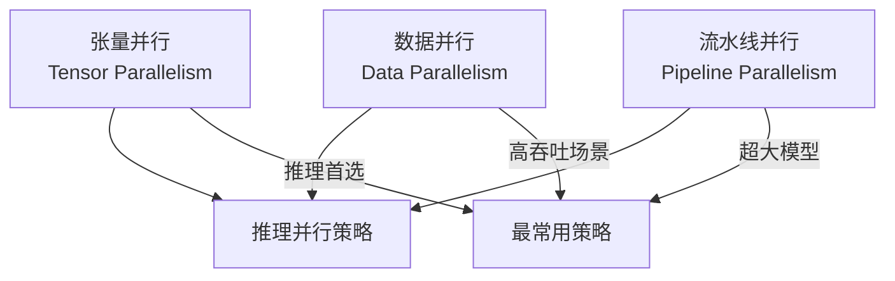
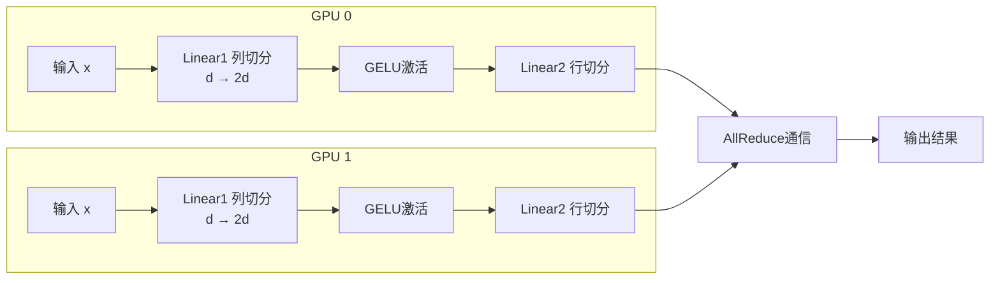
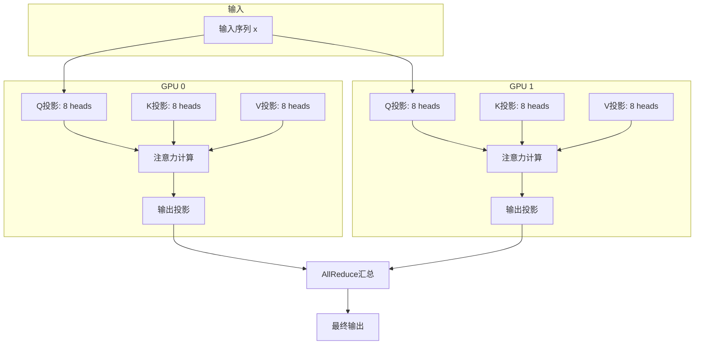
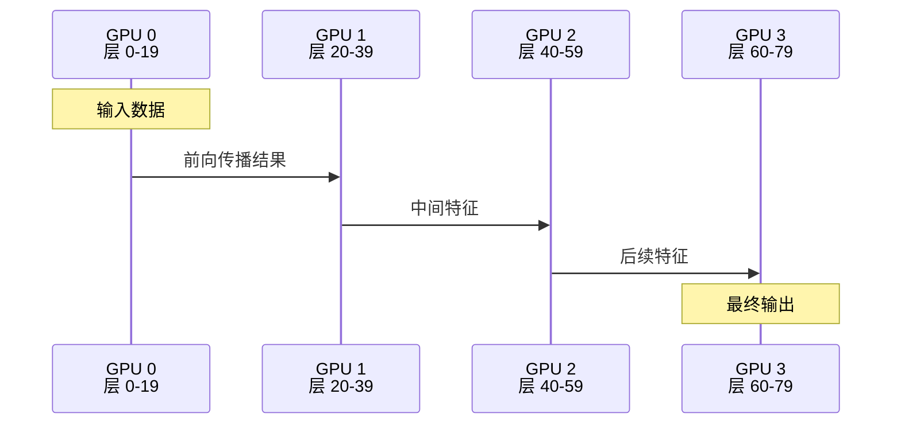
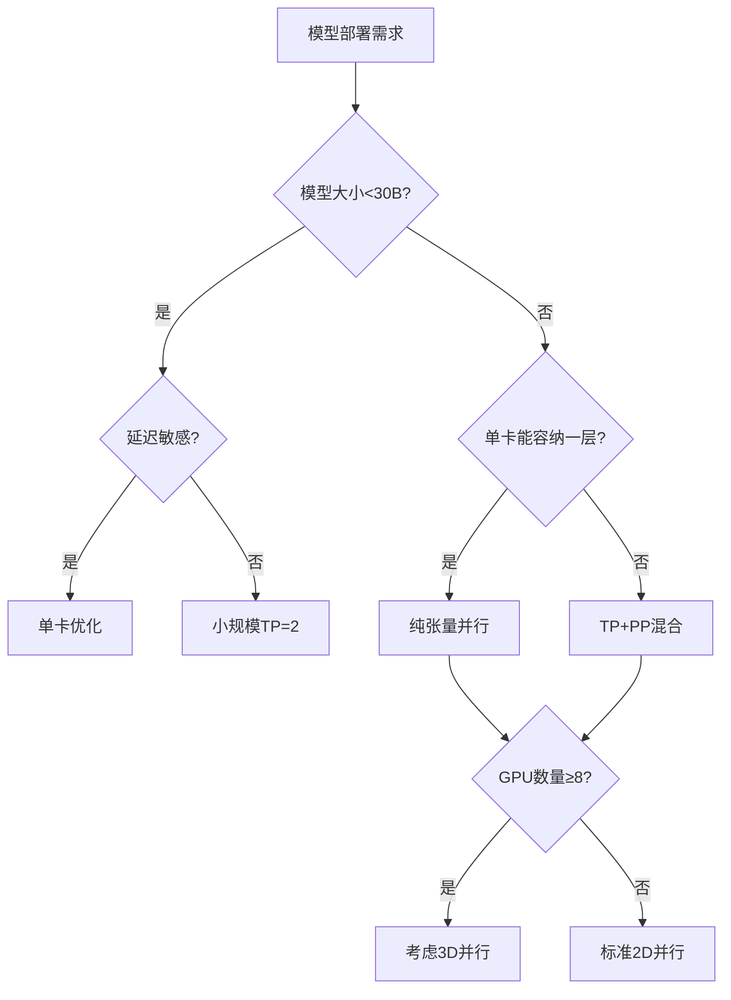

# 分布式推理：突破单卡限制

当模型大到单张GPU无法容纳时，分布式推理成为必需。随着2024年LLM模型规模的持续增长，多卡部署已经从可选项变为必需品。本文将介绍LLM推理中常用的并行策略，帮助你理解如何在多卡环境下高效部署大模型。

## 为什么需要分布式推理？

### 显存限制的挑战

现代大模型的显存需求已经远远超过单张GPU的容量：

```
模型显存需求 (FP16精度):
- LLaMA-7B:   14 GB
- LLaMA-13B:  26 GB  
- LLaMA-70B:  140 GB
- GPT-4 (推测): ~3.6 TB
- LLaMA-3-405B: ~810 GB

单卡显存容量:
- RTX 4090:  24 GB
- A100:      80 GB
- H100:      80 GB
- H200:      141 GB

结论: 70B+模型必须使用多卡部署
```

即使是2024年最新的H200 GPU，也无法单独运行405B参数级别的超大模型。

### 延迟优化的需求

即使模型能放进单卡，分布式也能显著降低延迟：

```
单卡推理 LLaMA-70B (如果可能):
- Token延迟: ~200ms
- 吞吐量: 有限

4卡张量并行:
- Token延迟: ~60ms (加速3.3倍)
- 吞吐量: 提升2-3倍
```

对于实时应用场景，延迟的降低直接关系到用户体验。

## 并行策略概览

分布式推理主要有三种并行策略，每种策略适用于不同的场景：



| 策略 | 切分对象 | 通信模式 | 推理适用性 | 2024年发展 |
|------|----------|----------|------------|-----------|
| 数据并行 | 请求 | 低 | 高吞吐量场景 | 动态负载均衡 |
| 张量并行 | 层内参数 | 高 | 降低延迟 | NVLink4优化 |
| 流水线并行 | 层间 | 中等 | 超大模型 | 交错式PP |

## 张量并行 (Tensor Parallelism)

张量并行是推理中最常用的策略，将单层参数切分到多张卡上。它在2024年得到了进一步优化，特别是与NVLink4的结合。

### MLP层的张量并行

MLP层由两个线性层组成：升维和降维。张量并行通过矩阵乘法的分配律实现并行计算：

```
MLP结构: x → Linear1 → GELU → Linear2 → output
              (d, 4d)            (4d, d)
```

**切分策略**：



**列并行工作原理**：
- 将权重矩阵按列切分到多张卡
- 每张卡计算输出的一部分
- 例如：d→4d的矩阵切分为4张卡，每张卡处理d→d

**行并行工作原理**：
- 将权重矩阵按行切分到多张卡
- 每张卡计算完整的输出维度
- 通过AllReduce操作汇总所有卡的结果

### Attention层的张量并行

多头注意力机制天然适合按head切分，这是张量并行最成功的应用场景：

```
原始: 32个attention heads
TP=4切分: 每张卡8个heads

GPU 0: heads 0-7
GPU 1: heads 8-15  
GPU 2: heads 16-23
GPU 3: heads 24-31
```

**切分示意**：



每张卡独立计算自己负责的attention heads，然后通过AllReduce操作合并结果。

### 通信原语

张量并行主要使用两种高效的通信原语：

**AllReduce（全归约）**：
- 汇总所有卡的结果并广播给每张卡
- 用于行并行线性层的输出合并
- NVIDIA的NCCL提供了高度优化的实现

**AllGather（全收集）**：
- 收集所有卡的部分数据到每张卡
- 用于某些需要完整张量的操作
- 在KV Cache管理中经常使用

### 通信开销分析

2024年NVLink4的带宽提升大幅降低了通信开销：

```
每个Transformer层的通信量:
- MLP层: 1次AllReduce
- Attention层: 1次AllReduce

总通信量 = 2 × batch_size × seq_len × d_model × dtype_size

以LLaMA-70B (d_model=8192)为例:
batch=1, seq=1, FP16:
通信量 = 2 × 1 × 1 × 8192 × 2 = 32KB/层

NVLink4带宽 ~900GB/s:
理论延迟 = 32KB / 900GB × 80层 ≈ 3μs (几乎可忽略)
```

实际应用中，通信与计算的重叠进一步降低了有效延迟。

## 流水线并行 (Pipeline Parallelism)

流水线并行将模型按层切分到不同GPU，每个GPU负责连续的若干层。

### 基本工作原理

```
LLaMA-70B: 80层

4卡流水线切分:
GPU 0: 层 0-19
GPU 1: 层 20-39  
GPU 2: 层 40-59
GPU 3: 层 60-79
```

**推理流水线**：



### 流水线气泡问题

推理时，流水线会产生空闲时间（气泡），这是主要效率损失来源：

```
时间轴 →
GPU 0: [计算][等待][等待][等待]
GPU 1: [等待][计算][等待][等待]  
GPU 2: [等待][等待][计算][等待]
GPU 3: [等待][等待][等待][计算]

气泡占比: 75%! (严重浪费)
```

### 2024年优化方案

**交错式流水线并行**：
将每层的计算进一步细分，减少气泡时间：

```
传统流水线:
GPU 0: [层0-19]
GPU 1: [层20-39]

交错式流水线:
GPU 0: [层0,4,8...][层1,5,9...][层2,6,10...][层3,7,11...]
GPU 1: [层20,24...][层21,25...][层22,26...][层23,27...]
```

**动态micro-batching**：
根据实时负载动态调整micro-batch大小，最大化GPU利用率。

### 推理中的应用场景

| 场景 | 推荐策略 | 原因 |
|------|----------|------|
| 单请求低延迟 | 纯张量并行 | 避免流水线气泡 |
| 高吞吐量 | TP + PP混合 | 充分利用多卡资源 |
| 超大模型(>1T) | 必须用流水线 | 单卡无法容纳一层 |

## 混合并行策略

### 2D并行：TP + PP

组合张量并行和流水线并行是最常见的部署策略：

```
8GPU部署70B模型:
- TP = 4 (每层分到4卡)
- PP = 2 (分为2段)

    ┌─────────────────────┬─────────────────────┐
    │    Pipeline Stage 0  │   Pipeline Stage 1  │
    │      (层 0-39)       │      (层 40-79)     │
    ├─────────────────────┼─────────────────────┤
    │ GPU 0  GPU 1        │ GPU 4  GPU 5        │
    │ GPU 2  GPU 3        │ GPU 6  GPU 7        │
    │   (TP组0)           │   (TP组1)           │
    └─────────────────────┴─────────────────────┘
```

这种配置在2024年成为70B模型的标准部署方案。

### 3D并行：TP + PP + DP

对于超大规模部署，还可以加入数据并行：

```
16GPU部署配置:
- TP = 4 (层内切分)
- PP = 2 (层间切分)  
- DP = 2 (请求复制)

总共支持: 4 × 2 × 2 = 16张GPU
```

## 分布式KV Cache管理

### 挑战与解决方案

张量并行时，KV Cache也需要分布式管理：

```
原始KV Cache (每层):
K: (batch, num_heads, seq_len, head_dim)
V: (batch, num_heads, seq_len, head_dim)

TP=4切分时:
每卡存储num_heads/4个head的KV
```

**AllGather操作**：
某些attention操作需要完整的KV矩阵，这时需要通过AllGather收集所有TP rank的KV数据。

**分布式缓存策略**：
- 每张卡管理自己负责的heads的KV Cache
- 通过高效的通信协议同步必要的数据
- 2024年的vLLM实现了张量并行的KV Cache优化

### PagedAttention的分布式扩展

PagedAttention在分布式环境下的扩展：

```
分布式块管理:
- 每张卡有自己的物理块池
- 通过协调器统一分配逻辑块
- 支持跨卡的KV Cache共享
```

## 2024年主流框架支持

### vLLM分布式推理

vLLM在2024年大幅提升了分布式推理能力：

```
启动4卡张量并行:
python -m vllm.entrypoints.openai.api_server \
    --model meta-llama/Llama-3-70B-Instruct \
    --tensor-parallel-size 4 \
    --port 8000

混合并行部署:
python -m vllm.entrypoints.openai.api_server \
    --model meta-llama/Llama-3-70B-Instruct \
    --tensor-parallel-size 4 \
    --pipeline-parallel-size 2 \
    --port 8000
```

### DeepSpeed Inference

微软的DeepSpeed提供了灵活的分布式推理选项：

```
ZeRO Inference支持:
- 支持动态张量并行
- 智能通信调度
- 内存使用优化
```

### TensorRT-LLM

NVIDIA官方推理框架在2024年加入FP8支持：

```
优势:
- 高度优化的kernel
- FP8精度推理
- 与NVIDIA硬件深度集成
- 支持最新的H100/H200 GPU
```

### SGLang多卡支持

SGLang在分布式环境下支持Radix Attention：

```
特点:
- 分布式前缀缓存
- 跨GPU的KV Cache复用
- 智能负载均衡
```

## 通信优化技术

### 硬件连接对比

2024年的硬件连接技术对比：

```
NVLink4 (同节点，H100/H200):
- 带宽: 900 GB/s
- 延迟: ~0.8μs
- 支持GPU-to-GPU直接通信

PCIe 5.0:
- 带宽: 128 GB/s (双向)
- 延迟: ~5μs

InfiniBand HDR (跨节点):
- 带宽: 200 Gb/s = 25 GB/s  
- 延迟: ~0.8μs
- 适合RDMA操作
```

### 通信与计算重叠

现代框架都实现了通信与计算的重叠：

```
优化前:
计算 → 通信 → 计算 → 通信
(串行执行，GPU在通信时空闲)

优化后:
计算开始 → 启动异步通信 → 继续计算其他部分 → 等待通信完成
(并行执行，最大化GPU利用率)
```

### 拓扑感知调度

2024年的调度器开始考虑硬件拓扑：

```
调度策略:
- TP组内GPU尽量通过NVLink连接
- PP阶段间的通信优先使用高速网络
- 避免跨PCIe交换机的高频通信
```

## 性能基准测试

### 延迟对比 (2024年数据)

| 模型 | 单卡 | TP=2 | TP=4 | TP=8 |
|------|------|------|------|------|
| LLaMA-7B | 25ms | 15ms | 10ms | 8ms |
| LLaMA-70B | OOM | 100ms | 55ms | 35ms |
| LLaMA-405B | OOM | OOM | 200ms | 120ms |

### 吞吐量对比

| 配置 | 模型 | 吞吐量 (tokens/s) | 成本效益 |
|------|------|-------------------|---------|
| 1×H100 (7B) | LLaMA-7B | 1200 | 基准 |
| 4×H100 (70B, TP=4) | LLaMA-70B | 1800 | 1.5x |
| 8×H100 (70B, TP=8) | LLaMA-70B | 2800 | 2.3x |
| 8×H100 (405B, TP=8) | LLaMA-405B | 800 | 0.67x |

### 不同场景的最优配置

```
实时对话场景:
- 推荐: TP=4, 模型≤70B
- 延迟: <100ms
- 成本: 中等

批量处理场景:  
- 推荐: TP+PP混合, 模型可>70B
- 吞吐量: 最大化
- 成本: 较高

离线生成场景:
- 推荐: 大模型+低精度
- 质量: 优先
- 成本: 可接受
```

## 部署最佳实践

### 策略选择决策树



### 实际部署建议

**硬件选择**：
- 优先选择支持NVLink的GPU（H100/H200）
- 同节点内的TP组性能最佳
- 预留10-20%显存给KV Cache和通信开销

**软件配置**：
- 使用最新的CUDA和NCCL版本
- 启用混合精度（FP16/BF16）
- 考虑INT8/FP4量化以节省显存

**监控指标**：
- GPU利用率（目标>80%）
- 通信带宽利用率
- 内存碎片率
- 请求队列长度

### 成本优化策略

```
成本优化技巧:
1. 动态扩缩容：根据负载自动调整GPU数量
2. 模型路由：小请求用小模型，大请求用大模型
3. 批量调度：合并相似请求提高效率
4. 地理分布：就近服务减少网络延迟
```

## 2024年发展趋势

### 技术发展方向

**硬件趋势**：
- NVLink4和NVLink5的普及
- H200和下一代GPU的更大显存
- 专用推理芯片的成熟

**软件趋势**：
- 自动化并行策略选择
- 更智能的调度算法
- 与量化技术的深度融合

**应用趋势**：
- 边缘设备的分布式推理
- 跨云的推理集群
- 绿色计算优化

### 挑战与机遇

**挑战**：
- 通信开销仍然是大瓶颈
- 不同厂商硬件的兼容性
- 运维复杂度高

**机遇**：
- 新的通信算法降低延迟
- 更智能的自动化工具
- 硬件成本的持续下降

## 本章小结

分布式推理在2024年已经成为大模型部署的标准实践：

- **技术选择**：张量并行是首选，流水线并行适合超大模型
- **性能优化**：通信与计算重叠、拓扑感知调度是关键
- **框架支持**：vLLM、DeepSpeed、TensorRT-LLM提供成熟的解决方案
- **成本效益**：合理的并行策略能显著降低单token成本
- **未来发展**：自动化、智能化、绿色化是主要方向

掌握分布式推理技术，是构建可扩展AI服务的基础能力。

## 延伸阅读

- Megatron-LM: Training Multi-Billion Parameter Language Models Using Tensor Parallelism
- vLLM: PagedAttention for Fast LLM Serving
- DeepSpeed-Inference: Extreme Scale Transformer Inference
- 2024年最新分布式推理技术综述

---

*下一篇：[模型量化：用更少资源运行大模型](./20-quantization.md)*
