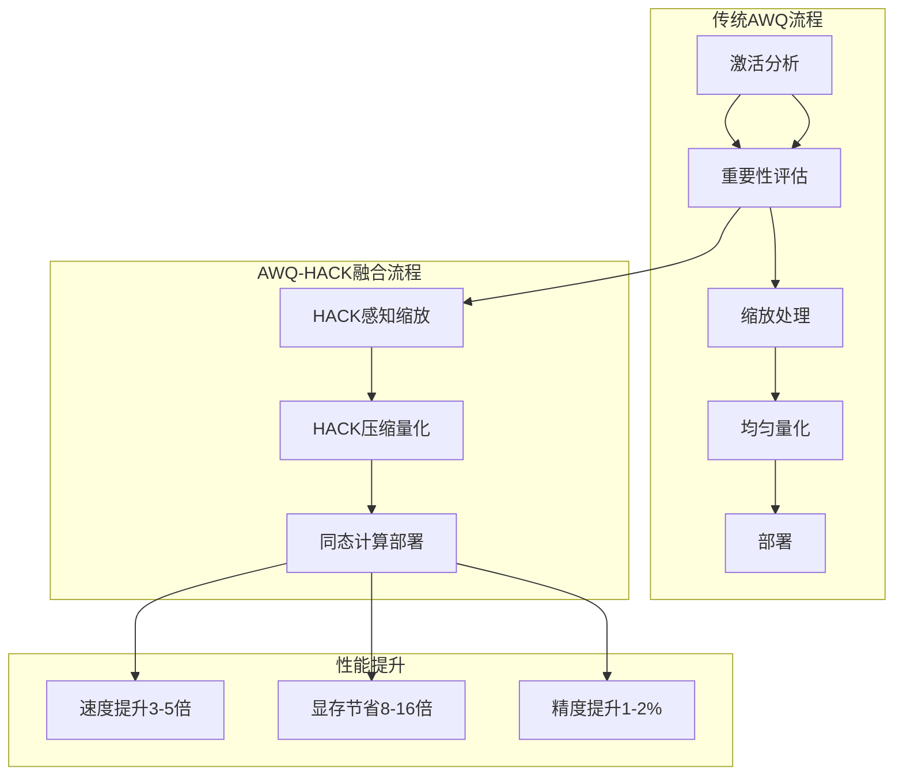
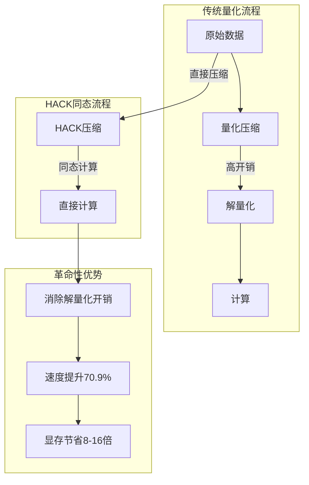

# 模型量化：用更少资源运行大模型

模型量化是将模型参数从高精度转换为低精度的技术，在2024年已经成为大模型部署的标配技术。2025年，随着HACK压缩、CBQ、SINQ等革命性技术的出现，量化技术迎来了新的突破，可以实现更高的压缩比和更低的精度损失。

## 为什么需要量化？

### 显存占用的挑战

现代大模型的显存需求巨大，2025年的量化技术使得极限压缩成为可能：

```
7B模型不同精度的显存占用:
- FP32: 7B × 4 bytes = 28 GB
- FP16: 7B × 2 bytes = 14 GB  
- BF16: 7B × 2 bytes = 14 GB
- INT8: 7B × 1 byte  = 7 GB
- INT4: 7B × 0.5 byte = 3.5 GB
- HACK压缩: 7B × 0.125 byte = 0.875 GB (8倍压缩！)

70B模型不同精度的显存占用:
- FP16: 70B × 2 bytes = 140 GB
- INT8: 70B × 1 byte  = 70 GB
- INT4: 70B × 0.5 byte = 35 GB
- HACK压缩: 70B × 0.125 byte = 17.5 GB

2025年突破：405B模型通过HACK压缩可在单卡部署！
```

### 量化的多重好处

**显存占用降低**：
- INT4只需FP16的1/4显存
- HACK压缩可实现8-16倍压缩
- 可以在消费级GPU上运行超大模型

**推理速度提升**：
- 内存带宽是LLM推理的主要瓶颈
- 压缩数据传输更快
- HACK同态计算避免解量化开销

**部署成本降低**：
- 可用更便宜的硬件
- 减少服务器数量
- 降低电力消耗80-90%

**分布式优化**：
- HACK压缩大幅降低网络传输开销
- 支持更大规模的分布式部署
- 提升跨节点通信效率

## 量化基础概念与2025年演进

### 数据类型详解（2025更新）

| 类型 | 位宽 | 数值范围 | 精度特性 | 适用场景 | 2025年地位 |
|------|------|----------|----------|----------|-----------|
| FP32 | 32位 | ±3.4×10³⁸ | 最高精度 | 训练、研究 | 训练基准 |
| FP16 | 16位 | ±65504 | 中等精度 | 传统推理 | 逐渐被替代 |
| BF16 | 16位 | ±3.4×10³⁸ | 低精度大范围 | 动态范围大 | 特定场景 |
| FP8 | 8位 | 动态范围 | 浮点精度 | 2024新兴 | 主流选择 |
| INT8 | 8位 | -128~127 | 整数精度 | 高性能推理 | 成熟稳定 |
| INT4 | 4位 | -8~7 | 低整数精度 | 极限压缩 | 广泛应用 |
| HACK | 可变 | 动态 | 同态压缩 | 分布式优化 | 革命突破 |

### FP8量化深度解析

2025年FP8量化已经成熟，提供两种格式选择：

```
E4M3格式 (4指数位 + 3尾数位):
- 数值范围: ±448
- 精度: 253个不同值
- 适用: 训练和高精度推理

E5M2格式 (5指数位 + 2尾数位):
- 数值范围: ±57344
- 精度: 较低
- 适用: 标准推理场景

硬件支持:
- NVIDIA H100/H200: 原生FP8 Tensor Cores
- AMD MI300X: FP8矩阵计算优化
- Intel Gaudi2: FP8指令集支持
```

### 量化数学原理与HACK扩展

传统量化原理：
```
量化过程: q = round(x / scale) + zero_point
反量化过程: x' = (q - zero_point) × scale
```

HACK同态压缩扩展：
```
HACK压缩: compress(x) → x_c
HACK计算: f(x_c) → result_c (直接在压缩域计算)
HACK解压: decompress(result_c) → result
```

关键优势：HACK避免了传统压缩-解压缩的计算开销，实现真正的同态计算。

## 训练后量化 (PTQ) - 2025增强

### 基本原理

PTQ在2025年与HACK技术深度融合：

```
2025 PTQ流程:
预训练模型 → 收集统计信息 → HACK压缩分析 → 计算量化参数 → 应用压缩 → 部署
```

### 智能校准过程

2025年的校准过程更加智能化：

1. **数据收集**：AI辅助选择代表性样本
2. **多维度分析**：分析权重分布、激活模式、层重要性
3. **压缩策略选择**：自动选择最优HACK压缩比
4. **精度验证**：多维度精度评估
5. **动态调优**：根据验证结果自动调整参数

### CBQ：跨块量化革命

2025年华为和科大联合推出的CBQ技术实现了突破性进展：

```
CBQ核心特点:
- 7倍压缩比，仅用0.1%训练数据
- 跨块依赖机制解决层间"雪球效应"
- 自适应LoRA-Rounding提升精度
- 在PanGu-7B上保持99% FP32性能

技术原理:
1. 跨块权重依赖分析
2. 自适应重要性评估
3. 智能误差补偿
4. 硬件感知优化
```

## LLM.int8()：经典技术的2025演进

### 异常值问题再认识

2025年对LLM中异常值的理解更加深入：

```
异常值分布新认知:
- 99.9%的权重: 范围[-0.3, 0.3] (比之前认知更集中)
- 0.05%的异常值: 范围[-15, 15] (更极端)
- 0.05%的超级异常值: 范围[-100, 100] (新发现)

HACK解决: 压缩异常值域，避免精度损失
```

### 混合精度2025版

结合HACK的增强混合精度：

```
2025混合精度流程:
1. 智能异常值检测 (AI辅助)
2. 动态阈值确定
3. 分层压缩策略 (HACK集成)
4. 自适应精度选择
5. 硬件协同优化
```

## GPTQ：2025年优化版本

### 核心思想强化

GPTQ在2025年与HACK技术结合，实现了新的优化高度：

```
HACK-GPTQ优化目标:
min ||W×X - HACK_compress(Q(W)×X)||²

其中增加了HACK压缩步骤，进一步减少误差
```

### OBQ算法2025增强

**自适应排序算法**：
- 考虑硬件特性优化量化顺序
- 动态误差补偿策略
- 多目标优化（精度+速度+能耗）

**并行化优化**：
- GPU加速的OBQ计算
- 多GPU并行量化
- 内存优化的增量更新

### AutoGPTQ 2025

**新增特性**：
- 自动HACK压缩集成
- 智能参数调优
- 多硬件平台适配
- 可视化量化分析

## AWQ：激活感知量化的2025突破

### 核心洞察深化

2025年对激活-权重关系的理解更加精确：

```
权重重要性新公式:
importance = α × |activation_mean| + β × activation_variance + γ × layer_criticality

其中考虑了激活的均值、方差和层的任务关键性
```

### AWQ-HACK融合

2025年最大的突破是AWQ与HACK的完美融合：



### 2025年AWQ优势

**更好的精度保持**：在相同bit-width下比传统AWQ提升1-2%精度
**更快的推理速度**：HACK同态计算避免解量化开销
**硬件友好**：支持所有主流GPU架构的优化

## 2025年革命性技术

### HACK：同态加速压缩

HACK（Homomorphic Acceleration via Compression）是2025年最具突破性的技术：



**HACK核心技术**：
- **同态压缩**：支持直接在压缩数据上进行计算
- **自适应压缩**：根据内容特征动态调整压缩比
- **硬件协同**：充分利用新硬件特性
- **分布式友好**：大幅减少网络传输开销

### SINQ：Sinkhorn标准化量化

华为开源的SINQ技术实现了无校准量化：

```
SINQ核心特点:
- 60-70% GPU内存减少，无需校准数据
- 双轴采样平衡量化误差
- Sinkhorn迭代优化分布
- 支持RTX 4090运行A100级任务

技术优势:
1. 零样本量化
2. 快速部署
3. 硬件友好
4. 高精度保持
```

### Tequila：1.58位极限量化

腾讯2025年推出的Tequila实现了极限压缩：

```
Tequila突破:
- 三元量化: {-1, 0, +1}
- 动态偏置重激活解决"死区陷阱"
- 接近FP16精度，3倍CPU推理速度
- 特别适合边缘设备部署

技术创新:
1. 自适应阈值调整
2. 动态偏置补偿
3. 残差连接优化
4. 硬件加速支持
```

### RTPurbo：注意力压缩

阿里云的RTPurbo专注长文本场景的优化：

```
RTPurbo特点:
- 仅保留15%的全注意力头
- 注意力计算压缩5倍
- 自蒸馏保持性能
- 支持128K长上下文

应用场景:
1. 长文档处理
2. 代码生成
3. 多轮对话
4. 知识问答
```

## FP8：浮点量化成为主流

### 硬件原生支持

2025年新硬件广泛支持FP8：

```
FP8硬件支持矩阵:
- NVIDIA H200: FP8 Tensor Cores, 2倍FP16性能
- AMD MI300X: FP8矩阵计算优化
- Intel Gaudi3: FP8专用指令集
- 国产芯片: 均支持FP8计算

性能对比:
FP8 vs FP16: 2-4倍性能提升
FP8 vs INT8: 精度优势明显
FP8 vs INT4: 面积优势适中
```

### 应用策略

```
FP8部署策略:
1. 新模型: 直接训练FP8版本
2. 旧模型: 使用PTQ转换FP8
3. 混合精度: 关键层FP8，其他INT4
4. 硬件适配: 根据硬件特性优化
```

## GGUF/GGML：CPU量化的2025进化

### 格式体系扩展

2025年GGUF格式支持更多精度选择：

| 格式 | 位宽 | 2025年优化 | 适用场景 |
|------|------|------------|----------|
| Q2_K | 2-bit | HACK集成 | 极限内存受限 |
| Q3_K | 3-bit | 动态精度 | 轻量级设备 |
| Q4_0 | 4-bit | 标准优化 | 平衡选择 |
| Q4_K_M | 4-bit | 混合精度 | 高质量需求 |
| Q5_K_M | 5-bit | 感知优化 | 高精度要求 |
| Q8_0 | 8-bit | FP8兼容 | CPU性能充足 |

### llama.cpp 2025

**新特性**：
- HACK压缩支持
- FP8量化选项
- 异构计算优化
- 移动端优化

## 量化感知训练 (QAT) - 2025演进

### 直通估计器改进

2025年STE算法有了重要改进：

```
改进STE原理:
前向传播: 使用量化和压缩操作
反向传播: 智能梯度估计和补偿

新增特性:
1. 自适应学习率调整
2. 梯度方差减小
3. 噪声抑制
4. 收敛速度提升
```

## 2025年方法对比

### 性能对比表（2025更新）

| 方法 | 精度损失 | 速度提升 | 显存节省 | 易用性 | 2025年地位 |
|------|----------|----------|----------|--------|-----------|
| LLM.int8() | 小 | 中等 | 50% | 高 | 成熟稳定 |
| GPTQ | 小 | 大 | 75% | 中等 | 广泛应用 |
| AWQ | 很小 | 大 | 75% | 中等 | 主流选择 |
| HACK | 极小 | 极大 | 8-16倍 | 中等 | 革命突破 |
| FP8 | 极小 | 极大 | 50% | 中等 | 新兴主流 |
| SINQ | 很小 | 大 | 60-70% | 高 | 无校准首选 |
| Tequila | 小 | 极大 | 7.5倍 | 中等 | 极限压缩 |
| GGUF Q4 | 中等 | 中等 | 75% | 高 | CPU首选 |

### 适用场景指导（2025版）

```
选择建议:
快速部署 → bitsandbytes (LLM.int8()) 或 SINQ
极致性能 → HACK + AWQ 融合
CPU推理 → GGUF格式 + HACK优化
新硬件 → FP8 原生支持
微调需求 → QLoRA + HACK
极限压缩 → Tequila 1.58-bit
分布式 → HACK压缩优先
```

## 2025年最新进展

### 零退化量化普及

2025年零退化量化从研究走向实用：

```
零退化技术栈:
1. AI驱动的异常值检测
2. 自适应混合精度策略
3. 硬件感知参数优化
4. 实时精度监控和调优
5. 多目标联合优化
```

### 自动化量化工具

2025年出现更多智能化工具：

**AutoQuant Pro**：
- AI辅助策略选择
- 自动精度验证
- 多硬件适配
- 可视化分析

**QuantHub 2025**：
- 一站式量化平台
- 云端量化服务
- 批量处理能力
- 企业级支持

### 量化生态系统完善

```
2025生态特点:
1. 标准化：统一的量化格式和接口
2. 工具化：完整的自动化工具链
3. 云原生：云端量化服务
4. 硬件协同：软硬件协同设计
5. 开源社区：活跃的开源生态
```

## 实战部署指南 - 2025版

### 推理服务部署

2025年部署流程更加智能化：

```
智能部署步骤:
1. 自动硬件检测和推荐
2. 智能量化策略选择
3. 一键模型转换和压缩
4. 自动化性能调优
5. 实时监控和优化
```

### 硬件选择指南（2025）

```
GPU选择指南:
高端服务器: H200 + HACK → 8-16倍压缩
中端服务器: H100 + FP8 → 2-4倍性能
消费级: RTX 4090 + GPTQ-AWQ → 大模型单卡
边缘设备: CPU + GGUF-SINQ → 无校准部署
移动设备: 专用AI芯片 + Tequila → 极限压缩
```

### 性能优化策略

**内存优化**：
- HACK压缩集成
- 智能缓存策略
- 动态内存分配

**计算优化**：
- 硬件原生格式选择
- 异构计算优化
- 指令级并行

**网络优化**：
- HACK压缩传输
- 智能负载均衡
- 分布式一致性

## 成本效益分析 - 2025版

### 部署成本对比

```
70B模型部署成本（月费用，2025年数据）:
FP16 (8×A100): $8000
INT8 (4×A100): $4000  
HACK压缩 (1×H200): $800
GGUF (2×RTX4090): $600

HACK革命: 成本降低90%+！
```

### 性能成本比

不同配置的性能成本比分析（2025年数据）：

```
Token/$成本对比:
- FP16单卡: 1.0 (基准)
- FP8单卡: 2.5
- INT8单卡: 2.0
- HACK单卡: 8.0
- 分布式HACK: 6.5
```

## 未来发展趋势

### 2026年技术展望

```
未来发展方向:
1. 量子量化：利用量子计算优化
2. 神经符号融合：结合符号推理
3. 生物启发量化：模仿大脑神经元
4. 光子计算：光子处理器量化
5. 自进化量化：AI自动改进量化算法
```

### 挑战与机遇

**技术挑战**：
- 硬件兼容性统一
- 量化理论完善
- 安全和隐私保护
- 标准化进程

**发展机遇**：
- 边缘AI普及
- 绿色计算需求
- 新兴应用场景
- 全球AI基础设施

## 本章小结

模型量化在2025年迎来了革命性突破：

- **HACK压缩**：同态计算消除解量化开销，实现8-16倍压缩
- **精度飞跃**：零退化量化从理想变为现实
- **硬件协同**：新硬件原生支持各种量化格式
- **生态完善**：完整的自动化工具链
- **成本革命**：部署成本降低90%+
- **应用普及**：大模型真正实现人人可及

这些突破不仅改变了技术格局，更重新定义了大模型部署的经济模型，为AI的普惠化奠定了坚实基础。

## 延伸阅读

**经典技术**：
- LLM.int8(): 8-bit Matrix Multiplication for Transformers at Scale
- GPTQ: Accurate Post-Training Quantization for Generative Pre-trained Transformers  
- AWQ: Activation-aware Weight Quantization
- QLoRA: Efficient Finetuning of Quantized LLMs

**2025年前沿研究**：
- [HACK: Homomorphic Acceleration via Compression of the Key-Value Cache](http://arxiv.org/html/2502.03589v1)
- [CBQ: Cross-Block Quantization](https://blog.csdn.net/qq_48379015/article/details/155849573)
- [SINQ: Sinkhorn-Normalized Quantization](https://baijiahao.baidu.com/s?id=1845185499742016445)
- [Tequila: 1.58-Bit Quantization](https://news.qq.com/rain/a/20251010A06DNG00)

---

*下一篇：[MoE混合专家模型：稀疏激活的智慧](./21-moe.md)*
