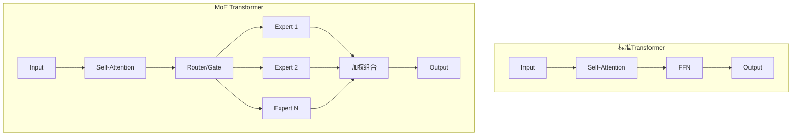
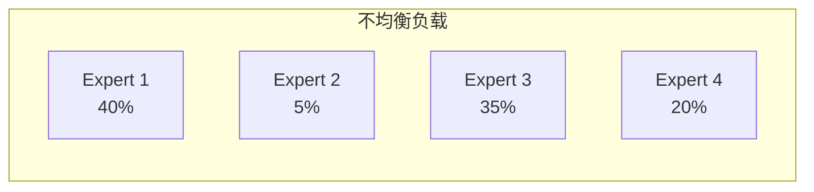
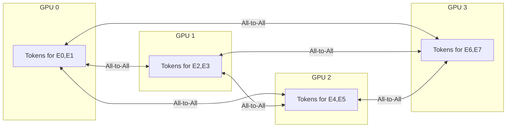

# MoE 混合专家模型：稀疏激活的力量

Mixture of Experts (MoE) 是一种通过稀疏激活实现高效扩展的架构。它让模型拥有庞大的参数量，但每次推理只激活一小部分，实现了"大而不贵"的目标。Mixtral、DeepSeek-V2 等模型都采用了这一架构。

## 为什么需要 MoE？

### Dense 模型的困境

传统 Dense 模型的计算量与参数量成正比：

```
Dense 模型:
参数量: N
每次推理计算量: O(N)

GPT-4 (推测 ~1.8T 参数):
每次推理都要使用全部参数 → 巨大的计算成本
```

### MoE 的解决方案

MoE 通过**稀疏激活**打破这一限制：

```
MoE 模型:
总参数量: N (很大)
激活参数量: N/k (只用一部分)

Mixtral 8x7B:
总参数: ~47B
每次激活: ~13B (只用 2 个 expert)
性能: 接近 70B dense 模型！
```

## MoE 架构解析

### 整体结构

MoE 将 Transformer 的 FFN 层替换为多个专家网络：



### 核心组件

**1. 专家网络 (Experts)**

每个专家是一个独立的 FFN：

```python
class Expert(nn.Module):
    def __init__(self, d_model, d_ff):
        super().__init__()
        self.w1 = nn.Linear(d_model, d_ff)
        self.w2 = nn.Linear(d_ff, d_model)
        self.activation = nn.SiLU()
    
    def forward(self, x):
        return self.w2(self.activation(self.w1(x)))
```

**2. 路由器 (Router/Gate)**

决定每个 token 使用哪些专家：

```python
class Router(nn.Module):
    def __init__(self, d_model, num_experts, top_k=2):
        super().__init__()
        self.gate = nn.Linear(d_model, num_experts, bias=False)
        self.top_k = top_k
    
    def forward(self, x):
        # x: (batch, seq_len, d_model)
        logits = self.gate(x)  # (batch, seq_len, num_experts)
        
        # Top-K 选择
        top_k_logits, top_k_indices = logits.topk(self.top_k, dim=-1)
        top_k_weights = F.softmax(top_k_logits, dim=-1)
        
        return top_k_weights, top_k_indices
```

### MoE 层完整实现

```python
class MoELayer(nn.Module):
    def __init__(self, d_model, d_ff, num_experts, top_k=2):
        super().__init__()
        self.num_experts = num_experts
        self.top_k = top_k
        
        # 创建多个专家
        self.experts = nn.ModuleList([
            Expert(d_model, d_ff) for _ in range(num_experts)
        ])
        
        # 路由器
        self.router = Router(d_model, num_experts, top_k)
    
    def forward(self, x):
        batch_size, seq_len, d_model = x.shape
        
        # 获取路由权重和索引
        weights, indices = self.router(x)
        # weights: (batch, seq_len, top_k)
        # indices: (batch, seq_len, top_k)
        
        # 初始化输出
        output = torch.zeros_like(x)
        
        # 对每个专家进行计算
        for expert_idx in range(self.num_experts):
            # 找到路由到这个专家的 token
            mask = (indices == expert_idx).any(dim=-1)  # (batch, seq_len)
            
            if mask.sum() == 0:
                continue
            
            # 提取这些 token
            expert_input = x[mask]  # (num_tokens, d_model)
            
            # 专家计算
            expert_output = self.experts[expert_idx](expert_input)
            
            # 获取对应权重并加权
            expert_weights = weights[mask]  # (num_tokens, top_k)
            position_in_top_k = (indices[mask] == expert_idx).float()
            token_weights = (expert_weights * position_in_top_k).sum(dim=-1, keepdim=True)
            
            # 累加到输出
            output[mask] += expert_output * token_weights
        
        return output
```

## 路由策略

### Top-K 路由

最常用的策略，每个 token 选择 K 个专家：

```python
def top_k_routing(logits, k=2):
    """
    logits: (batch, seq_len, num_experts)
    返回: weights, indices
    """
    top_k_logits, top_k_indices = logits.topk(k, dim=-1)
    top_k_weights = F.softmax(top_k_logits, dim=-1)
    return top_k_weights, top_k_indices
```

**典型配置**：
- Mixtral: 8 experts, top-2
- DeepSeek-V2: 160 experts, top-6

### 负载均衡

如果路由不均衡，某些专家会过载而其他专家闲置：

```
理想情况:
Expert 0: 12.5% tokens
Expert 1: 12.5% tokens
...
Expert 7: 12.5% tokens

不均衡:
Expert 0: 40% tokens (过载!)
Expert 1: 5% tokens (浪费!)
...
```

**辅助损失函数**：

```python
def load_balancing_loss(router_logits, num_experts):
    """计算负载均衡损失"""
    # router_logits: (batch * seq_len, num_experts)
    
    # 每个专家的平均概率
    probs = F.softmax(router_logits, dim=-1)
    expert_probs = probs.mean(dim=0)  # (num_experts,)
    
    # 每个专家被选中的比例
    expert_mask = probs.argmax(dim=-1)
    expert_counts = torch.bincount(expert_mask, minlength=num_experts).float()
    expert_fracs = expert_counts / expert_counts.sum()
    
    # 损失 = 概率 × 比例 的和（越均匀越小）
    loss = (expert_probs * expert_fracs).sum() * num_experts
    
    return loss
```

### 专家容量限制

硬性限制每个专家处理的 token 数量：

```python
def capacity_routing(logits, capacity_factor=1.25):
    """带容量限制的路由"""
    batch_size, seq_len, num_experts = logits.shape
    
    # 计算每个专家的容量
    capacity = int((batch_size * seq_len / num_experts) * capacity_factor)
    
    # 按分数排序，只保留容量内的
    expert_gate = F.softmax(logits, dim=-1)
    
    for expert_idx in range(num_experts):
        expert_scores = expert_gate[:, :, expert_idx]
        # 只保留 top-capacity 个 token
        _, top_indices = expert_scores.flatten().topk(capacity)
        # ... 处理超出容量的 token（丢弃或重路由）
```

## 主流 MoE 模型

### Mixtral 8x7B

Mistral AI 发布的开源 MoE 模型：

| 配置项 | 值 |
|--------|-----|
| 专家数量 | 8 |
| 激活专家 | 2 |
| 单专家参数 | 7B |
| 总参数 | ~47B |
| 激活参数 | ~13B |

```
性能对比:
Mixtral 8x7B ≈ LLaMA 2 70B
但计算量只有 ~1/5!
```

### DeepSeek-V2

DeepSeek 的高效 MoE 模型：

| 配置项 | 值 |
|--------|-----|
| 专家数量 | 160 |
| 激活专家 | 6 |
| 总参数 | 236B |
| 激活参数 | 21B |

**创新点**：
- 更多的小专家（细粒度专业化）
- 共享专家 + 路由专家
- 创新的 DeepSeekMoE 架构

### Qwen-MoE

```
Qwen1.5-MoE-A2.7B:
- 总参数: 14.3B
- 激活参数: 2.7B
- 专家数: 60
- 激活专家: 4
```

## MoE 的挑战

### 1. 专家负载不均衡

某些专家被过度使用，其他专家闲置：



**解决方案**：辅助损失、容量限制、专家丢弃

### 2. 通信开销

分布式训练/推理时，token 需要路由到不同 GPU 上的专家：

```
Token 在 GPU 0，需要访问 GPU 3 上的专家
→ All-to-All 通信
→ 高通信开销
```

**解决方案**：专家并行 (Expert Parallelism)

### 3. 推理优化

稀疏激活带来的挑战：

```
Dense: 固定计算模式，易于优化
MoE: 动态路由，计算模式不确定

Batch 内不同 token 可能路由到不同专家
→ 难以高效利用 GPU
```

## 专家并行 (Expert Parallelism)

### 基本思想

将不同专家放到不同 GPU 上：

```
8 experts, 4 GPUs:
GPU 0: Expert 0, 1
GPU 1: Expert 2, 3
GPU 2: Expert 4, 5
GPU 3: Expert 6, 7
```

### All-to-All 通信



### 与张量并行组合

```
16 GPUs 部署 Mixtral:
- TP = 2 (张量并行)
- EP = 8 (专家并行)

每个专家分布在 2 个 GPU 上
8 组 × 2 GPU = 16 GPUs
```

## MoE 推理优化

### 批处理优化

将路由到相同专家的 token 合并处理：

```python
def batched_moe_forward(x, experts, router):
    """批处理优化的 MoE 前向"""
    weights, indices = router(x)
    
    outputs = []
    for expert_idx, expert in enumerate(experts):
        # 找到路由到这个专家的所有 token
        mask = (indices == expert_idx).any(dim=-1)
        if mask.sum() == 0:
            outputs.append(None)
            continue
        
        # 批量处理
        expert_input = x[mask]
        expert_output = expert(expert_input)
        outputs.append((mask, expert_output))
    
    # 组装结果
    final_output = assemble_outputs(outputs, weights, indices, x.shape)
    return final_output
```

### 专家预取

预测下一个 token 可能使用的专家，提前加载：

```python
def prefetch_experts(router_logits, expert_cache):
    """预取可能使用的专家"""
    # 获取 top-k 概率最高的专家
    top_probs, top_indices = router_logits.topk(4)  # 预取更多
    
    for idx in top_indices:
        if idx not in expert_cache:
            # 异步加载专家参数
            async_load_expert(idx)
```

## 实战：使用 Mixtral

### HuggingFace 加载

```python
from transformers import AutoModelForCausalLM, AutoTokenizer

model = AutoModelForCausalLM.from_pretrained(
    "mistralai/Mixtral-8x7B-Instruct-v0.1",
    torch_dtype=torch.float16,
    device_map="auto",
)

tokenizer = AutoTokenizer.from_pretrained(
    "mistralai/Mixtral-8x7B-Instruct-v0.1"
)

# 推理
inputs = tokenizer("Hello, how are you?", return_tensors="pt").to("cuda")
outputs = model.generate(**inputs, max_new_tokens=100)
print(tokenizer.decode(outputs[0]))
```

### vLLM 部署

```bash
# 启动 Mixtral 服务
python -m vllm.entrypoints.openai.api_server \
    --model mistralai/Mixtral-8x7B-Instruct-v0.1 \
    --tensor-parallel-size 2 \
    --port 8000
```

## 本章小结

- MoE 通过稀疏激活实现"大参数、小计算"
- 路由器决定每个 token 使用哪些专家
- 负载均衡是 MoE 的核心挑战
- Mixtral、DeepSeek-V2 是代表性的 MoE 模型
- 专家并行是分布式 MoE 的关键技术

## 延伸阅读

- Mixtral of Experts (Mistral AI)
- DeepSeekMoE: Towards Ultimate Expert Specialization
- Switch Transformers: Scaling to Trillion Parameter Models

---

*下一篇：[长上下文技术：突破序列长度限制](./22-long-context.md)*
