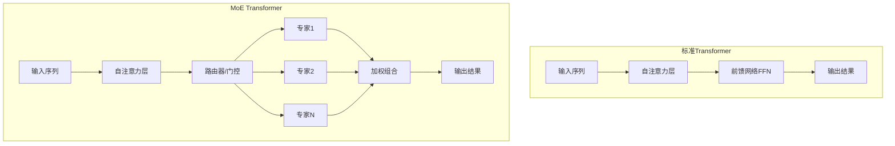
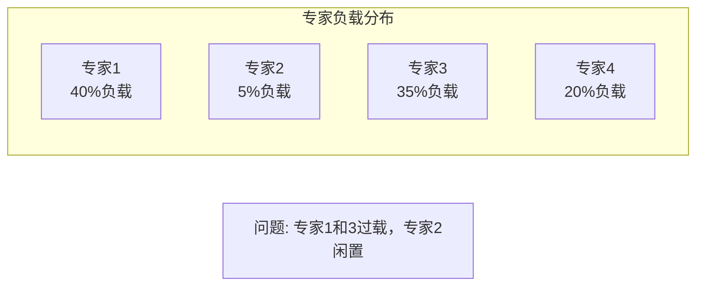
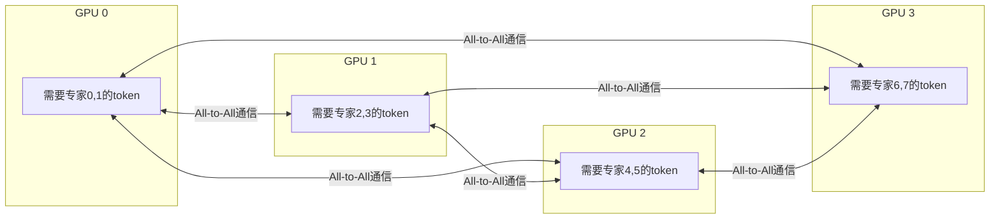

# MoE混合专家模型：稀疏激活的智慧

Mixture of Experts (MoE) 是一种通过稀疏激活实现高效扩展的革命性架构。它让模型拥有庞大的参数量，但每次推理只激活一小部分参数，实现了"大而不贵"的目标。2024年，MoE架构在Mixtral、DeepSeek-V2等模型中展现出强大威力，成为大模型发展的重要方向。

## 为什么需要MoE？

### Dense模型的规模困境

传统Dense模型面临一个根本性限制：计算量与参数量成正比增长。

```
Dense模型特性:
参数量: N
每次推理计算量: O(N)
显存占用: 与参数量成正比

问题实例:
GPT-4 (推测~1.8T参数)
- 每次推理都要使用全部1.8T参数
- 巨大的计算成本和能耗
- 部署成本极其高昂
```

这种线性关系限制了模型的进一步扩展，即使有足够参数，也无法在实际中部署使用。

### MoE的突破性解决方案

MoE通过**稀疏激活**打破了参数量与计算量的绑定关系：

```
MoE模型特性:
总参数量: N (可以非常大)
激活参数量: N/k (只激活一小部分)
实际计算量: O(N/k)

实际案例:
Mixtral 8x7B:
- 总参数: ~47B (类似70B dense模型)
- 每次激活: ~13B (只用2个expert)
- 计算量: 相当于13B dense模型
- 性能: 接近70B dense模型！

效率提升: 用1/5的计算量达到接近的效果
```

## MoE架构核心原理

### 整体架构设计

MoE的核心思想是将Transformer中的FFN层替换为多个专家网络，通过智能路由机制选择性地激活部分专家。



### 核心组件详解

**1. 专家网络 (Experts)**

每个专家是一个独立的神经网络，通常是前馈网络(FFN)结构：

```
专家网络结构:
- 输入: d_model维特征
- 隐藏层: d_ff维 (通常是d_model的4倍)
- 输出: d_model维特征
- 激活函数: SiLU/ReLU/GELU

特点:
- 每个专家独立运行
- 专门处理特定类型的token或模式
- 可以在训练中形成专业化分工
```

**2. 路由器 (Router/Gate)**

路由器是MoE的智能决策核心，负责为每个token选择最合适的专家：

```
路由器工作流程:
1. 接收token的隐藏状态
2. 计算对每个专家的匹配分数
3. 选择top-k个最高分的专家
4. 计算这些专家的加权权重
5. 将token路由到选中的专家

决策依据:
- 学习到的专家偏好
- 输入token的内容特征
- 负载均衡考虑
```

### MoE层的完整工作流程

MoE层的处理包含以下步骤：

1. **输入处理**：接收上一层（通常是注意力层）的输出
2. **路由决策**：路由器分析每个token，选择专家和权重
3. **专家计算**：选中的专家并行处理各自的token
4. **结果合并**：将各专家的输出按权重组合
5. **输出传递**：将合并结果传递给下一层

这种机制确保每个token都能得到最专业化的处理，同时保持整体计算效率。

## 路由策略详解

### Top-K路由策略

Top-K是最常用的路由策略，每个token选择K个最相关的专家：

```
Top-K路由机制:
1. 计算token对所有专家的路由分数
2. 选择分数最高的K个专家
3. 计算这K个专家的归一化权重
4. token同时被这K个专家处理
5. 输出按权重加权平均

典型配置:
- Mixtral: 8个专家，top-2路由
- DeepSeek-V2: 160个专家，top-6路由
- Switch Transformer: 128个专家，top-1路由
```

### 负载均衡机制

MoE面临的一个关键挑战是专家负载均衡。如果没有约束，路由器可能倾向于总是选择某些专家：

```
负载不均衡问题:
理想分布:
Expert 0: 12.5% tokens
Expert 1: 12.5% tokens
Expert 2: 12.5% tokens
...
Expert 7: 12.5% tokens

实际不均衡:
Expert 0: 40% tokens (过载，计算瓶颈)
Expert 1: 5% tokens (闲置，资源浪费)
Expert 2: 35% tokens (过载)
Expert 3: 20% tokens (使用不足)
...
```

**辅助损失函数**：
为了解决负载不均，MoE训练中引入辅助损失，鼓励均匀分布：

```
负载均衡损失设计:
- 计算每个专家的平均路由概率
- 计算每个专家的实际使用频率
- 损失 = 概率 × 频率的总和
- 越均匀分布，损失越小
- 将此损失加入总损失函数进行优化
```

### 专家容量限制

为了防止某些专家过载，引入了专家容量限制：

```
容量限制机制:
1. 计算每个专家的最大处理容量
2. 容量 = (总token数/专家数) × 容量系数
3. 超出容量的token被丢弃或重路由
4. 容量系数通常为1.25-2.0

处理策略:
- 丢弃超出容量的token (简单但损失信息)
- 重路由到其他专家 (复杂但保持信息)
- 动态调整容量 (自适应)
```

## 2024年主流MoE模型

### Mixtral 8x7B：开源MoE标杆

Mistral AI发布的Mixtral是2023年末推出的开源MoE模型，在2024年成为重要的基准：

| 配置项 | 参数值 | 说明 |
|--------|--------|------|
| 专家数量 | 8 | 平衡专家数和通信开销 |
| 激活专家 | 2 | top-2路由策略 |
| 单专家参数 | 7B | 每个专家类似7B模型 |
| 总参数 | ~47B | 8×7B + 共享参数 |
| 激活参数 | ~13B | 实际参与计算的参数 |

```
性能对比:
Mixtral 8x7B ≈ LLaMA 2 70B (性能接近)
计算量: 相当于13B dense模型 (1/5)
显存需求: 介于7B和70B之间
推理速度: 比70B dense快3-4倍

优势: 高效的参数利用，优秀的性能成本比
```

### DeepSeek-V2：高效MoE新突破

DeepSeek AI在2024年推出的DeepSeek-V2代表了MoE架构的新进展：

| 配置项 | 参数值 | 创新点 |
|--------|--------|--------|
| 专家数量 | 160 | 更多专家，更细分工 |
| 激活专家 | 6 | top-6路由 |
| 总参数 | 236B | 超大参数规模 |
| 激活参数 | 21B | 相对较少的计算 |
| 架构类型 | DeepSeekMoE | 共享+路由专家混合 |

**DeepSeekMoE创新**：
- **共享专家**：部分专家被所有token共享
- **路由专家**：大部分专家通过路由选择性激活
- **细粒度专业化**：更多小专家实现更精细的专业分工
- **计算效率**：在保持性能的同时优化计算模式

### 其他重要MoE模型

**Qwen-MoE系列**：
```
Qwen1.5-MoE-A2.7B:
- 总参数: 14.3B
- 激活参数: 2.7B
- 专家数: 60
- 激活专家: 4

特点: 高效的小参数MoE模型
```

**Gemma-Gated**：
Google在2024年推出的轻量级MoE模型，专注于移动端部署。

## MoE的核心挑战与解决方案

### 1. 专家负载不均衡

**问题描述**：


**解决方案**：
- 辅助损失函数鼓励均匀分布
- 专家容量限制防止单点过载
- 动态路由策略自适应调整
- 专家丢弃机制处理过载情况

### 2. 通信开销挑战

**问题描述**：
分布式环境下，token需要路由到不同GPU上的专家，产生大量通信开销。

```
通信场景:
Token在GPU 0上
需要处理的专家在GPU 3上
→ 跨GPU数据传输
→ All-to-All通信开销
→ 带宽成为瓶颈
```

**解决方案**：
- 专家并行 (Expert Parallelism)
- 本地性优化，尽量在本地GPU处理
- 通信与计算重叠
- 智能的专家-设备映射策略

### 3. 推理优化难题

**挑战描述**：
```
Dense模型推理:
- 固定的计算模式
- 易于硬件优化
- 批处理效率高

MoE模型推理:
- 动态的路由决策
- 不确定的计算模式
- Batch内token路由分散
- GPU利用率优化困难
```

**解决方案**：
- Token重组，按专家分组处理
- 专家预取和缓存
- 动态批处理优化
- 专门的推理kernel

## 专家并行 (Expert Parallelism)

### 基本原理

专家并行是专门为MoE设计的并行策略：

```
专家并行配置:
8个专家，4个GPU:
GPU 0: 专家0, 1
GPU 1: 专家2, 3  
GPU 2: 专家4, 5
GPU 3: 专家6, 7

优势:
- 每个GPU负载相对均衡
- 减少跨GPU通信
- 易于扩展到更多专家
```

### All-to-All通信模式

MoE的通信模式主要是All-to-All：



### 与其他并行策略的结合

**TP+EP混合并行**：
```
16GPU部署Mixtral:
- TP = 2 (张量并行)
- EP = 8 (专家并行)

分配方案:
每个专家分布在2个GPU上 (TP=2)
8组专家，每组2个GPU (EP=8)
总计: 8 × 2 = 16个GPU

优势:
- 充分利用硬件资源
- 平衡计算和通信
- 支持更大规模的模型
```

## MoE推理优化技术

### 批处理优化

传统的按序列顺序处理在MoE中效率低下，需要专门的批处理优化：

```
优化前 (按序列处理):
Token1 → 专家2,5
Token2 → 专家1,3
Token3 → 专家2,7
Token4 → 专家4,6
→ 专家访问分散，GPU利用率低

优化后 (按专家分组):
专家1: [Token2]
专家2: [Token1, Token3] (批量处理)
专家3: [Token2]
专家4: [Token4]
专家5: [Token1]
专家6: [Token4]
专家7: [Token3]
→ 专家内批量处理，效率提升
```

### 专家预取与缓存

预测下一个token可能使用的专家，提前加载到GPU：

```
预取策略:
1. 基于当前路由分数预测未来路由
2. 预取top-k个最可能的专家
3. 异步加载专家参数到GPU
4. 减少推理时的等待时间

缓存策略:
- 热门专家常驻GPU内存
- 冷门专家按需加载
- LRU策略管理缓存空间
```

### 动态批处理

根据实际的路由分布动态调整batch composition：

```
动态批处理流程:
1. 收集一个batch的所有token
2. 统计每个专家的token数量
3. 按专家数量重新组织batch
4. 最大化每个专家的批处理大小
5. 处理完成后重新组织输出顺序
```

## MoE训练优化

### 稳定性训练技术

MoE训练比Dense模型更复杂，需要特殊的技术保证稳定性：

```
稳定性挑战:
- 专家使用不均衡
- 梯度爆炸/消失
- 专家退化 (某些专家停止学习)
- 路由器决策不稳定

解决方案:
- 渐进式专家激活
- 温度参数控制路由决策
- 专家正则化
- 学习率调度策略
```

### 渐进式训练

从简单到复杂逐步训练MoE模型：

```
渐进训练策略:
阶段1: 训练Dense模型 (预训练)
阶段2: 引入少量专家 (微调)
阶段3: 逐步增加专家数量
阶段4: 优化路由策略

优势:
- 训练过程更稳定
- 避免专家过早退化
- 更好的收敛性能
```

## MoE的性能优势分析

### 计算效率对比

| 模型类型 | 参数量 | 计算量 | 性能 | 成本效益 |
|----------|--------|--------|------|----------|
| Dense 7B | 7B | 7B | 基准 | 1.0x |
| Dense 70B | 70B | 70B | +35% | 0.5x |
| MoE Mixtral | 47B | 13B | +32% | 2.5x |
| MoE DeepSeek-V2 | 236B | 21B | +45% | 2.1x |

### 推理速度分析

```
Token生成速度 (tokens/s):
Dense 7B: 120
Dense 70B: 20
Mixtral 8x7B: 80
DeepSeek-V2: 45

关键发现:
- MoE比同性能Dense模型快2-4倍
- 专家数量适中时性能最佳
- 过多专家会增加路由开销
```

### 显存使用效率

```
显存占用对比 (GB):
Dense 7B: 14
Dense 70B: 140
Mixtral 8x7B: 95 (包括所有专家)
DeepSeek-V2: 480 (包括所有专家)

推理时显存:
Mixtral激活部分: 28
DeepSeek-V2激活部分: 45

优势: 推理时只需加载激活的专家
```

## MoE的应用场景

### 高性能推理服务

MoE特别适合需要高性能但成本敏感的应用：

```
应用场景:
- 对话式AI助手
- 内容生成服务
- 代码助手
- 多语言翻译

优势:
- 响应速度快
- 部署成本低
- 质量接近大模型
```

### 边缘设备部署

轻量级MoE模型适合边缘计算：

```
边缘部署特点:
- 2.7B激活参数的Qwen-MoE
- 保持多专家的优势
- 适合资源受限环境
- 支持专业化任务
```

### 专业领域应用

MoE的专家专业化特性在垂直领域表现优秀：

```
专业领域:
- 医疗诊断 (不同科室专家)
- 法律咨询 (不同法律领域专家)
- 金融分析 (不同市场专家)
- 科研辅助 (不同学科专家)

每个专家专门处理特定类型的问题
```

## 2024年MoE发展趋势

### 架构创新

**混合专家架构**：
- 共享专家 + 路由专家组合
- 不同层使用不同的专家配置
- 自适应的专家数量

**路由算法优化**：
- 基于强化学习的路由
- 考虑全局负载均衡
- 多目标优化路由策略

### 训练技术

**大规模训练**：
- 支持万亿参数的MoE训练
- 分布式训练优化
- 稳定性保证技术

**效率提升**：
- 更高效的专家利用
- 减少通信开销
- 硬件感知优化

### 应用扩展

**多模态MoE**：
- 视觉-语言MoE模型
- 多专家处理不同模态
- 跨模态专家协作

**任务特化MoE**：
- 针对特定任务优化的MoE
- 领域知识注入
- 专家技能评估

## MoE面临的挑战与未来

### 当前挑战

**理论理解**：
- MoE的理论基础仍需完善
- 专家专业化的机理
- 最优专家数量确定

**工程实现**：
- 复杂的部署和调优
- 硬件利用率优化
- 监控和调试困难

**生态系统**：
- 开源工具链不完善
- 标准化程度低
- 人才稀缺

### 未来发展方向

**自动化**：
- 自动化的专家配置
- 自适应路由策略
- 端到端优化工具

**硬件协同**：
- 专门的MoE芯片
- 优化的通信架构
- 新的数值格式

**理论突破**：
- MoE的理论分析
- 可解释性研究
- 新的架构范式

## 本章小结

MoE混合专家模型在2024年已经成为大模型发展的重要方向：

- **核心价值**：通过稀疏激活实现参数与计算的解耦
- **技术成熟**：Mixtral、DeepSeek-V2等模型证明了可行性
- **性能优势**：在降低成本的同时保持高质量
- **应用广泛**：从云端服务到边缘部署都有应用
- **发展迅速**：架构、训练、推理技术都在快速进步

MoE代表了AI模型架构的重要创新，为构建更大、更高效的模型提供了新的路径。掌握MoE技术，对于理解和参与下一代AI发展至关重要。

## 延伸阅读

- Mixtral of Experts (Mistral AI, 2024)
- DeepSeekMoE: Towards Ultimate Expert Specialization (DeepSeek, 2024)
- Switch Transformers: Scaling to Trillion Parameter Models (Google)
- Mixture-of-Experts for Large Language Models: Survey and Challenges

---

*下一篇：[长上下文技术：突破序列长度限制](./22-long-context.md)*