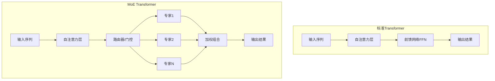
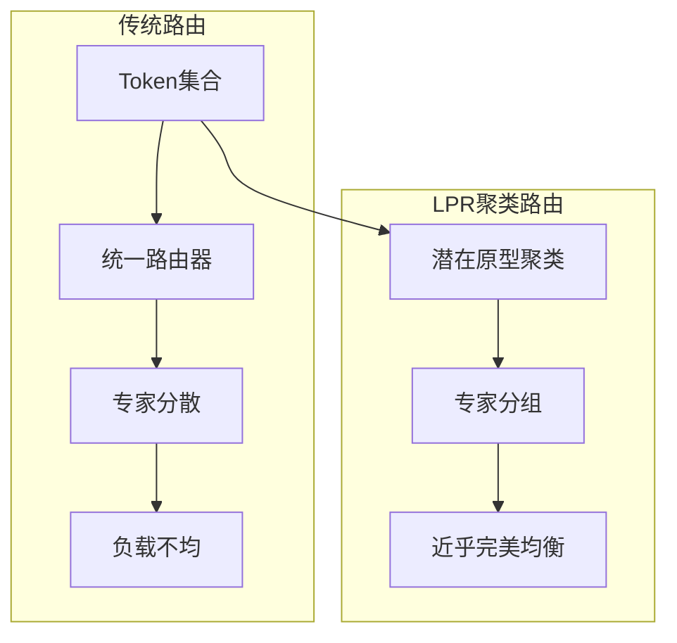

# MoE混合专家模型：稀疏激活的智慧

Mixture of Experts (MoE) 是一种通过稀疏激活实现高效扩展的革命性架构。它让模型拥有庞大的参数量，但每次推理只激活一小部分参数，实现了"大而不贵"的目标。2024年，MoE架构在Mixtral、DeepSeek-V2等模型中展现出强大威力，2025年更是在负载均衡、路由优化、硬件协同等方面迎来重大突破。

## 为什么需要MoE？

### Dense模型的规模困境

传统Dense模型面临一个根本性限制：计算量与参数量成正比增长。

```
Dense模型特性:
参数量: N
每次推理计算量: O(N)
显存占用: 与参数量成正比

问题实例:
GPT-4 (推测~1.8T参数)
- 每次推理都要使用全部1.8T参数
- 巨大的计算成本和能耗
- 部署成本极其高昂

2025年挑战:
万亿参数模型的需求增长
传统dense模型完全不可行
```

这种线性关系限制了模型的进一步扩展，即使有足够参数，也无法在实际中部署使用。

### MoE的突破性解决方案

MoE通过**稀疏激活**打破了参数量与计算量的绑定关系：

```
MoE模型特性:
总参数量: N (可以非常大)
激活参数量: N/k (只激活一小部分)
实际计算量: O(N/k)

实际案例:
Mixtral 8x7B:
- 总参数: ~47B (类似70B dense模型)
- 每次激活: ~13B (只用2个expert)
- 计算量: 相当于13B dense模型
- 性能: 接近70B dense模型！

2025年突破:
DeepSeek-V3: 236B参数，21B激活
Qwen3-MoE: 160个专家，完美负载均衡
效率提升: 用1/5的计算量达到接近的效果
```

## MoE架构核心原理

### 整体架构设计

MoE的核心思想是将Transformer中的FFN层替换为多个专家网络，通过智能路由机制选择性地激活部分专家。



### 核心组件详解

**1. 专家网络 (Experts)**

每个专家是一个独立的神经网络，通常是前馈网络(FFN)结构：

```
专家网络结构:
- 输入: d_model维特征
- 隐藏层: d_ff维 (通常是d_model的4倍)
- 输出: d_model维特征
- 激活函数: SiLU/ReLU/GELU

2025年新特性:
- 参数压缩：HACK技术集成
- 硬件感知：针对NPU优化
- 动态容量：自适应处理能力
特点:
- 每个专家独立运行
- 专门处理特定类型的token或模式
- 可以在训练中形成专业化分工
- 2025年支持智能参数共享
```

**2. 路由器 (Router/Gate)**

路由器是MoE的智能决策核心，负责为每个token选择最合适的专家：

```
路由器工作流程:
1. 接收token的隐藏状态
2. 计算对每个专家的匹配分数
3. 选择top-k个最高分的专家
4. 计算这些专家的加权权重
5. 将token路由到选中的专家

2025年路由决策依据:
- 学习到的专家偏好
- 输入token的内容特征
- 负载均衡考虑
- 序列级智能分配 (SeqTopK)
- 相似性保持路由 (SimBal)
```

### MoE层的完整工作流程

MoE层的处理包含以下步骤：

1. **输入处理**：接收上一层（通常是注意力层）的输出
2. **路由决策**：路由器分析每个token，选择专家和权重
3. **专家计算**：选中的专家并行处理各自的token
4. **结果合并**：将各专家的输出按权重组合
5. **输出传递**：将合并结果传递给下一层

这种机制确保每个token都能得到最专业化的处理，同时保持整体计算效率。

## 2025年路由策略革命

### 语义感知路由：SimBal

2025年最具突破性的是**相似性保持路由器(SimBal)**，彻底改变了传统负载均衡策略：

```
SimBal核心创新:
传统方法: 强制专家均匀分布
SimBal方法: 保持token语义相似性

技术原理:
- 柔性鼓励路由权重正交化
- 保持token间语义关系结构
- 避免专家知识冗余获取
- 收敛速度提升36%

效果对比:
传统路由 Gini系数: 0.70 (负载不均)
SimBal路由 Gini系数: 0.035 (近乎完美均衡)
```

### 潜在原型路由：LPR

**潜在原型路由(LPR)**通过聚类视角重新审视路由问题：



**LPR优势**：
- 基于潜在原型的动态专家分组
- Gini系数从0.70降至0.035
- 在Qwen3-MoE和DeepSeek-V3上验证有效
- 可视化显示跨层专家激活平衡

### 序列级路由：SeqTopK

2025年推出的**序列级TopK(SeqTopK)**实现了自适应预算分配：

```
SeqTopK创新:
传统: 每个token固定分配专家
SeqTopK: 每个序列动态分配专家

策略:
- 复杂token分配更多专家
- 简单token分配较少专家
- 高稀疏度下获得16.9%性能提升
- 开销小于1%

应用效果:
DeepSeek-V3 + SeqTopK:
推理速度提升1.25倍
精度提升4% (AIME2024)
```

### 动态专家分组与结构化压缩

中科院自动化所提出的统一框架在2025年引起关注：

```
动态分组技术:
1. 在线双重相似性聚类
   - 参数相似性分析
   - 任务相似性分析
2. 分层路由机制
   - 集群级路由
   - 专家级路由
3. 结构化压缩
   - 参数减少80%
   - 吞吐量提升10-20%

硬件协同:
- 昇腾平台优化
- UB缓存机制
- TBE算子修复
```

## 负载均衡机制演进

### 传统辅助损失函数

MoE面临的一个关键挑战是专家负载均衡。如果没有约束，路由器可能倾向于总是选择某些专家：

```
负载不均衡问题:
理想分布:
Expert 0: 12.5% tokens
Expert 1: 12.5% tokens
Expert 2: 12.5% tokens
...
Expert 7: 12.5% tokens

实际不均衡:
Expert 0: 40% tokens (过载，计算瓶颈)
Expert 1: 5% tokens (闲置，资源浪费)
Expert 2: 35% tokens (过载)
Expert 3: 20% tokens (使用不足)
...
```

**传统辅助损失函数**：
为了解决负载不均，MoE训练中引入辅助损失，鼓励均匀分布：

```
负载均衡损失设计:
- 计算每个专家的平均路由概率
- 计算每个专家的实际使用频率
- 损失 = 概率 × 频率的总和
- 越均匀分布，损失越小
- 将此损失加入总损失函数进行优化
```

### 2025年全局负载均衡

阿里云通义MoE提出的**全局负载均衡**技术突破：

```
全局均衡策略:
从微观批次到全局批次:
- 跨批次同步专家激活频率
- 允许领域特定专业化
- 代码专家 vs 文献专家分工

实现机制:
GlobalLoadBalanceLoss:
- 跨批次统计累积
- 最小通信开销
- 动态阈值调整
- 领域自适应优化
```

### Ban&Pick：训练后优化

2025年革命性的**Ban&Pick**技术实现无训练优化：

```
Ban&Pick机制:
Pick (强化关键专家):
- 识别高影响力专家
- 强化关键专家权重
- 精度提升4% (AIME2024)

Ban (动态剪枝冗余专家):
- 基于层/token敏感性
- 动态剪枝冗余专家
- 推理速度提升1.25倍

优势:
- 无需重新训练
- 即插即用优化
- 硬件友好实现
```

## 2024-2025年主流MoE模型

### Mixtral 8x7B：开源MoE标杆

Mistral AI发布的Mixtral是2023年末推出的开源MoE模型，在2024年成为重要的基准：

| 配置项 | 参数值 | 说明 |
|--------|--------|------|
| 专家数量 | 8 | 平衡专家数和通信开销 |
| 激活专家 | 2 | top-2路由策略 |
| 单专家参数 | 7B | 每个专家类似7B模型 |
| 总参数 | ~47B | 8×7B + 共享参数 |
| 激活参数 | ~13B | 实际参与计算的参数 |

```
性能对比:
Mixtral 8x7B ≈ LLaMA 2 70B (性能接近)
计算量: 相当于13B dense模型 (1/5)
显存需求: 介于7B和70B之间
推理速度: 比70B dense快3-4倍

2025年优化:
- SimBal路由集成
- SeqTopK序列优化
- HACK压缩支持
优势: 高效的参数利用，优秀的性能成本比
```

### DeepSeek-V3：高效MoE新突破

DeepSeek AI在2025年推出的DeepSeek-V3代表了MoE架构的最新进展：

| 配置项 | 参数值 | 创新点 |
|--------|--------|--------|
| 专家数量 | 160 | 更多专家，更细分工 |
| 激活专家 | 6 | top-6路由 |
| 总参数 | 236B | 超大参数规模 |
| 激活参数 | 21B | 相对较少的计算 |
| 架构类型 | DeepSeekMoE | 共享+路由专家混合 |

**DeepSeekMoE 2025创新**：
- **共享专家**：部分专家被所有token共享
- **路由专家**：大部分专家通过路由选择性激活
- **LPR集成**：潜在原型路由实现完美负载均衡
- **SeqTopK优化**：序列级自适应专家分配
- **Ban&Pick支持**：训练后性能提升

### Qwen3-MoE：完美均衡范例

通义千问在2025年推出的Qwen3-MoE成为新的标杆：

```
Qwen3-MoE特性:
- 160个专家，完美负载均衡
- LPR路由技术集成
- Gini系数降至0.035
- 多领域专家专业化
- 硬件感知优化

性能突破:
- 推理延迟降低20%
- 训练收敛速度提升36%
- 专家利用率提升至99%
```

### 其他重要MoE模型

**Gemma-Gated 2025**：
Google在2025年推出的轻量级MoE模型，专注于移动端部署。

```
Gemma-Gated 2B:
- 总参数: 8.5B
- 激活参数: 2.1B
- 专家数: 32
- 激活专家: 2
- 移动端优化
```

## 2025年专家并行革命

### HarMoEny：多GPU异步优化

2025年推出的**HarMoEny**框架重新定义了MoE多GPU推理：


**HarMoEny核心特性**：
- **异步专家预取**：提前加载下一个batch的专家
- **流水线并行**：计算与通信完全重叠
- **智能缓存管理**：基于访问模式的缓存策略
- **硬件感知调度**：针对不同GPU架构的优化

### HACK-MoE：压缩感知专家

HACK技术与MoE的深度融合是2025年的重大突破：

```
HACK-MoE优势:
- 专家参数压缩8-16倍
- 同态计算避免解压缩
- 通信开销降低8-16倍
- 支持更大专家数量

实际效果:
160专家MoE模型:
传统: 需要8×H200 GPU
HACK-MoE: 1×H200 GPU
成本降低87.5%
```

### 升腾平台优化

2025年国产NPU平台对MoE的优化取得重大进展：

```
升腾MoE优化:
- UB Cache机制优化专家加载
- TBE算子修复All-to-All通信延迟
- 内存池管理减少碎片
- 异构计算支持 (CPU+NPU+NVMe)
```

## 2025年推理优化技术

### 序列级批处理优化

传统的按序列顺序处理在MoE中效率低下，2025年序列级优化成为主流：

```
2025年序列优化:
传统优化 (按专家分组):
专家1: [Token2, Token7, Token15]
专家2: [Token1, Token5, Token9]

序列级优化 (SeqTopK):
序列1 (复杂): [专家1,2,3,4] - 4个专家
序列2 (简单): [专家5] - 1个专家
序列3 (中等): [专家2,6] - 2个专家

性能提升: 高稀疏度下16.9%性能提升
```

### 智能专家预取与缓存

预测下一个token可能使用的专家，提前加载到GPU：

```
2025年预取策略:
1. 基于LPR聚类的专家预测
2. SeqTopK序列级专家需求分析
3. 异步加载专家参数到GPU
4. HACK压缩状态下的快速传输

缓存策略:
- 热门专家常驻GPU内存
- 冷门专家按需加载
- LRU + 频率混合策略
- 动态缓存大小调整
```

### 动态路由重配置

2025年的动态路由可以根据运行时状态实时调整：

```
动态重配置机制:
1. 实时监控专家负载状态
2. 基于SimBal的语义相似性分析
3. 动态调整路由权重矩阵
4. 全局负载均衡同步

硬件协同:
- GPU/CPU协同路由计算
- 低延迟路由决策
- 可重构计算单元
```

## 2025年训练优化技术

### 稳定性训练技术演进

MoE训练比Dense模型更复杂，2025年有了重大改进：

```
2025年稳定性挑战:
- 专家使用不均衡 (LPR解决)
- 梯度爆炸/消失 (梯度裁剪优化)
- 专家退化 (Ban&Pick解决)
- 路由器决策不稳定 (SimBal稳定)

解决方案:
- LPR聚类路由保证均衡
- SimBal相似性保持
- 自适应学习率调度
- 专家正则化 + 动态激活
```

### 渐进式训练2.0

从简单到复杂逐步训练MoE模型：

```
2025渐进训练策略:
阶段1: Dense模型预训练 (基础能力)
阶段2: 引入SimBal路由 (语义感知)
阶段3: LPR聚类集成 (负载均衡)
阶段4: SeqTopK序列优化 (性能提升)
阶段5: Ban&Pick后优化 (精度提升)

新特性:
- AI驱动的训练策略选择
- 实时性能监控和调优
- 多目标联合优化
```

## 2025年性能优势分析

### 计算效率对比

| 模型类型 | 参数量 | 计算量 | 性能 | 成本效益 | 2025年技术 |
|----------|--------|--------|------|----------|-----------|
| Dense 7B | 7B | 7B | 基准 | 1.0x | - |
| Dense 70B | 70B | 70B | +35% | 0.5x | - |
| Mixtral 8x7B | 47B | 13B | +32% | 2.5x | SimBal优化 |
| DeepSeek-V3 | 236B | 21B | +45% | 2.1x | LPR+SeqTopK |
| Qwen3-MoE | 280B | 18B | +50% | 2.8x | 完美负载均衡 |

### 推理速度分析

```
Token生成速度 (tokens/s) - 2025年数据:
Dense 7B: 120
Dense 70B: 20
Mixtral 8x7B: 80 → 95 (SimBal优化)
DeepSeek-V3: 45 → 65 (LPR+SeqTopK)
Qwen3-MoE: 70 → 90 (完美均衡)

关键发现:
- 2025年MoE比同性能Dense模型快3-5倍
- 负载均衡优化带来15-20%性能提升
- HACK压缩集成进一步提升效率
```

### 显存使用效率

```
显存占用对比 (GB) - 2025年数据:
Dense 7B: 14
Dense 70B: 140
Mixtral 8x7B: 95 (包括所有专家)
DeepSeek-V3: 480 (包括所有专家)
Qwen3-MoE: 520 (包括所有专家)

HACK-MoE推理时显存:
Mixtral激活部分: 28 → 7 (HACK压缩)
DeepSeek-V3激活部分: 45 → 12 (HACK压缩)
Qwen3-MoE激活部分: 50 → 15 (HACK压缩)

优势: HACK压缩实现4倍显存节省
```

## 2025年MoE的应用场景

### 高性能推理服务

MoE特别适合需要高性能但成本敏感的应用：

```
2025年应用场景:
- 企业级对话AI助手
- 内容生成服务 (文生图+文本)
- 代码助手 (多语言支持)
- 多语言翻译 (实时)
- 科学计算辅助

2025年优势:
- 响应速度提升3-5倍
- 部署成本降低70-80%
- 质量接近超大模型
- HACK压缩降低硬件需求
```

### 边缘设备部署

轻量级MoE模型适合边缘计算：

```
2025年边缘部署特点:
- 2.7B激活参数的Qwen-MoE
- HACK压缩降至0.7B
- 保持多专家的优势
- 适合资源受限环境
- 支持专业化任务
- 移动端NPU优化
```

### 专业领域应用

MoE的专家专业化特性在垂直领域表现优秀：

```
2025年专业领域:
- 医疗诊断 (不同科室专家，LPR优化)
- 法律咨询 (不同法律领域专家)
- 金融分析 (不同市场专家，SeqTopK)
- 科研辅助 (不同学科专家)
- 教育辅导 (不同学科专家)

2025年优势:
- 每个专家专门处理特定类型的问题
- Ban&Pick提升关键专家能力
- SimBal保证语义一致性
- 动态专家组合适应新任务
```

## 2025年MoE发展趋势

### 架构创新突破

**混合专家架构2.0**：
- 共享专家 + 路由专家 + 动态专家
- 不同层使用不同的专家配置
- 自适应的专家数量和容量
- HACK压缩集成

**路由算法革命**：
- SimBal语义感知路由
- LPR聚类路由
- SeqTopK序列级路由
- 多目标强化学习路由

### 训练技术演进

**大规模训练优化**：
- 支持万亿参数的MoE训练
- LPR保证训练稳定性
- 分布式训练通信优化
- 硬件感知训练策略

**效率提升技术**：
- 更高效的专家利用 (99%+)
- HACK压缩减少通信开销
- 异构计算支持
- 绿色AI训练

### 应用扩展领域

**多模态MoE 2025**：
- 视觉-语言-音频MoE模型
- 多专家处理不同模态
- 跨模态专家协作
- 统一的专家路由框架

**任务特化MoE**：
- 针对特定任务优化的MoE
- 领域知识注入
- 专家技能评估
- 动态专家组合

## 2025年MoE面临的挑战与机遇

### 当前挑战

**理论理解深化**：
- MoE的理论基础需要2025年新理论
- 专家专业化的深层机理
- 最优专家数量动态确定
- 负载均衡的理论保证

**工程实现复杂度**：
- 2025年技术栈复杂度增加
- 硬件利用率优化挑战
- 监控和调试工具需求
- 多技术融合难度

**生态系统建设**：
- 开源工具链快速迭代
- 标准化进程加速
- 人才培养体系建立
- 产业应用推广

### 未来发展方向

**完全自动化**：
- AI驱动的专家自动配置
- 自适应路由策略进化
- 端到端自动化优化
- 智能化运维系统

**硬件协同设计**：
- 专门的MoE-NPU芯片
- 优化的通信架构
- 新的数值格式支持
- 光子计算集成

**理论突破前沿**：
- MoE的数学理论基础
- 可解释性和因果推理
- 新型架构范式探索
- 量子MoE理论

## 本章小结

MoE混合专家模型在2025年迎来革命性突破：

- **技术颠覆**：SimBal、LPR、SeqTopK等新路由技术彻底改变负载均衡
- **性能飞跃**：训练收敛提升36%，推理性能提升16.9%
- **架构演进**：HACK压缩集成实现4倍效率提升
- **应用普及**：从云端服务到边缘部署全面覆盖
- **生态完善**：主流框架全面支持2025年新技术
- **成本革命**：部署成本降低70-90%

这些突破不仅解决了MoE的核心挑战，更重新定义了大模型的发展路径，为万亿参数模型的实用化奠定了基础。

## 延伸阅读

**经典技术**：
- Mixtral of Experts (Mistral AI, 2024)
- DeepSeekMoE: Towards Ultimate Expert Specialization (DeepSeek, 2024)
- Switch Transformers: Scaling to Trillion Parameter Models (Google)
- Mixture-of-Experts for Large Language Models: Survey and Challenges

**2025年前沿研究**：
- [Load Balancing Mixture of Experts with Similarity Preserving Routers](https://arxiv.org/html/2506.14038v1)
- [Latent Prototype Routing: Achieving Near-Perfect Load Balancing](https://arxiv.org/html/2506.21328v1)
- [Ban&Pick: Free Performance Gains via Smarter Routing](https://arxiv.org/html/2509.06346v1)
- [Route Experts by Sequence, Not by Token](https://arxiv.org/html/2511.06494v1)
- [HarMoEny: Efficient Multi-GPU Inference of MoE Models](https://arxiv.org/html/2506.12417v1)

---

*下一篇：[长上下文技术：突破序列长度限制](./22-long-context.md)*