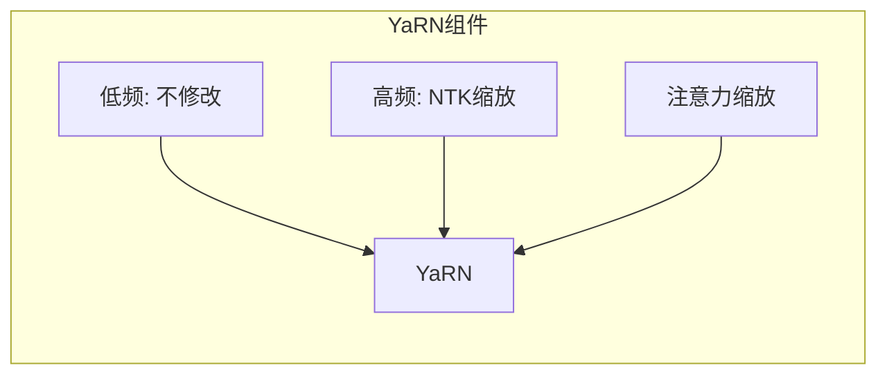
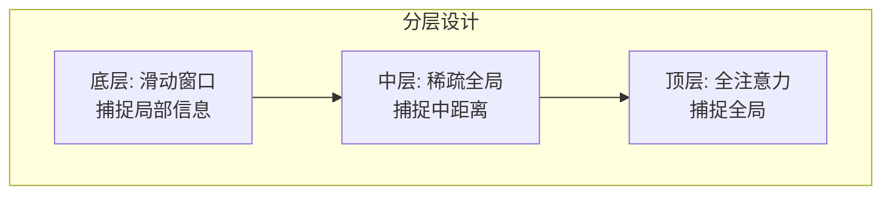

# 长上下文技术：突破序列长度限制

处理长文档、长对话、代码分析等场景需要模型支持更长的上下文。本文将介绍扩展 LLM 上下文长度的各种技术，从位置编码外推到高效注意力机制。

## 为什么长上下文很重要？

### 实际应用需求

```
文档分析: 一篇论文 ~8K tokens, 一本书 ~100K tokens
代码理解: 一个项目 ~500K tokens
多轮对话: 长对话历史可能达 50K+ tokens
RAG 场景: 检索多个文档片段需要长上下文
```

### 模型上下文长度演进

| 模型 | 发布时间 | 上下文长度 |
|------|----------|------------|
| GPT-3 | 2020 | 2K |
| GPT-3.5 | 2022 | 4K |
| GPT-4 | 2023 | 8K / 32K |
| Claude 2 | 2023 | 100K |
| GPT-4 Turbo | 2023 | 128K |
| Claude 3 | 2024 | 200K |
| Gemini 1.5 | 2024 | 1M |

## 长上下文的挑战

### 1. 计算复杂度

标准注意力的复杂度是 O(n²)：

```
seq_len = 4K:   注意力矩阵 = 4K × 4K = 16M
seq_len = 128K: 注意力矩阵 = 128K × 128K = 16B
                增长 1000 倍！
```

### 2. 显存占用

```
KV Cache 显存 (LLaMA-7B, FP16):
- 4K tokens:   0.5 GB
- 32K tokens:  4 GB
- 128K tokens: 16 GB
- 1M tokens:   128 GB
```

### 3. 位置编码外推

训练时的最大位置是固定的，超出会导致性能急剧下降：

```
训练长度: 4096
测试长度: 8192

问题: 模型从未见过位置 4097-8192 的编码！
结果: 性能崩溃
```

## 位置编码外推技术

### 位置插值 (Position Interpolation, PI)

**核心思想**：将超出训练范围的位置线性压缩到训练范围内。

```
原始 RoPE: position = 0, 1, 2, ..., 8191
插值后:    position' = position × (4096 / 8192)
                     = 0, 0.5, 1, 1.5, ..., 4095.5
```

```python
def position_interpolation(position, max_train_length, target_length):
    """位置插值"""
    scale = max_train_length / target_length
    return position * scale

# 示例
max_train = 4096
target = 8192
pos = 6000  # 超出训练范围

# 插值后的位置
new_pos = position_interpolation(pos, max_train, target)
# new_pos = 6000 × (4096/8192) = 3000 (在训练范围内)
```

**优点**：简单有效
**缺点**：需要微调以恢复性能

### NTK-aware Scaling

**核心思想**：调整 RoPE 的基频，而非位置。

RoPE 的角度：
```
θ_i = base^(-2i/d)

原始: base = 10000
NTK:  base' = base × α
```

```python
def ntk_scaling(base, alpha):
    """NTK-aware 缩放"""
    return base * alpha

# 扩展 2 倍上下文
alpha = 2
new_base = ntk_scaling(10000, alpha)  # 20000
```

**特点**：
- 高频分量（局部信息）影响小
- 低频分量（全局信息）被拉伸
- 无需微调即可外推

### Dynamic NTK

根据当前序列长度动态调整：

```python
def dynamic_ntk_scaling(seq_len, max_train_length, base=10000):
    """动态 NTK 缩放"""
    if seq_len <= max_train_length:
        return base  # 不缩放
    
    # 动态计算 alpha
    alpha = seq_len / max_train_length
    return base * alpha
```

### YaRN

**YaRN (Yet another RoPE extensioN)** 结合多种技术：



**关键技术**：

1. **频率分段处理**：
```python
def yarn_scaling(dim_idx, d_model, alpha, beta=32):
    """YaRN 频率缩放"""
    # 计算当前维度的相对位置
    ratio = dim_idx / d_model
    
    # 低频（接近 0）: 不缩放
    # 高频（接近 1）: 完全缩放
    # 中间: 平滑过渡
    
    ramp = (ratio - 0) / (1 - 0)  # 0 到 1
    scale = (1 - ramp) * 1 + ramp * alpha
    
    return scale
```

2. **注意力缩放**：
```python
def yarn_attention_scaling(seq_len, max_train_length):
    """YaRN 注意力缩放因子"""
    if seq_len <= max_train_length:
        return 1.0
    
    # 补偿注意力 softmax 的温度变化
    scale = 0.1 * math.log(seq_len / max_train_length) + 1
    return scale
```

### 外推技术对比

| 方法 | 需要微调 | 外推能力 | 性能保持 |
|------|----------|----------|----------|
| 直接外推 | 否 | 差 | 差 |
| PI | 是 | 好 | 好 |
| NTK | 否 | 中 | 中 |
| Dynamic NTK | 否 | 好 | 中 |
| YaRN | 少量 | 很好 | 很好 |

## 高效注意力机制

### Sliding Window Attention

只关注局部窗口内的 token：

```
窗口大小 = 4096

位置 5000 的注意力范围: [904, 5000]
                       只看前 4096 个 token

复杂度: O(n × w)，w = 窗口大小
```

```python
def sliding_window_attention(q, k, v, window_size):
    """滑动窗口注意力"""
    seq_len = q.shape[1]
    
    # 创建窗口掩码
    mask = torch.ones(seq_len, seq_len)
    for i in range(seq_len):
        # 只保留窗口内的位置
        start = max(0, i - window_size + 1)
        mask[i, :start] = 0
    
    # 标准注意力 + 掩码
    scores = q @ k.T / sqrt(d_k)
    scores = scores.masked_fill(mask == 0, float('-inf'))
    attention = softmax(scores)
    
    return attention @ v
```

**使用模型**：Mistral（window=4096）、Longformer

### 分层注意力

不同层使用不同的注意力模式：



### Ring Attention

将长序列分块，通过环形通信计算完整注意力：

```
序列长度: 128K
GPU 数量: 8
每 GPU: 16K tokens

GPU 0 计算: Q[0:16K] 与所有 K, V 的注意力
            K, V 通过环形传递
```

```mermaid
graph LR
    G0[GPU 0<br>Q[0:16K]] -->|传递 K,V| G1[GPU 1<br>Q[16K:32K]]
    G1 -->|传递 K,V| G2[GPU 2<br>Q[32K:48K]]
    G2 -->|传递 K,V| G3[GPU 3<br>...]
    G3 -->|传递 K,V| G0
```

## 记忆机制

### Landmark Attention

在序列中插入"地标"token，作为信息聚合点：

```
原始序列:  [t1][t2][t3]...[t1000][t1001]...
添加地标:  [t1][t2][t3]...[LAND][t1001]...[LAND]...

地标 token 聚合前面 n 个 token 的信息
远距离 token 可以通过地标快速访问
```

### Compressive Transformer

压缩旧的记忆：

```
活跃记忆: 最近 n tokens (全精度)
压缩记忆: 更早的 tokens (压缩后存储)

新 token 进入 → 旧 token 移入压缩记忆
```

### Memorizing Transformer

使用外部记忆库：

```python
class MemorizingAttention(nn.Module):
    def __init__(self, d_model, memory_size):
        self.kv_memory = KVMemory(memory_size)
    
    def forward(self, q, k, v):
        # 当前注意力
        local_attn = attention(q, k, v)
        
        # 从记忆库检索
        mem_k, mem_v = self.kv_memory.retrieve(q)
        memory_attn = attention(q, mem_k, mem_v)
        
        # 组合
        output = combine(local_attn, memory_attn)
        
        # 更新记忆
        self.kv_memory.update(k, v)
        
        return output
```

## 长上下文模型实例

### Gemini 1.5 Pro

Google 的百万级上下文模型：

```
上下文长度: 1M tokens
技术亮点:
- 高效的稀疏注意力
- 分层记忆机制
- 专门的长上下文训练
```

### Claude 3

Anthropic 的长上下文系列：

```
Claude 3 Opus:   200K tokens
Claude 3 Sonnet: 200K tokens
Claude 3 Haiku:  200K tokens

技术特点:
- 优化的 KV Cache 管理
- 高效的注意力实现
```

### LLaMA 长上下文变体

```
原始 LLaMA 2:  4K tokens
LongLLaMA:     256K tokens (使用 Focused Transformer)
Code Llama:    100K tokens (使用 RoPE 外推)
LLaMA 3:       128K tokens (原生支持)
```

## 长上下文推理优化

### KV Cache 压缩

```python
def h2o_kv_compression(k_cache, v_cache, attention_scores, keep_ratio=0.5):
    """H2O: Heavy-Hitter Oracle 压缩"""
    # 计算每个位置的累计注意力分数
    importance = attention_scores.sum(dim=-2)  # 被关注的程度
    
    # 保留最重要的 token
    num_keep = int(k_cache.shape[1] * keep_ratio)
    _, indices = importance.topk(num_keep)
    
    k_compressed = k_cache.index_select(1, indices)
    v_compressed = v_cache.index_select(1, indices)
    
    return k_compressed, v_compressed
```

### Streaming LLM

只保留开头和最近的 token：

```
策略: 保留前 4 个 token + 最近 N 个 token

[t1][t2][t3][t4]......[t_{n-N}]...[t_n]
 ↑ 始终保留（attention sink）      ↑ 滑动窗口
```

```python
def streaming_llm_cache(kv_cache, sink_size=4, window_size=4000):
    """StreamingLLM 缓存策略"""
    seq_len = kv_cache.shape[1]
    
    if seq_len <= sink_size + window_size:
        return kv_cache
    
    # 保留 sink tokens + window tokens
    sink = kv_cache[:, :sink_size]
    window = kv_cache[:, -window_size:]
    
    return torch.cat([sink, window], dim=1)
```

### Chunked Processing

将长序列分块处理：

```python
def chunked_forward(model, input_ids, chunk_size=4096):
    """分块前向传播"""
    total_len = input_ids.shape[1]
    outputs = []
    
    for start in range(0, total_len, chunk_size):
        end = min(start + chunk_size, total_len)
        chunk = input_ids[:, start:end]
        
        # 处理这一块
        chunk_output = model(chunk, use_cache=True)
        outputs.append(chunk_output)
    
    return combine_outputs(outputs)
```

## 实战：使用长上下文模型

### 加载长上下文模型

```python
from transformers import AutoModelForCausalLM, AutoTokenizer

# 加载支持长上下文的模型
model = AutoModelForCausalLM.from_pretrained(
    "gradientai/Llama-3-8B-Instruct-262k",
    torch_dtype=torch.float16,
    device_map="auto",
    rope_scaling={"type": "yarn", "factor": 64}  # YaRN 外推
)
```

### 配置 RoPE 外推

```python
from transformers import LlamaConfig

config = LlamaConfig.from_pretrained("meta-llama/Llama-2-7b-hf")

# 配置位置插值
config.rope_scaling = {
    "type": "linear",  # 或 "dynamic", "yarn"
    "factor": 4.0      # 扩展 4 倍
}

model = AutoModelForCausalLM.from_pretrained(
    "meta-llama/Llama-2-7b-hf",
    config=config,
    torch_dtype=torch.float16,
)
```

## 本章小结

- 长上下文面临计算、显存、位置编码三大挑战
- 位置插值、NTK、YaRN 等技术实现位置编码外推
- 滑动窗口、稀疏注意力降低计算复杂度
- KV Cache 压缩、StreamingLLM 优化显存使用
- Gemini 1.5、Claude 3 代表了长上下文的最新进展

## 延伸阅读

- Extending Context Window of Large Language Models via Positional Interpolation
- YaRN: Efficient Context Window Extension of Large Language Models
- StreamingLLM: Efficient Streaming Language Models with Attention Sinks

---

*下一篇：[多模态大模型：超越文本](./23-multimodal.md)*
