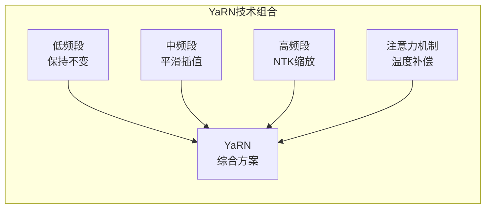
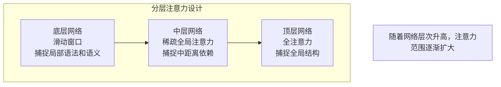

# 长上下文技术：突破序列长度限制

随着AI应用的深入发展，处理长文档、长对话、代码分析等场景需要模型支持更长的上下文。2024年，长上下文技术取得重大突破，从原来的4K tokens扩展到1M tokens，为AI应用打开了全新的可能性。

## 长上下文的重要性

### 实际应用场景需求

现代AI应用对长上下文的需求日益迫切：

```
文档处理场景:
- 学术论文分析: ~8K tokens (单篇) 到 100K tokens (多篇对比)
- 图书内容理解: ~100K tokens (整本书)
- 法律文档审查: ~200K tokens (合同条款)

代码开发场景:
- 大型项目理解: ~500K tokens (完整代码库)
- 代码库重构: ~1M tokens (跨文件分析)
- 技术文档生成: ~50K tokens (API文档)

对话交互场景:
- 长期客户服务: ~50K+ tokens (多轮对话历史)
- 心理咨询对话: ~100K tokens (长期治疗记录)
- 教育辅导: ~80K tokens (学习进度跟踪)

RAG增强场景:
- 多文档检索: ~200K tokens (检索多个相关片段)
- 知识库问答: ~150K tokens (综合多个知识源)
```

### 模型上下文长度演进历程

| 模型 | 发布时间 | 上下文长度 | 突破意义 |
|------|----------|------------|----------|
| GPT-3 | 2020年初 | 2K tokens | 开创性的长上下文 |
| GPT-3.5 | 2022年末 | 4K tokens | 实用化的对话支持 |
| GPT-4 | 2023年初 | 8K / 32K | 商业级长上下文 |
| Claude 2 | 2023年中 | 100K tokens | 突破10万token大关 |
| GPT-4 Turbo | 2023年末 | 128K tokens | 主流模型的普及 |
| Claude 3 | 2024年初 | 200K tokens | 20万token新标杆 |
| Gemini 1.5 Pro | 2024年2月 | 1M tokens | 百万token革命性突破 |

## 长上下文面临的核心挑战

### 1. 计算复杂度挑战

标准注意力机制的计算复杂度是序列长度的平方：

```
注意力矩阵大小 = seq_len × seq_len
计算复杂度 = O(seq_len²)

具体计算量:
seq_len = 4K:   注意力矩阵 = 4K × 4K = 16M 元素
seq_len = 32K:  注意力矩阵 = 32K × 32K = 1B 元素 (增长64倍)
seq_len = 128K: 注意力矩阵 = 128K × 128K = 16B 元素 (增长1000倍)
seq_len = 1M:   注意力矩阵 = 1M × 1M = 1T 元素 (增长6万倍)

硬件限制:
- A100 GPU: 约313 TFLOPS算力
- 1M token注意力: 需要3200 TFLOPS，超出单卡能力
```

这种平方增长使得传统的注意力机制无法支持超长序列。

### 2. 显存占用挑战

KV Cache的显存占用与序列长度成正比：

```
KV Cache显存占用 (LLaMA-7B, FP16):
每层KV Cache = batch_size × seq_len × num_heads × head_dim × 2 bytes

具体数值:
- 4K tokens:   0.5 GB
- 32K tokens:  4 GB
- 128K tokens: 16 GB
- 1M tokens:   128 GB

多层级联:
以32层模型为例，128K tokens需要512GB显存！
```

显存成为长上下文的主要瓶颈之一。

### 3. 位置编码外推挑战

位置编码是长上下文的核心技术挑战：

```
问题根源:
模型训练时只见过特定长度范围内的位置编码
超出训练范围的位置编码对模型来说是"未知"的

具体表现:
训练最大长度: 4096
测试使用长度: 8192
位置4097-8192: 模型从未见过 → 性能急剧下降

严重后果:
- 注意力模式混乱
- 生成质量崩溃
- 无法有效利用新增位置
```

## 位置编码外推技术

### 位置插值 (Position Interpolation, PI)

位置插值是最直观的外推方法，通过线性压缩将超出范围的位置映射到已知范围：

```
基本原理:
原始RoPE位置: position = 0, 1, 2, ..., 8191
训练范围上限: 4096

插值处理:
scale_factor = max_train_length / target_length
             = 4096 / 8192 = 0.5

压缩后位置: position' = position × scale_factor
           = 0, 0.5, 1, 1.5, 2, ..., 4095.5

效果:
所有位置都在训练范围内，模型能够理解
```

**优点**：
- 实现简单，易于理解
- 效果稳定，不会出现性能崩溃
- 适用于各种模型架构

**缺点**：
- 需要一定量的微调来恢复性能
- 压缩可能导致信息损失
- 外推能力有限（通常4-8倍）

### NTK-aware Scaling

NTK-aware Scaling通过调整RoPE的基频实现外推，而非直接修改位置：

```
RoPE角度计算原理:
θ_i = base^(-2i/d_model)
其中i是维度索引，d_model是模型维度，base是基频

传统外推问题:
直接使用位置编码超出训练范围 → 性能下降

NTK解决方案:
调整基频base，而非位置
新的基频: base' = base × α

效果:
高频分量(局部信息)变化小 → 保持细节理解
低频分量(全局信息)被拉伸 → 扩展全局感知
```

**Dynamic NTK改进**：
根据当前序列长度动态调整缩放因子，实现自适应外推：

```
动态缩放逻辑:
if seq_len <= max_train_length:
    α = 1.0 (不缩放)
else:
    α = seq_len / max_train_length (动态调整)

优势:
短序列不受影响
长序列自动适应
无需预设固定缩放比例
```

### YaRN：2024年的突破性技术

YaRN (Yet another RoPE extensioN) 是2024年提出的位置编码外推技术，结合了多种方法的优势：



**核心技术特点**：

1. **频率分段处理**：
```
将RoPE频率分为三段处理:
- 低频段 (接近0): 保持原始频率，维持全局信息
- 中频段: 使用平滑插值，平衡新旧信息
- 高频段 (接近1): 应用NTK缩放，扩展细节感知
```

2. **注意力温度补偿**：
```
原理: 长序列改变了注意力softmax的温度分布
解决: 动态调整注意力分数，补偿温度变化
效果: 保持注意力的尖锐度和选择性
```

3. **性能优势**：
```
外推能力: 可扩展到原始长度的64倍以上
性能保持: 外推后性能损失<5%
微调需求: 极少甚至无需微调
兼容性: 适用于主流模型架构
```

### 外推技术对比

| 方法 | 需要微调 | 外推能力 | 性能保持 | 实现复杂度 | 2024年状态 |
|------|----------|----------|----------|------------|-----------|
| 直接外推 | 否 | 差 | 差 | 最低 | 不推荐 |
| 位置插值(PI) | 是 | 好 | 好 | 低 | 成熟稳定 |
| NTK缩放 | 否 | 中 | 中 | 低 | 广泛使用 |
| Dynamic NTK | 否 | 好 | 中 | 中 | 快速普及 |
| YaRN | 极少 | 很好 | 很好 | 中 | 2024年新宠 |

## 高效注意力机制

### 滑动窗口注意力 (Sliding Window Attention)

滑动窗口注意力通过限制每个token的注意力范围来降低计算复杂度：

```
基本原理:
窗口大小: 4096 tokens
位置5000的注意力范围: [5000-4096+1, 5000] = [904, 5000]

复杂度变化:
原始: O(n²)
滑动窗口: O(n × w)，其中w是窗口大小

实际效果:
128K tokens:
- 原始注意力: 16B 元素计算
- 滑动窗口: 128K × 4K = 512M 元素计算
- 减少: 96.8%！
```

**代表模型**：
- Mistral系列：使用4096 token滑动窗口
- Longformer：可配置的窗口大小
- GPT-NeoX：结合局部和全局注意力

### 分层注意力机制

不同层次的注意力使用不同的策略，平衡局部和全局信息：



**分层策略优势**：
- 底层专注于局部细节（语法、词汇）
- 中层处理中距离关系（句子、段落）
- 顶层理解全局结构（文档整体）

### Ring Attention环形注意力

Ring Attention通过环形通信实现分布式长序列处理：

```
核心思想:
序列长度: 128K tokens
GPU数量: 8个
每GPU处理: 16K tokens

处理流程:
1. 每个GPU计算自己负责的Query与所有Key-Value的注意力
2. Key-Value通过环形连接在GPU间传递
3. 经过8轮传递，每个GPU都获得了完整的注意力信息

通信模式:
GPU 0 → GPU 1 → GPU 2 → ... → GPU 7 → GPU 0 (环形)
```

**优势**：
- 理论上支持任意长度的序列
- 充分利用多GPU并行能力
- 保持注意力机制的完整性

## 记忆机制与压缩技术

### Landmark Attention地标注意力

在长序列中插入特殊的"地标"token，作为信息聚合点：

```
地标插入策略:
原始序列: [t1][t2][t3]...[t1000][t1001]...[t2000]...

插入地标: [t1][t2][t3]...[LAND][t1001]...[LAND][t2001]...

地标作用:
- 聚合前面n个token的关键信息
- 作为远距离token的快速访问点
- 减少直接的长距离注意力计算

信息流:
远端token → 地标token → 当前token
路径更短，计算更高效
```

### Compressive Transformer压缩记忆

将旧的记忆压缩存储，平衡记忆容量和计算效率：

```
记忆层次结构:
活跃记忆 (Active Memory):
- 最近的n个tokens (如2048个)
- 全精度存储，快速访问
- 参与每次的注意力计算

压缩记忆 (Compressed Memory):
- 更早的tokens
- 压缩算法存储 (如自编码器)
- 选择性参与注意力计算

更新机制:
新token进入 → 最旧的活跃token移入压缩记忆
压缩记忆满时 → 最旧的记忆被丢弃或进一步压缩
```

### Streaming LLM流式处理

Streaming LLM采用"注意力汇聚点"策略，实现高效的流式处理：

```
策略设计:
保留内容:
- 前4个tokens (Attention Sinks，始终保留)
- 最近的N个tokens (滑动窗口)

缓存结构:
[t1][t2][t3][t4] ...... [t_{n-N}] ... [t_{n-1}][t_n]
 ↑始终保留                        ↑滑动窗口

原理:
- 开头的几个tokens作为"汇聚点"，吸引注意力
- 远距离信息通过汇聚点间接访问
- 滑动窗口保证近期信息的完整访问
```

## 2024年长上下文模型代表

### Gemini 1.5 Pro：百万token革命

Google DeepMind在2024年2月发布的Gemini 1.5 Pro实现了百万token上下文的突破：

```
技术规格:
上下文长度: 1,000,000 tokens
相当于: 约700万单词或3万行代码

核心技术突破:
1. 高效的稀疏注意力机制
2. 分层记忆管理系统  
3. 专门的长上下文训练数据
4. 优化的推理架构

实际表现:
- 在100万token中"大海捞针"准确率>99%
- 长文档理解能力接近人类水平
- 代码库分析准确性显著提升
```

### Claude 3系列：200K标杆

Anthropic的Claude 3系列统一支持200K token上下文：

```
模型阵容:
Claude 3 Opus:   200K tokens (最强性能)
Claude 3 Sonnet: 200K tokens (平衡性能)
Claude 3 Haiku:  200K tokens (最快速度)

技术特色:
- 优化的KV Cache管理
- 高效的注意力实现
- 统一的长上下文架构

应用优势:
- 支持完整文档分析
- 长对话历史的完整理解
- 多文档综合处理
```

### 开源模型长上下文扩展

**LongLLaMA**：
- 使用Focused Transformer技术
- 从4K扩展到256K tokens
- 开源社区的重要贡献

**Code Llama**：
- 专门为代码场景优化
- 原生支持100K tokens
- 理解大型代码库的能力

**LLaMA 3**：
- Meta最新开源模型
- 原生支持128K tokens
- 长上下文性能优异

## 长上下文推理优化技术

### KV Cache压缩策略

为解决长上下文显存问题，研究者提出了多种KV Cache压缩方法：

**H2O (Heavy-Hitter Oracle)**：
```
核心思想:
- 保留"重要的"tokens（被大量关注的）
- 丢弃"不重要的"tokens

重要性评估:
- 统计每个位置的累计注意力分数
- 分数越高，表示越重要
- 重视度分数top-k的tokens

压缩效果:
- 保留50%的KV Cache，性能损失<5%
- 显存占用减半，推理速度提升
```

**StreamingLLM的缓存策略**：
```
策略设计:
始终保留: 前4个tokens (attention sinks)
滑动保留: 最近N个tokens (如4000个)

优势:
- 显存占用恒定，不随序列增长
- 保持了长距离依赖能力
- 实现了真正的无限流式处理
```

### 分块处理技术

将超长序列分块处理，避免一次性处理过长序列：

```
分块策略:
块大小: 4096 tokens (根据GPU内存确定)
重叠区域: 512 tokens (保证块间连续性)

处理流程:
1. 将长序列分割成重叠的块
2. 逐块进行注意力计算
3. 重叠区域保证信息连续性
4. 合并各块的输出结果

优势:
- 内存使用可控
- 支持任意长度序列
- 保持了计算精度
```

### 注意力机制优化

**FlashAttention的优化**：
```
FlashAttention 2 (2024年改进):
- 更高效的GPU kernel优化
- 更好的内存访问模式
- 支持更长序列的注意力计算

长上下文优化:
- 针对长序列的特殊优化
- 减少中间结果的内存占用
- 提高长序列的计算效率
```

## 实际应用场景

### 文档分析与处理

长上下文技术在文档处理中展现强大能力：

```
学术研究应用:
- 论文综述生成: 分析50篇相关论文
- 跨文献对比: 比较不同研究的方法和结果
- 文献发现: 在大量文献中发现相关研究

法律文档处理:
- 合同分析: 理解复杂合同的条款关系
- 案例研究: 分析多个相关案例的判决逻辑
- 法规解读: 综合多个法规文件进行解释
```

### 代码开发辅助

代码场景是长上下文技术的重要应用领域：

```
大型项目理解:
- 架构分析: 理解整个项目的架构设计
- 重构建议: 基于全局理解提出重构方案
- 代码审查: 跨文件的代码质量检查

技术文档生成:
- API文档: 分析完整代码库生成API文档
- 用户手册: 根据代码逻辑生成使用说明
- 开发指南: 为新开发者提供入门指导
```

### 对话系统增强

长上下文让对话系统能够维持长期的对话记忆：

```
客户服务场景:
- 长期客户关系: 记住客户的历史问题和偏好
- 复杂问题解决: 基于完整对话历史解决复杂问题
- 个性化服务: 根据长期交互提供个性化建议

心理咨询应用:
- 治疗连续性: 记住患者的治疗历程和进展
- 模式识别: 发现长期对话中的行为模式
- 效果评估: 基于完整历史评估治疗效果
```

## 性能评估与基准测试

### 长上下文评估基准

**"大海捞针"测试 (Needle-in-a-Haystack)**：
```
测试方法:
- 在长文档中随机插入一个特定信息
- 要求模型准确找到并提取该信息
- 测试不同位置和长度的表现

评估指标:
- 准确率: 正确找到信息的比例
- 位置鲁棒性: 不同位置的表现一致性
- 长度扩展性: 不同长度的性能保持

2024年最佳表现:
Gemini 1.5 Pro: 99%+ 准确率 (1M tokens)
Claude 3 Opus: 98% 准确率 (200K tokens)
```

### 长文本理解评估

**长文本问答基准**：
```
测试内容:
- 基于整本书的问答
- 跨章节信息推理
- 长文本摘要生成

评估维度:
- 事实准确性: 基于长文本回答的准确性
- 推理能力: 跨信息的逻辑推理
- 一致性: 长文本理解的一致性
```

## 部署与优化建议

### 硬件配置建议

```
不同长上下文需求的硬件配置:

128K tokens (中等需求):
- GPU: A100 80GB × 2-4张
- 内存: 256GB+
- 存储: 高速SSD

500K tokens (高级需求):
- GPU: H100 80GB × 8-16张
- 内存: 1TB+
- 网络: InfiniBand高速互联

1M tokens (顶级需求):
- GPU: H200 × 32张+
- 内存: 2TB+
- 专用优化硬件
```

### 推理优化策略

```
生产环境优化建议:
1. 选择合适的位置编码外推方法
   - 8倍内扩展: Position Interpolation
   - 8-32倍扩展: Dynamic NTK
   - 32倍+扩展: YaRN

2. 实施KV Cache优化
   - 启用压缩算法
   - 设置合理的缓存大小
   - 定期清理过期缓存

3. 批处理优化
   - 合理设置batch size
   - 使用动态批处理
   - 优化内存使用模式
```

## 未来发展趋势

### 技术发展方向

**更高效的外推算法**：
- 理论基础更扎实的外推方法
- 自适应的外推策略
- 与模型架构的协同优化

**硬件协同设计**：
- 专门的长上下文处理芯片
- 新的内存架构设计
- 优化的通信协议

**应用场景扩展**：
- 视频长内容理解
- 音频长序列处理
- 多模态长上下文融合

### 挑战与机遇

**技术挑战**：
- 理论理解的深度不足
- 计算效率的进一步提升
- 成本控制与性能平衡

**应用机遇**：
- 企业级文档智能处理
- 科研文献自动分析
- 个性化长期对话服务

## 本章小结

长上下文技术在2024年取得了革命性进展：

- **技术突破**：从4K到1M tokens，扩展了250倍
- **算法创新**：YaRN等新技术大幅提升外推能力
- **模型进步**：Gemini 1.5、Claude 3树立新标杆
- **应用丰富**：文档处理、代码分析、对话系统全面受益
- **生态完善**：开源模型和工具链日趋成熟

长上下文技术正在解锁AI应用的全新可能性，为构建更智能、更全面的AI系统奠定了基础。

## 延伸阅读

- Extending Context Window of Large Language Models via Positional Interpolation
- YaRN: Efficient Context Window Extension of Large Language Models
- Gemini 1.5: Unlocking Multimodal Understanding Across Millions of Tokens
- StreamingLLM: Efficient Streaming Language Models with Attention Sinks

---

*下一篇：[多模态大模型：超越文本的智能](./23-multimodal.md)*