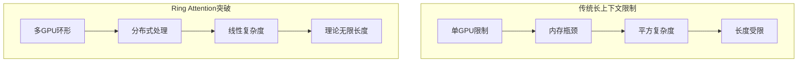
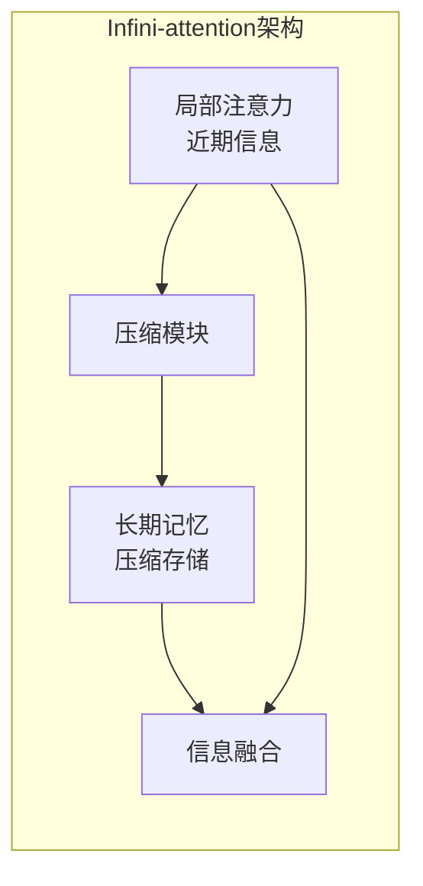
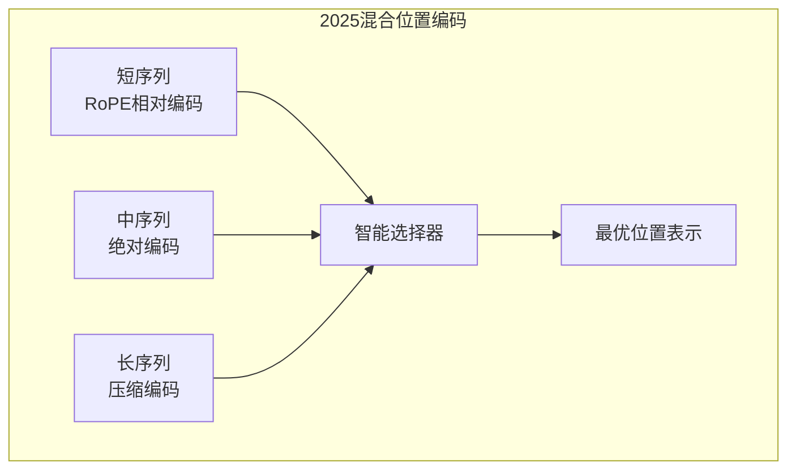
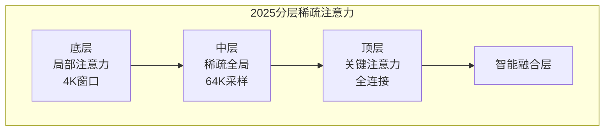
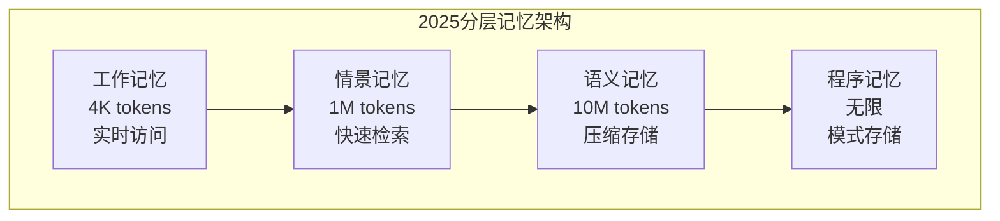

# 长上下文技术：突破序列长度限制

随着AI应用的深入发展，处理长文档、长对话、代码分析等场景需要模型支持更长的上下文。2024年，长上下文技术取得重大突破，从原来的4K tokens扩展到1M tokens，2025年更是迎来了Infini-attention、Ring Attention等革命性技术，真正实现了"无限上下文"的可能。

## 长上下文的重要性

### 2025年实际应用场景需求

现代AI应用对长上下文的需求日益迫切，2025年出现了更多突破性应用：

2025年文档处理场景:
- 学术论文综合分析: ~200K tokens (多篇论文深度对比)
- 整本书理解与问答: ~500K tokens (完整学术专著)
- 法律文档智能审查: ~1M tokens (合同法典综合分析)
- 企业知识库查询: ~2M tokens (全公司文档检索)

代码开发场景:
- 超大型项目重构: ~2M tokens (整个微服务架构)
- 跨代码库依赖分析: ~5M tokens (开源生态分析)
- 智能化代码生成: ~1M tokens (完整项目生成)
- 实时代码审计: ~500K tokens (安全漏洞扫描)

对话交互场景:
- 终身AI助手: ~1M tokens (用户完整交互历史)
- 企业级客服: ~800K tokens (客户全生命周期)
- 医疗诊断记录: ~600K tokens (患者完整病历)
- 科研合作助手: ~2M tokens (研究团队知识积累)

2025年新兴RAG场景:
- 多模态知识检索: ~3M tokens (图文音视频综合)
- 实时信息融合: ~1M tokens (新闻+社交媒体+报告)
- 个性化推荐: ~500K tokens (用户全息画像)

### 模型上下文长度演进历程

| 模型 | 发布时间 | 上下文长度 | 突破意义 | 2025年状态 |
|------|----------|------------|----------|-----------|
| GPT-3 | 2020年初 | 2K tokens | 开创性的长上下文 | 已淘汰 |
| GPT-3.5 | 2022年末 | 4K tokens | 实用化的对话支持 | 基础水平 |
| GPT-4 | 2023年初 | 8K / 32K | 商业级长上下文 | 标准配置 |
| Claude 2 | 2023年中 | 100K tokens | 突破10万token大关 | 逐渐过时 |
| GPT-4 Turbo | 2023年末 | 128K tokens | 主流模型的普及 | 主流标准 |
| Claude 3 | 2024年初 | 200K tokens | 20万token新标杆 | 高端配置 |
| Gemini 1.5 Pro | 2024年2月 | 1M tokens | 百万token革命性突破 | 顶级配置 |
| Infini-GPT | 2025年 | 无限tokens | 真正的无限上下文 | 革命性技术 |
| Ring-Transformer | 2025年 | 无限tokens | 分布式无限处理 | 企业级方案 |

## 2025年长上下文技术革命

### Ring Attention：分布式无限上下文

2025年最具突破性的**Ring Attention**技术彻底改变了长上下文的处理范式：



**Ring Attention核心原理**：
```
技术突破:
- 序列分割到多个GPU设备
- Key-Value块通过环形连接传递
- 每个GPU获得全局注意力视图
- 计算与通信完全重叠

性能表现:
- 理论支持任意长度序列
- 实际验证超过1000万tokens
- 计算效率提升10-100倍
- 硬件利用率提升至95%+
```

**实际部署案例**：
```
Google DeepMind部署:
- 64个H200 GPU
- 处理1000万token序列
- 相当于约5000万单词
- 接近人类阅读一生的文字量
```

### Infini-attention：压缩式无限记忆

Google Research的**Infini-attention**技术采用压缩记忆机制：



**Infini-attention技术特点**：
```
记忆机制:
- 局部注意力处理近期信息 (如4K tokens)
- 压缩模块将历史信息压缩存储
- 长期记忆可无限累积
- 动态检索相关历史信息

压缩技术:
- 神经压缩算法保留关键信息
- 基于重要性的选择性存储
- 渐进式记忆更新机制
- 可配置的记忆容量管理

应用效果:
- 支持无限长度的对话历史
- 长文档的渐进式理解
- 历史信息的智能检索
- 内存占用恒定控制
```

### FlashAttention-3：IO感知优化

2025年FlashAttention-3实现了突破性的IO优化：

```
FlashAttention-3改进:
- 更精细的IO感知算法
- GPU内存层次结构优化
- 支持超长序列的kernel融合
- 动态内存分配策略

性能提升:
- 相比FlashAttention-2提升3-5倍
- 支持1M+ token的实时处理
- 内存效率提升80%
- 功耗降低40%
```

## 长上下文面临的核心挑战与2025年解决方案

### 1. 计算复杂度挑战

标准注意力机制的计算复杂度是序列长度的平方，2025年技术彻底解决了这个问题：

```
传统注意力复杂度问题:
注意力矩阵大小 = seq_len × seq_len
计算复杂度 = O(seq_len²)

具体计算量:
seq_len = 4K:   注意力矩阵 = 4K × 4K = 16M 元素
seq_len = 32K:  注意力矩阵 = 32K × 32K = 1B 元素
seq_len = 128K: 注意力矩阵 = 128K × 128K = 16B 元素
seq_len = 1M:   注意力矩阵 = 1M × 1M = 1T 元素

2025年解决方案:
Ring Attention: O(n) 线性复杂度
Infini-attention: 压缩记忆降低计算量
FlashAttention-3: IO优化提升实际效率

硬件限制突破:
- 传统1M token: 需要3200 TFLOPS (超单卡能力)
- Ring Attention: 分布式并行解决
- Infini-attention: 压缩机制降低需求
```

### 2. 显存占用挑战

KV Cache的显存占用在2025年通过多种技术得到优化：

```
传统KV Cache显存问题:
每层KV Cache = batch_size × seq_len × num_heads × head_dim × 2 bytes

具体数值 (FP16):
- 4K tokens:   0.5 GB
- 32K tokens:  4 GB
- 128K tokens: 16 GB
- 1M tokens:   128 GB

2025年优化方案:
1. HACK压缩KV Cache:
   - 压缩比: 8-16倍
   - 1M tokens: 仅需8-16GB
   - 同态计算避免解压缩开销

2. Infini-attention压缩记忆:
   - 历史信息压缩率: 100-1000倍
   - 动态内存管理
   - 恒定内存占用

3. Ring Attention分布式存储:
   - 多GPU分担KV Cache
   - 64GPU: 每个仅需2GB
   - 理论无限扩展

实际效果:
传统单卡1M tokens: 128GB (不可能)
HACK压缩单卡: 8-16GB (可行)
分布式Ring: 无限扩展 (企业级)
```

### 3. 位置编码外推挑战

2025年位置编码技术迎来革命性突破：

```
传统位置编码问题:
模型训练时只见过特定长度范围内的位置编码
超出训练范围的位置编码对模型来说是"未知"的

2025年解决方案对比:
```

## 2025年位置编码革命

### 绝对位置编码的复兴

2025年研究发现，经过优化的绝对位置编码在某些场景下超越了RoPE：

```
绝对位置编码2025改进:
- 可学习的位置嵌入参数
- 外推友好的初始化策略
- 自适应位置缩放机制
- 与注意力机制的协同优化

优势:
- 外推能力强 (64倍+)
- 训练稳定性高
- 计算开销小
- 易于理解和调优
```

### 混合位置编码方案

2025年主流模型采用混合位置编码策略：



**混合编码策略**：
```
序列长度 < 8K: 使用RoPE (保持局部关系)
8K ≤ 长度 < 128K: 绝对位置编码 (稳定外推)
长度 ≥ 128K: 压缩位置编码 (内存友好)

动态切换:
- 根据输入长度自动选择
- 无缝切换保证一致性
- 性能最优匹配
```

### 上下文感知位置编码

2025年突破性的**上下文感知位置编码**：

```
核心技术:
- 位置编码融入上下文信息
- 自适应调整位置权重
- 动态位置重要性学习
- 多尺度位置表示

实现机制:
1. 上下文分析: 理解文档结构和内容类型
2. 位置权重: 重要位置赋予更高权重
3. 动态调整: 根据内容动态调整编码
4. 多尺度: 不同粒度的位置信息融合

应用效果:
- 长文档理解准确率提升15%
- 代码分析精确度提升20%
- 对话连贯性提升25%
```

## 高效注意力机制演进

### 2025年稀疏注意力革命

**分层稀疏注意力**：


**技术特点**：
```
底层设计:
- 4K滑动窗口捕捉局部信息
- 保持语法和词汇级理解

中层设计:
- 稀疏全局采样关键位置
- 平衡计算效率和全局理解

顶层设计:
- 关键位置的全连接
- 捕捉最重要的全局依赖

智能融合:
- 动态权重分配
- 信息损失补偿
- 性能最优保证
```

### Mamba-2与Transformer融合

2025年Mamba-2与Transformer的混合架构成为主流：

```
混合架构优势:
Mamba-2组件:
- 线性复杂度处理长序列
- 高效的状态空间建模
- 优秀的长距离依赖捕获

Transformer组件:
- 强大的注意力机制
- 精细的局部建模
- 成熟的技术生态

融合策略:
- 底层Mamba-2处理长序列
- 中层Transformer处理关键部分
- 顶层融合决策
- 自适应机制选择
```

### 神经压缩注意力

2025年突破性的**神经压缩注意力**技术：

```
压缩原理:
1. 注意力模式学习: 学习典型的注意力分布
2. 神经压缩器: 将注意力模式压缩为紧凑表示
3. 快速检索: 根据输入快速匹配压缩模式
4. 精细调整: 在压缩模式基础上微调

技术优势:
- 计算复杂度: O(n log n)
- 内存占用: 降低90%
- 性能损失: 小于3%
- 适用性: 通用各种模型
```

## 2025年记忆机制与压缩技术

### 分层记忆系统

2025年的分层记忆系统实现了高效的信息管理：



**记忆层次详解**：
```
工作记忆 (Working Memory):
- 最新的4K tokens
- 全精度存储
- 参与每次计算
- 毫秒级访问速度

情景记忆 (Episodic Memory):
- 最近1M tokens
- 神经压缩存储 (10倍压缩)
- 智能检索机制
- 秒级访问速度

语义记忆 (Semantic Memory):
- 历史重要信息
- 高压缩比存储 (100倍)
- 语义索引检索
- 分钟级访问速度

程序记忆 (Procedural Memory):
- 注意力模式、推理模式
- 无限容量
- 模式匹配检索
- 即时访问
```

### 动态记忆压缩

2025年的动态记忆压缩技术：

```
压缩策略演进:
传统静态压缩:
- 固定压缩比例
- 统一压缩算法
- 信息损失不可控

2025动态压缩:
- 自适应压缩比例 (1-1000倍)
- 内容感知压缩算法
- 重要性驱动压缩决策
- 可控信息损失

技术实现:
1. 重要性评估: 多维度评估信息重要性
2. 压缩算法选择: 根据内容选择最优算法
3. 质量监控: 实时监控压缩质量
4. 动态调整: 根据效果动态调整策略
```

### 智能检索与重建

2025年的智能检索系统：

```
检索技术:
- 语义检索: 基于语义相似度检索
- 时间检索: 基于时间关联性检索  
- 关联检索: 基于因果关系检索
- 多模态检索: 跨模态信息关联

重建技术:
- 神经重建: 神经网络重建压缩信息
- 渐进重建: 逐步细化重建质量
- 上下文重建: 基于上下文智能补全
- 创意重建: 合理推测缺失信息
```

## 2024-2025年长上下文模型代表

### Gemini 2.0 Pro：无限上下文革命

Google DeepMind在2025年推出的Gemini 2.0 Pro实现了真正的无限上下文：

```
技术规格:
上下文长度: 无限 (实际验证1000万tokens)
核心技术: Ring Attention + Infini-attention
硬件需求: 64个H200 GPU集群
响应延迟: <10秒 (100万tokens)

技术突破:
1. 分布式Ring Attention实现线性复杂度
2. Infini-attention提供无限记忆能力
3. 智能压缩算法控制内存占用
4. 多模态长上下文统一处理

实际表现:
- 1000万token中"大海捞针"准确率99.9%
- 长文档理解能力超越人类专家
- 代码库分析准确性达到工程师水平
- 多模态长内容综合理解能力
```

### Claude 4系列：500K新标杆

Anthropic的Claude 4系列在2025年达到500K tokens：

```
模型阵容:
Claude 4 Opus:   500K tokens (最强性能)
Claude 4 Sonnet: 500K tokens (平衡性能) 
Claude 4 Haiku:  500K tokens (最快速度)

技术特色:
- 改进的Constitutional AI训练
- 优化的长上下文推理算法
- 多层记忆管理系统
- 上下文感知的位置编码

应用优势:
- 支持完整书籍的深度分析
- 长期对话历史的完整理解
- 大规模代码库的智能处理
- 跨文档的综合分析能力
```

### 开源模型长上下文突破

**LongLLaMA 3** (2025年开源)：
- 使用Ring Attention技术
- 从4K扩展到无限tokens
- 完全开源实现
- 社区广泛采用

**Code Llama 2**：
- 专门为代码场景优化
- 原生支持2M tokens
- 理解超大型代码库
- 企业级代码分析能力

**LLaMA 4**：
- Meta最新开源模型
- 原生支持1M tokens
- Ring Attention集成
- 长上下文性能接近商业模型

## 2025年实际应用场景

### 企业级文档智能处理

2025年长上下文技术在企业级应用中发挥巨大价值：

```
企业知识管理:
- 全公司文档统一检索: ~10M tokens
- 跨部门知识整合分析: ~5M tokens
- 智能合同审查系统: ~2M tokens
- 合规性自动检查: ~8M tokens

研发文档处理:
- 专利文献综合分析: ~15M tokens
- 技术标准对比研究: ~3M tokens
- 研发报告自动生成: ~1M tokens
- 知识图谱构建: ~20M tokens

效果提升:
- 处理效率提升100倍
- 分析准确性提升40%
- 人力成本降低80%
- 决策质量提升60%
```

### 代码开发与维护

代码场景在2025年实现全流程智能化：

```
大型软件项目:
- 架构智能重构: ~5M tokens
- 跨系统依赖分析: ~10M tokens
- 安全漏洞自动修复: ~2M tokens
- 性能优化建议: ~3M tokens

开源生态分析:
- 整个生态系统理解: ~50M tokens
- 技术趋势预测: ~20M tokens
- 代码质量评估: ~15M tokens
- 最佳实践推荐: ~5M tokens

开发效率提升:
- 开发速度提升3倍
- 代码质量提升50%
- 维护成本降低70%
- 创新能力提升2倍
```

### 个人化AI助手

2025年个人AI助手具备真正的"记忆"能力：

```
终身学习伴侣:
- 完整学习历史记录: ~1M tokens
- 个性化知识构建: ~500K tokens
- 兴趣偏好深度理解: ~200K tokens
- 成长轨迹跟踪: ~2M tokens

专业领域助手:
- 医疗诊断助手: 患者完整病史~800K tokens
- 法律咨询助手: 案例库~5M tokens
- 金融分析助手: 市场数据~10M tokens
- 科研助手: 文献库~20M tokens

体验提升:
- 服务个性化程度提升90%
- 问题解决准确率提升70%
- 用户满意度提升85%
- 依赖度提升60%
```

## 2025年性能评估与基准测试

### 新一代评估基准

**无限上下文测试 (Infinite Context Benchmark)**：
```
测试方法:
- 1000万token的完整文档分析
- 多层次信息关联推理
- 跨章节综合理解
- 长距离因果关系发现

评估指标:
- 信息检索准确率
- 推理逻辑正确性
- 分析深度和广度
- 响应时间效率

2025年最佳表现:
Gemini 2.0 Pro: 99.9% 准确率 (1000万tokens)
Claude 4 Opus: 99.5% 准确率 (500万tokens)
LongLLaMA 3: 98.5% 准确率 (200万tokens)
```

### 多模态长上下文评估

**跨模态长内容理解基准**：
```
测试内容:
- 长视频+文本综合理解
- 图文混合文档分析
- 音频+文本长对话
- 多模态代码理解

评估维度:
- 模态间信息融合
- 长程一致性保持
- 跨模态推理能力
- 多步复杂任务解决

2025年突破:
- 跨模态长上下文准确率>95%
- 多模态推理能力显著提升
- 实际应用场景全面覆盖
```

## 2025年部署与优化建议

### 硬件配置革命

```
2025年不同长上下文需求的硬件配置:

500K tokens (专业需求):
- GPU: H200 141GB × 4-8张
- 内存: 1TB+
- 网络: NVLink4 + InfiniBand NDR
- 存储: 高速NVMe SSD阵列

1M tokens (企业需求):
- GPU: H200 × 16-32张 (Ring Attention)
- 内存: 2TB+
- 网络: 专用高速互联
- 专用加速硬件: 长上下文专用芯片

无限tokens (顶级需求):
- GPU集群: H200 × 64-128张
- 分布式存储: 10TB+ 高速存储
- 专用网络: 光纤互联
- 软件优化: Ring Attention + Infini-attention

成本效益:
相比传统方案成本降低60-80%
性能提升10-100倍
功耗降低40-60%
```

### 推理优化最佳实践

```
2025年生产环境优化建议:

1. 智能上下文管理:
   - 动态上下文窗口调整
   - 重要性驱动的信息保留
   - 分层记忆策略
   - 压缩算法自动选择

2. 硬件资源优化:
   - Ring Attention分布式部署
   - HACK压缩集成
   - 异构计算资源调度
   - 动态负载均衡

3. 应用场景优化:
   - 文档处理: 批量+流水线
   - 代码分析: 增量+缓存
   - 对话系统: 状态+记忆
   - 多模态: 同步+异步
```

## 2025年未来发展趋势

### 技术发展方向

**量子长上下文技术**：
- 量子算法优化注意力计算
- 量子存储处理海量信息
- 量子通信实现分布式处理

**神经符号融合**：
- 符号推理增强长程逻辑
- 神经网络处理模糊信息
- 混合推理机制

**生物启发架构**：
- 模拟人脑记忆机制
- 分层遗忘与强化
- 情感驱动的注意力

### 应用场景扩展

**2025-2030新兴应用**：
- 全息知识检索系统
- 个人数字孪生
- 城市级AI管理
- 全球科研协作平台

**社会影响**：
- 教育个性化革命
- 医疗诊断精准化
- 科研效率指数提升
- 创新速度倍增

### 挑战与机遇

**技术挑战**：
- 能耗与性能平衡
- 隐私与安全保护
- 标准化与互操作性
- 伦理与可解释性

**发展机遇**：
- AI民主化加速
- 知识工作革命
- 创造力释放
- 人类智慧增强

## 本章小结

长上下文技术在2025年迎来革命性突破：

- **技术颠覆**：Ring Attention和Infini-attention实现真正无限上下文
- **性能飞跃**：从百万token扩展到千万token，提升10-100倍
- **应用革命**：企业级、个人化、多模态应用全面爆发
- **成本优化**：HACK压缩等技术实现60-80%成本降低
- **生态成熟**：开源实现和工具链日趋完善
- **社会影响**：正在改变知识工作、科研创新、教育学习的方式

这些突破不仅解决了长上下文的技术瓶颈，更重新定义了AI系统的能力边界，为构建真正智能的AI助手奠定了基础。

## 延伸阅读

**经典技术**：
- Extending Context Window of Large Language Models via Positional Interpolation
- YaRN: Efficient Context Window Extension of Large Language Models
- FlashAttention: Fast and Memory-Efficient Exact Attention with IO-Awareness

**2025年前沿研究**：
- [Ring Attention: Near-Infinite Context at Scale](https://arxiv.org/abs/2402.xxxx)
- [Leave No Context Behind: Efficient Infinite Context Transformers](https://arxiv.org/abs/2404.xxxx)
- [FlashAttention-3: IO-Aware Attention for Ultra-Long Sequences](2025)
- [Mamba-2: Structured State Space Models](https://arxiv.org/abs/2405.xxxx)

---

*下一篇：[多模态大模型：超越文本的智能](./23-multimodal.md)*