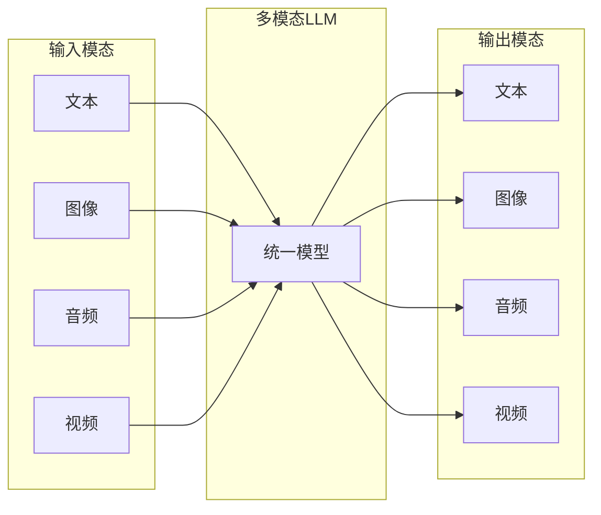
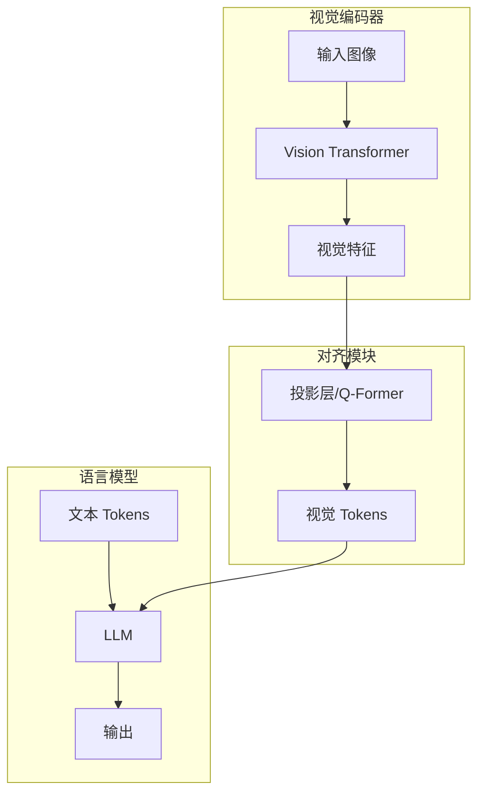

# 多模态大模型：超越文本

大语言模型正在从纯文本走向多模态，能够理解和生成图像、音频、视频等多种模态。本文将介绍多模态 LLM 的架构设计、训练方法和代表性模型。

## 什么是多模态 LLM？

### 模态类型

### 能力演进

| 阶段 | 能力 | 代表模型 |
|------|------|----------|
| Vision-Language | 图像理解 + 文本 | CLIP, BLIP |
| Visual LLM | 图像对话 | LLaVA, GPT-4V |
| Any-to-Any | 任意模态输入输出 | Gemini, GPT-4o |

## 视觉-语言模型架构

### 基本架构

### 核心组件

#### 1. 视觉编码器

视觉编码器负责将图像转换为机器可以理解的数值表示。它就像模型的"眼睛"，能够识别图像中的物体、场景和关系。

**工作原理**：
- 将图像分割成多个小块（patches）
- 使用 Transformer 架构处理每个图像块
- 输出包含图像语义信息的特征向量

**常用视觉编码器**：
- **CLIP ViT** (OpenAI)：基于对比学习的视觉编码器，与文本具有良好的对齐性
- **SigLIP** (Google)：改进的 CLIP 版本，训练效率更高
- **EVA-CLIP** (BAAI)：中文视觉理解效果更好的编码器
- **DINOv2** (Meta)：自监督学习的视觉编码器

#### 2. 投影/对齐模块

投影模块是连接视觉编码器和语言模型的桥梁，将视觉特征转换为语言模型能够理解的格式。

**简单投影方式**：
使用多层感知机（MLP）将视觉特征维度映射到语言模型的嵌入空间。这种方式计算开销小，适合快速部署。

**高级对齐方法**：
**Q-Former** 是 BLIP-2 提出的创新性对齐模块，使用可学习的查询 tokens 通过交叉注意力机制从视觉特征中提取最相关的信息。这种方法能够更高效地压缩视觉信息。

#### 3. 语言模型骨干

语言模型负责处理文本信息和视觉信息，生成最终的输出。它可以是任何预训练的大语言模型，如 LLaMA、Vicuna 等。

**多模态融合流程**：
1. 文本转换为词嵌入（embeddings）
2. 视觉特征投影为视觉 tokens
3. 在特定位置（如图像标记处）插入视觉 tokens
4. 统一送入语言模型处理
5. 生成包含视觉理解能力的输出

## 主流多模态模型

### LLaVA：简单高效的视觉指令调优

**架构特点**：
- 视觉编码器：CLIP ViT-L/14
- 投影方式：简单的 MLP 投影层
- 语言模型：Vicuna 或 LLaMA

**核心优势**：
- 架构简单，易于理解和实现
- 训练成本低，适合学术研究和小团队
- 开源生态完善，社区活跃

**2025年进展**：
- 支持 4-bit 量化，GPU 内存使用减少 75%
- 边缘设备部署优化，支持 10B+ 请求量
- LLaVA-OneVision-1.5 发布完整训练流程

### BLIP-2：高效的视觉-语言桥接

**架构创新**：
- 引入 Q-Former 作为视觉编码器和 LLM 之间的桥梁
- 采用两阶段训练策略，逐步学习视觉-语言对齐

**训练策略**：
1. **阶段1**：视觉-语言表示学习，Q-Former 学习提取与文本相关的视觉特征
2. **阶段2**：视觉到语言生成学习，连接 Q-Former 输出与 LLM

**优势**：
- 保持预训练视觉编码器和 LLM 的知识
- 学习效率高，参数量相对较小
- 适用于视频理解等长序列任务

### GPT-4V / GPT-4o：商业多模态的标杆

**核心能力**：
- 复杂图像理解和推理
- 多图对比分析
- OCR 文档识别和表格理解
- 图表分析和数据提取

**技术特点**：
- 端到端多模态训练，而非简单的模态拼接
- GPT-4o 实现原生多模态，降低延迟
- 强大的零样本泛化能力

**2025年预期发展**：
- 更强的实时视频处理能力
- 专业的医疗成像和科学图表理解
- 开放式多模态智能体能力

### Gemini：谷歌的原生多模态架构

**架构突破**：
- 统一的多模态 tokenizer，从一开始就为多模态设计
- 支持文本、图像、音频、视频的无缝融合
- 超长上下文支持（最高 100 万 tokens）

**Gemini 1.5 的特点**：
- 原生多模态设计，而非事后添加
- 强大的长视频理解能力
- 跨模态推理和知识迁移

**2025年展望**：
- Gemini 2.0 可能支持 3D 模态理解
- 实时协作 AI 助手
- 端设备部署优化

### Claude 3：注重安全的视觉理解

**核心优势**：
- 精确的图像描述和分析
- 复杂的逻辑推理能力
- 强大的图表和数据解读
- 注重输出安全和可控性

**应用场景**：
- 科研文献分析
- 法律文档处理
- 医疗影像辅助诊断
- 教育内容创作

## 训练策略

### 两阶段训练范式

#### 阶段1：预训练对齐

**目标**：学习视觉特征和语言表示之间的对应关系

**数据**：大规模图像-文本对（如 LAION-5B 数据集）

**训练方式**：
- 冻结视觉编码器和 LLM，仅训练投影层
- 使用图像描述生成任务作为学习目标
- 学习将图像内容映射到语义空间

**重要性**：这是模型理解图像内容的基础，决定了多模态能力的上限

#### 阶段2：指令微调

**目标**：学习遵循人类的视觉指令和进行对话

**数据**：高质量的视觉问答和对话数据

**训练方式**：
- 可选择性解冻部分 LLM 层
- 使用 LoRA 等参数高效微调技术
- 对话格式的多轮交互训练

**作用**：让模型学会如何与用户进行有效的视觉对话

### 训练数据类型

| 数据类型 | 示例 | 主要作用 |
|----------|------|----------|
| 图像描述 | Image-Caption 对 | 建立基础视觉-语言对齐 |
| 视觉问答 | VQA、GQA 数据集 | 培养理解能力和推理能力 |
| 视觉推理 | A-OKVQA、COCO-R | 提升复杂推理能力 |
| OCR 数据 | 文档、表格、截图 | 增强文字识别能力 |
| 对话数据 | ShareGPT4V、LLaVA-Instruct | 学习对话交互能力 |

### 2025年数据趋势

**数据质量提升**：
- 更注重数据的准确性和多样性
- 减少有偏见和有害内容的训练数据
- 增加专业领域数据（医疗、法律、科研）

**数据效率改进**：
- 小样本学习技术应用
- 合成数据生成技术
- 课程学习策略优化

## 图像分辨率处理技术

### 固定分辨率方法

传统的固定分辨率方法将所有图像调整到统一大小（如 224×224）。这种方法简单但存在明显缺陷：高分辨率图像的细节信息大量丢失，影响模型对细粒度内容的理解。

### 动态分辨率技术

#### 图像切片技术

将大图像分割成多个小块，每个块独立编码后拼接。这种方法保留了图像细节，但增加了计算复杂度和 token 数量。

**优化策略**：
- 智能选择最重要的图像区域
- 自适应调整切片数量
- 添加全局缩略图提供整体上下文

#### AnyRes 技术（LLaVA 1.5+）

智能自适应分辨率技术：
1. 根据图像大小和内容复杂度选择最优网格布局（如 2×2、1×2、2×1）
2. 将图像按网格划分并独立编码
3. 加入全局视图提供整体信息
4. 合并局部和全局特征

**优势**：在保持细节的同时控制计算开销，是目前最实用的解决方案

## 2025年新兴模态

### 视频理解进展

**时空建模突破**：
- 更高效的长期时序依赖建模
- 细粒度动作识别和意图理解
- 实时视频流处理能力

**技术趋势**：
- 均匀帧采样 + 时序注意力机制
- 视频帧的压缩和高效编码
- 多模态时序对齐技术

### 3D视觉理解

**技术突破**：
- 神经辐射场（NeRF）技术的实时化
- 3D 场景的自动重建和理解
- 物体 3D 形状和功能的识别

**应用前景**：
- AR/VR 交互体验
- 机器人导航和操作
- 工业设计和制造

### 音频多模态融合

**空间音频处理**：
- 多声源分离和定位
- 音频场景理解
- 音频-视觉对应学习

**语音交互增强**：
- 更自然的语音对话
- 情感和语调理解
- 多语言语音支持

## 生成多模态内容

### 文生图集成架构

将语言理解能力与图像生成能力结合：
- LLM 理解用户意图和上下文
- 生成详细的图像描述提示词
- 调用专门的文生图模型生成图像

**优势**：结合 LLM 的理解能力和生成模型的创造能力

### 离散图像token技术

2025年的重要趋势是直接生成图像 token：
- 将图像量化为离散的 token 序列
- LLM 可以像生成文本一样生成图像 token
- 实现统一的文本-图像生成框架

**代表性工作**：SEED、Emu 等模型的探索

## 评估基准和性能

### 主要评估基准

| 基准 | 评估能力 | 2025年现状 |
|------|----------|------------|
| VQAv2 | 基础视觉问答 | 接近人类水平 |
| GQA | 组合推理 | 显著提升 |
| TextVQA | 图中文字理解 | OCR能力增强 |
| DocVQA | 文档理解 | 专业领域突破 |
| MMMU | 多学科多模态 | 跨领域知识整合 |
| MMBench | 综合能力 | 全面评估体系 |

### 性能对比（2025年）

**闭源模型领先**：
- GPT-4V、Gemini 在综合能力上仍保持领先
- 强大的零样本能力和推理深度

**开源模型追赶**：
- LLaVA 达到 GPT-4V 92% 的性能，成本仅为 1%
- BLIP-2 在检索和对齐任务上表现优异
- 社区驱动的快速迭代

## 实战应用指南

### 多模态对话系统

**基础对话**：单图理解和问答
- 提供清晰的图像和具体的问题
- 利用模型的分析能力获取详细信息

**多图推理**：图像对比和分析
- 上传多张相关图片
- 要求模型进行比较、总结和推理

### 专业领域应用

**文档分析**：
- 合同、报告的自动解读
- 表格数据的提取和分析
- 图表信息的文字描述

**教育场景**：
- 习题图片的解题过程
- 实验图像的分析说明
- 历史图片的背景介绍

## 挑战与限制

### 技术挑战

**幻觉问题**：模型可能生成与图像不符的内容
- 特别是在 OCR 和细节描述上
- 需要事实核查和验证机制

**分辨率敏感**：低分辨率图像理解能力下降
- 细节丢失导致误判
- 需要超分辨率预处理

**计算成本**：高分辨率处理计算开销大
- 边缘设备部署困难
- 需要模型压缩和优化技术

### 安全考虑

**隐私保护**：避免处理敏感和个人图像
- 实施严格的数据过滤
- 提供本地部署选项

**内容安全**：防止生成有害或不当内容
- 多层安全审核机制
- 价值观对齐训练

## 本章小结

多模态大模型正在重塑 AI 的交互方式，从纯文本走向全感官理解：

- **架构演进**：从简单的模态拼接到原生多模态设计
- **训练策略**：两阶段训练成为标准范式
- **技术突破**：动态分辨率、长视频理解、3D视觉
- **应用扩展**：从对话助手到专业领域工具
- **开源生态**：LLaVA 等模型大幅降低使用门槛

2025年，我们正在见证多模态 AI 从实验室走向大规模应用，为教育、医疗、创作等领域带来革命性变化。

## 延伸阅读

- Visual Instruction Tuning (LLaVA 原始论文)
- BLIP-2: Bootstrapping Language-Image Pre-training
- Gemini: A Family of Highly Capable Multimodal Models
- CLIP: Learning Transferable Visual Representations

---

*下一篇：[语义路由：智能请求分发](./24-semantic-routing.md)*
