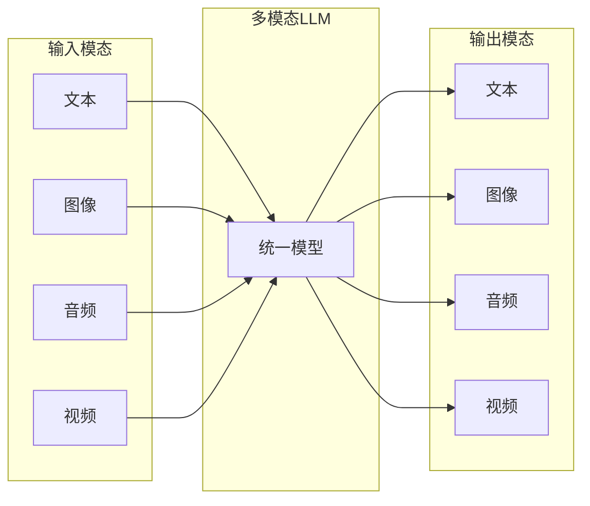
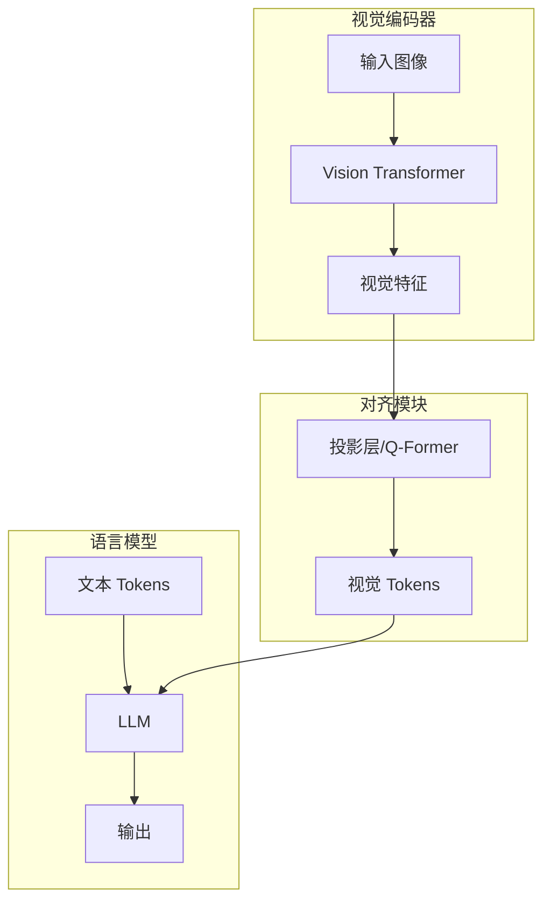
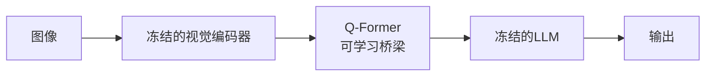
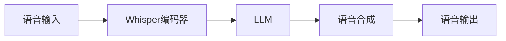
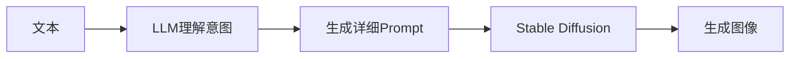

# 多模态大模型：超越文本

大语言模型正在从纯文本走向多模态，能够理解和生成图像、音频、视频等多种模态。本文将介绍多模态 LLM 的架构设计、训练方法和代表性模型。

## 什么是多模态 LLM？

### 模态类型



### 能力演进

| 阶段 | 能力 | 代表模型 |
|------|------|----------|
| Vision-Language | 图像理解 + 文本 | CLIP, BLIP |
| Visual LLM | 图像对话 | LLaVA, GPT-4V |
| Any-to-Any | 任意模态输入输出 | Gemini, GPT-4o |

## 视觉-语言模型架构

### 基本架构



### 核心组件

**1. 视觉编码器**

将图像编码为特征向量：

```python
class VisionEncoder(nn.Module):
    def __init__(self, model_name="openai/clip-vit-large-patch14"):
        super().__init__()
        self.vision_model = CLIPVisionModel.from_pretrained(model_name)
    
    def forward(self, images):
        # images: (batch, 3, H, W)
        outputs = self.vision_model(images)
        # 使用最后一层的特征
        visual_features = outputs.last_hidden_state  # (batch, num_patches, hidden_dim)
        return visual_features
```

**常用视觉编码器**：
- CLIP ViT (OpenAI)
- SigLIP (Google)
- EVA-CLIP (BAAI)
- DINOv2 (Meta)

**2. 投影/对齐模块**

将视觉特征对齐到语言模型的嵌入空间：

```python
class VisionProjector(nn.Module):
    def __init__(self, vision_dim, llm_dim):
        super().__init__()
        # 简单的 MLP 投影
        self.proj = nn.Sequential(
            nn.Linear(vision_dim, llm_dim),
            nn.GELU(),
            nn.Linear(llm_dim, llm_dim)
        )
    
    def forward(self, visual_features):
        return self.proj(visual_features)
```

**高级对齐方法**：

```python
class QFormer(nn.Module):
    """BLIP-2 的 Q-Former"""
    def __init__(self, num_query_tokens, vision_dim, llm_dim):
        super().__init__()
        # 可学习的 query tokens
        self.query_tokens = nn.Parameter(torch.randn(num_query_tokens, llm_dim))
        # Cross-attention 层
        self.cross_attention = nn.MultiheadAttention(llm_dim, num_heads=8)
    
    def forward(self, visual_features):
        # Query tokens 与视觉特征交互
        # visual_features: (batch, num_patches, vision_dim)
        queries = self.query_tokens.expand(visual_features.shape[0], -1, -1)
        output, _ = self.cross_attention(queries, visual_features, visual_features)
        return output  # (batch, num_query_tokens, llm_dim)
```

**3. 语言模型骨干**

```python
class MultimodalLLM(nn.Module):
    def __init__(self, vision_encoder, projector, llm):
        super().__init__()
        self.vision_encoder = vision_encoder
        self.projector = projector
        self.llm = llm
    
    def forward(self, images, input_ids, attention_mask):
        # 1. 编码图像
        visual_features = self.vision_encoder(images)
        
        # 2. 投影到语言空间
        visual_tokens = self.projector(visual_features)
        
        # 3. 获取文本嵌入
        text_embeds = self.llm.get_input_embeddings()(input_ids)
        
        # 4. 拼接视觉和文本 tokens
        # 在特定位置插入视觉 tokens（如 <image> 标记处）
        combined_embeds = self.merge_visual_text(visual_tokens, text_embeds)
        
        # 5. 送入 LLM
        outputs = self.llm(inputs_embeds=combined_embeds)
        
        return outputs
```

## 主流多模态模型

### LLaVA

**架构特点**：简单高效的视觉指令调优

```
视觉编码器: CLIP ViT-L/14
投影方式: 线性投影 / MLP
语言模型: Vicuna / LLaMA
```

```python
# LLaVA 风格的简单架构
class LLaVA(nn.Module):
    def __init__(self):
        self.vision_tower = CLIPVisionModel(...)
        self.mm_projector = nn.Linear(vision_dim, llm_dim)
        self.llm = LlamaForCausalLM(...)
```

### BLIP-2

**架构特点**：Q-Former 作为桥梁



**训练策略**：
1. 阶段1：视觉-语言表示学习（Q-Former + 视觉编码器）
2. 阶段2：视觉到语言生成学习（Q-Former + LLM）

### GPT-4V / GPT-4o

**能力**：
- 复杂图像理解
- 多图推理
- OCR 和文档分析
- 图表理解

**特点**：
- 端到端多模态训练
- 原生多模态（GPT-4o）

### Gemini

**架构特点**：原生多模态设计

```
Gemini 1.5:
- 统一的多模态 tokenizer
- 支持文本、图像、音频、视频
- 超长上下文（1M tokens）
```

### Claude 3

**视觉能力**：
- 精确的图像描述
- 复杂推理
- 图表分析

## 训练策略

### 两阶段训练

**阶段1：预训练对齐**

```
目标: 学习视觉-语言对齐
数据: 大规模图像-文本对（如 LAION）
冻结: 视觉编码器 + LLM
训练: 仅投影层

损失: 图像描述生成损失
```

**阶段2：指令微调**

```
目标: 学习遵循视觉指令
数据: 高质量视觉问答数据
冻结: 视觉编码器（可选）
训练: 投影层 + LLM（可选 LoRA）

损失: 对话生成损失
```

### 训练数据类型

| 数据类型 | 示例 | 用途 |
|----------|------|------|
| 图像描述 | Image-Caption 对 | 基础对齐 |
| 视觉问答 | VQA 数据集 | 理解能力 |
| 视觉推理 | A-OKVQA | 推理能力 |
| OCR 数据 | 文档、表格 | 文字识别 |
| 对话数据 | ShareGPT4V | 对话能力 |

### 数据构造

```python
# 视觉指令数据格式
{
    "image": "path/to/image.jpg",
    "conversations": [
        {
            "role": "user",
            "content": "<image>\n描述这张图片中的内容"
        },
        {
            "role": "assistant",
            "content": "这张图片展示了一只橙色的猫躺在沙发上..."
        }
    ]
}
```

## 图像分辨率处理

### 固定分辨率

```python
# 将所有图像调整为固定大小
transform = transforms.Compose([
    transforms.Resize((224, 224)),
    transforms.ToTensor(),
    transforms.Normalize(mean, std)
])
```

**问题**：高分辨率图像细节丢失

### 动态分辨率

**方法1：图像切片**

```python
def slice_image(image, patch_size=224, max_patches=9):
    """将大图切成多个 patch"""
    h, w = image.shape[-2:]
    patches = []
    
    for i in range(0, h, patch_size):
        for j in range(0, w, patch_size):
            patch = image[:, i:i+patch_size, j:j+patch_size]
            patches.append(patch)
    
    # 添加全局缩略图
    thumbnail = F.interpolate(image, size=(patch_size, patch_size))
    patches.append(thumbnail)
    
    return patches[:max_patches]
```

**方法2：AnyRes（LLaVA 1.5+）**

```
1. 选择最优网格（2x2, 1x2, 2x1 等）
2. 将图像划分到网格
3. 每个网格独立编码
4. 加入全局视图
```

## 视频理解

### 视频编码方法

**方法1：均匀采样帧**

```python
def sample_frames(video_path, num_frames=8):
    """均匀采样视频帧"""
    cap = cv2.VideoCapture(video_path)
    total_frames = int(cap.get(cv2.CAP_PROP_FRAME_COUNT))
    
    indices = np.linspace(0, total_frames-1, num_frames, dtype=int)
    frames = []
    
    for idx in indices:
        cap.set(cv2.CAP_PROP_POS_FRAMES, idx)
        ret, frame = cap.read()
        if ret:
            frames.append(frame)
    
    return frames
```

**方法2：时序建模**

```python
class VideoEncoder(nn.Module):
    def __init__(self, frame_encoder, temporal_encoder):
        super().__init__()
        self.frame_encoder = frame_encoder  # 图像编码器
        self.temporal_encoder = temporal_encoder  # 时序建模
    
    def forward(self, video_frames):
        # video_frames: (batch, num_frames, 3, H, W)
        batch, T = video_frames.shape[:2]
        
        # 编码每帧
        frames_flat = video_frames.view(-1, *video_frames.shape[2:])
        frame_features = self.frame_encoder(frames_flat)
        frame_features = frame_features.view(batch, T, -1)
        
        # 时序建模
        video_features = self.temporal_encoder(frame_features)
        
        return video_features
```

## 音频理解

### 音频编码

```python
class AudioEncoder(nn.Module):
    def __init__(self):
        super().__init__()
        self.whisper = WhisperModel.from_pretrained("openai/whisper-large-v3")
    
    def forward(self, audio):
        # audio: 音频波形或梅尔频谱
        features = self.whisper.encoder(audio)
        return features
```

### 语音对话



## 生成多模态内容

### 文生图集成

将 LLM 与扩散模型结合：



### SEED / Emu

直接生成图像 token：

```python
class ImageTokenizer(nn.Module):
    """将图像转为离散 token"""
    def __init__(self, codebook_size=8192):
        super().__init__()
        self.encoder = VisionEncoder()
        self.codebook = nn.Embedding(codebook_size, hidden_dim)
    
    def encode(self, image):
        features = self.encoder(image)
        # 量化到最近的 codebook entry
        distances = torch.cdist(features, self.codebook.weight)
        indices = distances.argmin(dim=-1)
        return indices
    
    def decode(self, indices):
        tokens = self.codebook(indices)
        image = self.decoder(tokens)
        return image
```

## 实战：使用多模态模型

### LLaVA 推理

```python
from transformers import LlavaNextProcessor, LlavaNextForConditionalGeneration
from PIL import Image

# 加载模型
processor = LlavaNextProcessor.from_pretrained("llava-hf/llava-v1.6-mistral-7b-hf")
model = LlavaNextForConditionalGeneration.from_pretrained(
    "llava-hf/llava-v1.6-mistral-7b-hf",
    torch_dtype=torch.float16,
    device_map="auto"
)

# 准备输入
image = Image.open("example.jpg")
prompt = "[INST] <image>\n描述这张图片 [/INST]"

inputs = processor(prompt, image, return_tensors="pt").to("cuda")

# 生成
output = model.generate(**inputs, max_new_tokens=200)
print(processor.decode(output[0], skip_special_tokens=True))
```

### 多图对话

```python
# 多图输入
images = [Image.open(f"img_{i}.jpg") for i in range(3)]
prompt = "[INST] <image><image><image>\n比较这三张图片的异同 [/INST]"

inputs = processor(prompt, images, return_tensors="pt").to("cuda")
output = model.generate(**inputs, max_new_tokens=500)
```

## 评估基准

| 基准 | 评估能力 |
|------|----------|
| VQAv2 | 视觉问答 |
| GQA | 组合推理 |
| TextVQA | 图中文字理解 |
| DocVQA | 文档理解 |
| MMMU | 多学科多模态 |
| MMBench | 综合能力 |

## 本章小结

- 多模态 LLM 通过视觉编码器 + 投影层 + LLM 实现图文理解
- 两阶段训练：预训练对齐 + 指令微调
- 高分辨率图像需要特殊处理（切片、AnyRes）
- 视频和音频可以复用类似架构
- GPT-4V、Gemini、Claude 3 代表了最先进水平

## 延伸阅读

- Visual Instruction Tuning (LLaVA)
- BLIP-2: Bootstrapping Language-Image Pre-training
- Gemini: A Family of Highly Capable Multimodal Models

---

*下一篇：[语义路由系统：智能请求分发](./24-semantic-routing.md)*
