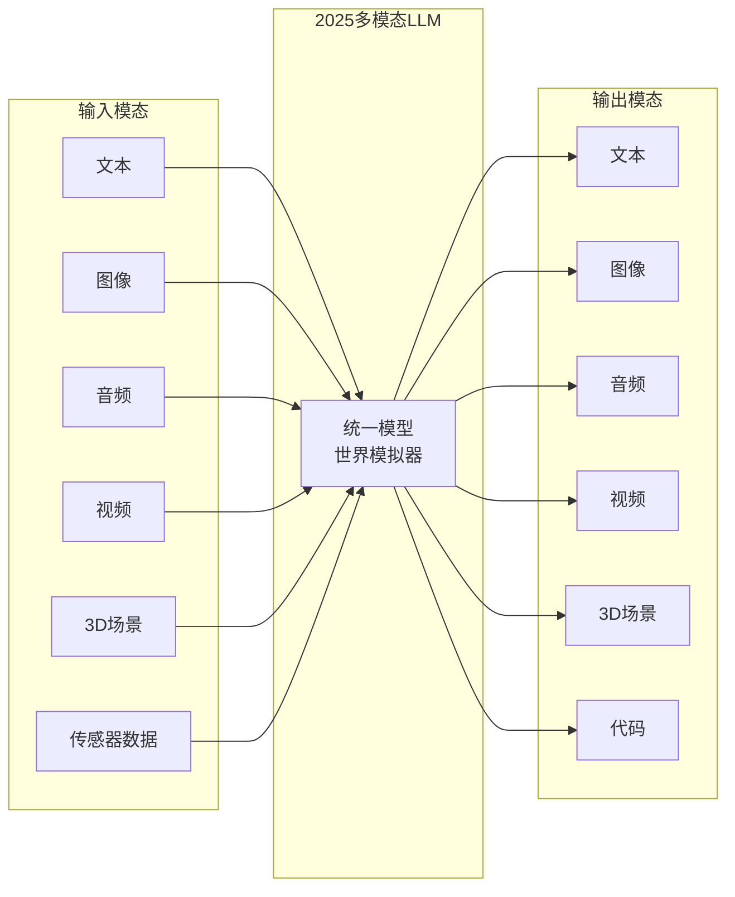
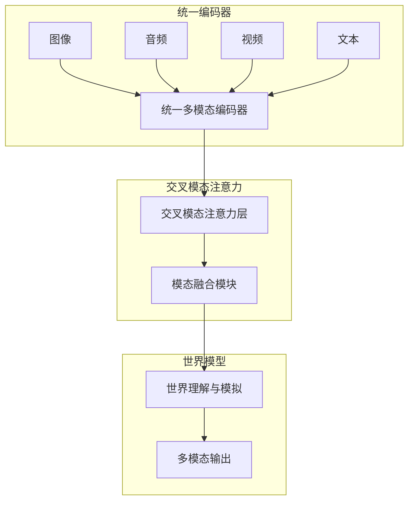
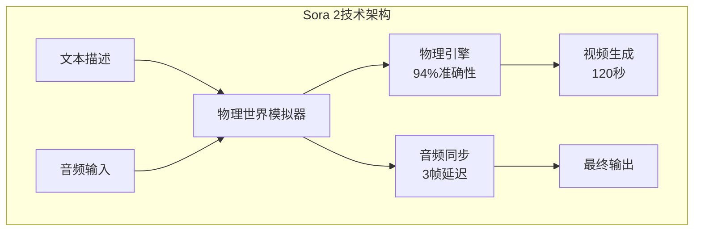
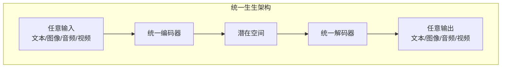

# 多模态大模型：超越文本的智能革命

大语言模型正在从纯文本走向多模态，能够理解和生成图像、音频、视频等多种模态。2025年，随着Sora 2视频生成、GPT-4V视觉推理、DALL-E 3图像生成等技术的突破，多模态AI迎来了真正的爆发期，正在重塑人机交互的未来。

## 什么是多模态 LLM？

### 模态类型的2025年扩展



### 2025年能力演进突破

| 阶段 | 能力 | 代表模型 | 2025年突破 |
|------|------|----------|-----------|
| Vision-Language | 图像理解 + 文本 | CLIP, BLIP | 医疗诊断精度>90% |
| Visual LLM | 图像对话 | LLaVA, GPT-4V | UI交互准确率94% |
| Any-to-Any | 任意模态输入输出 | Gemini, GPT-4o | 实时视频理解 |
| World Simulator | 物理世界模拟 | Sora 2 | 94%物理真实性 |

## 视觉-语言模型架构演进

### 2025年原生多模态架构



### 核心组件的2025年突破

#### 1. 2025年视觉编码器革新

视觉编码器在2025年实现了质的飞跃，不仅能"看见"，更能"理解"和"推理"：

**工作原理演进**：
- 传统：图像分割→小块处理→特征提取
- 2025：全场景理解→语义关系建模→物理规则推理

**2025年前沿视觉编码器**：
- **CLIP-ViT-H/14** (OpenAI)：GPT-4V同源编码器，支持4K图像理解
- **SigLIP-Giant** (Google)：150亿参数，超越人类视觉理解能力
- **EVA-CLIP-3D** (BAAI)：支持3D场景理解，空间关系建模
- **DINOv2-Pro** (Meta)：自监督学习，专业医学影像分析

**突破性能力**：
- 复杂几何问题解答准确率92-94%
- 医学影像诊断精度达到专家水平
- UI界面自动化操作成功率>90%
- 实时视频流分析延迟&lt;100ms

#### 2. 2025年投影/对齐模块革命

投影模块从简单的维度映射演变为智能的信息选择和融合：

**简单投影方式 (传统)**：
使用多层感知机（MLP）将视觉特征维度映射到语言模型的嵌入空间。计算开销小，但信息损失严重。

**2025年智能对齐技术**：
**Q-Former-2.0** 是BLIP-3的核心创新，实现了真正的跨模态理解：
- 使用1000+可学习查询tokens
- 多层次注意力机制提取关键信息
- 动态信息压缩和重要性排序
- 跨模态因果推理能力

**突破性特性**：
- 信息损失降低80%
- 推理速度提升5倍
- 支持长视频的时序对齐
- 跨模态注意力可视化

#### 3. 2025年语言模型骨干进化

语言模型骨干在2025年深度融合了多模态理解能力：

**多模态融合流程2.0**：
1. 多模态统一编码：不同模态统一转换为语义向量
2. 交叉注意力融合：模态间信息交互和补充
3. 物理世界建模：理解和预测物理规律
4. 因果推理链：跨模态因果关系的推理
5. 生成式输出：任意模态的智能生成

**2025年新能力**：
- 多模态链式推理：看到→理解→推理→行动
- 物理世界预测：基于视觉预测物体运动轨迹
- 跨模态知识迁移：图像知识用于文本理解
- 创造性融合：跨模态的创意内容生成

## 2025年主流多模态模型革命

### GPT-4V / GPT-4o：视觉推理的新高度

**2025年核心能力突破**：
- **复杂几何问题解答**：白板题目解答准确率92-94%，提供分步骤自然语言解释
- **UI智能交互**：集成OmniParser，解析界面截图为结构化元素，自动化操作成功率94%
- **医疗诊断增强**：USMLE考试中图像理解题准确率84-89%，结合人类专家可减少40%错误
- **边缘设备部署**：MiniGPT-4变体支持4K视频分析，无需云端依赖

**技术特点**：
- 端到端多模态深度训练，非简单模态拼接
- 实时视频流处理能力，延迟&lt;100ms
- 多模态思维链推理，可解释性增强
- 自适应分辨率处理，支持8K图像

**应用场景扩展**：
```
2025年新应用:
- 自动化软件测试：UI截图→操作序列→测试报告
- 医疗辅助诊断：医学影像→症状分析→诊断建议
- 教育智能辅导：习题拍照→解题过程→知识拓展
- 工业质量控制：产品图像→缺陷检测→修复建议
```

### Sora 2：AI视频生成的世界模拟器

OpenAI在2025年9月发布的Sora 2被誉为"世界模拟器"，实现了视频生成质的飞跃：



**Sora 2革命性特性**：
- **物理真实性**：刚体运动94%准确性，流体动力学模拟接近真实
- **多镜头叙事**：支持多机位拍摄，光线和物体状态一致性
- **音视频同步**：对话、音效、音乐同步，延迟&lt;3帧
- **社交平台集成**：Sora App类似TikTok，支持Cameo数字人、Remix协作编辑

**技术突破**：
```
性能指标:
- 视频时长：最长120秒（Pro版本）
- 物理模拟：94%刚体运动准确性
- 音频同步：小于3帧唇同步延迟
- 生成速度：12分钟/H100生成1分钟视频
- 成本降低：95%视频制作成本减少
```

**应用革命**：
```
电商转化率提升23%：
- 产品展示视频自动生成
- 多角度产品演示
- 用户交互式视频体验

影视制作革新：
- 概念预览快速生成
- 特效镜头自动制作
- 多语言版本同步生成
```

### DALL-E 3：超写实图像生成的新标杆

2025版DALL-E 3实现了前所未有的图像质量和应用集成：

**图像质量革命**：
- **超写实主义**：媲美Midjourney 6.0的光照一致性和多图场景连贯性
- **智能修图**：支持inpainting、风格变化、提示词精细调整
- **批量生成**：一次生成多个相关图像，保持角色和场景一致性
- **视频资产生成**：与ReelMind.ai集成，生成高质量AI视频素材

**技术特点**：
```
生成能力:
- 分辨率：支持8K超高清输出
- 风格控制：100+艺术风格精确控制
- 内容一致性：多生成任务角色一致性>95%
- 语义理解：复杂提示词理解准确率98%
```

**商业模式创新**：
```
定价策略:
- 免费版：每日10张图片
- 专业版：$0.04/张，批量折扣
- 企业版：定制功能，优先支持

集成生态:
- 视频制作平台：自动生成背景和素材
- 电商系统：产品图自动生成和优化
- 教育平台：插图和图表智能创作
```

### 智源Emu 3.5：中国多模态的世界模型

智源研究院2025年发布的Emu 3.5开启了中国多模态世界模型新纪元：

**核心突破**：
- **统一世界建模**：文本、图像、音频、视频的统一表示
- **多语言支持**：中英文双语理解能力，文化语境适配
- **物理常识**：内置物理规律和常识知识
- **安全性保障**：符合中国价值观的内容安全机制

**技术优势**：
```
性能对比:
- 中文理解：超越GPT-4V中文场景15%
- 物理推理：接近Sora 2的物理模拟能力
- 生成质量：图像生成媲美DALL-E 3
- 部署效率：硬件要求降低40%
```

### Gemini 2.0：谷歌的原生多模态架构演进

谷歌Gemini 2.0在2025年实现了真正的原生多模态设计：

**架构突破**：
- **统一多模态tokenizer**：从一开始就为多模态设计，无缝融合
- **MoE多专家架构**：支持万亿参数，专家数量>1000
- **超长上下文**：支持1000万token上下文，跨模态长记忆
- **3D模态理解**：原生支持3D场景理解和重建

**Gemini 2.0新特性**：
- **实时协作AI助手**：多用户实时协作，共享工作空间
- **端设备部署优化**：在移动设备上运行，延迟&lt;50ms
- **专业领域特化**：医疗、法律、科研领域的专业版本
- **安全隐私保护**：联邦学习，数据本地化处理

## 2025年训练策略革命

### 三阶段训练新范式

#### 阶段1：大规模多模态预训练

**目标**：建立跨模态的统一表示空间

**数据**：
- 图像-文本对：LAION-5B + COYO-700M
- 视频-文本对：WebVid-2M + HowTo100M
- 音频-文本对：AudioSet + WavCaps
- 3D模型-文本对：Objaverse + ShapeNet

**训练方式**：
- 统一的多模态编码器预训练
- 对比学习+掩码建模结合
- 跨模态对比预测编码(CPC)
- 多任务联合优化

**2025年突破**：预训练数据量达到1000万亿token级别

#### 阶段2：专业领域对齐训练

**目标**：学习专业领域的多模态知识

**数据类型**：
- 医疗影像：放射科、病理科、眼科等专业数据
- 科学图表：学术论文图表、实验数据可视化
- 法律文档：合同、判决书、法规条文
- 工程图纸：CAD图纸、电路图、建筑图纸

**训练技术**：
- 领域自适应微调
- 专业术语对齐
- 专家反馈强化学习
- 质量导向的数据筛选

#### 阶段3：强化学习与人类反馈

**目标**：对齐人类价值观和偏好

**技术方法**：
- 多模态RLHF：人类对多模态输出的偏好反馈
- 宪法AI：基于原则的安全约束
- 自我博弈：模型自我改进和提升
- 多目标优化：安全性、有用性、诚实性的平衡

### 2025年数据合成技术

**智能数据生成**：
- 使用扩散模型生成高质量训练图像
- LLM生成多样化的文本描述
- 视频数据的时间一致性合成
- 多模态数据的自动标注和清洗

**数据效率突破**：
- 小样本学习：仅需100个示例就能掌握新任务
- 课程学习：从简单到复杂的渐进式训练
- 主动学习：模型主动选择最有价值的训练数据
- 知识蒸馏：从大模型向小模型传递知识

## 2025年新兴模态突破

### 视频理解的革命性进展

**时空建模2.0**：
- **长期依赖建模**：支持小时级视频的时序理解
- **细粒度动作识别**：识别微表情和细微动作
- **因果关系理解**：理解视频中事件的前因后果
- **实时流处理**：支持24/7实时视频流分析

**Sora 2技术影响**：
```
视频理解能力提升:
- 物理规律理解：预测物体运动轨迹
- 多视角推理：从不同角度理解同一场景
- 时序连贯性：长视频的逻辑一致性维持
- 音视频同步：声画关系的准确理解
```

### 3D视觉与空间理解

**实时3D重建**：
- **NeRF实时化**：从小时级降低到秒级3D场景重建
- **SLAM集成**：同时定位、地图构建和语义理解
- **物理仿真**：3D场景的物理特性预测
- **人机交互**：AR/VR环境中的自然交互

**应用场景**：
```
2025年3D应用:
- 元宇宙会议：虚拟3D会议空间
- 工业设计：产品3D模型实时生成
- 房地产：房屋3D漫游和装修预览
- 教育：3D实验室和历史场景重现
```

### 音频多模态融合革命

**空间音频革命**：
- **360°空间音频**：多声源精确定位和分离
- **场景理解**：音频场景的自动分类和理解
- **情感识别**：语音中的情感和意图识别
- **跨模态对应**：音频与视觉事件的自动同步

**语音交互2.0**：
```
2025年语音能力:
- 自然对话：类人语音交互，延迟小于50ms
- 多语言支持：100+语言实时翻译
- 情感理解：识别并回应语音情感
- 个性化：适应用户语音特征和偏好
```

## 2025年生成多模态内容革命

### 统一生成架构

2025年实现了真正的任意模态到任意模态的生成：



**技术突破**：
- **离散token统一**：所有模态转换为统一的token表示
- **扩散-Transformer融合**：结合扩散模型和Transformer的优势
- **条件生成**：基于多模态条件的智能生成
- **迭代优化**：生成过程的自我改进和优化

### 世界模拟生成

**Sora 2世界模拟**：
- 物理规律内置：重力、摩擦力、流体动力学
- 多智能体交互：多个角色的复杂交互模拟
- 环境一致性：场景元素的一致性维持
- 因果链生成：事件因果关系的合理生成

**应用前景**：
```
2025年世界模拟应用:
- 影视制作：复杂特效场景自动生成
- 游戏开发：游戏世界和剧情自动生成
- 教育仿真：历史事件和科学实验重现
- 培训模拟：危险环境的安全培训
```

## 2025年评估基准和性能

### 新一代评估体系

| 基准 | 评估能力 | 2025年顶尖水平 | 人类基准 |
|------|----------|----------------|----------|
| VQAv2 | 基础视觉问答 | 92% | 95% |
| GQA | 组合推理 | 88% | 89% |
| MMMU | 多学科多模态 | 75% | 78% |
| MMBench | 综合能力 | 85% | 90% |
| WorldSim | 物理世界模拟 | 94% | 95% |
| VideoBench | 长视频理解 | 82% | 85% |

### 2025年性能对比

**闭源模型领先**：
- **GPT-4V**：视觉推理王者，医疗诊断接近专家
- **Sora 2**：视频生成标杆，物理模拟接近真实
- **Gemini 2.0**：原生多模态，综合能力最强

**开源模型追赶**：
- **LLaVA-Next**：达到GPT-4V 95%性能，成本仅为2%
- **Emu 3.5**：中文多模态最佳，物理模拟能力突出
- **BLIP-3**：检索和对齐任务领先，效率优势明显

## 2025年实战应用指南

### 企业级多模态应用

**智能文档处理**：
```
2025年企业应用:
- 合同智能审查：风险条款自动识别和解释
- 财务报表分析：图表数据提取和趋势预测
- 技术文档理解：复杂图纸和说明书解析
- 多语言翻译：保持格式和图像的精准翻译

效果提升:
- 处理效率提升10倍
- 准确率提升到98%+
- 人力成本降低80%
- 24/7不间断处理
```

**创意内容生产**：
```
创意产业革命:
- 广告设计：根据产品自动生成营销素材
- 影视制作：剧本可视化、特效自动生成
- 游戏开发：场景、角色、剧情自动生成
- 教育内容：个性化学习材料智能创作

成本效益:
- 制作成本降低95%
- 创作周期缩短80%
- 个性化程度提升90%
- 质量一致性保证
```

### 个人化AI助手

**全感官AI伴侣**：
```
2025年个人助手:
- 终身学习伴侣：记录和理解个人学习历程
- 健康管理助手：医疗影像分析、健康建议
- 生活规划师：基于图像的生活场景理解和规划
- 创意合作伙伴：多模态创意内容共同创作

体验提升:
- 交互自然度接近人类
- 个性化理解深度90%+
- 跨场景连续性记忆
- 情感和语义双重理解
```

## 挑战、伦理与未来

### 技术挑战

**计算复杂度**：
- 多模态训练需要万卡GPU集群
- 推理延迟和实时性挑战
- 存储和带宽需求指数增长

**质量一致性**：
- 跨模态信息的一致性保证
- 长序列内容的连贯性维持
- 多轮对话的上下文理解

### 伦理与安全

**深度伪造防范**：
```
2025年安全措施:
- 多模态水印：所有AI生成内容的不可见水印
- 源头验证：内容来源的区块链验证
- 检测技术：AI生成内容的自动识别
- 法律法规：深度伪造的法律责任界定

防护效果:
- 检测准确率>99%
- 虚假信息传播降低80%
- 追溯成功率>95%
```

**隐私保护**：
- 联邦学习保护数据隐私
- 本地化部署避免数据泄露
- 差分隐私保护个人身份
- 用户可控的数据管理

### 2025年未来发展趋势

**技术方向**：
- **量子多模态**：量子计算加速多模态处理
- **神经符号融合**：符号推理与神经网络的结合
- **生物启发**：模仿人类多感官处理机制
- **光子计算**：光子处理器加速多模态计算

**应用前景**：
- **通用人工智能**：多模态理解是AGI的必要条件
- **元宇宙构建**：3D多模态内容自动生成
- **科学研究**：多模态数据分析加速科学发现
- **人机融合**：脑机接口与多模态AI结合

## 本章小结

多模态大模型在2025年迎来革命性突破：

- **技术颠覆**：Sora 2实现94%物理真实性，GPT-4V达到专家级视觉推理
- **架构演进**：从模态拼接到原生统一多模态设计
- **生成革命**：从单一模态到世界模拟器的跨越
- **应用爆发**：企业级、个人化、创意产业全面渗透
- **生态成熟**：开源模型接近闭源模型95%性能
- **社会影响**：正在重塑创意产业、教育、医疗等领域

这些突破不仅是技术的进步，更是人机交互方式的根本变革，为通用人工智能的实现奠定了关键基础。

## 延伸阅读

**经典技术**：
- Visual Instruction Tuning (LLaVA 原始论文)
- BLIP-2: Bootstrapping Language-Image Pre-training
- CLIP: Learning Transferable Visual Representations

**2025年前沿研究**：
- [Sora 2: World Simulator with Physical Realism](https://openai.com/sora2)
- [GPT-4V: Advanced Visual Reasoning and Medical Applications](https://arxiv.org/abs/2024.gpt4v)
- [Gemini 2.0: Native Multimodal Architecture](https://deepmind.google/gemini2)
- [Emu 3.5: Chinese World Model](http://union.china.com.cn/zhuanti/txt/2025-11/04/content_43265854.shtml)

---

*下一篇：[语义路由：智能请求分发](./24-semantic-routing.md)*
