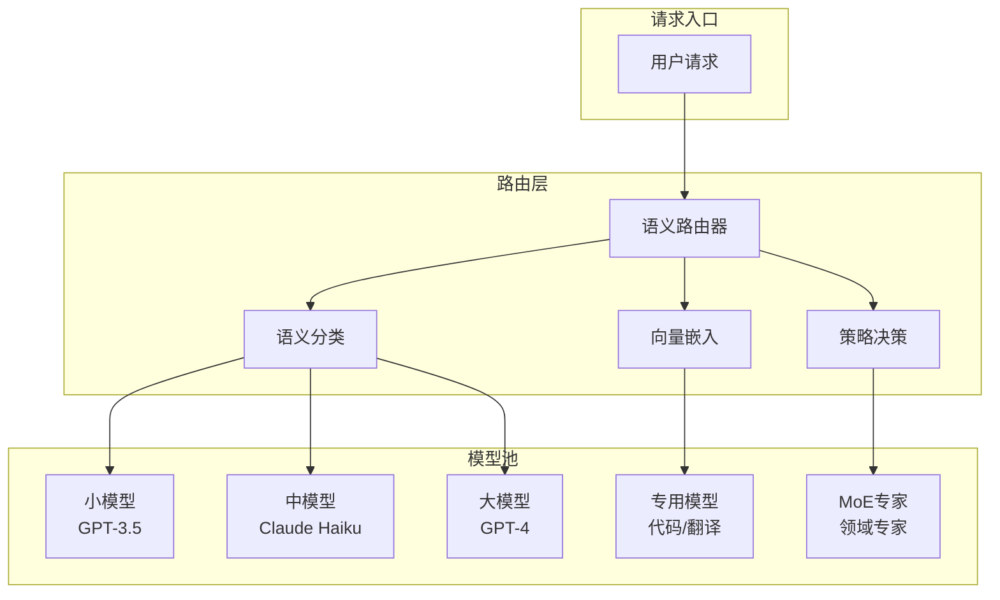
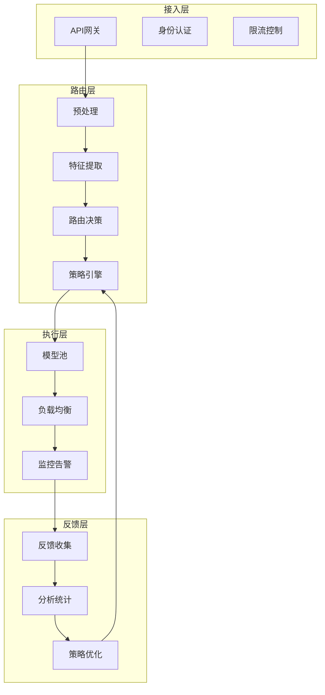

# 语义路由：智能请求分发

在实际的 LLM 应用中，不同类型的请求可能需要不同的处理方式：简单问题可以用小模型快速响应，复杂推理需要大模型。语义路由通过理解请求语义，智能地将请求分发到最合适的处理器。

## 为什么需要语义路由？

### 场景分析

用户请求具有多样性：
- "今天星期几？" → 简单事实，小模型即可
- "帮我写一篇关于量子计算的论文" → 复杂任务，需要强模型
- "翻译这段话成法语" → 特定任务，专用模型更好
- "分析这张图片" → 需要多模态模型

### 单一模型的问题

**方案1: 所有请求用大模型**
- 问题: 成本高，延迟大，简单问题杀鸡用牛刀

**方案2: 所有请求用小模型**
- 问题: 复杂任务质量差，用户体验不佳

**方案3: 智能路由**
- 根据请求语义选择最合适的模型 ✓
- 平衡成本、速度和质量

### 收益分析

假设请求分布:
- 60% 简单问题（小模型可处理）
- 30% 中等问题（中模型处理）
- 10% 复杂问题（大模型处理）

不使用路由（全用大模型）:
成本 = 100% × 大模型成本

使用语义路由:
成本 = 60% × 小模型 + 30% × 中模型 + 10% × 大模型
     ≈ 30-40% 原成本

**节省 60-70% 成本！**

## 语义路由架构

### 整体设计

### 核心组件

#### 1. 语义理解模块

将请求转换为语义表示。系统使用预训练的语义编码模型将文本转换为高维向量，这些向量能够捕捉文本的深层语义信息。

语义编码过程包括：
- 文本预处理和清洗
- 通过预训练模型生成嵌入向量
- 可选的降维或聚类处理
- 上下文感知的表示增强

#### 2. 路由决策模块

基于语义决定路由目标。2025年的主流方法包括：

**向量相似度计算**：
- 计算查询向量与预定义路由模板向量的余弦相似度
- 支持多级相似度阈值和模糊匹配
- 结合向量数据库的快速检索

**分类器预测**：
- 训练专门的分类器来预测最优路由
- 支持多标签分类和概率输出
- 集成多种机器学习算法

**规则引擎**：
- 基于关键词和正则表达式快速匹配
- 支持复杂的业务逻辑和条件判断
- 提供可解释的决策过程

**强化学习优化**：
- 基于效果反馈动态调整路由策略
- 考虑成本、质量、延迟等多目标优化
- 支持在线学习和策略更新

## 路由策略详解

### 基于相似度的路由

预先定义不同路由类别的示例查询，计算这些示例的平均语义向量作为路由原型。

**路由规则示例**：
- **简单问答**：日常事实查询、简单计算
- **代码任务**：编程、调试、代码审查
- **复杂推理**：分析、比较、创作任务
- **专业领域**：法律、医学、金融等专门领域
- **多模态处理**：图像、音频、视频理解

**优化策略**：
- 动态更新路由原型
- 多粒度相似度计算
- 自适应相似度阈值

### 基于分类器的路由

训练专门的分类器来预测路由决策。这种方法需要标注好的训练数据，但能够学习更复杂的路由模式。

**分类器特征**：
- 查询的语义嵌入向量
- 查询长度和复杂度指标
- 关键词和实体识别结果
- 用户历史偏好
- 上下文信息

**模型选择**：
- 轻量级神经网络：适合实时推理
- 梯度提升树：处理结构化特征
- 深度学习模型：复杂模式识别

### 基于规则的路由

使用预定义规则进行快速路由。这种方法简单高效，适合处理明确的模式匹配。

**规则类型**：
- **关键词匹配**：包含特定词汇触发特定路由
- **正则表达式**：处理结构化查询
- **长度阈值**：根据查询长度决定路由
- **领域词典**：专业术语识别
- **语言检测**：多语言路由支持

### 混合路由策略

结合多种路由方法的优势。典型的混合策略按优先级执行：
1. **规则匹配**：最快的快速路径
2. **语义相似度**：处理通用语义匹配
3. **分类器预测**：处理复杂决策场景
4. **强化学习**：动态优化和调整

## 复杂度评估技术

### 多维度复杂度分析

通过分析查询的多个维度来估计复杂度：

**文本特征**：
- 长度：较长的查询通常更复杂
- 问题数量：多个问题需要更多推理
- 句子结构：复合句比简单句更复杂
- 专业术语：技术词汇密度反映领域专业性

**语义特征**：
- 推理关键词：包含"分析"、"比较"等词需要深度推理
- 抽象程度：抽象概念比具体事实更难处理
- 逻辑关系：因果关系、条件判断增加复杂度
- 创造性要求：创作任务比信息检索更复杂

### 自适应复杂度评分

复杂度分数通常归一化到 0-1 范围，对应不同的模型选择策略：

**简单任务（0-0.3）**：
- 事实查询、简单计算
- 路由到轻量级模型
- 响应时间 < 1秒

**中等任务（0.3-0.7）**：
- 概念解释、步骤指导
- 路由到中等规模模型
- 响应时间 < 5秒

**复杂任务（0.7-1.0）**：
- 深度分析、创意写作
- 路由到大型模型或专家模型
- 响应时间可接受较长延迟

## 2025年技术发展趋势

### 混合专家模型（MoE）路由

Mixture of Experts 架构成为主流趋势，通过动态激活不同的专家网络来处理不同类型的查询：

**核心原理**：
- 每个专家专门处理特定领域的任务
- 路由网络智能选择最相关的专家
- 显著降低计算成本和推理延迟

**2025年进展**：
- Google 的 Switch Transformer 和 GLaM 模型
- Meta 的 LLaMA-MoE 开源项目
- OpenAI 在 GPT 系列中的应用探索

**优势**：
- 参数规模可扩展到万亿级别
- 推理成本只与激活的专家数量相关
- 支持在线添加新的专家网络

### 强化学习路由优化

基于强化学习的路由系统能够根据实际效果自动优化：

**算法特点**：
- 多目标优化（成本、质量、延迟）
- 在线学习和策略更新
- 探索-利用平衡机制

**实际效果**：
- 路由准确率提升 15-20%
- 综合成本降低 30-40%
- 用户满意度显著提升

### 硬件感知路由

结合硬件特性优化路由决策：

**考虑因素**：
- GPU/TPU 负载均衡
- 内存使用优化
- 网络延迟最小化
- 能耗效率提升

**实现方式**：
- 实时监控硬件资源状态
- 预测模型推理时间和资源需求
- 动态调整路由策略

### 边缘-云端协同路由

结合边缘计算和云端优势：

**架构设计**：
- 简单任务在边缘设备处理
- 复杂任务路由到云端
- 智能的负载均衡和故障转移

**应用场景**：
- 移动设备 AI 助手
- 物联网智能设备
- 自动驾驶系统

### 自学习和自适应路由

路由系统具备自我优化能力：

**学习能力**：
- 从历史数据中学习最优策略
- 适应新的模型和任务类型
- 持续改进路由准确性

**自适应机制**：
- 检测环境变化并自动调整
- 处理模型性能退化
- 响应用户偏好变化

## 动态路由机制

### 负载感知路由

实时监控各模型的负载情况，当首选模型过载时自动选择替代方案：

**监控指标**：
- 当前处理的请求数量
- 平均响应时间和队列长度
- 资源使用率（CPU、GPU、内存）
- 错误率和成功率

**负载均衡策略**：
- 基于阈值的简单策略
- 机器学习预测模型
- 多级负载均衡机制

### 质量反馈路由

基于历史用户反馈动态调整路由策略：

**反馈数据**：
- 用户满意度评分
- 响应质量标记
- 任务完成度评估
- 修正请求和重试率

**优化机制**：
- 在线学习算法更新策略
- A/B 测试验证改进效果
- 用户个性化偏好学习

### 成本优化路由

在满足质量要求的前提下最小化成本：

**成本模型**：
- API 调用费用
- 计算资源成本
- 带宽和存储费用
- 人力运维成本

**优化策略**：
- 预算约束下的路由决策
- 动态价格感知路由
- 批量处理和折扣优化

## 实战：构建生产级语义路由

### 系统架构设计

完整的语义路由包含以下层次：

### 路由模板管理

为每个路由类别维护丰富的模板集合：

**模板构建原则**：
- 每个类别 20-50 个典型示例
- 覆盖不同的表达方式和变体
- 定期更新和优化模板
- 平衡通用性和特殊性

**模板优化策略**：
- 基于用户查询的统计分析
- 自动发现新的查询模式
- 人工审核和验证模板质量
- A/B 测试验证模板效果

### 性能优化策略

**缓存机制**：
- 常见查询的路由结果缓存
- 基于语义相似度的模糊匹配
- 多级缓存架构
- 缓存预热和更新策略

**批量处理**：
- 向量批量化计算
- 批量相似度矩阵运算
- 并行路由决策
- 结果聚合和分发

**索引优化**：
- 高效的向量检索索引
- 倒排索引支持关键词匹配
- 多维索引支持复合查询
- 实时索引更新机制

## 监控与可观测性

### 关键指标监控

路由系统的核心监控指标：

**性能指标**：
- 路由决策延迟（P50, P95, P99）
- 模型响应时间和吞吐量
- 系统可用性和错误率
- 资源使用效率

**质量指标**：
- 路由准确率和精确率
- 用户满意度和反馈评分
- 任务完成成功率
- 质量一致性指标

**成本指标**：
- 单次请求平均成本
- 不同模型的使用分布
- 成本节约率
- ROI 投资回报率

### 实时分析仪表板

提供直观的监控界面：

**可视化组件**：
- 实时路由分布热力图
- 模型性能对比图表
- 成本趋势分析曲线
- 异常检测和告警面板

**分析功能**：
- 多维度数据钻取
- 趋势预测和异常检测
- 自定义报表生成
- 数据导出和分享

### A/B测试框架

持续优化路由策略：

**测试设计**：
- 不同路由算法的对比测试
- 新策略的渐进式部署
- 统计显著性检验
- 自动化策略选择

**评估指标**：
- 业务指标影响分析
- 用户体验变化评估
- 成本效益分析
- 长期稳定性验证

## 行业应用案例

### 电商客服系统

大型电商平台使用语义路由优化客服成本：

**路由策略**：
- 30% 订单查询路由到专用 API
- 40% 一般问题使用小模型
- 20% 复杂投诉升级到人工
- 10% 特殊需求使用大模型

**实施效果**：
- 整体成本降低 65%
- 响应时间缩短 40%
- 客户满意度提升 25%
- 人工客服效率提升 50%

### 代码助手平台

开发工具平台的智能路由：

**任务分类**：
- 语法检查：轻量级规则引擎
- 代码补全：专门的代码模型
- 架构设计：高级推理模型
- 调试助手：交互式分析工具

**技术特点**：
- 支持多种编程语言
- 集成开发环境深度优化
- 实时代码分析和建议
- 学习用户编码风格

### 内容创作平台

内容平台的分层路由策略：

**内容类型**：
- 标题生成：快速轻量模型
- 短内容创作：中等通用模型
- 长文撰写：高级创意模型
- 专业内容：领域专用模型

**业务价值**：
- 内容质量稳定提升
- 创作成本降低 45%
- 用户活跃度增加 30%
- 内容多样性显著改善

### 金融服务应用

金融机构的智能路由系统：

**应用场景**：
- 简单查询：FAQ 自动回答
- 风险评估：专用风控模型
- 投资建议：专家级分析模型
- 合规检查：规则引擎

**合规要求**：
- 严格的访问控制
- 详细的操作日志
- 实时风险评估
- 监管报告生成

## 技术挑战与解决方案

### 路由准确性挑战

**问题识别**：
- 语义理解的歧义性
- 新兴任务类型的识别
- 跨语言和跨文化差异
- 用户表达方式的多样性

**解决方案**：
- 多模型集成投票机制
- 持续学习和模型更新
- 用户反馈闭环优化
- 人工审核和干预机制

### 性能瓶颈

**常见问题**：
- 向量计算耗时较长
- 大规模并发处理困难
- 内存和网络带宽限制
- 冷启动问题

**优化技术**：
- 模型量化和压缩
- 分布式计算架构
- 硬件加速和专用芯片
- 智能预加载和缓存

### 可扩展性挑战

**扩展需求**：
- 新模型类型的集成
- 新业务场景的支持
- 多租户隔离和定制
- 跨地域部署

**架构设计**：
- 微服务架构支持
- 插件化模型集成
- 配置驱动的路由规则
- 云原生部署方案

## 未来发展趋势

### 认知智能路由

路由系统将具备更强的认知能力：
- 理解用户意图和上下文
- 预测用户需求和偏好
- 主动推荐和个性化服务
- 情感感知和适应性交互

### 自主进化系统

路由系统将实现完全自主的优化：
- 无监督的特征学习
- 自动的策略发现和优化
- 持续的性能改进
- 故障自动恢复

### 跨域协同路由

不同领域的路由系统将实现协同：
- 知识共享和迁移学习
- 联邦学习保护隐私
- 分布式共识机制
- 生态系统协同优化

## 本章小结

语义路由是现代 AI 应用的核心基础设施：

- **核心价值**：通过智能分发实现成本、速度、质量的最优平衡
- **技术演进**：从简单规则到复杂的强化学习和自适应系统
- **架构趋势**：MoE、边缘-云端协同、硬件感知等新技术广泛应用
- **实用价值**：可降低 60-70% 成本，同时提升用户体验
- **未来发展**：认知智能、自主进化、跨域协同将成为新趋势

对于 LLM 初学者来说，理解语义路由的原理和应用，将帮助你构建更高效、更经济的 AI 应用系统。

## 延伸阅读

- Mixture of Experts for Large Language Models
- Reinforcement Learning for Routing Optimization
- Hardware-Aware Model Serving and Routing
- Edge-Cloud Collaborative AI Systems
- Semantic Search and Retrieval Techniques

---

*下一篇：[Context Engineering上下文工程](./25-context-engineering.md)*