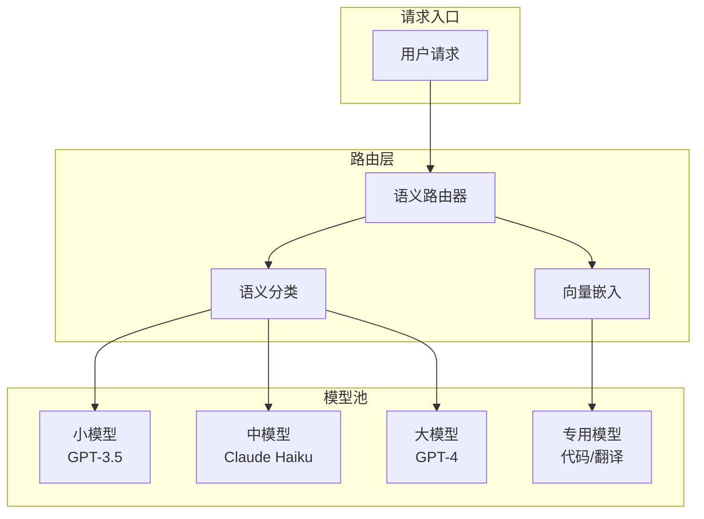

# 语义路由系统：智能请求分发

在实际的 LLM 应用中，不同类型的请求可能需要不同的处理方式：简单问题可以用小模型快速响应，复杂推理需要大模型。语义路由系统通过理解请求语义，智能地将请求分发到最合适的处理器。

## 为什么需要语义路由？

### 场景分析

```
用户请求多样性:
- "今天星期几？" → 简单事实，小模型即可
- "帮我写一篇关于量子计算的论文" → 复杂任务，需要强模型
- "翻译这段话成法语" → 特定任务，专用模型更好
- "分析这张图片" → 需要多模态模型
```

### 单一模型的问题

```
方案1: 所有请求用大模型
问题: 成本高，延迟大，简单问题杀鸡用牛刀

方案2: 所有请求用小模型  
问题: 复杂任务质量差

方案3: 智能路由
根据请求语义选择最合适的模型 ✓
```

### 收益分析

```
假设请求分布:
- 60% 简单问题（小模型可处理）
- 30% 中等问题（中模型处理）
- 10% 复杂问题（大模型处理）

不使用路由（全用大模型）:
成本 = 100% × 大模型成本

使用语义路由:
成本 = 60% × 小模型 + 30% × 中模型 + 10% × 大模型
     ≈ 30-40% 原成本

节省 60-70% 成本！
```

## 语义路由架构

### 整体设计



### 核心组件

**1. 语义理解模块**

将请求转换为语义表示：

```python
class SemanticEncoder:
    def __init__(self, model_name="sentence-transformers/all-MiniLM-L6-v2"):
        self.model = SentenceTransformer(model_name)
    
    def encode(self, text):
        """将文本编码为语义向量"""
        embedding = self.model.encode(text)
        return embedding
```

**2. 路由决策模块**

基于语义决定路由目标：

```python
class SemanticRouter:
    def __init__(self, encoder, routes):
        self.encoder = encoder
        self.routes = routes  # 路由规则
        self._build_route_embeddings()
    
    def _build_route_embeddings(self):
        """预计算路由规则的嵌入"""
        self.route_embeddings = {}
        for route in self.routes:
            examples = route['examples']
            embeddings = self.encoder.encode(examples)
            self.route_embeddings[route['name']] = embeddings.mean(axis=0)
    
    def route(self, query):
        """决定请求应该路由到哪里"""
        query_embedding = self.encoder.encode(query)
        
        best_route = None
        best_score = -1
        
        for route_name, route_embedding in self.route_embeddings.items():
            score = cosine_similarity(query_embedding, route_embedding)
            if score > best_score:
                best_score = score
                best_route = route_name
        
        return best_route, best_score
```

## 路由策略

### 基于相似度的路由

```python
# 定义路由规则
routes = [
    {
        "name": "simple_qa",
        "target_model": "gpt-3.5-turbo",
        "examples": [
            "今天是几号？",
            "北京的天气怎么样？",
            "1+1等于几？",
            "苹果是什么颜色？"
        ]
    },
    {
        "name": "coding",
        "target_model": "claude-3-sonnet",
        "examples": [
            "帮我写一个快速排序",
            "这段代码有什么bug？",
            "如何优化这个SQL查询？",
            "解释这个算法的时间复杂度"
        ]
    },
    {
        "name": "complex_reasoning",
        "target_model": "gpt-4",
        "examples": [
            "分析这篇论文的创新点",
            "比较这两种方法的优劣",
            "设计一个分布式系统架构",
            "帮我制定一个商业计划"
        ]
    }
]

router = SemanticRouter(encoder, routes)

# 路由请求
query = "帮我写一个二分查找的Python代码"
route, score = router.route(query)
# route = "coding", score = 0.85
```

### 基于分类器的路由

```python
class ClassifierRouter:
    def __init__(self, num_classes):
        self.classifier = nn.Sequential(
            nn.Linear(768, 256),
            nn.ReLU(),
            nn.Linear(256, num_classes)
        )
        self.class_to_model = {
            0: "gpt-3.5-turbo",
            1: "claude-3-sonnet", 
            2: "gpt-4"
        }
    
    def train(self, examples, labels):
        """训练分类器"""
        embeddings = self.encoder.encode(examples)
        # 训练分类器...
    
    def route(self, query):
        embedding = self.encoder.encode(query)
        logits = self.classifier(torch.tensor(embedding))
        pred_class = logits.argmax().item()
        return self.class_to_model[pred_class]
```

### 基于规则的路由

```python
class RuleBasedRouter:
    def __init__(self):
        self.rules = [
            {
                "pattern": r"翻译|translate",
                "model": "translation_model"
            },
            {
                "pattern": r"代码|code|编程|python|java",
                "model": "code_model"
            },
            {
                "pattern": r"图片|图像|image|看这张",
                "model": "vision_model"
            }
        ]
    
    def route(self, query):
        for rule in self.rules:
            if re.search(rule["pattern"], query, re.IGNORECASE):
                return rule["model"]
        return "default_model"
```

### 混合路由策略

```python
class HybridRouter:
    def __init__(self):
        self.rule_router = RuleBasedRouter()
        self.semantic_router = SemanticRouter(encoder, routes)
        self.classifier_router = ClassifierRouter(num_classes=5)
    
    def route(self, query):
        # 1. 先尝试规则匹配（最快）
        rule_result = self.rule_router.route(query)
        if rule_result != "default_model":
            return rule_result
        
        # 2. 语义相似度匹配
        semantic_route, score = self.semantic_router.route(query)
        if score > 0.8:  # 高置信度
            return semantic_route
        
        # 3. 分类器决策
        return self.classifier_router.route(query)
```

## 复杂度评估

### 基于请求复杂度路由

```python
class ComplexityRouter:
    def __init__(self):
        self.complexity_model = load_complexity_model()
    
    def estimate_complexity(self, query):
        """估计请求的复杂度"""
        features = {
            "length": len(query),
            "num_questions": query.count("？") + query.count("?"),
            "technical_terms": self.count_technical_terms(query),
            "reasoning_keywords": self.count_reasoning_keywords(query)
        }
        
        # 使用模型预测复杂度分数
        score = self.complexity_model.predict(features)
        return score  # 0-1 之间
    
    def route(self, query):
        complexity = self.estimate_complexity(query)
        
        if complexity < 0.3:
            return "gpt-3.5-turbo"  # 简单
        elif complexity < 0.7:
            return "claude-3-sonnet"  # 中等
        else:
            return "gpt-4"  # 复杂
```

### 多因素评估

```python
class MultiFactorRouter:
    def route(self, query, context=None):
        """综合多个因素决定路由"""
        factors = {
            "complexity": self.estimate_complexity(query),
            "urgency": self.estimate_urgency(query),
            "cost_sensitivity": context.get("cost_sensitive", False),
            "quality_requirement": context.get("quality_level", "normal"),
            "task_type": self.classify_task(query)
        }
        
        # 决策矩阵
        if factors["urgency"] == "high" and factors["task_type"] == "simple":
            return "fast_model"
        
        if factors["quality_requirement"] == "high":
            return "best_model"
        
        if factors["cost_sensitivity"]:
            return self.cheapest_adequate_model(factors["complexity"])
        
        return self.optimal_model(factors)
```

## 动态路由

### 负载感知路由

```python
class LoadAwareRouter:
    def __init__(self, models):
        self.models = models
        self.load_balancer = LoadBalancer()
    
    def route(self, query):
        # 获取基础路由决策
        base_route = self.semantic_route(query)
        
        # 检查目标模型负载
        target_load = self.load_balancer.get_load(base_route)
        
        if target_load > 0.9:  # 过载
            # 寻找替代模型
            alternatives = self.get_alternatives(base_route)
            for alt in alternatives:
                if self.load_balancer.get_load(alt) < 0.7:
                    return alt
        
        return base_route
```

### 质量反馈路由

```python
class FeedbackRouter:
    def __init__(self):
        self.route_scores = defaultdict(list)
    
    def route(self, query):
        """基于历史反馈调整路由"""
        candidates = self.get_candidate_models(query)
        
        # 计算每个模型的期望质量
        scores = {}
        for model in candidates:
            history = self.route_scores[model]
            if len(history) > 10:
                scores[model] = np.mean(history[-100:])
            else:
                scores[model] = 0.5  # 默认分数
        
        # 选择期望质量最高的模型
        return max(scores, key=scores.get)
    
    def record_feedback(self, model, score):
        """记录用户反馈"""
        self.route_scores[model].append(score)
```

## 实战：构建语义路由系统

### 使用 semantic-router 库

```python
from semantic_router import Route, SemanticRouter
from semantic_router.encoders import OpenAIEncoder

# 创建编码器
encoder = OpenAIEncoder()

# 定义路由
routes = [
    Route(
        name="chitchat",
        utterances=[
            "你好",
            "今天天气怎么样",
            "讲个笑话",
        ],
    ),
    Route(
        name="coding",
        utterances=[
            "写一个Python函数",
            "解释这段代码",
            "帮我调试这个bug",
        ],
    ),
    Route(
        name="analysis",
        utterances=[
            "分析这篇文章",
            "总结一下这个报告",
            "比较这两个方案",
        ],
    ),
]

# 创建路由器
router = SemanticRouter(encoder=encoder, routes=routes)

# 路由请求
result = router("帮我写一个排序算法")
print(result.name)  # "coding"
```

### 完整路由系统

```python
class LLMRoutingSystem:
    def __init__(self):
        self.encoder = SentenceTransformer("all-MiniLM-L6-v2")
        self.routes = self._init_routes()
        self.model_clients = self._init_clients()
    
    def _init_routes(self):
        return {
            "simple": {
                "model": "gpt-3.5-turbo",
                "examples": ["简单问题示例..."],
                "embedding": None  # 稍后计算
            },
            "coding": {
                "model": "claude-3-sonnet",
                "examples": ["代码问题示例..."],
                "embedding": None
            },
            "complex": {
                "model": "gpt-4",
                "examples": ["复杂问题示例..."],
                "embedding": None
            }
        }
    
    def _init_clients(self):
        return {
            "gpt-3.5-turbo": OpenAI(),
            "claude-3-sonnet": Anthropic(),
            "gpt-4": OpenAI(),
        }
    
    def _compute_route_embeddings(self):
        for route_name, route_config in self.routes.items():
            embeddings = self.encoder.encode(route_config["examples"])
            route_config["embedding"] = embeddings.mean(axis=0)
    
    def route(self, query):
        """路由决策"""
        query_embedding = self.encoder.encode(query)
        
        best_route = None
        best_score = -1
        
        for route_name, route_config in self.routes.items():
            score = cosine_similarity(
                query_embedding, 
                route_config["embedding"]
            )
            if score > best_score:
                best_score = score
                best_route = route_name
        
        return self.routes[best_route]["model"]
    
    def query(self, user_query):
        """处理用户请求"""
        # 1. 路由决策
        model_name = self.route(user_query)
        
        # 2. 调用对应模型
        client = self.model_clients[model_name]
        response = client.chat.completions.create(
            model=model_name,
            messages=[{"role": "user", "content": user_query}]
        )
        
        return {
            "model_used": model_name,
            "response": response.choices[0].message.content
        }

# 使用
system = LLMRoutingSystem()
result = system.query("帮我写一个Python快速排序")
print(f"使用模型: {result['model_used']}")
print(f"回复: {result['response']}")
```

## 路由优化

### 缓存优化

```python
class CachedRouter:
    def __init__(self, router, cache_size=10000):
        self.router = router
        self.cache = LRUCache(cache_size)
    
    def route(self, query):
        # 计算查询的哈希
        query_hash = hash(query)
        
        # 检查缓存
        if query_hash in self.cache:
            return self.cache[query_hash]
        
        # 计算路由
        result = self.router.route(query)
        
        # 更新缓存
        self.cache[query_hash] = result
        
        return result
```

### 批量路由

```python
class BatchRouter:
    def route_batch(self, queries):
        """批量路由以提高效率"""
        # 批量编码
        embeddings = self.encoder.encode(queries)
        
        # 批量计算相似度
        results = []
        for embedding in embeddings:
            scores = {}
            for route_name, route_embedding in self.route_embeddings.items():
                scores[route_name] = cosine_similarity(embedding, route_embedding)
            results.append(max(scores, key=scores.get))
        
        return results
```

## 监控与可观测性

```python
class MonitoredRouter:
    def __init__(self, router):
        self.router = router
        self.metrics = {
            "route_counts": defaultdict(int),
            "latencies": defaultdict(list),
            "error_counts": defaultdict(int)
        }
    
    def route(self, query):
        start_time = time.time()
        
        try:
            result = self.router.route(query)
            
            # 记录指标
            self.metrics["route_counts"][result] += 1
            self.metrics["latencies"][result].append(time.time() - start_time)
            
            return result
        except Exception as e:
            self.metrics["error_counts"]["routing"] += 1
            raise
    
    def get_stats(self):
        """获取路由统计"""
        return {
            "route_distribution": dict(self.metrics["route_counts"]),
            "avg_latencies": {
                k: np.mean(v) for k, v in self.metrics["latencies"].items()
            },
            "error_rate": sum(self.metrics["error_counts"].values())
        }
```

## 本章小结

- 语义路由通过理解请求语义，智能分发到最合适的模型
- 可以显著降低成本（60-70%）同时保持质量
- 路由策略：相似度匹配、分类器、规则、混合
- 动态路由考虑负载、质量反馈等因素
- 监控和可观测性对生产环境至关重要

## 延伸阅读

- semantic-router: https://github.com/aurelio-labs/semantic-router
- LLM Routing: A Survey
- Cost-Effective LLM Serving with Model Cascading

---

*恭喜你完成了 LLM 基础知识的全部学习！现在你已经掌握了从神经网络基础到推理优化、从训练技术到进阶话题的完整知识体系。*
