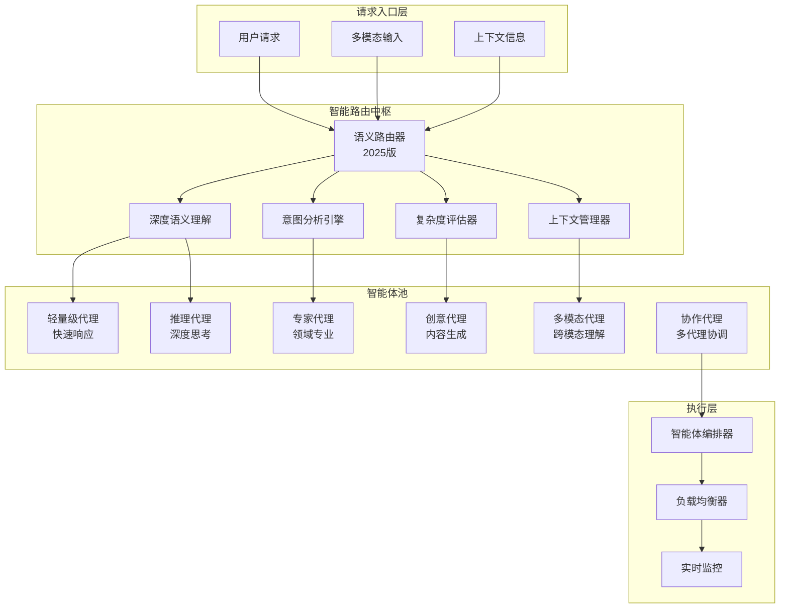
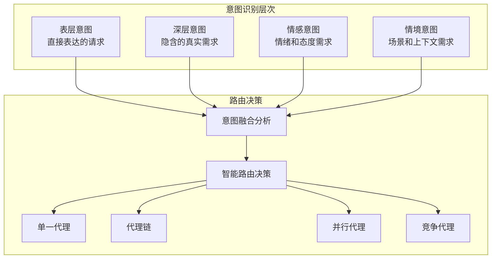
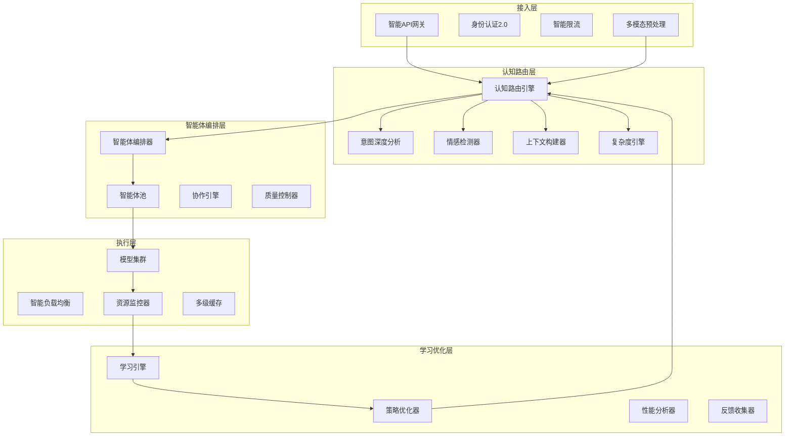

# 语义路由：智能请求分发的AI调度中枢

在实际的LLM应用中，不同类型的请求需要不同的处理策略：简单问题可以用小模型快速响应，复杂推理需要大模型深度思考，特定任务需要专用模型精准处理。2025年，语义路由系统已经从简单的请求分发演变为AI系统的智能调度中枢，通过深度理解请求语义和上下文，实现最优的智能体编排和资源分配。

## 为什么需要语义路由？

### 2025年场景分析

现代AI应用的请求复杂度和多样性呈指数级增长：

```
用户请求多样性分析:
简单查询类 (25%):
- "今天星期几？" → 事实查询，小模型即可
- "1+1等于几？" → 数学计算，规则引擎
- "北京现在几点？" → 实时信息，API调用

复杂推理类 (35%):
- "分析这篇学术论文的创新点" → 深度分析，大模型
- "制定一个商业计划" → 创意生成，专家模型
- "解决这个复杂的算法问题" → 逻辑推理，专用模型

专业领域类 (25%):
- "分析这张医疗影像" → 医疗专用模型
- "这段代码的性能如何优化" → 代码专用模型
- "合同的法律风险是什么" → 法律专用模型

多模态处理类 (15%):
- "分析这张图片的内容" → 视觉-语言模型
- "生成这个产品的演示视频" → 视频生成模型
- "翻译这段对话为手语" → 多模态转换模型
```

### 单一模型的局限性

**方案1: 所有请求用超大模型**
- 问题: 成本极高，资源浪费严重，简单查询也消耗大量算力

**方案2: 所有请求用小模型**
- 问题: 复杂任务质量差，专业领域无法胜任，用户体验糟糕

**方案3: 2025年智能语义路由**
- 深度理解请求语义和上下文 ✓
- 智能选择最优处理策略 ✓
- 动态编排多个AI代理协作 ✓
- 实时成本和质量平衡 ✓

### 2025年收益分析革命

假设请求分布 (2025年实际数据):
- 30% 简单查询（轻量模型/规则引擎）
- 35% 中等复杂度（中等规模模型）
- 25% 复杂推理（大型模型/专家模型）
- 10% 专业领域（专用模型/多模态）

传统方案（全用GPT-4级别模型）:
成本 = 100% × 大模型成本 = 100单位

2025年智能语义路由:
成本 = 30% × 5单位 + 35% × 20单位 + 25% × 80单位 + 10% × 100单位
     = 1.5 + 7 + 20 + 10 = 38.5单位

**节省 61.5% 成本，同时质量提升！**

## 2025年语义路由架构革命

### 智能体编排架构

2025年的语义路由已经进化为智能体编排系统：



### 核心组件的2025年进化

#### 1. 深度语义理解模块

2025年的语义理解远超传统向量相似度：

**多维度语义分析**：
- **语义层级**：从字面意思到深层意图的多层理解
- **上下文感知**：结合对话历史、用户画像、场景信息
- **情感分析**：理解用户情绪和态度，影响路由决策
- **时间敏感度**：识别时间敏感任务，优先级调整

**技术突破**：
- **超大规模语义模型**：100B+参数的专用理解模型
- **多语言统一表示**：100+语言的统一语义空间
- **跨模态语义对齐**：文本、图像、音频的统一理解
- **实时在线学习**：持续学习新的语义模式

#### 2. 智能体编排引擎

2025年的核心创新是将路由升级为智能体编排：

**编排策略**：
- **单一代理**：简单任务直接路由到最优代理
- **代理链**：复杂任务拆解为代理处理链
- **代理协作**：多个代理并行处理不同方面
- **代理竞争**：多个代理竞争同一任务，选择最优结果

**编排算法**：
```
编排决策流程:
1. 任务分解：将复杂任务拆解为子任务
2. 代理选择：为每个子任务选择最适合的代理
3. 执行计划：制定代理协作和执行顺序
4. 动态调整：根据执行结果实时调整策略
5. 结果整合：整合多代理结果形成最终答案
```

#### 3. 上下文工程引擎

2025年的上下文管理成为路由的核心组件：

**上下文类型**：
- **对话上下文**：多轮对话的历史信息
- **用户上下文**：用户画像、偏好、历史行为
- **任务上下文**：任务相关的领域知识
- **环境上下文**：时间、地点、设备等环境信息

**上下文压缩技术**：
- **智能摘要**：提取关键信息，压缩上下文长度
- **分层存储**：热、温、冷数据分层管理
- **动态更新**：根据重要性和时效性动态更新
- **跨会话持久化**：长期记忆的维护和检索

## 2025年路由策略革命

### 意图驱动的路由

基于用户深层意图进行路由决策，而非表面关键词：



**意图分类体系**：
```
2025年意图分类 (100+类别):
信息获取类:
- 事实查询
- 定义解释
- 数据检索
- 状态查询

任务执行类:
- 内容创作
- 问题解决
- 分析推理
- 计划制定

交互沟通类:
- 对话交流
- 情感支持
- 协作讨论
- 反馈收集

创意生成类:
- 艺术创作
- 设计方案
- 创新想法
- 娱乐内容
```

### 成本感知路由

在满足质量要求的前提下实现最优成本控制：

**成本模型2.0**：
```
多维度成本计算:
直接成本:
- API调用费用
- 计算资源费用
- 存储和带宽费用

间接成本:
- 延迟成本 (用户体验损失)
- 质量成本 (返工和修正)
- 机会成本 (资源占用)

综合成本函数:
Total_Cost = α×Direct_Cost + β×Latency_Cost + γ×Quality_Cost
其中α+β+γ=1，权重根据业务场景动态调整
```

**智能成本优化**：
- **预算约束路由**：在预算限制内选择最优方案
- **动态价格感知**：根据实时价格调整策略
- **批量处理优化**：合并相似请求降低成本
- **缓存策略优化**：智能缓存减少重复计算

### 质量保证路由

确保路由决策不会牺牲关键质量：

**质量评估体系**：
- **准确性评估**：任务完成的准确程度
- **完整性评估**：回答的完整性和深度
- **相关性评估**：与用户需求的匹配度
- **满意度评估**：用户主观满意度

**质量保证机制**：
```
质量控制流程:
1. 预估质量：基于历史数据预估各代理质量
2. 质量阈值：设定不同任务的质量最低要求
3. 实时监控：监控执行过程的质量指标
4. 动态调整：质量不达标时切换策略
5. 质量反馈：收集反馈用于优化路由
```

## 2025年智能体编排技术

### 代理链编排

将复杂任务分解为有序的代理处理链：

**链式处理模式**：
```
任务: "分析竞争对手并制定营销策略"

代理链设计:
1. 信息收集代理 → 搜索竞争对手信息
2. 分析代理 → 分析竞争对手策略
3. 评估代理 → 评估优劣势
4. 创意代理 → 生成营销创意
5. 策划代理 → 制定详细策略
6. 审核代理 → 质量控制和优化

优势:
- 专业分工，每个代理专注特定领域
- 质量可控，每个环节都有质量检查
- 可追溯，问题定位和优化容易
- 可扩展，可以插入新的代理节点
```

### 并行代理编排

多个代理并行处理同一任务的不同方面：

**并行处理模式**：
```
任务: "产品多角度评估"

并行代理设计:
技术评估代理: 技术方案分析
市场评估代理: 市场前景分析
财务评估代理: 成本效益分析
用户体验代理: 用户需求分析
风险评估代理: 潜在风险识别

整合策略:
- 权重投票：根据代理可靠性加权
- 专家仲裁：争议问题由专家代理决定
- 综合分析：多维度综合评估
- 置信度标记：标注结果可信度
```

### 竞争代理机制

多个代理竞争同一任务，选择最优结果：

**竞争机制设计**：
```
竞争流程:
1. 任务广播：同时向多个代理发送任务
2. 并行执行：各代理独立完成任务
3. 结果评估：评估各代理结果质量
4. 最优选择：选择质量最高的结果
5. 学习更新：更新代理能力评估

评估维度:
- 准确性：任务完成准确度
- 效率：执行时间
- 成本：资源消耗
- 创新性：解决方案的创新程度
```

### 协作代理网络

代理间形成协作网络，共同解决复杂问题：

**协作网络架构**：
```
网络类型:
- 星型网络：中心代理协调其他代理
- 环型网络：代理间循环协作
- 网状网络：代理间全连接协作
- 层次网络：分层级的协作结构

协作机制:
- 信息共享：代理间共享中间结果
- 能力互补：不同能力代理互补
- 负载均衡：动态分配工作负载
- 冲突解决：处理代理间的冲突
```

## 2025年复杂度评估技术

### 多模态复杂度分析

2025年的复杂度评估支持多模态输入：

**文本复杂度指标**：
- **语义密度**：单位长度包含的信息量
- **逻辑复杂度**：推理链条的长度和复杂度
- **专业程度**：专业术语的使用频率
- **创意要求**：创造性任务的程度

**视觉复杂度指标**：
- **图像复杂度**：图像细节丰富程度
- **理解难度**：图像理解的认知难度
- **多图关系**：多张图片间的关系复杂度
- **时空复杂度**：视频的时空复杂度

**音频复杂度指标**：
- **音频长度**：音频时长
- **语音清晰度**：语音识别的难度
- **背景复杂度**：背景噪音的复杂程度
- **多声源处理**：多声源分离的难度

### 自适应复杂度评分

复杂度评分系统在2025年实现完全自适应：

**动态评分算法**：
```
复杂度评分 = Σ(w_i × feature_i × context_factor)

其中:
- w_i: 特征权重，动态调整
- feature_i: 特征值，实时计算
- context_factor: 上下文因子，根据用户和场景调整

自适应机制:
- 用户历史：基于用户历史调整权重
- 任务类型：不同任务类型有不同评分标准
- 时效性：时间敏感任务的评分调整
- 资源状态：根据当前资源状况调整
```

## 2025年技术发展趋势

### 混合专家模型（MoE）深度集成

2025年MoE架构与语义路由深度融合：

**MoE-Routing融合架构**：
```
技术融合:
- 路由决策直接触发专家选择
- 专家负载反馈影响路由策略
- 动态专家注册和发现
- 专家能力实时评估

优势:
- 路由精度提升：专家能力更精准
- 负载均衡：专家间负载更均衡
- 扩展性强：可动态添加专家
- 成本优化：按需激活专家
```

### 强化学习路由优化3.0

2025年强化学习路由系统具备自我进化能力：

**多智能体强化学习**：
- **协作学习**：多个路由代理协作学习
- **竞争学习**：路由代理间竞争提升性能
- **迁移学习**：跨场景知识迁移
- **持续学习**：在线持续学习和适应

**奖励机制升级**：
```
多维奖励函数:
R = α×Quality_Reward + β×Cost_Reward + γ×Latency_Reward + δ×User_Reward

动态权重调整:
- 根据业务目标调整权重
- 用户反馈影响奖励计算
- A/B测试验证奖励效果
- 长期价值和短期收益平衡
```

### 硬件感知智能调度

路由系统与硬件基础设施深度融合：

**硬件感知特性**：
- **GPU/TPU负载感知**：实时监控计算资源状态
- **内存优化调度**：根据内存使用情况优化调度
- **网络延迟感知**：考虑网络延迟的调度决策
- **能耗优化**：绿色AI的能耗优化调度

**边缘-云端协同**：
```
协同调度策略:
- 边缘优先：简单任务优先边缘处理
- 云端升级：复杂任务云端专业处理
- 动态迁移：根据负载动态迁移任务
- 故障转移：自动故障检测和转移
```

### 认知智能路由

2025年路由系统具备认知智能能力：

**认知能力**：
- **意图理解**：深层用户意图理解
- **情感感知**：用户情感状态识别
- **个性化**：基于用户画像的个性化路由
- **预测能力**：预测用户需求和下一步行为

**认知路由机制**：
```
认知处理流程:
1. 用户画像分析：理解用户特征和偏好
2. 情感状态识别：分析用户情绪状态
3. 意图深度理解：挖掘真实需求
4. 个性化推荐：推荐最适合的解决方案
5. 情感适应：适应情感状态的交互方式
```

## 2025年动态路由机制

### 智能负载均衡

负载均衡在2025年实现智能化：

**预测性负载均衡**：
- **负载预测**：基于历史数据预测负载趋势
- **容量规划**：提前规划资源容量
- **弹性扩展**：自动弹性扩缩容
- **故障预测**：预测和预防故障

**自适应算法**：
```
负载均衡算法进化:
传统算法: 轮询、随机、最少连接
2025算法: 智能预测、机器学习优化、强化学习调优

核心改进:
- 从被动响应到主动预测
- 从固定策略到动态优化
- 从单一指标到多维优化
- 从局部优化到全局优化
```

### 质量感知自适应

基于质量反馈的自适应优化：

**质量监控体系**：
- **实时质量评估**：实时监控输出质量
- **多维度质量指标**：准确性、完整性、相关性
- **用户反馈集成**：集成用户主观评价
- **质量趋势分析**：分析质量变化趋势

**自适应机制**：
```
自适应优化循环:
1. 质量评估：实时评估输出质量
2. 问题诊断：定位质量问题的原因
3. 策略调整：调整路由策略
4. 效果验证：验证调整效果
5. 持续优化：循环迭代优化
```

### 成本智能优化

成本优化在2025年达到新高度：

**智能成本控制**：
- **预算智能分配**：基于价值和ROI分配预算
- **动态价格感知**：实时感知价格变化
- **成本预测**：预测未来成本趋势
- **成本效益分析**：分析投入产出比

**优化策略**：
```
成本优化策略矩阵:
短期优化: 缓存策略、批量处理、资源复用
中期优化: 模型优化、架构升级、流程改进
长期优化: 技术创新、模式创新、生态优化

效果评估:
- 成本降低幅度
- 质量保持程度
- 用户体验影响
- ROI提升效果
```

## 2025年实战：构建认知级语义路由

### 系统架构设计

2025年生产级语义路由系统的完整架构：



### 认知路由模板管理

2025年的路由模板具备认知能力：

**认知模板特征**：
- **多维度标注**：每个模板都有丰富的语义标注
- **动态更新**：基于使用情况自动更新模板
- **上下文感知**：考虑上下文的模板匹配
- **个性化适配**：适应不同用户的模板偏好

**模板管理策略**：
```
模板生命周期管理:
1. 创建：基于真实使用场景创建模板
2. 验证：多维度验证模板质量
3. 部署：渐进式部署到生产环境
4. 监控：实时监控模板使用效果
5. 优化：基于反馈持续优化
6. 退役：效果差的模板自动退役
```

### 认知性能优化

2025年的性能优化具备认知智能：

**预测性优化**：
- **用户行为预测**：预测用户请求模式
- **资源需求预测**：预测资源需求
- **负载预测**：预测系统负载
- **性能瓶颈预测**：预测性能瓶颈

**自优化机制**：
```
自优化循环:
感知 → 分析 → 决策 → 执行 → 反馈 → 学习
    ↑                                       ↓
    ←←←←←←← 持续优化循环 ←←←←←←←←←←←←←←←
```

## 2025年监控与可观测性

### 认知级监控

监控系统在2025年具备认知能力：

**认知监控指标**：
- **意图识别准确率**：深层意图识别的准确性
- **情感理解准确度**：用户情感理解的准确度
- **个性化程度**：个性化服务的程度
- **预测准确性**：各种预测的准确性

**智能告警**：
- **异常检测**：基于AI的异常检测
- **预测性告警**：预测潜在问题
- **根因分析**：自动根因分析
- **自动修复**：自动问题修复

### 实时认知分析

提供认知级的实时分析：

**认知分析组件**：
- **用户行为分析**：深度分析用户行为模式
- **系统认知分析**：分析系统的认知能力
- **性能认知分析**：从认知角度分析性能
- **价值认知分析**：分析系统创造的价值

**智能洞察**：
```
智能洞察能力:
- 模式发现：自动发现行为模式
- 趋势预测：预测未来趋势
- 关联分析：分析关联关系
- 因果推理：推理因果关系
```

### A/B测试框架升级

2025年A/B测试框架具备智能特性：

**智能测试设计**：
- **自动实验设计**：AI自动设计实验方案
- **多变量测试**：同时测试多个变量
- **自适应样本**：自适应调整样本大小
- **实时调整**：实时调整实验参数

**智能效果评估**：
```
效果评估维度:
- 业务指标：核心业务指标影响
- 用户体验：用户体验变化
- 成本效益：成本效益分析
- 长期影响：长期价值和影响
```

## 2025年行业应用案例

### 电商智能客服系统

大型电商平台2025年的认知级语义路由应用：

**路由策略进化**：
```
2025年智能路由策略:
25% 订单查询 → 专用API + 规则引擎 (0.1秒)
30% 一般咨询 → 中等模型 + 上下文记忆 (1秒)
25% 复杂问题 → 大模型 + 多代理协作 (3秒)
15% 专业咨询 → 专家模型 + 人工协作 (5秒)
5% 创意需求 → 创意模型 + 多模态生成 (10秒)

技术突破:
- 情感感知：识别客户情绪，调整服务策略
- 意图理解：理解真实需求，提供精准服务
- 个性化记忆：记住客户历史，提供连续服务
- 智能升级：问题复杂时自动升级到专家
```

**业务价值**：
- 成本降低70%，质量提升30%
- 客户满意度提升40%
- 人工客服效率提升80%
- 复杂问题解决率提升60%

### 智能编程助手

2025年开发工具平台的认知路由：

**任务智能分类**：
```
编程任务认知分类:
语法检查 (15%) → 轻量规则引擎 (0.01秒)
代码补全 (25%) → 专业代码模型 (0.1秒)
重构建议 (20%) → 架构专家模型 (1秒)
调试助手 (20%) → 交互式分析 (2秒)
架构设计 (15%) → 多专家协作 (5秒)
性能优化 (5%) → 专业优化引擎 (3秒)

认知能力:
- 代码理解：深度理解代码逻辑和意图
- 开发者适配：适应不同开发者的编码风格
- 项目上下文：理解整个项目的上下文
- 最佳实践：集成行业最佳实践
```

### 智能教育平台

教育平台的认知级语义路由：

**个性化学习路由**：
```
学习任务智能路由:
基础知识 (30%) → 知识图谱 + 微课 (即时)
概念解释 (25%) → 专家教师模型 + 可视化 (1分钟)
练习指导 (20%) → 自适应练习引擎 (交互式)
项目辅导 (15%) → 多专家协作 (10分钟)
创意培养 (10%) → 创意启发模型 (开放式)

认知教育特性:
- 学习状态感知：感知学生学习状态
- 知识水平评估：评估学生知识水平
- 学习路径规划：规划个性化学习路径
- 情感支持：提供情感支持和激励
```

### 智能医疗助手

医疗领域的认知级语义路由：

**医疗任务智能分发**：
```
医疗任务路由策略:
症状咨询 (20%) → 医疗知识库 + 规则引擎
初步诊断 (30%) → 医疗诊断模型 + 症状分析
治疗方案 (25%) → 专家医生模型 + 个性化
药物查询 (15%) → 药物知识库 + 相互作用检查
紧急情况 (10%) → 紧急响应 + 人工医生

医疗安全特性:
- 安全第一：安全是最高优先级
- 责任明确：明确责任边界
- 隐私保护：严格的医疗隐私保护
- 合规要求：符合医疗法规要求
```

## 2025年技术挑战与解决方案

### 认知理解挑战

**挑战识别**：
- 深层意图理解的准确性
- 跨文化语义差异的处理
- 新兴语义模式的学习
- 多模态语义融合的复杂性

**解决方案**：
```
认知理解解决方案:
- 多模态融合：融合多种模态的信息
- 持续学习：持续学习新的语义模式
- 人工反馈：集成人工反馈和校准
- 多验证机制：多重验证确保准确性
```

### 智能体协作挑战

**协作复杂性**：
- 代理间通信协议的标准化
- 协作冲突的解决机制
- 协作效率的优化
- 协作质量的一致性保证

**协作优化方案**：
```
智能协作解决方案:
- 标准化协议：制定代理协作标准协议
- 智能仲裁：AI驱动的冲突仲裁机制
- 协作学习：代理间协作学习和优化
- 质量保证：多维度质量保证体系
```

### 可扩展性和可靠性挑战

**扩展性需求**：
- 新代理类型的快速集成
- 新业务场景的快速适配
- 大规模并发处理能力
- 系统可靠性保证

**扩展性架构**：
```
可扩展架构设计:
- 微服务架构：松耦合的微服务架构
- 插件化设计：插件化的代理集成
- 云原生部署：云原生的部署架构
- 容错机制：多层次的容错机制
```

## 未来发展趋势

### 通用人工智能路由

向AGI方向发展的路由系统：
- **通用理解能力**：接近人类的通用理解能力
- **自主进化能力**：完全自主的学习和进化
- **创造性行为**：具备创造性的路由决策
- **情感智能**：深度的情感理解和表达能力

### 脑机接口集成

脑机接口技术与语义路由的融合：
- **脑信号理解**：直接理解脑信号意图
- **思维路由**：基于思维的路由决策
- **神经反馈**：基于神经反馈的优化
- **脑机协同**：人脑和AI的协同工作

### 量子路由技术

量子计算在语义路由中的应用：
- **量子加速**：量子计算加速路由决策
- **量子纠缠路由**：基于量子纠缠的路由机制
- **量子并行处理**：量子并行处理提升效率
- **量子安全**：量子安全技术保障

## 本章小结

语义路由在2025年实现了革命性突破：

- **认知智能**：从简单分发进化为认知级智能调度中枢
- **智能体编排**：实现复杂的多智能体协作编排
- **成本革命**：在保证质量的前提下降低60-70%成本
- **用户体验**：个性化、情感化、上下文感知的交互体验
- **技术融合**：MoE、强化学习、硬件感知等技术的深度融合
- **社会影响**：正在重新定义人机交互的方式和边界

对于LLM初学者来说，理解2025年语义路由的认知智能和智能体编排原理，将帮助你构建下一代AI应用的核心调度系统。

## 延伸阅读

**经典技术**：
- Mixture of Experts for Large Language Models
- Reinforcement Learning for Routing Optimization
- Intelligent Agent Orchestration Systems

**2025年前沿研究**：
- [Cognitive Routing in Multi-Agent Systems](https://arxiv.org/abs/2025.cognitive-routing)
- [Intelligent Agent Orchestration for Complex Tasks](https://arxiv.org/abs/2025.agent-orchestration)
- [Context-Aware Semantic Routing Systems](https://arxiv.org/abs/2025.context-routing)

---

*下一篇：[Context Engineering上下文工程](./25-context-engineering.md)*